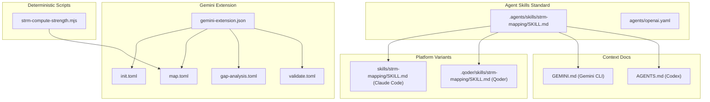
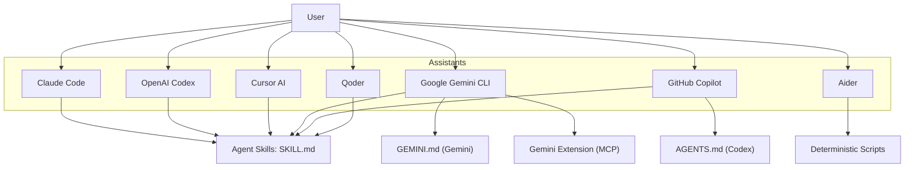
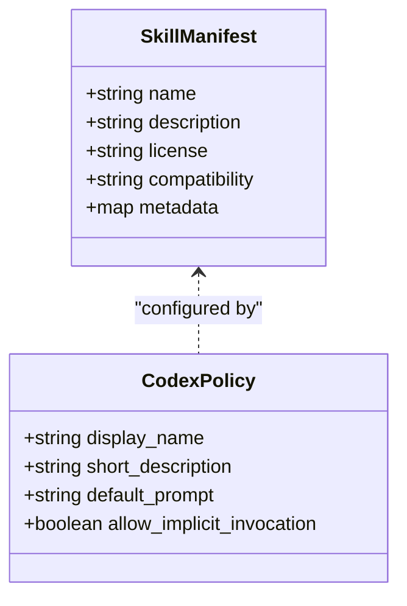
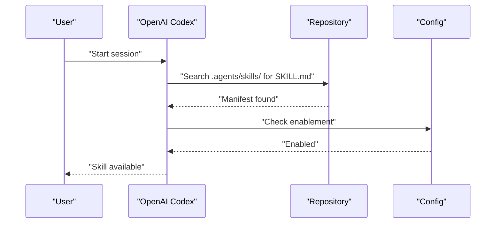
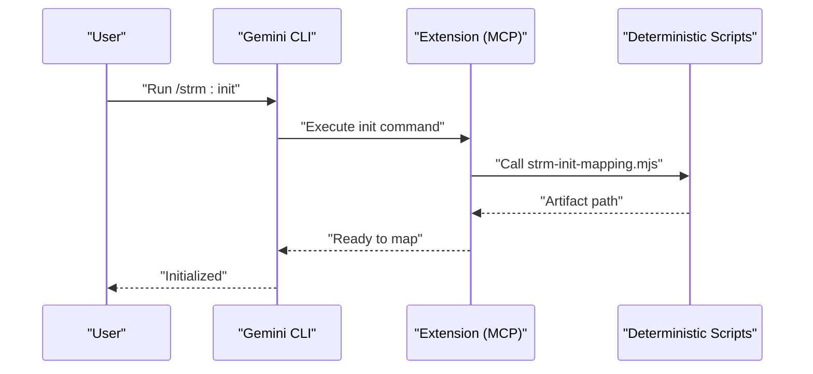
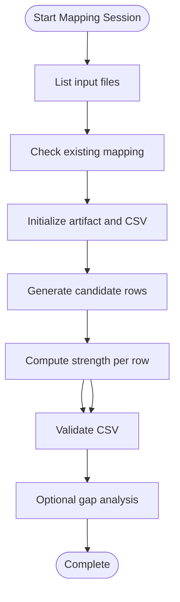
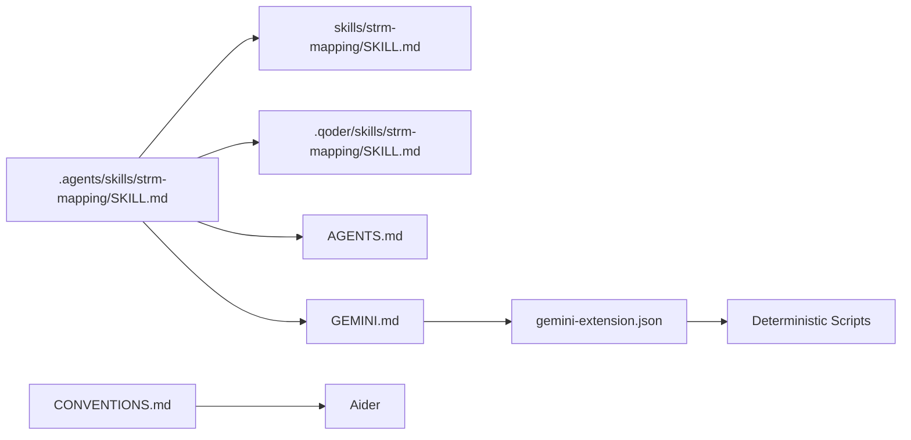

# AI Assistant Platform Integration

<cite>
**Referenced Files in This Document**
- [PLATFORM-COMPATIBILITY.md](file://platform-skills/PLATFORM-COMPATIBILITY.md)
- [.agents/skills/strm-mapping/SKILL.md](file://.agents/skills/strm-mapping/SKILL.md)
- [skills/strm-mapping/SKILL.md](file://skills/strm-mapping/SKILL.md)
- [.agents/skills/strm-mapping/agents/openai.yaml](file://.agents/skills/strm-mapping/agents/openai.yaml)
- [AGENTS.md](file://AGENTS.md)
- [GEMINI.md](file://GEMINI.md)
- [gemini-extension.json](file://gemini-extension/gemini-extension.json)
- [.github/copilot-instructions.md](file://.github/copilot-instructions.md)
- [.qoder/skills/strm-mapping/SKILL.md](file://.qoder/skills/strm-mapping/SKILL.md)
- [CONVENTIONS.md](file://CONVENTIONS.md)
- [gemini-extension/commands/strm/init.toml](file://gemini-extension/commands/strm/init.toml)
- [gemini-extension/commands/strm/map.toml](file://gemini-extension/commands/strm/map.toml)
- [gemini-extension/commands/strm/gap-analysis.toml](file://gemini-extension/commands/strm/gap-analysis.toml)
- [gemini-extension/commands/strm/validate.toml](file://gemini-extension/commands/strm/validate.toml)
- [scripts/bin/strm-compute-strength.mjs](file://scripts/bin/strm-compute-strength.mjs)
</cite>

## Table of Contents
1. [Introduction](#introduction)
2. [Project Structure](#project-structure)
3. [Core Components](#core-components)
4. [Architecture Overview](#architecture-overview)
5. [Detailed Component Analysis](#detailed-component-analysis)
6. [Dependency Analysis](#dependency-analysis)
7. [Performance Considerations](#performance-considerations)
8. [Troubleshooting Guide](#troubleshooting-guide)
9. [Conclusion](#conclusion)
10. [Appendices](#appendices)

## Introduction
This document explains how to deploy and operate the STRM Mapping toolkit across multiple AI assistant platforms using a unified, standards-based approach. It focuses on:
- The Agent Skills standard for universal compatibility
- Platform-specific installation and configuration for Claude Code, OpenAI Codex, Cursor AI, Google Gemini CLI, GitHub Copilot, Qoder, and Aider
- Skill manifest files, parameter specifications, and execution contexts
- Cross-platform deterministic scripting layer for portability
- Troubleshooting, migration guidance, and best practices for consistent user experience

## Project Structure
The repository organizes integration assets by platform and execution mode:
- Agent Skills standard: `.agents/skills/strm-mapping/SKILL.md` (canonical)
- Platform-specific variants:
  - Claude Code: `skills/strm-mapping/SKILL.md`
  - Qoder: `.qoder/skills/strm-mapping/SKILL.md`
- Project context and methodology:
  - AGENTS.md (project-level context for Codex)
  - GEMINI.md (persistent methodology context for Gemini CLI)
- Gemini extension (MCP server) with slash commands
- Aider conventions file
- Deterministic CLI scripts for cross-platform operations



**Diagram sources**
- [PLATFORM-COMPATIBILITY.md:109-133](file://platform-skills/PLATFORM-COMPATIBILITY.md#L109-L133)
- [.agents/skills/strm-mapping/SKILL.md:1-11](file://.agents/skills/strm-mapping/SKILL.md#L1-L11)
- [.agents/skills/strm-mapping/agents/openai.yaml:1-8](file://.agents/skills/strm-mapping/agents/openai.yaml#L1-L8)
- [GEMINI.md:1-5](file://GEMINI.md#L1-L5)
- [AGENTS.md:1-11](file://AGENTS.md#L1-L11)
- [gemini-extension.json:1-13](file://gemini-extension/gemini-extension.json#L1-L13)
- [gemini-extension/commands/strm/init.toml:1-14](file://gemini-extension/commands/strm/init.toml#L1-L14)
- [gemini-extension/commands/strm/map.toml:1-20](file://gemini-extension/commands/strm/map.toml#L1-L20)
- [gemini-extension/commands/strm/gap-analysis.toml:1-19](file://gemini-extension/commands/strm/gap-analysis.toml#L1-L19)
- [gemini-extension/commands/strm/validate.toml:1-18](file://gemini-extension/commands/strm/validate.toml#L1-L18)
- [scripts/bin/strm-compute-strength.mjs:1-20](file://scripts/bin/strm-compute-strength.mjs#L1-L20)

**Section sources**
- [PLATFORM-COMPATIBILITY.md:40-54](file://platform-skills/PLATFORM-COMPATIBILITY.md#L40-L54)
- [PLATFORM-COMPATIBILITY.md:109-133](file://platform-skills/PLATFORM-COMPATIBILITY.md#L109-L133)
- [PLATFORM-COMPATIBILITY.md:180-246](file://platform-skills/PLATFORM-COMPATIBILITY.md#L180-L246)
- [PLATFORM-COMPATIBILITY.md:248-298](file://platform-skills/PLATFORM-COMPATIBILITY.md#L248-L298)
- [PLATFORM-COMPATIBILITY.md:300-336](file://platform-skills/PLATFORM-COMPATIBILITY.md#L300-L336)
- [PLATFORM-COMPATIBILITY.md:339-363](file://platform-skills/PLATFORM-COMPATIBILITY.md#L339-L363)

## Core Components
- Agent Skills standard manifest: Defines skill identity, description, licensing, compatibility, and metadata. Used by Claude Code, OpenAI Codex, Cursor, Gemini CLI, GitHub Copilot, and others.
- Platform-specific variants:
  - Claude Code: Copy to user skill directory; includes platform-specific wording.
  - Qoder: Project-level or user-level skill discovery; includes platform-specific wording.
- Project context docs:
  - AGENTS.md: Codex project-level context injected before tasks.
  - GEMINI.md: Persistent methodology context for Gemini CLI.
- Gemini extension: MCP server with slash commands and deterministic tools.
- Aider conventions: Plain Markdown for explicit loading in Aider sessions.
- Deterministic scripts: Cross-platform CLI utilities for mapping operations.

**Section sources**
- [PLATFORM-COMPATIBILITY.md:9-14](file://platform-skills/PLATFORM-COMPATIBILITY.md#L9-L14)
- [PLATFORM-COMPATIBILITY.md:59-98](file://platform-skills/PLATFORM-COMPATIBILITY.md#L59-L98)
- [PLATFORM-COMPATIBILITY.md:109-133](file://platform-skills/PLATFORM-COMPATIBILITY.md#L109-L133)
- [PLATFORM-COMPATIBILITY.md:180-246](file://platform-skills/PLATFORM-COMPATIBILITY.md#L180-L246)
- [PLATFORM-COMPATIBILITY.md:248-298](file://platform-skills/PLATFORM-COMPATIBILITY.md#L248-L298)
- [PLATFORM-COMPATIBILITY.md:300-336](file://platform-skills/PLATFORM-COMPATIBILITY.md#L300-L336)
- [PLATFORM-COMPATIBILITY.md:339-363](file://platform-skills/PLATFORM-COMPATIBILITY.md#L339-L363)

## Architecture Overview
The integration architecture centers on the Agent Skills standard with complementary context and extension layers:
- Agent Skills standard: YAML frontmatter + Markdown body; auto-discovered by compatible assistants.
- Project context docs: Injected proactively (Codex, Copilot) or concatenated hierarchically (Gemini CLI).
- Extension layer (Gemini): MCP server exposing deterministic tools and slash commands.
- Deterministic scripts: Shared CLI utilities enabling consistent operations across platforms.



**Diagram sources**
- [PLATFORM-COMPATIBILITY.md:40-54](file://platform-skills/PLATFORM-COMPATIBILITY.md#L40-L54)
- [AGENTS.md:1-11](file://AGENTS.md#L1-L11)
- [GEMINI.md:1-5](file://GEMINI.md#L1-L5)
- [gemini-extension.json:1-13](file://gemini-extension/gemini-extension.json#L1-L13)

## Detailed Component Analysis

### Agent Skills Standard Implementation
- Manifest structure: YAML frontmatter with name, description, license, compatibility, and metadata; Markdown body with workflow and rules.
- Discovery and activation:
  - Auto-discovery from `.agents/skills/` and `~/.agents/skills/` (and platform-specific paths).
  - Activation via explicit mention or implicit trigger based on description.
- Codex-specific metadata: Additional display name, short description, default prompt, and invocation policy.
- Methodology consistency: All platforms mirror the same methodology and CSV format.



**Diagram sources**
- [.agents/skills/strm-mapping/SKILL.md:1-11](file://.agents/skills/strm-mapping/SKILL.md#L1-L11)
- [.agents/skills/strm-mapping/agents/openai.yaml:1-8](file://.agents/skills/strm-mapping/agents/openai.yaml#L1-L8)

**Section sources**
- [PLATFORM-COMPATIBILITY.md:59-98](file://platform-skills/PLATFORM-COMPATIBILITY.md#L59-L98)
- [PLATFORM-COMPATIBILITY.md:99-106](file://platform-skills/PLATFORM-COMPATIBILITY.md#L99-L106)
- [.agents/skills/strm-mapping/SKILL.md:1-11](file://.agents/skills/strm-mapping/SKILL.md#L1-L11)
- [.agents/skills/strm-mapping/agents/openai.yaml:1-8](file://.agents/skills/strm-mapping/agents/openai.yaml#L1-L8)

### Claude Code Integration
- Install by copying the skill to the user skills directory; auto-discovery from user and repo-level locations.
- Working directory and activation behavior mirror the standard with platform-specific wording.

```mermaid
sequenceDiagram
participant User as "User"
participant CC as "Claude Code"
participant FS as "Filesystem"
User->>CC : "Open Claude Code from repo root"
CC->>FS : "Discover ~/.claude/skills/strm-mapping/"
FS-->>CC : "Skill manifest"
CC-->>User : "Skill ready; invoke via Skill tool"
```

**Diagram sources**
- [PLATFORM-COMPATIBILITY.md:117-122](file://platform-skills/PLATFORM-COMPATIBILITY.md#L117-L122)
- [skills/strm-mapping/SKILL.md:26-38](file://skills/strm-mapping/SKILL.md#L26-L38)

**Section sources**
- [PLATFORM-COMPATIBILITY.md:109-133](file://platform-skills/PLATFORM-COMPATIBILITY.md#L109-L133)
- [skills/strm-mapping/SKILL.md:26-38](file://skills/strm-mapping/SKILL.md#L26-L38)

### OpenAI Codex Integration
- Two mechanisms:
  - Agent Skill: auto-discovered from `.agents/skills/` and other configured locations; can be enabled/disabled in config.
  - Project context doc: AGENTS.md injected before every task execution.
- Invocation: explicit or implicit activation based on description.



**Diagram sources**
- [PLATFORM-COMPATIBILITY.md:136-178](file://platform-skills/PLATFORM-COMPATIBILITY.md#L136-L178)
- [.agents/skills/strm-mapping/SKILL.md:1-11](file://.agents/skills/strm-mapping/SKILL.md#L1-L11)

**Section sources**
- [PLATFORM-COMPATIBILITY.md:136-178](file://platform-skills/PLATFORM-COMPATIBILITY.md#L136-L178)
- [AGENTS.md:1-11](file://AGENTS.md#L1-L11)

### Cursor AI Integration
- Auto-discovers from `.agents/skills/`, `.cursor/skills/`, and `~/.cursor/skills/`.
- Optional: disable model invocation to turn the skill into a slash command.

**Section sources**
- [PLATFORM-COMPATIBILITY.md:280-298](file://platform-skills/PLATFORM-COMPATIBILITY.md#L280-L298)
- [.agents/skills/strm-mapping/SKILL.md:1-11](file://.agents/skills/strm-mapping/SKILL.md#L1-L11)

### Google Gemini CLI Integration
- Three integration levels:
  - Agent Skill: auto-discovered; progressive disclosure of content.
  - Context file: GEMINI.md concatenated from current directory up to git root.
  - Extension (MCP): slash commands and deterministic tools.
- Deterministic scripts: used by extension commands and available for direct invocation.



**Diagram sources**
- [PLATFORM-COMPATIBILITY.md:180-246](file://platform-skills/PLATFORM-COMPATIBILITY.md#L180-L246)
- [gemini-extension.json:1-13](file://gemini-extension/gemini-extension.json#L1-L13)
- [gemini-extension/commands/strm/init.toml:1-14](file://gemini-extension/commands/strm/init.toml#L1-L14)

**Section sources**
- [PLATFORM-COMPATIBILITY.md:180-246](file://platform-skills/PLATFORM-COMPATIBILITY.md#L180-L246)
- [GEMINI.md:1-5](file://GEMINI.md#L1-L5)
- [gemini-extension.json:1-13](file://gemini-extension/gemini-extension.json#L1-L13)

### GitHub Copilot Integration
- Repo-wide instructions injected for all Copilot Chat interactions.
- Agent Skills standard supported via `.agents/skills/` as an alternative on-demand activation.

**Section sources**
- [PLATFORM-COMPATIBILITY.md:248-298](file://platform-skills/PLATFORM-COMPATIBILITY.md#L248-L298)
- [.github/copilot-instructions.md:1-106](file://.github/copilot-instructions.md#L1-L106)

### Qoder Integration
- Auto-discovers from `.qoder/skills/` (project-level) and `~/.qoder/skills/` (user-level).
- Mirrors the standard skill with platform-specific wording and optional user-level installation.

**Section sources**
- [PLATFORM-COMPATIBILITY.md:300-336](file://platform-skills/PLATFORM-COMPATIBILITY.md#L300-L336)
- [.qoder/skills/strm-mapping/SKILL.md:1-11](file://.qoder/skills/strm-mapping/SKILL.md#L1-L11)

### Aider Integration
- Does not implement Agent Skills; uses CONVENTIONS.md as the integration point.
- Explicit load required via command-line or configuration.

**Section sources**
- [PLATFORM-COMPATIBILITY.md:339-363](file://platform-skills/PLATFORM-COMPATIBILITY.md#L339-L363)
- [CONVENTIONS.md:1-186](file://CONVENTIONS.md#L1-L186)

### Deterministic Script Layer
- Shared CLI utilities for cross-platform portability:
  - Compute strength
  - Generate filenames
  - Build CSV headers
  - List input files
  - Check existing mappings
  - Initialize mappings
  - Validate CSV
  - Generate gap reports



**Diagram sources**
- [gemini-extension/commands/strm/map.toml:1-20](file://gemini-extension/commands/strm/map.toml#L1-L20)
- [gemini-extension/commands/strm/gap-analysis.toml:1-19](file://gemini-extension/commands/strm/gap-analysis.toml#L1-L19)
- [scripts/bin/strm-compute-strength.mjs:1-20](file://scripts/bin/strm-compute-strength.mjs#L1-L20)

**Section sources**
- [PLATFORM-COMPATIBILITY.md:229-246](file://platform-skills/PLATFORM-COMPATIBILITY.md#L229-L246)
- [gemini-extension/commands/strm/map.toml:1-20](file://gemini-extension/commands/strm/map.toml#L1-L20)
- [gemini-extension/commands/strm/gap-analysis.toml:1-19](file://gemini-extension/commands/strm/gap-analysis.toml#L1-L19)
- [scripts/bin/strm-compute-strength.mjs:1-20](file://scripts/bin/strm-compute-strength.mjs#L1-L20)

## Dependency Analysis
- Canonical source of truth: `.agents/skills/strm-mapping/SKILL.md`
- Platform-specific mirrors:
  - Claude Code: `skills/strm-mapping/SKILL.md`
  - Qoder: `.qoder/skills/strm-mapping/SKILL.md`
- Supporting context:
  - AGENTS.md for Codex
  - GEMINI.md for Gemini CLI
- Extension depends on deterministic scripts for tooling
- Aider depends on CONVENTIONS.md



**Diagram sources**
- [PLATFORM-COMPATIBILITY.md:385-401](file://platform-skills/PLATFORM-COMPATIBILITY.md#L385-L401)
- [AGENTS.md:1-11](file://AGENTS.md#L1-L11)
- [GEMINI.md:1-5](file://GEMINI.md#L1-L5)
- [gemini-extension.json:1-13](file://gemini-extension/gemini-extension.json#L1-L13)
- [CONVENTIONS.md:1-186](file://CONVENTIONS.md#L1-L186)

**Section sources**
- [PLATFORM-COMPATIBILITY.md:385-401](file://platform-skills/PLATFORM-COMPATIBILITY.md#L385-L401)

## Performance Considerations
- Progressive disclosure: Only metadata loads at startup; full skill content loads on activation to reduce token usage.
- Deterministic scripts: Prefer deterministic operations to minimize variability across platforms.
- Context injection: Keep AGENTS.md and GEMINI.md concise to avoid unnecessary prompt overhead.
- Explicit activation: Use explicit triggers to avoid unnecessary model invocations.

[No sources needed since this section provides general guidance]

## Troubleshooting Guide
Common issues and resolutions:
- Skill not found:
  - Verify auto-discovery paths for the platform (e.g., Claude Code user skills directory, Qoder project/user-level paths).
- Incorrect working directory:
  - Ensure the assistant is started from the repository root so relative paths resolve correctly.
- Conflicts between platform variants:
  - Keep `.agents/skills/strm-mapping/SKILL.md` canonical; update platform-specific mirrors accordingly.
- Extension not linked (Gemini):
  - Link the extension and restart the CLI; verify MCP server command and arguments.
- Aider not loading context:
  - Load CONVENTIONS.md explicitly or configure Aider to read it.

**Section sources**
- [PLATFORM-COMPATIBILITY.md:117-122](file://platform-skills/PLATFORM-COMPATIBILITY.md#L117-L122)
- [PLATFORM-COMPATIBILITY.md:315-321](file://platform-skills/PLATFORM-COMPATIBILITY.md#L315-L321)
- [GEMINI.md:27-35](file://GEMINI.md#L27-L35)
- [gemini-extension.json:5-11](file://gemini-extension/gemini-extension.json#L5-L11)
- [CONVENTIONS.md:3-13](file://CONVENTIONS.md#L3-L13)

## Conclusion
By adhering to the Agent Skills standard and leveraging platform-specific integration points, the STRM Mapping toolkit achieves universal compatibility across Claude Code, OpenAI Codex, Cursor AI, Google Gemini CLI, GitHub Copilot, Qoder, and Aider. The deterministic script layer ensures consistent behavior, while context documents and extension capabilities tailor the experience to each platform’s strengths.

[No sources needed since this section summarizes without analyzing specific files]

## Appendices

### Skill Manifest Fields and Constraints
- name: lowercase, hyphenated; must match parent directory
- description: 1–1024 chars; describes purpose and triggers
- license: optional
- compatibility: environment/product notes
- metadata: arbitrary key-value (author, version, methodology, standard)
- Body: Markdown; progressive disclosure on activation

**Section sources**
- [PLATFORM-COMPATIBILITY.md:25-37](file://platform-skills/PLATFORM-COMPATIBILITY.md#L25-L37)
- [.agents/skills/strm-mapping/SKILL.md:1-11](file://.agents/skills/strm-mapping/SKILL.md#L1-L11)

### Parameter Specifications for Execution Contexts
- Source (Focal) Document: framework/catalog being mapped FROM
- Target (Reference) Document: framework/catalog being mapped TO
- Bridge Framework: optional; defaults to focal for direct mappings

**Section sources**
- [.agents/skills/strm-mapping/SKILL.md:78-91](file://.agents/skills/strm-mapping/SKILL.md#L78-L91)
- [gemini-extension/commands/strm/init.toml:4-7](file://gemini-extension/commands/strm/init.toml#L4-L7)

### Migration Guidance Between Platforms
- Update the canonical manifest first; propagate changes to platform-specific variants.
- Maintain identical methodology and CSV format across all variants.
- Keep context documents synchronized for Codex and Gemini.

**Section sources**
- [PLATFORM-COMPATIBILITY.md:385-401](file://platform-skills/PLATFORM-COMPATIBILITY.md#L385-L401)