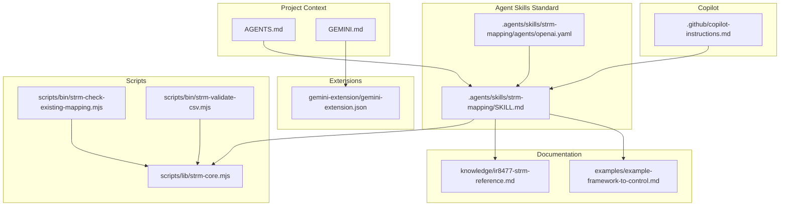
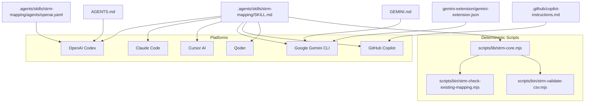
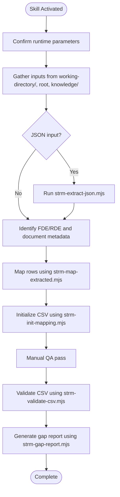
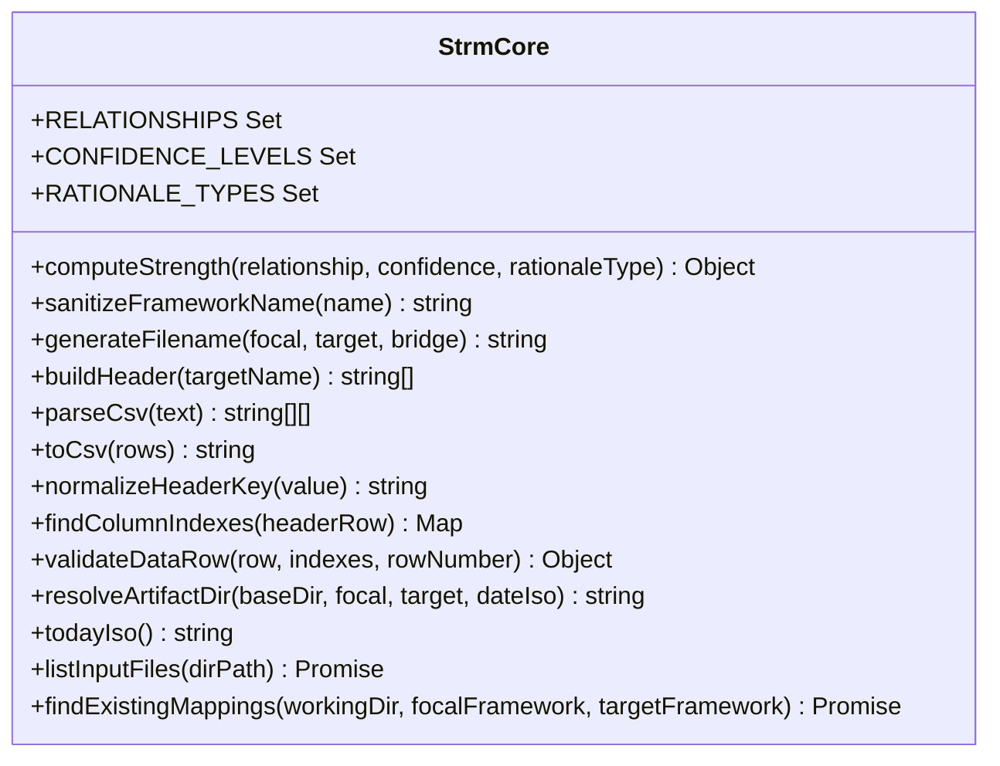

# Agent Skills Standard Implementation

<cite>
**Referenced Files in This Document**
- [.agents/skills/strm-mapping/SKILL.md](file://.agents/skills/strm-mapping/SKILL.md)
- [.agents/skills/strm-mapping/agents/openai.yaml](file://.agents/skills/strm-mapping/agents/openai.yaml)
- [AGENTS.md](file://AGENTS.md)
- [GEMINI.md](file://GEMINI.md)
- [gemini-extension/gemini-extension.json](file://gemini-extension/gemini-extension.json)
- [.github/copilot-instructions.md](file://.github/copilot-instructions.md)
- [platform-skills/PLATFORM-COMPATIBILITY.md](file://platform-skills/PLATFORM-COMPATIBILITY.md)
- [skills/strm-mapping/SKILL.md](file://skills/strm-mapping/SKILL.md)
- [scripts/lib/strm-core.mjs](file://scripts/lib/strm-core.mjs)
- [scripts/bin/strm-check-existing-mapping.mjs](file://scripts/bin/strm-check-existing-mapping.mjs)
- [scripts/bin/strm-validate-csv.mjs](file://scripts/bin/strm-validate-csv.mjs)
- [knowledge/ir8477-strm-reference.md](file://knowledge/ir8477-strm-reference.md)
- [examples/example-framework-to-control.md](file://examples/example-framework-to-control.md)
</cite>

## Table of Contents
1. [Introduction](#introduction)
2. [Project Structure](#project-structure)
3. [Core Components](#core-components)
4. [Architecture Overview](#architecture-overview)
5. [Detailed Component Analysis](#detailed-component-analysis)
6. [Dependency Analysis](#dependency-analysis)
7. [Performance Considerations](#performance-considerations)
8. [Troubleshooting Guide](#troubleshooting-guide)
9. [Conclusion](#conclusion)
10. [Appendices](#appendices)

## Introduction
This document describes the Agent Skills Standard Implementation for the STRM toolkit, which enables universal compatibility across multiple AI assistants using the Agent Skills open standard. It defines the SKILL.md specification, parameterization, execution contexts, YAML configuration for platforms, and the deterministic script layer that ensures consistent behavior across Claude Code, OpenAI Codex, Cursor, Gemini CLI, GitHub Copilot, Qoder, and others. It also documents the universal skill interface, parameter validation, response formatting, and cross-platform deployment patterns.

## Project Structure
The repository organizes the Agent Skills standard around a canonical skill definition and complementary platform-specific configurations and scripts:
- Canonical Agent Skills skill: .agents/skills/strm-mapping/SKILL.md
- Platform-specific metadata for OpenAI Codex: .agents/skills/strm-mapping/agents/openai.yaml
- Project context for OpenAI Codex: AGENTS.md
- Persistent context for Gemini CLI: GEMINI.md
- Gemini extension configuration: gemini-extension/gemini-extension.json
- Copilot repository instructions: .github/copilot-instructions.md
- Platform compatibility matrix: platform-skills/PLATFORM-COMPATIBILITY.md
- Claude Code skill copy: skills/strm-mapping/SKILL.md
- Deterministic scripts and shared core: scripts/bin/* and scripts/lib/strm-core.mjs
- Methodology reference: knowledge/ir8477-strm-reference.md
- Example mapping: examples/example-framework-to-control.md

**Diagram sources**
- [.agents/skills/strm-mapping/SKILL.md:1-442](file://.agents/skills/strm-mapping/SKILL.md#L1-L442)
- [.agents/skills/strm-mapping/agents/openai.yaml:1-8](file://.agents/skills/strm-mapping/agents/openai.yaml#L1-L8)
- [AGENTS.md:1-141](file://AGENTS.md#L1-L141)
- [GEMINI.md:1-232](file://GEMINI.md#L1-L232)
- [gemini-extension/gemini-extension.json:1-13](file://gemini-extension/gemini-extension.json#L1-L13)
- [.github/copilot-instructions.md:1-106](file://.github/copilot-instructions.md#L1-L106)
- [platform-skills/PLATFORM-COMPATIBILITY.md:1-401](file://platform-skills/PLATFORM-COMPATIBILITY.md#L1-L401)
- [skills/strm-mapping/SKILL.md:1-442](file://skills/strm-mapping/SKILL.md#L1-L442)
- [scripts/lib/strm-core.mjs:1-343](file://scripts/lib/strm-core.mjs#L1-L343)
- [scripts/bin/strm-check-existing-mapping.mjs:1-20](file://scripts/bin/strm-check-existing-mapping.mjs#L1-L20)
- [scripts/bin/strm-validate-csv.mjs:1-146](file://scripts/bin/strm-validate-csv.mjs#L1-L146)
- [knowledge/ir8477-strm-reference.md:1-119](file://knowledge/ir8477-strm-reference.md#L1-L119)
- [examples/example-framework-to-control.md:1-159](file://examples/example-framework-to-control.md#L1-L159)

**Section sources**
- [platform-skills/PLATFORM-COMPATIBILITY.md:1-401](file://platform-skills/PLATFORM-COMPATIBILITY.md#L1-L401)
- [.agents/skills/strm-mapping/SKILL.md:1-442](file://.agents/skills/strm-mapping/SKILL.md#L1-L442)
- [AGENTS.md:1-141](file://AGENTS.md#L1-L141)
- [GEMINI.md:1-232](file://GEMINI.md#L1-L232)
- [gemini-extension/gemini-extension.json:1-13](file://gemini-extension/gemini-extension.json#L1-L13)
- [.github/copilot-instructions.md:1-106](file://.github/copilot-instructions.md#L1-L106)
- [skills/strm-mapping/SKILL.md:1-442](file://skills/strm-mapping/SKILL.md#L1-L442)

## Core Components
- Universal skill specification: SKILL.md with YAML frontmatter and Markdown body, defining activation triggers, working directory, runtime parameters, workflow steps, and output formatting.
- Platform-specific metadata: OpenAI Codex metadata file (.agents/skills/strm-mapping/agents/openai.yaml) for display name, short description, default prompt, and invocation policy.
- Project context documents: AGENTS.md (Codex) and GEMINI.md (Gemini CLI) provide persistent methodology context.
- Deterministic script layer: Shared Node.js scripts and a core module implement canonical STRM operations (validation, filename generation, strength computation, file discovery).
- Methodology reference: knowledge/ir8477-strm-reference.md defines STRM semantics, relationships, rationale types, and strength scoring.
- Example mapping: examples/example-framework-to-control.md demonstrates output structure and rationale patterns.

**Section sources**
- [.agents/skills/strm-mapping/SKILL.md:1-442](file://.agents/skills/strm-mapping/SKILL.md#L1-L442)
- [.agents/skills/strm-mapping/agents/openai.yaml:1-8](file://.agents/skills/strm-mapping/agents/openai.yaml#L1-L8)
- [AGENTS.md:1-141](file://AGENTS.md#L1-L141)
- [GEMINI.md:1-232](file://GEMINI.md#L1-L232)
- [scripts/lib/strm-core.mjs:1-343](file://scripts/lib/strm-core.mjs#L1-L343)
- [scripts/bin/strm-check-existing-mapping.mjs:1-20](file://scripts/bin/strm-check-existing-mapping.mjs#L1-L20)
- [scripts/bin/strm-validate-csv.mjs:1-146](file://scripts/bin/strm-validate-csv.mjs#L1-L146)
- [knowledge/ir8477-strm-reference.md:1-119](file://knowledge/ir8477-strm-reference.md#L1-L119)
- [examples/example-framework-to-control.md:1-159](file://examples/example-framework-to-control.md#L1-L159)

## Architecture Overview
The Agent Skills standard architecture centers on a single canonical skill definition that is interpreted by multiple AI assistants. Each platform adapts the skill to its own activation and injection mechanisms while preserving the methodology and output format.

**Diagram sources**
- [.agents/skills/strm-mapping/SKILL.md:1-442](file://.agents/skills/strm-mapping/SKILL.md#L1-L442)
- [.agents/skills/strm-mapping/agents/openai.yaml:1-8](file://.agents/skills/strm-mapping/agents/openai.yaml#L1-L8)
- [AGENTS.md:1-141](file://AGENTS.md#L1-L141)
- [GEMINI.md:1-232](file://GEMINI.md#L1-L232)
- [gemini-extension/gemini-extension.json:1-13](file://gemini-extension/gemini-extension.json#L1-L13)
- [.github/copilot-instructions.md:1-106](file://.github/copilot-instructions.md#L1-L106)
- [platform-skills/PLATFORM-COMPATIBILITY.md:1-401](file://platform-skills/PLATFORM-COMPATIBILITY.md#L1-L401)
- [scripts/lib/strm-core.mjs:1-343](file://scripts/lib/strm-core.mjs#L1-L343)
- [scripts/bin/strm-check-existing-mapping.mjs:1-20](file://scripts/bin/strm-check-existing-mapping.mjs#L1-L20)
- [scripts/bin/strm-validate-csv.mjs:1-146](file://scripts/bin/strm-validate-csv.mjs#L1-L146)

## Detailed Component Analysis

### Universal Skill Specification (SKILL.md)
- Frontmatter fields: name, description, license, compatibility, metadata (author, version, methodology, standard).
- Activation: explicit (/skills or $skill-name) or implicit when task matches description.
- Execution context: working directory, input/output locations, artifact folder conventions, and naming rules.
- Workflow: step-by-step scripts for gathering inputs, extracting JSON, mapping rows, initializing CSV, manual QA, and post-completion validation and gap reporting.
- Output format: 12-column CSV with standardized headers and target-adapted column names.
- Quality rules: mandatory rationale, formula-driven strength, coverage checks, and calibration defaults.

**Diagram sources**
- [.agents/skills/strm-mapping/SKILL.md:78-106](file://.agents/skills/strm-mapping/SKILL.md#L78-L106)
- [scripts/bin/strm-check-existing-mapping.mjs:1-20](file://scripts/bin/strm-check-existing-mapping.mjs#L1-L20)
- [scripts/bin/strm-validate-csv.mjs:1-146](file://scripts/bin/strm-validate-csv.mjs#L1-L146)

**Section sources**
- [.agents/skills/strm-mapping/SKILL.md:1-442](file://.agents/skills/strm-mapping/SKILL.md#L1-L442)

### OpenAI Codex Integration
- Agent Skill: auto-discovered from .agents/skills/ with hierarchical search order.
- Project context: AGENTS.md injected before task execution.
- Codex metadata: display name, short description, default prompt, and invocation policy in agents/openai.yaml.
- Activation: explicit ($strm-mapping) or implicit when task matches description.

**Section sources**
- [platform-skills/PLATFORM-COMPATIBILITY.md:136-177](file://platform-skills/PLATFORM-COMPATIBILITY.md#L136-L177)
- [.agents/skills/strm-mapping/agents/openai.yaml:1-8](file://.agents/skills/strm-mapping/agents/openai.yaml#L1-L8)
- [AGENTS.md:31-42](file://AGENTS.md#L31-L42)

### Google Gemini CLI Integration
- Agent Skill: auto-discovered from .agents/skills/ with progressive disclosure.
- Persistent context: GEMINI.md automatically concatenated from workspace up to git root.
- Extension: MCP server with callable tools and slash commands for deterministic operations.
- Deterministic scripts: scripts/bin/* and scripts/lib/strm-core.mjs.

**Section sources**
- [platform-skills/PLATFORM-COMPATIBILITY.md:180-246](file://platform-skills/PLATFORM-COMPATIBILITY.md#L180-L246)
- [GEMINI.md:1-232](file://GEMINI.md#L1-L232)
- [gemini-extension/gemini-extension.json:1-13](file://gemini-extension/gemini-extension.json#L1-L13)
- [scripts/lib/strm-core.mjs:1-343](file://scripts/lib/strm-core.mjs#L1-L343)

### GitHub Copilot Integration
- Passive repository instructions: .github/copilot-instructions.md always injected.
- Agent Skills standard supported via .agents/skills/ with on-demand activation.
- Behavioral guidance: output format, naming convention, formula, quality rules.

**Section sources**
- [platform-skills/PLATFORM-COMPATIBILITY.md:248-277](file://platform-skills/PLATFORM-COMPATIBILITY.md#L248-L277)
- [.github/copilot-instructions.md:1-106](file://.github/copilot-instructions.md#L1-L106)

### Cursor AI Integration
- Auto-discovers skills from .agents/skills/, .cursor/skills/, and ~/.cursor/skills/.
- Optional: disable model invocation to turn skill into a slash command via metadata.

**Section sources**
- [platform-skills/PLATFORM-COMPATIBILITY.md:280-298](file://platform-skills/PLATFORM-COMPATIBILITY.md#L280-L298)

### Qoder Integration
- Reads skills from ~/.qoder/skills/ and .qoder/skills/ with project-level precedence.
- Mirrors canonical skill; includes platform-specific compatibility note.

**Section sources**
- [platform-skills/PLATFORM-COMPATIBILITY.md:300-336](file://platform-skills/PLATFORM-COMPATIBILITY.md#L300-L336)

### Claude Code Integration
- Canonical skill mirrored in skills/strm-mapping/SKILL.md for Claude Code’s install path.
- Install via copying to ~/.claude/skills/strm-mapping/.

**Section sources**
- [platform-skills/PLATFORM-COMPATIBILITY.md:109-133](file://platform-skills/PLATFORM-COMPATIBILITY.md#L109-L133)
- [skills/strm-mapping/SKILL.md:1-442](file://skills/strm-mapping/SKILL.md#L1-L442)

### Deterministic Script Layer
- Core module (scripts/lib/strm-core.mjs): constants, strength computation, filename generation, header building, CSV parsing/writing, column indexing, validation helpers, artifact directory resolution, and input file discovery.
- Scripts:
  - strm-check-existing-mapping.mjs: search for prior mappings by normalized framework names.
  - strm-validate-csv.mjs: validate required columns, enforce formula-derived strength, detect duplicates, optional coverage checks against focal controls.

**Diagram sources**
- [scripts/lib/strm-core.mjs:1-343](file://scripts/lib/strm-core.mjs#L1-L343)

**Section sources**
- [scripts/lib/strm-core.mjs:1-343](file://scripts/lib/strm-core.mjs#L1-L343)
- [scripts/bin/strm-check-existing-mapping.mjs:1-20](file://scripts/bin/strm-check-existing-mapping.mjs#L1-L20)
- [scripts/bin/strm-validate-csv.mjs:1-146](file://scripts/bin/strm-validate-csv.mjs#L1-L146)

### Parameter Validation and Response Formatting Standards
- Required CSV structure: 12 columns with standardized headers and target-adapted names.
- Mandatory fields: FDE#, Target ID #, STRM Rationale.
- Formula-driven strength: base score + confidence adjustment + rationale adjustment, clamped to 1–10.
- Calibration defaults: confidence high, rationale semantic; overrides for functional across domains and syntactic only for primary wording similarity.
- Duplicate detection and coverage checks: validation script enforces uniqueness and optional coverage against focal controls.

**Section sources**
- [.agents/skills/strm-mapping/SKILL.md:151-170](file://.agents/skills/strm-mapping/SKILL.md#L151-L170)
- [scripts/bin/strm-validate-csv.mjs:51-128](file://scripts/bin/strm-validate-csv.mjs#L51-L128)
- [scripts/lib/strm-core.mjs:35-57](file://scripts/lib/strm-core.mjs#L35-L57)

### Practical Deployment Examples
- Claude Code: Install skill to ~/.claude/skills/strm-mapping/ and activate via Skill tool or description match.
- OpenAI Codex: Place skill in .agents/skills/ and invoke via $strm-mapping or implicit activation; AGENTS.md provides persistent context.
- Cursor AI: Place skill in .agents/skills/ for auto-discovery.
- Gemini CLI: Use Agent Skill for activation, GEMINI.md for persistent context, and optionally link gemini-extension for MCP tools.
- GitHub Copilot: Use .github/copilot-instructions.md for passive context and .agents/skills/ for on-demand activation.
- Qoder: Place skill in .qoder/skills/ or mirror in ~/.qoder/skills/ for user-level availability.

**Section sources**
- [platform-skills/PLATFORM-COMPATIBILITY.md:40-54](file://platform-skills/PLATFORM-COMPATIBILITY.md#L40-L54)
- [AGENTS.md:31-42](file://AGENTS.md#L31-L42)
- [GEMINI.md:1-232](file://GEMINI.md#L1-L232)
- [gemini-extension/gemini-extension.json:1-13](file://gemini-extension/gemini-extension.json#L1-L13)
- [.github/copilot-instructions.md:1-106](file://.github/copilot-instructions.md#L1-L106)

### Cross-Platform Compatibility Considerations
- Canonical source of truth: .agents/skills/strm-mapping/SKILL.md.
- Methodology parity: All platforms preserve STRM relationships, strength formula, rationale pattern, CSV structure, file naming, transitivity rules, inverse mappings, and optional risk/threat enrichment.
- Synchronization: Updates propagate across skills/strm-mapping/SKILL.md, GEMINI.md, AGENTS.md, .github/copilot-instructions.md, CONVENTIONS.md, gemini-extension/GEMINI.md, .qoder/skills/strm-mapping/SKILL.md, and README.md.

**Section sources**
- [platform-skills/PLATFORM-COMPATIBILITY.md:365-401](file://platform-skills/PLATFORM-COMPATIBILITY.md#L365-L401)

### Migration Strategies Between Platforms
- Start from the canonical SKILL.md and mirror changes to platform-specific variants.
- Maintain identical methodology across all copies; only adjust wording for platform-specific constraints.
- Keep AGENTS.md and GEMINI.md aligned with the canonical skill for consistent context injection.
- Use the deterministic script layer to ensure consistent behavior when platform adapters lack native tooling.

**Section sources**
- [platform-skills/PLATFORM-COMPATIBILITY.md:385-401](file://platform-skills/PLATFORM-COMPATIBILITY.md#L385-L401)

### Extending Support to New AI Platforms
- Implement Agent Skills discovery and activation according to agentskills.io specification.
- Provide a minimal SKILL.md with YAML frontmatter and Markdown body.
- Optionally supply platform-specific metadata (e.g., agents/openai.yaml) for Codex.
- For persistent context, provide a project context document (similar to AGENTS.md or GEMINI.md).
- Integrate the deterministic script layer for operations requiring determinism.

**Section sources**
- [platform-skills/PLATFORM-COMPATIBILITY.md:9-37](file://platform-skills/PLATFORM-COMPATIBILITY.md#L9-L37)

## Dependency Analysis
The Agent Skills standard relies on a small set of deterministic dependencies to ensure portability and consistency across platforms.

```mermaid
graph LR
SK[".agents/skills/strm-mapping/SKILL.md"] --> CORE["scripts/lib/strm-core.mjs"]
CHK["scripts/bin/strm-check-existing-mapping.mjs"] --> CORE
VAL["scripts/bin/strm-validate-csv.mjs"] --> CORE
OA[".agents/skills/strm-mapping/agents/openai.yaml"] --> SK
AG["AGENTS.md"] --> SK
GM["GEMINI.md"] --> SK
GE["gemini-extension/gemini-extension.json"] --> SK
CI[".github/copilot-instructions.md"] --> SK
```

**Diagram sources**
- [.agents/skills/strm-mapping/SKILL.md:1-442](file://.agents/skills/strm-mapping/SKILL.md#L1-L442)
- [scripts/lib/strm-core.mjs:1-343](file://scripts/lib/strm-core.mjs#L1-L343)
- [scripts/bin/strm-check-existing-mapping.mjs:1-20](file://scripts/bin/strm-check-existing-mapping.mjs#L1-L20)
- [scripts/bin/strm-validate-csv.mjs:1-146](file://scripts/bin/strm-validate-csv.mjs#L1-L146)
- [.agents/skills/strm-mapping/agents/openai.yaml:1-8](file://.agents/skills/strm-mapping/agents/openai.yaml#L1-L8)
- [AGENTS.md:1-141](file://AGENTS.md#L1-L141)
- [GEMINI.md:1-232](file://GEMINI.md#L1-L232)
- [gemini-extension/gemini-extension.json:1-13](file://gemini-extension/gemini-extension.json#L1-L13)
- [.github/copilot-instructions.md:1-106](file://.github/copilot-instructions.md#L1-L106)

**Section sources**
- [platform-skills/PLATFORM-COMPATIBILITY.md:1-401](file://platform-skills/PLATFORM-COMPATIBILITY.md#L1-L401)

## Performance Considerations
- Prefer deterministic scripts for operations that must remain consistent across platforms (e.g., strength computation, filename generation).
- Use streaming or chunked processing for large CSVs when extending validations.
- Cache normalized framework names and artifact directories to reduce repeated computations.
- Limit file discovery to necessary directories and filter by extension to minimize I/O overhead.

## Troubleshooting Guide
Common issues and resolutions:
- Missing required columns in CSV: Ensure all 12 columns are present and properly named; target-adapted headers must replace <Target> placeholders.
- Strength mismatch: Recompute using the formula; do not assign arbitrary scores.
- Duplicate mappings: Remove duplicates or consolidate rationale; validation reports first occurrence.
- Empty rationale: Provide a narrative explaining both FDE and RDE and why the relationship holds.
- Coverage gaps: Compare mapped FDEs against focal controls and add missing rows; optional strict coverage mode raises errors instead of warnings.
- Not related rows: Use sparingly; include notes explaining why no meaningful overlap exists.

**Section sources**
- [scripts/bin/strm-validate-csv.mjs:51-128](file://scripts/bin/strm-validate-csv.mjs#L51-L128)
- [.agents/skills/strm-mapping/SKILL.md:304-320](file://.agents/skills/strm-mapping/SKILL.md#L304-L320)

## Conclusion
The Agent Skills Standard Implementation for STRM provides a robust, universal framework for cross-platform AI-assisted cybersecurity mapping. By adhering to a single canonical skill definition and leveraging deterministic scripts, teams can ensure consistent methodology, reliable output formatting, and seamless deployment across Claude Code, OpenAI Codex, Cursor, Gemini CLI, GitHub Copilot, Qoder, and emerging platforms. The provided documentation, examples, and validation tools facilitate migration, maintenance, and extension to new ecosystems.

## Appendices

### Agent Skills Standard Specification Summary
- Fields: name, description, license, compatibility, metadata.
- Loading: auto-discovery from .agents/skills/ and ~.agents/skills/; progressive disclosure of body content.
- Activation: explicit or implicit based on description match.
- Constraints: name format, body length guidance, and platform-specific metadata.

**Section sources**
- [platform-skills/PLATFORM-COMPATIBILITY.md:25-37](file://platform-skills/PLATFORM-COMPATIBILITY.md#L25-L37)

### Example Mapping Reference
- Demonstrates 12-column CSV structure, rationale pattern, and strength calculations for framework-to-control mappings.

**Section sources**
- [examples/example-framework-to-control.md:1-159](file://examples/example-framework-to-control.md#L1-L159)