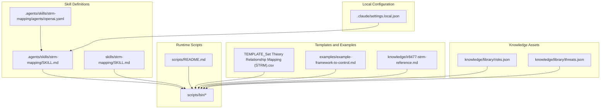
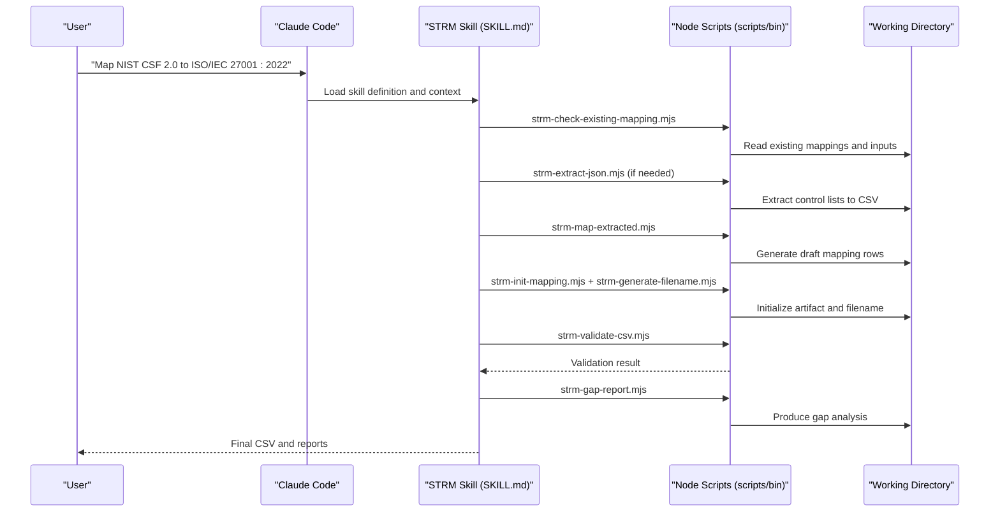
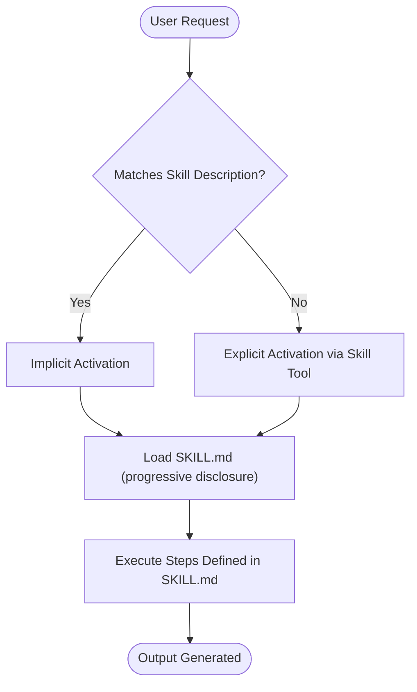
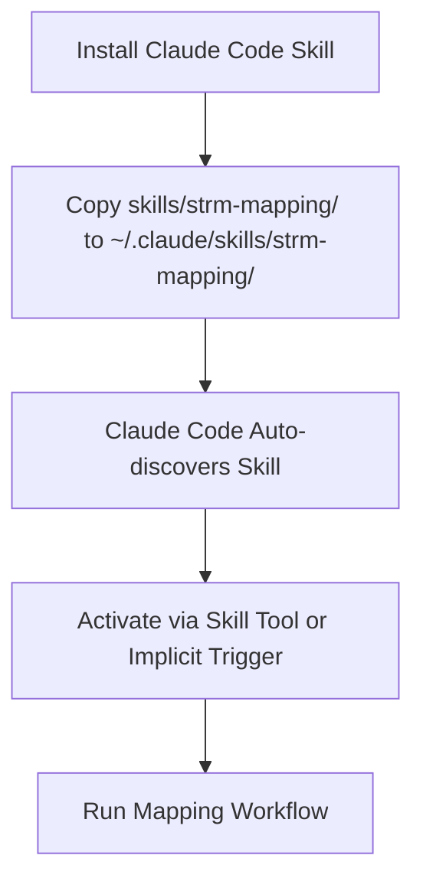
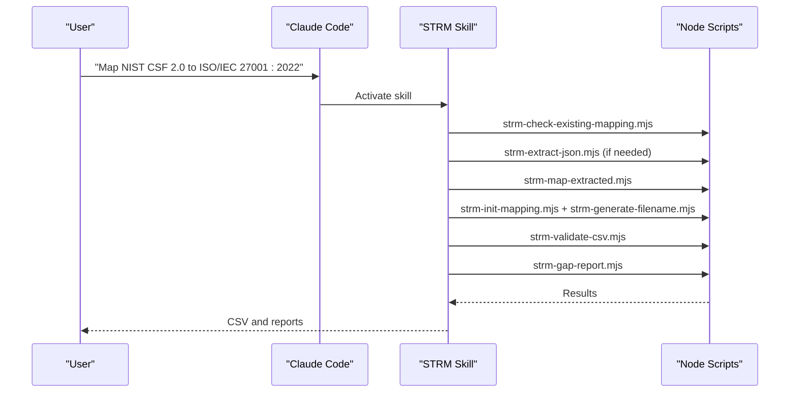
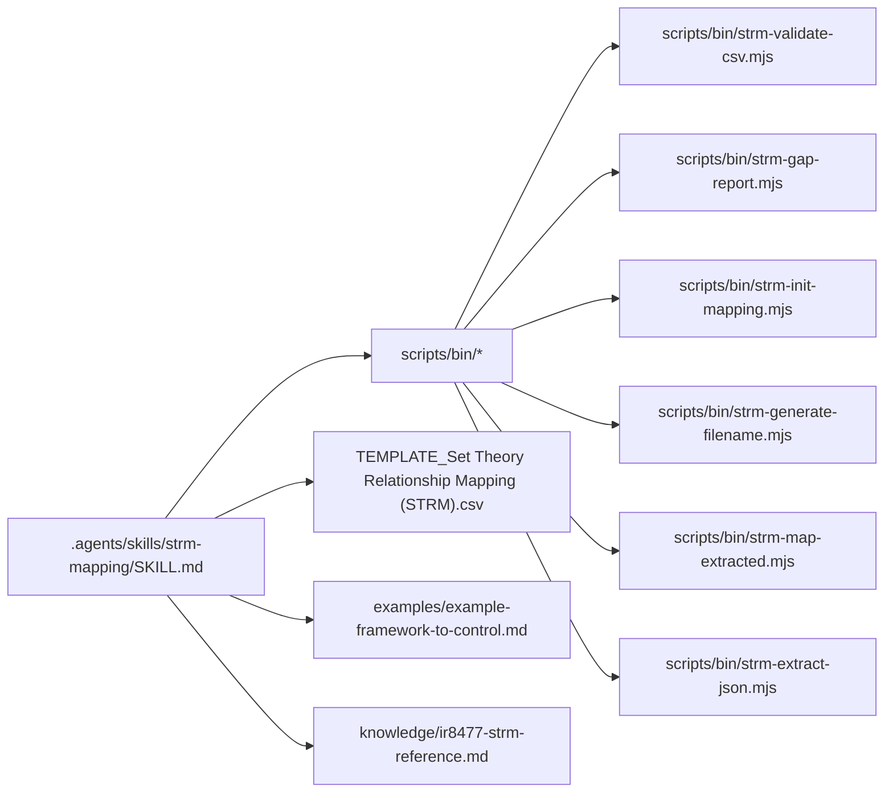

# Claude Code Integration

<cite>
**Referenced Files in This Document**
- [settings.local.json](file://.claude/settings.local.json)
- [SKILL.md](file://skills/strm-mapping/SKILL.md)
- [SKILL.md](file://.agents/skills/strm-mapping/SKILL.md)
- [openai.yaml](file://.agents/skills/strm-mapping/agents/openai.yaml)
- [README.md](file://README.md)
- [scripts/README.md](file://scripts/README.md)
- [PLATFORM-COMPATIBILITY.md](file://platform-skills/PLATFORM-COMPATIBILITY.md)
- [AGENTS.md](file://AGENTS.md)
- [CONVENTIONS.md](file://CONVENTIONS.md)
- [TEMPLATE_Set Theory Relationship Mapping (STRM).csv](file://TEMPLATE_Set Theory Relationship Mapping (STRM).csv)
- [example-framework-to-control.md](file://examples/example-framework-to-control.md)
- [ir8477-strm-reference.md](file://knowledge/ir8477-strm-reference.md)
- [risks.json](file://knowledge/library/risks.json)
- [threats.json](file://knowledge/library/threats.json)
- [strm-validate-csv.mjs](file://scripts/bin/strm-validate-csv.mjs)
</cite>

## Table of Contents
1. [Introduction](#introduction)
2. [Project Structure](#project-structure)
3. [Core Components](#core-components)
4. [Architecture Overview](#architecture-overview)
5. [Detailed Component Analysis](#detailed-component-analysis)
6. [Dependency Analysis](#dependency-analysis)
7. [Performance Considerations](#performance-considerations)
8. [Troubleshooting Guide](#troubleshooting-guide)
9. [Conclusion](#conclusion)
10. [Appendices](#appendices)

## Introduction
This document explains how to integrate and configure the STRM Mapping skill for Anthropic’s Claude Code Assistant. It covers the skill definition, execution context, local settings, installation and activation, invocation examples, and best practices for performance and maintenance. It also addresses platform-specific considerations and migration guidance across Claude versions.

## Project Structure
The STRM Mapping skill is defined as an Agent Skills-compatible skill with a canonical definition and a Claude Code-specific variant. Supporting materials include scripts, templates, examples, and knowledge assets.

**Diagram sources**
- [SKILL.md:1-442](file://.agents/skills/strm-mapping/SKILL.md#L1-L442)
- [SKILL.md:1-442](file://skills/strm-mapping/SKILL.md#L1-L442)
- [openai.yaml:1-8](file://.agents/skills/strm-mapping/agents/openai.yaml#L1-L8)
- [settings.local.json:1-27](file://.claude/settings.local.json#L1-L27)
- [scripts/README.md:1-31](file://scripts/README.md#L1-L31)
- [TEMPLATE_Set Theory Relationship Mapping (STRM).csv](file://TEMPLATE_Set Theory Relationship Mapping (STRM).csv#L1-L2)
- [example-framework-to-control.md:1-159](file://examples/example-framework-to-control.md#L1-L159)
- [ir8477-strm-reference.md:1-119](file://knowledge/ir8477-strm-reference.md#L1-L119)
- [risks.json:1-200](file://knowledge/library/risks.json#L1-L200)
- [threats.json:1-200](file://knowledge/library/threats.json#L1-L200)

**Section sources**
- [README.md:1-30](file://README.md#L1-L30)
- [PLATFORM-COMPATIBILITY.md:1-401](file://platform-skills/PLATFORM-COMPATIBILITY.md#L1-L401)
- [scripts/README.md:1-31](file://scripts/README.md#L1-L31)

## Core Components
- Skill definition: The skill is defined using the Agent Skills standard with a YAML frontmatter and a Markdown body. Two variants exist: a canonical definition under `.agents/skills/` and a Claude Code-specific variant under `skills/`.
- Execution context: The skill prescribes that all work must occur within the repository’s working directory and that the assistant must be started from the repository root to ensure correct relative paths.
- Local settings: The Claude local settings file configures permissions for Claude Code to access repository resources, including reading and writing within working directories and fetching specific web domains.
- Scripts and deterministic operations: A shared Node.js script layer provides deterministic STRM operations (validation, gap analysis, filename generation, etc.) that can be invoked from Claude Code or other platforms.
- Templates and examples: A CSV template and example mappings illustrate the required output format and workflow.

**Section sources**
- [SKILL.md:1-442](file://skills/strm-mapping/SKILL.md#L1-L442)
- [SKILL.md:1-442](file://.agents/skills/strm-mapping/SKILL.md#L1-L442)
- [openai.yaml:1-8](file://.agents/skills/strm-mapping/agents/openai.yaml#L1-L8)
- [settings.local.json:1-27](file://.claude/settings.local.json#L1-L27)
- [scripts/README.md:1-31](file://scripts/README.md#L1-L31)
- [TEMPLATE_Set Theory Relationship Mapping (STRM).csv](file://TEMPLATE_Set Theory Relationship Mapping (STRM).csv#L1-L2)
- [example-framework-to-control.md:1-159](file://examples/example-framework-to-control.md#L1-L159)

## Architecture Overview
The STRM Mapping skill integrates with Claude Code through a skill definition and a deterministic script layer. The workflow is driven by user prompts that trigger the skill, which then orchestrates script invocations to gather inputs, extract and map data, and produce validated outputs.

**Diagram sources**
- [SKILL.md:94-106](file://skills/strm-mapping/SKILL.md#L94-L106)
- [scripts/README.md:10-21](file://scripts/README.md#L10-L21)
- [strm-validate-csv.mjs:1-77](file://scripts/bin/strm-validate-csv.mjs#L1-L77)

**Section sources**
- [SKILL.md:94-106](file://skills/strm-mapping/SKILL.md#L94-L106)
- [scripts/README.md:10-21](file://scripts/README.md#L10-L21)

## Detailed Component Analysis

### Skill Definition and Activation
- Definition format: YAML frontmatter plus Markdown body, compliant with the Agent Skills standard. The canonical definition resides under `.agents/skills/strm-mapping/`, while a Claude Code-specific variant resides under `skills/strm-mapping/`.
- Activation: The skill activates either explicitly (via the Skill tool) or implicitly when the user’s request matches the skill description. The Claude Code variant adds a compatibility note and a working directory instruction tailored to Claude Code.
- Agent-specific metadata: The `.agents/skills/strm-mapping/agents/openai.yaml` file provides display name, short description, default prompt, and invocation policy for OpenAI Codex; while the Claude Code variant focuses on compatibility and execution context.

**Diagram sources**
- [SKILL.md:15-22](file://skills/strm-mapping/SKILL.md#L15-L22)
- [openai.yaml:1-8](file://.agents/skills/strm-mapping/agents/openai.yaml#L1-L8)

**Section sources**
- [SKILL.md:1-442](file://skills/strm-mapping/SKILL.md#L1-L442)
- [SKILL.md:1-442](file://.agents/skills/strm-mapping/SKILL.md#L1-L442)
- [openai.yaml:1-8](file://.agents/skills/strm-mapping/agents/openai.yaml#L1-L8)

### Local Settings Configuration (.claude/settings.local.json)
- Purpose: Grants Claude Code permission to access repository resources, including reading and writing within working directories, listing and counting files, and fetching documentation from specific domains.
- Key permissions:
  - Bash commands scoped to the repository path for safe operations.
  - WebFetch permissions for official documentation domains.
  - Access to CSV templates and example files.
- Recommendations:
  - Keep permissions minimal and scoped to the repository.
  - Ensure the assistant is launched from the repository root so relative paths resolve correctly.

**Section sources**
- [settings.local.json:1-27](file://.claude/settings.local.json#L1-L27)

### Execution Context and Working Directory
- All work must be performed inside the repository’s working directory. The skill explicitly instructs that the assistant must be opened from the repository root to ensure correct relative paths.
- Inputs can be read from working-directory/, project root, or knowledge/; outputs must be written to working-directory/ and finalized artifacts to working-directory/mapping-artifacts/.

**Section sources**
- [SKILL.md:26-37](file://skills/strm-mapping/SKILL.md#L26-L37)
- [AGENTS.md:21-27](file://AGENTS.md#L21-L27)

### Installation and Activation Procedures
- Claude Code installation:
  - Copy the Claude Code-specific skill directory to the user’s Claude skills directory. After installation, the skill is auto-discovered and can be activated via the Skill tool or implicitly by matching the skill description.
- Other platforms:
  - The canonical skill under `.agents/skills/` is auto-discovered by other Agent Skills-compatible tools (e.g., OpenAI Codex, Cursor, Gemini CLI, GitHub Copilot, Qoder).
  - Project context documents (e.g., AGENTS.md) are injected by some tools (e.g., OpenAI Codex, Google Gemini CLI) to provide persistent methodology context.

**Diagram sources**
- [PLATFORM-COMPATIBILITY.md:117-122](file://platform-skills/PLATFORM-COMPATIBILITY.md#L117-L122)
- [PLATFORM-COMPATIBILITY.md:44-44](file://platform-skills/PLATFORM-COMPATIBILITY.md#L44-L44)

**Section sources**
- [PLATFORM-COMPATIBILITY.md:117-122](file://platform-skills/PLATFORM-COMPATIBILITY.md#L117-L122)
- [PLATFORM-COMPATIBILITY.md:44-44](file://platform-skills/PLATFORM-COMPATIBILITY.md#L44-L44)

### Practical Invocation Examples
- Example mapping: “Map NIST CSF 2.0 to ISO/IEC 27001:2022” triggers the skill. The skill guides the assistant to:
  - Confirm both source and target documents.
  - Locate inputs in working-directory/, project root, or knowledge/.
  - Optionally extract JSON inputs to CSV.
  - Generate draft mappings and initialize filenames.
  - Perform manual QA and validation.
  - Produce gap analysis and finalize artifacts.

**Diagram sources**
- [SKILL.md:108-106](file://skills/strm-mapping/SKILL.md#L108-L106)
- [scripts/README.md:12-21](file://scripts/README.md#L12-L21)

**Section sources**
- [README.md:18-22](file://README.md#L18-L22)
- [SKILL.md:108-106](file://skills/strm-mapping/SKILL.md#L108-L106)

### Risk and Threat-Enriched Mappings
- Optional enrichment: Risk and threat libraries are only used when explicitly requested by the user.
- Data sources: risks.json and threats.json provide structured risk and threat catalogs with embedded STRM relationships and linkage to controls/threats.
- Mapping types:
  - Risk-to-Control: Use embedded STRM relationships as starting points.
  - Threat-to-Risk and Threat-to-Control: Traverse the chain and apply transitivity rules.

**Section sources**
- [SKILL.md:323-398](file://skills/strm-mapping/SKILL.md#L323-L398)
- [risks.json:1-200](file://knowledge/library/risks.json#L1-L200)
- [threats.json:1-200](file://knowledge/library/threats.json#L1-L200)

### Validation and Gap Analysis
- Validation: The CSV validator checks required columns, row completeness, and formula correctness. It returns pass/fail with counts and details.
- Gap analysis: Produced after manual QA to summarize mapping coverage and discrepancies.

**Section sources**
- [scripts/README.md:19-21](file://scripts/README.md#L19-L21)
- [strm-validate-csv.mjs:1-77](file://scripts/bin/strm-validate-csv.mjs#L1-L77)

## Dependency Analysis
The skill depends on:
- Skill definition files (.agents/skills/strm-mapping/SKILL.md and skills/strm-mapping/SKILL.md).
- Deterministic scripts in scripts/bin/.
- Templates and examples for output format and workflow guidance.
- Knowledge assets for methodology and optional enrichment.

**Diagram sources**
- [SKILL.md:94-106](file://.agents/skills/strm-mapping/SKILL.md#L94-L106)
- [scripts/README.md:10-21](file://scripts/README.md#L10-L21)
- [TEMPLATE_Set Theory Relationship Mapping (STRM).csv](file://TEMPLATE_Set Theory Relationship Mapping (STRM).csv#L1-L2)
- [example-framework-to-control.md:1-159](file://examples/example-framework-to-control.md#L1-L159)
- [ir8477-strm-reference.md:1-119](file://knowledge/ir8477-strm-reference.md#L1-L119)
- [strm-validate-csv.mjs:1-77](file://scripts/bin/strm-validate-csv.mjs#L1-L77)

**Section sources**
- [scripts/README.md:10-21](file://scripts/README.md#L10-L21)

## Performance Considerations
- Deterministic scripts: Prefer invoking scripts from the shared CLI layer to avoid LLM estimation and ensure reproducibility.
- Path resolution: Always launch the assistant from the repository root to prevent costly path resolution retries.
- Output staging: Write intermediate files to working-directory/scratch and finalize artifacts to working-directory/mapping-artifacts/ to keep the workspace organized.
- Validation timing: Run validation and gap analysis only after manual QA to avoid redundant computations.

[No sources needed since this section provides general guidance]

## Troubleshooting Guide
Common issues and resolutions:
- Empty or invalid CSV:
  - Use the CSV validator to identify missing columns or incorrect values.
  - Ensure the header matches the required 12-column structure and that target-adapted column headers are used.
- Incorrect working directory or relative paths:
  - Start the assistant from the repository root and ensure all inputs are placed under working-directory/.
- Missing inputs:
  - Verify input files exist in working-directory/, project root, or knowledge/.
  - For JSON inputs with HTML-tagged descriptions, run the extraction script first.
- Validation failures:
  - Review errors returned by the validator and correct row-level issues before re-running validation.

**Section sources**
- [strm-validate-csv.mjs:25-44](file://scripts/bin/strm-validate-csv.mjs#L25-L44)
- [TEMPLATE_Set Theory Relationship Mapping (STRM).csv](file://TEMPLATE_Set Theory Relationship Mapping (STRM).csv#L1-L2)
- [SKILL.md:108-136](file://skills/strm-mapping/SKILL.md#L108-L136)

## Conclusion
By adhering to the skill definition, respecting the execution context, and leveraging the deterministic script layer, Claude Code can reliably produce high-quality STRM mappings. Proper configuration of local permissions, careful handling of inputs and outputs, and timely validation ensure robust and reproducible results across platforms.

[No sources needed since this section summarizes without analyzing specific files]

## Appendices

### A. Claude Code Installation Command
- Install the skill by copying the Claude Code-specific variant to the user’s skills directory. After installation, the skill is auto-discovered and ready to use.

**Section sources**
- [PLATFORM-COMPATIBILITY.md:117-122](file://platform-skills/PLATFORM-COMPATIBILITY.md#L117-L122)

### B. Platform-Specific Considerations
- Claude Code: Uses the skills/strm-mapping/SKILL.md variant and auto-discovers from ~/.claude/skills/.
- OpenAI Codex: Uses the .agents/skills/strm-mapping/SKILL.md variant and injects AGENTS.md as project context.
- Cursor, Gemini CLI, GitHub Copilot, Qoder: Use the .agents/skills/strm-mapping/SKILL.md variant and auto-discover from their respective directories.

**Section sources**
- [PLATFORM-COMPATIBILITY.md:40-54](file://platform-skills/PLATFORM-COMPATIBILITY.md#L40-L54)

### C. Migration Between Claude Versions
- Keep the Claude Code-specific SKILL.md synchronized with the canonical .agents/skills/strm-mapping/SKILL.md.
- Preserve Claude-specific wording and compatibility notes while mirroring methodology changes.
- Maintain the shared scripts and templates to ensure consistent behavior across versions.

**Section sources**
- [PLATFORM-COMPATIBILITY.md:102-132](file://platform-skills/PLATFORM-COMPATIBILITY.md#L102-L132)