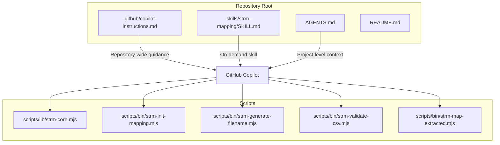
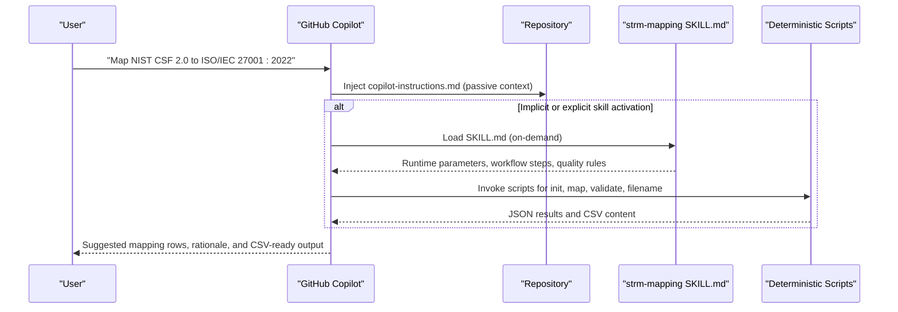
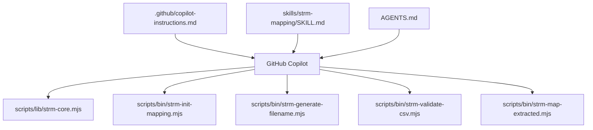

# GitHub Copilot Setup

<cite>
**Referenced Files in This Document**
- [.github/copilot-instructions.md](file://.github/copilot-instructions.md)
- [skills/strm-mapping/SKILL.md](file://skills/strm-mapping/SKILL.md)
- [AGENTS.md](file://AGENTS.md)
- [platform-skills/PLATFORM-COMPATIBILITY.md](file://platform-skills/PLATFORM-COMPATIBILITY.md)
- [scripts/lib/strm-core.mjs](file://scripts/lib/strm-core.mjs)
- [scripts/bin/strm-init-mapping.mjs](file://scripts/bin/strm-init-mapping.mjs)
- [scripts/bin/strm-generate-filename.mjs](file://scripts/bin/strm-generate-filename.mjs)
- [scripts/bin/strm-validate-csv.mjs](file://scripts/bin/strm-validate-csv.mjs)
- [scripts/bin/strm-map-extracted.mjs](file://scripts/bin/strm-map-extracted.mjs)
- [README.md](file://README.md)
</cite>

## Table of Contents
1. [Introduction](#introduction)
2. [Project Structure](#project-structure)
3. [Core Components](#core-components)
4. [Architecture Overview](#architecture-overview)
5. [Detailed Component Analysis](#detailed-component-analysis)
6. [Dependency Analysis](#dependency-analysis)
7. [Performance Considerations](#performance-considerations)
8. [Troubleshooting Guide](#troubleshooting-guide)
9. [Conclusion](#conclusion)
10. [Appendices](#appendices)

## Introduction
This document explains how to configure GitHub Copilot to assist with STRM (Set-Theory Relationship Mapping) tasks using the NIST IR 8477 methodology. It focuses on the copilot-instructions.md configuration file, how Copilot’s repository-wide instructions integrate with the Agent Skills system, and how to invoke and refine STRM mappings through Copilot suggestions and interactive editing. It also covers instruction formatting, context injection, skill activation, parameter handling, response formatting, and best practices for performance and troubleshooting.

## Project Structure
The STRM Mapping repository surfaces Copilot guidance via a repository-wide instructions file and a formal Agent Skills definition. Copilot injects the repository instructions passively into all chats, while the Agent Skills system provides on-demand activation and detailed workflow guidance.

**Diagram sources**
- [.github/copilot-instructions.md:1-106](file://.github/copilot-instructions.md#L1-L106)
- [skills/strm-mapping/SKILL.md:1-442](file://skills/strm-mapping/SKILL.md#L1-L442)
- [AGENTS.md:1-141](file://AGENTS.md#L1-L141)
- [scripts/lib/strm-core.mjs:1-343](file://scripts/lib/strm-core.mjs#L1-L343)
- [scripts/bin/strm-init-mapping.mjs:1-58](file://scripts/bin/strm-init-mapping.mjs#L1-L58)
- [scripts/bin/strm-generate-filename.mjs:1-19](file://scripts/bin/strm-generate-filename.mjs#L1-L19)
- [scripts/bin/strm-validate-csv.mjs:1-77](file://scripts/bin/strm-validate-csv.mjs#L1-L77)
- [scripts/bin/strm-map-extracted.mjs:1-278](file://scripts/bin/strm-map-extracted.mjs#L1-L278)

**Section sources**
- [.github/copilot-instructions.md:1-106](file://.github/copilot-instructions.md#L1-L106)
- [platform-skills/PLATFORM-COMPATIBILITY.md:248-277](file://platform-skills/PLATFORM-COMPATIBILITY.md#L248-L277)
- [README.md:1-30](file://README.md#L1-L30)

## Core Components
- Repository-wide Copilot instructions: Defines output format, naming, scoring, rationale pattern, quality rules, and file locations. Copilot automatically injects this file for all chats in the repository workspace.
- Agent Skills definition: Provides on-demand activation and detailed workflow steps, parameterization, and quality gates.
- Project-level agent instructions: Supplies quick-reference methodology and constraints that apply to all assistants.
- Deterministic scripts: Provide reproducible operations for initialization, filename generation, mapping, validation, and gap reporting.

Key Copilot integration points:
- copilot-instructions.md: Passive repository-wide guidance for output format, naming, and quality rules.
- SKILL.md: On-demand skill with runtime parameters and step-by-step workflow.
- AGENTS.md: Project-level constraints and quick-reference methodology.
- Scripts: Deterministic operations that Copilot can invoke to produce verifiable artifacts.

**Section sources**
- [.github/copilot-instructions.md:1-106](file://.github/copilot-instructions.md#L1-L106)
- [skills/strm-mapping/SKILL.md:1-442](file://skills/strm-mapping/SKILL.md#L1-L442)
- [AGENTS.md:1-141](file://AGENTS.md#L1-L141)
- [platform-skills/PLATFORM-COMPATIBILITY.md:248-277](file://platform-skills/PLATFORM-COMPATIBILITY.md#L248-L277)

## Architecture Overview
The Copilot setup combines passive repository instructions with an on-demand Agent Skills workflow. Copilot uses the repository instructions to shape responses and ensure adherence to STRM rules. When a user explicitly invokes the skill or describes a task aligned with the skill, Copilot loads the SKILL.md content and follows the defined steps, parameters, and quality gates.

**Diagram sources**
- [.github/copilot-instructions.md:1-106](file://.github/copilot-instructions.md#L1-L106)
- [skills/strm-mapping/SKILL.md:1-442](file://skills/strm-mapping/SKILL.md#L1-L442)
- [scripts/bin/strm-init-mapping.mjs:1-58](file://scripts/bin/strm-init-mapping.mjs#L1-L58)
- [scripts/bin/strm-generate-filename.mjs:1-19](file://scripts/bin/strm-generate-filename.mjs#L1-L19)
- [scripts/bin/strm-validate-csv.mjs:1-77](file://scripts/bin/strm-validate-csv.mjs#L1-L77)
- [scripts/bin/strm-map-extracted.mjs:1-278](file://scripts/bin/strm-map-extracted.mjs#L1-L278)

## Detailed Component Analysis

### Copilot Repository Instructions (.github/copilot-instructions.md)
Purpose:
- Provide repository-wide behavioral guidance for Copilot.
- Define output format, naming convention, scoring formula, rationale pattern, transitivity rules, and quality rules.
- Specify input/output locations and optional catalogs.

How Copilot uses it:
- Always injected for all chats in the repository workspace.
- Guides Copilot to adhere to STRM methodology and produce CSV outputs with correct headers and naming.

Key elements:
- Output file structure and naming convention.
- Strength score formula and defaults.
- Rationale writing pattern.
- File locations and constraints.
- Transitivity and inverse relationship rules.
- Quality rules for manual QA and validation.

**Section sources**
- [.github/copilot-instructions.md:1-106](file://.github/copilot-instructions.md#L1-L106)

### Agent Skills Definition (skills/strm-mapping/SKILL.md)
Purpose:
- Provide on-demand activation and detailed workflow for STRM mapping.
- Define runtime parameters, step-by-step actions, and quality gates.

How Copilot uses it:
- Auto-discovered from .agents/skills/; can be activated explicitly or implicitly.
- Loads only the body on activation (progressive disclosure).

Key elements:
- When to activate.
- Working directory and saving completed mappings.
- Runtime parameters (source and target documents).
- Step-by-step workflow with script invocations.
- CSV structure, naming, rationale pattern, and quality rules.
- Optional risk/threat enrichment and special mapping types.

**Section sources**
- [skills/strm-mapping/SKILL.md:1-442](file://skills/strm-mapping/SKILL.md#L1-L442)

### Project-Level Agent Instructions (AGENTS.md)
Purpose:
- Provide project-level constraints and quick-reference methodology.
- Apply to all work regardless of active skill.

How Copilot uses it:
- Always injected before task execution.
- Reinforces repository purpose, constraints, and activation instructions for the STRM skill.

**Section sources**
- [AGENTS.md:1-141](file://AGENTS.md#L1-L141)

### Deterministic Scripts (scripts/)
Purpose:
- Provide deterministic, verifiable operations for mapping and validation.
- Enable Copilot to generate artifacts that match the STRM methodology.

Key scripts:
- strm-init-mapping.mjs: Initialize CSV with correct header and artifact directory.
- strm-generate-filename.mjs: Compute filename based on framework names.
- strm-validate-csv.mjs: Validate CSV structure and enforce quality rules.
- strm-map-extracted.mjs: Generate candidate mappings using controlled similarity metrics and scoring.

**Section sources**
- [scripts/bin/strm-init-mapping.mjs:1-58](file://scripts/bin/strm-init-mapping.mjs#L1-L58)
- [scripts/bin/strm-generate-filename.mjs:1-19](file://scripts/bin/strm-generate-filename.mjs#L1-L19)
- [scripts/bin/strm-validate-csv.mjs:1-77](file://scripts/bin/strm-validate-csv.mjs#L1-L77)
- [scripts/bin/strm-map-extracted.mjs:1-278](file://scripts/bin/strm-map-extracted.mjs#L1-L278)
- [scripts/lib/strm-core.mjs:1-343](file://scripts/lib/strm-core.mjs#L1-L343)

### Instruction Templates and Response Formatting
Guidance for Copilot:
- Output format: 12-column CSV with specific headers and target-adapted column names.
- Naming convention: Include source, bridge (if any), and target names in the filename.
- Rationale pattern: Explain both controls and why the relationship holds; append divergence for intersects_with.
- Strength calculation: Use the defined formula and defaults; never assign arbitrarily.
- Quality rules: Never leave rationale empty; compute strength via formula; one FDE can map to multiple RDEs; do not invent target control IDs.

**Section sources**
- [.github/copilot-instructions.md:22-106](file://.github/copilot-instructions.md#L22-L106)
- [skills/strm-mapping/SKILL.md:194-321](file://skills/strm-mapping/SKILL.md#L194-L321)

### Parameter Handling and Skill Activation
Runtime parameters:
- Source (Focal) Document: The framework or catalog being mapped FROM.
- Target (Reference) Document: The framework or catalog being mapped TO.

Activation:
- Implicit: When the task description matches the skill description.
- Explicit: Using skill invocation commands or UI triggers.

Workflow steps:
- Gather inputs from working-directory, project root, or knowledge/ examples.
- Extract JSON inputs if needed.
- Map rows and write CSV.
- Manual QA and validation.
- Optional gap report generation.

**Section sources**
- [skills/strm-mapping/SKILL.md:78-107](file://skills/strm-mapping/SKILL.md#L78-L107)
- [platform-skills/PLATFORM-COMPATIBILITY.md:85-88](file://platform-skills/PLATFORM-COMPATIBILITY.md#L85-L88)

### Practical Invocation Patterns
- Interactive editing: Ask Copilot to map two frameworks; accept suggested rows and refine rationale and strength.
- Collaborative development: Use the skill to generate a draft CSV; iterate with Copilot to improve mappings and notes.
- Crosswalk scenarios: Request framework-to-framework mappings; Copilot can suggest rows and help compute strengths.

**Section sources**
- [skills/strm-mapping/SKILL.md:15-31](file://skills/strm-mapping/SKILL.md#L15-L31)
- [README.md:18-23](file://README.md#L18-L23)

## Dependency Analysis
The Copilot setup depends on:
- Repository instructions for passive guidance.
- Agent Skills for on-demand activation and workflow.
- Deterministic scripts for verifiable outputs.

**Diagram sources**
- [.github/copilot-instructions.md:1-106](file://.github/copilot-instructions.md#L1-L106)
- [skills/strm-mapping/SKILL.md:1-442](file://skills/strm-mapping/SKILL.md#L1-L442)
- [AGENTS.md:1-141](file://AGENTS.md#L1-L141)
- [scripts/lib/strm-core.mjs:1-343](file://scripts/lib/strm-core.mjs#L1-L343)
- [scripts/bin/strm-init-mapping.mjs:1-58](file://scripts/bin/strm-init-mapping.mjs#L1-L58)
- [scripts/bin/strm-generate-filename.mjs:1-19](file://scripts/bin/strm-generate-filename.mjs#L1-L19)
- [scripts/bin/strm-validate-csv.mjs:1-77](file://scripts/bin/strm-validate-csv.mjs#L1-L77)
- [scripts/bin/strm-map-extracted.mjs:1-278](file://scripts/bin/strm-map-extracted.mjs#L1-L278)

**Section sources**
- [platform-skills/PLATFORM-COMPATIBILITY.md:248-277](file://platform-skills/PLATFORM-COMPATIBILITY.md#L248-L277)

## Performance Considerations
- Prefer deterministic scripts for heavy lifting to ensure consistent outputs and reduce LLM hallucinations.
- Use the mapping script to pre-generate candidate rows; then refine with Copilot to focus on rationale and notes.
- Keep working directory organized; place inputs and outputs under working-directory to minimize path confusion.
- Run validation immediately after manual QA to catch errors early.

[No sources needed since this section provides general guidance]

## Troubleshooting Guide
Common issues and resolutions:
- Missing required columns in CSV: The validator reports missing columns; ensure the header matches the required 12-column structure and target-adapted column names.
- Strength mismatch: The validator checks that the strength matches the formula; adjust relationship/confidence/rationale accordingly.
- Empty rationale: Ensure every row includes a non-empty rationale narrative.
- Incorrect target control IDs: Do not invent IDs; use only IDs from the actual target document.
- Low confidence usage: Reserve “low” confidence for significant inference; otherwise default to “high.”

**Section sources**
- [scripts/bin/strm-validate-csv.mjs:46-77](file://scripts/bin/strm-validate-csv.mjs#L46-L77)
- [.github/copilot-instructions.md:100-106](file://.github/copilot-instructions.md#L100-L106)
- [skills/strm-mapping/SKILL.md:304-321](file://skills/strm-mapping/SKILL.md#L304-L321)

## Conclusion
GitHub Copilot integrates with the STRM Mapping repository through passive repository instructions and an on-demand Agent Skills workflow. The repository instructions ensure output correctness and adherence to NIST IR 8477, while the skill provides a structured, script-backed workflow. Deterministic scripts guarantee reproducibility and quality, enabling efficient collaboration and iterative refinement of mappings.

[No sources needed since this section summarizes without analyzing specific files]

## Appendices

### Appendix A: Copilot Integration Summary
- Repository-wide instructions: .github/copilot-instructions.md
- On-demand skill: skills/strm-mapping/SKILL.md
- Project-level context: AGENTS.md
- Scripts: Initialization, filename generation, mapping, validation, and gap reporting

**Section sources**
- [.github/copilot-instructions.md:1-106](file://.github/copilot-instructions.md#L1-L106)
- [skills/strm-mapping/SKILL.md:1-442](file://skills/strm-mapping/SKILL.md#L1-L442)
- [AGENTS.md:1-141](file://AGENTS.md#L1-L141)
- [platform-skills/PLATFORM-COMPATIBILITY.md:248-277](file://platform-skills/PLATFORM-COMPATIBILITY.md#L248-L277)