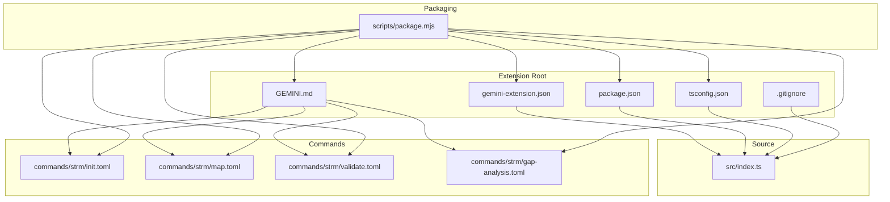
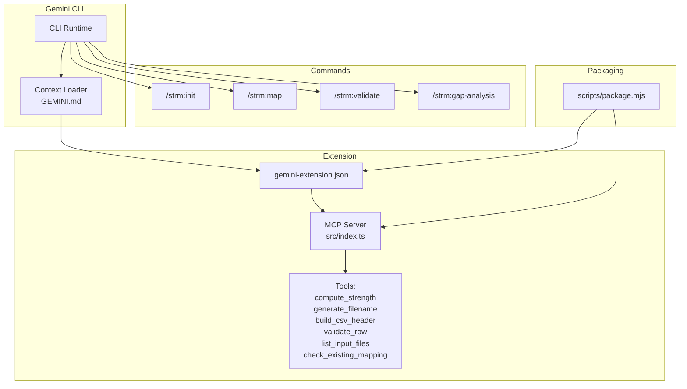
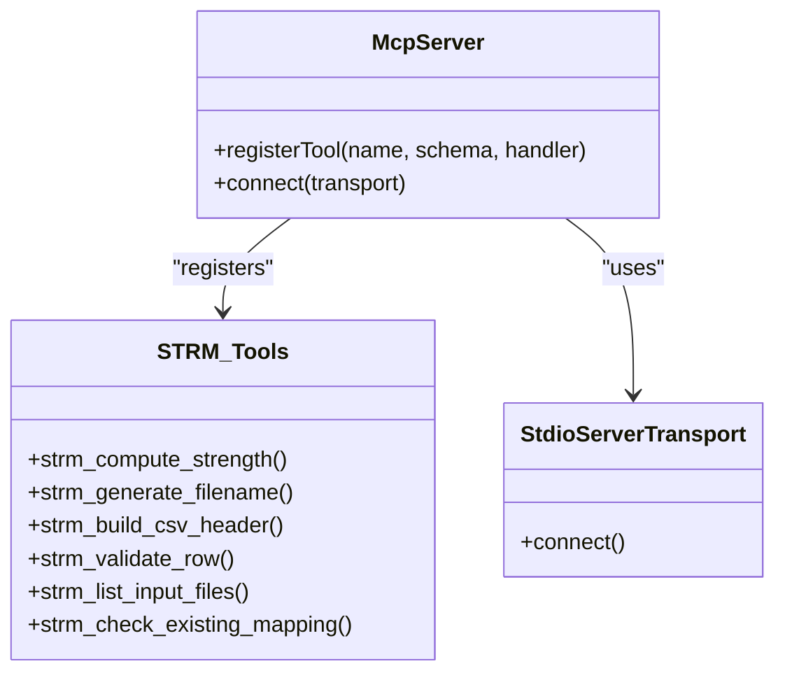
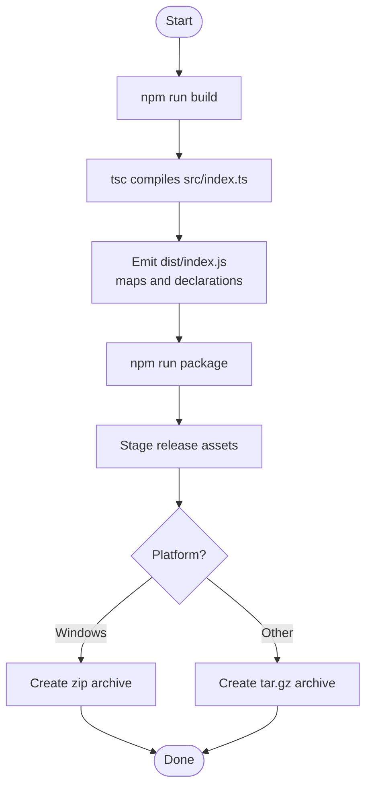
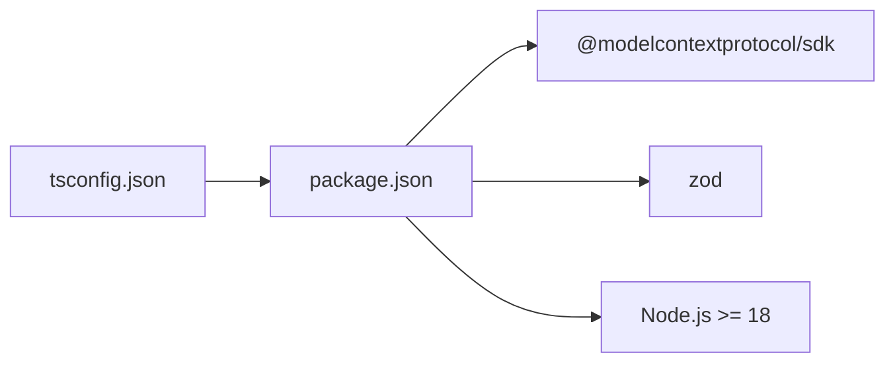

# Google Gemini CLI Extension

<cite>
**Referenced Files in This Document**
- [package.json](file://gemini-extension/package.json)
- [tsconfig.json](file://gemini-extension/tsconfig.json)
- [src/index.ts](file://gemini-extension/src/index.ts)
- [gemini-extension.json](file://gemini-extension/gemini-extension.json)
- [GEMINI.md](file://gemini-extension/GEMINI.md)
- [commands/strm/init.toml](file://gemini-extension/commands/strm/init.toml)
- [commands/strm/map.toml](file://gemini-extension/commands/strm/map.toml)
- [commands/strm/validate.toml](file://gemini-extension/commands/strm/validate.toml)
- [commands/strm/gap-analysis.toml](file://gemini-extension/commands/strm/gap-analysis.toml)
- [scripts/package.mjs](file://gemini-extension/scripts/package.mjs)
- [.gitignore](file://gemini-extension/.gitignore)
- [README.md](file://README.md)
- [GEMINI.md](file://GEMINI.md)
</cite>

## Table of Contents
1. [Introduction](#introduction)
2. [Project Structure](#project-structure)
3. [Core Components](#core-components)
4. [Architecture Overview](#architecture-overview)
5. [Detailed Component Analysis](#detailed-component-analysis)
6. [Dependency Analysis](#dependency-analysis)
7. [Performance Considerations](#performance-considerations)
8. [Troubleshooting Guide](#troubleshooting-guide)
9. [Conclusion](#conclusion)
10. [Appendices](#appendices)

## Introduction
This document describes the Google Gemini CLI Extension for NIST IR 8477 Set-Theory Relationship Mapping (STRM). The extension integrates a Model Context Protocol (MCP) server that exposes deterministic tools for mapping cybersecurity frameworks and validating STRM outputs. It also defines slash commands for initializing mappings, performing gap analysis, listing inputs, and validating CSV artifacts. The guide explains installation, configuration, command usage, and operational best practices aligned with the broader Gemini ecosystem.

## Project Structure
The extension is organized under the gemini-extension directory with the following key areas:
- Source code: TypeScript implementation of the MCP server and tools
- Commands: Slash command definitions for Gemini CLI
- Packaging: Release packaging script and build configuration
- Documentation: Context and usage guide for the extension

**Diagram sources**
- [gemini-extension.json:1-13](file://gemini-extension/gemini-extension.json#L1-L13)
- [GEMINI.md:1-91](file://gemini-extension/GEMINI.md#L1-L91)
- [package.json:1-26](file://gemini-extension/package.json#L1-L26)
- [tsconfig.json:1-18](file://gemini-extension/tsconfig.json#L1-L18)
- [.gitignore:1-6](file://gemini-extension/.gitignore#L1-L6)
- [src/index.ts:1-522](file://gemini-extension/src/index.ts#L1-L522)
- [commands/strm/init.toml:1-14](file://gemini-extension/commands/strm/init.toml#L1-L14)
- [commands/strm/map.toml:1-20](file://gemini-extension/commands/strm/map.toml#L1-L20)
- [commands/strm/validate.toml:1-18](file://gemini-extension/commands/strm/validate.toml#L1-L18)
- [commands/strm/gap-analysis.toml:1-19](file://gemini-extension/commands/strm/gap-analysis.toml#L1-L19)
- [scripts/package.mjs:1-106](file://gemini-extension/scripts/package.mjs#L1-L106)

**Section sources**
- [README.md:1-30](file://README.md#L1-L30)
- [GEMINI.md:1-224](file://GEMINI.md#L1-L224)

## Core Components
- MCP Server: Implements six deterministic tools for STRM operations and runs over stdio transport
- Command Definitions: Slash commands that orchestrate workflows using external scripts
- Build and Packaging: TypeScript compilation, source maps, and release packaging

Key capabilities:
- Deterministic scoring, filename generation, CSV header building, row validation, input discovery, and duplicate detection
- Slash commands for initialization, mapping sessions, validation, and gap analysis
- Strict typing and schema validation for tool inputs

**Section sources**
- [src/index.ts:263-522](file://gemini-extension/src/index.ts#L263-L522)
- [commands/strm/init.toml:1-14](file://gemini-extension/commands/strm/init.toml#L1-L14)
- [commands/strm/map.toml:1-20](file://gemini-extension/commands/strm/map.toml#L1-L20)
- [commands/strm/validate.toml:1-18](file://gemini-extension/commands/strm/validate.toml#L1-L18)
- [commands/strm/gap-analysis.toml:1-19](file://gemini-extension/commands/strm/gap-analysis.toml#L1-L19)
- [package.json:1-26](file://gemini-extension/package.json#L1-L26)
- [tsconfig.json:1-18](file://gemini-extension/tsconfig.json#L1-L18)

## Architecture Overview
The extension consists of:
- An MCP server that registers six tools
- A Gemini CLI context that loads the extension and provides slash commands
- A packaging pipeline that builds and packages the extension for distribution

**Diagram sources**
- [gemini-extension.json:1-13](file://gemini-extension/gemini-extension.json#L1-L13)
- [src/index.ts:263-522](file://gemini-extension/src/index.ts#L263-L522)
- [commands/strm/init.toml:1-14](file://gemini-extension/commands/strm/init.toml#L1-L14)
- [commands/strm/map.toml:1-20](file://gemini-extension/commands/strm/map.toml#L1-L20)
- [commands/strm/validate.toml:1-18](file://gemini-extension/commands/strm/validate.toml#L1-L18)
- [commands/strm/gap-analysis.toml:1-19](file://gemini-extension/commands/strm/gap-analysis.toml#L1-L19)
- [scripts/package.mjs:1-106](file://gemini-extension/scripts/package.mjs#L1-L106)

## Detailed Component Analysis

### MCP Server Implementation
The server initializes with a name and version, then registers six tools. Each tool validates inputs using Zod schemas and performs deterministic operations. The server communicates over stdio transport.

**Diagram sources**
- [src/index.ts:263-522](file://gemini-extension/src/index.ts#L263-L522)

**Section sources**
- [src/index.ts:263-522](file://gemini-extension/src/index.ts#L263-L522)

### Tool Specifications and Execution Contexts
- strm_compute_strength
  - Purpose: Computes the STRM strength score using base, confidence, and rationale adjustments
  - Inputs validated via Zod enums
  - Output: JSON-formatted result including computed score and formula breakdown
- strm_generate_filename
  - Purpose: Generates the standardized STRM CSV filename for a focal→bridge→target mapping
  - Inputs: Focal, target, optional bridge framework names
- strm_build_csv_header
  - Purpose: Produces the STRM CSV header row with target-specific column labels
  - Inputs: Optional target name for labeling columns I and K
- strm_validate_row
  - Purpose: Validates a single STRM row against quality rules and scoring formula
  - Inputs: FDE#, relationship, confidence, rationale type, rationale text, strength score, target ID, optional notes
  - Output: Structured errors and warnings
- strm_list_input_files
  - Purpose: Lists supported framework/control files in working-directory or a specified subdirectory
  - Inputs: Optional subdirectory relative to workspace root
- strm_check_existing_mapping
  - Purpose: Searches for existing STRM CSV files matching a focal→target pair
  - Inputs: Focal and target framework names
  - Output: Found status, match count, file paths, and recommendation

Execution context:
- Workspace path is resolved from WORKSPACE_PATH environment variable or current working directory
- File system operations scan directories recursively for supported extensions and STRM artifacts

**Section sources**
- [src/index.ts:268-514](file://gemini-extension/src/index.ts#L268-L514)

### Slash Commands and Workflows
Slash commands define end-to-end workflows orchestrated by the extension:

- /strm:init
  - Prompts for focal, target, and optional bridge framework names
  - Invokes initialization script to set up artifact folder and CSV
- /strm:map
  - Lists available inputs and checks for existing mappings
  - Guides the analyst through initializing output and generating rows
  - Uses external scripts for computing strength and validating CSV
- /strm:validate
  - Identifies STRM CSV files and runs validation across rows
  - Aggregates errors and warnings into a report
- /strm:gap-analysis
  - Performs a full mapping between two frameworks
  - Summarizes gaps and generates a gap report

Command prompts reference external scripts and emphasize deterministic tool usage.

**Section sources**
- [commands/strm/init.toml:1-14](file://gemini-extension/commands/strm/init.toml#L1-L14)
- [commands/strm/map.toml:1-20](file://gemini-extension/commands/strm/map.toml#L1-L20)
- [commands/strm/validate.toml:1-18](file://gemini-extension/commands/strm/validate.toml#L1-L18)
- [commands/strm/gap-analysis.toml:1-19](file://gemini-extension/commands/strm/gap-analysis.toml#L1-L19)

### Build and Packaging Pipeline
- TypeScript compilation targets ES2022 with NodeNext module resolution
- Source maps and declarations enabled for debugging and consumption
- Release packaging script assembles required assets and creates platform-specific archives

**Diagram sources**
- [package.json:7-12](file://gemini-extension/package.json#L7-L12)
- [tsconfig.json:2-14](file://gemini-extension/tsconfig.json#L2-L14)
- [scripts/package.mjs:47-100](file://gemini-extension/scripts/package.mjs#L47-L100)

**Section sources**
- [package.json:7-12](file://gemini-extension/package.json#L7-L12)
- [tsconfig.json:2-14](file://gemini-extension/tsconfig.json#L2-L14)
- [scripts/package.mjs:1-106](file://gemini-extension/scripts/package.mjs#L1-L106)

## Dependency Analysis
External dependencies and runtime requirements:
- @modelcontextprotocol/sdk: Provides MCP server and stdio transport
- zod: Schema validation for tool inputs
- Node.js >= 18.0.0 for engine compatibility

Build-time dependencies:
- TypeScript compiler and NodeNext module resolution
- Source map and declaration generation

**Diagram sources**
- [package.json:14-24](file://gemini-extension/package.json#L14-L24)
- [tsconfig.json:2-14](file://gemini-extension/tsconfig.json#L2-L14)

**Section sources**
- [package.json:14-24](file://gemini-extension/package.json#L14-L24)
- [tsconfig.json:2-14](file://gemini-extension/tsconfig.json#L2-L14)

## Performance Considerations
- Minimize filesystem scans by limiting subdirectory scope when listing inputs
- Cache results of duplicate mapping checks when reusing the same focal/target pair
- Use streaming or chunked processing for large CSV validations if extending the toolset
- Prefer deterministic operations to reduce variability and improve reproducibility

## Troubleshooting Guide
Common issues and resolutions:
- MCP server fails to start
  - Ensure Node.js version meets the engine requirement
  - Verify stdio transport connectivity and that the server is launched via the extension configuration
- Missing workspace path
  - Confirm WORKSPACE_PATH environment variable or run from repository root
- Validation failures
  - Review returned errors and warnings; correct relationship, confidence, rationale type, and strength score alignment
- Duplicate mappings
  - Use the existing mapping check tool to locate prior artifacts and avoid duplication
- Packaging errors
  - Confirm all required assets exist before packaging and that build artifacts are present

Debugging MCP connections:
- Confirm the MCP server is registered in gemini-extension.json
- Verify the command and args resolve correctly relative to extensionPath
- Check that dist/index.js is built and executable

Compatibility across Gemini CLI versions:
- Keep the MCP server interface stable and avoid breaking changes to tool schemas
- Test packaging across platforms and architectures using the provided script

**Section sources**
- [gemini-extension.json:5-11](file://gemini-extension/gemini-extension.json#L5-L11)
- [src/index.ts:451-514](file://gemini-extension/src/index.ts#L451-L514)
- [scripts/package.mjs:77-81](file://gemini-extension/scripts/package.mjs#L77-L81)

## Conclusion
This extension provides a robust, deterministic toolkit for STRM mapping integrated with Gemini CLI via MCP. By leveraging the six core tools and slash commands, analysts can reliably initialize mappings, validate outputs, and perform gap analyses while adhering to NIST IR 8477 methodology. The build and packaging pipeline ensures consistent distribution across platforms, and the documented troubleshooting steps support ongoing maintenance and compatibility.

## Appendices

### Installation and Setup
- Install dependencies and build the extension
- Load the Gemini CLI context from the repository root
- Register the MCP server using the extension manifest

**Section sources**
- [package.json:7-12](file://gemini-extension/package.json#L7-L12)
- [GEMINI.md:1-224](file://GEMINI.md#L1-L224)
- [gemini-extension.json:1-13](file://gemini-extension/gemini-extension.json#L1-L13)

### Security Considerations
- Restrict file system access to the working directory and declared subdirectories
- Validate all inputs using Zod schemas to prevent injection and malformed data
- Avoid exposing sensitive paths or credentials in logs or outputs

**Section sources**
- [src/index.ts:451-514](file://gemini-extension/src/index.ts#L451-L514)

### Practical Examples
- Initialize a mapping: Use the /strm:init command to prompt for framework names and prepare the artifact
- Perform a gap analysis: Use /strm:gap-analysis to map two frameworks and summarize coverage gaps
- Validate outputs: Use /strm:validate to scan and validate existing STRM CSV files

**Section sources**
- [commands/strm/init.toml:1-14](file://gemini-extension/commands/strm/init.toml#L1-L14)
- [commands/strm/gap-analysis.toml:1-19](file://gemini-extension/commands/strm/gap-analysis.toml#L1-L19)
- [commands/strm/validate.toml:1-18](file://gemini-extension/commands/strm/validate.toml#L1-L18)