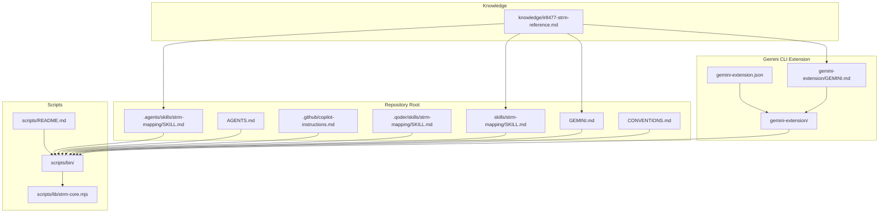
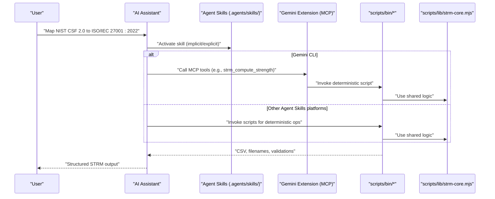
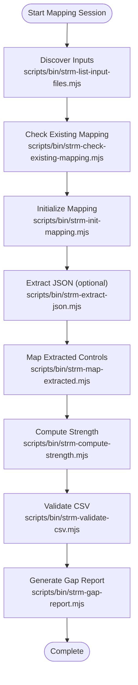
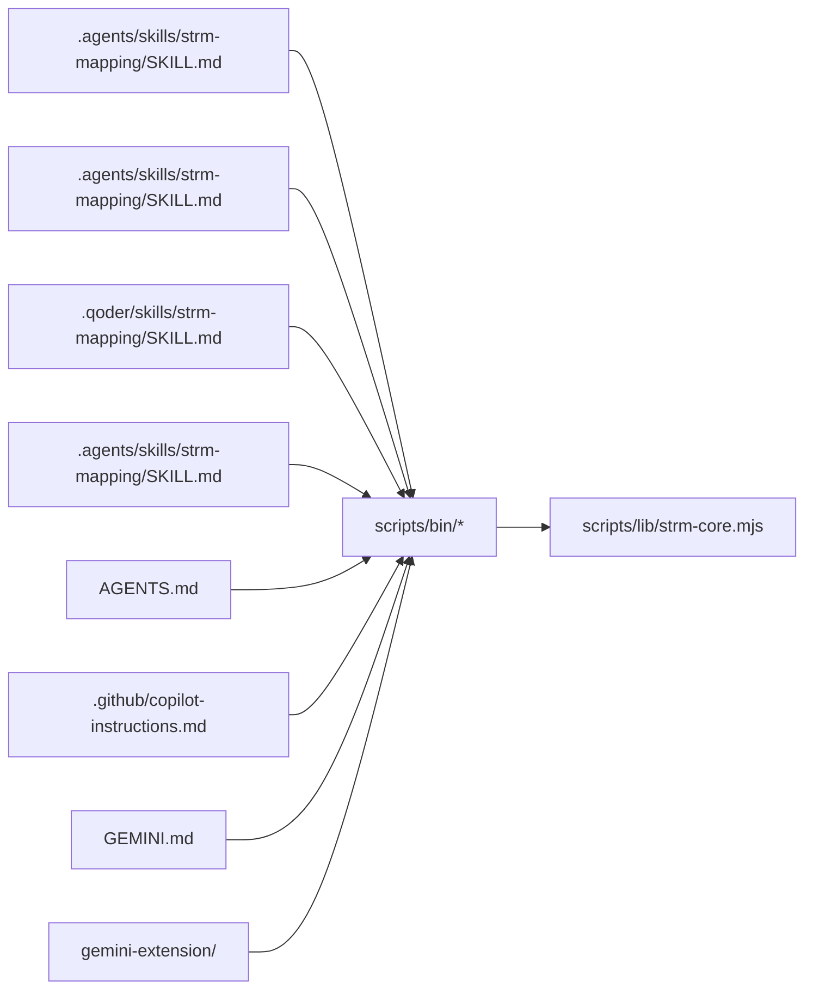

# Other AI Assistant Platforms

<cite>
**Referenced Files in This Document**
- [README.md](file://README.md)
- [platform-skills/PLATFORM-COMPATIBILITY.md](file://platform-skills/PLATFORM-COMPATIBILITY.md)
- [skills/strm-mapping/SKILL.md](file://skills/strm-mapping/SKILL.md)
- [.github/copilot-instructions.md](file://.github/copilot-instructions.md)
- [AGENTS.md](file://AGENTS.md)
- [GEMINI.md](file://GEMINI.md)
- [gemini-extension/GEMINI.md](file://gemini-extension/GEMINI.md)
- [gemini-extension/gemini-extension.json](file://gemini-extension/gemini-extension.json)
- [CONVENTIONS.md](file://CONVENTIONS.md)
- [scripts/README.md](file://scripts/README.md)
- [scripts/lib/strm-core.mjs](file://scripts/lib/strm-core.mjs)
- [knowledge/ir8477-strm-reference.md](file://knowledge/ir8477-strm-reference.md)
</cite>

## Table of Contents
1. [Introduction](#introduction)
2. [Project Structure](#project-structure)
3. [Core Components](#core-components)
4. [Architecture Overview](#architecture-overview)
5. [Detailed Component Analysis](#detailed-component-analysis)
6. [Dependency Analysis](#dependency-analysis)
7. [Performance Considerations](#performance-considerations)
8. [Troubleshooting Guide](#troubleshooting-guide)
9. [Conclusion](#conclusion)
10. [Appendices](#appendices)

## Introduction
This document explains how to integrate and operate the STRM Mapping toolkit across multiple AI coding assistants, focusing on OpenAI Codex, Cursor AI, Qoder, and emerging AI coding platforms. It provides platform-specific installation and configuration procedures, skill deployment processes, compatibility matrices, feature differences, and limitations. It also details the skill adaptation process for customizing STRM mappings to each platform’s unique capabilities, practical examples of platform switching and cross-platform workflow optimization, guidelines for maintaining compatibility, testing procedures, and performance optimization techniques. Guidance is included for evaluating new AI assistants for STRM compatibility and contributing platform support to the ecosystem.

## Project Structure
The STRM Mapping repository organizes platform integration around a shared methodology and a cross-platform deterministic script layer. Key elements include:
- Agent Skills standard files for Claude Code, OpenAI Codex, Cursor, Gemini CLI, and Qoder
- Project context documents for Codex and Copilot
- A Gemini CLI extension with MCP tools and slash commands
- Aider conventions for non-Agent Skills environments
- A shared Node.js script suite enabling deterministic operations across platforms

**Diagram sources**
- [platform-skills/PLATFORM-COMPATIBILITY.md:136-336](file://platform-skills/PLATFORM-COMPATIBILITY.md#L136-L336)
- [gemini-extension/gemini-extension.json:1-13](file://gemini-extension/gemini-extension.json#L1-L13)
- [gemini-extension/GEMINI.md:1-95](file://gemini-extension/GEMINI.md#L1-L95)
- [scripts/README.md:1-36](file://scripts/README.md#L1-L36)
- [scripts/lib/strm-core.mjs:1-343](file://scripts/lib/strm-core.mjs#L1-L343)
- [knowledge/ir8477-strm-reference.md:1-119](file://knowledge/ir8477-strm-reference.md#L1-L119)

**Section sources**
- [README.md:1-30](file://README.md#L1-L30)
- [platform-skills/PLATFORM-COMPATIBILITY.md:136-336](file://platform-skills/PLATFORM-COMPATIBILITY.md#L136-L336)
- [scripts/README.md:1-36](file://scripts/README.md#L1-L36)

## Core Components
- Agent Skills standard skill: A YAML frontmatter plus Markdown body that defines the STRM mapping skill for platforms supporting the agentskills.io standard. Canonical location is `.agents/skills/strm-mapping/SKILL.md`, with platform-specific variants for Claude Code and Qoder.
- Project context documents: AGENTS.md (Codex) and .github/copilot-instructions.md (Copilot) provide persistent methodology context for all tasks.
- Gemini CLI extension: An MCP server exposing deterministic tools and slash commands for STRM operations.
- Aider conventions: CONVENTIONS.md provides imperative conventions for Aider sessions.
- Shared script layer: scripts/bin/* and scripts/lib/strm-core.mjs implement deterministic STRM operations across platforms.

**Section sources**
- [platform-skills/PLATFORM-COMPATIBILITY.md:59-106](file://platform-skills/PLATFORM-COMPATIBILITY.md#L59-L106)
- [AGENTS.md:1-141](file://AGENTS.md#L1-L141)
- [.github/copilot-instructions.md:1-106](file://.github/copilot-instructions.md#L1-L106)
- [gemini-extension/GEMINI.md:1-95](file://gemini-extension/GEMINI.md#L1-L95)
- [CONVENTIONS.md:1-187](file://CONVENTIONS.md#L1-L187)
- [scripts/README.md:1-36](file://scripts/README.md#L1-L36)
- [scripts/lib/strm-core.mjs:1-343](file://scripts/lib/strm-core.mjs#L1-L343)

## Architecture Overview
The STRM toolkit architecture centers on a shared methodology and deterministic operations, with platform-specific entry points and activation mechanisms.

**Diagram sources**
- [platform-skills/PLATFORM-COMPATIBILITY.md:180-244](file://platform-skills/PLATFORM-COMPATIBILITY.md#L180-L244)
- [gemini-extension/GEMINI.md:9-51](file://gemini-extension/GEMINI.md#L9-L51)
- [scripts/README.md:10-36](file://scripts/README.md#L10-L36)
- [scripts/lib/strm-core.mjs:35-57](file://scripts/lib/strm-core.mjs#L35-L57)

## Detailed Component Analysis

### OpenAI Codex CLI
- Integration: Agent Skill (.agents/skills/strm-mapping/SKILL.md) and Project Context (AGENTS.md)
- Activation: Explicit (/skills or $strm-mapping) or implicit when task matches skill description
- Configuration: Skills can be enabled/disabled via config; AGENTS.md is always injected
- Notes: Skill creator and installer tools are available; loading order includes current, parent, repo root, user-level, admin-level

**Section sources**
- [platform-skills/PLATFORM-COMPATIBILITY.md:136-177](file://platform-skills/PLATFORM-COMPATIBILITY.md#L136-L177)
- [AGENTS.md:31-42](file://AGENTS.md#L31-L42)

### Cursor AI
- Integration: Agent Skill (.agents/skills/strm-mapping/SKILL.md) auto-discovered from .agents/skills/, .cursor/skills/, and ~/.cursor/skills/
- Activation: Automatic discovery; optional metadata to disable model invocation and turn the skill into a slash command
- Notes: Remote skills supported via GitHub URL rules

**Section sources**
- [platform-skills/PLATFORM-COMPATIBILITY.md:280-298](file://platform-skills/PLATFORM-COMPATIBILITY.md#L280-L298)

### Qoder
- Integration: Agent Skill (.qoder/skills/strm-mapping/SKILL.md) and .agents/skills/ (Agent Skills standard)
- Activation: Type /strm-mapping or allow implicit activation when task matches description
- Installation: Optional user-level copy to ~/.qoder/skills/ for global availability across projects

**Section sources**
- [platform-skills/PLATFORM-COMPATIBILITY.md:300-336](file://platform-skills/PLATFORM-COMPATIBILITY.md#L300-L336)

### Google Gemini CLI
- Integration: Three levels
  - Agent Skill (.agents/skills/strm-mapping/SKILL.md) with progressive disclosure
  - Context file (GEMINI.md) always injected
  - Extension (MCP) with tools and slash commands
- Extension installation: Build and link via gemini extensions link; stored under ~/.gemini/extensions/
- Tools: strm_compute_strength, strm_generate_filename, strm_build_csv_header, strm_validate_row, strm_validate_csv, strm_list_input_files, strm_check_existing_mapping
- Slash commands: /strm:init, /strm:map, /strm:gap-analysis, /strm:validate

**Section sources**
- [platform-skills/PLATFORM-COMPATIBILITY.md:180-228](file://platform-skills/PLATFORM-COMPATIBILITY.md#L180-L228)
- [gemini-extension/GEMINI.md:9-51](file://gemini-extension/GEMINI.md#L9-L51)
- [gemini-extension/gemini-extension.json:1-13](file://gemini-extension/gemini-extension.json#L1-L13)

### GitHub Copilot
- Integration: Repo-wide instructions (.github/copilot-instructions.md) and Agent Skills standard via .agents/skills/
- Activation: Always active for Copilot interactions in the repository; Agent Skill provides on-demand focused activation
- Notes: Instructions are behavioral guidance without activation triggers

**Section sources**
- [platform-skills/PLATFORM-COMPATIBILITY.md:248-277](file://platform-skills/PLATFORM-COMPATIBILITY.md#L248-L277)
- [.github/copilot-instructions.md:1-106](file://.github/copilot-instructions.md#L1-L106)

### Aider
- Integration: CONVENTIONS.md provides imperative conventions; Aider does not auto-load files—explicit load required
- Activation: Load via aider --read CONVENTIONS.md or configure in .aider.conf.yml
- Notes: Not Agent Skills compatible; use conventions for methodology alignment

**Section sources**
- [platform-skills/PLATFORM-COMPATIBILITY.md:339-363](file://platform-skills/PLATFORM-COMPATIBILITY.md#L339-L363)
- [CONVENTIONS.md:1-187](file://CONVENTIONS.md#L1-L187)

### Shared Script Layer and Core Logic
- Purpose: Deterministic STRM operations portable across platforms
- Commands: List inputs, check existing mappings, extract JSON, map extracted controls, compute strength, generate filename, build CSV header, initialize mapping, run workflow, validate CSV, gap report, initialize review log
- Core logic: computeStrength, sanitizeFrameworkName, generateFilename, buildHeader, CSV parsing/formatting helpers, validation utilities, artifact directory resolution, input file discovery

**Diagram sources**
- [scripts/README.md:10-36](file://scripts/README.md#L10-L36)
- [scripts/lib/strm-core.mjs:35-57](file://scripts/lib/strm-core.mjs#L35-L57)

**Section sources**
- [scripts/README.md:1-36](file://scripts/README.md#L1-L36)
- [scripts/lib/strm-core.mjs:1-343](file://scripts/lib/strm-core.mjs#L1-L343)

## Dependency Analysis
- Platform-to-integration mapping:
  - OpenAI Codex: Agent Skill + Project Context
  - Cursor: Agent Skill (auto-discovered)
  - Qoder: Agent Skill (project/user-level) + .agents/skills/
  - Gemini CLI: Agent Skill + Context + Extension (MCP)
  - GitHub Copilot: Repo instructions + Agent Skill
  - Aider: Conventions file (non-Agent Skills)
- Shared dependencies:
  - scripts/bin/* depend on scripts/lib/strm-core.mjs
  - All Agent Skills-based platforms share the same methodology and CSV structure
  - GEMINI.md and AGENTS.md provide complementary persistent context

**Diagram sources**
- [platform-skills/PLATFORM-COMPATIBILITY.md:40-54](file://platform-skills/PLATFORM-COMPATIBILITY.md#L40-L54)
- [gemini-extension/gemini-extension.json:1-13](file://gemini-extension/gemini-extension.json#L1-L13)
- [scripts/README.md:10-36](file://scripts/README.md#L10-L36)
- [scripts/lib/strm-core.mjs:1-343](file://scripts/lib/strm-core.mjs#L1-L343)

**Section sources**
- [platform-skills/PLATFORM-COMPATIBILITY.md:40-54](file://platform-skills/PLATFORM-COMPATIBILITY.md#L40-L54)

## Performance Considerations
- Prefer deterministic scripts for operations requiring consistent outputs (e.g., strength computation, filename generation, CSV header building)
- Use the shared core logic to minimize platform-specific overhead and ensure uniform behavior
- Limit full SKILL.md body loading to activation events where progressive disclosure is supported
- For Gemini CLI, leverage MCP tools to offload heavy computations from the LLM
- Keep methodology documents concise and focused to reduce injection costs

[No sources needed since this section provides general guidance]

## Troubleshooting Guide
Common integration challenges and resolutions:
- Path resolution errors: Ensure running from repository root so relative paths resolve correctly
- Missing inputs: Use scripts/bin/strm-list-input-files.mjs to discover available framework files
- Duplicate mappings: Use scripts/bin/strm-check-existing-mapping.mjs to avoid rework
- Validation failures: Use scripts/bin/strm-validate-csv.mjs to catch missing fields, invalid relationships, incorrect strengths, and unresolved header placeholders
- Gap reporting: After manual QA, run scripts/bin/strm-gap-report.mjs to summarize uncovered controls
- Manual review logging: Use scripts/bin/strm-init-review-log.mjs to scaffold a review log with required change details

**Section sources**
- [platform-skills/PLATFORM-COMPATIBILITY.md:249-277](file://platform-skills/PLATFORM-COMPATIBILITY.md#L249-L277)
- [AGENTS.md:21-28](file://AGENTS.md#L21-L28)
- [scripts/README.md:25-36](file://scripts/README.md#L25-L36)

## Conclusion
The STRM Mapping toolkit provides a robust, cross-platform framework for producing NIST IR 8477 Set-Theory Relationship Mappings. By leveraging the Agent Skills standard, project context documents, and a shared deterministic script layer, teams can deploy consistent workflows across OpenAI Codex, Cursor, Qoder, Gemini CLI, GitHub Copilot, and Aider. The Gemini CLI extension further enhances determinism with MCP tools and slash commands. Following the compatibility guidelines, testing procedures, and maintenance practices outlined here ensures reliable operation and portability across platforms.

[No sources needed since this section summarizes without analyzing specific files]

## Appendices

### Compatibility Matrix and Feature Differences
- Agent Skills standard: Supported by OpenAI Codex, Cursor, Gemini CLI, GitHub Copilot (VS Code), and others; provides progressive disclosure and activation triggers
- Project context documents: AGENTS.md (Codex) and .github/copilot-instructions.md (Copilot) offer always-injected methodology context
- Gemini CLI extension: Provides MCP tools and slash commands for deterministic operations
- Aider: Uses CONVENTIONS.md for imperative conventions; not Agent Skills compatible
- Cross-platform script layer: Enables deterministic operations across Claude Code, Codex CLI, Cursor, Copilot, Qoder, and Aider

**Section sources**
- [platform-skills/PLATFORM-COMPATIBILITY.md:40-54](file://platform-skills/PLATFORM-COMPATIBILITY.md#L40-L54)
- [platform-skills/PLATFORM-COMPATIBILITY.md:229-244](file://platform-skills/PLATFORM-COMPATIBILITY.md#L229-L244)

### Platform-Specific Installation and Configuration Procedures
- OpenAI Codex CLI
  - Install Agent Skill from .agents/skills/strm-mapping/SKILL.md
  - Optionally enable via config; AGENTS.md is always injected
- Cursor AI
  - Place skill in .agents/skills/ or .cursor/skills/; auto-discovered
  - Optional metadata to disable model invocation
- Qoder
  - Copy .qoder/skills/strm-mapping to ~/.qoder/skills/ for user-level availability
  - Also supports .agents/skills/ (Agent Skills standard)
- Google Gemini CLI
  - Link extension via gemini extensions link; tools and slash commands available
  - Use GEMINI.md for always-injected context
- GitHub Copilot
  - .github/copilot-instructions.md is always active; Agent Skill provides on-demand activation
- Aider
  - Load CONVENTIONS.md explicitly or via .aider.conf.yml

**Section sources**
- [platform-skills/PLATFORM-COMPATIBILITY.md:136-177](file://platform-skills/PLATFORM-COMPATIBILITY.md#L136-L177)
- [platform-skills/PLATFORM-COMPATIBILITY.md:280-298](file://platform-skills/PLATFORM-COMPATIBILITY.md#L280-L298)
- [platform-skills/PLATFORM-COMPATIBILITY.md:300-336](file://platform-skills/PLATFORM-COMPATIBILITY.md#L300-L336)
- [platform-skills/PLATFORM-COMPATIBILITY.md:180-228](file://platform-skills/PLATFORM-COMPATIBILITY.md#L180-L228)
- [platform-skills/PLATFORM-COMPATIBILITY.md:248-277](file://platform-skills/PLATFORM-COMPATIBILITY.md#L248-L277)
- [platform-skills/PLATFORM-COMPATIBILITY.md:339-363](file://platform-skills/PLATFORM-COMPATIBILITY.md#L339-L363)

### Skill Adaptation Process
- Maintain a canonical methodology in .agents/skills/strm-mapping/SKILL.md
- Mirror changes to platform-specific variants (skills/strm-mapping/SKILL.md for Claude Code, .qoder/skills/strm-mapping/SKILL.md for Qoder)
- Update AGENTS.md, .github/copilot-instructions.md, GEMINI.md, and gemini-extension/GEMINI.md to reflect methodology updates
- Keep README.md aligned with output format and installation instructions

**Section sources**
- [platform-skills/PLATFORM-COMPATIBILITY.md:385-401](file://platform-skills/PLATFORM-COMPATIBILITY.md#L385-L401)
- [skills/strm-mapping/SKILL.md:1-443](file://skills/strm-mapping/SKILL.md#L1-L443)

### Practical Examples and Cross-Platform Workflow Optimization
- Example: Switching from Gemini CLI to Cursor
  - Start with GEMINI.md context and extension tools for deterministic steps
  - Switch to Cursor Agent Skill for activation; use scripts/bin/* for remaining steps
- Example: Using Copilot alongside Agent Skills
  - Rely on .github/copilot-instructions.md for always-on guidance
  - Activate Agent Skills for focused mapping sessions
- Example: Integrating Aider
  - Load CONVENTIONS.md at session start
  - Use scripts/bin/* for deterministic operations

**Section sources**
- [platform-skills/PLATFORM-COMPATIBILITY.md:248-277](file://platform-skills/PLATFORM-COMPATIBILITY.md#L248-L277)
- [CONVENTIONS.md:1-187](file://CONVENTIONS.md#L1-L187)

### Testing and Maintenance Requirements
- Validate CSV outputs with scripts/bin/strm-validate-csv.mjs
- Generate gap reports with scripts/bin/strm-gap-report.mjs
- Initialize review logs with scripts/bin/strm-init-review-log.mjs
- Keep methodology references synchronized across all platform documents
- Periodically review scripts/lib/strm-core.mjs for correctness and performance

**Section sources**
- [scripts/README.md:25-36](file://scripts/README.md#L25-L36)
- [scripts/lib/strm-core.mjs:206-265](file://scripts/lib/strm-core.mjs#L206-L265)

### Evaluating New AI Assistants for STRM Compatibility
- Check for Agent Skills standard support; if absent, assess whether imperative conventions (like Aider) or project context documents can be leveraged
- Verify auto-discovery paths and activation mechanisms
- Confirm deterministic operations can be executed via scripts/bin/*
- Ensure methodology consistency with knowledge/ir8477-strm-reference.md

**Section sources**
- [platform-skills/PLATFORM-COMPATIBILITY.md:9-14](file://platform-skills/PLATFORM-COMPATIBILITY.md#L9-L14)
- [knowledge/ir8477-strm-reference.md:1-119](file://knowledge/ir8477-strm-reference.md#L1-L119)