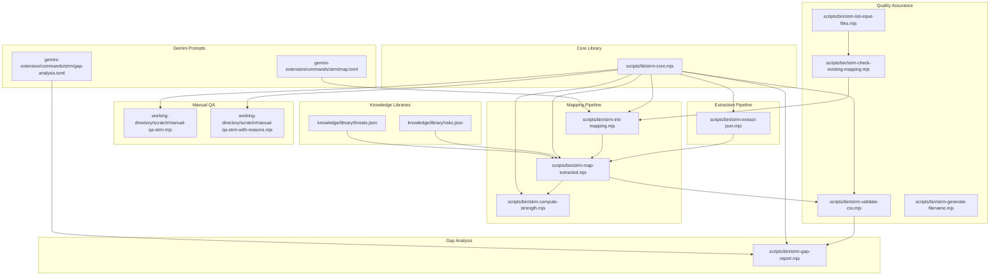
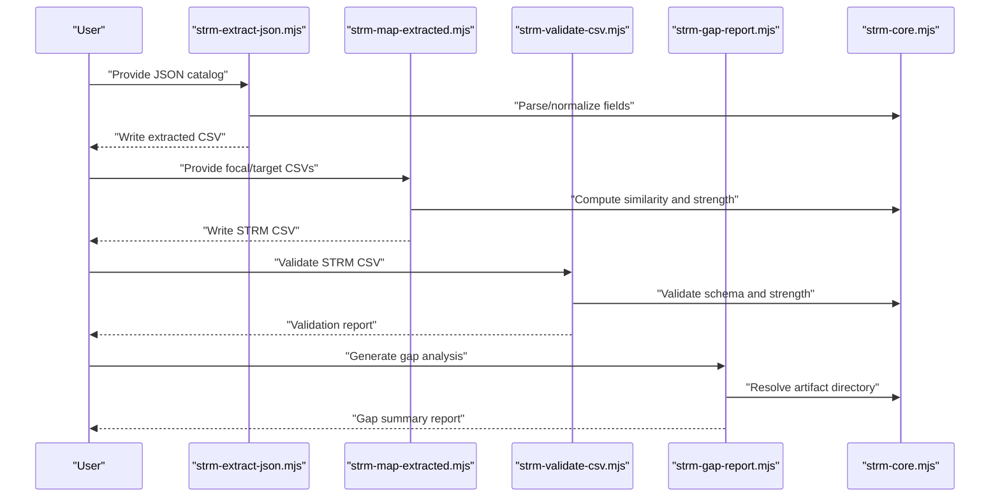
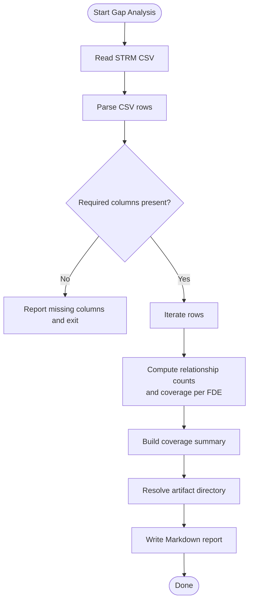
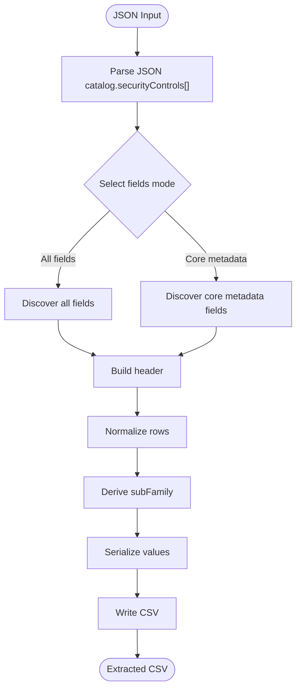
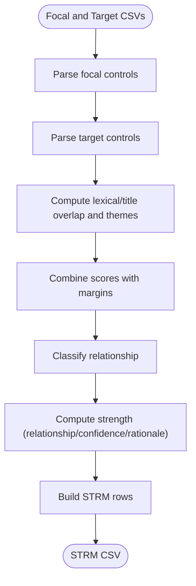
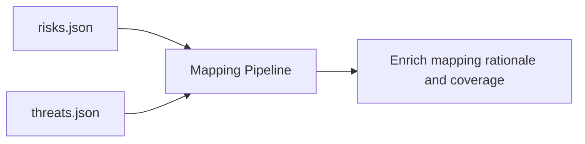
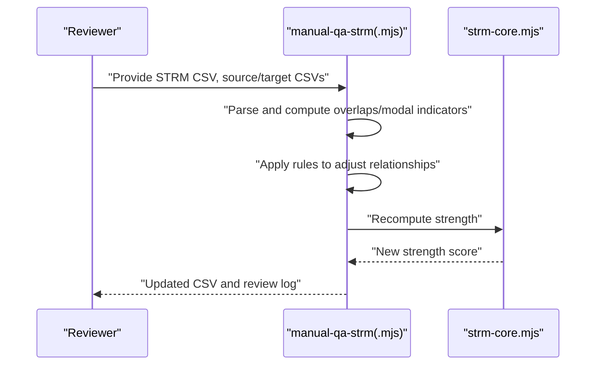
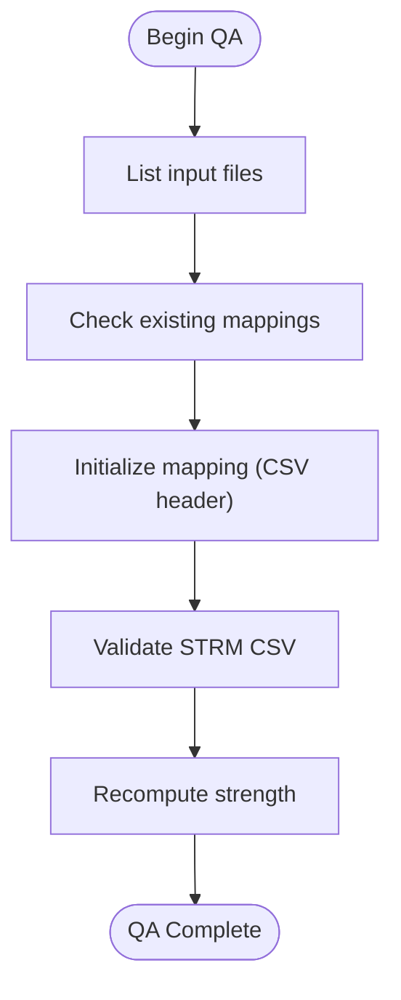

# Advanced Features and Specialized Workflows

<cite>
**Referenced Files in This Document**
- [README.md](file://README.md)
- [strm-core.mjs](file://scripts/lib/strm-core.mjs)
- [strm-extract-json.mjs](file://scripts/bin/strm-extract-json.mjs)
- [strm-map-extracted.mjs](file://scripts/bin/strm-map-extracted.mjs)
- [strm-gap-report.mjs](file://scripts/bin/strm-gap-report.mjs)
- [strm-validate-csv.mjs](file://scripts/bin/strm-validate-csv.mjs)
- [strm-init-mapping.mjs](file://scripts/bin/strm-init-mapping.mjs)
- [strm-compute-strength.mjs](file://scripts/bin/strm-compute-strength.mjs)
- [strm-list-input-files.mjs](file://scripts/bin/strm-list-input-files.mjs)
- [strm-check-existing-mapping.mjs](file://scripts/bin/strm-check-existing-mapping.mjs)
- [strm-generate-filename.mjs](file://scripts/bin/strm-generate-filename.mjs)
- [manual-qa-strm.mjs](file://working-directory/scratch/manual-qa-strm.mjs)
- [manual-qa-strm-with-reasons.mjs](file://working-directory/scratch/manual-qa-strm-with-reasons.mjs)
- [risks.json](file://knowledge/library/risks.json)
- [threats.json](file://knowledge/library/threats.json)
- [map.toml](file://gemini-extension/commands/strm/map.toml)
- [gap-analysis.toml](file://gemini-extension/commands/strm/gap-analysis.toml)
</cite>

## Table of Contents
1. [Introduction](#introduction)
2. [Project Structure](#project-structure)
3. [Core Components](#core-components)
4. [Architecture Overview](#architecture-overview)
5. [Detailed Component Analysis](#detailed-component-analysis)
6. [Dependency Analysis](#dependency-analysis)
7. [Performance Considerations](#performance-considerations)
8. [Troubleshooting Guide](#troubleshooting-guide)
9. [Conclusion](#conclusion)
10. [Appendices](#appendices)

## Introduction
This document presents advanced features and specialized workflows for the STRM toolkit, focusing on sophisticated capabilities for expert users. It covers the end-to-end gap analysis generation workflow, extracted data processing pipelines, advanced mapping strategies, integration with risk and threat libraries, manual review workflows, and quality assurance processes. It also details specialized use cases such as enterprise-scale mapping projects, compliance automation, and integration with external systems, alongside advanced scripting techniques, custom processing extensions, and performance optimization strategies.

## Project Structure
The STRM toolkit organizes functionality around reusable core utilities and modular command-line scripts. Key areas include:
- Core utilities for CSV parsing, validation, and STRM scoring
- Extraction pipeline for transforming structured catalogs into normalized control datasets
- Mapping pipeline for computing set-theoretic relationships between control catalogs
- Gap analysis reporting and manual quality assurance tools
- Knowledge libraries for risks and threats
- Gemini extension prompts for guided workflows

**Diagram sources**
- [strm-core.mjs:1-343](file://scripts/lib/strm-core.mjs#L1-L343)
- [strm-extract-json.mjs:1-354](file://scripts/bin/strm-extract-json.mjs#L1-L354)
- [strm-map-extracted.mjs:1-278](file://scripts/bin/strm-map-extracted.mjs#L1-L278)
- [strm-validate-csv.mjs:1-77](file://scripts/bin/strm-validate-csv.mjs#L1-L77)
- [strm-init-mapping.mjs:1-58](file://scripts/bin/strm-init-mapping.mjs#L1-L58)
- [strm-compute-strength.mjs:1-20](file://scripts/bin/strm-compute-strength.mjs#L1-L20)
- [strm-list-input-files.mjs:1-12](file://scripts/bin/strm-list-input-files.mjs#L1-L12)
- [strm-check-existing-mapping.mjs:1-20](file://scripts/bin/strm-check-existing-mapping.mjs#L1-L20)
- [strm-generate-filename.mjs:1-19](file://scripts/bin/strm-generate-filename.mjs#L1-L19)
- [strm-gap-report.mjs:1-150](file://scripts/bin/strm-gap-report.mjs#L1-L150)
- [manual-qa-strm.mjs:1-145](file://working-directory/scratch/manual-qa-strm.mjs#L1-L145)
- [manual-qa-strm-with-reasons.mjs:1-120](file://working-directory/scratch/manual-qa-strm-with-reasons.mjs#L1-L120)
- [risks.json:1-1190](file://knowledge/library/risks.json#L1-L1190)
- [threats.json:1-728](file://knowledge/library/threats.json#L1-L728)
- [map.toml:1-20](file://gemini-extension/commands/strm/map.toml#L1-L20)
- [gap-analysis.toml:1-19](file://gemini-extension/commands/strm/gap-analysis.toml#L1-L19)

**Section sources**
- [README.md:1-30](file://README.md#L1-L30)
- [strm-core.mjs:1-343](file://scripts/lib/strm-core.mjs#L1-L343)

## Core Components
- Core utilities: CSV parsing/validation, STRM strength computation, artifact directory resolution, and file discovery
- Extraction pipeline: Normalizes JSON catalogs into CSV control datasets with derived metadata
- Mapping pipeline: Computes similarity-based relationships and strength scores between control catalogs
- Gap analysis: Summarizes coverage and distribution of relationships across FDEs
- Manual QA: Rule-based manual review and adjudication of mappings
- Quality assurance: Pre-flight checks, validation, and strength recomputation
- Knowledge libraries: Risk and threat catalogs integrated into mapping contexts
- Gemini prompts: Guided workflows for mapping and gap analysis

**Section sources**
- [strm-core.mjs:1-343](file://scripts/lib/strm-core.mjs#L1-L343)
- [strm-extract-json.mjs:1-354](file://scripts/bin/strm-extract-json.mjs#L1-L354)
- [strm-map-extracted.mjs:1-278](file://scripts/bin/strm-map-extracted.mjs#L1-L278)
- [strm-gap-report.mjs:1-150](file://scripts/bin/strm-gap-report.mjs#L1-L150)
- [manual-qa-strm.mjs:1-145](file://working-directory/scratch/manual-qa-strm.mjs#L1-L145)
- [strm-validate-csv.mjs:1-77](file://scripts/bin/strm-validate-csv.mjs#L1-L77)

## Architecture Overview
The toolkit follows a modular CLI architecture with a central core library providing shared primitives. Scripts orchestrate workflows, and artifacts are written to a structured working directory. The system integrates optional risk and threat libraries to enrich mapping insights.

**Diagram sources**
- [strm-extract-json.mjs:1-354](file://scripts/bin/strm-extract-json.mjs#L1-L354)
- [strm-map-extracted.mjs:1-278](file://scripts/bin/strm-map-extracted.mjs#L1-L278)
- [strm-validate-csv.mjs:1-77](file://scripts/bin/strm-validate-csv.mjs#L1-L77)
- [strm-gap-report.mjs:1-150](file://scripts/bin/strm-gap-report.mjs#L1-L150)
- [strm-core.mjs:1-343](file://scripts/lib/strm-core.mjs#L1-L343)

## Detailed Component Analysis

### Gap Analysis Generation Workflow
The gap analysis workflow transforms a completed STRM CSV into a coverage-focused summary:
- Validates presence of required columns and data rows
- Computes relationship distribution and counts
- Aggregates coverage per FDE (Full Coverage, Partial Coverage, Gaps)
- Generates a dated artifact directory and Markdown summary

**Diagram sources**
- [strm-gap-report.mjs:1-150](file://scripts/bin/strm-gap-report.mjs#L1-L150)
- [strm-core.mjs:186-204](file://scripts/lib/strm-core.mjs#L186-L204)

**Section sources**
- [strm-gap-report.mjs:1-150](file://scripts/bin/strm-gap-report.mjs#L1-L150)
- [strm-validate-csv.mjs:1-77](file://scripts/bin/strm-validate-csv.mjs#L1-L77)

### Extracted Data Processing Pipelines
The extraction pipeline normalizes diverse JSON control catalogs into a standardized CSV:
- Discovers and serializes metadata fields (including optional ones when requested)
- Derives sub-family taxonomy from control IDs
- Cleans and normalizes text, strips HTML, and extracts first sentences
- Writes CSV with computed header and rows

**Diagram sources**
- [strm-extract-json.mjs:1-354](file://scripts/bin/strm-extract-json.mjs#L1-L354)

**Section sources**
- [strm-extract-json.mjs:1-354](file://scripts/bin/strm-extract-json.mjs#L1-L354)

### Advanced Mapping Strategies
The mapping pipeline computes similarity-based relationships and strength:
- Tokenization, frequency analysis, and Jaccard similarity
- Theme detection and lexical overlap scoring
- Modal strength indicators (shall/must vs should/may)
- Classification thresholds for equal, subset_of, superset_of, intersects_with, not_related
- Strength computation incorporating relationship, confidence, and rationale type

**Diagram sources**
- [strm-map-extracted.mjs:1-278](file://scripts/bin/strm-map-extracted.mjs#L1-L278)
- [strm-core.mjs:35-57](file://scripts/lib/strm-core.mjs#L35-L57)

**Section sources**
- [strm-map-extracted.mjs:1-278](file://scripts/bin/strm-map-extracted.mjs#L1-L278)
- [strm-core.mjs:35-57](file://scripts/lib/strm-core.mjs#L35-L57)

### Integration with Risk and Threat Libraries
Risk and threat catalogs can inform mapping by aligning controls with risk scenarios and threats:
- Risks include mapped controls and set theory relationships with confidence alignment
- Threats include mapped risk IDs and groupings
- These can guide manual review and enrichment of mapping rationale

**Diagram sources**
- [risks.json:1-1190](file://knowledge/library/risks.json#L1-L1190)
- [threats.json:1-728](file://knowledge/library/threats.json#L1-L728)
- [strm-map-extracted.mjs:1-278](file://scripts/bin/strm-map-extracted.mjs#L1-L278)

**Section sources**
- [risks.json:1-1190](file://knowledge/library/risks.json#L1-L1190)
- [threats.json:1-728](file://knowledge/library/threats.json#L1-L728)

### Manual Review Workflows
Manual QA scripts enable expert adjudication:
- Compare token overlaps and modal strength indicators
- Downgrade or upgrade relationships based on parity and modal consistency
- Update strength scores and append reasons to notes

**Diagram sources**
- [manual-qa-strm.mjs:1-145](file://working-directory/scratch/manual-qa-strm.mjs#L1-L145)
- [manual-qa-strm-with-reasons.mjs:1-120](file://working-directory/scratch/manual-qa-strm-with-reasons.mjs#L1-L120)
- [strm-core.mjs:35-57](file://scripts/lib/strm-core.mjs#L35-L57)

**Section sources**
- [manual-qa-strm.mjs:1-145](file://working-directory/scratch/manual-qa-strm.mjs#L1-L145)
- [manual-qa-strm-with-reasons.mjs:1-120](file://working-directory/scratch/manual-qa-strm-with-reasons.mjs#L1-L120)

### Quality Assurance Processes
Quality assurance ensures data integrity and consistency:
- Pre-flight checks: list input files, check existing mappings, generate filenames
- Validation: enforce required columns, validate STRM schema, strength consistency
- Strength recomputation: verify computed scores match expected values

**Diagram sources**
- [strm-list-input-files.mjs:1-12](file://scripts/bin/strm-list-input-files.mjs#L1-L12)
- [strm-check-existing-mapping.mjs:1-20](file://scripts/bin/strm-check-existing-mapping.mjs#L1-L20)
- [strm-init-mapping.mjs:1-58](file://scripts/bin/strm-init-mapping.mjs#L1-L58)
- [strm-validate-csv.mjs:1-77](file://scripts/bin/strm-validate-csv.mjs#L1-L77)
- [strm-compute-strength.mjs:1-20](file://scripts/bin/strm-compute-strength.mjs#L1-L20)
- [strm-generate-filename.mjs:1-19](file://scripts/bin/strm-generate-filename.mjs#L1-L19)

**Section sources**
- [strm-list-input-files.mjs:1-12](file://scripts/bin/strm-list-input-files.mjs#L1-L12)
- [strm-check-existing-mapping.mjs:1-20](file://scripts/bin/strm-check-existing-mapping.mjs#L1-L20)
- [strm-init-mapping.mjs:1-58](file://scripts/bin/strm-init-mapping.mjs#L1-L58)
- [strm-validate-csv.mjs:1-77](file://scripts/bin/strm-validate-csv.mjs#L1-L77)
- [strm-compute-strength.mjs:1-20](file://scripts/bin/strm-compute-strength.mjs#L1-L20)
- [strm-generate-filename.mjs:1-19](file://scripts/bin/strm-generate-filename.mjs#L1-L19)

### Specialized Use Cases

#### Enterprise-Scale Mapping Projects
- Use pre-flight checks to enumerate inputs and avoid duplicates
- Initialize mapping artifacts with deterministic filenames
- Batch process multiple framework pairs and consolidate gap reports
- Integrate risk/threat libraries to contextualize mappings

**Section sources**
- [strm-list-input-files.mjs:1-12](file://scripts/bin/strm-list-input-files.mjs#L1-L12)
- [strm-check-existing-mapping.mjs:1-20](file://scripts/bin/strm-check-existing-mapping.mjs#L1-L20)
- [strm-generate-filename.mjs:1-19](file://scripts/bin/strm-generate-filename.mjs#L1-L19)
- [risks.json:1-1190](file://knowledge/library/risks.json#L1-L1190)
- [threats.json:1-728](file://knowledge/library/threats.json#L1-L728)

#### Compliance Automation
- Automate extraction from JSON catalogs and mapping generation
- Enforce validation and strength recomputation as gatekeepers
- Generate gap reports to highlight coverage shortfalls
- Use manual QA logs to track remediation and justification

**Section sources**
- [strm-extract-json.mjs:1-354](file://scripts/bin/strm-extract-json.mjs#L1-L354)
- [strm-map-extracted.mjs:1-278](file://scripts/bin/strm-map-extracted.mjs#L1-L278)
- [strm-validate-csv.mjs:1-77](file://scripts/bin/strm-validate-csv.mjs#L1-L77)
- [strm-gap-report.mjs:1-150](file://scripts/bin/strm-gap-report.mjs#L1-L150)
- [manual-qa-strm-with-reasons.mjs:1-120](file://working-directory/scratch/manual-qa-strm-with-reasons.mjs#L1-L120)

#### Integration with External Systems
- Gemini prompts orchestrate workflows for mapping and gap analysis
- Scripts can be invoked programmatically from CI/CD or external agents
- Artifact directories follow a consistent naming scheme for downstream consumption

**Section sources**
- [map.toml:1-20](file://gemini-extension/commands/strm/map.toml#L1-L20)
- [gap-analysis.toml:1-19](file://gemini-extension/commands/strm/gap-analysis.toml#L1-L19)
- [strm-core.mjs:267-277](file://scripts/lib/strm-core.mjs#L267-L277)

### Advanced Scripting Techniques and Custom Extensions
- Extend extraction logic to handle additional catalog schemas
- Customize mapping thresholds and theme sets for domain-specific nuances
- Add custom validation rules in the core library for domain-specific constraints
- Integrate external LLMs or APIs for enhanced rationale generation

[No sources needed since this section provides general guidance]

### Performance Optimization Strategies
- Minimize repeated file reads by caching parsed CSVs in memory during batch runs
- Use streaming-like processing for very large catalogs by chunking extraction
- Parallelize independent mapping computations across CPU cores
- Optimize tokenization and similarity computations with memoization for repeated comparisons

[No sources needed since this section provides general guidance]

## Dependency Analysis
The toolkit exhibits clear separation of concerns:
- Core library is imported by all scripts and utilities
- Extraction depends on core CSV utilities and normalization routines
- Mapping depends on core similarity and strength computation
- Validation and gap analysis depend on core column indexing and artifact resolution
- Manual QA depends on core strength computation and CSV serialization

```mermaid
graph TB
CORE["scripts/lib/strm-core.mjs"]
EXTRACT["scripts/bin/strm-extract-json.mjs"]
MAP["scripts/bin/strm-map-extracted.mjs"]
VALIDATE["scripts/bin/strm-validate-csv.mjs"]
GAP["scripts/bin/strm-gap-report.mjs"]
INIT["scripts/bin/strm-init-mapping.mjs"]
COMPUTE["scripts/bin/strm-compute-strength.mjs"]
LIST["scripts/bin/strm-list-input-files.mjs"]
CHECK["scripts/bin/strm-check-existing-mapping.mjs"]
GENNAME["scripts/bin/strm-generate-filename.mjs"]
QA1["working-directory/scratch/manual-qa-strm.mjs"]
QA2["working-directory/scratch/manual-qa-strm-with-reasons.mjs"]
EXTRACT --> CORE
MAP --> CORE
VALIDATE --> CORE
GAP --> CORE
INIT --> CORE
COMPUTE --> CORE
LIST --> CORE
CHECK --> CORE
GENNAME --> CORE
QA1 --> CORE
QA2 --> CORE
```

**Diagram sources**
- [strm-core.mjs:1-343](file://scripts/lib/strm-core.mjs#L1-L343)
- [strm-extract-json.mjs:1-354](file://scripts/bin/strm-extract-json.mjs#L1-L354)
- [strm-map-extracted.mjs:1-278](file://scripts/bin/strm-map-extracted.mjs#L1-L278)
- [strm-validate-csv.mjs:1-77](file://scripts/bin/strm-validate-csv.mjs#L1-L77)
- [strm-gap-report.mjs:1-150](file://scripts/bin/strm-gap-report.mjs#L1-L150)
- [strm-init-mapping.mjs:1-58](file://scripts/bin/strm-init-mapping.mjs#L1-L58)
- [strm-compute-strength.mjs:1-20](file://scripts/bin/strm-compute-strength.mjs#L1-L20)
- [strm-list-input-files.mjs:1-12](file://scripts/bin/strm-list-input-files.mjs#L1-L12)
- [strm-check-existing-mapping.mjs:1-20](file://scripts/bin/strm-check-existing-mapping.mjs#L1-L20)
- [strm-generate-filename.mjs:1-19](file://scripts/bin/strm-generate-filename.mjs#L1-L19)
- [manual-qa-strm.mjs:1-145](file://working-directory/scratch/manual-qa-strm.mjs#L1-L145)
- [manual-qa-strm-with-reasons.mjs:1-120](file://working-directory/scratch/manual-qa-strm-with-reasons.mjs#L1-L120)

**Section sources**
- [strm-core.mjs:1-343](file://scripts/lib/strm-core.mjs#L1-L343)

## Performance Considerations
- Prefer in-memory processing for small to medium datasets; stream large files when necessary
- Reuse derived indices and token sets to avoid redundant computations
- Tune similarity thresholds for domain-specific precision/recall trade-offs
- Cache intermediate artifacts to reduce rebuild times in iterative workflows

[No sources needed since this section provides general guidance]

## Troubleshooting Guide
Common issues and resolutions:
- Empty or malformed CSV: Use validation to detect missing columns and invalid strength values
- Incorrect strength scores: Recompute using the dedicated script and compare expected vs found
- Missing artifact directory: Ensure date-based directory resolution and permissions
- Duplicate mappings: Use the existing mapping checker to avoid reprocessing

**Section sources**
- [strm-validate-csv.mjs:1-77](file://scripts/bin/strm-validate-csv.mjs#L1-L77)
- [strm-compute-strength.mjs:1-20](file://scripts/bin/strm-compute-strength.mjs#L1-L20)
- [strm-check-existing-mapping.mjs:1-20](file://scripts/bin/strm-check-existing-mapping.mjs#L1-L20)
- [strm-core.mjs:267-277](file://scripts/lib/strm-core.mjs#L267-L277)

## Conclusion
The STRM toolkit provides a robust, extensible foundation for advanced mapping workflows. By leveraging the core library, extraction and mapping pipelines, quality assurance tools, and manual review processes, teams can scale mapping projects, automate compliance tasks, and integrate with risk and threat libraries. The modular architecture and clear separation of concerns enable customization and performance tuning for complex, enterprise-grade scenarios.

## Appendices

### Relationship Between Extracted Data and Mapping Results
- Extracted CSVs serve as the canonical inputs for mapping
- Mapping results depend on normalized titles, descriptions, families, and derived metadata
- Gap analysis consumes mapping outputs to summarize coverage and distribution

**Section sources**
- [strm-extract-json.mjs:1-354](file://scripts/bin/strm-extract-json.mjs#L1-L354)
- [strm-map-extracted.mjs:1-278](file://scripts/bin/strm-map-extracted.mjs#L1-L278)
- [strm-gap-report.mjs:1-150](file://scripts/bin/strm-gap-report.mjs#L1-L150)

### Validation Workflows and Error Correction Procedures
- Pre-validate inputs with list/check commands
- Validate mapping CSVs and correct schema violations
- Recompute strengths and update mapping artifacts accordingly
- Use manual QA logs to track corrections and rationale

**Section sources**
- [strm-list-input-files.mjs:1-12](file://scripts/bin/strm-list-input-files.mjs#L1-L12)
- [strm-check-existing-mapping.mjs:1-20](file://scripts/bin/strm-check-existing-mapping.mjs#L1-L20)
- [strm-validate-csv.mjs:1-77](file://scripts/bin/strm-validate-csv.mjs#L1-L77)
- [strm-compute-strength.mjs:1-20](file://scripts/bin/strm-compute-strength.mjs#L1-L20)
- [manual-qa-strm-with-reasons.mjs:1-120](file://working-directory/scratch/manual-qa-strm-with-reasons.mjs#L1-L120)

### Advanced Troubleshooting Techniques and Debugging Methodologies
- Enable verbose logging in scripts and capture JSON outputs for inspection
- Isolate problematic rows using validation reports and targeted reprocessing
- Cross-reference risk/threat mappings to identify contextual anomalies
- Use manual QA scripts to iteratively refine relationships and strengthen rationales

**Section sources**
- [strm-validate-csv.mjs:1-77](file://scripts/bin/strm-validate-csv.mjs#L1-L77)
- [risks.json:1-1190](file://knowledge/library/risks.json#L1-L1190)
- [threats.json:1-728](file://knowledge/library/threats.json#L1-L728)
- [manual-qa-strm.mjs:1-145](file://working-directory/scratch/manual-qa-strm.mjs#L1-L145)