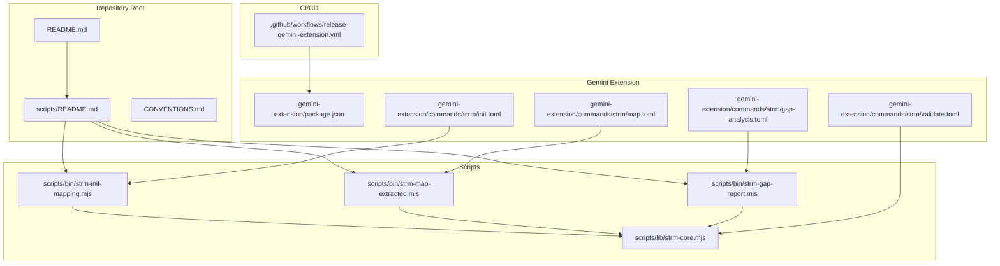
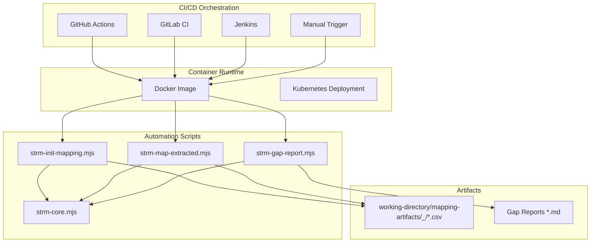
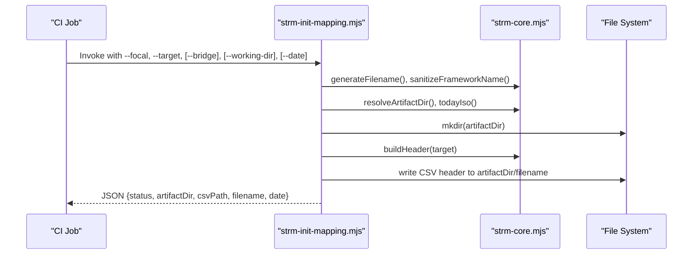
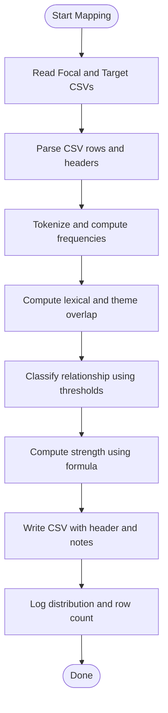
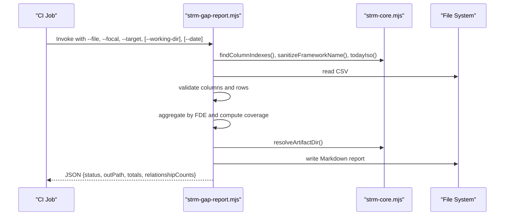
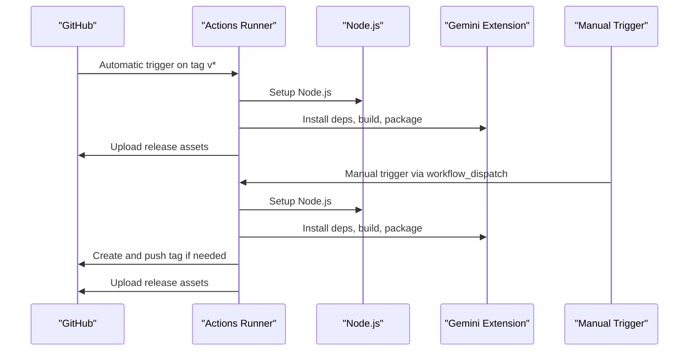
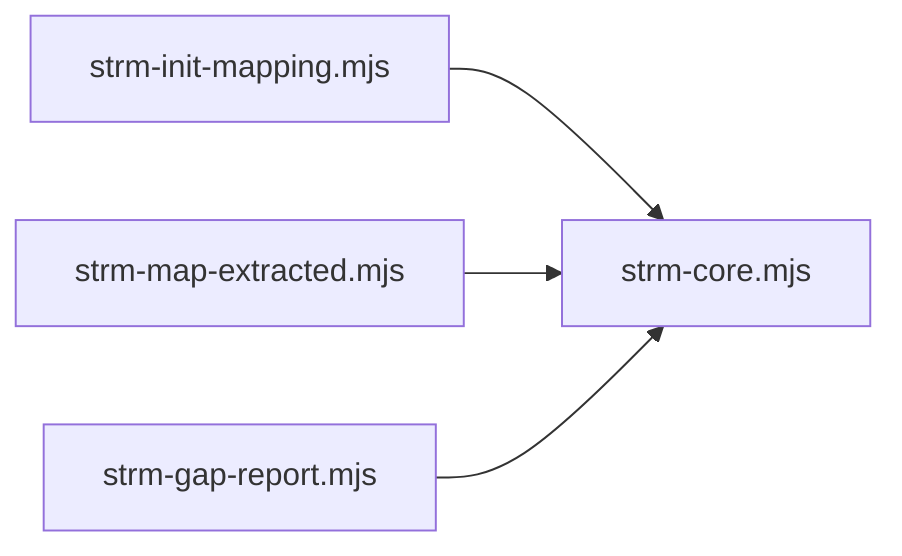

# Automation Integration and CI/CD

<cite>
**Referenced Files in This Document**
- [README.md](file://README.md)
- [scripts/README.md](file://scripts/README.md)
- [scripts/lib/strm-core.mjs](file://scripts/lib/strm-core.mjs)
- [scripts/bin/strm-init-mapping.mjs](file://scripts/bin/strm-init-mapping.mjs)
- [scripts/bin/strm-map-extracted.mjs](file://scripts/bin/strm-map-extracted.mjs)
- [scripts/bin/strm-gap-report.mjs](file://scripts/bin/strm-gap-report.mjs)
- [.github/workflows/release-gemini-extension.yml](file://.github/workflows/release-gemini-extension.yml)
- [gemini-extension/commands/strm/init.toml](file://gemini-extension/commands/strm/init.toml)
- [gemini-extension/commands/strm/map.toml](file://gemini-extension/commands/strm/map.toml)
- [gemini-extension/commands/strm/gap-analysis.toml](file://gemini-extension/commands/strm/gap-analysis.toml)
- [gemini-extension/commands/strm/validate.toml](file://gemini-extension/commands/strm/validate.toml)
- [gemini-extension/package.json](file://gemini-extension/package.json)
- [CONVENTIONS.md](file://CONVENTIONS.md)
</cite>

## Update Summary
**Changes Made**
- Enhanced GitHub Actions workflow documentation to reflect manual trigger capability (workflow_dispatch)
- Added tag_name input parameter documentation for flexible release management
- Updated CI/CD integration patterns to include manual workflow execution
- Revised release management strategy to support both automated and manual triggers

## Table of Contents
1. [Introduction](#introduction)
2. [Project Structure](#project-structure)
3. [Core Components](#core-components)
4. [Architecture Overview](#architecture-overview)
5. [Detailed Component Analysis](#detailed-component-analysis)
6. [Dependency Analysis](#dependency-analysis)
7. [Performance Considerations](#performance-considerations)
8. [Troubleshooting Guide](#troubleshooting-guide)
9. [Conclusion](#conclusion)
10. [Appendices](#appendices)

## Introduction
This document describes how to integrate STRM scripts into automated workflows and CI/CD systems. It focuses on:
- Integration patterns with GitHub Actions, GitLab CI, and Jenkins
- Containerization approaches using Docker
- Cloud-native deployment strategies
- Environment variable configuration and credential management
- Artifact handling and result reporting
- Complete pipeline examples for automated framework mapping, periodic compliance validation, and change detection
- Testing strategies, quality gates, and failure recovery
- Monitoring, logging, alerting, and performance metrics collection

The STRM Mapping toolkit produces deterministic CSV outputs following NIST IR 8477 methodology. The scripts in this repository are designed to be invoked from CI/CD systems to automate mapping, validation, and gap reporting.

## Project Structure
At a high level, the repository organizes automation around:
- Core scripts under scripts/bin and shared logic under scripts/lib
- GitHub Actions workflow for packaging and releasing the Gemini extension with manual trigger capability
- Prompt-driven automation via TOML command files for the Gemini CLI extension
- Conventions and validations that guide deterministic behavior and quality gates



**Diagram sources**
- [README.md:1-30](file://README.md#L1-L30)
- [scripts/README.md:1-31](file://scripts/README.md#L1-L31)
- [scripts/lib/strm-core.mjs:1-343](file://scripts/lib/strm-core.mjs#L1-L343)
- [.github/workflows/release-gemini-extension.yml:1-69](file://.github/workflows/release-gemini-extension.yml#L1-L69)
- [gemini-extension/package.json:1-26](file://gemini-extension/package.json#L1-L26)
- [gemini-extension/commands/strm/init.toml:1-14](file://gemini-extension/commands/strm/init.toml#L1-L14)
- [gemini-extension/commands/strm/map.toml:1-20](file://gemini-extension/commands/strm/map.toml#L1-L20)
- [gemini-extension/commands/strm/gap-analysis.toml:1-19](file://gemini-extension/commands/strm/gap-analysis.toml#L1-L19)
- [gemini-extension/commands/strm/validate.toml:1-18](file://gemini-extension/commands/strm/validate.toml#L1-L18)

**Section sources**
- [README.md:1-30](file://README.md#L1-L30)
- [scripts/README.md:1-31](file://scripts/README.md#L1-L31)

## Core Components
- Deterministic scripts for mapping, initialization, gap reporting, and validation
- Shared core library implementing CSV parsing, header building, scoring, and artifact path resolution
- Command prompts for the Gemini extension that orchestrate script invocations
- GitHub Actions workflow for packaging and releasing the extension with manual trigger capability

Key responsibilities:
- Initialize mapping artifacts and CSV headers
- Compute STRM relationships and strengths deterministically
- Validate CSVs against NIST IR 8477 formula and column requirements
- Generate gap analysis summaries grouped by FDE
- Provide consistent artifact directory layout and filenames
- Support both automated and manual release management

**Section sources**
- [scripts/README.md:10-31](file://scripts/README.md#L10-L31)
- [scripts/lib/strm-core.mjs:35-57](file://scripts/lib/strm-core.mjs#L35-L57)
- [scripts/lib/strm-core.mjs:81-97](file://scripts/lib/strm-core.mjs#L81-L97)
- [scripts/lib/strm-core.mjs:206-265](file://scripts/lib/strm-core.mjs#L206-L265)
- [scripts/lib/strm-core.mjs:267-277](file://scripts/lib/strm-core.mjs#L267-L277)
- [gemini-extension/commands/strm/init.toml:1-14](file://gemini-extension/commands/strm/init.toml#L1-L14)
- [gemini-extension/commands/strm/map.toml:1-20](file://gemini-extension/commands/strm/map.toml#L1-L20)
- [gemini-extension/commands/strm/gap-analysis.toml:1-19](file://gemini-extension/commands/strm/gap-analysis.toml#L1-L19)
- [gemini-extension/commands/strm/validate.toml:1-18](file://gemini-extension/commands/strm/validate.toml#L1-L18)

## Architecture Overview
The automation architecture centers on deterministic Node.js scripts orchestrated by CI/CD systems. The scripts rely on a shared core library for CSV handling, scoring, and artifact path management. The Gemini extension's prompt-driven commands wrap these scripts for interactive and automated use.



**Diagram sources**
- [scripts/bin/strm-init-mapping.mjs:1-58](file://scripts/bin/strm-init-mapping.mjs#L1-L58)
- [scripts/bin/strm-map-extracted.mjs:1-278](file://scripts/bin/strm-map-extracted.mjs#L1-L278)
- [scripts/bin/strm-gap-report.mjs:1-150](file://scripts/bin/strm-gap-report.mjs#L1-L150)
- [scripts/lib/strm-core.mjs:267-277](file://scripts/lib/strm-core.mjs#L267-L277)

## Detailed Component Analysis

### Initialization Script (strm-init-mapping.mjs)
Purpose:
- Creates a dated artifact directory and initializes a CSV with the canonical header for a given focal-to-target mapping.

Behavior:
- Parses arguments for focal, target, optional bridge, working directory, and date
- Generates sanitized filename and resolves artifact directory
- Writes a single CSV row containing the header



**Diagram sources**
- [scripts/bin/strm-init-mapping.mjs:12-58](file://scripts/bin/strm-init-mapping.mjs#L12-L58)
- [scripts/lib/strm-core.mjs:67-79](file://scripts/lib/strm-core.mjs#L67-L79)
- [scripts/lib/strm-core.mjs:267-277](file://scripts/lib/strm-core.mjs#L267-L277)
- [scripts/lib/strm-core.mjs:81-97](file://scripts/lib/strm-core.mjs#L81-L97)

**Section sources**
- [scripts/bin/strm-init-mapping.mjs:12-58](file://scripts/bin/strm-init-mapping.mjs#L12-L58)
- [scripts/lib/strm-core.mjs:67-79](file://scripts/lib/strm-core.mjs#L67-L79)
- [scripts/lib/strm-core.mjs:81-97](file://scripts/lib/strm-core.mjs#L81-L97)
- [scripts/lib/strm-core.mjs:267-277](file://scripts/lib/strm-core.mjs#L267-L277)

### Mapping Script (strm-map-extracted.mjs)
Purpose:
- Produces row-level STRM mappings between two extracted control catalogs.

Behavior:
- Reads two CSVs (focal and target)
- Tokenizes and computes lexical overlap, theme overlap, and Jaccard similarity
- Classifies relationships using thresholds and modal conflict checks
- Computes strength scores using the NIST IR 8477 formula
- Writes a CSV with canonical header and relationship notes



**Diagram sources**
- [scripts/bin/strm-map-extracted.mjs:119-258](file://scripts/bin/strm-map-extracted.mjs#L119-L258)
- [scripts/lib/strm-core.mjs:35-57](file://scripts/lib/strm-core.mjs#L35-L57)

**Section sources**
- [scripts/bin/strm-map-extracted.mjs:119-258](file://scripts/bin/strm-map-extracted.mjs#L119-L258)
- [scripts/lib/strm-core.mjs:35-57](file://scripts/lib/strm-core.mjs#L35-L57)

### Gap Report Script (strm-gap-report.mjs)
Purpose:
- Generates a human-readable gap summary grouped by FDE and relationship distribution.

Behavior:
- Validates required columns and parses CSV
- Aggregates relationships per FDE to compute full/partial/gap coverage
- Produces Markdown report and logs totals and counts



**Diagram sources**
- [scripts/bin/strm-gap-report.mjs:12-150](file://scripts/bin/strm-gap-report.mjs#L12-L150)
- [scripts/lib/strm-core.mjs:186-204](file://scripts/lib/strm-core.mjs#L186-L204)
- [scripts/lib/strm-core.mjs:267-277](file://scripts/lib/strm-core.mjs#L267-L277)

**Section sources**
- [scripts/bin/strm-gap-report.mjs:12-150](file://scripts/bin/strm-gap-report.mjs#L12-L150)
- [scripts/lib/strm-core.mjs:186-204](file://scripts/lib/strm-core.mjs#L186-L204)
- [scripts/lib/strm-core.mjs:267-277](file://scripts/lib/strm-core.mjs#L267-L277)

### Core Library (strm-core.mjs)
Responsibilities:
- Relationship and confidence constants
- Strength computation enforcing NIST IR 8477 formula
- CSV parsing and serialization helpers
- Header normalization and column indexing
- Data validation for required fields and formula consistency
- Artifact directory resolution and filename sanitization
- Utilities for listing inputs and finding existing mappings

```mermaid
classDiagram
class StrmCore {
+computeStrength(relationship, confidence, rationaleType) Score
+sanitizeFrameworkName(name) string
+generateFilename(focal, target, bridge) string
+buildHeader(targetName) string[]
+parseCsv(text) string[][]
+toCsv(rows) string
+findColumnIndexes(headerRow) map
+validateDataRow(row, indexes, rowNumber) {errors, warnings}
+resolveArtifactDir(baseDir, focal, target, dateIso) string
+todayIso() string
+listInputFiles(dirPath) FileInfo[]
+findExistingMappings(workingDir, focalFramework, targetFramework) string[]
}
```

**Diagram sources**
- [scripts/lib/strm-core.mjs:35-57](file://scripts/lib/strm-core.mjs#L35-L57)
- [scripts/lib/strm-core.mjs:59-79](file://scripts/lib/strm-core.mjs#L59-L79)
- [scripts/lib/strm-core.mjs:81-97](file://scripts/lib/strm-core.mjs#L81-L97)
- [scripts/lib/strm-core.mjs:99-180](file://scripts/lib/strm-core.mjs#L99-L180)
- [scripts/lib/strm-core.mjs:186-204](file://scripts/lib/strm-core.mjs#L186-L204)
- [scripts/lib/strm-core.mjs:206-265](file://scripts/lib/strm-core.mjs#L206-L265)
- [scripts/lib/strm-core.mjs:267-277](file://scripts/lib/strm-core.mjs#L267-L277)
- [scripts/lib/strm-core.mjs:279-342](file://scripts/lib/strm-core.mjs#L279-L342)

**Section sources**
- [scripts/lib/strm-core.mjs:35-57](file://scripts/lib/strm-core.mjs#L35-L57)
- [scripts/lib/strm-core.mjs:81-97](file://scripts/lib/strm-core.mjs#L81-L97)
- [scripts/lib/strm-core.mjs:206-265](file://scripts/lib/strm-core.mjs#L206-L265)
- [scripts/lib/strm-core.mjs:267-277](file://scripts/lib/strm-core.mjs#L267-L277)
- [scripts/lib/strm-core.mjs:279-342](file://scripts/lib/strm-core.mjs#L279-L342)

### Enhanced GitHub Actions Workflow (release-gemini-extension.yml)
Purpose:
- Automates building and releasing the Gemini extension on tagged releases with manual trigger capability.

Highlights:
- **Enhanced Trigger Configuration**: Supports both automatic tag-based triggers and manual workflow dispatch
- **Flexible Tag Management**: Uses dynamic tag resolution for both automated and manual execution modes
- **Tag Creation Logic**: Automatically creates and pushes tags for manual triggers when they don't exist
- **Consistent Release Process**: Maintains the same build and packaging steps regardless of trigger type

**Updated** Enhanced with manual trigger capability and flexible tag management for improved release flexibility



**Diagram sources**
- [.github/workflows/release-gemini-extension.yml:1-69](file://.github/workflows/release-gemini-extension.yml#L1-L69)
- [gemini-extension/package.json:7-13](file://gemini-extension/package.json#L7-L13)

**Section sources**
- [.github/workflows/release-gemini-extension.yml:1-69](file://.github/workflows/release-gemini-extension.yml#L1-L69)
- [gemini-extension/package.json:7-13](file://gemini-extension/package.json#L7-L13)

### Gemini CLI Commands (init.toml, map.toml, gap-analysis.toml, validate.toml)
Purpose:
- Provide prompt-driven automation for initializing mappings, running mapping sessions, generating gap reports, and validating CSVs.

Patterns:
- List inputs, check for existing mappings, initialize artifacts, compute strengths, validate, and produce reports

**Section sources**
- [gemini-extension/commands/strm/init.toml:1-14](file://gemini-extension/commands/strm/init.toml#L1-L14)
- [gemini-extension/commands/strm/map.toml:1-20](file://gemini-extension/commands/strm/map.toml#L1-L20)
- [gemini-extension/commands/strm/gap-analysis.toml:1-19](file://gemini-extension/commands/strm/gap-analysis.toml#L1-L19)
- [gemini-extension/commands/strm/validate.toml:1-18](file://gemini-extension/commands/strm/validate.toml#L1-L18)

## Dependency Analysis
The scripts depend on the shared core library for:
- CSV parsing/serialization
- Header normalization and column indexing
- Validation logic
- Artifact path resolution and filename sanitization



**Diagram sources**
- [scripts/bin/strm-init-mapping.mjs:10](file://scripts/bin/strm-init-mapping.mjs#L10)
- [scripts/bin/strm-map-extracted.mjs:3](file://scripts/bin/strm-map-extracted.mjs#L3)
- [scripts/bin/strm-gap-report.mjs:10](file://scripts/bin/strm-gap-report.mjs#L10)
- [scripts/lib/strm-core.mjs:1-3](file://scripts/lib/strm-core.mjs#L1-L3)

**Section sources**
- [scripts/bin/strm-init-mapping.mjs:10](file://scripts/bin/strm-init-mapping.mjs#L10)
- [scripts/bin/strm-map-extracted.mjs:3](file://scripts/bin/strm-map-extracted.mjs#L3)
- [scripts/bin/strm-gap-report.mjs:10](file://scripts/bin/strm-gap-report.mjs#L10)
- [scripts/lib/strm-core.mjs:1-3](file://scripts/lib/strm-core.mjs#L1-L3)

## Performance Considerations
- Tokenization and overlap computations scale with the number of controls in focal and target catalogs. For large datasets, consider batching or parallelizing per-file processing.
- CSV parsing is implemented without external libraries; ensure input files are well-formed to avoid rework.
- Use the built-in validation early to fail fast on malformed CSVs.
- Artifact directory layout includes dates and sanitized names to prevent collisions and improve discoverability.

## Troubleshooting Guide
Common issues and remedies:
- Missing required columns in CSV: The validator checks for presence of required fields and will exit with an error if missing.
- Strength mismatch: The validator enforces the NIST IR 8477 formula; recalculate strength if mismatches occur.
- Empty CSV: Gap report exits early if the CSV is empty.
- Incorrect working directory: Scripts expect to run from the repository root and write outputs under working-directory/mapping-artifacts.

Operational tips:
- Always initialize artifacts before mapping
- Validate intermediate CSVs before generating gap reports
- Use the provided scripts to list inputs and find existing mappings to avoid duplication

**Section sources**
- [scripts/lib/strm-core.mjs:206-265](file://scripts/lib/strm-core.mjs#L206-L265)
- [scripts/bin/strm-gap-report.mjs:36-55](file://scripts/bin/strm-gap-report.mjs#L36-L55)
- [README.md:24-30](file://README.md#L24-L30)

## Conclusion
The STRM Mapping scripts provide a robust foundation for automating cybersecurity framework alignment and compliance workflows. By leveraging deterministic mappings, strict validation, and structured artifact outputs, teams can integrate these scripts into CI/CD pipelines across GitHub Actions, GitLab CI, and Jenkins. The enhanced GitHub Actions workflow now supports both automated and manual release management, providing greater flexibility for different deployment scenarios. Containerization and cloud-native deployment further enable scalable, reproducible executions with consistent environment variable configuration and artifact handling.

## Appendices

### CI/CD Integration Patterns

- **GitHub Actions**
  - **Automatic Triggers**: Use tag-based triggers for automated releases on version tags
  - **Manual Triggers**: Utilize workflow_dispatch for on-demand releases with custom tag specification
  - **Matrix Builds**: Test multiple Node.js versions for compatibility
  - **Cache Dependencies**: Speed up builds using npm cache
  - **Publish Artifacts**: Upload release assets and reports after successful mapping and validation

- **GitLab CI**
  - Define stages for linting, mapping, validation, and reporting
  - Use Docker images to ensure consistent environments
  - Store artifacts for downstream review and audit

- **Jenkins**
  - Create declarative pipelines with parallel stages for mapping and validation
  - Integrate with artifact repositories for long-term storage
  - Configure post-build actions to notify stakeholders

**Updated** Enhanced with manual trigger capabilities and flexible tag management for improved release flexibility

### Containerization with Docker
- Base image: Use a Node.js slim image appropriate for the scripts' engine requirements
- Entrypoint: Set the working directory to the repository root
- Volumes: Mount working-directory to persist artifacts across runs
- Environment variables: Pass credentials and configuration via environment variables managed by the orchestrator
- Multi-stage builds: Separate build-time dependencies from runtime image for smaller footprint

### Cloud-Native Deployment Strategies
- Kubernetes Jobs: Run one-off mapping jobs for ad-hoc or scheduled tasks
- CronJobs: Schedule periodic compliance validation and change detection workflows
- StatefulSets/PersistentVolumes: Persist mapping artifacts and knowledge bases
- Secrets and ConfigMaps: Manage credentials and configuration securely

### Environment Variables and Credential Management
- API keys and tokens: Inject via CI/CD secrets or Kubernetes Secrets
- Script arguments: Prefer environment variables for focal/target/bridge names and working directory paths
- Validation: Ensure variables are set before invoking scripts; fail fast on missing values

### Artifact Handling and Result Reporting
- Artifact directory: Use working-directory/mapping-artifacts/<date>_<pair>/
- Filenames: Sanitized and canonicalized to avoid filesystem issues
- Reports: Generate Markdown gap summaries alongside CSV outputs
- Publishing: Upload artifacts and reports to CI/CD artifact stores or object storage

### Enhanced Release Management Strategy

**Manual Trigger Workflow**
1. **Trigger Selection**: Choose workflow_dispatch to initiate manual execution
2. **Tag Specification**: Provide tag_name input parameter (e.g., v1.2.3)
3. **Tag Validation**: System checks if tag exists on remote origin
4. **Automatic Creation**: Creates and pushes tag if it doesn't exist
5. **Build Execution**: Proceeds with standard build and packaging process
6. **Asset Publication**: Uploads platform-specific release assets

**Automated Trigger Workflow**
1. **Tag Detection**: Automatic trigger on push events with tag pattern v*
2. **Direct Execution**: Bypasses manual tag creation step
3. **Standard Process**: Follows identical build and packaging steps
4. **Asset Publication**: Publishes release assets to GitHub Releases

**Benefits of Enhanced Workflow**
- **Flexibility**: Supports both automated and manual release processes
- **Control**: Allows precise tag management for release coordination
- **Reliability**: Ensures consistent build process regardless of trigger type
- **Traceability**: Maintains clear audit trail for both automated and manual releases

### Pipeline Examples

- **Automated Framework Mapping**
  - Steps: Initialize mapping, extract and map controls, compute strengths, validate, generate gap report
  - Triggers: Pull requests or pushes to specific branches
  - Outputs: CSV and gap report artifacts

- **Periodic Compliance Validation**
  - Steps: List inputs, run mapping, validate, publish results
  - Triggers: Scheduled cron job
  - Outputs: Compliance dashboards and notifications

- **Change Detection Workflow**
  - Steps: Detect file changes, re-run affected mappings, compare reports, alert on regressions
  - Triggers: Webhooks on repository updates
  - Outputs: Alerts and remediation tasks

- **Enhanced Release Management**
  - **Manual Trigger**: workflow_dispatch with tag_name parameter for on-demand releases
  - **Automated Trigger**: push events with tag pattern for automated releases
  - **Flexible Tagging**: Support for custom version tags and semantic versioning
  - **Tag Validation**: Automatic tag creation and synchronization with remote repository

### Testing Strategies, Quality Gates, and Failure Recovery
- Unit-like checks: Validate CSV headers, required columns, and formula consistency
- Integration tests: End-to-end mapping and gap report generation
- Quality gates: Fail on validation errors, enforce minimum coverage thresholds
- Failure recovery: Retry transient failures, rollback to previous artifacts, notify operators

### Monitoring, Logging, Alerting, and Metrics
- Logging: Emit structured JSON from scripts for ingestion by log collectors
- Metrics: Track mapping duration, relationship distribution, and validation pass rates
- Alerting: Notify on failed validations, missing artifacts, or threshold breaches
- Dashboards: Visualize coverage trends and compliance status over time