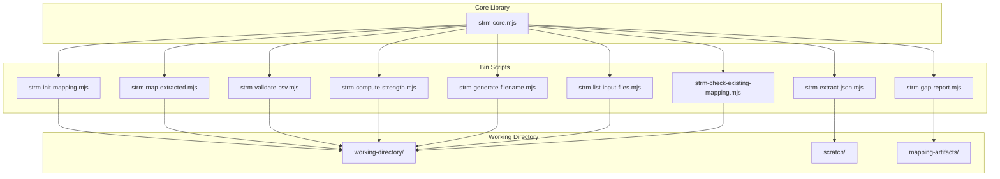
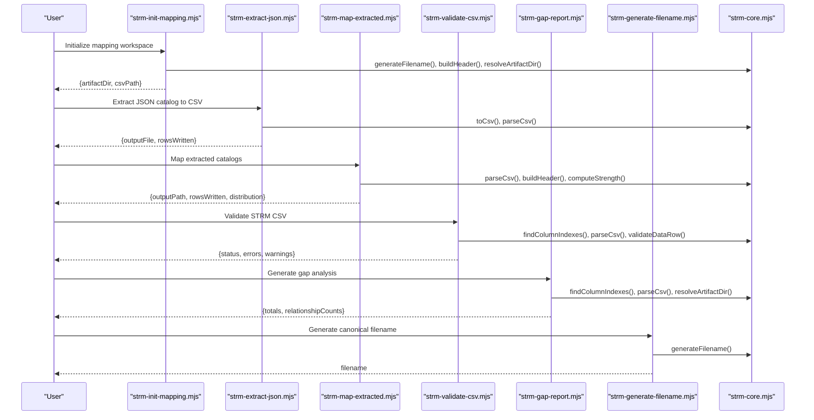
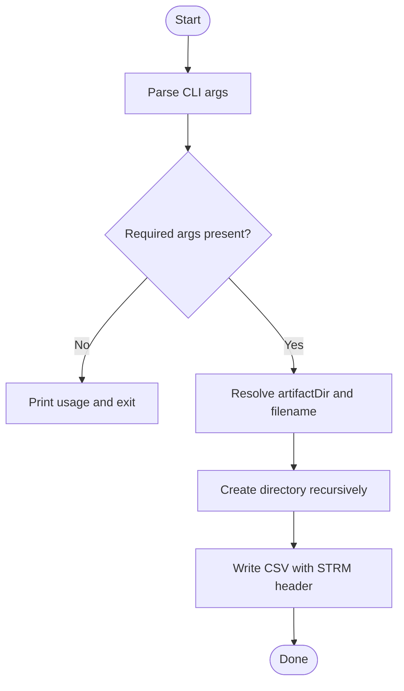
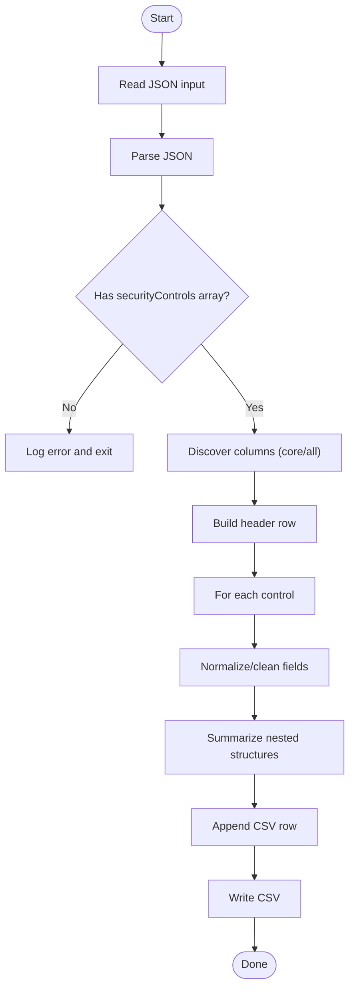
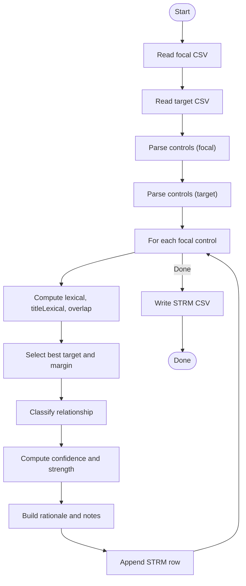
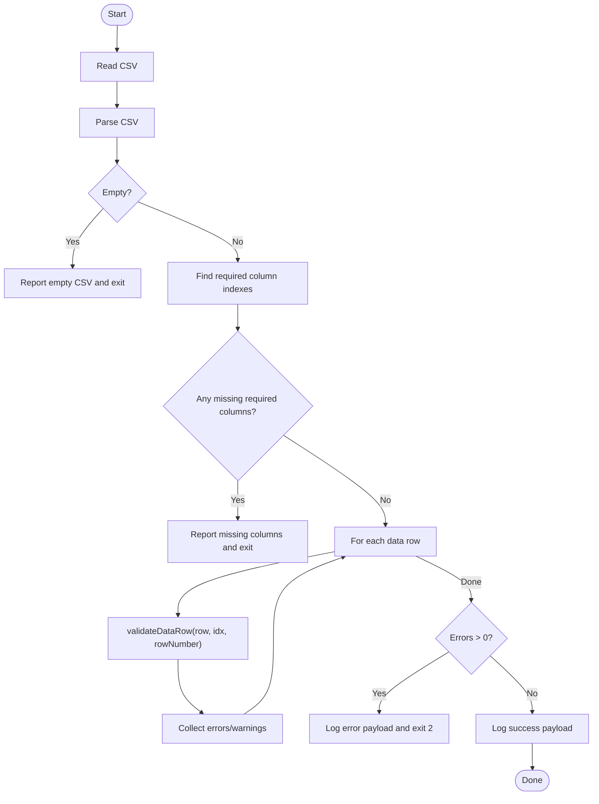
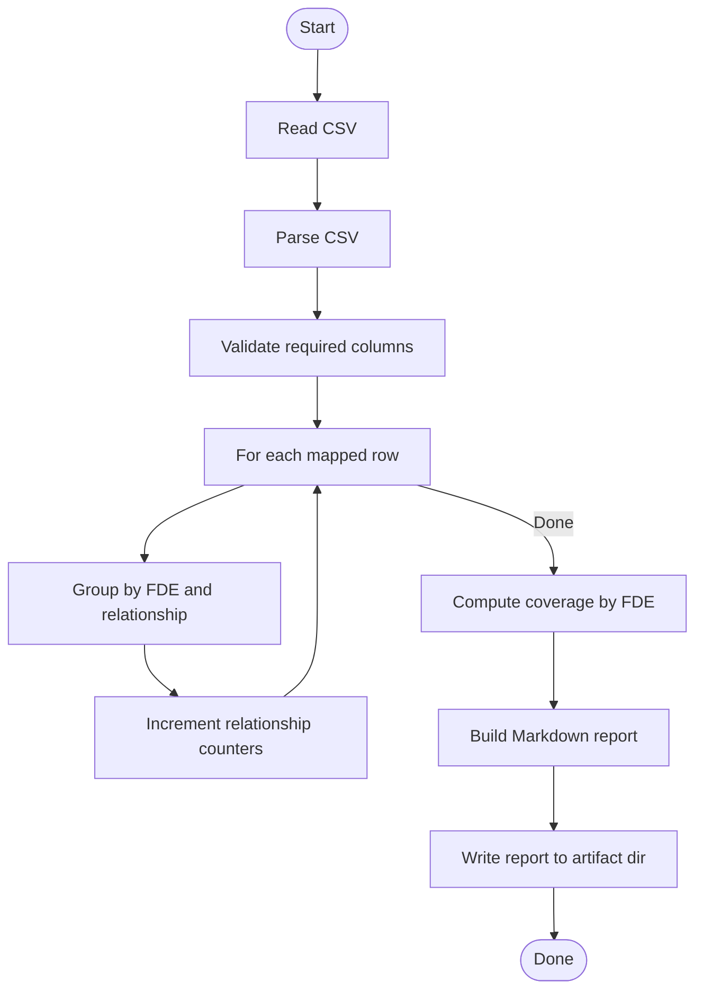
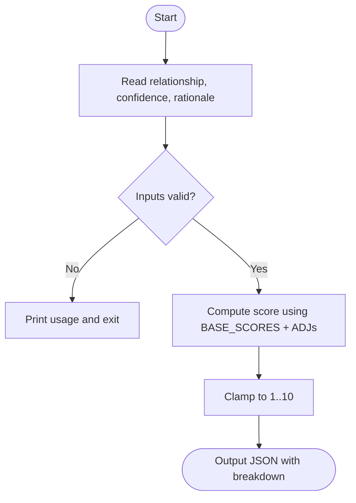
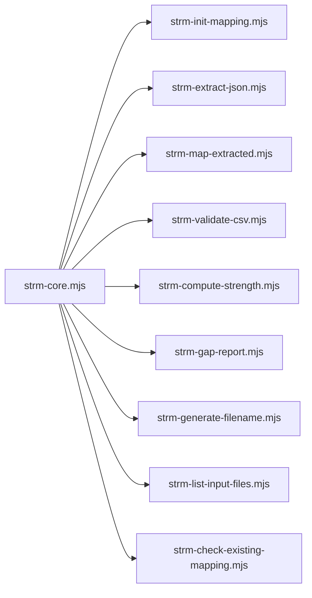

# Batch Processing Workflows and Pipelines

<cite>
**Referenced Files in This Document**
- [scripts/README.md](file://scripts/README.md)
- [README.md](file://README.md)
- [scripts/lib/strm-core.mjs](file://scripts/lib/strm-core.mjs)
- [scripts/bin/strm-init-mapping.mjs](file://scripts/bin/strm-init-mapping.mjs)
- [scripts/bin/strm-extract-json.mjs](file://scripts/bin/strm-extract-json.mjs)
- [scripts/bin/strm-validate-csv.mjs](file://scripts/bin/strm-validate-csv.mjs)
- [scripts/bin/strm-compute-strength.mjs](file://scripts/bin/strm-compute-strength.mjs)
- [scripts/bin/strm-gap-report.mjs](file://scripts/bin/strm-gap-report.mjs)
- [scripts/bin/strm-generate-filename.mjs](file://scripts/bin/strm-generate-filename.mjs)
- [scripts/bin/strm-map-extracted.mjs](file://scripts/bin/strm-map-extracted.mjs)
- [scripts/bin/strm-list-input-files.mjs](file://scripts/bin/strm-list-input-files.mjs)
- [scripts/bin/strm-check-existing-mapping.mjs](file://scripts/bin/strm-check-existing-mapping.mjs)
- [examples/example-framework-to-control.md](file://examples/example-framework-to-control.md)
- [examples/example-framework-to-regulation.md](file://examples/example-framework-to-regulation.md)
- [examples/example-control-to-control.md](file://examples/example-control-to-control.md)
- [examples/example-regulation-to-control.md](file://examples/example-regulation-to-control.md)
</cite>

## Table of Contents
1. [Introduction](#introduction)
2. [Project Structure](#project-structure)
3. [Core Components](#core-components)
4. [Architecture Overview](#architecture-overview)
5. [Detailed Component Analysis](#detailed-component-analysis)
6. [Dependency Analysis](#dependency-analysis)
7. [Performance Considerations](#performance-considerations)
8. [Troubleshooting Guide](#troubleshooting-guide)
9. [Conclusion](#conclusion)
10. [Appendices](#appendices)

## Introduction
This document explains how to orchestrate large-scale STRM (Set-Theory Relationship Mapping) workflows using deterministic, composable scripts. It covers end-to-end patterns from initialization and data extraction to validation, automated mapping, strength scoring, gap analysis, and output generation. It also provides pipeline construction techniques, dependency management, error handling strategies, conditional processing logic, and practical examples for framework-to-framework crosswalks, control catalog alignments, and regulatory compliance mappings. Guidance is included for performance optimization, parallelization, and resource management to handle large datasets efficiently.

## Project Structure
The STRM toolkit organizes functionality into:
- Core library providing shared parsing, validation, and utility functions
- Bin scripts implementing discrete workflow steps
- Examples demonstrating real-world mapping scenarios
- Working directory containing inputs, extracted CSVs, and generated artifacts

**Diagram sources**
- [scripts/lib/strm-core.mjs](file://scripts/lib/strm-core.mjs)
- [scripts/bin/strm-init-mapping.mjs](file://scripts/bin/strm-init-mapping.mjs)
- [scripts/bin/strm-extract-json.mjs](file://scripts/bin/strm-extract-json.mjs)
- [scripts/bin/strm-map-extracted.mjs](file://scripts/bin/strm-map-extracted.mjs)
- [scripts/bin/strm-validate-csv.mjs](file://scripts/bin/strm-validate-csv.mjs)
- [scripts/bin/strm-compute-strength.mjs](file://scripts/bin/strm-compute-strength.mjs)
- [scripts/bin/strm-gap-report.mjs](file://scripts/bin/strm-gap-report.mjs)
- [scripts/bin/strm-generate-filename.mjs](file://scripts/bin/strm-generate-filename.mjs)
- [scripts/bin/strm-list-input-files.mjs](file://scripts/bin/strm-list-input-files.mjs)
- [scripts/bin/strm-check-existing-mapping.mjs](file://scripts/bin/strm-check-existing-mapping.mjs)

**Section sources**
- [scripts/README.md](file://scripts/README.md)
- [README.md](file://README.md)

## Core Components
- Core library (strm-core.mjs): Provides CSV parsing, header normalization, column indexing, validation, filename generation, artifact directory resolution, date helpers, and utility functions for listing inputs and finding existing mappings.
- Initialization script (strm-init-mapping.mjs): Creates a new mapping workspace and initializes the output CSV with the STRM header.
- Extraction script (strm-extract-json.mjs): Converts JSON catalogs into CSV with standardized columns and summarized metadata.
- Mapping script (strm-map-extracted.mjs): Computes STRM relationships and strengths between two extracted CSVs using lexical and thematic similarity.
- Validation script (strm-validate-csv.mjs): Enforces required columns and row-level integrity checks.
- Strength computation (strm-compute-strength.mjs): Applies NIST IR 8477 scoring formula deterministically.
- Gap report (strm-gap-report.mjs): Aggregates coverage and relationship distribution by FDE.
- Filename generator (strm-generate-filename.mjs): Produces canonical CSV filenames for artifacts.
- Utilities: List inputs (strm-list-input-files.mjs) and check existing mappings (strm-check-existing-mapping.mjs).

**Section sources**
- [scripts/lib/strm-core.mjs](file://scripts/lib/strm-core.mjs)
- [scripts/bin/strm-init-mapping.mjs](file://scripts/bin/strm-init-mapping.mjs)
- [scripts/bin/strm-extract-json.mjs](file://scripts/bin/strm-extract-json.mjs)
- [scripts/bin/strm-map-extracted.mjs](file://scripts/bin/strm-map-extracted.mjs)
- [scripts/bin/strm-validate-csv.mjs](file://scripts/bin/strm-validate-csv.mjs)
- [scripts/bin/strm-compute-strength.mjs](file://scripts/bin/strm-compute-strength.mjs)
- [scripts/bin/strm-gap-report.mjs](file://scripts/bin/strm-gap-report.mjs)
- [scripts/bin/strm-generate-filename.mjs](file://scripts/bin/strm-generate-filename.mjs)
- [scripts/bin/strm-list-input-files.mjs](file://scripts/bin/strm-list-input-files.mjs)
- [scripts/bin/strm-check-existing-mapping.mjs](file://scripts/bin/strm-check-existing-mapping.mjs)

## Architecture Overview
The workflow is a pipeline of deterministic steps orchestrated by Node.js scripts. Each step writes artifacts to the working directory and reads previous outputs as inputs. The core library centralizes shared logic to ensure consistency across steps.

**Diagram sources**
- [scripts/bin/strm-init-mapping.mjs](file://scripts/bin/strm-init-mapping.mjs)
- [scripts/bin/strm-extract-json.mjs](file://scripts/bin/strm-extract-json.mjs)
- [scripts/bin/strm-map-extracted.mjs](file://scripts/bin/strm-map-extracted.mjs)
- [scripts/bin/strm-validate-csv.mjs](file://scripts/bin/strm-validate-csv.mjs)
- [scripts/bin/strm-gap-report.mjs](file://scripts/bin/strm-gap-report.mjs)
- [scripts/bin/strm-generate-filename.mjs](file://scripts/bin/strm-generate-filename.mjs)
- [scripts/lib/strm-core.mjs](file://scripts/lib/strm-core.mjs)

## Detailed Component Analysis

### Initialization Pipeline (strm-init-mapping)
Responsibilities:
- Parse CLI arguments for focal, target, optional bridge, working directory, and date
- Generate canonical filename and resolve artifact directory
- Create directory and write initial CSV with STRM header

Processing logic:
- Argument parsing and validation
- Filename and directory resolution using core utilities
- Write header-only CSV

**Diagram sources**
- [scripts/bin/strm-init-mapping.mjs](file://scripts/bin/strm-init-mapping.mjs)
- [scripts/lib/strm-core.mjs](file://scripts/lib/strm-core.mjs)

**Section sources**
- [scripts/bin/strm-init-mapping.mjs](file://scripts/bin/strm-init-mapping.mjs)
- [scripts/lib/strm-core.mjs](file://scripts/lib/strm-core.mjs)

### Data Extraction (strm-extract-json)
Responsibilities:
- Load JSON catalog and extract security controls
- Normalize and clean text fields
- Discover and select columns (core metadata or all fields)
- Serialize nested structures and write CSV

Processing logic:
- Parse JSON and locate catalog.securityControls[]
- Compute derived columns (e.g., subFamily)
- Clean and summarize values
- Write CSV with discovered columns

**Diagram sources**
- [scripts/bin/strm-extract-json.mjs](file://scripts/bin/strm-extract-json.mjs)
- [scripts/lib/strm-core.mjs](file://scripts/lib/strm-core.mjs)

**Section sources**
- [scripts/bin/strm-extract-json.mjs](file://scripts/bin/strm-extract-json.mjs)
- [scripts/lib/strm-core.mjs](file://scripts/lib/strm-core.mjs)

### Automated Mapping (strm-map-extracted)
Responsibilities:
- Tokenize and compute lexical overlap and thematic similarity
- Classify relationships using thresholds and modal conflict checks
- Compute confidence and strength deterministically
- Produce STRM CSV with rationale and notes

Processing logic:
- Parse both extracted CSVs
- Compute token frequencies, Jaccard scores, and thematic overlaps
- Select best target per source and compute margins
- Classify relationship and strength
- Write STRM CSV

**Diagram sources**
- [scripts/bin/strm-map-extracted.mjs](file://scripts/bin/strm-map-extracted.mjs)
- [scripts/lib/strm-core.mjs](file://scripts/lib/strm-core.mjs)

**Section sources**
- [scripts/bin/strm-map-extracted.mjs](file://scripts/bin/strm-map-extracted.mjs)
- [scripts/lib/strm-core.mjs](file://scripts/lib/strm-core.mjs)

### Validation (strm-validate-csv)
Responsibilities:
- Verify presence of required columns
- Validate each data row for required fields and formula consistency
- Report counts of errors and warnings

Processing logic:
- Parse CSV and check header
- Index required columns
- Iterate rows and collect errors/warnings
- Exit with failure if errors exist

**Diagram sources**
- [scripts/bin/strm-validate-csv.mjs](file://scripts/bin/strm-validate-csv.mjs)
- [scripts/lib/strm-core.mjs](file://scripts/lib/strm-core.mjs)

**Section sources**
- [scripts/bin/strm-validate-csv.mjs](file://scripts/bin/strm-validate-csv.mjs)
- [scripts/lib/strm-core.mjs](file://scripts/lib/strm-core.mjs)

### Gap Analysis (strm-gap-report)
Responsibilities:
- Aggregate coverage by FDE (Full, Partial, Gap)
- Count relationships and produce Markdown summary
- Write artifact to mapping-artifacts

Processing logic:
- Parse CSV and validate required columns
- Count relationships and group by FDE
- Compute coverage categories and percentages
- Write Markdown report

**Diagram sources**
- [scripts/bin/strm-gap-report.mjs](file://scripts/bin/strm-gap-report.mjs)
- [scripts/lib/strm-core.mjs](file://scripts/lib/strm-core.mjs)

**Section sources**
- [scripts/bin/strm-gap-report.mjs](file://scripts/bin/strm-gap-report.mjs)
- [scripts/lib/strm-core.mjs](file://scripts/lib/strm-core.mjs)

### Strength Computation (strm-compute-strength)
Responsibilities:
- Apply NIST IR 8477 scoring formula deterministically
- Validate inputs and clamp score to 1..10

Processing logic:
- Validate relationship, confidence, and rationale type
- Compute base + adjustments and clamp to valid range

**Diagram sources**
- [scripts/bin/strm-compute-strength.mjs](file://scripts/bin/strm-compute-strength.mjs)
- [scripts/lib/strm-core.mjs](file://scripts/lib/strm-core.mjs)

**Section sources**
- [scripts/bin/strm-compute-strength.mjs](file://scripts/bin/strm-compute-strength.mjs)
- [scripts/lib/strm-core.mjs](file://scripts/lib/strm-core.mjs)

### Filename Generation (strm-generate-filename)
Responsibilities:
- Generate canonical CSV filename for STRM artifacts

Processing logic:
- Sanitize framework names and assemble filename

**Section sources**
- [scripts/bin/strm-generate-filename.mjs](file://scripts/bin/strm-generate-filename.mjs)
- [scripts/lib/strm-core.mjs](file://scripts/lib/strm-core.mjs)

### Utilities
- List input files: Enumerate supported input files under a directory
- Check existing mappings: Find prior STRM CSVs matching focal/target names

**Section sources**
- [scripts/bin/strm-list-input-files.mjs](file://scripts/bin/strm-list-input-files.mjs)
- [scripts/bin/strm-check-existing-mapping.mjs](file://scripts/bin/strm-check-existing-mapping.mjs)
- [scripts/lib/strm-core.mjs](file://scripts/lib/strm-core.mjs)

## Dependency Analysis
The scripts depend on the core library for:
- CSV parsing and serialization
- Column indexing and validation
- Filename and directory utilities
- Deterministic strength computation

**Diagram sources**
- [scripts/lib/strm-core.mjs](file://scripts/lib/strm-core.mjs)
- [scripts/bin/strm-init-mapping.mjs](file://scripts/bin/strm-init-mapping.mjs)
- [scripts/bin/strm-extract-json.mjs](file://scripts/bin/strm-extract-json.mjs)
- [scripts/bin/strm-map-extracted.mjs](file://scripts/bin/strm-map-extracted.mjs)
- [scripts/bin/strm-validate-csv.mjs](file://scripts/bin/strm-validate-csv.mjs)
- [scripts/bin/strm-compute-strength.mjs](file://scripts/bin/strm-compute-strength.mjs)
- [scripts/bin/strm-gap-report.mjs](file://scripts/bin/strm-gap-report.mjs)
- [scripts/bin/strm-generate-filename.mjs](file://scripts/bin/strm-generate-filename.mjs)
- [scripts/bin/strm-list-input-files.mjs](file://scripts/bin/strm-list-input-files.mjs)
- [scripts/bin/strm-check-existing-mapping.mjs](file://scripts/bin/strm-check-existing-mapping.mjs)

**Section sources**
- [scripts/lib/strm-core.mjs](file://scripts/lib/strm-core.mjs)

## Performance Considerations
- Prefer streaming or chunked processing for very large CSVs; current scripts load entire files. For massive datasets, consider:
  - Using streams to parse CSVs incrementally
  - Breaking large mappings into smaller batches by FDE subsets
- Optimize tokenization and similarity computations:
  - Precompute token sets and frequencies once per control
  - Use efficient set intersection for Jaccard similarity
  - Cache repeated computations (e.g., thematic hit checks)
- Parallelization strategies:
  - Split mapping across CPU cores by partitioning focal controls
  - Use worker threads or child processes to parallelize best-match loops
  - Ensure thread-safe writes to a single output CSV or merge outputs afterward
- Resource management:
  - Monitor memory usage during tokenization and large CSV writes
  - Use temporary disk storage for intermediate artifacts
  - Limit concurrent file system operations to avoid contention

[No sources needed since this section provides general guidance]

## Troubleshooting Guide
Common issues and remedies:
- Missing required columns in STRM CSV:
  - The validator reports missing required columns and exits with a non-zero status. Add missing columns or regenerate the CSV using the initialization step.
- Invalid relationship/confidence/rationale values:
  - The validator checks allowed sets and reports mismatches. Correct values to allowed enumerations.
- Strength mismatch:
  - The validator recomputes the expected score using the NIST IR 8477 formula and flags mismatches. Adjust relationship/confidence/rationale accordingly.
- Empty or malformed JSON input:
  - The extractor validates the expected JSON path and exits with an error if absent. Verify the JSON structure and path.
- No prior mappings found:
  - Use the existing-mapping checker to confirm prior work and avoid duplication.

**Section sources**
- [scripts/bin/strm-validate-csv.mjs](file://scripts/bin/strm-validate-csv.mjs)
- [scripts/bin/strm-extract-json.mjs](file://scripts/bin/strm-extract-json.mjs)
- [scripts/bin/strm-check-existing-mapping.mjs](file://scripts/bin/strm-check-existing-mapping.mjs)

## Conclusion
The STRM toolkit provides a robust, deterministic pipeline for large-scale crosswalks between frameworks, control catalogs, and regulations. By composing the initialization, extraction, mapping, validation, and gap-report steps, teams can automate end-to-end workflows, enforce quality gates, and scale operations using parallelization and resource-aware batching.

[No sources needed since this section summarizes without analyzing specific files]

## Appendices

### Practical Workflow Patterns and Examples
- Framework-to-control mapping (e.g., NIST SP 800-53 Rev 5 → CIS Controls v8.1):
  - Typical outcomes: Many subset_of relationships; enhancements often map to additional targets.
  - See example for detailed rationale and notes guidance.
- Framework-to-regulation mapping (e.g., NIST SP 800-53 Rev 5 → GDPR):
  - Typical outcomes: Mix of subset_of, superset_of, intersects_with; conflicts require escalation.
  - See example for handling right to erasure vs. audit retention.
- Control-to-control mapping (e.g., ISO/IEC 27001:2022 Annex A → SOC 2 TSC):
  - Highest evidence reuse; translate ISO obligations into observable TSC states.
  - See example for mapping nuances across trust service categories.
- Regulation-to-control mapping (e.g., HIPAA Security Rule → ISO/IEC 27001:2022):
  - Distinguish Required vs. Addressable; track retention and audit protocol references.
  - See example for mapping encryption flexibility and access control nuances.

**Section sources**
- [examples/example-framework-to-control.md](file://examples/example-framework-to-control.md)
- [examples/example-framework-to-regulation.md](file://examples/example-framework-to-regulation.md)
- [examples/example-control-to-control.md](file://examples/example-control-to-control.md)
- [examples/example-regulation-to-control.md](file://examples/example-regulation-to-control.md)