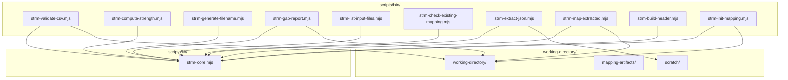
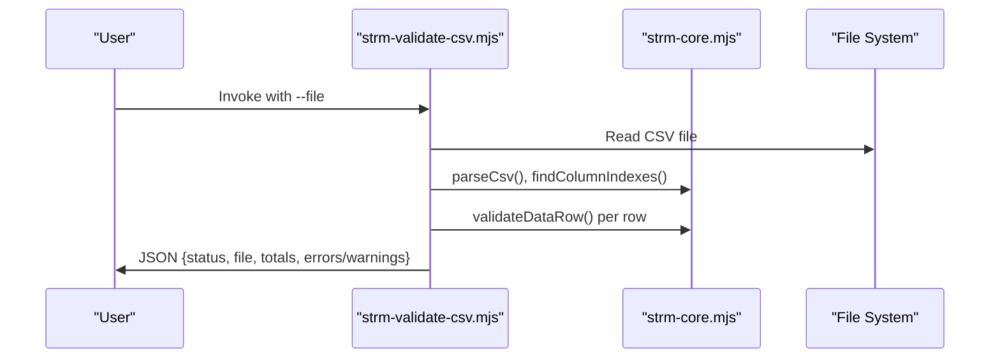
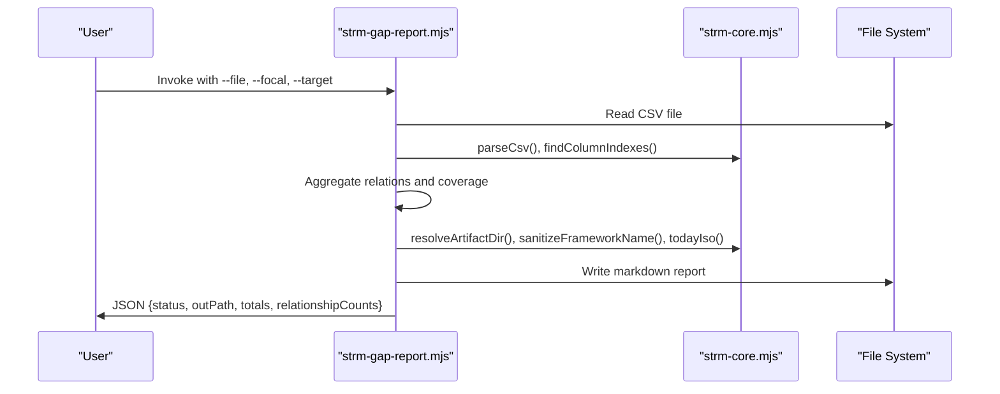
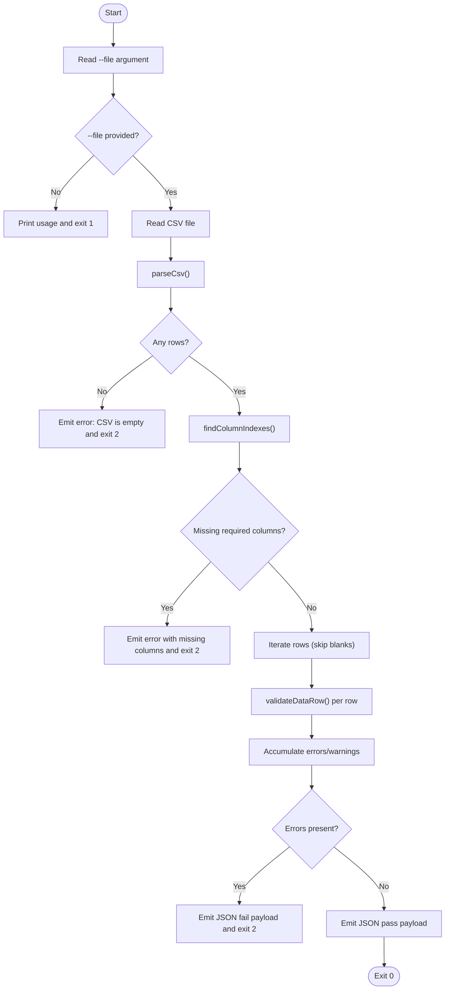
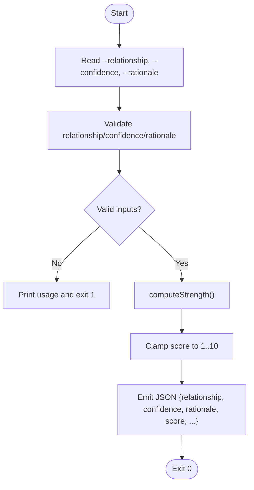
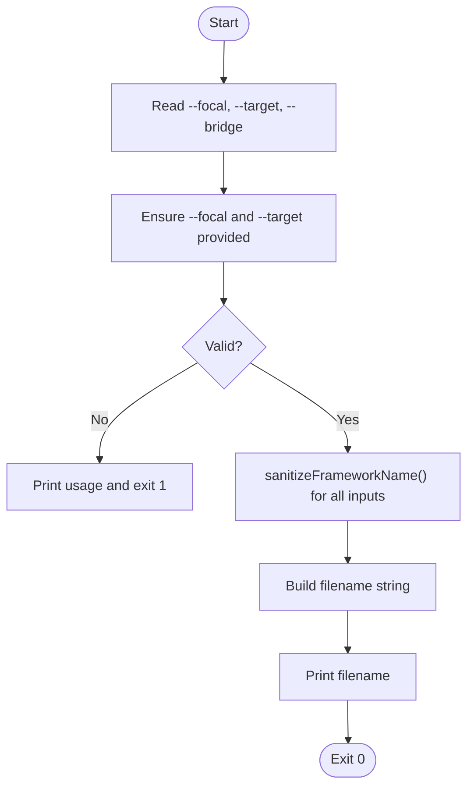
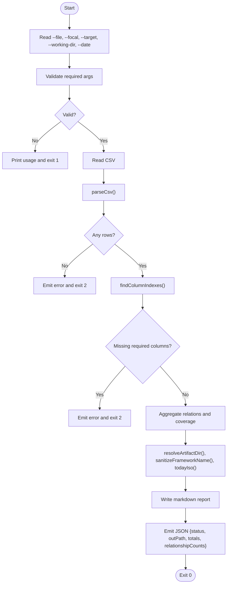
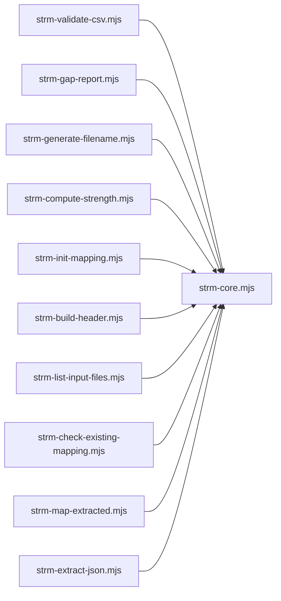

# CLI Script Reference and Automation

<cite>
**Referenced Files in This Document**
- [scripts/README.md](file://scripts/README.md)
- [scripts/bin/strm-validate-csv.mjs](file://scripts/bin/strm-validate-csv.mjs)
- [scripts/bin/strm-compute-strength.mjs](file://scripts/bin/strm-compute-strength.mjs)
- [scripts/bin/strm-generate-filename.mjs](file://scripts/bin/strm-generate-filename.mjs)
- [scripts/bin/strm-gap-report.mjs](file://scripts/bin/strm-gap-report.mjs)
- [scripts/lib/strm-core.mjs](file://scripts/lib/strm-core.mjs)
- [scripts/bin/strm-list-input-files.mjs](file://scripts/bin/strm-list-input-files.mjs)
- [scripts/bin/strm-check-existing-mapping.mjs](file://scripts/bin/strm-check-existing-mapping.mjs)
- [scripts/bin/strm-extract-json.mjs](file://scripts/bin/strm-extract-json.mjs)
- [scripts/bin/strm-map-extracted.mjs](file://scripts/bin/strm-map-extracted.mjs)
- [scripts/bin/strm-build-header.mjs](file://scripts/bin/strm-build-header.mjs)
- [scripts/bin/strm-init-mapping.mjs](file://scripts/bin/strm-init-mapping.mjs)
- [working-directory/scratch/manual-qa-strm.mjs](file://working-directory/scratch/manual-qa-strm.mjs)
- [working-directory/scratch/manual-qa-strm-with-reasons.mjs](file://working-directory/scratch/manual-qa-strm-with-reasons.mjs)
- [README.md](file://README.md)
</cite>

## Table of Contents
1. [Introduction](#introduction)
2. [Project Structure](#project-structure)
3. [Core Components](#core-components)
4. [Architecture Overview](#architecture-overview)
5. [Detailed Component Analysis](#detailed-component-analysis)
6. [Dependency Analysis](#dependency-analysis)
7. [Performance Considerations](#performance-considerations)
8. [Troubleshooting Guide](#troubleshooting-guide)
9. [Conclusion](#conclusion)
10. [Appendices](#appendices)

## Introduction
This document provides a comprehensive CLI Script Reference and Automation guide for the STRM toolkit. It focuses on the command-line interface and batch processing capabilities centered around the scripts in scripts/bin/, with emphasis on:
- strm-validate-csv.mjs
- strm-compute-strength.mjs
- strm-generate-filename.mjs
- strm-gap-report.mjs

It explains parameter specifications, usage examples, integration patterns, batch workflows, CI/CD approaches, dependencies, environment requirements, error handling, advanced usage, custom script development, and performance optimization strategies for large-scale operations.

## Project Structure
The STRM toolkit organizes automation scripts under scripts/bin/ and shares core logic in scripts/lib/strm-core.mjs. The working-directory/ stores inputs, extracted datasets, and generated artifacts. The scripts/README.md provides a consolidated overview of available commands and operational notes.

**Diagram sources**
- [scripts/bin/strm-validate-csv.mjs:1-77](file://scripts/bin/strm-validate-csv.mjs#L1-L77)
- [scripts/bin/strm-compute-strength.mjs:1-20](file://scripts/bin/strm-compute-strength.mjs#L1-L20)
- [scripts/bin/strm-generate-filename.mjs:1-19](file://scripts/bin/strm-generate-filename.mjs#L1-L19)
- [scripts/bin/strm-gap-report.mjs:1-150](file://scripts/bin/strm-gap-report.mjs#L1-L150)
- [scripts/bin/strm-list-input-files.mjs:1-12](file://scripts/bin/strm-list-input-files.mjs#L1-L12)
- [scripts/bin/strm-check-existing-mapping.mjs:1-20](file://scripts/bin/strm-check-existing-mapping.mjs#L1-L20)
- [scripts/bin/strm-extract-json.mjs:1-354](file://scripts/bin/strm-extract-json.mjs#L1-L354)
- [scripts/bin/strm-map-extracted.mjs:1-278](file://scripts/bin/strm-map-extracted.mjs#L1-L278)
- [scripts/bin/strm-build-header.mjs:1-12](file://scripts/bin/strm-build-header.mjs#L1-L12)
- [scripts/bin/strm-init-mapping.mjs:1-58](file://scripts/bin/strm-init-mapping.mjs#L1-L58)
- [scripts/lib/strm-core.mjs:1-343](file://scripts/lib/strm-core.mjs#L1-L343)

**Section sources**
- [scripts/README.md:1-31](file://scripts/README.md#L1-L31)
- [README.md:1-30](file://README.md#L1-L30)

## Core Components
This section summarizes the four primary scripts documented in this guide and their roles in the STRM workflow.

- strm-validate-csv.mjs: Validates a STRM CSV for required columns, required row fields, and formula correctness.
- strm-compute-strength.mjs: Computes the STRM strength score given relationship, confidence, and rationale type using NIST IR 8477 formula.
- strm-generate-filename.mjs: Generates a standardized filename for STRM artifacts based on focal, target, and optional bridge frameworks.
- strm-gap-report.mjs: Produces a gap analysis summary report and writes it to mapping-artifacts with counts and distributions.

**Section sources**
- [scripts/bin/strm-validate-csv.mjs:1-77](file://scripts/bin/strm-validate-csv.mjs#L1-L77)
- [scripts/bin/strm-compute-strength.mjs:1-20](file://scripts/bin/strm-compute-strength.mjs#L1-L20)
- [scripts/bin/strm-generate-filename.mjs:1-19](file://scripts/bin/strm-generate-filename.mjs#L1-L19)
- [scripts/bin/strm-gap-report.mjs:1-150](file://scripts/bin/strm-gap-report.mjs#L1-L150)

## Architecture Overview
The STRM CLI architecture centers on deterministic Node.js scripts that rely on shared logic in strm-core.mjs. Scripts accept arguments, read/write files, and produce structured JSON outputs or markdown reports. Artifacts are written under working-directory/mapping-artifacts/.

**Diagram sources**
- [scripts/bin/strm-validate-csv.mjs:1-77](file://scripts/bin/strm-validate-csv.mjs#L1-L77)
- [scripts/lib/strm-core.mjs:99-265](file://scripts/lib/strm-core.mjs#L99-L265)

**Diagram sources**
- [scripts/bin/strm-gap-report.mjs:1-150](file://scripts/bin/strm-gap-report.mjs#L1-L150)
- [scripts/lib/strm-core.mjs:267-277](file://scripts/lib/strm-core.mjs#L267-L277)

## Detailed Component Analysis

### strm-validate-csv.mjs
- Purpose: Validates a STRM CSV for required columns, required row fields, and formula correctness.
- Parameters:
  - --file <path-to-strm-csv>: Path to the CSV file to validate.
- Behavior:
  - Reads and parses CSV.
  - Checks for empty file.
  - Identifies required columns via header mapping.
  - Iterates rows, skipping blank rows, validates each row against required fields and formula.
  - Emits JSON with status, counts, and lists of errors/warnings.
- Exit codes:
  - 0 on success, 1 on missing arguments, 2 on validation failures.
- Usage example:
  - node scripts/bin/strm-validate-csv.mjs --file "working-directory/.../your-strm.csv"

**Diagram sources**
- [scripts/bin/strm-validate-csv.mjs:1-77](file://scripts/bin/strm-validate-csv.mjs#L1-L77)
- [scripts/lib/strm-core.mjs:99-265](file://scripts/lib/strm-core.mjs#L99-L265)

**Section sources**
- [scripts/bin/strm-validate-csv.mjs:1-77](file://scripts/bin/strm-validate-csv.mjs#L1-L77)
- [scripts/lib/strm-core.mjs:99-265](file://scripts/lib/strm-core.mjs#L99-L265)

### strm-compute-strength.mjs
- Purpose: Computes STRM strength score using NIST IR 8477 formula.
- Parameters:
  - --relationship <equal|subset_of|superset_of|intersects_with|not_related>
  - --confidence <high|medium|low> (optional, default high)
  - --rationale <semantic|functional|syntactic> (optional, default semantic)
- Behavior:
  - Validates inputs and throws on invalid values.
  - Computes base score, applies confidence and rationale adjustments, clamps to 1..10.
  - Outputs JSON with inputs and computed score breakdown.
- Usage example:
  - node scripts/bin/strm-compute-strength.mjs --relationship equal --confidence high --rationale semantic

**Diagram sources**
- [scripts/bin/strm-compute-strength.mjs:1-20](file://scripts/bin/strm-compute-strength.mjs#L1-L20)
- [scripts/lib/strm-core.mjs:35-57](file://scripts/lib/strm-core.mjs#L35-L57)

**Section sources**
- [scripts/bin/strm-compute-strength.mjs:1-20](file://scripts/bin/strm-compute-strength.mjs#L1-L20)
- [scripts/lib/strm-core.mjs:35-57](file://scripts/lib/strm-core.mjs#L35-L57)

### strm-generate-filename.mjs
- Purpose: Generates a standardized filename for STRM artifacts.
- Parameters:
  - --focal "<Focal>"
  - --target "<Target>"
  - --bridge "<Bridge>" (optional)
- Behavior:
  - Sanitizes framework names.
  - Builds a filename incorporating focal, bridge (or focal if omitted), and target.
  - Prints the filename.
- Usage example:
  - node scripts/bin/strm-generate-filename.mjs --focal "Source" --target "Target" --bridge "Bridge"

**Diagram sources**
- [scripts/bin/strm-generate-filename.mjs:1-19](file://scripts/bin/strm-generate-filename.mjs#L1-L19)
- [scripts/lib/strm-core.mjs:59-79](file://scripts/lib/strm-core.mjs#L59-L79)

**Section sources**
- [scripts/bin/strm-generate-filename.mjs:1-19](file://scripts/bin/strm-generate-filename.mjs#L1-L19)
- [scripts/lib/strm-core.mjs:59-79](file://scripts/lib/strm-core.mjs#L59-L79)

### strm-gap-report.mjs
- Purpose: Produces a gap analysis summary report and writes it to mapping-artifacts.
- Parameters:
  - --file <path-to-strm-csv>
  - --focal "<Source>"
  - --target "<Target>"
  - --working-dir <working-directory> (optional, default working-directory)
  - --date YYYY-MM-DD (optional, default today)
- Behavior:
  - Reads and parses CSV, validates required columns.
  - Aggregates relationship counts and coverage per FDE.
  - Writes markdown report to a dated artifact directory.
  - Emits JSON with status, output path, totals, and distribution.
- Usage example:
  - node scripts/bin/strm-gap-report.mjs --file "working-directory/.../your-strm.csv" --focal "Source" --target "Target"

**Diagram sources**
- [scripts/bin/strm-gap-report.mjs:1-150](file://scripts/bin/strm-gap-report.mjs#L1-L150)
- [scripts/lib/strm-core.mjs:267-277](file://scripts/lib/strm-core.mjs#L267-L277)

**Section sources**
- [scripts/bin/strm-gap-report.mjs:1-150](file://scripts/bin/strm-gap-report.mjs#L1-L150)
- [scripts/lib/strm-core.mjs:267-277](file://scripts/lib/strm-core.mjs#L267-L277)

## Dependency Analysis
- Internal dependencies:
  - All four scripts depend on functions exported by scripts/lib/strm-core.mjs (parsing, validation, filename sanitization, artifact directory resolution, date helpers).
- External dependencies:
  - Node.js built-ins: fs/promises, path, readline utilities for argument parsing.
- Coupling:
  - Strong cohesion within scripts/lib/strm-core.mjs for CSV parsing, validation, and artifact path management.
  - Loose coupling between scripts/bin/* and shared core logic.

**Diagram sources**
- [scripts/bin/strm-validate-csv.mjs:1-77](file://scripts/bin/strm-validate-csv.mjs#L1-L77)
- [scripts/bin/strm-compute-strength.mjs:1-20](file://scripts/bin/strm-compute-strength.mjs#L1-L20)
- [scripts/bin/strm-generate-filename.mjs:1-19](file://scripts/bin/strm-generate-filename.mjs#L1-L19)
- [scripts/bin/strm-gap-report.mjs:1-150](file://scripts/bin/strm-gap-report.mjs#L1-L150)
- [scripts/bin/strm-list-input-files.mjs:1-12](file://scripts/bin/strm-list-input-files.mjs#L1-L12)
- [scripts/bin/strm-check-existing-mapping.mjs:1-20](file://scripts/bin/strm-check-existing-mapping.mjs#L1-L20)
- [scripts/bin/strm-extract-json.mjs:1-354](file://scripts/bin/strm-extract-json.mjs#L1-L354)
- [scripts/bin/strm-map-extracted.mjs:1-278](file://scripts/bin/strm-map-extracted.mjs#L1-L278)
- [scripts/bin/strm-build-header.mjs:1-12](file://scripts/bin/strm-build-header.mjs#L1-L12)
- [scripts/bin/strm-init-mapping.mjs:1-58](file://scripts/bin/strm-init-mapping.mjs#L1-L58)
- [scripts/lib/strm-core.mjs:1-343](file://scripts/lib/strm-core.mjs#L1-L343)

**Section sources**
- [scripts/lib/strm-core.mjs:1-343](file://scripts/lib/strm-core.mjs#L1-L343)

## Performance Considerations
- CSV parsing:
  - The custom parser in strm-core.mjs avoids external dependencies and is suitable for typical STRM CSV sizes. For very large files, consider streaming or chunked processing if needed.
- Validation loops:
  - Validation scales linearly with rows. For large datasets, ensure adequate memory and avoid unnecessary intermediate arrays.
- Gap report aggregation:
  - Uses Map/Set structures for grouping and counting; complexity is O(n) over rows. For very large mappings, consider batching or parallelizing row processing.
- Filename generation and artifact directory resolution:
  - Constant-time operations; negligible overhead.
- Recommendations:
  - Use --date and --working-dir consistently to keep artifacts organized and avoid filesystem contention.
  - Prefer single-threaded runs for deterministic outputs; parallelization can be introduced at the orchestration level (see Automation Patterns).
  - Cache repeated computations (e.g., sanitized names) when invoking scripts programmatically.

[No sources needed since this section provides general guidance]

## Troubleshooting Guide
- Missing arguments:
  - All scripts print usage and exit with code 1 when required arguments are missing.
- CSV validation failures:
  - strm-validate-csv.mjs emits JSON with status "fail", includes counts and lists of errors/warnings. Review messages to correct missing columns or invalid values.
- Empty CSV:
  - strm-validate-csv.mjs and strm-gap-report.mjs treat empty files as errors and exit with code 2.
- Invalid relationship/confidence/rationale:
  - strm-compute-strength.mjs throws on invalid inputs and exits with code 1.
- Manual review and QA:
  - Use manual-qa-strm.mjs and manual-qa-strm-with-reasons.mjs to assist in post-edit validation and reasoning capture during manual review passes.

**Section sources**
- [scripts/bin/strm-validate-csv.mjs:1-77](file://scripts/bin/strm-validate-csv.mjs#L1-L77)
- [scripts/bin/strm-compute-strength.mjs:1-20](file://scripts/bin/strm-compute-strength.mjs#L1-L20)
- [scripts/bin/strm-gap-report.mjs:1-150](file://scripts/bin/strm-gap-report.mjs#L1-L150)
- [working-directory/scratch/manual-qa-strm.mjs:1-10](file://working-directory/scratch/manual-qa-strm.mjs#L1-L10)
- [working-directory/scratch/manual-qa-strm-with-reasons.mjs:1-10](file://working-directory/scratch/manual-qa-strm-with-reasons.mjs#L1-L10)

## Conclusion
The STRM CLI scripts provide a robust, deterministic foundation for validating, computing, generating filenames, and reporting gaps in STRM mappings. By leveraging shared logic in strm-core.mjs, these scripts enable repeatable workflows suitable for batch processing and CI/CD integration. The included manual QA utilities support high-quality, auditable outputs.

[No sources needed since this section summarizes without analyzing specific files]

## Appendices

### Environment Requirements and Setup
- Runtime: Node.js (scripts are Node.js modules).
- Working directory: Place inputs and expect outputs under working-directory/.
- Deterministic behavior: Scripts enforce NIST IR 8477 formula and standardized outputs.

**Section sources**
- [scripts/README.md:23-31](file://scripts/README.md#L23-L31)
- [README.md:24-30](file://README.md#L24-L30)

### Parameter Specifications and Usage Examples
- strm-validate-csv.mjs
  - --file <path-to-strm-csv>
  - Example: node scripts/bin/strm-validate-csv.mjs --file "working-directory/.../your-strm.csv"
- strm-compute-strength.mjs
  - --relationship <equal|subset_of|superset_of|intersects_with|not_related>
  - --confidence <high|medium|low> (default high)
  - --rationale <semantic|functional|syntactic> (default semantic)
  - Example: node scripts/bin/strm-compute-strength.mjs --relationship equal --confidence high --rationale semantic
- strm-generate-filename.mjs
  - --focal "<Focal>"
  - --target "<Target>"
  - --bridge "<Bridge>" (optional)
  - Example: node scripts/bin/strm-generate-filename.mjs --focal "Source" --target "Target" --bridge "Bridge"
- strm-gap-report.mjs
  - --file <path-to-strm-csv>
  - --focal "<Source>"
  - --target "<Target>"
  - --working-dir <working-directory> (default working-directory)
  - --date YYYY-MM-DD (default today)
  - Example: node scripts/bin/strm-gap-report.mjs --file "working-directory/.../your-strm.csv" --focal "Source" --target "Target"

**Section sources**
- [scripts/bin/strm-validate-csv.mjs:5-20](file://scripts/bin/strm-validate-csv.mjs#L5-L20)
- [scripts/bin/strm-compute-strength.mjs:13-16](file://scripts/bin/strm-compute-strength.mjs#L13-L16)
- [scripts/bin/strm-generate-filename.mjs:13-16](file://scripts/bin/strm-generate-filename.mjs#L13-L16)
- [scripts/bin/strm-gap-report.mjs:12-34](file://scripts/bin/strm-gap-report.mjs#L12-L34)

### Integration Patterns and Batch Workflows
- Pre-mapping preparation:
  - Use strm-extract-json.mjs to convert framework JSON catalogs into CSVs for focal and target catalogs.
  - Use strm-build-header.mjs to generate the initial CSV header row.
  - Use strm-init-mapping.mjs to scaffold a new mapping CSV with standardized filename and directory layout.
- Draft mapping:
  - Use strm-map-extracted.mjs to generate a draft mapping CSV from extracted focal and target CSVs.
- Post-edit validation:
  - Use strm-validate-csv.mjs to validate the edited mapping CSV.
  - Use manual-qa-strm.mjs and manual-qa-strm-with-reasons.mjs to assist in manual review and reasoning capture.
- Reporting:
  - Use strm-gap-report.mjs to generate a gap analysis summary report and totals.

**Section sources**
- [scripts/README.md:10-31](file://scripts/README.md#L10-L31)
- [scripts/bin/strm-extract-json.mjs:1-354](file://scripts/bin/strm-extract-json.mjs#L1-L354)
- [scripts/bin/strm-build-header.mjs:1-12](file://scripts/bin/strm-build-header.mjs#L1-L12)
- [scripts/bin/strm-init-mapping.mjs:1-58](file://scripts/bin/strm-init-mapping.mjs#L1-L58)
- [scripts/bin/strm-map-extracted.mjs:1-278](file://scripts/bin/strm-map-extracted.mjs#L1-L278)
- [scripts/bin/strm-validate-csv.mjs:1-77](file://scripts/bin/strm-validate-csv.mjs#L1-L77)
- [working-directory/scratch/manual-qa-strm.mjs:1-10](file://working-directory/scratch/manual-qa-strm.mjs#L1-L10)
- [working-directory/scratch/manual-qa-strm-with-reasons.mjs:1-10](file://working-directory/scratch/manual-qa-strm-with-reasons.mjs#L1-L10)

### CI/CD Integration Approaches
- Recommended steps:
  - Extract catalogs to CSVs using strm-extract-json.mjs.
  - Initialize mapping using strm-init-mapping.mjs.
  - Generate draft mapping using strm-map-extracted.mjs.
  - Validate using strm-validate-csv.mjs.
  - Generate gap report using strm-gap-report.mjs.
  - Publish artifacts under working-directory/mapping-artifacts/ for retention.
- Notes:
  - Scripts are deterministic and enforce NIST IR 8477 formula where applicable.
  - Output artifacts are created under working-directory/mapping-artifacts/.
  - Run scripts from repository root to ensure relative paths resolve correctly.

**Section sources**
- [scripts/README.md:23-31](file://scripts/README.md#L23-L31)
- [README.md:24-30](file://README.md#L24-L30)

### Advanced Usage Patterns and Custom Script Development
- Custom script development:
  - Import and reuse functions from scripts/lib/strm-core.mjs (e.g., parseCsv, validateDataRow, computeStrength, sanitizeFrameworkName, resolveArtifactDir).
  - Follow the same argument parsing pattern used by existing scripts.
  - Emit structured JSON outputs for interoperability with CI/CD and downstream tools.
- Extension points:
  - Add new validation rules in validateDataRow for domain-specific checks.
  - Extend computeStrength with additional adjustment factors if needed.
  - Introduce new report formats by adapting gap-report logic.

**Section sources**
- [scripts/lib/strm-core.mjs:35-265](file://scripts/lib/strm-core.mjs#L35-L265)

### Error Handling Mechanisms
- Argument validation:
  - Missing required arguments trigger usage messages and exit code 1.
- File I/O:
  - Empty CSV treated as error; exit code 2.
  - Malformed JSON or missing expected paths in JSON extraction emit structured error payloads.
- Formula validation:
  - Strength mismatch triggers errors; warnings highlight edge cases (e.g., low confidence, syntactic rationale).

**Section sources**
- [scripts/bin/strm-validate-csv.mjs:15-20](file://scripts/bin/strm-validate-csv.mjs#L15-L20)
- [scripts/bin/strm-validate-csv.mjs:25-28](file://scripts/bin/strm-validate-csv.mjs#L25-L28)
- [scripts/bin/strm-validate-csv.mjs:36-44](file://scripts/bin/strm-validate-csv.mjs#L36-L44)
- [scripts/bin/strm-validate-csv.mjs:71-74](file://scripts/bin/strm-validate-csv.mjs#L71-L74)
- [scripts/bin/strm-compute-strength.mjs:13-16](file://scripts/bin/strm-compute-strength.mjs#L13-L16)
- [scripts/bin/strm-gap-report.mjs:38-41](file://scripts/bin/strm-gap-report.mjs#L38-L41)
- [scripts/bin/strm-gap-report.mjs:47-54](file://scripts/bin/strm-gap-report.mjs#L47-L54)
- [scripts/bin/strm-extract-json.mjs:288-291](file://scripts/bin/strm-extract-json.mjs#L288-L291)
- [scripts/bin/strm-extract-json.mjs:297-309](file://scripts/bin/strm-extract-json.mjs#L297-L309)