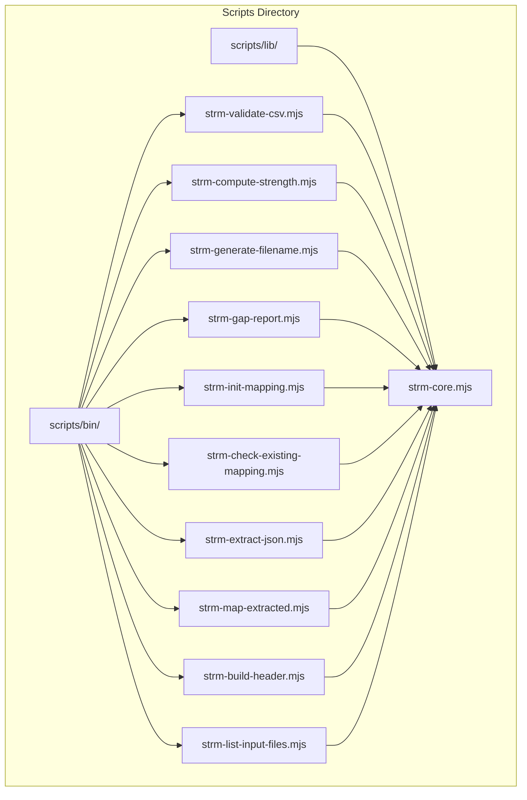
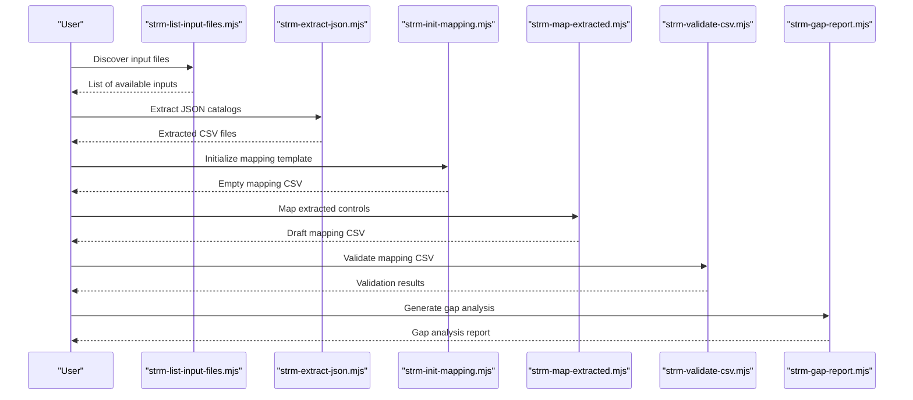
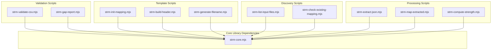

# Individual Script Documentation

<cite>
**Referenced Files in This Document**
- [strm-validate-csv.mjs](file://scripts/bin/strm-validate-csv.mjs)
- [strm-compute-strength.mjs](file://scripts/bin/strm-compute-strength.mjs)
- [strm-generate-filename.mjs](file://scripts/bin/strm-generate-filename.mjs)
- [strm-gap-report.mjs](file://scripts/bin/strm-gap-report.mjs)
- [strm-init-mapping.mjs](file://scripts/bin/strm-init-mapping.mjs)
- [strm-check-existing-mapping.mjs](file://scripts/bin/strm-check-existing-mapping.mjs)
- [strm-extract-json.mjs](file://scripts/bin/strm-extract-json.mjs)
- [strm-map-extracted.mjs](file://scripts/bin/strm-map-extracted.mjs)
- [strm-build-header.mjs](file://scripts/bin/strm-build-header.mjs)
- [strm-list-input-files.mjs](file://scripts/bin/strm-list-input-files.mjs)
- [strm-core.mjs](file://scripts/lib/strm-core.mjs)
- [README.md](file://scripts/README.md)
</cite>

## Table of Contents
1. [Introduction](#introduction)
2. [Project Structure](#project-structure)
3. [Core Components](#core-components)
4. [Architecture Overview](#architecture-overview)
5. [Detailed Component Analysis](#detailed-component-analysis)
6. [Dependency Analysis](#dependency-analysis)
7. [Performance Considerations](#performance-considerations)
8. [Troubleshooting Guide](#troubleshooting-guide)
9. [Conclusion](#conclusion)

## Introduction
This document provides comprehensive documentation for the 10 CLI scripts in the scripts/bin/ directory. These scripts implement the STRM (Set Theory Relationship Mapping) workflow for cross-framework control mapping. Each script handles a specific phase of the mapping pipeline: input discovery, extraction, mapping, validation, and reporting. The scripts share common functionality through a centralized core library that enforces NIST IR 8477 strength computation, CSV parsing/formatting, and artifact management.

## Project Structure
The STRM scripts are organized into two main areas:
- scripts/bin/: Executable CLI scripts implementing specific workflow steps
- scripts/lib/: Shared core functionality used across all scripts



**Diagram sources**
- [strm-validate-csv.mjs](file://scripts/bin/strm-validate-csv.mjs)
- [strm-compute-strength.mjs](file://scripts/bin/strm-compute-strength.mjs)
- [strm-generate-filename.mjs](file://scripts/bin/strm-generate-filename.mjs)
- [strm-gap-report.mjs](file://scripts/bin/strm-gap-report.mjs)
- [strm-init-mapping.mjs](file://scripts/bin/strm-init-mapping.mjs)
- [strm-check-existing-mapping.mjs](file://scripts/bin/strm-check-existing-mapping.mjs)
- [strm-extract-json.mjs](file://scripts/bin/strm-extract-json.mjs)
- [strm-map-extracted.mjs](file://scripts/bin/strm-map-extracted.mjs)
- [strm-build-header.mjs](file://scripts/bin/strm-build-header.mjs)
- [strm-list-input-files.mjs](file://scripts/bin/strm-list-input-files.mjs)
- [strm-core.mjs](file://scripts/lib/strm-core.mjs)

**Section sources**
- [README.md:1-31](file://scripts/README.md#L1-L31)

## Core Components
The shared core library provides essential functionality used by all scripts:

### Core Constants and Validation
- Relationship types: equal, subset_of, superset_of, intersects_with, not_related
- Confidence levels: high, medium, low
- Rationale types: semantic, functional, syntactic
- CSV column validation through findColumnIndexes()

### Mathematical Foundation
- NIST IR 8477 strength computation with configurable confidence and rationale adjustments
- Base scores: equal=10, subset/superset=7, intersects=4, not_related=0
- Confidence adjustments: high=0, medium=-1, low=-2
- Rationale adjustments: semantic/functional=0, syntactic=-1

### File Operations
- CSV parsing and serialization with proper quoting and escaping
- Artifact directory resolution under working-directory/mapping-artifacts/
- Input file discovery supporting multiple formats (.csv, .pdf, .md, .json, .yml, .toml)

**Section sources**
- [strm-core.mjs:4-57](file://scripts/lib/strm-core.mjs#L4-L57)
- [strm-core.mjs:186-204](file://scripts/lib/strm-core.mjs#L186-L204)
- [strm-core.mjs:267-277](file://scripts/lib/strm-core.mjs#L267-L277)
- [strm-core.mjs:281-309](file://scripts/lib/strm-core.mjs#L281-L309)

## Architecture Overview
The STRM workflow follows a linear pipeline where each script produces outputs consumed by subsequent scripts:



**Diagram sources**
- [strm-list-input-files.mjs:1-12](file://scripts/bin/strm-list-input-files.mjs#L1-L12)
- [strm-extract-json.mjs:1-354](file://scripts/bin/strm-extract-json.mjs#L1-L354)
- [strm-init-mapping.mjs:1-58](file://scripts/bin/strm-init-mapping.mjs#L1-L58)
- [strm-map-extracted.mjs:1-278](file://scripts/bin/strm-map-extracted.mjs#L1-L278)
- [strm-validate-csv.mjs:1-77](file://scripts/bin/strm-validate-csv.mjs#L1-L77)
- [strm-gap-report.mjs:1-150](file://scripts/bin/strm-gap-report.mjs#L1-L150)

## Detailed Component Analysis

### strm-validate-csv.mjs - CSV Format Validation
Validates STRM CSV files against required columns and data integrity rules.

**Parameters:**
- --file: Path to STRM CSV file (required)

**Exit Codes:**
- 0: Success - CSV passes all validations
- 1: Usage error - Missing required arguments
- 2: Validation failure - CSV contains errors

**Input Format:** STRM CSV with required columns:
- FDE#, FDE Name, Focal Document Element (FDE)
- Confidence Levels, NIST IR-8477 Rational, STRM Rationale
- STRM Relationship, Strength of Relationship, Target ID #
- Target Requirement Title, Target Requirement Description, Notes

**Output Format:** JSON object containing validation results:
```json
{
  "status": "pass|fail",
  "file": "path/to/csv",
  "totalRowsChecked": 42,
  "errorCount": 0,
  "warningCount": 2,
  "errors": [],
  "warnings": []
}
```

**Error Conditions:**
- Missing required columns in header
- Empty CSV file
- Invalid relationship values
- Invalid confidence levels
- Invalid rationale types
- Non-integer strength values
- Strength mismatch with computed NIST IR 8477 formula
- Empty required fields (FDE#, Target ID #, STRM Rationale)

**Practical Usage Examples:**
```bash
# Validate a mapping CSV
node scripts/bin/strm-validate-csv.mjs --file "working-directory/mapping-artifacts/2026-03-24_NIST_800-53-to-ISO_27001/Set Theory Relationship Mapping (STRM)_ [(NIST_800-53-to-NIST_800-53)-to-ISO_27001] - NIST 800-53 to ISO 27001.csv"

# Validate with error handling
node scripts/bin/strm-validate-csv.mjs --file "$CSV_FILE" || echo "Validation failed"
```

**Integration Pattern:**
```bash
# Post-processing workflow
node scripts/bin/strm-map-extracted.mjs --focal "NIST 800-53" --target "ISO 27001" \
  --focal-csv "working-directory/scratch/nist-extracted.csv" \
  --target-csv "working-directory/scratch/iso-extracted.csv" \
  --output "temp-mapping.csv"
node scripts/bin/strm-validate-csv.mjs --file "temp-mapping.csv"
```

**Section sources**
- [strm-validate-csv.mjs:1-77](file://scripts/bin/strm-validate-csv.mjs#L1-L77)
- [strm-core.mjs:206-265](file://scripts/lib/strm-core.mjs#L206-L265)

### strm-compute-strength.mjs - Mathematical Strength Calculation
Computes NIST IR 8477 strength scores based on relationship type, confidence level, and rationale type.

**Parameters:**
- --relationship: equal|subset_of|superset_of|intersects_with|not_related (required)
- --confidence: high|medium|low (optional, defaults to high)
- --rationale: semantic|functional|syntactic (optional, defaults to semantic)

**Exit Codes:**
- 0: Success - Strength calculation completed
- 1: Usage error - Missing required relationship parameter

**Input Format:** Command-line arguments specifying relationship, confidence, and rationale

**Output Format:** JSON object with calculated strength and breakdown:
```json
{
  "relationship": "equal",
  "confidence": "high",
  "rationaleType": "semantic",
  "score": 10,
  "base": 10,
  "confidenceAdj": 0,
  "rationaleAdj": 0
}
```

**Error Conditions:**
- Missing relationship parameter
- Invalid relationship value
- Invalid confidence level
- Invalid rationale type

**Practical Usage Examples:**
```bash
# Calculate strength for equal relationship
node scripts/bin/strm-compute-strength.mjs --relationship equal --confidence high --rationale semantic

# Calculate strength with medium confidence
node scripts/bin/strm-compute-strength.mjs --relationship subset_of --confidence medium

# Calculate strength with syntactic rationale
node scripts/bin/strm-compute-strength.mjs --relationship intersects_with --rationale syntactic
```

**Integration Pattern:**
```bash
# Used internally by strm-map-extracted.mjs during mapping process
node scripts/bin/strm-compute-strength.mjs --relationship "$RELATIONSHIP" \
  --confidence "$CONFIDENCE" \
  --rationale "functional"
```

**Section sources**
- [strm-compute-strength.mjs:1-20](file://scripts/bin/strm-compute-strength.mjs#L1-L20)
- [strm-core.mjs:35-57](file://scripts/lib/strm-core.mjs#L35-L57)

### strm-generate-filename.mjs - Standardized Filename Creation
Generates standardized filenames for STRM mapping artifacts following the established naming convention.

**Parameters:**
- --focal: Focal framework name (required)
- --target: Target framework name (required)
- --bridge: Bridge framework name (optional)

**Exit Codes:**
- 0: Success - Filename generated
- 1: Usage error - Missing required focal or target parameters

**Input Format:** Command-line arguments specifying framework names

**Output Format:** Single line containing the standardized filename:
```
Set Theory Relationship Mapping (STRM)_ [(Focal-to-Bridge)-to-Target] - Focal to Target.csv
```

**Error Conditions:**
- Missing focal parameter
- Missing target parameter

**Practical Usage Examples:**
```bash
# Generate filename for NIST 800-53 to ISO 27001 mapping
node scripts/bin/strm-generate-filename.mjs --focal "NIST 800-53" --target "ISO 27001"

# Generate filename with bridge framework
node scripts/bin/strm-generate-filename.mjs --focal "NIST 800-53" --target "ISO 27001" --bridge "CMMC"
```

**Integration Pattern:**
```bash
# Used by strm-init-mapping.mjs to create mapping templates
node scripts/bin/strm-generate-filename.mjs --focal "$FOCAL" --target "$TARGET" \
  --bridge "${BRIDGE:-$FOCAL}"
```

**Section sources**
- [strm-generate-filename.mjs:1-19](file://scripts/bin/strm-generate-filename.mjs#L1-L19)
- [strm-core.mjs:67-79](file://scripts/lib/strm-core.mjs#L67-L79)

### strm-gap-report.mjs - Gap Analysis Generation
Creates comprehensive gap analysis reports from STRM CSV mapping results.

**Parameters:**
- --file: Path to STRM CSV file (required)
- --focal: Focal framework name (required)
- --target: Target framework name (required)
- --working-dir: Working directory path (optional, defaults to working-directory)
- --date: Report date in YYYY-MM-DD format (optional, defaults to today)

**Exit Codes:**
- 0: Success - Gap report generated
- 1: Usage error - Missing required arguments
- 2: Validation failure - CSV contains errors

**Input Format:** STRM CSV with relationship data and coverage information

**Output Format:** JSON object with report metadata and statistics:
```json
{
  "status": "ok",
  "outPath": "working-directory/mapping-artifacts/2026-03-24_NIST_800-53-to-ISO_27001/STRM_Gap_Analysis_NIST_800-53-to-ISO_27001.md",
  "artifactDir": "working-directory/mapping-artifacts/2026-03-24_NIST_800-53-to-ISO_27001/",
  "totals": {
    "mappedRows": 150,
    "distinctFdes": 120,
    "fullCoverage": 85,
    "partialCoverage": 25,
    "gapCoverage": 10
  },
  "relationshipCounts": {
    "equal": 60,
    "subset_of": 25,
    "superset_of": 15,
    "intersects_with": 45,
    "not_related": 5
  }
}
```

**Error Conditions:**
- Missing required arguments (--file, --focal, --target)
- Empty CSV file
- Missing required columns in header
- Invalid relationship values

**Practical Usage Examples:**
```bash
# Generate gap analysis report
node scripts/bin/strm-gap-report.mjs --file "mapping-output.csv" --focal "NIST 800-53" --target "ISO 27001"

# Generate report with custom working directory and date
node scripts/bin/strm-gap-report.mjs --file "mapping-output.csv" --focal "NIST 800-53" --target "ISO 27001" \
  --working-dir "custom-workspace" --date "2026-03-24"
```

**Integration Pattern:**
```bash
# Final step in mapping workflow
node scripts/bin/strm-validate-csv.mjs --file "$MAPPING_CSV"
node scripts/bin/strm-gap-report.mjs --file "$MAPPING_CSV" --focal "$FOCAL" --target "$TARGET"
```

**Section sources**
- [strm-gap-report.mjs:1-150](file://scripts/bin/strm-gap-report.mjs#L1-L150)
- [strm-core.mjs:267-277](file://scripts/lib/strm-core.mjs#L267-L277)

### strm-init-mapping.mjs - Initial Mapping Setup
Initializes a new STRM mapping template with the standard header structure.

**Parameters:**
- --focal: Focal framework name (required)
- --target: Target framework name (required)
- --bridge: Bridge framework name (optional)
- --working-dir: Working directory path (optional, defaults to working-directory)
- --date: Date in YYYY-MM-DD format (optional, defaults to today)

**Exit Codes:**
- 0: Success - Template created
- 1: Usage error - Missing required focal or target parameters

**Input Format:** Framework names and optional configuration parameters

**Output Format:** JSON object with template creation details:
```json
{
  "status": "ok",
  "artifactDir": "working-directory/mapping-artifacts/2026-03-24_NIST_800-53-to-ISO_27001/",
  "csvPath": "working-directory/mapping-artifacts/2026-03-24_NIST_800-53-to-ISO_27001/Set Theory Relationship Mapping (STRM)_ [(NIST_800-53-to-NIST_800-53)-to-ISO_27001] - NIST 800-53 to ISO 27001.csv",
  "filename": "Set Theory Relationship Mapping (STRM)_ [(NIST_800-53-to-NIST_800-53)-to-ISO_27001] - NIST 800-53 to ISO 27001.csv",
  "date": "2026-03-24"
}
```

**Error Conditions:**
- Missing focal parameter
- Missing target parameter

**Practical Usage Examples:**
```bash
# Initialize mapping template
node scripts/bin/strm-init-mapping.mjs --focal "NIST 800-53" --target "ISO 27001"

# Initialize with bridge framework and custom date
node scripts/bin/strm-init-mapping.mjs --focal "NIST 800-53" --target "ISO 27001" --bridge "CMMC" \
  --date "2026-03-24"
```

**Integration Pattern:**
```bash
# Starting point for new mapping projects
node scripts/bin/strm-init-mapping.mjs --focal "$FOCAL" --target "$TARGET" \
  --working-dir "$WORKING_DIR" --date "$DATE"
```

**Section sources**
- [strm-init-mapping.mjs:1-58](file://scripts/bin/strm-init-mapping.mjs#L1-L58)
- [strm-core.mjs:81-97](file://scripts/lib/strm-core.mjs#L81-L97)

### strm-check-existing-mapping.mjs - Duplicate Detection
Searches for existing STRM mapping artifacts in the working directory.

**Parameters:**
- --focal: Focal framework name (required)
- --target: Target framework name (required)
- --working-dir: Working directory path (optional, defaults to working-directory)

**Exit Codes:**
- 0: Success - Search completed
- 1: Usage error - Missing required focal or target parameters

**Input Format:** Framework names and optional working directory

**Output Format:** JSON object with search results:
```json
{
  "workingDirectory": "working-directory",
  "focal": "NIST 800-53",
  "target": "ISO 27001",
  "matchCount": 2,
  "matches": [
    "working-directory/mapping-artifacts/2026-03-24_NIST_800-53-to-ISO_27001/Set Theory Relationship Mapping (STRM)_ [(NIST_800-53-to-NIST_800-53)-to-ISO_27001] - NIST 800-53 to ISO 27001.csv",
    "working-directory/mapping-artifacts/2026-03-23_NIST_800-53-to-ISO_27001/Set Theory Relationship Mapping (STRM)_ [(NIST_800-53-to-NIST_800-53)-to-ISO_27001] - NIST 800-53 to ISO 27001.csv"
  ]
}
```

**Error Conditions:**
- Missing focal parameter
- Missing target parameter

**Practical Usage Examples:**
```bash
# Check for existing mappings
node scripts/bin/strm-check-existing-mapping.mjs --focal "NIST 800-53" --target "ISO 27001"

# Check with custom working directory
node scripts/bin/strm-check-existing-mapping.mjs --focal "NIST 800-53" --target "ISO 27001" \
  --working-dir "custom-workspace"
```

**Integration Pattern:**
```bash
# Prevent duplicate mappings
node scripts/bin/strm-check-existing-mapping.mjs --focal "$FOCAL" --target "$TARGET"
# If matchCount > 0, skip creation
```

**Section sources**
- [strm-check-existing-mapping.mjs:1-20](file://scripts/bin/strm-check-existing-mapping.mjs#L1-L20)
- [strm-core.mjs:315-342](file://scripts/lib/strm-core.mjs#L315-L342)

### strm-extract-json.mjs - JSON Extraction
Extracts control information from JSON catalog files into CSV format for mapping.

**Parameters:**
- input.json: Path to input JSON catalog (required)
- output.csv: Output CSV path (optional, defaults to working-directory/scratch/{framework}-extracted.csv)
- --all-fields: Include all discovered fields (optional)

**Exit Codes:**
- 0: Success - Extraction completed
- 1: Usage error - Missing required input.json
- 2: Validation failure - Invalid JSON structure

**Input Format:** JSON catalog with catalog.securityControls[] array

**Output Format:** CSV file with extracted control data:
```json
{
  "status": "ok",
  "inputFile": "nist-800-53.json",
  "outputFile": "working-directory/scratch/nist-800-53-extracted.csv",
  "controlsRead": 1200,
  "rowsWritten": 1199,
  "columnsWritten": 8,
  "additionalColumns": ["subFamily", "parameters", "objectives", "enhancements"]
}
```

**Error Conditions:**
- Missing input.json parameter
- Invalid JSON structure (missing catalog.securityControls[])
- Empty controls array

**Practical Usage Examples:**
```bash
# Extract with default columns
node scripts/bin/strm-extract-json.mjs "nist-800-53.json"

# Extract with all fields
node scripts/bin/strm-extract-json.mjs "nist-800-53.json" "output.csv" --all-fields

# Extract with custom output path
node scripts/bin/strm-extract-json.mjs "nist-800-53.json" "working-directory/scratch/custom-extracted.csv"
```

**Integration Pattern:**
```bash
# Preprocessing step for mapping workflow
node scripts/bin/strm-extract-json.mjs "$INPUT_JSON" "$EXTRACTED_CSV"
```

**Section sources**
- [strm-extract-json.mjs:1-354](file://scripts/bin/strm-extract-json.mjs#L1-L354)

### strm-map-extracted.mjs - Extracted Data Mapping
Performs automated mapping between extracted control sets using lexical analysis and thematic classification.

**Parameters:**
- --focal: Focal framework name (required)
- --target: Target framework name (required)
- --focal-csv: Path to focal extracted CSV (required)
- --target-csv: Path to target extracted CSV (required)
- --output: Output mapping CSV path (required)

**Exit Codes:**
- 0: Success - Mapping completed
- 1: Usage error - Missing required parameters
- 2: Validation failure - Invalid CSV structure

**Input Format:** Two CSV files with extracted control data (controlId, title, family, description)

**Output Format:** CSV file with STRM mapping results:
```json
{
  "status": "ok",
  "outputPath": "working-directory/mapping-artifacts/2026-03-24_NIST_800-53-to-ISO_27001/Set Theory Relationship Mapping (STRM)_ [(NIST_800-53-to-NIST_800-53)-to-ISO_27001] - NIST 800-53 to ISO 27001.csv",
  "rowsWritten": 1200,
  "relationshipDistribution": {
    "equal": 450,
    "subset_of": 300,
    "superset_of": 200,
    "intersects_with": 200,
    "not_related": 50
  }
}
```

**Error Conditions:**
- Missing required parameters
- Invalid CSV structure
- Empty control datasets

**Practical Usage Examples:**
```bash
# Map extracted controls
node scripts/bin/strm-map-extracted.mjs --focal "NIST 800-53" --target "ISO 27001" \
  --focal-csv "working-directory/scratch/nist-extracted.csv" \
  --target-csv "working-directory/scratch/iso-extracted.csv" \
  --output "working-directory/mapping-artifacts/2026-03-24_NIST_800-53-to-ISO_27001/NIST_800-53-to-ISO_27001-mapping.csv"

# Map with custom output path
node scripts/bin/strm-map-extracted.mjs --focal "$FOCAL" --target "$TARGET" \
  --focal-csv "$FOCAL_CSV" --target-csv "$TARGET_CSV" --output "$OUTPUT_CSV"
```

**Integration Pattern:**
```bash
# Complete mapping workflow
node scripts/bin/strm-extract-json.mjs "$INPUT_JSON" "$EXTRACTED_CSV"
node scripts/bin/strm-map-extracted.mjs --focal "$FOCAL" --target "$TARGET" \
  --focal-csv "$EXTRACTED_CSV" --target-csv "$TARGET_CSV" --output "$MAPPING_CSV"
```

**Section sources**
- [strm-map-extracted.mjs:1-278](file://scripts/bin/strm-map-extracted.mjs#L1-L278)

### strm-build-header.mjs - CSV Header Generation
Generates the standard STRM CSV header for mapping templates.

**Parameters:**
- --target: Target framework name (optional, defaults to "Target")

**Exit Codes:**
- 0: Success - Header generated

**Input Format:** Optional target framework name

**Output Format:** Single line containing CSV header:
```
FDE#,FDE Name,Focal Document Element (FDE),Confidence Levels,NIST IR-8477 Rational,STRM Rationale,STRM Relationship,Strength of Relationship,Target Requirement Title,Target ID #,Target Requirement Description,Notes
```

**Error Conditions:**
- None (always succeeds)

**Practical Usage Examples:**
```bash
# Generate standard header
node scripts/bin/strm-build-header.mjs

# Generate header for specific target
node scripts/bin/strm-build-header.mjs --target "ISO 27001"
```

**Integration Pattern:**
```bash
# Used by strm-init-mapping.mjs to create mapping templates
node scripts/bin/strm-build-header.mjs --target "$TARGET"
```

**Section sources**
- [strm-build-header.mjs:1-12](file://scripts/bin/strm-build-header.mjs#L1-L12)
- [strm-core.mjs:81-97](file://scripts/lib/strm-core.mjs#L81-L97)

### strm-list-input-files.mjs - Input File Discovery
Discovers available input files in the working directory for mapping projects.

**Parameters:**
- --dir: Directory path (optional, defaults to working-directory)

**Exit Codes:**
- 0: Success - Files listed
- 1: Usage error - Not applicable

**Input Format:** Optional directory path

**Output Format:** JSON object with file discovery results:
```json
{
  "directory": "working-directory",
  "count": 15,
  "files": [
    {
      "name": "nist-800-53.json",
      "path": "working-directory/frameworks/nist-800-53.json",
      "relativePath": "frameworks/nist-800-53.json",
      "extension": ".json"
    },
    {
      "name": "iso-27001.json",
      "path": "working-directory/frameworks/iso-27001.json",
      "relativePath": "frameworks/iso-27001.json",
      "extension": ".json"
    }
  ]
}
```

**Error Conditions:**
- None (always succeeds)

**Practical Usage Examples:**
```bash
# List all available input files
node scripts/bin/strm-list-input-files.mjs

# List files in custom directory
node scripts/bin/strm-list-input-files.mjs --dir "custom-workspace"
```

**Integration Pattern:**
```bash
# Starting point for mapping projects
node scripts/bin/strm-list-input-files.mjs --dir "$WORKING_DIR"
```

**Section sources**
- [strm-list-input-files.mjs:1-12](file://scripts/bin/strm-list-input-files.mjs#L1-L12)
- [strm-core.mjs:281-309](file://scripts/lib/strm-core.mjs#L281-L309)

## Dependency Analysis
The scripts form a cohesive dependency graph with shared functionality:



**Diagram sources**
- [strm-validate-csv.mjs:1-77](file://scripts/bin/strm-validate-csv.mjs#L1-L77)
- [strm-gap-report.mjs:1-150](file://scripts/bin/strm-gap-report.mjs#L1-L150)
- [strm-init-mapping.mjs:1-58](file://scripts/bin/strm-init-mapping.mjs#L1-L58)
- [strm-build-header.mjs:1-12](file://scripts/bin/strm-build-header.mjs#L1-L12)
- [strm-generate-filename.mjs:1-19](file://scripts/bin/strm-generate-filename.mjs#L1-L19)
- [strm-list-input-files.mjs:1-12](file://scripts/bin/strm-list-input-files.mjs#L1-L12)
- [strm-check-existing-mapping.mjs:1-20](file://scripts/bin/strm-check-existing-mapping.mjs#L1-L20)
- [strm-extract-json.mjs:1-354](file://scripts/bin/strm-extract-json.mjs#L1-L354)
- [strm-map-extracted.mjs:1-278](file://scripts/bin/strm-map-extracted.mjs#L1-L278)
- [strm-compute-strength.mjs:1-20](file://scripts/bin/strm-compute-strength.mjs#L1-L20)
- [strm-core.mjs:1-343](file://scripts/lib/strm-core.mjs#L1-L343)

**Section sources**
- [strm-core.mjs:1-343](file://scripts/lib/strm-core.mjs#L1-L343)

## Performance Considerations
- CSV processing: All scripts use streaming-like approaches for file I/O to handle large datasets efficiently
- Memory usage: The mapping script processes controls in memory; for very large catalogs, consider processing in batches
- File system operations: Multiple file reads/writes occur during workflows; ensure adequate disk space and permissions
- Network dependencies: No external network calls; all operations are local file system based
- Execution time: Processing time scales with input size; extract and map operations are the most computationally intensive

## Troubleshooting Guide

### Common Validation Errors
- **Missing required columns**: Ensure CSV contains all required STRM columns (FDE#, STRM Relationship, etc.)
- **Invalid relationship values**: Only accepted values are equal, subset_of, superset_of, intersects_with, not_related
- **Strength mismatch**: The computed NIST IR 8477 score must match the manually entered strength value
- **Empty required fields**: FDE#, Target ID #, and STRM Rationale fields cannot be empty

### Debugging Workflow Issues
1. **Check input file discovery**: Use `strm-list-input-files.mjs` to verify available input files
2. **Verify JSON structure**: Ensure input JSON contains `catalog.securityControls[]` array
3. **Validate extracted data**: Check that extracted CSV files contain expected columns
4. **Review mapping quality**: Use `strm-validate-csv.mjs` to identify mapping errors
5. **Generate gap analysis**: Use `strm-gap-report.mjs` to understand coverage gaps

### Error Handling Patterns
- All scripts exit with appropriate exit codes (0 for success, 1 for usage errors, 2 for validation failures)
- JSON error messages provide specific details about validation failures
- Warning messages indicate potential issues that don't prevent operation completion

**Section sources**
- [strm-validate-csv.mjs:25-77](file://scripts/bin/strm-validate-csv.mjs#L25-L77)
- [strm-core.mjs:206-265](file://scripts/lib/strm-core.mjs#L206-L265)

## Conclusion
The STRM CLI scripts provide a comprehensive toolkit for automated cross-framework control mapping. Each script serves a specific role in the workflow while sharing common validation and formatting capabilities through the core library. The deterministic nature of the scripts ensures reproducible results, while the NIST IR 8477 compliance guarantees standardized strength calculations. The modular design allows for flexible integration into various mapping workflows, from simple one-time mappings to complex multi-framework analyses.