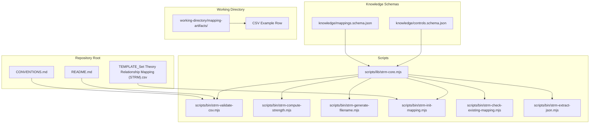
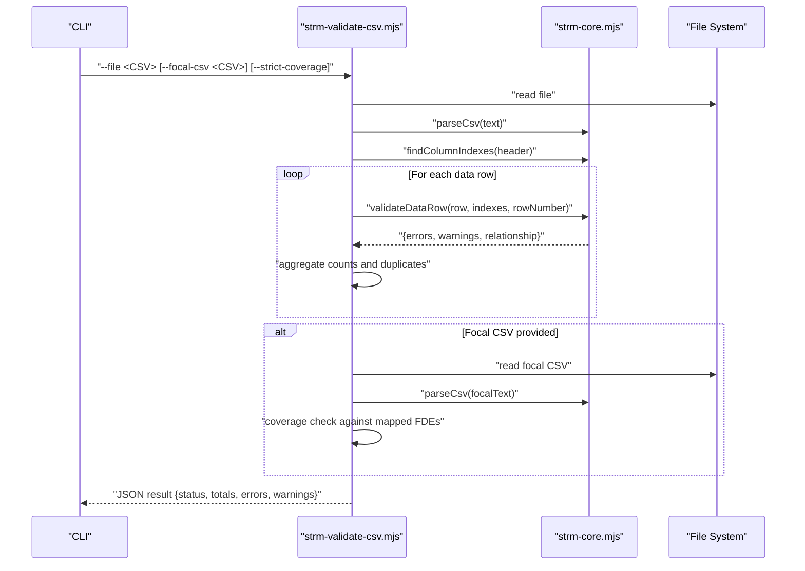
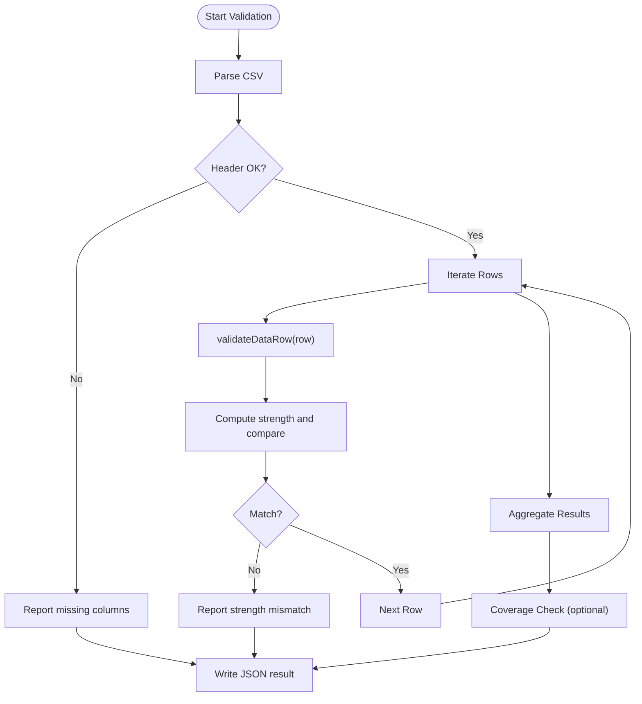
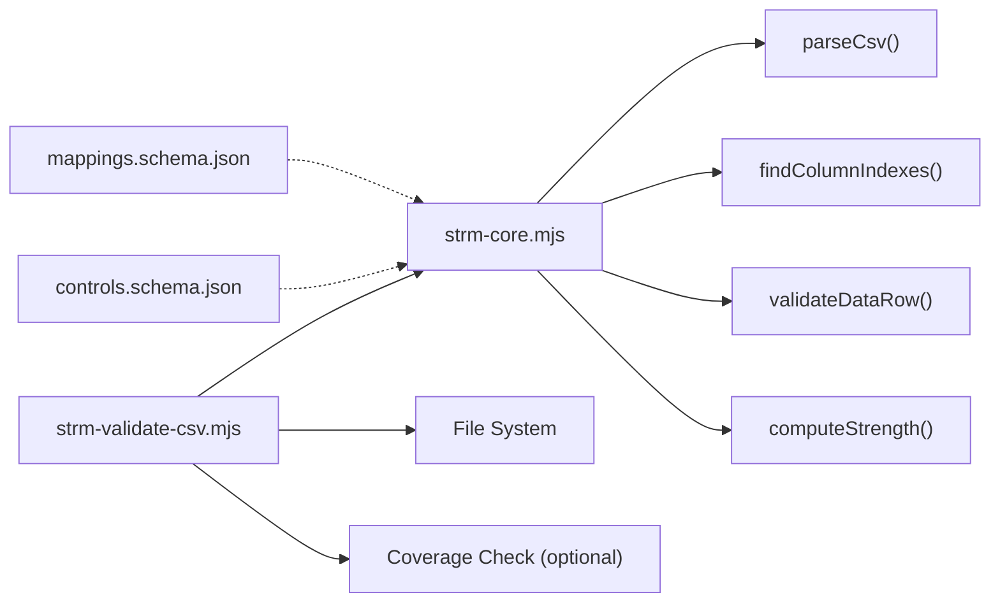

# CSV Structure and Validation

<cite>
**Referenced Files in This Document**
- [TEMPLATE_Set Theory Relationship Mapping (STRM).csv](file://TEMPLATE_Set Theory Relationship Mapping (STRM).csv)
- [CONVENTIONS.md](file://CONVENTIONS.md)
- [README.md](file://README.md)
- [scripts/lib/strm-core.mjs](file://scripts/lib/strm-core.mjs)
- [scripts/bin/strm-validate-csv.mjs](file://scripts/bin/strm-validate-csv.mjs)
- [scripts/bin/strm-compute-strength.mjs](file://scripts/bin/strm-compute-strength.mjs)
- [scripts/bin/strm-generate-filename.mjs](file://scripts/bin/strm-generate-filename.mjs)
- [scripts/bin/strm-init-mapping.mjs](file://scripts/bin/strm-init-mapping.mjs)
- [scripts/bin/strm-check-existing-mapping.mjs](file://scripts/bin/strm-check-existing-mapping.mjs)
- [scripts/bin/strm-extract-json.mjs](file://scripts/bin/strm-extract-json.mjs)
- [knowledge/mappings.schema.json](file://knowledge/mappings.schema.json)
- [knowledge/controls.schema.json](file://knowledge/controls.schema.json)
- [working-directory/mapping-artifacts/2026-03-24_StateRAMP_Rev5_Moderate-to-NIST_800-82_r3_Moderate/Set Theory Relationship Mapping (STRM)_ [(StateRAMP_Rev5_Moderate-to-StateRAMP_Rev5_Moderate)-to-NIST_800-82_r3_Moderate] - StateRAMP Rev5 Moderate to NIST 800-82 r3 Moderate.csv](file://working-directory/mapping-artifacts/2026-03-24_StateRAMP_Rev5_Moderate-to-NIST_800-82_r3_Moderate/Set Theory Relationship Mapping (STRM)_ [(StateRAMP_Rev5_Moderate-to-StateRAMP_Rev5_Moderate)-to-NIST_800-82_r3_Moderate] - StateRAMP Rev5 Moderate to NIST 800-82 r3 Moderate.csv)
</cite>

## Table of Contents
1. [Introduction](#introduction)
2. [Project Structure](#project-structure)
3. [Core Components](#core-components)
4. [Architecture Overview](#architecture-overview)
5. [Detailed Component Analysis](#detailed-component-analysis)
6. [Dependency Analysis](#dependency-analysis)
7. [Performance Considerations](#performance-considerations)
8. [Troubleshooting Guide](#troubleshooting-guide)
9. [Conclusion](#conclusion)
10. [Appendices](#appendices)

## Introduction
This document defines the standardized 12-column STRM CSV format and the validation pipeline that ensures data integrity, automated processing, and quality assurance. It explains each column, acceptable values, validation rules, file naming conventions, directory organization, and metadata requirements. It also documents the JSON Schema validation system that supports downstream datasets and describes the end-to-end validation pipeline that checks relationship consistency, strength calculations, and cross-references.

## Project Structure
The STRM project organizes mapping artifacts under a structured directory convention and provides deterministic scripts for initialization, validation, and file naming. The CSV template and conventions define the canonical structure and expectations.

**Diagram sources**
- [TEMPLATE_Set Theory Relationship Mapping (STRM).csv](file://TEMPLATE_Set Theory Relationship Mapping (STRM).csv#L1-L2)
- [CONVENTIONS.md:115-155](file://CONVENTIONS.md#L115-L155)
- [README.md:65-72](file://README.md#L65-L72)
- [scripts/lib/strm-core.mjs:81-97](file://scripts/lib/strm-core.mjs#L81-L97)
- [scripts/bin/strm-validate-csv.mjs:1-172](file://scripts/bin/strm-validate-csv.mjs#L1-L172)
- [scripts/bin/strm-compute-strength.mjs:1-20](file://scripts/bin/strm-compute-strength.mjs#L1-L20)
- [scripts/bin/strm-generate-filename.mjs:1-19](file://scripts/bin/strm-generate-filename.mjs#L1-L19)
- [scripts/bin/strm-init-mapping.mjs:1-58](file://scripts/bin/strm-init-mapping.mjs#L1-L58)
- [scripts/bin/strm-check-existing-mapping.mjs:1-20](file://scripts/bin/strm-check-existing-mapping.mjs#L1-L20)
- [scripts/bin/strm-extract-json.mjs:1-354](file://scripts/bin/strm-extract-json.mjs#L1-L354)
- [knowledge/mappings.schema.json:1-117](file://knowledge/mappings.schema.json#L1-L117)
- [knowledge/controls.schema.json:1-141](file://knowledge/controls.schema.json#L1-L141)
- [working-directory/mapping-artifacts/2026-03-24_StateRAMP_Rev5_Moderate-to-NIST_800-82_r3_Moderate/Set Theory Relationship Mapping (STRM)_ [(StateRAMP_Rev5_Moderate-to-StateRAMP_Rev5_Moderate)-to-NIST_800-82_r3_Moderate] - StateRAMP Rev5 Moderate to NIST 800-82 r3 Moderate.csv](file://working-directory/mapping-artifacts/2026-03-24_StateRAMP_Rev5_Moderate-to-NIST_800-82_r3_Moderate/Set Theory Relationship Mapping (STRM)_ [(StateRAMP_Rev5_Moderate-to-StateRAMP_Rev5_Moderate)-to-NIST_800-82_r3_Moderate] - StateRAMP Rev5 Moderate to NIST 800-82 r3 Moderate.csv#L1-L124)

**Section sources**
- [CONVENTIONS.md:115-155](file://CONVENTIONS.md#L115-L155)
- [README.md:65-72](file://README.md#L65-L72)

## Core Components
- Standardized 12-column STRM CSV header and row structure
- Column-level validation rules and acceptable values
- Automated strength calculation and consistency checks
- File naming and directory organization conventions
- JSON Schema validation for downstream datasets

**Section sources**
- [TEMPLATE_Set Theory Relationship Mapping (STRM).csv](file://TEMPLATE_Set Theory Relationship Mapping (STRM).csv#L1-L2)
- [CONVENTIONS.md:115-155](file://CONVENTIONS.md#L115-L155)
- [scripts/lib/strm-core.mjs:15-57](file://scripts/lib/strm-core.mjs#L15-L57)
- [scripts/bin/strm-validate-csv.mjs:206-289](file://scripts/bin/strm-validate-csv.mjs#L206-L289)

## Architecture Overview
The STRM CSV validation pipeline integrates parsing, column indexing, row-wise validation, strength computation, and coverage checks against a focal dataset. It also supports file naming and artifact directory generation.

**Diagram sources**
- [scripts/bin/strm-validate-csv.mjs:1-172](file://scripts/bin/strm-validate-csv.mjs#L1-L172)
- [scripts/lib/strm-core.mjs:99-204](file://scripts/lib/strm-core.mjs#L99-L204)

## Detailed Component Analysis

### CSV Template Structure and Columns
The canonical header defines 12 columns. Replace the placeholder `<Target>` in columns I and K with the actual target framework name.

- Column A: FDE#
- Column B: FDE Name
- Column C: Focal Document Element (FDE)
- Column D: Confidence Levels
- Column E: NIST IR-8477 Rational
- Column F: STRM Rationale
- Column G: STRM Relationship
- Column H: Strength of Relationship
- Column I: <Target> Requirement Title
- Column J: Target ID #
- Column K: <Target> Requirement Description
- Column L: Notes

Validation rules:
- Columns A, J, F are required and non-empty.
- STRM Relationship must be one of the allowed set-theory values.
- Confidence Levels must be high, medium, or low.
- NIST IR-8477 Rational must be semantic, functional, or syntactic.
- Strength of Relationship must be an integer between 1 and 10 and must match the computed score.
- For certain relationships, Notes should include contextual explanations.
- Target columns I and K must use the actual target framework name (not the placeholder).

**Section sources**
- [TEMPLATE_Set Theory Relationship Mapping (STRM).csv](file://TEMPLATE_Set Theory Relationship Mapping (STRM).csv#L1-L2)
- [CONVENTIONS.md:115-155](file://CONVENTIONS.md#L115-L155)
- [scripts/lib/strm-core.mjs:186-204](file://scripts/lib/strm-core.mjs#L186-L204)
- [scripts/bin/strm-validate-csv.mjs:64-74](file://scripts/bin/strm-validate-csv.mjs#L64-L74)

### Column Definitions, Acceptable Values, and Validation Rules
- FDE# (A): Required. Must be non-empty. Used to detect duplicates and coverage.
- FDE Name (B): Recommended for readability; no strict validation.
- Focal Document Element (C): Full text of the source control; no strict validation.
- Confidence Levels (D): high, medium, low.
- NIST IR-8477 Rational (E): semantic, functional, syntactic.
- STRM Rationale (F): Required and non-empty. Must reference both FDE# and Target ID #; should include “Both ...” and explicit scope language for subset_of/superset_of.
- STRM Relationship (G): equal, subset_of, superset_of, intersects_with, not_related.
- Strength of Relationship (H): Integer 1–10; must match computed score.
- <Target> Requirement Title (I): Replace placeholder with target framework name.
- Target ID # (J): Required and non-empty; must correspond to actual target control IDs.
- <Target> Requirement Description (K): Replace placeholder with target framework name.
- Notes (L): Optional; recommended for subset_of/superset_of and not_related.

Consistency checks:
- Strength mismatch: Found vs computed score.
- Duplicate mapping pairs (FDE# → Target ID #).
- Distribution self-checks: subset_of + superset_of ratio and proportion of equal rows.
- Coverage check: Compare mapped FDEs against expected FDEs from a focal CSV.

**Section sources**
- [scripts/lib/strm-core.mjs:206-289](file://scripts/lib/strm-core.mjs#L206-L289)
- [scripts/bin/strm-validate-csv.mjs:51-118](file://scripts/bin/strm-validate-csv.mjs#L51-L118)
- [scripts/bin/strm-validate-csv.mjs:120-153](file://scripts/bin/strm-validate-csv.mjs#L120-L153)

### Strength Calculation and Consistency
The strength score is computed from base scores, confidence adjustment, and rationale adjustment, then clamped to 1–10. The validator enforces that the provided score equals the computed score.

Base scores:
- equal: 10
- subset_of: 7
- superset_of: 7
- intersects_with: 4
- not_related: 0

Confidence adjustments:
- high: 0
- medium: -1
- low: -2

Rationale adjustments:
- semantic: 0
- functional: 0
- syntactic: -1

Computed score is clamped to 1–10.

**Section sources**
- [scripts/lib/strm-core.mjs:15-57](file://scripts/lib/strm-core.mjs#L15-L57)
- [scripts/bin/strm-compute-strength.mjs:1-20](file://scripts/bin/strm-compute-strength.mjs#L1-L20)
- [scripts/bin/strm-validate-csv.mjs:235-252](file://scripts/bin/strm-validate-csv.mjs#L235-L252)

### File Naming Conventions and Directory Organization
- Filename pattern: Set Theory Relationship Mapping (STRM)_ [(<Focal>-to-<Bridge>)-to-<Target>] - <Focal> to <Target>.csv
- For direct mappings, repeat the focal name in both the Focal and Bridge slots.
- Artifact directory: working-directory/mapping-artifacts/YYYY-MM-DD_<FocalFramework>-to-<TargetFramework>/
- Place the completed CSV inside the dated folder when mapping is fully complete.

Initialization script creates the header and directory layout deterministically.

**Section sources**
- [CONVENTIONS.md:138-155](file://CONVENTIONS.md#L138-L155)
- [scripts/lib/strm-core.mjs:67-79](file://scripts/lib/strm-core.mjs#L67-L79)
- [scripts/bin/strm-generate-filename.mjs:1-19](file://scripts/bin/strm-generate-filename.mjs#L1-L19)
- [scripts/bin/strm-init-mapping.mjs:36-43](file://scripts/bin/strm-init-mapping.mjs#L36-L43)

### JSON Schema Validation System
Two schemas support downstream datasets:
- mappings.schema.json: Defines the structure for mapping datasets aligned with NIST IR 8477 set-theory relationships.
- controls.schema.json: Defines the structure for control catalogs, including normalized control IDs and set-theory relationships.

These schemas enable automated validation of JSON outputs derived from STRM CSVs and ensure downstream consumers receive consistent, typed data.

**Section sources**
- [knowledge/mappings.schema.json:1-117](file://knowledge/mappings.schema.json#L1-L117)
- [knowledge/controls.schema.json:1-141](file://knowledge/controls.schema.json#L1-L141)

### Validation Pipeline Details
- Header validation: Ensures required columns are present and not unresolved placeholders.
- Row validation: Enforces required fields, acceptable values, and strength consistency.
- Distribution self-checks: Warns if subset_of + superset_of is zero or if equal rows exceed 50%.
- Coverage check: Compares mapped FDEs against expected FDEs from a focal CSV; can be strict or warning depending on flag.
- Duplicate detection: Tracks FDE# → Target ID # pairs to prevent duplication.

**Diagram sources**
- [scripts/bin/strm-validate-csv.mjs:27-172](file://scripts/bin/strm-validate-csv.mjs#L27-L172)
- [scripts/lib/strm-core.mjs:206-289](file://scripts/lib/strm-core.mjs#L206-L289)

**Section sources**
- [scripts/bin/strm-validate-csv.mjs:27-172](file://scripts/bin/strm-validate-csv.mjs#L27-L172)
- [scripts/lib/strm-core.mjs:206-289](file://scripts/lib/strm-core.mjs#L206-L289)

### Example CSV Entries and Common Errors
- Valid example: See the example CSV row demonstrating typical values for all columns, including rationale text and strength score.
- Common validation errors:
  - Missing required fields (FDE#, Target ID #, STRM Rationale)
  - Invalid STRM Relationship, Confidence Levels, or NIST IR-8477 Rational
  - Strength of Relationship not an integer or outside 1–10
  - Strength mismatch with computed score
  - Duplicate mapping pairs
  - Unresolved <Target> placeholders in header
  - Coverage gaps when a focal CSV is provided

**Section sources**
- [working-directory/mapping-artifacts/2026-03-24_StateRAMP_Rev5_Moderate-to-NIST_800-82_r3_Moderate/Set Theory Relationship Mapping (STRM)_ [(StateRAMP_Rev5_Moderate-to-StateRAMP_Rev5_Moderate)-to-NIST_800-82_r3_Moderate] - StateRAMP Rev5 Moderate to NIST 800-82 r3 Moderate.csv](file://working-directory/mapping-artifacts/2026-03-24_StateRAMP_Rev5_Moderate-to-NIST_800-82_r3_Moderate/Set Theory Relationship Mapping (STRM)_ [(StateRAMP_Rev5_Moderate-to-StateRAMP_Rev5_Moderate)-to-NIST_800-82_r3_Moderate] - StateRAMP Rev5 Moderate to NIST 800-82 r3 Moderate.csv#L1-L124)
- [scripts/bin/strm-validate-csv.mjs:41-74](file://scripts/bin/strm-validate-csv.mjs#L41-L74)
- [scripts/bin/strm-validate-csv.mjs:221-286](file://scripts/bin/strm-validate-csv.mjs#L221-L286)

### Guidance on CSV Preparation and Formatting
- Initialize CSV with the canonical header using the initialization script.
- Replace <Target> placeholders in columns I and K with the actual target framework name.
- Ensure STRM Rationale references both FDE# and Target ID # and includes “Both ...” and explicit scope language for subset_of/superset_of.
- Compute and enter the correct Strength of Relationship using the strength calculator.
- Verify no duplicate mapping pairs and that all Target ID # values exist in the target framework.
- Use the validator to catch errors and warnings before finalizing the artifact.

**Section sources**
- [scripts/bin/strm-init-mapping.mjs:36-43](file://scripts/bin/strm-init-mapping.mjs#L36-L43)
- [scripts/bin/strm-generate-filename.mjs:1-19](file://scripts/bin/strm-generate-filename.mjs#L1-L19)
- [scripts/bin/strm-compute-strength.mjs:1-20](file://scripts/bin/strm-compute-strength.mjs#L1-L20)
- [CONVENTIONS.md:185-207](file://CONVENTIONS.md#L185-L207)

## Dependency Analysis
The validation pipeline depends on the core CSV parsing and validation utilities, and optionally on a focal CSV for coverage checks. The JSON schemas provide downstream validation contracts.

**Diagram sources**
- [scripts/bin/strm-validate-csv.mjs:1-172](file://scripts/bin/strm-validate-csv.mjs#L1-L172)
- [scripts/lib/strm-core.mjs:99-289](file://scripts/lib/strm-core.mjs#L99-L289)
- [knowledge/mappings.schema.json:1-117](file://knowledge/mappings.schema.json#L1-L117)
- [knowledge/controls.schema.json:1-141](file://knowledge/controls.schema.json#L1-L141)

**Section sources**
- [scripts/bin/strm-validate-csv.mjs:1-172](file://scripts/bin/strm-validate-csv.mjs#L1-L172)
- [scripts/lib/strm-core.mjs:99-289](file://scripts/lib/strm-core.mjs#L99-L289)

## Performance Considerations
- CSV parsing is linear in the number of characters; keep rows reasonably sized.
- The validator iterates once over rows and performs constant-time checks per row.
- Coverage checks scale with the size of the focal CSV; consider limiting to necessary rows.
- JSON Schema validation is efficient for downstream datasets; ensure schemas remain up-to-date.

## Troubleshooting Guide
Common issues and resolutions:
- Missing required columns: Ensure the header matches the canonical template and replace <Target> placeholders.
- Strength mismatch: Recompute using the strength calculator and update the CSV.
- Duplicate mapping pairs: Remove or merge duplicates; ensure unique FDE# → Target ID # combinations.
- Coverage gaps: Add mappings for unmapped FDEs or adjust expectations.
- Unresolved placeholders: Replace <Target> in columns I and K with the actual target framework name.
- Low confidence or syntactic rationale: Review intent; prefer semantic or functional where appropriate.

**Section sources**
- [scripts/bin/strm-validate-csv.mjs:41-74](file://scripts/bin/strm-validate-csv.mjs#L41-L74)
- [scripts/bin/strm-validate-csv.mjs:120-153](file://scripts/bin/strm-validate-csv.mjs#L120-L153)
- [scripts/bin/strm-validate-csv.mjs:235-252](file://scripts/bin/strm-validate-csv.mjs#L235-L252)

## Conclusion
The STRM CSV format and validation pipeline provide a robust, standardized approach to cross-framework mapping. By adhering to the 12-column template, acceptable values, and validation rules, teams can produce high-quality, machine-readable mappings that support automated processing, quality assurance, and downstream JSON datasets.

## Appendices

### Appendix A: CSV Template and Column Reference
- Canonical header: FDE#,FDE Name,Focal Document Element (FDE),Confidence Levels,NIST IR-8477 Rational,STRM Rationale,STRM Relationship,Strength of Relationship,<Target> Requirement Title,Target ID #,<Target> Requirement Description,Notes
- Replace <Target> in columns I and K with the actual target framework name.

**Section sources**
- [TEMPLATE_Set Theory Relationship Mapping (STRM).csv](file://TEMPLATE_Set Theory Relationship Mapping (STRM).csv#L1-L2)
- [CONVENTIONS.md:115-155](file://CONVENTIONS.md#L115-L155)

### Appendix B: Relationship Types and Decision Matrix
- equal: Identical scope and obligation
- subset_of: FDE fully contained within RDE
- superset_of: FDE fully contains RDE
- intersects_with: Partial overlap
- not_related: Rare; verify overlap before choosing

**Section sources**
- [CONVENTIONS.md:46-75](file://CONVENTIONS.md#L46-L75)

### Appendix C: Strength Formula Reference
- Base scores: equal=10, subset_of=7, superset_of=7, intersects_with=4, not_related=0
- Confidence adjustments: high=0, medium=-1, low=-2
- Rationale adjustments: semantic=0, functional=0, syntactic=-1
- Clamp result to 1–10

**Section sources**
- [CONVENTIONS.md:87-96](file://CONVENTIONS.md#L87-L96)
- [scripts/lib/strm-core.mjs:15-57](file://scripts/lib/strm-core.mjs#L15-L57)

### Appendix D: Example CSV Row
See the example CSV row for a representative mapping entry with rationale text, strength score, and target metadata.

**Section sources**
- [working-directory/mapping-artifacts/2026-03-24_StateRAMP_Rev5_Moderate-to-NIST_800-82_r3_Moderate/Set Theory Relationship Mapping (STRM)_ [(StateRAMP_Rev5_Moderate-to-StateRAMP_Rev5_Moderate)-to-NIST_800-82_r3_Moderate] - StateRAMP Rev5 Moderate to NIST 800-82 r3 Moderate.csv](file://working-directory/mapping-artifacts/2026-03-24_StateRAMP_Rev5_Moderate-to-NIST_800-82_r3_Moderate/Set Theory Relationship Mapping (STRM)_ [(StateRAMP_Rev5_Moderate-to-StateRAMP_Rev5_Moderate)-to-NIST_800-82_r3_Moderate] - StateRAMP Rev5 Moderate to NIST 800-82 r3 Moderate.csv#L1-L124)