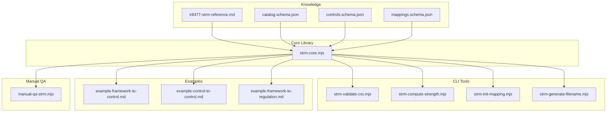
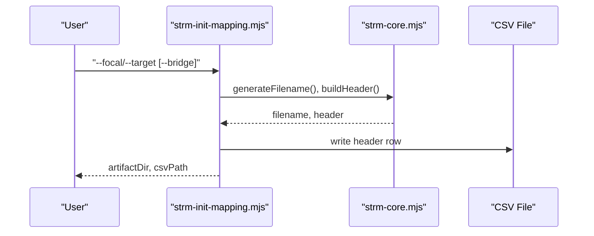
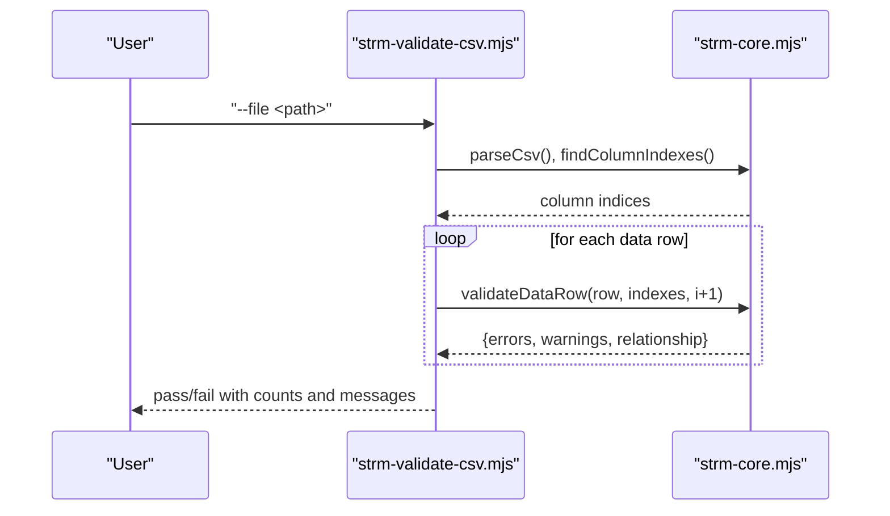
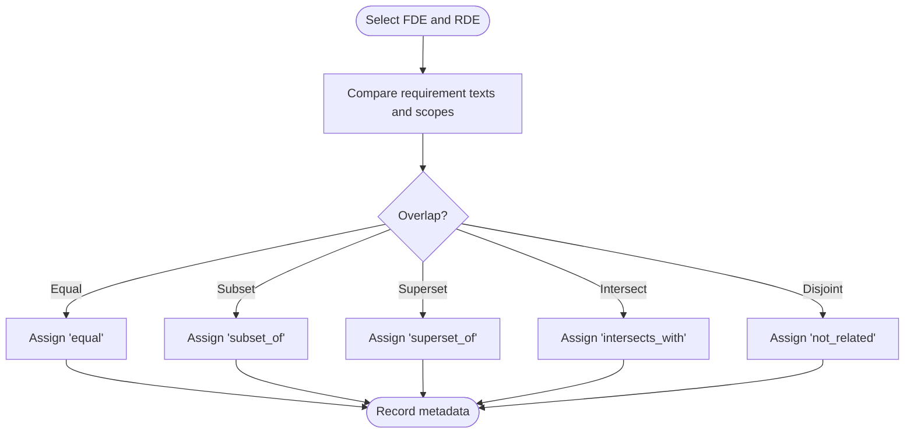
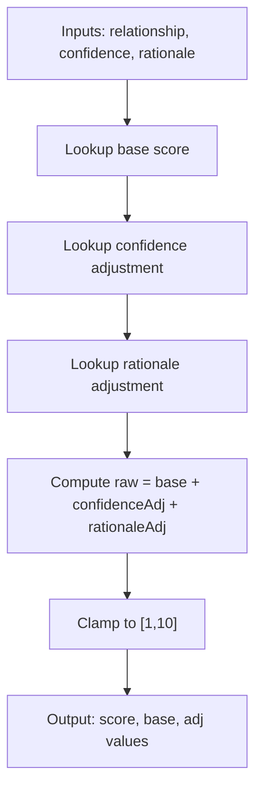
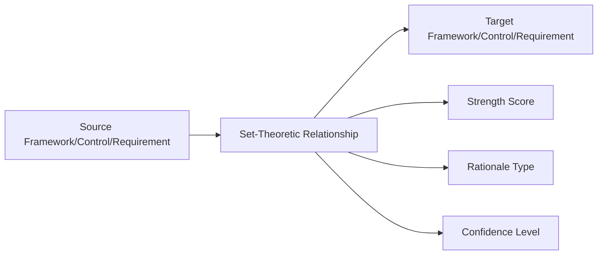
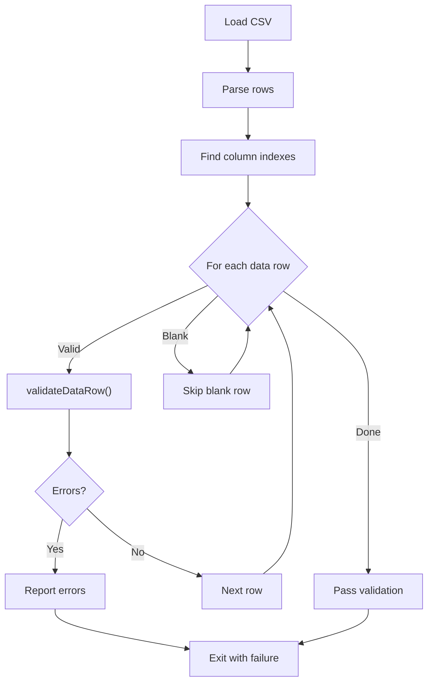
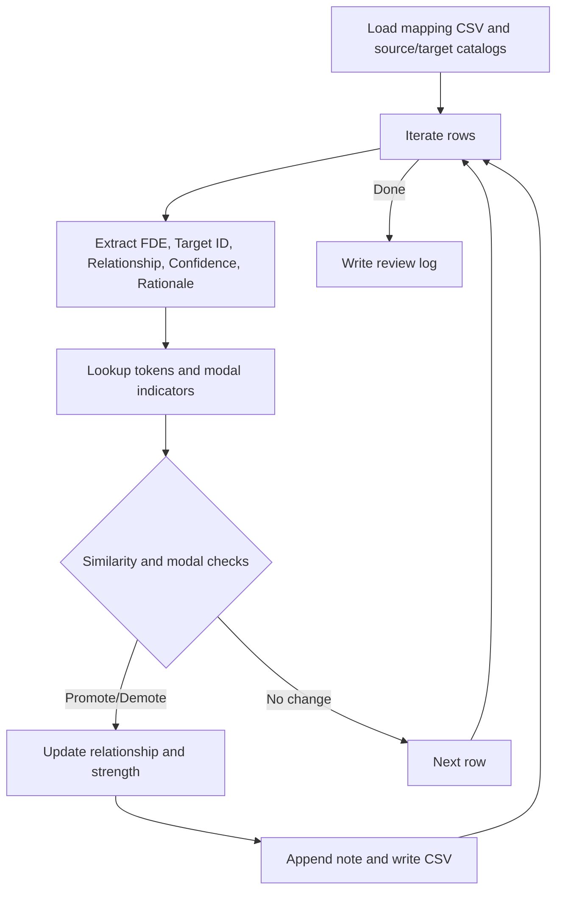
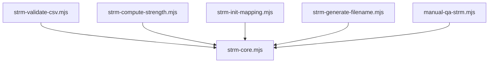

# Core Concepts and Methodology

<cite>
**Referenced Files in This Document**
- [ir8477-strm-reference.md](file://knowledge/ir8477-strm-reference.md)
- [TEMPLATE_Set Theory Relationship Mapping (STRM).csv](file://TEMPLATE_Set Theory Relationship Mapping (STRM).csv)
- [strm-core.mjs](file://scripts/lib/strm-core.mjs)
- [strm-validate-csv.mjs](file://scripts/bin/strm-validate-csv.mjs)
- [strm-compute-strength.mjs](file://scripts/bin/strm-compute-strength.mjs)
- [strm-init-mapping.mjs](file://scripts/bin/strm-init-mapping.mjs)
- [strm-generate-filename.mjs](file://scripts/bin/strm-generate-filename.mjs)
- [mappings.schema.json](file://knowledge/mappings.schema.json)
- [catalog.schema.json](file://knowledge/catalog.schema.json)
- [controls.schema.json](file://knowledge/controls.schema.json)
- [example-framework-to-control.md](file://examples/example-framework-to-control.md)
- [example-control-to-control.md](file://examples/example-control-to-control.md)
- [example-framework-to-regulation.md](file://examples/example-framework-to-regulation.md)
- [manual-qa-strm.mjs](file://working-directory/scratch/manual-qa-strm.mjs)
</cite>

## Table of Contents
1. [Introduction](#introduction)
2. [Project Structure](#project-structure)
3. [Core Components](#core-components)
4. [Architecture Overview](#architecture-overview)
5. [Detailed Component Analysis](#detailed-component-analysis)
6. [Dependency Analysis](#dependency-analysis)
7. [Performance Considerations](#performance-considerations)
8. [Troubleshooting Guide](#troubleshooting-guide)
9. [Conclusion](#conclusion)
10. [Appendices](#appendices)

## Introduction
This document presents the Core Concepts and Methodology for NIST IR 8477 Set-Theory Relationship Mapping (STRM). It explains the mathematical foundation of STRM, enumerates the five set-theory relationships, defines the strength scoring system and rationale/confidence dimensions, and documents the 12-column STRM CSV structure. It also describes how STRM relates frameworks, controls, regulations, and risk/threat libraries, and provides practical examples of each relationship type. Finally, it outlines validation rules, quality assurance processes, and manual review workflows, along with guidance for interpreting STRM results.

## Project Structure
The STRM methodology is implemented across a small set of cohesive modules and artifacts:
- Knowledge and reference materials define the STRM semantics and supported frameworks.
- Core library functions implement parsing, validation, scoring, and file generation.
- Example artifacts demonstrate STRM usage across mapping types.
- Validation scripts enforce CSV correctness and consistency.
- Schemas define the canonical data models for catalogs, controls, and mappings.

**Diagram sources**
- [ir8477-strm-reference.md:1-119](file://knowledge/ir8477-strm-reference.md#L1-L119)
- [strm-core.mjs:1-343](file://scripts/lib/strm-core.mjs#L1-L343)
- [strm-validate-csv.mjs:1-77](file://scripts/bin/strm-validate-csv.mjs#L1-L77)
- [strm-compute-strength.mjs:1-20](file://scripts/bin/strm-compute-strength.mjs#L1-L20)
- [strm-init-mapping.mjs:1-58](file://scripts/bin/strm-init-mapping.mjs#L1-L58)
- [strm-generate-filename.mjs:1-19](file://scripts/bin/strm-generate-filename.mjs#L1-L19)
- [mappings.schema.json:1-117](file://knowledge/mappings.schema.json#L1-L117)
- [catalog.schema.json:1-157](file://knowledge/catalog.schema.json#L1-L157)
- [controls.schema.json:1-141](file://knowledge/controls.schema.json#L1-L141)
- [example-framework-to-control.md:1-159](file://examples/example-framework-to-control.md#L1-L159)
- [example-control-to-control.md:1-162](file://examples/example-control-to-control.md#L1-L162)
- [example-framework-to-regulation.md:1-163](file://examples/example-framework-to-regulation.md#L1-L163)
- [manual-qa-strm.mjs:1-145](file://working-directory/scratch/manual-qa-strm.mjs#L1-L145)

**Section sources**
- [ir8477-strm-reference.md:1-119](file://knowledge/ir8477-strm-reference.md#L1-L119)
- [strm-core.mjs:1-343](file://scripts/lib/strm-core.mjs#L1-L343)

## Core Components
This section documents the foundational elements of STRM: the five set-theory relationships, rationale types, confidence levels, and the strength scoring system.

- Set-Theoretic Relationships
  - equal: FDE and RDE express identical requirements.
  - subset_of: FDE requirements are entirely contained within RDE.
  - superset_of: FDE requirements entirely contain RDE.
  - intersects_with: FDE and RDE partially overlap but neither contains the other.
  - not_related: No meaningful overlap between FDE and RDE.

- Rationale Types
  - syntactic: Wording/textual similarity.
  - semantic: Meaning/intent similarity.
  - functional: Outcome/result similarity.

- Confidence Levels
  - high: Strong evidence supports the relationship.
  - medium: Reasonable evidence, some ambiguity.
  - low: Weak evidence, significant interpretation required.

- Strength Scoring System
  - Base scores: equal (10), subset/superset (7), intersects (4), not_related (0).
  - Adjustments: confidence (high: +0, medium: -1, low: -2); rationale (functional/semantic: +0, syntactic: -1).
  - Final score clamped to [1, 10]; interpretation thresholds: 8–10 (strong), 5–7 (moderate), 1–4 (weak).

These definitions and scoring rules are enforced by the core library and validated by CLI tools.

**Section sources**
- [ir8477-strm-reference.md:16-56](file://knowledge/ir8477-strm-reference.md#L16-L56)
- [strm-core.mjs:4-57](file://scripts/lib/strm-core.mjs#L4-L57)

## Architecture Overview
The STRM architecture centers on a core library that provides:
- Relationship constants and scoring.
- CSV parsing and serialization helpers.
- Column indexing and validation.
- Filename generation and artifact directory resolution.

CLI tools orchestrate workflows:
- Initialize mapping CSVs with standardized headers.
- Compute strength scores from relationship, confidence, and rationale.
- Validate CSVs for required columns, values, and consistency.
- Generate filenames for artifacts.

**Diagram sources**
- [strm-init-mapping.mjs:12-57](file://scripts/bin/strm-init-mapping.mjs#L12-L57)
- [strm-core.mjs:67-97](file://scripts/lib/strm-core.mjs#L67-L97)

**Diagram sources**
- [strm-validate-csv.mjs:15-76](file://scripts/bin/strm-validate-csv.mjs#L15-L76)
- [strm-core.mjs:99-265](file://scripts/lib/strm-core.mjs#L99-L265)

## Detailed Component Analysis

### Mathematical Foundation and Semantics
STRM defines precise set-theoretic semantics for comparing requirements across frameworks and standards. The five relationships are mutually exclusive and collectively sufficient for automated reasoning and transitivity derivation. Inverse relations are well-defined, enabling reverse mapping interpretation.

**Diagram sources**
- [ir8477-strm-reference.md:16-85](file://knowledge/ir8477-strm-reference.md#L16-L85)

**Section sources**
- [ir8477-strm-reference.md:16-85](file://knowledge/ir8477-strm-reference.md#L16-L85)

### CSV Structure and Field Definitions
The STRM CSV follows a fixed 12-column layout. The header row is generated programmatically and includes:
- FDE# and FDE Name
- Focal Document Element (FDE)
- Confidence Levels
- NIST IR-8477 Rational
- STRM Rationale
- STRM Relationship
- Strength of Relationship
- Target Requirement Title
- Target ID #
- Target Requirement Description
- Notes

Field definitions and validation requirements:
- FDE#: Required; non-empty.
- Target ID #: Required; non-empty.
- STRM Rationale: Required; non-empty.
- STRM Relationship: Enumerated; must match one of the five canonical values.
- Confidence Levels: Enumerated; must be high/medium/low.
- NIST IR-8477 Rational: Enumerated; must be syntactic/semantic/functional.
- Strength of Relationship: Integer; must be 1–10.
- Consistency: When all three (relationship, confidence, rationale) are valid, the computed strength must equal the recorded strength.

The template header file provides the canonical header order.

**Section sources**
- [TEMPLATE_Set Theory Relationship Mapping (STRM).csv:1-2](file://TEMPLATE_Set Theory Relationship Mapping (STRM).csv#L1-L2)
- [strm-core.mjs:81-97](file://scripts/lib/strm-core.mjs#L81-L97)
- [strm-core.mjs:206-265](file://scripts/lib/strm-core.mjs#L206-L265)

### Strength Scoring and Interpretation
The scoring function computes a final score from base, confidence, and rationale adjustments, then clamps to [1, 10]. The CLI tool validates that the recorded strength matches the computed value.

**Diagram sources**
- [strm-core.mjs:35-57](file://scripts/lib/strm-core.mjs#L35-L57)
- [strm-compute-strength.mjs:9-19](file://scripts/bin/strm-compute-strength.mjs#L9-L19)

**Section sources**
- [ir8477-strm-reference.md:44-56](file://knowledge/ir8477-strm-reference.md#L44-L56)
- [strm-core.mjs:35-57](file://scripts/lib/strm-core.mjs#L35-L57)
- [strm-compute-strength.mjs:9-19](file://scripts/bin/strm-compute-strength.mjs#L9-L19)

### Cross-Framework Alignment and Scope Categories
STRM supports aligning across frameworks, controls, regulations, and risk/threat libraries. The canonical data models define scope categories for source and target sets, enabling precise semantic alignment. The STRM reference enumerates supported frameworks and highlights NIST SP 800-53 as the canonical hub.

**Diagram sources**
- [ir8477-strm-reference.md:96-112](file://knowledge/ir8477-strm-reference.md#L96-L112)
- [mappings.schema.json:4-45](file://knowledge/mappings.schema.json#L4-L45)
- [catalog.schema.json:26-55](file://knowledge/catalog.schema.json#L26-L55)
- [controls.schema.json:58-97](file://knowledge/controls.schema.json#L58-L97)

**Section sources**
- [ir8477-strm-reference.md:96-112](file://knowledge/ir8477-strm-reference.md#L96-L112)
- [mappings.schema.json:4-45](file://knowledge/mappings.schema.json#L4-L45)
- [catalog.schema.json:26-55](file://knowledge/catalog.schema.json#L26-L55)
- [controls.schema.json:58-97](file://knowledge/controls.schema.json#L58-L97)

### Practical Examples of Each Relationship Type
The examples demonstrate STRM in action across three mapping types: framework-to-control, control-to-control, and framework-to-regulation. They show how each relationship type appears in real-world contexts and how strengths are computed.

- equal: NIST AC-2 and a CIS Safeguard covering account management.
- subset_of: NIST CM-7 (least functionality) is a subset of a broader CIS secure configuration process.
- superset_of: NIST AU-6 (audit record review) is a superset of a weekly CIS log review requirement.
- intersects_with: NIST IR-4 and a SOC 2 TSC both address incident handling but differ in scope and structure.
- not_related: NIST SC-39 (process isolation) and a CIS safeguard on exploit mitigation operate on different attack surfaces.

These examples illustrate how STRM captures nuanced equivalences, overlaps, and irrelevancies, and how rationale and confidence inform the strength score.

**Section sources**
- [example-framework-to-control.md:42-134](file://examples/example-framework-to-control.md#L42-L134)
- [example-control-to-control.md:41-133](file://examples/example-control-to-control.md#L41-L133)
- [example-framework-to-regulation.md:41-133](file://examples/example-framework-to-regulation.md#L41-L133)

### Validation Rules and Quality Assurance
Validation enforces:
- Presence of required columns and rows.
- Correctness of enumerated values for relationship, confidence, and rationale.
- Numeric range for strength (1–10).
- Consistency: recorded strength equals computed strength.
- Guidance: warnings for edge cases (e.g., not_related without notes, syntactic rationale, low confidence).

Quality assurance includes:
- Automated validation via CLI.
- Manual review workflow using token-based similarity checks and modal language heuristics to refine relationships.
- A manual QA script that updates relationships and recomputes strengths, generating a review log.

**Diagram sources**
- [strm-validate-csv.mjs:30-76](file://scripts/bin/strm-validate-csv.mjs#L30-L76)
- [strm-core.mjs:206-265](file://scripts/lib/strm-core.mjs#L206-L265)

**Section sources**
- [strm-validate-csv.mjs:15-76](file://scripts/bin/strm-validate-csv.mjs#L15-L76)
- [strm-core.mjs:206-265](file://scripts/lib/strm-core.mjs#L206-L265)
- [manual-qa-strm.mjs:31-116](file://working-directory/scratch/manual-qa-strm.mjs#L31-L116)

### Manual Review Workflow
The manual QA workflow compares textual similarity between source and target titles/descriptions and evaluates modal language (e.g., “shall,” “should”) to decide whether to promote or demote relationships. It updates the STRM Relationship and recomputes the Strength of Relationship, appending a note with the rationale for the change.

**Diagram sources**
- [manual-qa-strm.mjs:31-116](file://working-directory/scratch/manual-qa-strm.mjs#L31-L116)

**Section sources**
- [manual-qa-strm.mjs:31-116](file://working-directory/scratch/manual-qa-strm.mjs#L31-L116)

## Dependency Analysis
The core library is the central dependency for all CLI tools and examples. The schemas define the canonical data contracts for catalogs, controls, and mappings, ensuring interoperability and consistency across the ecosystem.

**Diagram sources**
- [strm-core.mjs:1-343](file://scripts/lib/strm-core.mjs#L1-L343)
- [strm-validate-csv.mjs:3](file://scripts/bin/strm-validate-csv.mjs#L3)
- [strm-compute-strength.mjs:2](file://scripts/bin/strm-compute-strength.mjs#L2)
- [strm-init-mapping.mjs:10](file://scripts/bin/strm-init-mapping.mjs#L10)
- [strm-generate-filename.mjs:2](file://scripts/bin/strm-generate-filename.mjs#L2)
- [manual-qa-strm.mjs:2](file://working-directory/scratch/manual-qa-strm.mjs#L2)

**Section sources**
- [strm-core.mjs:1-343](file://scripts/lib/strm-core.mjs#L1-L343)

## Performance Considerations
- CSV parsing and validation are linear in the number of rows and columns; performance is dominated by I/O and string operations.
- Tokenization and Jaccard similarity in manual QA scale with the number of rows and vocabulary size; tuning thresholds can balance precision and recall.
- Recommendations:
  - Pre-filter blank rows to reduce iterations.
  - Cache token sets for repeated comparisons.
  - Parallelize independent validations when scaling to large datasets.

## Troubleshooting Guide
Common issues and resolutions:
- Missing required columns: Ensure the header matches the canonical 12-column layout.
- Invalid enumerated values: Confirm relationship, confidence, and rationale conform to allowed sets.
- Strength mismatch: Recompute using the strength CLI tool and update the recorded value accordingly.
- not_related without notes: Add contextual notes to justify lack of relationship.
- Syntactic rationale warnings: Verify intent; prefer semantic or functional when possible.
- Low confidence warnings: Use only when significant inference is required; otherwise re-evaluate evidence.

Validation output includes counts and lists of errors and warnings to guide corrections.

**Section sources**
- [strm-validate-csv.mjs:61-76](file://scripts/bin/strm-validate-csv.mjs#L61-L76)
- [strm-core.mjs:206-265](file://scripts/lib/strm-core.mjs#L206-L265)

## Conclusion
NIST IR 8477 STRM provides a rigorous, mathematically grounded methodology for mapping relationships among cybersecurity controls, frameworks, regulations, and risk/threat libraries. By combining precise set-theoretic semantics, a structured scoring system, and robust validation and manual review workflows, STRM enables automated reasoning, cross-framework alignment, and high-quality mapping artifacts suitable for audits and compliance assessments.

## Appendices

### Appendix A: STRM CSV Columns and Definitions
- FDE#: Unique identifier for the focal requirement.
- FDE Name: Human-readable name of the focal requirement.
- Focal Document Element (FDE): Full text of the focal requirement.
- Confidence Levels: high/medium/low.
- NIST IR-8477 Rational: syntactic/semantic/functional.
- STRM Rationale: Explanation of why the relationship holds.
- STRM Relationship: equal/subset_of/superset_of/intersects_with/not_related.
- Strength of Relationship: integer 1–10.
- Target Requirement Title: Title of the target requirement.
- Target ID #: Identifier of the target requirement.
- Target Requirement Description: Full text of the target requirement.
- Notes: Observations, caveats, and manual review notes.

**Section sources**
- [TEMPLATE_Set Theory Relationship Mapping (STRM).csv:1](file://TEMPLATE_Set Theory Relationship Mapping (STRM).csv#L1)
- [strm-core.mjs:81-97](file://scripts/lib/strm-core.mjs#L81-L97)

### Appendix B: Supported Frameworks
- NIST SP 800-53 Rev.5
- ISO/IEC 27001:2022
- SOC 2 (Trust Services Criteria)
- PCI DSS v4.0.1
- HIPAA Security Rule
- CIS Controls v8.1
- CMMC 2.0
- NIST SP 800-171 Rev.2
- COBIT 2019
- CSA CCM v4
- GDPR
- FedRAMP
- and others

**Section sources**
- [ir8477-strm-reference.md:96-112](file://knowledge/ir8477-strm-reference.md#L96-L112)

### Appendix C: Data Model References
- Catalog schema: Defines set-theory relationships and control-level semantics.
- Controls schema: Defines control-level attributes and optional set-theory relationships.
- Mappings schema: Defines mapping-level semantics and canonical relationship values.

**Section sources**
- [catalog.schema.json:5-55](file://knowledge/catalog.schema.json#L5-L55)
- [controls.schema.json:58-97](file://knowledge/controls.schema.json#L58-L97)
- [mappings.schema.json:5-45](file://knowledge/mappings.schema.json#L5-L45)