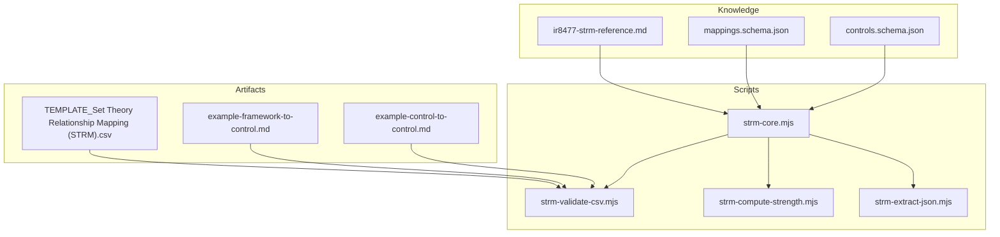
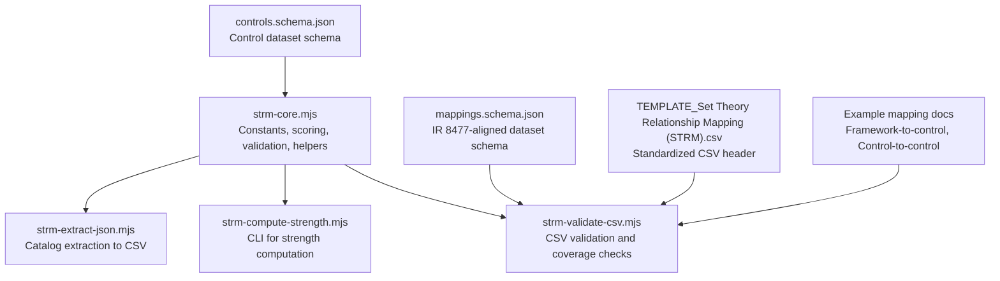
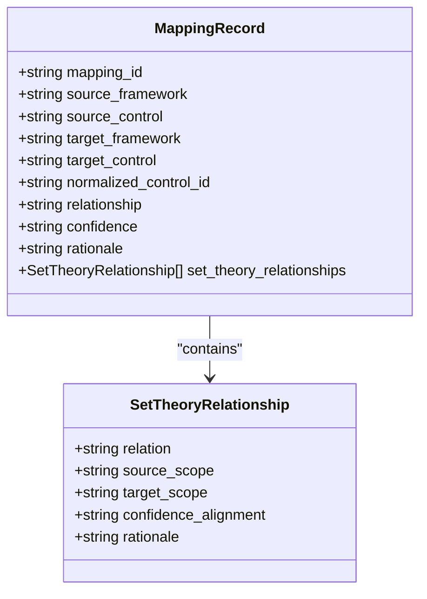
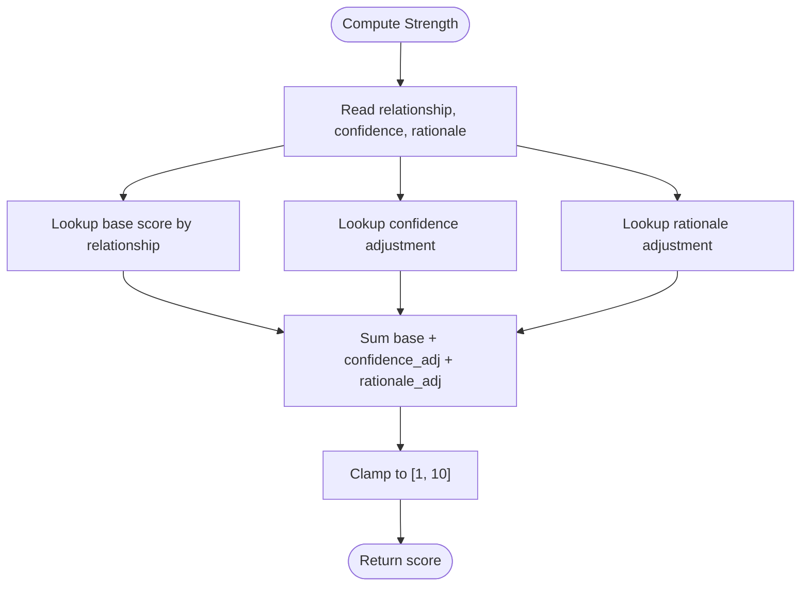
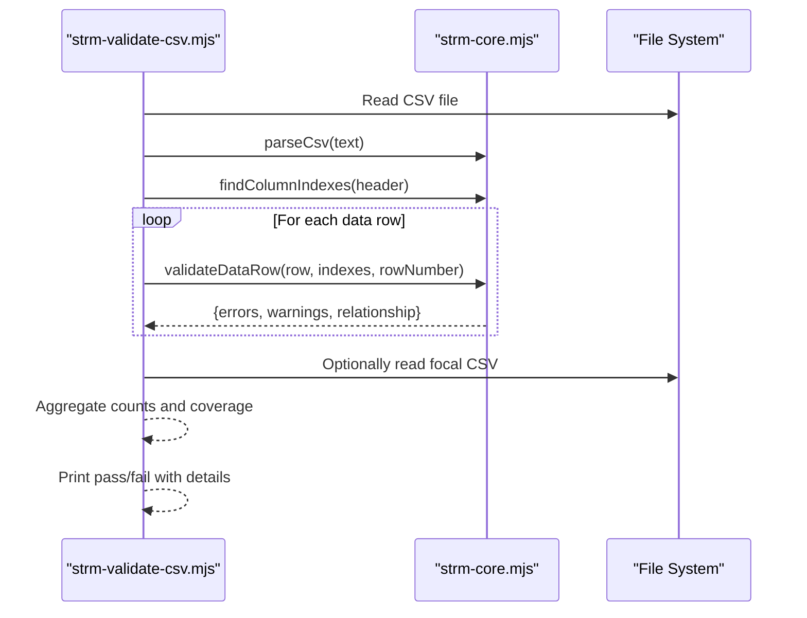
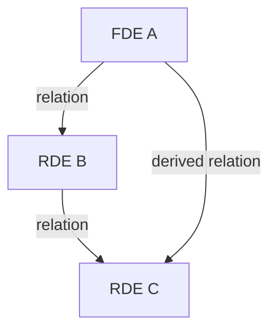
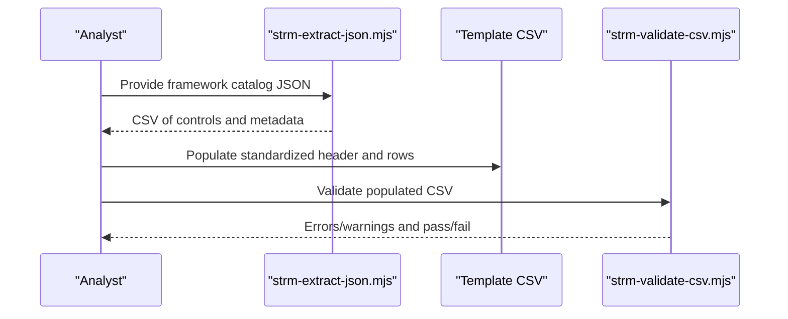
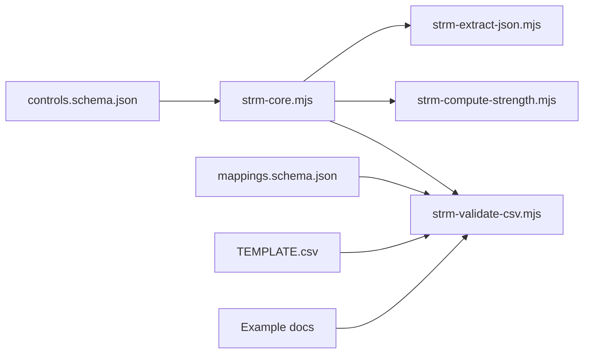

# NIST IR 8477 Methodology

<cite>
**Referenced Files in This Document**
- [ir8477-strm-reference.md](file://knowledge/ir8477-strm-reference.md)
- [README.md](file://README.md)
- [mappings.schema.json](file://knowledge/mappings.schema.json)
- [controls.schema.json](file://knowledge/controls.schema.json)
- [strm-core.mjs](file://scripts/lib/strm-core.mjs)
- [strm-compute-strength.mjs](file://scripts/bin/strm-compute-strength.mjs)
- [strm-validate-csv.mjs](file://scripts/bin/strm-validate-csv.mjs)
- [strm-extract-json.mjs](file://scripts/bin/strm-extract-json.mjs)
- [TEMPLATE_Set Theory Relationship Mapping (STRM).csv](file://TEMPLATE_Set Theory Relationship Mapping (STRM).csv)
- [example-framework-to-control.md](file://examples/example-framework-to-control.md)
- [example-control-to-control.md](file://examples/example-control-to-control.md)
- [docs/methodology.md](file://docs/methodology.md)
- [CONVENTIONS.md](file://CONVENTIONS.md)
</cite>

## Table of Contents
1. [Introduction](#introduction)
2. [Project Structure](#project-structure)
3. [Core Components](#core-components)
4. [Architecture Overview](#architecture-overview)
5. [Detailed Component Analysis](#detailed-component-analysis)
6. [Dependency Analysis](#dependency-analysis)
7. [Performance Considerations](#performance-considerations)
8. [Troubleshooting Guide](#troubleshooting-guide)
9. [Conclusion](#conclusion)
10. [Appendices](#appendices)

## Introduction
This document presents the formal mathematical foundation of the NIST IR 8477 Methodology for Set-Theory Relationship Mapping (STRM). It explains how STRM operationalizes set-theoretic semantics to define precise relationships between cybersecurity controls and requirements, enabling automated reasoning, transitivity derivation, and quantitative strength scoring. The methodology distinguishes STRM from informal mapping approaches by grounding mappings in rigorous set-theoretic definitions of Focal Document Elements (FDE), Reference Document Elements (RDE), and Set-Theoretic Relationships (STR). It further outlines the theoretical underpinnings for cross-framework alignment and demonstrates how the approach supports quantitative analysis and comparative assessment across standards.

## Project Structure
The repository organizes the STRM methodology and toolkit into three primary areas:
- Knowledge base: Formal definitions, schemas, and reference materials for STRM.
- Scripts: Core libraries and command-line tools that implement validation, computation, extraction, and CSV handling.
- Examples and templates: Representative mapping scenarios and standardized CSV templates.

**Diagram sources**
- [ir8477-strm-reference.md:1-119](file://knowledge/ir8477-strm-reference.md#L1-L119)
- [mappings.schema.json:1-117](file://knowledge/mappings.schema.json#L1-L117)
- [controls.schema.json:1-141](file://knowledge/controls.schema.json#L1-L141)
- [strm-core.mjs:1-367](file://scripts/lib/strm-core.mjs#L1-L367)
- [strm-compute-strength.mjs:1-20](file://scripts/bin/strm-compute-strength.mjs#L1-L20)
- [strm-validate-csv.mjs:1-172](file://scripts/bin/strm-validate-csv.mjs#L1-L172)
- [strm-extract-json.mjs:1-354](file://scripts/bin/strm-extract-json.mjs#L1-L354)
- [TEMPLATE_Set Theory Relationship Mapping (STRM).csv](file://TEMPLATE_Set Theory Relationship Mapping (STRM).csv#L1-L2)
- [example-framework-to-control.md:1-159](file://examples/example-framework-to-control.md#L1-L159)
- [example-control-to-control.md:1-162](file://examples/example-control-to-control.md#L1-L162)

**Section sources**
- [README.md:1-85](file://README.md#L1-L85)
- [docs/methodology.md:1-14](file://docs/methodology.md#L1-L14)

## Core Components
This section documents the formal definitions and computational components that implement NIST IR 8477 semantics.

- Formal Definitions
  - Focal Document Element (FDE): The source control or requirement being mapped from.
  - Reference Document Element (RDE): The target control or requirement being mapped to.
  - Set-Theoretic Relationship (STR): A formal relationship between FDE and RDE, drawn from set theory.
  - Relationship Mapping (RM): A complete mapping record including metadata such as confidence and rationale.

- Set-Theoretic Relationships
  - Equal: FDE and RDE express identical requirements.
  - Subset Of: FDE requirements are entirely contained within RDE.
  - Superset Of: FDE requirements entirely contain RDE.
  - Intersects With: FDE and RDE partially overlap but neither contains the other.
  - Not Related: FDE and RDE share no meaningful overlap.

- Rationale Types
  - Syntactic: Wording or textual similarity.
  - Semantic: Meaning or intent similarity.
  - Functional: Outcome or result similarity.

- Confidence Levels
  - High, Medium, Low.

- STRM Strength Score (1–10)
  - Deterministic scoring combining base relationship value, confidence adjustment, and rationale adjustment, clamped to [1, 10].

- Transitivity Rules
  - Derivable relationships across chains (e.g., A-to-B and B-to-C imply A-to-C under specific combinations).

- Inverse Relations
  - Every relationship has a well-defined inverse (e.g., subset_of ↔ superset_of).

- Scope Categories
  - Framework control set, normalized control set, control requirement set, risk scenario set, implementation evidence set.

- Supported Frameworks
  - NIST SP 800-53 Rev. 5, ISO/IEC 27001:2022, SOC 2, PCI DSS v4.0.1, HIPAA Security Rule, CIS Controls v8.1, CMMC 2.0, NIST SP 800-171 Rev. 2, COBIT 2019, CSA CCM v4, GDPR, FedRAMP, and others.

- Data Files
  - JSON Schemas for mappings and controls.
  - Human-readable cross-framework mapping tables.

**Section sources**
- [ir8477-strm-reference.md:7-119](file://knowledge/ir8477-strm-reference.md#L7-L119)
- [README.md:44-85](file://README.md#L44-L85)
- [mappings.schema.json:4-116](file://knowledge/mappings.schema.json#L4-L116)
- [controls.schema.json:58-141](file://knowledge/controls.schema.json#L58-L141)

## Architecture Overview
The STRM methodology is implemented via a modular architecture:
- Core library defines constants, scoring, and validation logic.
- Command-line tools orchestrate extraction, strength computation, and CSV validation.
- Schemas enforce data integrity and scope modeling.
- Templates and examples guide users in producing standardized artifacts.

**Diagram sources**
- [strm-core.mjs:1-367](file://scripts/lib/strm-core.mjs#L1-L367)
- [strm-compute-strength.mjs:1-20](file://scripts/bin/strm-compute-strength.mjs#L1-L20)
- [strm-validate-csv.mjs:1-172](file://scripts/bin/strm-validate-csv.mjs#L1-L172)
- [strm-extract-json.mjs:1-354](file://scripts/bin/strm-extract-json.mjs#L1-L354)
- [mappings.schema.json:1-117](file://knowledge/mappings.schema.json#L1-L117)
- [controls.schema.json:1-141](file://knowledge/controls.schema.json#L1-L141)
- [TEMPLATE_Set Theory Relationship Mapping (STRM).csv](file://TEMPLATE_Set Theory Relationship Mapping (STRM).csv#L1-L2)
- [example-framework-to-control.md:1-159](file://examples/example-framework-to-control.md#L1-L159)
- [example-control-to-control.md:1-162](file://examples/example-control-to-control.md#L1-L162)

## Detailed Component Analysis

### Mathematical Foundation: Set-Theoretic Semantics
STRM models mappings as binary relations between sets of requirements. The five canonical STR types correspond to classic set relationships:
- Equal: A = B
- Subset Of: A ⊆ B and A ≠ B
- Superset Of: A ⊇ B and A ≠ B
- Intersects With: A ∩ B ≠ ∅ and neither A ⊆ B nor B ⊆ A
- Not Related: A ∩ B = ∅

These definitions enable:
- Automated reasoning: Given A ⊆ B and B ⊆ C, then A ⊆ C.
- Inverse relationships: If A ⊆ B, then B ⊇ A.
- Quantitative strength: A deterministic score derived from relationship type, confidence, and rationale.

**Diagram sources**
- [mappings.schema.json:4-116](file://knowledge/mappings.schema.json#L4-L116)
- [controls.schema.json:58-141](file://knowledge/controls.schema.json#L58-L141)

**Section sources**
- [ir8477-strm-reference.md:16-86](file://knowledge/ir8477-strm-reference.md#L16-L86)
- [mappings.schema.json:4-46](file://knowledge/mappings.schema.json#L4-L46)
- [controls.schema.json:58-97](file://knowledge/controls.schema.json#L58-L97)

### STRM Strength Computation
The strength score is computed deterministically from:
- Base score by relationship type.
- Confidence adjustment.
- Rationale adjustment.

**Diagram sources**
- [strm-core.mjs:35-57](file://scripts/lib/strm-core.mjs#L35-L57)
- [strm-compute-strength.mjs:1-20](file://scripts/bin/strm-compute-strength.mjs#L1-L20)
- [ir8477-strm-reference.md:44-56](file://knowledge/ir8477-strm-reference.md#L44-L56)

**Section sources**
- [strm-core.mjs:15-57](file://scripts/lib/strm-core.mjs#L15-L57)
- [strm-compute-strength.mjs:1-20](file://scripts/bin/strm-compute-strength.mjs#L1-L20)
- [ir8477-strm-reference.md:44-56](file://knowledge/ir8477-strm-reference.md#L44-L56)

### CSV Validation and Quality Assurance
The validator enforces:
- Required columns and correct header substitutions.
- Correctness of STRM Relationship, Confidence Levels, and NIST IR-8477 Rational values.
- Consistency of the Strength of Relationship with the formula.
- Coverage checks against a focal controls CSV (optional strict mode).
- Guidance for notes and rationale completeness.

**Diagram sources**
- [strm-validate-csv.mjs:1-172](file://scripts/bin/strm-validate-csv.mjs#L1-L172)
- [strm-core.mjs:186-289](file://scripts/lib/strm-core.mjs#L186-L289)

**Section sources**
- [strm-validate-csv.mjs:1-172](file://scripts/bin/strm-validate-csv.mjs#L1-L172)
- [strm-core.mjs:206-289](file://scripts/lib/strm-core.mjs#L206-L289)

### Cross-Framework Alignment and Transitivity
STRM’s set-theoretic semantics support transitivity across chains. For example, if A relates to B and B relates to C, then A relates to C according to predefined rules. Inverse relations allow deriving the relationship in the opposite direction.

**Diagram sources**
- [ir8477-strm-reference.md:58-86](file://knowledge/ir8477-strm-reference.md#L58-L86)
- [CONVENTIONS.md:205-207](file://CONVENTIONS.md#L205-L207)

**Section sources**
- [ir8477-strm-reference.md:58-86](file://knowledge/ir8477-strm-reference.md#L58-L86)
- [CONVENTIONS.md:205-207](file://CONVENTIONS.md#L205-L207)

### Practical Mapping Scenarios
- Framework-to-Control Mapping: Demonstrates how a comprehensive catalog (e.g., NIST SP 800-53 Rev 5) maps to an implementation-focused control set (e.g., CIS Controls v8.1), yielding many subset_of relationships and a small number of equal or intersects_with mappings.
- Control-to-Control Mapping: Aligns per-control statements between peer frameworks (e.g., ISO/IEC 27001:2022 Annex A to SOC 2 Trust Service Criteria), maximizing evidence reuse and minimizing duplication.

**Diagram sources**
- [strm-extract-json.mjs:1-354](file://scripts/bin/strm-extract-json.mjs#L1-L354)
- [TEMPLATE_Set Theory Relationship Mapping (STRM).csv](file://TEMPLATE_Set Theory Relationship Mapping (STRM).csv#L1-L2)
- [strm-validate-csv.mjs:1-172](file://scripts/bin/strm-validate-csv.mjs#L1-L172)

**Section sources**
- [example-framework-to-control.md:1-159](file://examples/example-framework-to-control.md#L1-L159)
- [example-control-to-control.md:1-162](file://examples/example-control-to-control.md#L1-L162)

## Dependency Analysis
The STRM toolkit exhibits cohesive coupling among its components:
- Core library centralizes constants, scoring, and validation logic.
- CLI tools depend on the core library for consistent behavior.
- Schemas define the data contracts for mappings and controls.
- Examples and templates depend on the CSV template and validation logic.

**Diagram sources**
- [strm-core.mjs:1-367](file://scripts/lib/strm-core.mjs#L1-L367)
- [strm-compute-strength.mjs:1-20](file://scripts/bin/strm-compute-strength.mjs#L1-L20)
- [strm-validate-csv.mjs:1-172](file://scripts/bin/strm-validate-csv.mjs#L1-L172)
- [strm-extract-json.mjs:1-354](file://scripts/bin/strm-extract-json.mjs#L1-L354)
- [mappings.schema.json:1-117](file://knowledge/mappings.schema.json#L1-L117)
- [controls.schema.json:1-141](file://knowledge/controls.schema.json#L1-L141)
- [TEMPLATE_Set Theory Relationship Mapping (STRM).csv](file://TEMPLATE_Set Theory Relationship Mapping (STRM).csv#L1-L2)
- [example-framework-to-control.md:1-159](file://examples/example-framework-to-control.md#L1-L159)
- [example-control-to-control.md:1-162](file://examples/example-control-to-control.md#L1-L162)

**Section sources**
- [README.md:37-85](file://README.md#L37-L85)
- [docs/methodology.md:1-14](file://docs/methodology.md#L1-L14)

## Performance Considerations
- CSV parsing and validation scale linearly with the number of rows; keep input datasets reasonably sized for interactive workflows.
- Extraction utilities serialize nested structures; prefer targeted field selection to minimize output size.
- Deterministic strength computation is O(1) per row; batch processing remains efficient.
- Use strict coverage mode judiciously to balance completeness checks with analyst workload.

## Troubleshooting Guide
Common issues and resolutions:
- Missing required columns: Ensure the CSV header matches the template and replace placeholder target names.
- Invalid STRM Relationship, Confidence Levels, or NIST IR-8477 Rational values: Confirm values are within allowed sets.
- Strength mismatch: Recompute using the strength CLI to verify base/confidence/rationale adjustments.
- Coverage gaps: Compare mapped FDEs against the focal controls CSV; use strict coverage mode to enforce completeness.
- Notes and rationale completeness: Include explicit references to FDE# and Target ID #, and state shared objectives clearly.

**Section sources**
- [strm-validate-csv.mjs:64-172](file://scripts/bin/strm-validate-csv.mjs#L64-L172)
- [strm-core.mjs:206-289](file://scripts/lib/strm-core.mjs#L206-L289)
- [TEMPLATE_Set Theory Relationship Mapping (STRM).csv](file://TEMPLATE_Set Theory Relationship Mapping (STRM).csv#L1-L2)

## Conclusion
NIST IR 8477 provides a formal, mathematically grounded methodology for cybersecurity framework mapping. By modeling relationships as set-theoretic constructs, STRM enables automated reasoning, transitivity derivation, and quantitative strength scoring. The repository’s toolkit—built around a core library, robust validation, and standardized templates—delivers a reproducible, auditable, and scalable approach to cross-framework alignment. This foundation supports rigorous comparative analysis and evidence reuse across diverse standards and controls.

## Appendices

### Appendix A: Formal Definitions and Symbols
- FDE: Focal Document Element
- RDE: Reference Document Element
- STR: Set-Theoretic Relationship
- Equal, Subset Of, Superset Of, Intersects With, Not Related

**Section sources**
- [ir8477-strm-reference.md:9-14](file://knowledge/ir8477-strm-reference.md#L9-L14)

### Appendix B: Supported Frameworks
- NIST SP 800-53 Rev. 5, ISO/IEC 27001:2022, SOC 2, PCI DSS v4.0.1, HIPAA Security Rule, CIS Controls v8.1, CMMC 2.0, NIST SP 800-171 Rev. 2, COBIT 2019, CSA CCM v4, GDPR, FedRAMP, and others.

**Section sources**
- [ir8477-strm-reference.md:96-112](file://knowledge/ir8477-strm-reference.md#L96-L112)