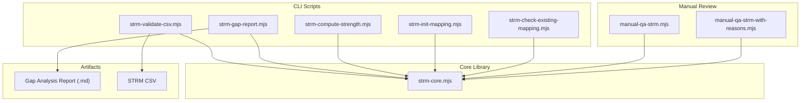
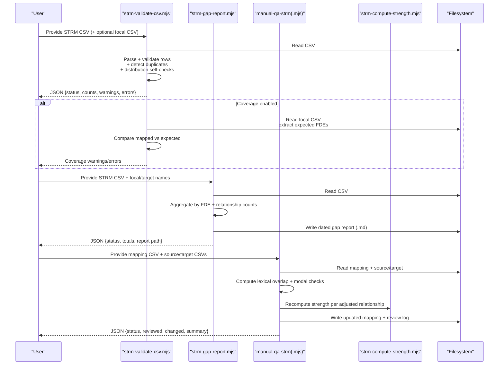
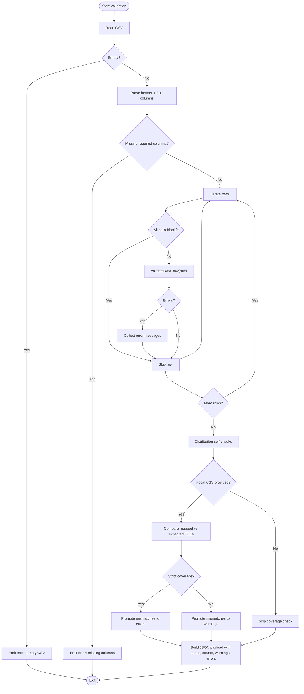
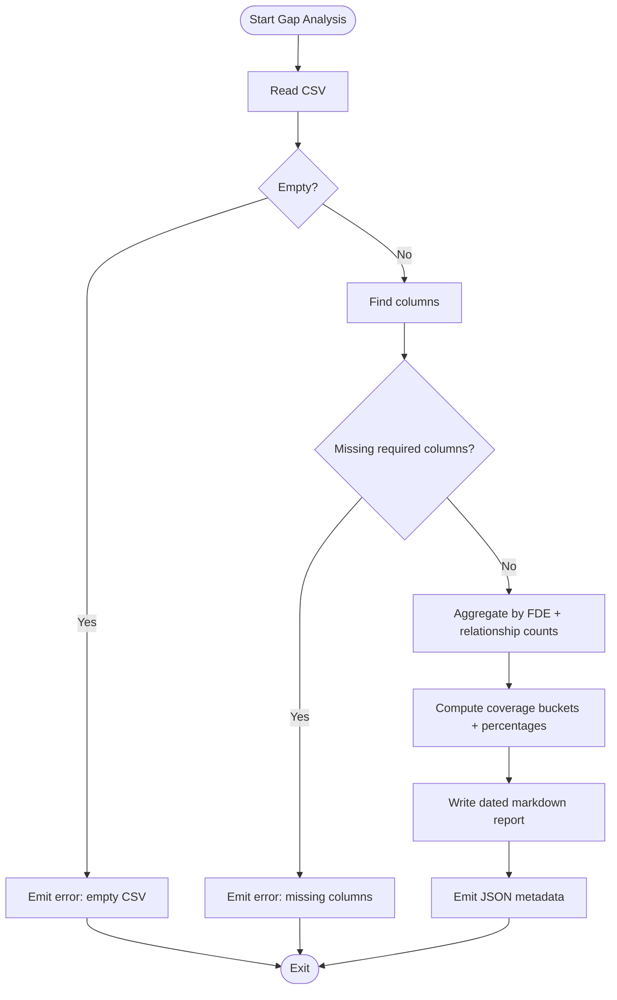
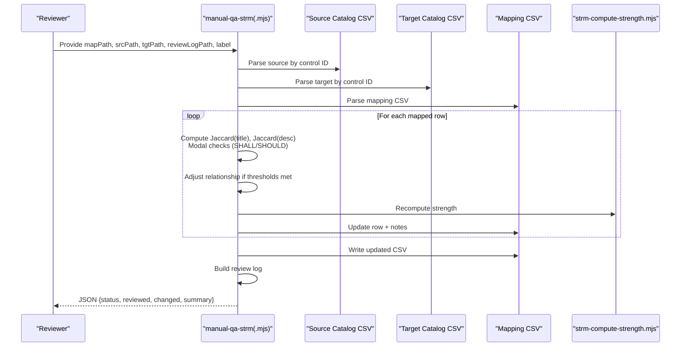
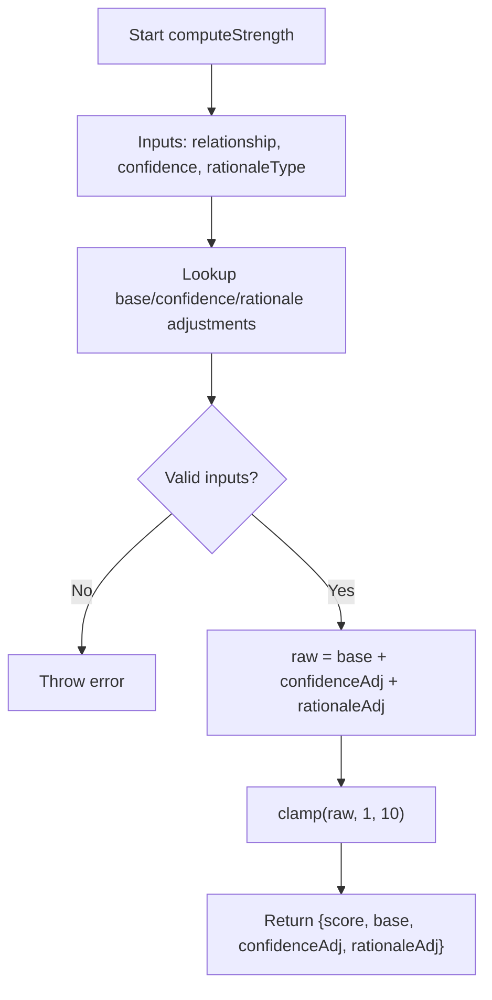
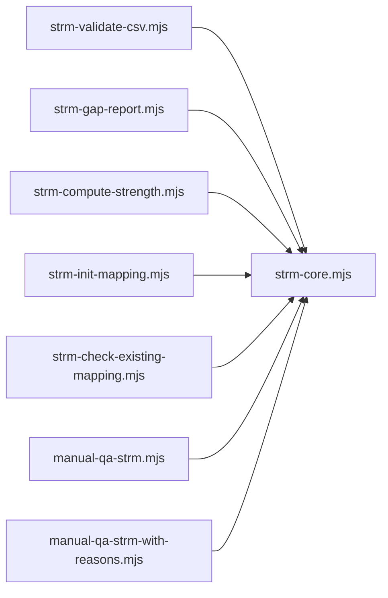

# Quality Assurance and Manual Review

<cite>
**Referenced Files in This Document**
- [README.md](file://README.md)
- [CONVENTIONS.md](file://CONVENTIONS.md)
- [scripts/lib/strm-core.mjs](file://scripts/lib/strm-core.mjs)
- [scripts/bin/strm-validate-csv.mjs](file://scripts/bin/strm-validate-csv.mjs)
- [scripts/bin/strm-gap-report.mjs](file://scripts/bin/strm-gap-report.mjs)
- [scripts/bin/strm-compute-strength.mjs](file://scripts/bin/strm-compute-strength.mjs)
- [scripts/bin/strm-init-mapping.mjs](file://scripts/bin/strm-init-mapping.mjs)
- [scripts/bin/strm-check-existing-mapping.mjs](file://scripts/bin/strm-check-existing-mapping.mjs)
- [working-directory/scratch/manual-qa-strm.mjs](file://working-directory/scratch/manual-qa-strm.mjs)
- [working-directory/scratch/manual-qa-strm-with-reasons.mjs](file://working-directory/scratch/manual-qa-strm-with-reasons.mjs)
- [working-directory/mapping-artifacts/2026-03-24_StateRAMP_Rev5_Moderate-to-NIST_800-82_r3_Moderate/STRM_Gap_Analysis_StateRAMP_Rev5_Moderate-to-NIST_800-82_r3_Moderate.md](file://working-directory/mapping-artifacts/2026-03-24_StateRAMP_Rev5_Moderate-to-NIST_800-82_r3_Moderate/STRM_Gap_Analysis_StateRAMP_Rev5_Moderate-to-NIST_800-82_r3_Moderate.md)
- [working-directory/mapping-artifacts/2026-03-24_StateRAMP_Rev5_Moderate-to-NIST_800-82_r3_Moderate/Set Theory Relationship Mapping (STRM)_ [(StateRAMP_Rev5_Moderate-to-StateRAMP_Rev5_Moderate)-to-NIST_800-82_r3_Moderate] - StateRAMP Rev5 Moderate to NIST 800-82 r3 Moderate.csv](file://working-directory/mapping-artifacts/2026-03-24_StateRAMP_Rev5_Moderate-to-NIST_800-82_r3_Moderate/Set Theory Relationship Mapping (STRM)_ [(StateRAMP_Rev5_Moderate-to-StateRAMP_Rev5_Moderate)-to-NIST_800-82_r3_Moderate] - StateRAMP Rev5 Moderate to NIST 800-82 r3 Moderate.csv)
- [knowledge/mappings.schema.json](file://knowledge/mappings.schema.json)
- [knowledge/catalog.schema.json](file://knowledge/catalog.schema.json)
</cite>

## Table of Contents
1. [Introduction](#introduction)
2. [Project Structure](#project-structure)
3. [Core Components](#core-components)
4. [Architecture Overview](#architecture-overview)
5. [Detailed Component Analysis](#detailed-component-analysis)
6. [Dependency Analysis](#dependency-analysis)
7. [Performance Considerations](#performance-considerations)
8. [Troubleshooting Guide](#troubleshooting-guide)
9. [Conclusion](#conclusion)
10. [Appendices](#appendices)

## Introduction
This document defines the Quality Assurance and Manual Review processes for STRM mapping projects. It explains the automated validation pipeline that checks CSV integrity, relationship consistency, and strength score calculations; documents the manual review workflow that enables human oversight and correction of automated mappings; details the gap analysis process that identifies missing relationships and coverage gaps between frameworks; and specifies quality metrics used to evaluate mapping completeness and accuracy. It also provides guidance on resolving validation errors, conducting peer reviews, maintaining mapping quality over time, and iterating improvements through feedback loops.

## Project Structure
The STRM toolkit organizes QA and review utilities around a small set of deterministic scripts and shared core logic:
- Core library: parsing CSV, validating rows, computing strength scores, and generating filenames/artifacts.
- Validation pipeline: CSV integrity, duplicate detection, coverage checks against a focal dataset, and distribution self-checks.
- Gap analysis: coverage summaries and relationship distributions across FDEs.
- Manual review: automated heuristics to adjust relationships based on lexical overlap and modal language, with optional detailed reasons.
- Artifacts: validated CSVs and gap reports placed under a dated directory structure.

**Diagram sources**
- [scripts/bin/strm-validate-csv.mjs:1-172](file://scripts/bin/strm-validate-csv.mjs#L1-L172)
- [scripts/bin/strm-gap-report.mjs:1-150](file://scripts/bin/strm-gap-report.mjs#L1-L150)
- [scripts/bin/strm-compute-strength.mjs:1-20](file://scripts/bin/strm-compute-strength.mjs#L1-L20)
- [scripts/bin/strm-init-mapping.mjs:1-58](file://scripts/bin/strm-init-mapping.mjs#L1-L58)
- [scripts/bin/strm-check-existing-mapping.mjs:1-20](file://scripts/bin/strm-check-existing-mapping.mjs#L1-L20)
- [scripts/lib/strm-core.mjs:1-367](file://scripts/lib/strm-core.mjs#L1-L367)
- [working-directory/scratch/manual-qa-strm.mjs:1-145](file://working-directory/scratch/manual-qa-strm.mjs#L1-L145)
- [working-directory/scratch/manual-qa-strm-with-reasons.mjs:1-120](file://working-directory/scratch/manual-qa-strm-with-reasons.mjs#L1-L120)

**Section sources**
- [README.md:1-85](file://README.md#L1-L85)
- [CONVENTIONS.md:1-207](file://CONVENTIONS.md#L1-L207)

## Core Components
- CSV validation: checks required columns, row-level constraints, duplicate pairs, and distribution self-checks; optionally compares mapped FDEs to a focal dataset for coverage.
- Gap analysis: summarizes coverage by FDE and relationship distribution; generates a dated markdown report.
- Strength computation: enforces the canonical formula for STRM strength scores.
- Manual review: adjusts relationships based on lexical overlap and modal language; updates strength accordingly and logs changes.
- Artifact management: initializes canonical CSV headers and filenames, resolves artifact directories, and lists existing mappings.

**Section sources**
- [scripts/lib/strm-core.mjs:1-367](file://scripts/lib/strm-core.mjs#L1-L367)
- [scripts/bin/strm-validate-csv.mjs:1-172](file://scripts/bin/strm-validate-csv.mjs#L1-L172)
- [scripts/bin/strm-gap-report.mjs:1-150](file://scripts/bin/strm-gap-report.mjs#L1-L150)
- [scripts/bin/strm-compute-strength.mjs:1-20](file://scripts/bin/strm-compute-strength.mjs#L1-L20)
- [scripts/bin/strm-init-mapping.mjs:1-58](file://scripts/bin/strm-init-mapping.mjs#L1-L58)
- [scripts/bin/strm-check-existing-mapping.mjs:1-20](file://scripts/bin/strm-check-existing-mapping.mjs#L1-L20)
- [working-directory/scratch/manual-qa-strm.mjs:1-145](file://working-directory/scratch/manual-qa-strm.mjs#L1-L145)
- [working-directory/scratch/manual-qa-strm-with-reasons.mjs:1-120](file://working-directory/scratch/manual-qa-strm-with-reasons.mjs#L1-L120)

## Architecture Overview
The QA pipeline is a deterministic, script-driven workflow that validates and evaluates mappings, followed by optional manual review and revalidation.

**Diagram sources**
- [scripts/bin/strm-validate-csv.mjs:1-172](file://scripts/bin/strm-validate-csv.mjs#L1-L172)
- [scripts/bin/strm-gap-report.mjs:1-150](file://scripts/bin/strm-gap-report.mjs#L1-L150)
- [working-directory/scratch/manual-qa-strm.mjs:1-145](file://working-directory/scratch/manual-qa-strm.mjs#L1-L145)
- [scripts/bin/strm-compute-strength.mjs:1-20](file://scripts/bin/strm-compute-strength.mjs#L1-L20)

## Detailed Component Analysis

### Automated CSV Validation Pipeline
The validation pipeline ensures:
- Required columns are present and properly named.
- Each row satisfies constraints for relationship, confidence, rationale type, and strength score.
- Strength score equals the canonical formula output.
- Duplicate FDE→Target pairs are flagged.
- Distribution self-checks highlight imbalances (e.g., too many equal rows or too few containment relationships).
- Optional coverage check compares mapped FDEs to a focal dataset; strict mode elevates mismatches to errors.

**Diagram sources**
- [scripts/bin/strm-validate-csv.mjs:1-172](file://scripts/bin/strm-validate-csv.mjs#L1-L172)
- [scripts/lib/strm-core.mjs:206-289](file://scripts/lib/strm-core.mjs#L206-L289)

**Section sources**
- [scripts/bin/strm-validate-csv.mjs:1-172](file://scripts/bin/strm-validate-csv.mjs#L1-L172)
- [scripts/lib/strm-core.mjs:206-289](file://scripts/lib/strm-core.mjs#L206-L289)

### Gap Analysis Workflow
The gap analysis summarizes:
- Coverage by FDE: full coverage (equal or subset_of), partial coverage (intersects_with), gaps (none of the above).
- Relationship distribution across mapped rows.
- Totals: mapped rows and distinct FDEs evaluated.
- Outputs a dated markdown report and JSON metadata.

**Diagram sources**
- [scripts/bin/strm-gap-report.mjs:1-150](file://scripts/bin/strm-gap-report.mjs#L1-L150)

**Section sources**
- [scripts/bin/strm-gap-report.mjs:1-150](file://scripts/bin/strm-gap-report.mjs#L1-L150)
- [working-directory/mapping-artifacts/2026-03-24_StateRAMP_Rev5_Moderate-to-NIST_800-82_r3_Moderate/STRM_Gap_Analysis_StateRAMP_Rev5_Moderate-to-NIST_800-82_r3_Moderate.md:1-26](file://working-directory/mapping-artifacts/2026-03-24_StateRamp_Rev5_Moderate-to-NIST_800-82_r3_Moderate/STRM_Gap_Analysis_StateRAMP_Rev5_Moderate-to-NIST_800-82_r3_Moderate.md#L1-L26)

### Manual Review Workflow
Two manual review scripts adjust relationships based on:
- Lexical overlap of titles and descriptions (Jaccard similarity).
- Modal language (SHALL vs SHOULD) alignment.
- Optional detailed reasons for changes.

The scripts:
- Parse source and target control catalogs by ID.
- Iterate mapped rows and compute similarity/modality signals.
- Adjust relationships (equal ↔ intersects_with; subset_of/superset_of promotions to equal).
- Recompute strength using the canonical formula.
- Update notes with reasons and write back the CSV and a review log.

**Diagram sources**
- [working-directory/scratch/manual-qa-strm.mjs:1-145](file://working-directory/scratch/manual-qa-strm.mjs#L1-L145)
- [working-directory/scratch/manual-qa-strm-with-reasons.mjs:1-120](file://working-directory/scratch/manual-qa-strm-with-reasons.mjs#L1-L120)
- [scripts/bin/strm-compute-strength.mjs:1-20](file://scripts/bin/strm-compute-strength.mjs#L1-L20)

**Section sources**
- [working-directory/scratch/manual-qa-strm.mjs:1-145](file://working-directory/scratch/manual-qa-strm.mjs#L1-L145)
- [working-directory/scratch/manual-qa-strm-with-reasons.mjs:1-120](file://working-directory/scratch/manual-qa-strm-with-reasons.mjs#L1-L120)
- [scripts/bin/strm-compute-strength.mjs:1-20](file://scripts/bin/strm-compute-strength.mjs#L1-L20)

### Strength Score Calculation
The canonical strength formula enforces consistency:
- Base scores per relationship.
- Confidence adjustments (high/medium/low).
- Rationale-type adjustments (semantic/functional/syntactic).
- Clamped to 1–10.

**Diagram sources**
- [scripts/lib/strm-core.mjs:35-57](file://scripts/lib/strm-core.mjs#L35-L57)

**Section sources**
- [scripts/lib/strm-core.mjs:35-57](file://scripts/lib/strm-core.mjs#L35-L57)

### Artifact Initialization and Discovery
- Initialize a new mapping with canonical header and filename.
- Resolve artifact directory by date and framework names.
- List existing mappings for a source→target pair to avoid duplication.

**Section sources**
- [scripts/bin/strm-init-mapping.mjs:1-58](file://scripts/bin/strm-init-mapping.mjs#L1-L58)
- [scripts/lib/strm-core.mjs:67-97](file://scripts/lib/strm-core.mjs#L67-L97)
- [scripts/lib/strm-core.mjs:291-297](file://scripts/lib/strm-core.mjs#L291-L297)
- [scripts/bin/strm-check-existing-mapping.mjs:1-20](file://scripts/bin/strm-check-existing-mapping.mjs#L1-L20)

## Dependency Analysis
The scripts depend on a shared core module that encapsulates:
- CSV parsing and serialization.
- Column indexing and normalization.
- Validation rules and strength computation.
- Filename and directory utilities.

**Diagram sources**
- [scripts/bin/strm-validate-csv.mjs:1-172](file://scripts/bin/strm-validate-csv.mjs#L1-L172)
- [scripts/bin/strm-gap-report.mjs:1-150](file://scripts/bin/strm-gap-report.mjs#L1-L150)
- [scripts/bin/strm-compute-strength.mjs:1-20](file://scripts/bin/strm-compute-strength.mjs#L1-L20)
- [scripts/bin/strm-init-mapping.mjs:1-58](file://scripts/bin/strm-init-mapping.mjs#L1-L58)
- [scripts/bin/strm-check-existing-mapping.mjs:1-20](file://scripts/bin/strm-check-existing-mapping.mjs#L1-L20)
- [working-directory/scratch/manual-qa-strm.mjs:1-145](file://working-directory/scratch/manual-qa-strm.mjs#L1-L145)
- [working-directory/scratch/manual-qa-strm-with-reasons.mjs:1-120](file://working-directory/scratch/manual-qa-strm-with-reasons.mjs#L1-L120)
- [scripts/lib/strm-core.mjs:1-367](file://scripts/lib/strm-core.mjs#L1-L367)

**Section sources**
- [scripts/lib/strm-core.mjs:1-367](file://scripts/lib/strm-core.mjs#L1-L367)

## Performance Considerations
- CSV parsing is linear in the number of characters; keep input files trimmed and avoid extraneous whitespace.
- Manual review computes pairwise similarities; for very large mappings, consider batching or sampling to reduce runtime.
- Use strict coverage mode only when necessary; otherwise rely on warnings to minimize CI failures.
- Store artifacts under the working directory to avoid scanning overhead in CI contexts.

[No sources needed since this section provides general guidance]

## Troubleshooting Guide
Common validation errors and resolutions:
- Missing required columns: ensure the header matches the canonical 12-column layout and replace placeholder target column names with actual target framework names.
- Invalid relationship/confidence/rationale type: correct values to allowed sets; see canonical definitions.
- Strength mismatch: recompute using the canonical formula; do not hardcode scores.
- Empty FDE or Target ID: fill IDs from the respective catalogs; do not invent IDs.
- not_related without notes: add contextual notes; otherwise use intersects_with or containment.
- Low confidence usage: reserve for significant inference; otherwise bump to medium/high.
- Syntactic rationale: uncommon; verify intent; prefer semantic or functional.
- Mixed modal language in equal rationale: reconfirm containment rather than equal.
- Lack of explicit shared objective in rationale: include a “Both…” statement.
- Containment rationale missing scope language: add explicit terms indicating narrow/broad or inclusion.

Resolving coverage gaps:
- Use the coverage check to identify unmapped focal FDEs; map missing rows or adjust scope.
- Rerun validation with strict coverage to fail on unmapped items.

Peer review checklist:
- Verify rationale completeness and adherence to the pattern.
- Confirm strength matches the formula.
- Ensure target IDs exist in the target catalog.
- Validate that target column names are updated to the actual target framework.

Iterative improvement:
- After manual review, rerun validation and gap analysis to measure deltas.
- Track change summaries and reasons to inform future mappings.
- Maintain dated artifacts for traceability.

**Section sources**
- [scripts/bin/strm-validate-csv.mjs:1-172](file://scripts/bin/strm-validate-csv.mjs#L1-L172)
- [scripts/lib/strm-core.mjs:206-289](file://scripts/lib/strm-core.mjs#L206-L289)
- [CONVENTIONS.md:185-207](file://CONVENTIONS.md#L185-L207)

## Conclusion
The STRM QA and Manual Review processes combine deterministic validation, gap analysis, and human-in-the-loop adjustments to ensure mapping accuracy and reliability. By enforcing canonical formulas, validating CSV integrity, and providing structured manual review tools, teams can maintain high-quality mappings over time and continuously improve coverage and consistency.

[No sources needed since this section summarizes without analyzing specific files]

## Appendices

### Quality Metrics and Evaluation Criteria
- CSV integrity: pass/fail status, error/warning counts, and distribution self-checks.
- Coverage: full/partial/gap counts by FDE and relationship totals.
- Strength consistency: enforced by canonical formula; mismatches indicate manual edits or recalculation needs.
- Manual review impact: change summaries and reasons to quantify improvements.

**Section sources**
- [scripts/bin/strm-validate-csv.mjs:155-172](file://scripts/bin/strm-validate-csv.mjs#L155-L172)
- [scripts/bin/strm-gap-report.mjs:104-149](file://scripts/bin/strm-gap-report.mjs#L104-L149)
- [working-directory/scratch/manual-qa-strm.mjs:120-145](file://working-directory/scratch/manual-qa-strm.mjs#L120-L145)

### Example Mapping Artifact
- Gap analysis report and mapping CSV demonstrate real-world evaluation and labeling.

**Section sources**
- [working-directory/mapping-artifacts/2026-03-24_StateRAMP_Rev5_Moderate-to-NIST_800-82_r3_Moderate/STRM_Gap_Analysis_StateRAMP_Rev5_Moderate-to-NIST_800-82_r3_Moderate.md:1-26](file://working-directory/mapping-artifacts/2026-03-24_StateRAMP_Rev5_Moderate-to-NIST_800-82_r3_Moderate/STRM_Gap_Analysis_StateRAMP_Rev5_Moderate-to-NIST_800-82_r3_Moderate.md#L1-L26)
- [working-directory/mapping-artifacts/2026-03-24_StateRAMP_Rev5_Moderate-to-NIST_800-82_r3_Moderate/Set Theory Relationship Mapping (STRM)_ [(StateRAMP_Rev5_Moderate-to-StateRAMP_Rev5_Moderate)-to-NIST_800-82_r3_Moderate] - StateRAMP Rev5 Moderate to NIST 800-82 r3 Moderate.csv](file://working-directory/mapping-artifacts/2026-03-24_StateRAMP_Rev5_Moderate-to-NIST_800-82_r3_Moderate/Set Theory Relationship Mapping (STRM)_ [(StateRAMP_Rev5_Moderate-to-StateRAMP_Rev5_Moderate)-to-NIST_800-82_r3_Moderate] - StateRAMP Rev5 Moderate to NIST 800-82 r3 Moderate.csv#L1-L124)

### Schema References
- Mappings dataset schema and catalog schema define canonical fields and enumerations for mappings and catalogs.

**Section sources**
- [knowledge/mappings.schema.json:1-117](file://knowledge/mappings.schema.json#L1-L117)
- [knowledge/catalog.schema.json:1-157](file://knowledge/catalog.schema.json#L1-L157)