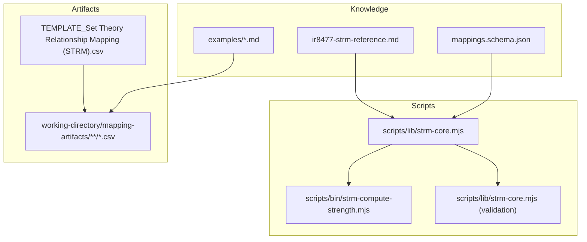
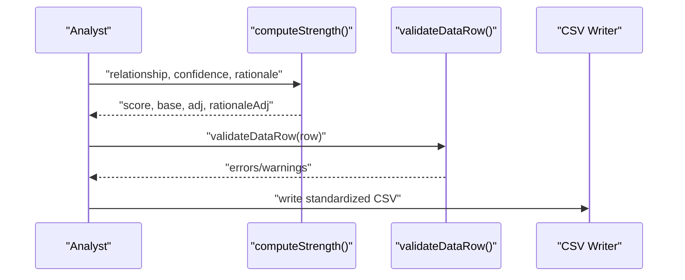
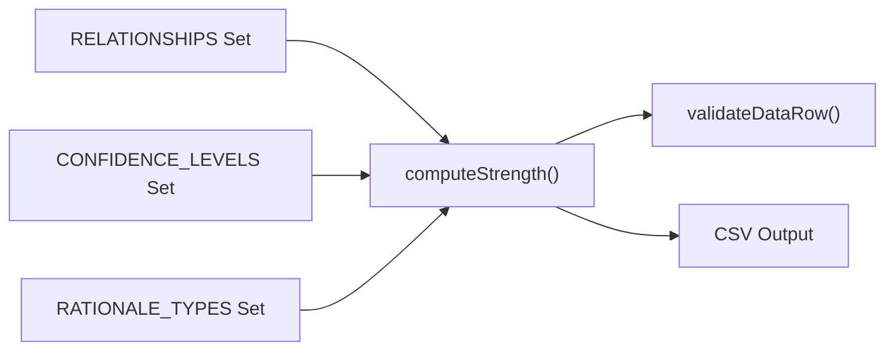

# STRM Relationship Types and Scoring

<cite>
**Referenced Files in This Document**
- [ir8477-strm-reference.md](file://knowledge/ir8477-strm-reference.md)
- [strm-core.mjs](file://scripts/lib/strm-core.mjs)
- [strm-compute-strength.mjs](file://scripts/bin/strm-compute-strength.mjs)
- [mappings.schema.json](file://knowledge/mappings.schema.json)
- [TEMPLATE_Set Theory Relationship Mapping (STRM).csv](file://TEMPLATE_Set Theory Relationship Mapping (STRM).csv)
- [example-control-to-control.md](file://examples/example-control-to-control.md)
- [example-framework-to-control.md](file://examples/example-framework-to-control.md)
- [GEMINI.md](file://GEMINI.md)
- [CONVENTIONS.md](file://CONVENTIONS.md)
- [2026-03-24_StateRAMP_Rev5_Moderate-to-NIST_800-82_r3_Moderate.csv](file://working-directory/mapping-artifacts/2026-03-24_StateRAMP_Rev5_Moderate-to-NIST_800-82_r3_Moderate/Set Theory Relationship Mapping (STRM)_ [(StateRAMP_Rev5_Moderate-to-StateRAMP_Rev5_Moderate)-to-NIST_800-82_r3_Moderate] - StateRAMP Rev5 Moderate to NIST 800-82 r3 Moderate.csv)
- [2026-03-24_GDPR-to-HIPAA.csv](file://working-directory/mapping-artifacts/mappings/gdpr/2026-03-24_GDPR-to-HIPAA/Set Theory Relationship Mapping (STRM)_ [(GDPR-to-GDPR)-to-HIPAA] - GDPR to HIPAA.csv)
- [2026-03-24_HIPAA-to-NYDFS.csv](file://working-directory/mapping-artifacts/mappings/hipaa/2026-03-24_HIPAA-to-NYDFS/Set Theory Relationship Mapping (STRM)_ [(HIPAA-to-HIPAA)-to-NYDFS] - HIPAA to NYDFS.csv)
</cite>

## Table of Contents
1. [Introduction](#introduction)
2. [Project Structure](#project-structure)
3. [Core Components](#core-components)
4. [Architecture Overview](#architecture-overview)
5. [Detailed Component Analysis](#detailed-component-analysis)
6. [Dependency Analysis](#dependency-analysis)
7. [Performance Considerations](#performance-considerations)
8. [Troubleshooting Guide](#troubleshooting-guide)
9. [Conclusion](#conclusion)

## Introduction
This document provides comprehensive guidance for STRM (Set-Theory Relationship Mapping) relationship types and scoring as defined by NIST IR 8477. It explains the five formal relationship categories, their mathematical semantics, and practical examples from cybersecurity frameworks. It details the STRM strength scoring system (1–10), including base scores, confidence adjustments, and rationale-type adjustments. It also covers transitivity rules, inverse relations, and provides concrete mapping scenarios to help practitioners apply STRM consistently and interpret strength scores for decision-making.

## Project Structure
The repository organizes STRM methodology and artifacts across several directories:
- knowledge: Methodology reference, schemas, and cross-framework mapping tables
- scripts: Core STRM computation and validation utilities
- examples: Worked examples of STRM mappings between frameworks
- working-directory: Real-world mapping artifacts and extracted datasets
- templates: CSV header templates for standardized mapping outputs

**Diagram sources**
- [ir8477-strm-reference.md:1-119](file://knowledge/ir8477-strm-reference.md#L1-L119)
- [strm-core.mjs:1-367](file://scripts/lib/strm-core.mjs#L1-L367)
- [strm-compute-strength.mjs:1-20](file://scripts/bin/strm-compute-strength.mjs#L1-L20)
- [mappings.schema.json:1-117](file://knowledge/mappings.schema.json#L1-L117)
- [TEMPLATE_Set Theory Relationship Mapping (STRM).csv](file://TEMPLATE_Set Theory Relationship Mapping (STRM).csv#L1-L2)

**Section sources**
- [ir8477-strm-reference.md:1-119](file://knowledge/ir8477-strm-reference.md#L1-L119)
- [strm-core.mjs:1-367](file://scripts/lib/strm-core.mjs#L1-L367)
- [strm-compute-strength.mjs:1-20](file://scripts/bin/strm-compute-strength.mjs#L1-L20)
- [mappings.schema.json:1-117](file://knowledge/mappings.schema.json#L1-L117)
- [TEMPLATE_Set Theory Relationship Mapping (STRM).csv](file://TEMPLATE_Set Theory Relationship Mapping (STRM).csv#L1-L2)

## Core Components
This section defines the five STRM relationship types, their mathematical semantics, and practical interpretations grounded in NIST IR 8477.

- Equal (A = B): Focal and reference elements express identical requirements. The sets are equal.
- Subset of (A ⊂ B): All requirements in A are contained within B; A is narrower than B.
- Superset of (A ⊃ B): All requirements in B are contained within A; A is broader than B.
- Intersects with (A ∩ B ≠ ∅): A and B partially overlap but neither contains the other.
- Not related (A ∩ B = ∅): No meaningful overlap between A and B.

These definitions support automated reasoning, transitivity derivation, and quantitative strength scoring.

**Section sources**
- [ir8477-strm-reference.md:16-25](file://knowledge/ir8477-strm-reference.md#L16-L25)

## Architecture Overview
The STRM scoring pipeline integrates methodology, computation, validation, and artifact generation:

**Diagram sources**
- [strm-core.mjs:35-57](file://scripts/lib/strm-core.mjs#L35-L57)
- [strm-core.mjs:206-289](file://scripts/lib/strm-core.mjs#L206-L289)
- [TEMPLATE_Set Theory Relationship Mapping (STRM).csv](file://TEMPLATE_Set Theory Relationship Mapping (STRM).csv#L1-L2)

## Detailed Component Analysis

### STRM Relationship Types and Mathematical Definitions
- Equal: Sets A and B are identical. Used when controls express the same requirement textually, semantically, or functionally.
- Subset of: A ⊂ B. A is narrower; B contains A plus additional requirements.
- Superset of: A ⊃ B. A is broader; A contains B plus additional requirements.
- Intersects with: A ∩ B ≠ ∅. Partial overlap exists; neither contains the other.
- Not related: A ∩ B = ∅. No meaningful overlap.

Practical examples from the repository:
- Equal: StateRAMP Rev5 Moderate AC-2 and NIST 800-82 r3 Moderate AC-2 both require "Define and document the types of accounts allowed and specifically prohibited for use within the system."
- Subset of: StateRAMP Rev5 Moderate AC-2(1) and AC-2(2) map to NIST 800-82 r3 Moderate AC-2(1) and AC-2(2) with rationale that the StateRAMP control is narrower and fits within the NIST control scope.
- Intersects with: StateRAMP Rev5 Moderate AC-2(3) and AC-2(5) partially overlap with NIST 800-82 r3 Moderate AC-2(3) and AC-2(5), with different implementation emphasis.
- Not related: SC-39 (process isolation) and CIS 10.5 (anti-exploitation features) are mapped as not_related due to different attack surfaces.

**Section sources**
- [ir8477-strm-reference.md:16-25](file://knowledge/ir8477-strm-reference.md#L16-L25)
- [2026-03-24_StateRAMP_Rev5_Moderate-to-NIST_800-82_r3_Moderate.csv](file://working-directory/mapping-artifacts/2026-03-24_StateRAMP_Rev5_Moderate-to-NIST_800-82_r3_Moderate/Set Theory Relationship Mapping (STRM)_ [(StateRAMP_Rev5_Moderate-to-StateRAMP_Rev5_Moderate)-to-NIST_800-82_r3_Moderate] - StateRAMP Rev5 Moderate to NIST 800-82 r3 Moderate.csv#L1-L124)
- [2026-03-24_GDPR-to-HIPAA.csv](file://working-directory/mapping-artifacts/mappings/gdpr/2026-03-24_GDPR-to-HIPAA/Set Theory Relationship Mapping (STRM)_ [(GDPR-to-GDPR)-to-HIPAA] - GDPR to HIPAA.csv#L1-L45)

### STRM Strength Scoring System (1–10)
The strength score quantifies mapping quality and is computed as:
- Base score by relationship type
- Confidence adjustment (+0 for high, −1 for medium, −2 for low)
- Rationale adjustment (+0 for semantic, +0 for functional, −1 for syntactic)
- Final score clamped to [1, 10]

Base scores:
- equal: 10
- subset_of/superset_of: 7
- intersects_with: 4
- not_related: 0

Interpretation:
- 8–10: Strong mapping
- 5–7: Moderate mapping
- 1–4: Weak mapping

Examples from repository:
- Equal mappings (high confidence, semantic rationale) yield score 10
- Subset_of and superset_of mappings (high confidence) yield score 7
- Intersects_with mappings (high confidence) yield score 4
- Not_related mapping with medium confidence and functional rationale yields score 1

**Section sources**
- [ir8477-strm-reference.md:44-56](file://knowledge/ir8477-strm-reference.md#L44-L56)
- [strm-core.mjs:15-33](file://scripts/lib/strm-core.mjs#L15-L33)
- [strm-core.mjs:35-57](file://scripts/lib/strm-core.mjs#L35-L57)
- [2026-03-24_StateRAMP_Rev5_Moderate-to-NIST_800-82_r3_Moderate.csv](file://working-directory/mapping-artifacts/2026-03-24_StateRAMP_Rev5_Moderate-to-NIST_800-82_r3_Moderate/Set Theory Relationship Mapping (STRM)_ [(StateRAMP_Rev5_Moderate-to-StateRAMP_Rev5_Moderate)-to-NIST_800-82_r3_Moderate] - StateRAMP Rev5 Moderate to NIST 800-82 r3 Moderate.csv#L1-L124)
- [2026-03-24_GDPR-to-HIPAA.csv](file://working-directory/mapping-artifacts/mappings/gdpr/2026-03-24_GDPR-to-HIPAA/Set Theory Relationship Mapping (STRM)_ [(GDPR-to-GDPR)-to-HIPAA] - GDPR to HIPAA.csv#L1-L45)

### Transitivity Rules
STRM supports deriving A-to-C relationships from A-to-B and B-to-C:
- equal + equal → equal
- equal + X → X
- X + equal → X
- subset_of + subset_of → subset_of
- superset_of + superset_of → superset_of
- not_related + anything → not_related
- anything + not_related → not_related
- intersects_with + anything → indeterminate (flag for manual review)

Transitivity enables automated mapping propagation across intermediate frameworks or controls.

**Section sources**
- [ir8477-strm-reference.md:58-73](file://knowledge/ir8477-strm-reference.md#L58-L73)
- [GEMINI.md:148-160](file://GEMINI.md#L148-L160)

### Inverse Relations
Every relationship has a well-defined inverse:
- equal → equal
- subset_of → superset_of
- superset_of → subset_of
- intersects_with → intersects_with
- not_related → not_related

Inverse relations are useful for reverse mapping (Target → Source) and cross-direction validation.

**Section sources**
- [ir8477-strm-reference.md:75-86](file://knowledge/ir8477-strm-reference.md#L75-L86)
- [GEMINI.md:163-172](file://GEMINI.md#L163-L172)

### Practical Mapping Scenarios
The repository includes real-world mapping artifacts demonstrating STRM application:

- Control-to-control mapping (ISO/IEC 27001:2022 → SOC 2 Trust Service Criteria):
  - equal: Access Control (A.5.15 ↔ CC6.1)
  - subset_of: Use of Cryptography (A.8.24 ⊂ CC6.7)
  - superset_of: Management of Technical Vulnerabilities (A.8.8 ⊃ CC7.1)
  - intersects_with: Logging (A.8.15 ∩ CC7.2), Business Continuity (A.5.30 ∩ A1.2)

- Framework-to-control mapping (NIST SP 800-53 Rev 5 → CIS Controls v8.1):
  - equal: Account Management (AC-2 ↔ CIS 5.2)
  - superset_of: Audit and Accountability (AU-6 ⊃ CIS 8.11)
  - subset_of: Configuration Management (CM-7 ⊂ CIS 4.1)
  - intersects_with: Incident Response (IR-4 ∩ CIS 17.4)
  - not_related: Process Isolation (SC-39 ⊥ CIS 10.5)

- Cross-framework mapping (GDPR → HIPAA):
  - subset_of: Various GDPR articles map as subset_of to HIPAA requirements
  - intersects_with: Some GDPR principles partially align with HIPAA access controls
  - not_related: Certain GDPR obligations (e.g., data subject rights) do not meaningfully overlap with specific HIPAA requirements

These examples illustrate how STRM captures nuanced relationships and supports evidence reuse across frameworks.

**Section sources**
- [example-control-to-control.md:1-162](file://examples/example-control-to-control.md#L1-L162)
- [example-framework-to-control.md:1-159](file://examples/example-framework-to-control.md#L1-L159)
- [2026-03-24_StateRAMP_Rev5_Moderate-to-NIST_800-82_r3_Moderate.csv](file://working-directory/mapping-artifacts/2026-03-24_StateRAMP_Rev5_Moderate-to-NIST_800-82_r3_Moderate/Set Theory Relationship Mapping (STRM)_ [(StateRAMP_Rev5_Moderate-to-StateRAMP_Rev5_Moderate)-to-NIST_800-82_r3_Moderate] - StateRAMP Rev5 Moderate to NIST 800-82 r3 Moderate.csv#L1-L124)
- [2026-03-24_GDPR-to-HIPAA.csv](file://working-directory/mapping-artifacts/mappings/gdpr/2026-03-24_GDPR-to-HIPAA/Set Theory Relationship Mapping (STRM)_ [(GDPR-to-GDPR)-to-HIPAA] - GDPR to HIPAA.csv#L1-L45)
- [2026-03-24_HIPAA-to-NYDFS.csv](file://working-directory/mapping-artifacts/mappings/hipaa/2026-03-24_HIPAA-to-NYDFS/Set Theory Relationship Mapping (STRM)_ [(HIPAA-to-HIPAA)-to-NYDFS] - HIPAA to NYDFS.csv#L1-L67)

### Data Model and Schema Alignment
The STRM methodology reference and JSON schema define the canonical set-theory relationships and scopes:
- Canonical STRM relations: equal, subset_of, superset_of, intersects_with, no_relationship
- Scope categories: framework_control_set, normalized_control_set, control_requirement_set, risk_scenario_set, implementation_evidence_set
- Legacy aliases preserved for compatibility

These definitions ensure consistent modeling across mapping datasets and tools.

**Section sources**
- [ir8477-strm-reference.md:16-25](file://knowledge/ir8477-strm-reference.md#L16-L25)
- [mappings.schema.json:5-45](file://knowledge/mappings.schema.json#L5-L45)

## Dependency Analysis
The STRM scoring and validation logic depends on:
- Relationship type enumeration and base scores
- Confidence levels and rationale types
- Validation rules for CSV rows and strength score consistency

**Diagram sources**
- [strm-core.mjs:4-13](file://scripts/lib/strm-core.mjs#L4-L13)
- [strm-core.mjs:15-33](file://scripts/lib/strm-core.mjs#L15-L33)
- [strm-core.mjs:35-57](file://scripts/lib/strm-core.mjs#L35-L57)
- [strm-core.mjs:206-289](file://scripts/lib/strm-core.mjs#L206-L289)

**Section sources**
- [strm-core.mjs:4-13](file://scripts/lib/strm-core.mjs#L4-L13)
- [strm-core.mjs:15-33](file://scripts/lib/strm-core.mjs#L15-L33)
- [strm-core.mjs:35-57](file://scripts/lib/strm-core.mjs#L35-L57)
- [strm-core.mjs:206-289](file://scripts/lib/strm-core.mjs#L206-L289)

## Performance Considerations
- Computation complexity: The scoring function is O(1) with constant-time lookups for base scores and adjustments.
- Validation overhead: CSV validation iterates rows and performs string checks and numeric parsing; performance scales linearly with row count.
- Recommendations:
  - Pre-validate inputs (relationship, confidence, rationale) before invoking computeStrength
  - Batch process CSV rows and cache computed strengths when generating artifacts
  - Use streaming parsers for very large CSVs to reduce memory footprint

[No sources needed since this section provides general guidance]

## Troubleshooting Guide
Common issues and resolutions:
- Invalid relationship, confidence, or rationale type:
  - Ensure values match the canonical sets and enums
- Strength mismatch:
  - Recompute using the scoring function and compare with the provided score
- Empty or missing rationale:
  - Provide a narrative rationale explaining the relationship
- not_related mappings:
  - Include notes to justify lack of overlap
- subset_of/superset_of mappings:
  - Add notes explaining containment direction and scope differences
- Syntactic rationale:
  - Prefer semantic or functional rationales; syntactic is uncommon and should be verified

Validation rules and error messages are enforced by the core validation routine.

**Section sources**
- [strm-core.mjs:206-289](file://scripts/lib/strm-core.mjs#L206-L289)
- [GEMINI.md:175-185](file://GEMINI.md#L175-L185)

## Conclusion
NIST IR 8477 defines a rigorous, mathematically grounded approach to STRM that enables precise, automated reasoning and quantitative scoring. By adhering to the five relationship types, applying confidence and rationale adjustments, leveraging transitivity and inverse relations, and following the repository’s validation and example patterns, practitioners can produce high-quality, interoperable mappings across diverse cybersecurity frameworks. The included artifacts and tools provide concrete guidance for applying STRM in real-world scenarios and interpreting strength scores to drive mapping decisions.