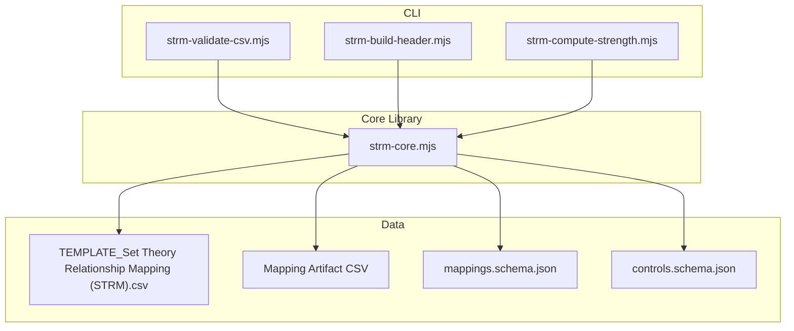
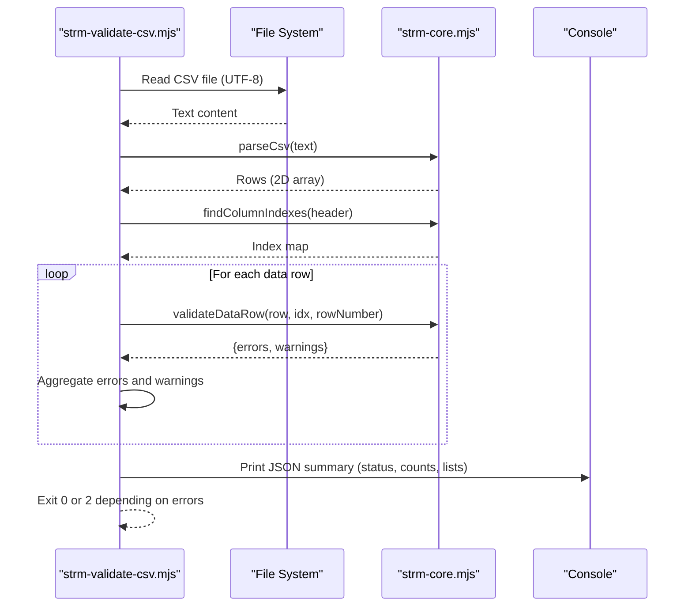
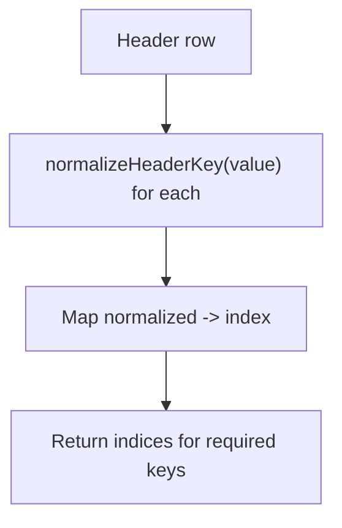
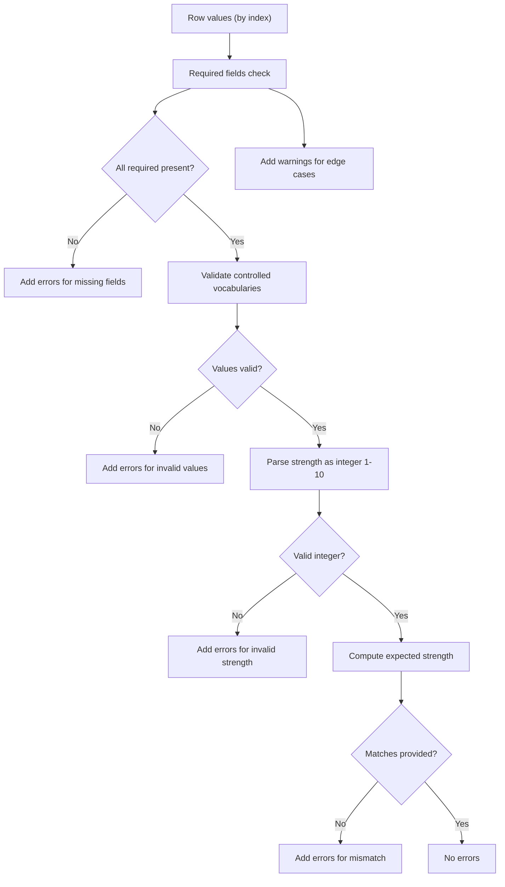
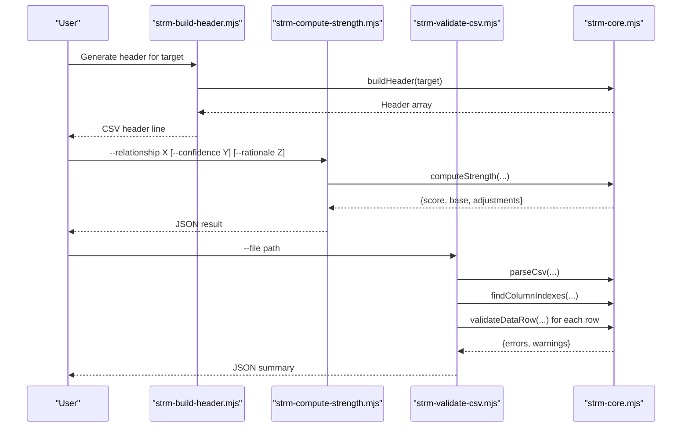
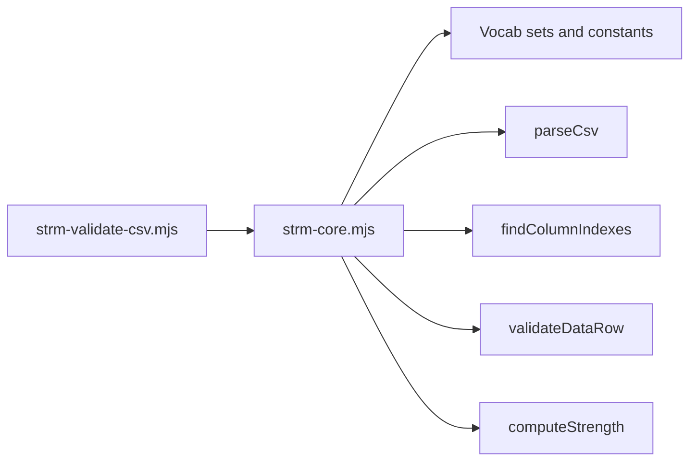

# CSV Processing and Validation

<cite>
**Referenced Files in This Document**
- [strm-validate-csv.mjs](file://scripts/bin/strm-validate-csv.mjs)
- [strm-core.mjs](file://scripts/lib/strm-core.mjs)
- [TEMPLATE_Set Theory Relationship Mapping (STRM).csv](file://TEMPLATE_Set Theory Relationship Mapping (STRM).csv)
- [Set Theory Relationship Mapping (STRM)_ [(StateRAMP_Rev5_Moderate-to-StateRAMP_Rev5_Moderate)-to-NIST_800-82_r3_Moderate] - StateRAMP Rev5 Moderate to NIST 800-82 r3 Moderate.csv](file://working-directory/mapping-artifacts/2026-03-24_StateRAMP_Rev5_Moderate-to-NIST_800-82_r3_Moderate/Set Theory Relationship Mapping (STRM)_ [(StateRAMP_Rev5_Moderate-to-StateRAMP_Rev5_Moderate)-to-NIST_800-82_r3_Moderate] - StateRAMP Rev5 Moderate to NIST 800-82 r3 Moderate.csv)
- [mappings.schema.json](file://knowledge/mappings.schema.json)
- [controls.schema.json](file://knowledge/controls.schema.json)
- [strm-build-header.mjs](file://scripts/bin/strm-build-header.mjs)
- [strm-compute-strength.mjs](file://scripts/bin/strm-compute-strength.mjs)
- [README.md](file://scripts/README.md)
</cite>

## Table of Contents
1. [Introduction](#introduction)
2. [Project Structure](#project-structure)
3. [Core Components](#core-components)
4. [Architecture Overview](#architecture-overview)
5. [Detailed Component Analysis](#detailed-component-analysis)
6. [Dependency Analysis](#dependency-analysis)
7. [Performance Considerations](#performance-considerations)
8. [Troubleshooting Guide](#troubleshooting-guide)
9. [Conclusion](#conclusion)
10. [Appendices](#appendices)

## Introduction
This document explains the CSV processing and validation systems used by the STRM Mapping project. It focuses on the custom CSV parser, quoting and escaping rules, header normalization and column indexing, and the STRM CSV schema validation pipeline. It also documents automated validation rules, error and warning detection, and practical guidance for handling large CSV files and encoding issues.

## Project Structure
The CSV processing and validation system centers around a small set of Node.js modules and scripts:
- A command-line validator that reads a CSV file, parses it, validates headers and rows, and reports structured results.
- A core module implementing the CSV parser, header normalization, column indexing, and row validation logic.
- Example CSV templates and real mapping artifacts to demonstrate valid and invalid structures.
- JSON Schema definitions for higher-level datasets (mappings and controls) that complement the STRM CSV validation.



**Diagram sources**
- [strm-validate-csv.mjs:1-77](file://scripts/bin/strm-validate-csv.mjs#L1-L77)
- [strm-core.mjs:1-343](file://scripts/lib/strm-core.mjs#L1-L343)
- [TEMPLATE_Set Theory Relationship Mapping (STRM).csv](file://TEMPLATE_Set Theory Relationship Mapping (STRM).csv#L1-L2)
- [Set Theory Relationship Mapping (STRM)_ [(StateRAMP_Rev5_Moderate-to-StateRAMP_Rev5_Moderate)-to-NIST_800-82_r3_Moderate] - StateRAMP Rev5 Moderate to NIST 800-82 r3 Moderate.csv](file://working-directory/mapping-artifacts/2026-03-24_StateRAMP_Rev5_Moderate-to-NIST_800-82_r3_Moderate/Set Theory Relationship Mapping (STRM)_ [(StateRAMP_Rev5_Moderate-to-StateRAMP_Rev5_Moderate)-to-NIST_800-82_r3_Moderate] - StateRAMP Rev5 Moderate to NIST 800-82 r3 Moderate.csv#L1-L124)
- [mappings.schema.json:1-117](file://knowledge/mappings.schema.json#L1-L117)
- [controls.schema.json:1-141](file://knowledge/controls.schema.json#L1-L141)

**Section sources**
- [README.md:1-31](file://scripts/README.md#L1-L31)

## Core Components
- Custom CSV Parser: Reads raw text and splits into rows and cells, honoring quoted fields and escaped quotes.
- Header Normalization and Column Indexing: Normalizes header names and maps required columns to indices.
- Row Validation: Enforces required fields, acceptable values, and formula-driven strength consistency.
- CSV Serialization: Escapes and quotes values when writing CSV.

Key responsibilities:
- parseCsv(text): Tokenizes text into rows respecting quotes, commas, and newlines.
- normalizeHeaderKey(value): Standardizes header labels for robust matching.
- findColumnIndexes(headerRow): Returns indices for required STRM columns.
- validateDataRow(row, indexes, rowNumber): Validates each data row and produces errors/warnings.
- toCsv(rows): Serializes arrays to CSV with proper escaping.

**Section sources**
- [strm-core.mjs:99-180](file://scripts/lib/strm-core.mjs#L99-L180)
- [strm-core.mjs:182-204](file://scripts/lib/strm-core.mjs#L182-L204)
- [strm-core.mjs:206-265](file://scripts/lib/strm-core.mjs#L206-L265)

## Architecture Overview
The validator orchestrates file reading, parsing, header validation, and per-row validation. It aggregates errors and warnings and exits with a non-zero status when errors are present.



**Diagram sources**
- [strm-validate-csv.mjs:1-77](file://scripts/bin/strm-validate-csv.mjs#L1-L77)
- [strm-core.mjs:99-180](file://scripts/lib/strm-core.mjs#L99-L180)
- [strm-core.mjs:182-204](file://scripts/lib/strm-core.mjs#L182-L204)
- [strm-core.mjs:206-265](file://scripts/lib/strm-core.mjs#L206-L265)

## Detailed Component Analysis

### CSV Parser: Quote Handling, Escape Sequences, Delimiter Parsing
The parser processes characters sequentially, tracking quote state and building cells and rows:
- Commas delimit cells.
- Newline terminates a row.
- Carriage return is ignored to handle Windows-style line endings.
- Double quotes toggle quoted mode; adjacent double quotes inside a quoted field are treated as an escaped quote.
- Characters outside quotes are appended to the current cell.

```mermaid
flowchart TD
Start(["parseCsv(text)"]) --> Init["Initialize row, cell, i, inQuotes=false"]
Init --> Loop{"More characters?"}
Loop --> |No| Flush["Push final cell and row if needed"] --> Return["Return rows"]
Loop --> |Yes| Read["Read next character"]
Read --> InQuotes{"inQuotes?"}
InQuotes --> |Yes| QuoteBranch["Quote handling"]
InQuotes --> |No| NoQuoteBranch["Delimiter and control handling"]
QuoteBranch --> Q1{"Is '\"'?"}
Q1 --> |Yes| Q2{"Next char is '\"'?"}
Q2 --> |Yes| AppendEscaped["Append single '\"' and advance by 2"] --> Loop
Q2 --> |No| ExitQuote["Set inQuotes=false"] --> Loop
Q1 --> |No| AppendQ["Append character"] --> Loop
NoQuoteBranch --> D1{"Is ','?"}
D1 --> |Yes| PushCell["row.push(cell); cell=''; i++"] --> Loop
D1 --> |No| D2{"Is '\\n'?"}
D2 --> |Yes| PushRow["row.push(cell); rows.push(row); row=[]; cell=''; i++"] --> Loop
D2 --> |No| D3{"Is '\\r'?"}
D3 --> |Yes| SkipCR["i++"] --> Loop
D3 --> |No| AppendChar["cell += ch; i++"] --> Loop
```

**Diagram sources**
- [strm-core.mjs:99-162](file://scripts/lib/strm-core.mjs#L99-L162)

**Section sources**
- [strm-core.mjs:99-162](file://scripts/lib/strm-core.mjs#L99-L162)

### Header Normalization and Column Indexing
Headers are normalized to lowercase and spaces standardized before lookup. The indexer maps required STRM column names to their positions, returning undefined for missing columns.

Behavior highlights:
- normalizeHeaderKey trims and normalizes whitespace.
- findColumnIndexes builds a map keyed by normalized header and returns indices for required columns.



**Diagram sources**
- [strm-core.mjs:182-204](file://scripts/lib/strm-core.mjs#L182-L204)

**Section sources**
- [strm-core.mjs:182-204](file://scripts/lib/strm-core.mjs#L182-L204)

### STRM CSV Schema Validation
The validator enforces:
- Required columns: presence checked against normalized header keys.
- Required fields per row: FDE#, Target ID #, and STRM Rationale must not be empty.
- Controlled vocabularies: STRM Relationship, Confidence Levels, and NIST IR-8477 Rational must belong to predefined sets.
- Numeric constraints: Strength of Relationship must be an integer between 1 and 10.
- Formula consistency: When valid, the provided strength must match the computed score derived from relationship, confidence, and rationale type.
- Warnings: Guidance for edge cases such as not_related without notes, syntactic rationale, and low confidence usage.



**Diagram sources**
- [strm-core.mjs:206-265](file://scripts/lib/strm-core.mjs#L206-L265)

**Section sources**
- [strm-core.mjs:206-265](file://scripts/lib/strm-core.mjs#L206-L265)

### Command-Line Integration
- strm-validate-csv.mjs: Reads a CSV file, parses it, validates headers and rows, and prints a JSON summary with counts and lists of errors and warnings.
- strm-build-header.mjs: Generates a properly formatted header row for new STRM CSV files.
- strm-compute-strength.mjs: Computes the expected strength score given relationship, confidence, and rationale type.



**Diagram sources**
- [strm-build-header.mjs:1-12](file://scripts/bin/strm-build-header.mjs#L1-L12)
- [strm-compute-strength.mjs:1-20](file://scripts/bin/strm-compute-strength.mjs#L1-L20)
- [strm-validate-csv.mjs:1-77](file://scripts/bin/strm-validate-csv.mjs#L1-L77)
- [strm-core.mjs:35-57](file://scripts/lib/strm-core.mjs#L35-L57)

**Section sources**
- [strm-build-header.mjs:1-12](file://scripts/bin/strm-build-header.mjs#L1-L12)
- [strm-compute-strength.mjs:1-20](file://scripts/bin/strm-compute-strength.mjs#L1-L20)
- [strm-validate-csv.mjs:1-77](file://scripts/bin/strm-validate-csv.mjs#L1-L77)

### Example CSV Structures and Expected Outcomes
- Template CSV: Provides the canonical header row for STRM mappings. See [TEMPLATE_Set Theory Relationship Mapping (STRM).csv](file://TEMPLATE_Set Theory Relationship Mapping (STRM).csv#L1-L2).
- Real mapping artifact: Demonstrates filled rows with relationships, strengths, and rationale. See [Set Theory Relationship Mapping (STRM)_ [(StateRAMP_Rev5_Moderate-to-StateRAMP_Rev5_Moderate)-to-NIST_800-82_r3_Moderate] - StateRAMP Rev5 Moderate to NIST 800-82 r3 Moderate.csv](file://working-directory/mapping-artifacts/2026-03-24_StateRAMP_Rev5_Moderate-to-NIST_800-82_r3_Moderate/Set Theory Relationship Mapping (STRM)_ [(StateRAMP_Rev5_Moderate-to-StateRAMP_Rev5_Moderate)-to-NIST_800-82_r3_Moderate] - StateRAMP Rev5 Moderate to NIST 800-82 r3 Moderate.csv#L1-L124).

Examples of invalid structures and corresponding outcomes:
- Empty CSV: Validator reports “CSV is empty.” and exits with error status. See [strm-validate-csv.mjs:25-28](file://scripts/bin/strm-validate-csv.mjs#L25-L28).
- Missing required columns: Validator reports “Missing required columns” and exits with error status. See [strm-validate-csv.mjs:36-44](file://scripts/bin/strm-validate-csv.mjs#L36-L44).
- Row with empty required fields: Errors include “FDE# is empty”, “Target ID # is empty”, or “STRM Rationale is empty”. See [strm-core.mjs:221-223](file://scripts/lib/strm-core.mjs#L221-L223).
- Invalid vocabulary values: Errors include “Invalid STRM Relationship …”, “Invalid Confidence Levels …”, or “Invalid NIST IR-8477 Rational …”. See [strm-core.mjs:225-233](file://scripts/lib/strm-core.mjs#L225-L233).
- Strength not an integer or out of range: Errors include “Strength of Relationship is not an integer.” or “Strength of Relationship must be 1-10.” See [strm-core.mjs:236-240](file://scripts/lib/strm-core.mjs#L236-L240).
- Strength mismatch: Errors include “Strength mismatch …” when provided score does not match computed score. See [strm-core.mjs:248-251](file://scripts/lib/strm-core.mjs#L248-L251).
- Warnings: Guidance for “not_related should include Notes context,” “syntactic rationale is uncommon,” and “low confidence should be used only when significant inference is required.” See [strm-core.mjs:254-262](file://scripts/lib/strm-core.mjs#L254-L262).

**Section sources**
- [strm-validate-csv.mjs:25-44](file://scripts/bin/strm-validate-csv.mjs#L25-L44)
- [strm-core.mjs:221-262](file://scripts/lib/strm-core.mjs#L221-L262)
- [TEMPLATE_Set Theory Relationship Mapping (STRM).csv](file://TEMPLATE_Set Theory Relationship Mapping (STRM).csv#L1-L2)
- [Set Theory Relationship Mapping (STRM)_ [(StateRAMP_Rev5_Moderate-to-StateRAMP_Rev5_Moderate)-to-NIST_800-82_r3_Moderate] - StateRAMP Rev5 Moderate to NIST 800-82 r3 Moderate.csv](file://working-directory/mapping-artifacts/2026-03-24_StateRAMP_Rev5_Moderate-to-NIST_800-82_r3_Moderate/Set Theory Relationship Mapping (STRM)_ [(StateRAMP_Rev5_Moderate-to-StateRAMP_Rev5_Moderate)-to-NIST_800-82_r3_Moderate] - StateRAMP Rev5 Moderate to NIST 800-82 r3 Moderate.csv#L1-L124)

## Dependency Analysis
The validator depends on the core module for parsing, indexing, and validation. The core module defines constants for controlled vocabularies and the strength computation function.



**Diagram sources**
- [strm-validate-csv.mjs:1-77](file://scripts/bin/strm-validate-csv.mjs#L1-L77)
- [strm-core.mjs:1-57](file://scripts/lib/strm-core.mjs#L1-L57)

**Section sources**
- [strm-validate-csv.mjs:1-77](file://scripts/bin/strm-validate-csv.mjs#L1-L77)
- [strm-core.mjs:1-57](file://scripts/lib/strm-core.mjs#L1-L57)

## Performance Considerations
- Memory usage: The parser constructs a full 2D array of rows and cells. For very large CSV files, this can consume significant memory proportional to the number of cells. Consider streaming approaches if memory becomes a constraint.
- I/O: Reading entire files into memory is efficient for moderate sizes but may need buffering or chunked processing for extremely large files.
- Validation overhead: The validator iterates rows once and performs constant-time checks per row. Complexity is O(R) for R rows plus O(C) for header normalization where C is the number of columns.
- Recommendations:
  - Prefer UTF-8 encoding to avoid transcoding overhead.
  - For massive files, consider splitting the CSV into smaller chunks and validating incrementally.
  - Use the header normalization and column indexing to avoid repeated string comparisons in downstream steps.

[No sources needed since this section provides general guidance]

## Troubleshooting Guide
Common issues and resolutions:
- Encoding problems:
  - Symptom: Garbled characters or unexpected bytes.
  - Resolution: Ensure the CSV is saved and read as UTF-8. The validator reads files as UTF-8.
- Empty or malformed CSV:
  - Symptom: “CSV is empty.”
  - Resolution: Verify the file is not blank and contains a header row.
- Missing required columns:
  - Symptom: “Missing required columns …”
  - Resolution: Confirm the header row includes all required STRM columns (e.g., STRM Relationship, Confidence Levels, NIST IR-8477 Rational, STRM Rationale, Strength of Relationship, FDE#, Target ID #, Notes).
- Blank rows:
  - Behavior: Blank rows are skipped during validation.
  - Resolution: Remove extraneous blank lines or ensure only meaningful rows are included.
- Invalid vocabulary values:
  - Symptom: Errors indicating invalid relationship/confidence/rationale.
  - Resolution: Use only accepted values: relationship must be one of equal, subset_of, superset_of, intersects_with, not_related; confidence must be high, medium, or low; rationale must be semantic, functional, or syntactic.
- Strength errors:
  - Symptom: “Strength of Relationship is not an integer.” or “must be 1-10.”
  - Resolution: Enter a whole number between 1 and 10.
  - Symptom: “Strength mismatch …”
  - Resolution: Adjust strength to match the computed score for the given relationship, confidence, and rationale type.
- Warnings:
  - not_related without notes: Add contextual notes.
  - Syntactic rationale: Verify intent; prefer semantic or functional when appropriate.
  - Low confidence: Use only when significant inference is required.

**Section sources**
- [strm-validate-csv.mjs:25-44](file://scripts/bin/strm-validate-csv.mjs#L25-L44)
- [strm-core.mjs:225-262](file://scripts/lib/strm-core.mjs#L225-L262)

## Conclusion
The STRM CSV processing and validation system provides a robust, deterministic pipeline for ensuring data quality in STRM mapping artifacts. Its custom CSV parser handles quoting and escaping correctly, header normalization enables flexible column matching, and the row validation enforces required fields, controlled vocabularies, numeric bounds, and formula consistency. Together with the provided CLI tools and example CSVs, it supports reliable, repeatable validation of STRM datasets.

[No sources needed since this section summarizes without analyzing specific files]

## Appendices

### STRM CSV Columns and Validation Rules
- Required columns (normalized header keys):
  - STRM Relationship
  - Confidence Levels
  - NIST IR-8477 Rational
  - STRM Rationale
  - Strength of Relationship
  - FDE#
  - Target ID #
  - Notes
- Controlled vocabularies:
  - Relationship: equal, subset_of, superset_of, intersects_with, not_related
  - Confidence: high, medium, low
  - Rationale: semantic, functional, syntactic
- Numeric constraints:
  - Strength of Relationship: integer in [1, 10]
- Formula consistency:
  - Strength must match computeStrength(relationship, confidence, rationale).score

**Section sources**
- [strm-core.mjs:4-13](file://scripts/lib/strm-core.mjs#L4-L13)
- [strm-core.mjs:15-57](file://scripts/lib/strm-core.mjs#L15-L57)
- [strm-core.mjs:186-204](file://scripts/lib/strm-core.mjs#L186-L204)
- [strm-core.mjs:206-265](file://scripts/lib/strm-core.mjs#L206-L265)

### JSON Schemas for Higher-Level Datasets
While the CSV validator focuses on STRM CSV artifacts, the repository includes JSON Schemas for mappings and controls that define broader dataset structures and constraints. These schemas are useful for cross-validation and understanding the ecosystem context.

- Mappings Dataset Schema: Defines required fields and structure for mappings, including optional set-theory relationships aligned with NIST IR 8477.
- Controls Dataset Schema: Defines controls and optional set-theory relationships, including framework references and normalized control IDs.

**Section sources**
- [mappings.schema.json:1-117](file://knowledge/mappings.schema.json#L1-L117)
- [controls.schema.json:1-141](file://knowledge/controls.schema.json#L1-L141)