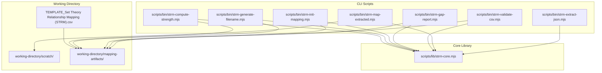
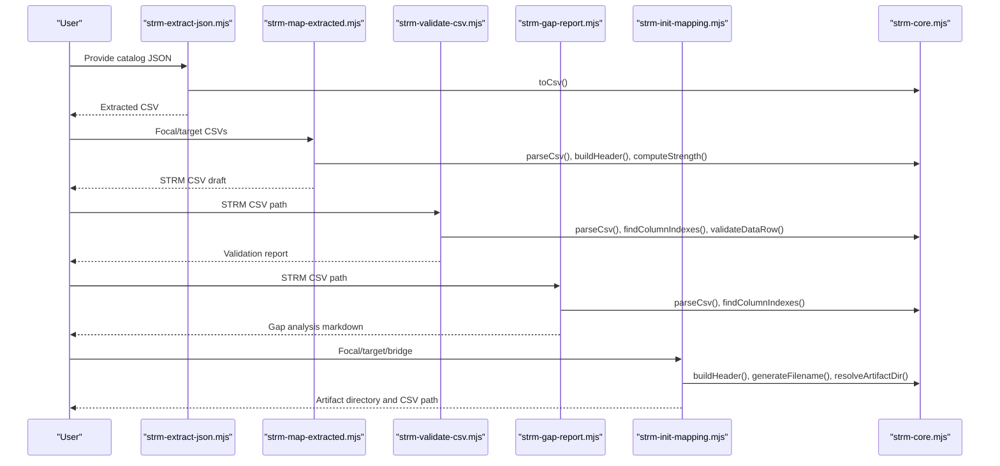
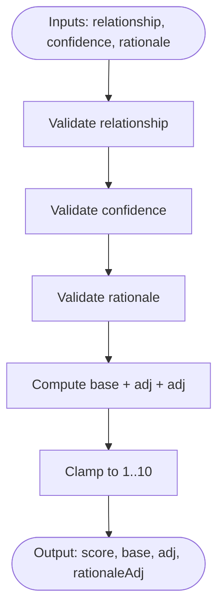
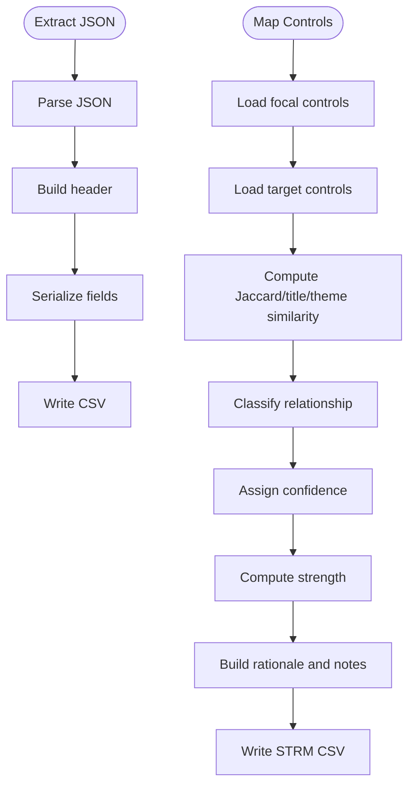
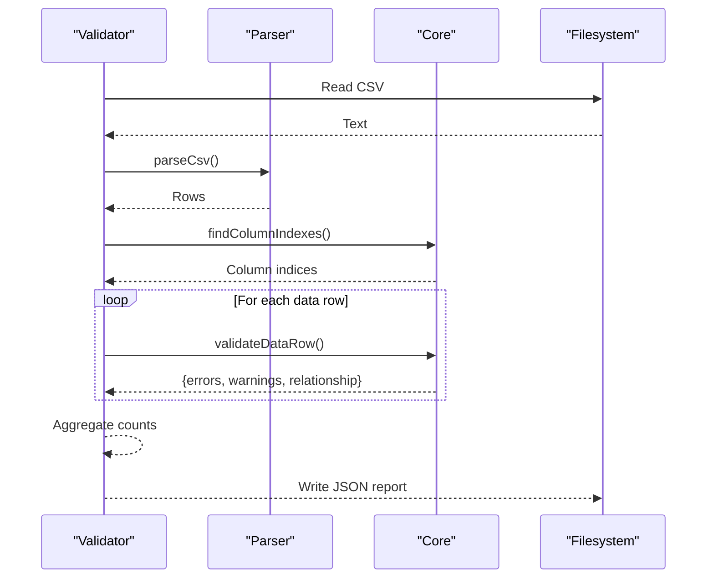
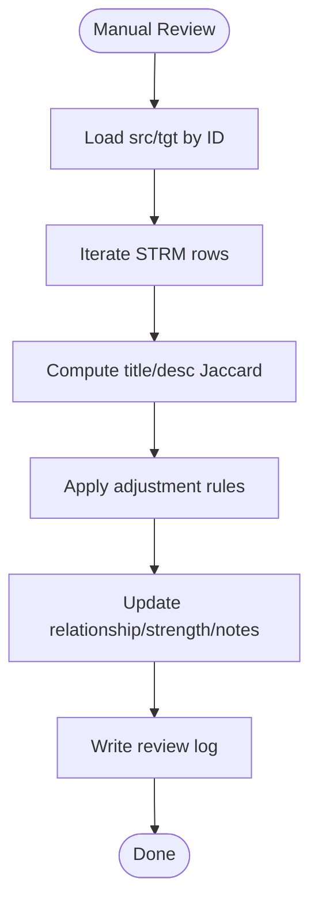
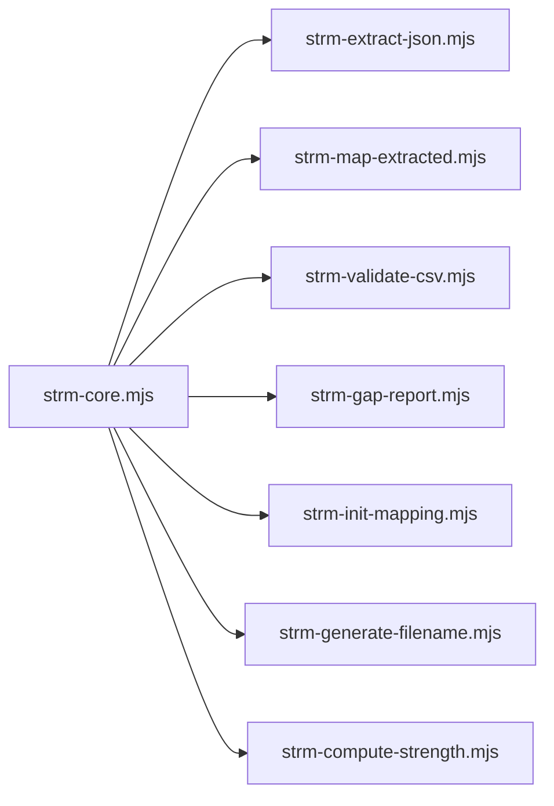

# Core Processing Engine and Algorithms

<cite>
**Referenced Files in This Document**
- [strm-core.mjs](file://scripts/lib/strm-core.mjs)
- [strm-compute-strength.mjs](file://scripts/bin/strm-compute-strength.mjs)
- [strm-validate-csv.mjs](file://scripts/bin/strm-validate-csv.mjs)
- [strm-map-extracted.mjs](file://scripts/bin/strm-map-extracted.mjs)
- [strm-init-mapping.mjs](file://scripts/bin/strm-init-mapping.mjs)
- [strm-extract-json.mjs](file://scripts/bin/strm-extract-json.mjs)
- [strm-generate-filename.mjs](file://scripts/bin/strm-generate-filename.mjs)
- [strm-gap-report.mjs](file://scripts/bin/strm-gap-report.mjs)
- [manual-qa-strm.mjs](file://working-directory/scratch/manual-qa-strm.mjs)
- [README.md](file://scripts/README.md)
- [TEMPLATE_Set Theory Relationship Mapping (STRM).csv](file://TEMPLATE_Set Theory Relationship Mapping (STRM).csv)
- [Set Theory Relationship Mapping (STRM).csv](file://working-directory/mapping-artifacts/2026-03-24_StateRAMP_Rev5_Moderate-to-NIST_800-82_r3_Moderate/Set Theory Relationship Mapping (STRM)_ [(StateRAMP_Rev5_Moderate-to-StateRAMP_Rev5_Moderate)-to-NIST_800-82_r3_Moderate] - StateRAMP Rev5 Moderate to NIST 800-82 r3 Moderate.csv)
</cite>

## Table of Contents
1. [Introduction](#introduction)
2. [Project Structure](#project-structure)
3. [Core Components](#core-components)
4. [Architecture Overview](#architecture-overview)
5. [Detailed Component Analysis](#detailed-component-analysis)
6. [Dependency Analysis](#dependency-analysis)
7. [Performance Considerations](#performance-considerations)
8. [Troubleshooting Guide](#troubleshooting-guide)
9. [Conclusion](#conclusion)
10. [Appendices](#appendices)

## Introduction
This document describes the Core Processing Engine and Algorithms that power the STRM toolkit. It explains the mathematical foundations for set-theory relationships, strength scoring, and validation workflows; documents the core processing functions, data transformation pipelines, and quality assurance mechanisms; and details CSV processing utilities, file system operations, and automated validation. It also covers relationship calculation algorithms, confidence assessment, manual review integration, performance characteristics, scalability limitations, error handling, logging, and debugging strategies.

## Project Structure
The STRM toolkit organizes its computational foundation around a small set of deterministic Node.js scripts and a shared core module. The scripts provide command-line entry points for extraction, mapping, validation, gap reporting, initialization, and filename generation. The core module encapsulates constants, scoring, parsing, validation, and filesystem helpers.

**Diagram sources**
- [strm-core.mjs](file://scripts/lib/strm-core.mjs)
- [strm-extract-json.mjs](file://scripts/bin/strm-extract-json.mjs)
- [strm-map-extracted.mjs](file://scripts/bin/strm-map-extracted.mjs)
- [strm-validate-csv.mjs](file://scripts/bin/strm-validate-csv.mjs)
- [strm-gap-report.mjs](file://scripts/bin/strm-gap-report.mjs)
- [strm-init-mapping.mjs](file://scripts/bin/strm-init-mapping.mjs)
- [strm-generate-filename.mjs](file://scripts/bin/strm-generate-filename.mjs)
- [strm-compute-strength.mjs](file://scripts/bin/strm-compute-strength.mjs)
- [TEMPLATE_Set Theory Relationship Mapping (STRM).csv](file://TEMPLATE_Set Theory Relationship Mapping (STRM).csv)

**Section sources**
- [README.md](file://scripts/README.md)
- [strm-core.mjs](file://scripts/lib/strm-core.mjs)

## Core Components
This section documents the central building blocks of the STRM processing engine.

- Constants and Scoring
  - Relationship types: equal, subset_of, superset_of, intersects_with, not_related
  - Confidence levels: high, medium, low
  - Rationale types: semantic, functional, syntactic
  - Base scores and adjustments define the NIST IR 8477 strength formula
  - computeStrength applies base score plus confidence and rationale adjustments, clamped to 1–10

- CSV Utilities
  - parseCsv: robust CSV parser supporting quoted fields, escaped quotes, and mixed newlines
  - toCsv: CSV writer that escapes commas, quotes, and newlines
  - normalizeHeaderKey: normalizes column names for case-insensitive lookup
  - findColumnIndexes: resolves indices for required columns by normalized header names

- Validation Pipeline
  - validateDataRow: enforces required fields, validates enumerations, checks numeric bounds, and verifies strength against computed formula
  - strm-validate-csv: orchestrates header detection, per-row validation, and emits structured results

- Filesystem and Naming
  - sanitizeFrameworkName: cleans framework identifiers for filenames
  - generateFilename: produces deterministic STRM CSV filenames
  - resolveArtifactDir: constructs artifact directory path
  - todayIso: ISO date generator for artifact folders
  - listInputFiles: recursively lists supported input files under a directory
  - findExistingMappings: finds prior STRM artifacts by normalized names

- Header and Template
  - buildHeader: generates the canonical STRM CSV header for a given target
  - TEMPLATE: canonical header template for STRM mapping CSVs

**Section sources**
- [strm-core.mjs](file://scripts/lib/strm-core.mjs)
- [README.md](file://scripts/README.md)
- [TEMPLATE_Set Theory Relationship Mapping (STRM).csv](file://TEMPLATE_Set Theory Relationship Mapping (STRM).csv)

## Architecture Overview
The STRM processing engine follows a modular, deterministic pipeline. Extraction transforms vendor catalogs into standardized control datasets. Mapping computes similarity-based relationships and confidence. Validation ensures data integrity and adherence to the NIST IR 8477 formula. Gap reporting summarizes coverage and distribution. Manual review refines mappings. Initialization and filename generation standardize outputs.

**Diagram sources**
- [strm-extract-json.mjs](file://scripts/bin/strm-extract-json.mjs)
- [strm-map-extracted.mjs](file://scripts/bin/strm-map-extracted.mjs)
- [strm-validate-csv.mjs](file://scripts/bin/strm-validate-csv.mjs)
- [strm-gap-report.mjs](file://scripts/bin/strm-gap-report.mjs)
- [strm-init-mapping.mjs](file://scripts/bin/strm-init-mapping.mjs)
- [strm-core.mjs](file://scripts/lib/strm-core.mjs)

## Detailed Component Analysis

### Mathematical Foundations: Set-Theoretic Relationships and Strength Scoring
- Relationship Types
  - equal: controls are materially equivalent
  - subset_of: focal scope fits within target scope
  - superset_of: focal scope covers broader scope than target
  - intersects_with: partial overlap in objective
  - not_related: minimal meaningful overlap

- Strength Formula (NIST IR 8477)
  - Base score depends on relationship
  - Confidence adjustment: high (0), medium (-1), low (-2)
  - Rationale adjustment: semantic (0), functional (0), syntactic (-1)
  - Final score clamped to 1–10

- Confidence Assignment
  - Derived from similarity score thresholds

- Rationale Type Selection
  - functional rationale is used for automated mapping
  - syntactic rationale is flagged as uncommon

**Diagram sources**
- [strm-core.mjs](file://scripts/lib/strm-core.mjs)
- [strm-compute-strength.mjs](file://scripts/bin/strm-compute-strength.mjs)

**Section sources**
- [strm-core.mjs](file://scripts/lib/strm-core.mjs)
- [strm-compute-strength.mjs](file://scripts/bin/strm-compute-strength.mjs)

### Data Transformation Pipeline: Extraction and Mapping
- Extraction (JSON to CSV)
  - Reads catalog.securityControls[]
  - Resolves control title heuristically
  - Normalizes HTML and placeholder text
  - Serializes arrays and objects into concise strings
  - Writes extracted CSV with core metadata fields by default, or all fields with an option

- Mapping (Draft STRM CSV)
  - Tokenization and frequency analysis
  - Jaccard similarity for tokens and first-sentence titles
  - Theme detection across predefined categories
  - Composite similarity score blending lexical, title, and theme overlap
  - Classification thresholds determine relationship
  - Confidence derived from similarity threshold
  - Functional rationale applied; strength computed via formula
  - Notes summarize shared themes and divergent signals

**Diagram sources**
- [strm-extract-json.mjs](file://scripts/bin/strm-extract-json.mjs)
- [strm-map-extracted.mjs](file://scripts/bin/strm-map-extracted.mjs)

**Section sources**
- [strm-extract-json.mjs](file://scripts/bin/strm-extract-json.mjs)
- [strm-map-extracted.mjs](file://scripts/bin/strm-map-extracted.mjs)

### Quality Assurance: Validation and Gap Reporting
- Validation
  - Detects missing required columns
  - Validates enumerations for relationship, confidence, and rationale
  - Ensures numeric strength is integer within 1–10
  - Verifies strength equals computed formula result
  - Emits errors and warnings with row-specific context

- Gap Reporting
  - Aggregates by FDE to classify full/partial/gap coverage
  - Computes distribution of relationships
  - Generates markdown summary under the artifact directory

**Diagram sources**
- [strm-validate-csv.mjs](file://scripts/bin/strm-validate-csv.mjs)
- [strm-gap-report.mjs](file://scripts/bin/strm-gap-report.mjs)
- [strm-core.mjs](file://scripts/lib/strm-core.mjs)

**Section sources**
- [strm-validate-csv.mjs](file://scripts/bin/strm-validate-csv.mjs)
- [strm-gap-report.mjs](file://scripts/bin/strm-gap-report.mjs)
- [strm-core.mjs](file://scripts/lib/strm-core.mjs)

### Manual Review Integration
- Manual QA Script
  - Loads focal and target control sets by ID
  - Recomputes tokenized Jaccard similarities for title and description
  - Applies rules to adjust relationships (e.g., downgrading equal to intersects_with if parity is weak or modal mismatch exists; promoting subset/superset to equal if strong parity)
  - Updates strength accordingly and appends a review note
  - Produces a manual review log summarizing changes

**Diagram sources**
- [manual-qa-strm.mjs](file://working-directory/scratch/manual-qa-strm.mjs)

**Section sources**
- [manual-qa-strm.mjs](file://working-directory/scratch/manual-qa-strm.mjs)

### File System Operations and Artifacts
- Initialization
  - Creates artifact directory and writes initial header row
  - Uses generateFilename and resolveArtifactDir for deterministic paths

- Filename Generation
  - Sanitizes framework names and composes canonical STRM CSV filenames

- Listing Inputs
  - Recursively discovers supported input files (.csv, .pdf, .md, .json, .yml, .toml)

- Finding Existing Mappings
  - Searches working directory for prior STRM artifacts by normalized names

**Section sources**
- [strm-init-mapping.mjs](file://scripts/bin/strm-init-mapping.mjs)
- [strm-generate-filename.mjs](file://scripts/bin/strm-generate-filename.mjs)
- [strm-core.mjs](file://scripts/lib/strm-core.mjs)

## Dependency Analysis
The core module is a single dependency for all CLI scripts. The scripts are loosely coupled and communicate via CSV files and filesystem paths. There are no circular dependencies among scripts; each script invokes core functions and writes to the working directory.

**Diagram sources**
- [strm-core.mjs](file://scripts/lib/strm-core.mjs)
- [strm-extract-json.mjs](file://scripts/bin/strm-extract-json.mjs)
- [strm-map-extracted.mjs](file://scripts/bin/strm-map-extracted.mjs)
- [strm-validate-csv.mjs](file://scripts/bin/strm-validate-csv.mjs)
- [strm-gap-report.mjs](file://scripts/bin/strm-gap-report.mjs)
- [strm-init-mapping.mjs](file://scripts/bin/strm-init-mapping.mjs)
- [strm-generate-filename.mjs](file://scripts/bin/strm-generate-filename.mjs)
- [strm-compute-strength.mjs](file://scripts/bin/strm-compute-strength.mjs)

**Section sources**
- [strm-core.mjs](file://scripts/lib/strm-core.mjs)

## Performance Considerations
- Complexity of Mapping
  - For each focal control, the mapper scans all target controls to compute similarity metrics and select the best match. This yields O(F × T) comparisons, where F is the number of focal controls and T is the number of target controls.
  - Tokenization and Jaccard similarity are linear in token counts; theme overlap is proportional to the number of themes checked.
  - Memory usage scales with storing token sets and frequency maps for both focal and target control sets.

- Practical Recommendations
  - Pre-filter controls by coarse heuristics (e.g., ID-like prefixes) to reduce T when feasible.
  - Consider batching or parallelizing row processing if F is large.
  - Cache repeated computations (e.g., tokenization) if memory allows.
  - For very large catalogs, consider streaming or chunked processing to reduce peak memory.

- CSV Parsing and Writing
  - The custom CSV parser avoids external dependencies and supports robust quoting and escaping.
  - toCsv performs escaping and newline handling; ensure buffered writes for large outputs.

- Validation Overhead
  - Validation runs in O(R) where R is the number of data rows. Keep header normalization and enumeration checks efficient.

[No sources needed since this section provides general guidance]

## Troubleshooting Guide
- CSV Validation Failures
  - Missing required columns: confirm header normalization and column detection
  - Invalid enumerations: ensure relationship/confidence/rationale match allowed sets
  - Strength mismatch: verify the formula computation and that strength is integer in 1–10
  - Empty CSV: handle gracefully with a structured error payload

- Extraction Issues
  - Malformed JSON: ensure catalog.securityControls[] is present and is an array
  - Unexpected fields: use --all-fields to include discovered fields; otherwise defaults to core metadata

- Mapping Discrepancies
  - Weak parity: manual review may downgrade equal to intersects_with or promote subset/superset to equal
  - Modal mismatch: strong vs weak language differences can alter classification

- Logging and Debugging
  - All scripts emit structured JSON payloads for machine processing
  - Use the validator and gap report to isolate problematic rows and distributions
  - For debugging, temporarily write intermediate CSVs (e.g., extracted controls) to disk

**Section sources**
- [strm-validate-csv.mjs](file://scripts/bin/strm-validate-csv.mjs)
- [strm-extract-json.mjs](file://scripts/bin/strm-extract-json.mjs)
- [strm-map-extracted.mjs](file://scripts/bin/strm-map-extracted.mjs)
- [manual-qa-strm.mjs](file://working-directory/scratch/manual-qa-strm.mjs)

## Conclusion
The STRM toolkit’s core processing engine combines deterministic CSV utilities, a robust strength scoring formula, and a similarity-driven mapping pipeline. Quality assurance is enforced through automated validation and gap reporting, with manual review as a safety net. The architecture is modular, scalable, and designed for cross-platform operation with Node.js. By understanding the mathematical relationships, data transformations, and validation workflows, practitioners can operate the toolkit reliably at scale while maintaining traceability and reproducibility.

[No sources needed since this section summarizes without analyzing specific files]

## Appendices

### Technical Specifications: Processing Engine
- Supported Input Formats: .csv, .pdf, .md, .json, .yml, .toml
- Output Artifacts: STRM CSV, Gap Analysis Markdown, Manual Review Logs
- Deterministic Behavior: Canonical headers, normalized filenames, and strict validation
- Working Directory: mapping-artifacts/<date>_<focal>-to-<target>/ and scratch/

**Section sources**
- [README.md](file://scripts/README.md)
- [strm-core.mjs](file://scripts/lib/strm-core.mjs)

### Example Output Reference
- Draft STRM CSV: see the example artifact for column layout and row-level mappings
- Gap Analysis: see the generated markdown summary for coverage and distribution

**Section sources**
- [Set Theory Relationship Mapping (STRM).csv](file://working-directory/mapping-artifacts/2026-03-24_StateRAMP_Rev5_Moderate-to-NIST_800-82_r3_Moderate/Set Theory Relationship Mapping (STRM)_ [(StateRAMP_Rev5_Moderate-to-StateRAMP_Rev5_Moderate)-to-NIST_800-82_r3_Moderate] - StateRAMP Rev5 Moderate to NIST 800-82 r3 Moderate.csv)
- [TEMPLATE_Set Theory Relationship Mapping (STRM).csv](file://TEMPLATE_Set Theory Relationship Mapping (STRM).csv)