# File System Operations and Management

<cite>
**Referenced Files in This Document**
- [strm-core.mjs](file://scripts/lib/strm-core.mjs)
- [strm-list-input-files.mjs](file://scripts/bin/strm-list-input-files.mjs)
- [strm-check-existing-mapping.mjs](file://scripts/bin/strm-check-existing-mapping.mjs)
- [strm-generate-filename.mjs](file://scripts/bin/strm-generate-filename.mjs)
- [strm-init-mapping.mjs](file://scripts/bin/strm-init-mapping.mjs)
- [strm-validate-csv.mjs](file://scripts/bin/strm-validate-csv.mjs)
- [strm-gap-report.mjs](file://scripts/bin/strm-gap-report.mjs)
- [strm-map-extracted.mjs](file://scripts/bin/strm-map-extracted.mjs)
- [strm-extract-json.mjs](file://scripts/bin/strm-extract-json.mjs)
- [strm-compute-strength.mjs](file://scripts/bin/strm-compute-strength.mjs)
- [CONVENTIONS.md](file://CONVENTIONS.md)
- [scripts README.md](file://scripts/README.md)
- [README.md](file://README.md)
- [working directory structure](file://working-directory/)
- [example artifact CSV](file://working-directory/mapping-artifacts/2026-03-24_StateRAMP_Rev5_Moderate-to-NIST_800-82_r3_Moderate/Set Theory Relationship Mapping (STRM)_ [(StateRAMP_Rev5_Moderate-to-StateRAMP_Rev5_Moderate)-to-NIST_800-82_r3_Moderate] - StateRAMP Rev5 Moderate to NIST 800-82 r3 Moderate.csv)
- [scratch CSV example](file://working-directory/scratch/asvs-extracted.csv)
</cite>

## Table of Contents
1. [Introduction](#introduction)
2. [Project Structure](#project-structure)
3. [Core Components](#core-components)
4. [Architecture Overview](#architecture-overview)
5. [Detailed Component Analysis](#detailed-component-analysis)
6. [Dependency Analysis](#dependency-analysis)
7. [Performance Considerations](#performance-considerations)
8. [Troubleshooting Guide](#troubleshooting-guide)
9. [Conclusion](#conclusion)
10. [Appendices](#appendices)

## Introduction
This document explains the File System Operations and Management capabilities of the STRM Mapping toolkit. It focuses on how the working directory is organized, how files are discovered and filtered, how naming and sanitization rules are enforced, how existing mappings are detected to prevent duplication, and how artifacts are organized by date and framework names. It also covers cross-platform considerations, permissions, and practical guidance for optimizing performance during large-scale mapping operations.

## Project Structure
The working directory is the central staging area for all inputs, extracted datasets, draft mappings, and final artifacts. The layout is intentionally flat for input discovery and structured by date and framework names for outputs.

- working-directory/
  - controls/: source control catalogs
  - frameworks/: framework documents and catalogs
  - scratch/: extracted datasets from JSON inputs
  - mapping-artifacts/: final STRM CSVs and gap reports organized by date and framework names
  - policies/, regulations/: optional inputs for policy/regulatory mapping

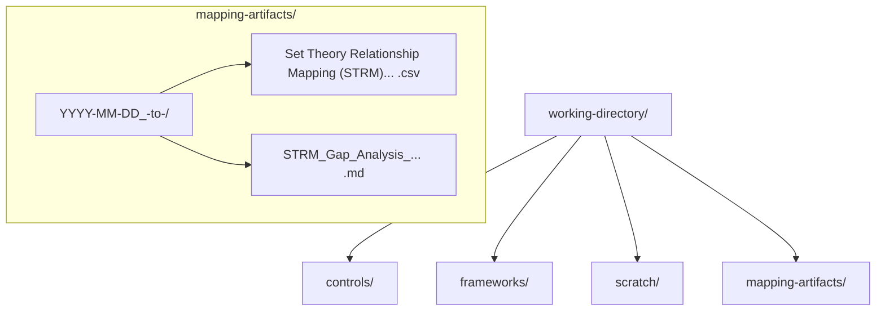

**Diagram sources**
- [working directory structure](file://working-directory/)
- [strm-core.mjs](file://scripts/lib/strm-core.mjs)

**Section sources**
- [working directory structure](file://working-directory/)
- [CONVENTIONS.md](file://CONVENTIONS.md)
- [scripts README.md](file://scripts/README.md)

## Core Components
This section summarizes the core file system behaviors implemented in the STRM toolkit.

- Working directory conventions
  - All inputs and outputs live under working-directory/.
  - Inputs include controls, frameworks, and optional policy/regulation sources.
  - Outputs are written under mapping-artifacts/ with date-based organization and framework-sanitized names.

- Filename generation and sanitization
  - Framework names are sanitized to remove or replace disallowed characters and collapse whitespace.
  - Final filenames follow a strict naming pattern that includes the focal, bridge (if present), and target frameworks, plus a human-readable title.

- Artifact directory organization
  - Directory names combine a date stamp with sanitized focal and target framework identifiers.
  - This enables chronological grouping and easy retrieval of outputs.

- Input file discovery
  - Recursive directory traversal is used to enumerate files.
  - Only specific extensions are considered (.csv, .pdf, .md, .json, .yml, .toml).
  - Files are sorted by name for deterministic ordering.

- Existing mapping detection
  - Searches recursively for CSV files that contain “STRM” in the filename.
  - Uses normalized framework names to match focal and target pairs.
  - Returns sorted matches to avoid ambiguity.

- Cross-platform and permission handling
  - Node.js fs/promises APIs are used for cross-platform compatibility.
  - Paths are constructed using path.join for portability.
  - No explicit file locking is implemented; concurrency should be coordinated externally.

**Section sources**
- [strm-core.mjs](file://scripts/lib/strm-core.mjs)
- [strm-list-input-files.mjs](file://scripts/bin/strm-list-input-files.mjs)
- [strm-check-existing-mapping.mjs](file://scripts/bin/strm-check-existing-mapping.mjs)
- [strm-generate-filename.mjs](file://scripts/bin/strm-generate-filename.mjs)
- [strm-init-mapping.mjs](file://scripts/bin/strm-init-mapping.mjs)
- [CONVENTIONS.md](file://CONVENTIONS.md)

## Architecture Overview
The file system operations are orchestrated by small, deterministic CLI scripts backed by a shared core library. The core library encapsulates:
- Sanitization and naming
- Directory resolution
- Input discovery and sorting
- Existing mapping detection
- CSV parsing/validation utilities

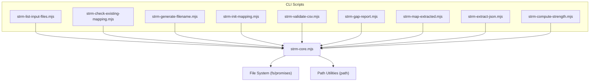

**Diagram sources**
- [strm-core.mjs](file://scripts/lib/strm-core.mjs)
- [strm-list-input-files.mjs](file://scripts/bin/strm-list-input-files.mjs)
- [strm-check-existing-mapping.mjs](file://scripts/bin/strm-check-existing-mapping.mjs)
- [strm-generate-filename.mjs](file://scripts/bin/strm-generate-filename.mjs)
- [strm-init-mapping.mjs](file://scripts/bin/strm-init-mapping.mjs)
- [strm-validate-csv.mjs](file://scripts/bin/strm-validate-csv.mjs)
- [strm-gap-report.mjs](file://scripts/bin/strm-gap-report.mjs)
- [strm-map-extracted.mjs](file://scripts/bin/strm-map-extracted.mjs)
- [strm-extract-json.mjs](file://scripts/bin/strm-extract-json.mjs)
- [strm-compute-strength.mjs](file://scripts/bin/strm-compute-strength.mjs)

## Detailed Component Analysis

### Working Directory Organization
- Inputs
  - Place source control catalogs under working-directory/controls/.
  - Place framework documents and catalogs under working-directory/frameworks/.
- Outputs
  - Draft and final mappings are written under working-directory/mapping-artifacts/.
  - Each output is placed in a directory named with the date and sanitized focal/target framework identifiers.

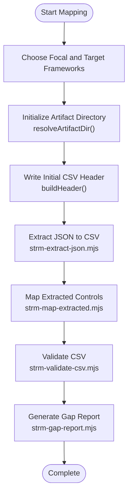

**Diagram sources**
- [strm-core.mjs](file://scripts/lib/strm-core.mjs)
- [strm-init-mapping.mjs](file://scripts/bin/strm-init-mapping.mjs)
- [strm-extract-json.mjs](file://scripts/bin/strm-extract-json.mjs)
- [strm-map-extracted.mjs](file://scripts/bin/strm-map-extracted.mjs)
- [strm-validate-csv.mjs](file://scripts/bin/strm-validate-csv.mjs)
- [strm-gap-report.mjs](file://scripts/bin/strm-gap-report.mjs)

**Section sources**
- [CONVENTIONS.md](file://CONVENTIONS.md)
- [scripts README.md](file://scripts/README.md)
- [working directory structure](file://working-directory/)

### Artifact Directory Structure Generation
- Date-based organization
  - The directory name starts with an ISO date (YYYY-MM-DD).
- Framework name sanitization
  - Framework names are sanitized to remove or replace disallowed characters and collapse whitespace.
- Path resolution
  - The resolver composes the final path using the base working directory, a fixed subdirectory, and the sanitized identifiers.

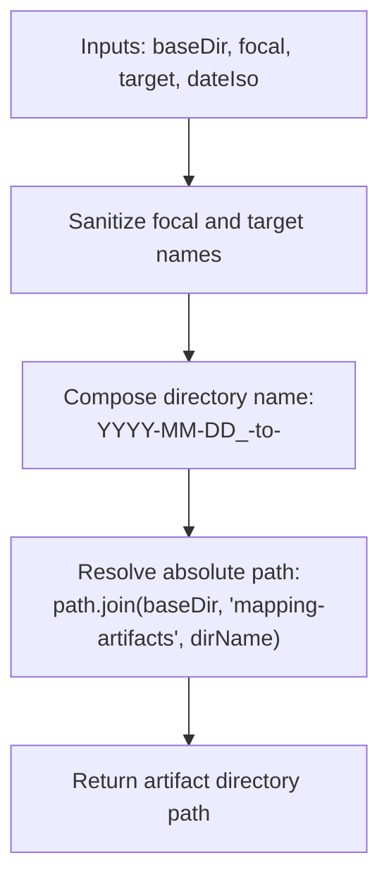

**Diagram sources**
- [strm-core.mjs](file://scripts/lib/strm-core.mjs)

**Section sources**
- [strm-core.mjs](file://scripts/lib/strm-core.mjs)

### Filename Sanitization and Naming Convention Enforcement
- Sanitization rules
  - Trim leading/trailing whitespace.
  - Collapse runs of whitespace into underscores.
  - Replace or remove colon and slash characters.
  - Remove any character not in the allowed set.
- Naming convention
  - The filename includes the relationship expression and a human-readable title derived from the focal and target frameworks.

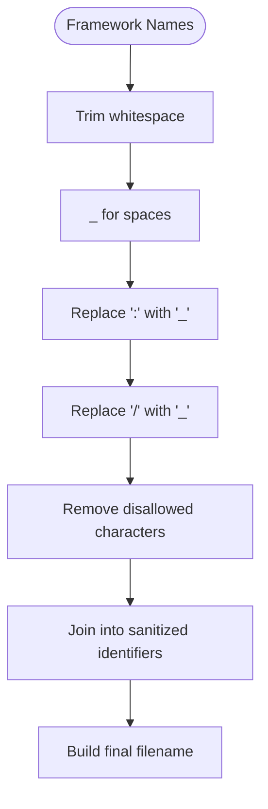

**Diagram sources**
- [strm-core.mjs](file://scripts/lib/strm-core.mjs)
- [strm-generate-filename.mjs](file://scripts/bin/strm-generate-filename.mjs)

**Section sources**
- [strm-core.mjs](file://scripts/lib/strm-core.mjs)
- [strm-generate-filename.mjs](file://scripts/bin/strm-generate-filename.mjs)
- [CONVENTIONS.md](file://CONVENTIONS.md)

### Input File Discovery System
- Recursive traversal
  - Walks directories depth-first and recurses into subdirectories.
- Extension filtering
  - Only considers files with specific extensions: .csv, .pdf, .md, .json, .yml, .toml.
- Sorting
  - Results are sorted by filename for reproducible order.

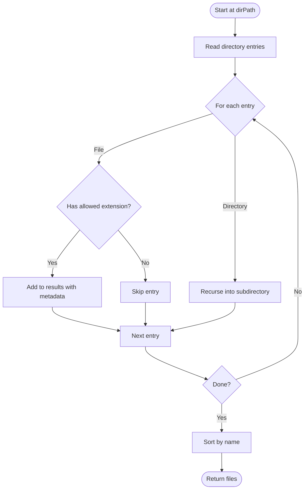

**Diagram sources**
- [strm-core.mjs](file://scripts/lib/strm-core.mjs)
- [strm-list-input-files.mjs](file://scripts/bin/strm-list-input-files.mjs)

**Section sources**
- [strm-core.mjs](file://scripts/lib/strm-core.mjs)
- [strm-list-input-files.mjs](file://scripts/bin/strm-list-input-files.mjs)

### Existing Mapping Detection System
- Search scope
  - Recursively scans the working directory for CSV files.
- Matching criteria
  - Filename must contain “STRM”.
  - Normalized focal and target identifiers must both be present in the filename.
- Output
  - Returns a sorted array of matching file paths.

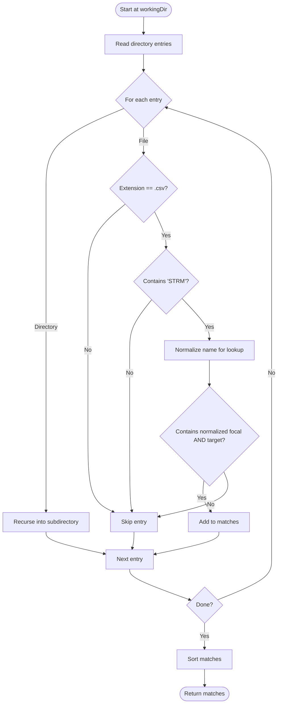

**Diagram sources**
- [strm-core.mjs](file://scripts/lib/strm-core.mjs)
- [strm-check-existing-mapping.mjs](file://scripts/bin/strm-check-existing-mapping.mjs)

**Section sources**
- [strm-core.mjs](file://scripts/lib/strm-core.mjs)
- [strm-check-existing-mapping.mjs](file://scripts/bin/strm-check-existing-mapping.mjs)

### Date-Based Directory Organization and Framework Name Sanitization
- Date-based organization
  - The resolver prepends an ISO date to the directory name.
- Framework name sanitization
  - Sanitization removes or replaces characters that are problematic for filesystems and URLs.
- Path resolution
  - The final path is composed using path.join for cross-platform compatibility.

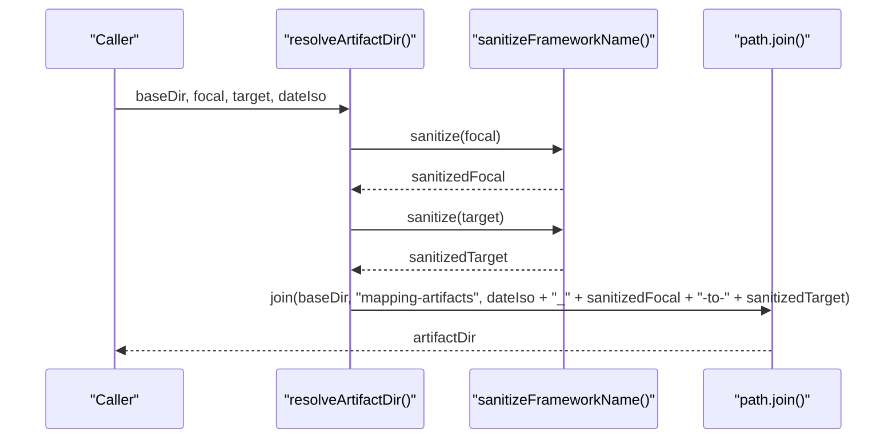

**Diagram sources**
- [strm-core.mjs](file://scripts/lib/strm-core.mjs)

**Section sources**
- [strm-core.mjs](file://scripts/lib/strm-core.mjs)

### Path Resolution Strategies
- Cross-platform path joining
  - Uses path.join to construct paths robustly across Windows, macOS, and Linux.
- Working directory argument support
  - Many scripts accept a --working-dir argument to override the default working directory.

**Section sources**
- [strm-init-mapping.mjs](file://scripts/bin/strm-init-mapping.mjs)
- [strm-gap-report.mjs](file://scripts/bin/strm-gap-report.mjs)
- [strm-validate-csv.mjs](file://scripts/bin/strm-validate-csv.mjs)

### Examples of Working Directory Layouts and File Organization Patterns
- Example artifact directory
  - working-directory/mapping-artifacts/2026-03-24_StateRAMP_Rev5_Moderate-to-NIST_800-82_r3_Moderate/
  - Contains the final STRM CSV and a gap analysis report.
- Example extracted dataset
  - working-directory/scratch/asvs-extracted.csv
  - Contains a standardized set of control metadata derived from a JSON catalog.

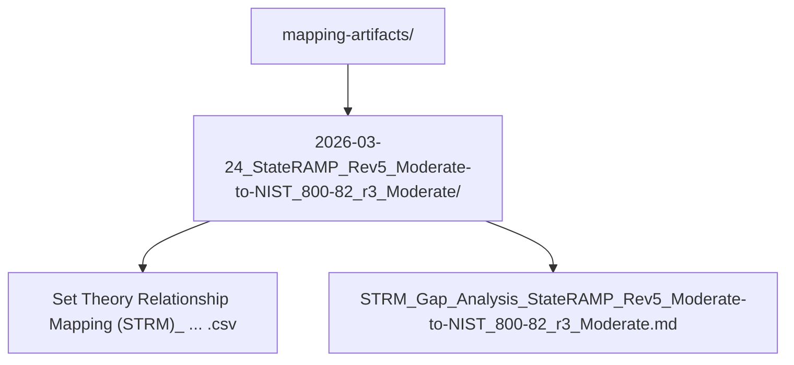

**Diagram sources**
- [example artifact CSV](file://working-directory/mapping-artifacts/2026-03-24_StateRAMP_Rev5_Moderate-to-NIST_800-82_r3_Moderate/Set Theory Relationship Mapping (STRM)_ [(StateRAMP_Rev5_Moderate-to-StateRAMP_Rev5_Moderate)-to-NIST_800-82_r3_Moderate] - StateRAMP Rev5 Moderate to NIST 800-82 r3 Moderate.csv)
- [scratch CSV example](file://working-directory/scratch/asvs-extracted.csv)

**Section sources**
- [example artifact CSV](file://working-directory/mapping-artifacts/2026-03-24_StateRAMP_Rev5_Moderate-to-NIST_800-82_r3_Moderate/Set Theory Relationship Mapping (STRM)_ [(StateRAMP_Rev5_Moderate-to-StateRAMP_Rev5_Moderate)-to-NIST_800-82_r3_Moderate] - StateRAMP Rev5 Moderate to NIST 800-82 r3 Moderate.csv)
- [scratch CSV example](file://working-directory/scratch/asvs-extracted.csv)

### Cross-Platform Compatibility, Permission Handling, and File Locking
- Cross-platform compatibility
  - Node.js fs/promises and path APIs are used consistently across scripts.
  - path.join ensures correct separators and path composition.
- Permissions
  - Scripts operate under the permissions of the invoking user.
  - Ensure the working directory is writable by the user running the scripts.
- File locking
  - No explicit file locking is implemented in the scripts.
  - For concurrent operations, coordinate externally (e.g., separate workers, CI job isolation).

**Section sources**
- [strm-core.mjs](file://scripts/lib/strm-core.mjs)
- [README.md](file://README.md)

## Dependency Analysis
The CLI scripts depend on the shared core library for consistent behavior across operations.

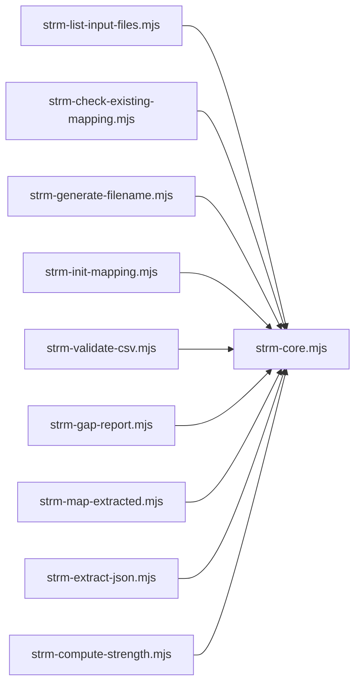

**Diagram sources**
- [strm-core.mjs](file://scripts/lib/strm-core.mjs)
- [strm-list-input-files.mjs](file://scripts/bin/strm-list-input-files.mjs)
- [strm-check-existing-mapping.mjs](file://scripts/bin/strm-check-existing-mapping.mjs)
- [strm-generate-filename.mjs](file://scripts/bin/strm-generate-filename.mjs)
- [strm-init-mapping.mjs](file://scripts/bin/strm-init-mapping.mjs)
- [strm-validate-csv.mjs](file://scripts/bin/strm-validate-csv.mjs)
- [strm-gap-report.mjs](file://scripts/bin/strm-gap-report.mjs)
- [strm-map-extracted.mjs](file://scripts/bin/strm-map-extracted.mjs)
- [strm-extract-json.mjs](file://scripts/bin/strm-extract-json.mjs)
- [strm-compute-strength.mjs](file://scripts/bin/strm-compute-strength.mjs)

**Section sources**
- [strm-core.mjs](file://scripts/lib/strm-core.mjs)

## Performance Considerations
- Input discovery
  - For very large working directories, consider narrowing the search scope or using a whitelist of subdirectories.
  - The recursive traversal is straightforward and efficient for typical repository sizes.
- CSV processing
  - The validator and mapper read entire files into memory; for very large CSVs, consider streaming or chunking approaches if extending the toolkit.
- Deterministic outputs
  - Sorting inputs and outputs ensures reproducibility, which is beneficial for CI/CD pipelines.

[No sources needed since this section provides general guidance]

## Troubleshooting Guide
- Empty or missing CSV headers
  - Ensure the initial CSV is created with the canonical header using the initialization script.
- Duplicate mapping pairs
  - The validator detects duplicate combinations of FDE# and Target ID # and reports their first occurrence.
- Unresolved target placeholders
  - The validator checks for unresolved “<Target>” placeholders in column headers and fails early with guidance.
- Strict coverage checks
  - When using the validator with --strict-coverage, unmapped focal controls cause failure; otherwise they produce warnings.

**Section sources**
- [strm-validate-csv.mjs](file://scripts/bin/strm-validate-csv.mjs)
- [scripts README.md](file://scripts/README.md)

## Conclusion
The STRM Mapping toolkit provides a robust, cross-platform foundation for organizing and managing file system operations around mapping workflows. By enforcing consistent naming and sanitization rules, organizing outputs by date and framework, and offering reliable input discovery and duplicate detection, it supports scalable, auditable, and reproducible mapping operations.

[No sources needed since this section summarizes without analyzing specific files]

## Appendices

### Appendix A: End-to-End Workflow Sequence
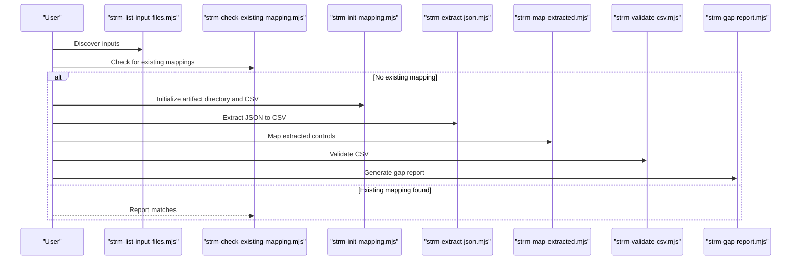

**Diagram sources**
- [strm-list-input-files.mjs](file://scripts/bin/strm-list-input-files.mjs)
- [strm-check-existing-mapping.mjs](file://scripts/bin/strm-check-existing-mapping.mjs)
- [strm-init-mapping.mjs](file://scripts/bin/strm-init-mapping.mjs)
- [strm-extract-json.mjs](file://scripts/bin/strm-extract-json.mjs)
- [strm-map-extracted.mjs](file://scripts/bin/strm-map-extracted.mjs)
- [strm-validate-csv.mjs](file://scripts/bin/strm-validate-csv.mjs)
- [strm-gap-report.mjs](file://scripts/bin/strm-gap-report.mjs)