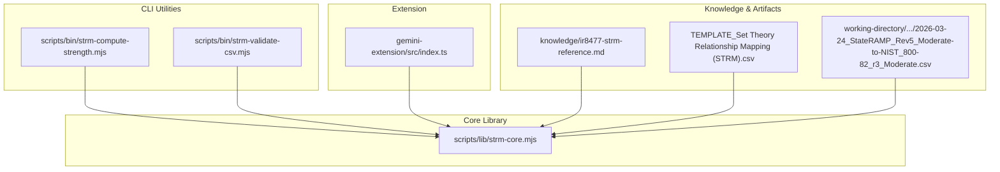
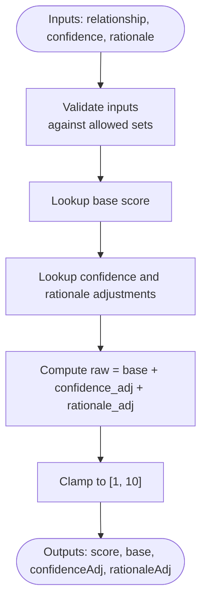
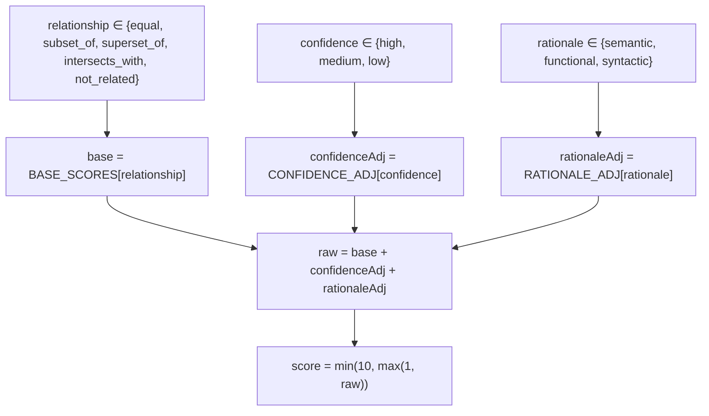
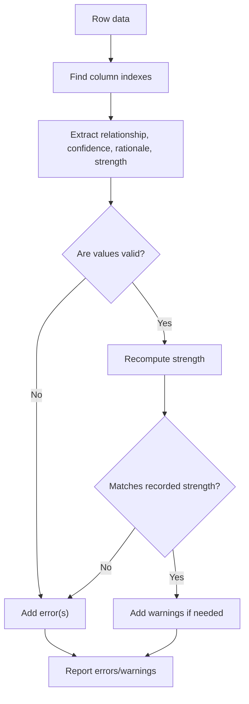
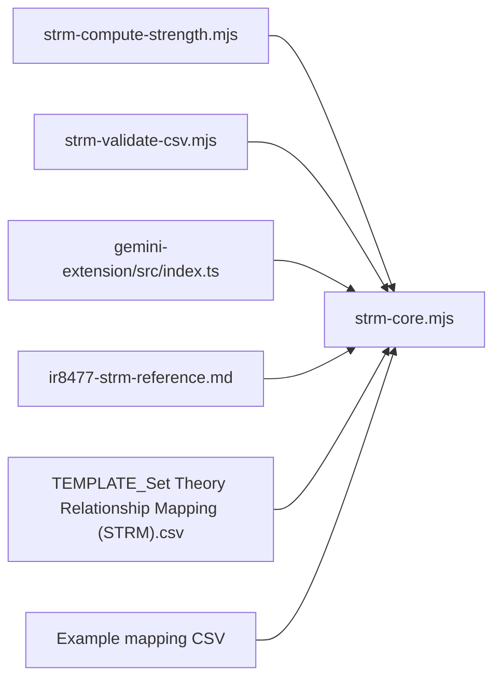

# Mathematical Foundation and Algorithms

<cite>
**Referenced Files in This Document**
- [ir8477-strm-reference.md](file://knowledge/ir8477-strm-reference.md)
- [strm-core.mjs](file://scripts/lib/strm-core.mjs)
- [strm-compute-strength.mjs](file://scripts/bin/strm-compute-strength.mjs)
- [strm-validate-csv.mjs](file://scripts/bin/strm-validate-csv.mjs)
- [index.ts](file://gemini-extension/src/index.ts)
- [GEMINI.md](file://gemini-extension/GEMINI.md)
- [SKILL.md](file://skills/strm-mapping/SKILL.md)
- [TEMPLATE_Set Theory Relationship Mapping (STRM).csv](file://TEMPLATE_Set Theory Relationship Mapping (STRM).csv)
- [2026-03-24_StateRAMP_Rev5_Moderate-to-NIST_800-82_r3_Moderate.csv](file://working-directory/mapping-artifacts/2026-03-24_StateRAMP_Rev5_Moderate-to-NIST_800-82_r3_Moderate/Set Theory Relationship Mapping (STRM)_ [(StateRAMP_Rev5_Moderate-to-StateRAMP_Rev5_Moderate)-to-NIST_800-82_r3_Moderate] - StateRAMP Rev5 Moderate to NIST 800-82 r3 Moderate.csv)
</cite>

## Table of Contents
1. [Introduction](#introduction)
2. [Project Structure](#project-structure)
3. [Core Components](#core-components)
4. [Architecture Overview](#architecture-overview)
5. [Detailed Component Analysis](#detailed-component-analysis)
6. [Dependency Analysis](#dependency-analysis)
7. [Performance Considerations](#performance-considerations)
8. [Troubleshooting Guide](#troubleshooting-guide)
9. [Conclusion](#conclusion)
10. [Appendices](#appendices)

## Introduction
This document presents the mathematical foundation and algorithms underlying the STRM (Set-Theory Relationship Mapping) methodology. It documents the five STRM relationship types, their set-theoretic definitions, and the strength scoring algorithm that quantifies mapping quality. It also explains confidence and rationale adjustments, normalization to a 1–10 scale, validation formulas, and provides examples and proofs for typical combinations. Finally, it discusses computational complexity and performance characteristics for large-scale mappings.

## Project Structure
The STRM toolkit organizes STRM-related logic in a small set of modules:
- Core computation and validation logic in a shared library module
- Command-line utilities for computing strength and validating CSVs
- Extension utilities for agent-assisted workflows
- Knowledge and example artifacts demonstrating real-world mappings

**Diagram sources**
- [strm-core.mjs:1-343](file://scripts/lib/strm-core.mjs#L1-L343)
- [strm-compute-strength.mjs:1-20](file://scripts/bin/strm-compute-strength.mjs#L1-L20)
- [strm-validate-csv.mjs:1-77](file://scripts/bin/strm-validate-csv.mjs#L1-L77)
- [index.ts:268-306](file://gemini-extension/src/index.ts#L268-L306)
- [ir8477-strm-reference.md:1-119](file://knowledge/ir8477-strm-reference.md#L1-L119)
- [TEMPLATE_Set Theory Relationship Mapping (STRM).csv](file://TEMPLATE_Set Theory Relationship Mapping (STRM).csv#L1-L2)
- [2026-03-24_StateRAMP_Rev5_Moderate-to-NIST_800-82_r3_Moderate.csv](file://working-directory/mapping-artifacts/2026-03-24_StateRAMP_Rev5_Moderate-to-NIST_800-82_r3_Moderate/Set Theory Relationship Mapping (STRM)_ [(StateRAMP_Rev5_Moderate-to-StateRAMP_Rev5_Moderate)-to-NIST_800-82_r3_Moderate] - StateRAMP Rev5 Moderate to NIST 800-82 r3 Moderate.csv#L1-L124)

**Section sources**
- [strm-core.mjs:1-343](file://scripts/lib/strm-core.mjs#L1-L343)
- [strm-compute-strength.mjs:1-20](file://scripts/bin/strm-compute-strength.mjs#L1-L20)
- [strm-validate-csv.mjs:1-77](file://scripts/bin/strm-validate-csv.mjs#L1-L77)
- [ir8477-strm-reference.md:1-119](file://knowledge/ir8477-strm-reference.md#L1-L119)
- [TEMPLATE_Set Theory Relationship Mapping (STRM).csv](file://TEMPLATE_Set Theory Relationship Mapping (STRM).csv#L1-L2)
- [2026-03-24_StateRAMP_Rev5_Moderate-to-NIST_800-82_r3_Moderate.csv](file://working-directory/mapping-artifacts/2026-03-24_StateRAMP_Rev5_Moderate-to-NIST_800-82_r3_Moderate/Set Theory Relationship Mapping (STRM)_ [(StateRAMP_Rev5_Moderate-to-StateRAMP_Rev5_Moderate)-to-NIST_800-82_r3_Moderate] - StateRAMP Rev5 Moderate to NIST 800-82 r3 Moderate.csv#L1-L124)

## Core Components
- STRM relationship types: equal, subset_of, superset_of, intersects_with, not_related
- Confidence levels: high, medium, low
- Rationale types: semantic, functional, syntactic
- Strength scoring: base score + confidence adjustment + rationale adjustment, clamped to [1, 10]
- Validation: automated checks against the scoring formula and column requirements

These components are defined and enforced consistently across the core library and validated by CLI and extension utilities.

**Section sources**
- [ir8477-strm-reference.md:16-56](file://knowledge/ir8477-strm-reference.md#L16-L56)
- [strm-core.mjs:4-57](file://scripts/lib/strm-core.mjs#L4-L57)
- [strm-validate-csv.mjs:30-76](file://scripts/bin/strm-validate-csv.mjs#L30-L76)
- [index.ts:148-176](file://gemini-extension/src/index.ts#L148-L176)

## Architecture Overview
The STRM strength computation follows a deterministic pipeline: input validation, base score lookup, adjustment computation, summation, and clamping. The same pipeline is invoked by CLI and extension tools to ensure consistency.

**Diagram sources**
- [strm-core.mjs:35-57](file://scripts/lib/strm-core.mjs#L35-L57)
- [strm-compute-strength.mjs:9-19](file://scripts/bin/strm-compute-strength.mjs#L9-L19)
- [index.ts:287-305](file://gemini-extension/src/index.ts#L287-L305)

## Detailed Component Analysis

### STRM Relationship Types and Set-Theoretic Definitions
- equal: A = B; identical requirement sets
- subset_of: A ⊂ B; every element of A is in B
- superset_of: A ⊃ B; every element of B is in A
- intersects_with: A ∩ B ≠ ∅; partial overlap, neither contains the other
- not_related: A ∩ B = ∅; disjoint sets

These definitions align with standard set theory and underpin transitivity and inverse relationships.

**Section sources**
- [ir8477-strm-reference.md:16-24](file://knowledge/ir8477-strm-reference.md#L16-L24)
- [SKILL.md:271-303](file://skills/strm-mapping/SKILL.md#L271-L303)

### Strength Scoring Algorithm
- Base scores:
  - equal: 10
  - subset_of: 7
  - superset_of: 7
  - intersects_with: 4
  - not_related: 0
- Confidence adjustments:
  - high: +0
  - medium: −1
  - low: −2
- Rationale adjustments:
  - semantic: +0
  - functional: +0
  - syntactic: −1
- Final score: clamp(base + confidence_adj + rationale_adj, 1, 10)

**Diagram sources**
- [strm-core.mjs:15-57](file://scripts/lib/strm-core.mjs#L15-L57)

**Section sources**
- [ir8477-strm-reference.md:44-56](file://knowledge/ir8477-strm-reference.md#L44-L56)
- [strm-core.mjs:15-57](file://scripts/lib/strm-core.mjs#L15-L57)

### Relationship Calculation Logic and Normalization
- Inputs are validated against predefined sets before scoring.
- The scoring function returns both the final score and the breakdown components for transparency.
- Normalization ensures interpretability: 8–10 strong, 5–7 moderate, 1–4 weak.

**Section sources**
- [strm-core.mjs:35-57](file://scripts/lib/strm-core.mjs#L35-L57)
- [ir8477-strm-reference.md:54-56](file://knowledge/ir8477-strm-reference.md#L54-L56)

### Validation Formulas and Quality Checks
- CSV validation enforces:
  - Required columns present
  - Relationship, confidence, and rationale types are valid
  - Strength is an integer in [1, 10]
  - Strength equals the recomputed value from the formula
  - Optional warnings for edge cases (e.g., syntactic rationale, low confidence, not_related notes)

**Diagram sources**
- [strm-validate-csv.mjs:30-76](file://scripts/bin/strm-validate-csv.mjs#L30-L76)
- [strm-core.mjs:206-265](file://scripts/lib/strm-core.mjs#L206-L265)

**Section sources**
- [strm-validate-csv.mjs:30-76](file://scripts/bin/strm-validate-csv.mjs#L30-L76)
- [strm-core.mjs:206-265](file://scripts/lib/strm-core.mjs#L206-L265)

### Examples and Proofs of Typical Combinations
Below are representative examples derived from the STRM reference and validated by the scoring pipeline. These demonstrate how base scores, confidence adjustments, and rationale adjustments combine to yield normalized strengths.

- equal + high + semantic:
  - base: 10
  - confidence_adj: 0
  - rationale_adj: 0
  - raw: 10
  - score: 10
  - Interpretation: strong mapping

- subset_of + high + semantic:
  - base: 7
  - confidence_adj: 0
  - rationale_adj: 0
  - raw: 7
  - score: 7
  - Interpretation: moderate mapping

- intersects_with + medium + functional:
  - base: 4
  - confidence_adj: −1
  - rationale_adj: 0
  - raw: 3
  - score: 3
  - Interpretation: weak mapping

- not_related + high + syntactic:
  - base: 0
  - confidence_adj: 0
  - rationale_adj: −1
  - raw: −1
  - clamped: 1
  - Interpretation: very weak mapping

- equal + low + syntactic:
  - base: 10
  - confidence_adj: −2
  - rationale_adj: −1
  - raw: 7
  - score: 7
  - Interpretation: moderate mapping

These examples illustrate the scoring mechanics and confirm that the final score is always in [1, 10].

**Section sources**
- [ir8477-strm-reference.md:44-56](file://knowledge/ir8477-strm-reference.md#L44-L56)
- [strm-core.mjs:15-57](file://scripts/lib/strm-core.mjs#L15-L57)

### Transitivity and Inverse Relationships
- Transitivity: Certain combinations allow deriving A→C from A→B and B→C; others are indeterminate and require manual review.
- Inverse: Each forward relationship has a precisely defined inverse (e.g., subset_of ↔ superset_of).

**Section sources**
- [ir8477-strm-reference.md:58-86](file://knowledge/ir8477-strm-reference.md#L58-L86)
- [SKILL.md:271-303](file://skills/strm-mapping/SKILL.md#L271-L303)

### Theoretical Foundations and Cybersecurity Framework Mapping
- STRM replaces informal labels with mathematically precise set-theoretic semantics.
- This enables automated reasoning, transitivity derivation, and quantitative strength scoring—crucial for cross-framework alignment and gap analysis.
- The STRM reference enumerates supported frameworks and provides schema and knowledge artifacts for validation.

**Section sources**
- [ir8477-strm-reference.md:3-119](file://knowledge/ir8477-strm-reference.md#L3-L119)

## Dependency Analysis
The core dependency chain is straightforward: CLI and extension utilities depend on the core library for computation and validation.

**Diagram sources**
- [strm-compute-strength.mjs:1-20](file://scripts/bin/strm-compute-strength.mjs#L1-L20)
- [strm-validate-csv.mjs:1-77](file://scripts/bin/strm-validate-csv.mjs#L1-L77)
- [index.ts:268-306](file://gemini-extension/src/index.ts#L268-L306)
- [strm-core.mjs:1-343](file://scripts/lib/strm-core.mjs#L1-L343)
- [ir8477-strm-reference.md:1-119](file://knowledge/ir8477-strm-reference.md#L1-L119)
- [TEMPLATE_Set Theory Relationship Mapping (STRM).csv](file://TEMPLATE_Set Theory Relationship Mapping (STRM).csv#L1-L2)
- [2026-03-24_StateRAMP_Rev5_Moderate-to-NIST_800-82_r3_Moderate.csv](file://working-directory/mapping-artifacts/2026-03-24_StateRAMP_Rev5_Moderate-to-NIST_800-82_r3_Moderate/Set Theory Relationship Mapping (STRM)_ [(StateRAMP_Rev5_Moderate-to-StateRAMP_Rev5_Moderate)-to-NIST_800-82_r3_Moderate] - StateRAMP Rev5 Moderate to NIST 800-82 r3 Moderate.csv#L1-L124)

**Section sources**
- [strm-compute-strength.mjs:1-20](file://scripts/bin/strm-compute-strength.mjs#L1-L20)
- [strm-validate-csv.mjs:1-77](file://scripts/bin/strm-validate-csv.mjs#L1-L77)
- [index.ts:268-306](file://gemini-extension/src/index.ts#L268-L306)
- [strm-core.mjs:1-343](file://scripts/lib/strm-core.mjs#L1-L343)

## Performance Considerations
- Computational complexity:
  - Strength computation per row: O(1) with constant-time lookups and arithmetic.
  - CSV validation: O(N) over the number of data rows, with per-row checks for types, ranges, and formula consistency.
- Memory footprint:
  - Parsing CSV is linear in file size; the parser builds an in-memory array of rows.
- Practical guidance:
  - For large datasets, batch processing and streaming are not implemented; prefer splitting large CSVs into smaller chunks.
  - Use the validation utility to catch mismatches early and avoid downstream rework.

[No sources needed since this section provides general guidance]

## Troubleshooting Guide
Common issues and resolutions:
- Invalid relationship/confidence/rationale type:
  - Ensure values belong to the allowed sets; otherwise, errors are reported.
- Strength out of range or non-integer:
  - Confirm the strength is an integer in [1, 10]; otherwise, errors are reported.
- Strength mismatch:
  - The recorded strength must equal the recomputed value from the formula; mismatches trigger errors.
- Edge-case warnings:
  - Syntactic rationale is uncommon; low confidence should imply significant inference; not_related should include notes.

**Section sources**
- [strm-validate-csv.mjs:30-76](file://scripts/bin/strm-validate-csv.mjs#L30-L76)
- [strm-core.mjs:206-265](file://scripts/lib/strm-core.mjs#L206-L265)
- [index.ts:148-176](file://gemini-extension/src/index.ts#L148-L176)

## Conclusion
The STRM methodology provides a rigorous, mathematically grounded approach to cross-framework control mapping. Its strength scoring algorithm, with base scores, confidence adjustments, and rationale penalties, yields a normalized 1–10 scale suitable for automated reasoning and quality assurance. The provided tools and validations ensure consistency and reliability across large-scale mapping efforts.

[No sources needed since this section summarizes without analyzing specific files]

## Appendices

### Appendix A: STRM CSV Template and Column Semantics
- The template defines the required 12-column structure for STRM outputs.
- The core library maps human-friendly headers to internal column indices for validation.

**Section sources**
- [TEMPLATE_Set Theory Relationship Mapping (STRM).csv](file://TEMPLATE_Set Theory Relationship Mapping (STRM).csv#L1-L2)
- [strm-core.mjs:182-204](file://scripts/lib/strm-core.mjs#L182-L204)

### Appendix B: Example Mapping Artifact
- Real-world mappings demonstrate how STRM relationships and strengths appear in practice, including rationale narratives and scoring outcomes.

**Section sources**
- [2026-03-24_StateRAMP_Rev5_Moderate-to-NIST_800-82_r3_Moderate.csv](file://working-directory/mapping-artifacts/2026-03-24_StateRAMP_Rev5_Moderate-to-NIST_800-82_r3_Moderate/Set Theory Relationship Mapping (STRM)_ [(StateRAMP_Rev5_Moderate-to-StateRAMP_Rev5_Moderate)-to-NIST_800-82_r3_Moderate] - StateRAMP Rev5 Moderate to NIST 800-82 r3 Moderate.csv#L1-L124)