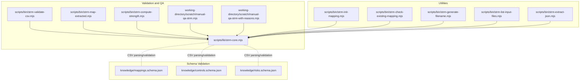
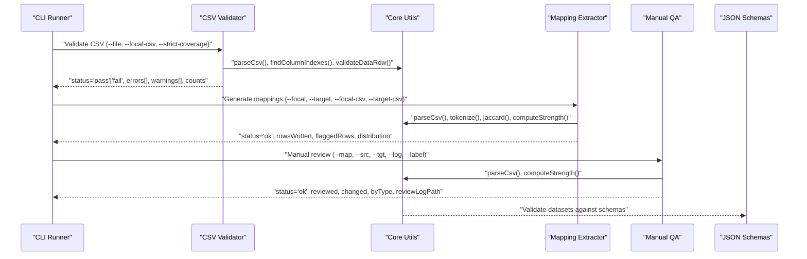
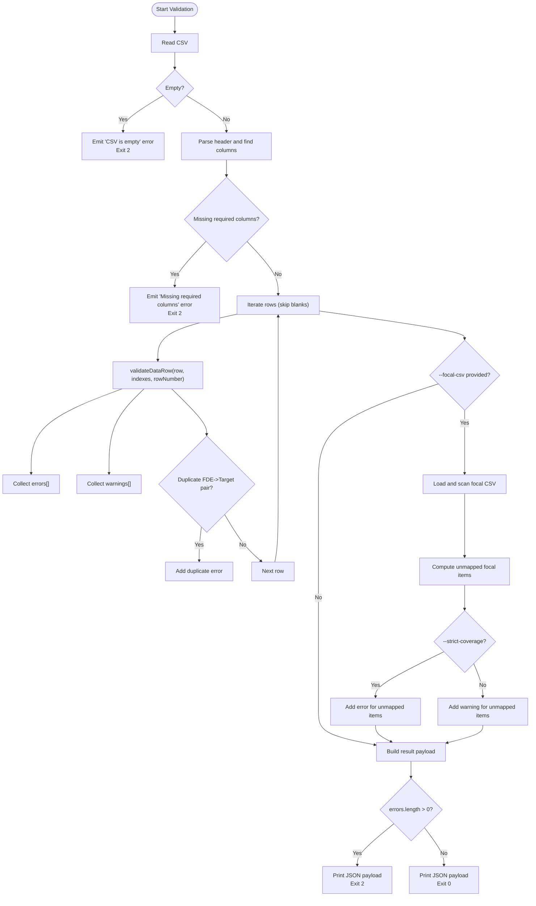
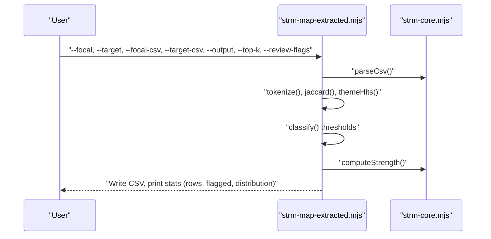
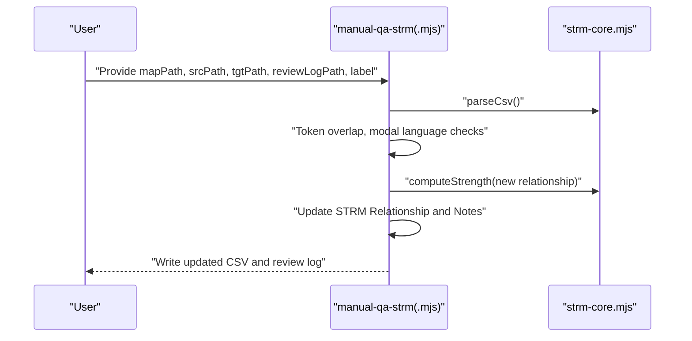
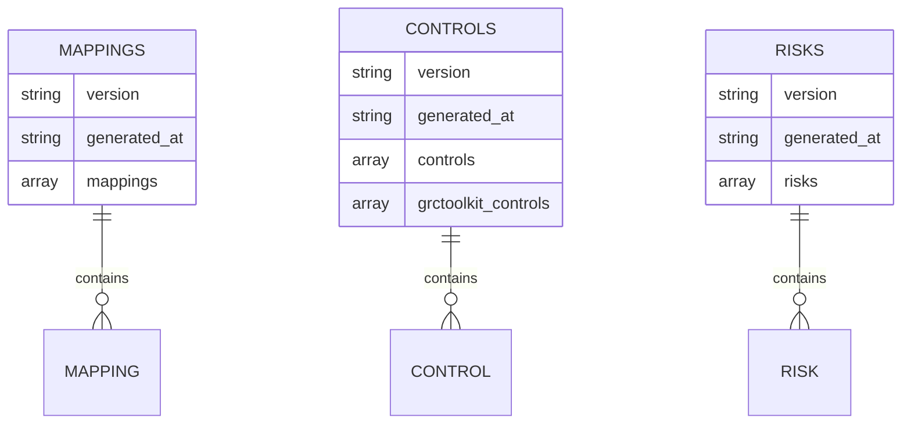
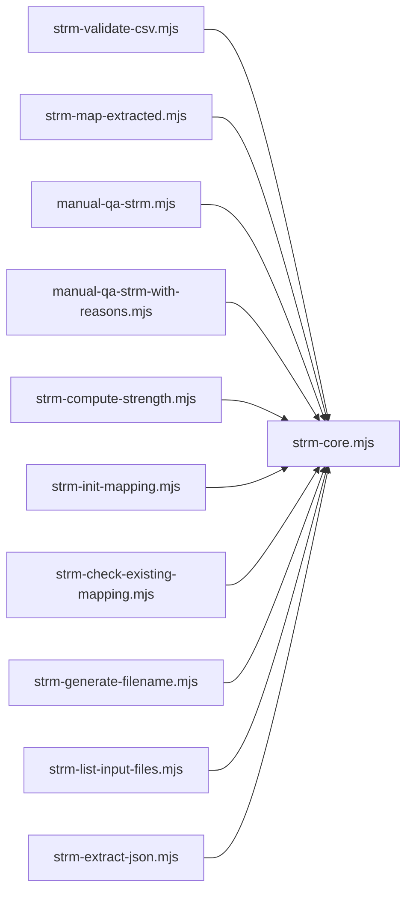

# Quality Assurance and Error Handling

<cite>
**Referenced Files in This Document**
- [strm-validate-csv.mjs](file://scripts/bin/strm-validate-csv.mjs)
- [strm-core.mjs](file://scripts/lib/strm-core.mjs)
- [manual-qa-strm.mjs](file://working-directory/scratch/manual-qa-strm.mjs)
- [manual-qa-strm-with-reasons.mjs](file://working-directory/scratch/manual-qa-strm-with-reasons.mjs)
- [strm-map-extracted.mjs](file://scripts/bin/strm-map-extracted.mjs)
- [strm-compute-strength.mjs](file://scripts/bin/strm-compute-strength.mjs)
- [strm-init-mapping.mjs](file://scripts/bin/strm-init-mapping.mjs)
- [strm-check-existing-mapping.mjs](file://scripts/bin/strm-check-existing-mapping.mjs)
- [strm-generate-filename.mjs](file://scripts/bin/strm-generate-filename.mjs)
- [strm-list-input-files.mjs](file://scripts/bin/strm-list-input-files.mjs)
- [strm-extract-json.mjs](file://scripts/bin/strm-extract-json.mjs)
- [mappings.schema.json](file://knowledge/mappings.schema.json)
- [controls.schema.json](file://knowledge/controls.schema.json)
- [risks.schema.json](file://knowledge/risks.schema.json)
- [CONVENTIONS.md](file://CONVENTIONS.md)
- [AGENTS.md](file://AGENTS.md)
- [GEMINI.md](file://GEMINI.md)
- [README.md](file://README.md)
</cite>

## Table of Contents
1. [Introduction](#introduction)
2. [Project Structure](#project-structure)
3. [Core Components](#core-components)
4. [Architecture Overview](#architecture-overview)
5. [Detailed Component Analysis](#detailed-component-analysis)
6. [Dependency Analysis](#dependency-analysis)
7. [Performance Considerations](#performance-considerations)
8. [Troubleshooting Guide](#troubleshooting-guide)
9. [Conclusion](#conclusion)
10. [Appendices](#appendices)

## Introduction
This document focuses on Quality Assurance (QA) and Error Handling within the STRM Mapping project. It explains the multi-layered validation approach (structural, semantic, and mathematical consistency), the error categorization system (critical vs warnings), enforcement of validation rules, and automated quality gates. It also documents manual review integration points, QA checkpoints, remediation workflows, logging/reporting formats, debugging support, performance monitoring, throughput optimization, batch error recovery, and guidance for extending validation rules and adding custom quality checks.

## Project Structure
The QA and error handling system spans:
- Validation entry points and runners (CSV validator, mapping extractor, strength calculator)
- Core validation and parsing utilities
- Manual QA scripts for human-in-the-loop review and remediation
- JSON schema definitions for dataset validation
- Conventions and agent/gemini guidance for consistent QA behavior

**Diagram sources**
- [strm-validate-csv.mjs:1-146](file://scripts/bin/strm-validate-csv.mjs#L1-L146)
- [strm-core.mjs:1-343](file://scripts/lib/strm-core.mjs#L1-L343)
- [strm-map-extracted.mjs:1-306](file://scripts/bin/strm-map-extracted.mjs#L1-L306)
- [strm-compute-strength.mjs:1-20](file://scripts/bin/strm-compute-strength.mjs#L1-L20)
- [manual-qa-strm.mjs:1-145](file://working-directory/scratch/manual-qa-strm.mjs#L1-L145)
- [manual-qa-strm-with-reasons.mjs:1-120](file://working-directory/scratch/manual-qa-strm-with-reasons.mjs#L1-L120)
- [mappings.schema.json:1-117](file://knowledge/mappings.schema.json#L1-L117)
- [controls.schema.json:1-141](file://knowledge/controls.schema.json#L1-L141)
- [risks.schema.json:1-92](file://knowledge/risks.schema.json#L1-L92)
- [strm-init-mapping.mjs:1-58](file://scripts/bin/strm-init-mapping.mjs#L1-L58)
- [strm-check-existing-mapping.mjs:1-20](file://scripts/bin/strm-check-existing-mapping.mjs#L1-L20)
- [strm-generate-filename.mjs:1-19](file://scripts/bin/strm-generate-filename.mjs#L1-L19)
- [strm-list-input-files.mjs:1-12](file://scripts/bin/strm-list-input-files.mjs#L1-L12)
- [strm-extract-json.mjs:1-354](file://scripts/bin/strm-extract-json.mjs#L1-L354)

**Section sources**
- [README.md:1-30](file://README.md#L1-L30)
- [CONVENTIONS.md:1-187](file://CONVENTIONS.md#L1-L187)
- [AGENTS.md:1-141](file://AGENTS.md#L1-L141)
- [GEMINI.md:1-232](file://GEMINI.md#L1-L232)

## Core Components
- CSV Validator: Validates CSV structure, required columns, row-level constraints, duplication detection, optional coverage checks against a focal dataset, and emits pass/fail with counts and categorized messages.
- Core Utilities: CSV parser/tokenizer, header normalization, column index resolution, strength computation, filename generation, artifact directory resolution, and file discovery helpers.
- Mapping Extractor: Automated mapping generator with semantic similarity scoring, confidence assignment, rationale generation, and optional review flags.
- Manual QA Scripts: Human-in-the-loop scripts that adjust STRM relationships based on textual overlap and modal language, updating strengths and notes.
- Schema Definitions: JSON Schemas for mappings, controls, and risks to enforce structural and semantic correctness of datasets.
- Utilities: Initialization of mapping CSVs, checking for existing mappings, filename generation, input file listing, and JSON extraction to CSV.

**Section sources**
- [strm-validate-csv.mjs:1-146](file://scripts/bin/strm-validate-csv.mjs#L1-L146)
- [strm-core.mjs:1-343](file://scripts/lib/strm-core.mjs#L1-L343)
- [strm-map-extracted.mjs:1-306](file://scripts/bin/strm-map-extracted.mjs#L1-L306)
- [manual-qa-strm.mjs:1-145](file://working-directory/scratch/manual-qa-strm.mjs#L1-L145)
- [manual-qa-strm-with-reasons.mjs:1-120](file://working-directory/scratch/manual-qa-strm-with-reasons.mjs#L1-L120)
- [mappings.schema.json:1-117](file://knowledge/mappings.schema.json#L1-L117)
- [controls.schema.json:1-141](file://knowledge/controls.schema.json#L1-L141)
- [risks.schema.json:1-92](file://knowledge/risks.schema.json#L1-L92)

## Architecture Overview
The QA architecture integrates automated validation and manual review:

**Diagram sources**
- [strm-validate-csv.mjs:1-146](file://scripts/bin/strm-validate-csv.mjs#L1-L146)
- [strm-core.mjs:1-343](file://scripts/lib/strm-core.mjs#L1-L343)
- [strm-map-extracted.mjs:1-306](file://scripts/bin/strm-map-extracted.mjs#L1-L306)
- [manual-qa-strm.mjs:1-145](file://working-directory/scratch/manual-qa-strm.mjs#L1-L145)
- [mappings.schema.json:1-117](file://knowledge/mappings.schema.json#L1-L117)

## Detailed Component Analysis

### CSV Validation Pipeline
Multi-layered validation:
- Structural validation: Empty CSV, required columns, header placeholders unresolved.
- Semantic validation: Row-level constraints (empty cells, required fields, controlled vocabularies).
- Mathematical consistency checks: Strength score recomputation and mismatch detection.
- Coverage checks: Optional unmapped focal items detection against a focal CSV.
- Error categorization: Critical errors halt processing; warnings suggest improvements.

**Diagram sources**
- [strm-validate-csv.mjs:1-146](file://scripts/bin/strm-validate-csv.mjs#L1-L146)
- [strm-core.mjs:206-265](file://scripts/lib/strm-core.mjs#L206-L265)

**Section sources**
- [strm-validate-csv.mjs:1-146](file://scripts/bin/strm-validate-csv.mjs#L1-L146)
- [strm-core.mjs:206-265](file://scripts/lib/strm-core.mjs#L206-L265)

### Mapping Extraction and Automated QA
Automated mapping pipeline with built-in quality signals:
- Text preprocessing and tokenization
- Lexical and thematic overlap scoring
- Relationship classification with thresholds
- Confidence assignment and rationale generation
- Optional review flags for borderline cases

**Diagram sources**
- [strm-map-extracted.mjs:1-306](file://scripts/bin/strm-map-extracted.mjs#L1-L306)
- [strm-core.mjs:35-57](file://scripts/lib/strm-core.mjs#L35-L57)

**Section sources**
- [strm-map-extracted.mjs:1-306](file://scripts/bin/strm-map-extracted.mjs#L1-L306)
- [strm-core.mjs:35-57](file://scripts/lib/strm-core.mjs#L35-L57)

### Manual Review Integration and Remediation
Manual QA scripts adjust STRM relationships based on textual overlap and modal language, then update strengths and notes, and produce a review log.

**Diagram sources**
- [manual-qa-strm.mjs:1-145](file://working-directory/scratch/manual-qa-strm.mjs#L1-L145)
- [manual-qa-strm-with-reasons.mjs:1-120](file://working-directory/scratch/manual-qa-strm-with-reasons.mjs#L1-L120)
- [strm-core.mjs:35-57](file://scripts/lib/strm-core.mjs#L35-L57)

**Section sources**
- [manual-qa-strm.mjs:1-145](file://working-directory/scratch/manual-qa-strm.mjs#L1-L145)
- [manual-qa-strm-with-reasons.mjs:1-120](file://working-directory/scratch/manual-qa-strm-with-reasons.mjs#L1-L120)

### JSON Schema-Based Structural Validation
JSON Schemas define structural and semantic constraints for mappings, controls, and risks, enabling dataset-level validation and consistency checks.

**Diagram sources**
- [mappings.schema.json:1-117](file://knowledge/mappings.schema.json#L1-L117)
- [controls.schema.json:1-141](file://knowledge/controls.schema.json#L1-L141)
- [risks.schema.json:1-92](file://knowledge/risks.schema.json#L1-L92)

**Section sources**
- [mappings.schema.json:1-117](file://knowledge/mappings.schema.json#L1-L117)
- [controls.schema.json:1-141](file://knowledge/controls.schema.json#L1-L141)
- [risks.schema.json:1-92](file://knowledge/risks.schema.json#L1-L92)

### Logging, Reporting, and Debugging Support
- CSV Validator: Emits JSON payloads with status, counts, and categorized messages; exits with non-zero codes on failure.
- Mapping Extractor: Emits JSON with statistics and distribution; optionally flags rows needing review.
- Manual QA: Produces a Markdown review log summarizing changes and reasons.
- Utilities: Provide deterministic filenames, artifact directories, and input file listings for reproducibility.

**Section sources**
- [strm-validate-csv.mjs:130-146](file://scripts/bin/strm-validate-csv.mjs#L130-L146)
- [strm-map-extracted.mjs:283-306](file://scripts/bin/strm-map-extracted.mjs#L283-L306)
- [manual-qa-strm.mjs:126-145](file://working-directory/scratch/manual-qa-strm.mjs#L126-L145)
- [strm-init-mapping.mjs:36-58](file://scripts/bin/strm-init-mapping.mjs#L36-L58)
- [strm-generate-filename.mjs:9-19](file://scripts/bin/strm-generate-filename.mjs#L9-L19)
- [strm-list-input-files.mjs:9-12](file://scripts/bin/strm-list-input-files.mjs#L9-L12)

## Dependency Analysis
Key dependencies and coupling:
- CSV Validator depends on Core Utilities for parsing, indexing, and row validation.
- Mapping Extractor depends on Core Utilities for parsing, tokenization, and strength computation.
- Manual QA scripts depend on Core Utilities for CSV parsing and strength recomputation.
- Utilities depend on Core Utilities for filename generation, artifact directories, and file discovery.

**Diagram sources**
- [strm-validate-csv.mjs:1-146](file://scripts/bin/strm-validate-csv.mjs#L1-L146)
- [strm-core.mjs:1-343](file://scripts/lib/strm-core.mjs#L1-L343)
- [strm-map-extracted.mjs:1-306](file://scripts/bin/strm-map-extracted.mjs#L1-L306)
- [manual-qa-strm.mjs:1-145](file://working-directory/scratch/manual-qa-strm.mjs#L1-L145)
- [manual-qa-strm-with-reasons.mjs:1-120](file://working-directory/scratch/manual-qa-strm-with-reasons.mjs#L1-L120)
- [strm-compute-strength.mjs:1-20](file://scripts/bin/strm-compute-strength.mjs#L1-L20)
- [strm-init-mapping.mjs:1-58](file://scripts/bin/strm-init-mapping.mjs#L1-L58)
- [strm-check-existing-mapping.mjs:1-20](file://scripts/bin/strm-check-existing-mapping.mjs#L1-L20)
- [strm-generate-filename.mjs:1-19](file://scripts/bin/strm-generate-filename.mjs#L1-L19)
- [strm-list-input-files.mjs:1-12](file://scripts/bin/strm-list-input-files.mjs#L1-L12)
- [strm-extract-json.mjs:1-354](file://scripts/bin/strm-extract-json.mjs#L1-L354)

**Section sources**
- [strm-core.mjs:1-343](file://scripts/lib/strm-core.mjs#L1-L343)

## Performance Considerations
- Throughput optimization:
  - Minimize repeated file reads by batching operations and caching parsed datasets.
  - Use streaming-like row-wise processing to avoid loading entire CSVs into memory when possible.
  - Parallelize independent row validations or mapping computations where feasible.
- Batch processing error recovery:
  - Separate critical errors (halt) from warnings (continue) to maximize successful batch completion.
  - Implement checkpointing for long-running mapping extractions to resume from last processed row.
- Validation overhead:
  - Defer expensive computations (e.g., tokenization and overlap scoring) until necessary.
  - Cache intermediate results (e.g., token sets) to reduce recomputation.
- I/O and disk:
  - Write outputs to dedicated artifact directories to avoid filesystem contention.
  - Use asynchronous I/O and avoid synchronous operations in hot loops.

[No sources needed since this section provides general guidance]

## Troubleshooting Guide
Common validation failures and resolutions:
- CSV is empty:
  - Cause: Empty input file.
  - Resolution: Provide a valid CSV with at least a header row.
  - Evidence: [strm-validate-csv.mjs:30-33](file://scripts/bin/strm-validate-csv.mjs#L30-L33)
- Missing required columns:
  - Cause: Header lacks required keys.
  - Resolution: Ensure canonical header columns are present; see conventions.
  - Evidence: [strm-validate-csv.mjs:37-49](file://scripts/bin/strm-validate-csv.mjs#L37-L49), [CONVENTIONS.md:95-115](file://CONVENTIONS.md#L95-L115)
- Unresolved target header placeholders:
  - Cause: Column headers still contain unresolved <Target> placeholders.
  - Resolution: Replace <Target> with the actual target framework name.
  - Evidence: [strm-validate-csv.mjs:62-67](file://scripts/bin/strm-validate-csv.mjs#L62-L67)
- Duplicate mapping pairs:
  - Cause: Same FDE mapped to the same Target ID multiple times.
  - Resolution: Remove duplicates or consolidate rows.
  - Evidence: [strm-validate-csv.mjs:84-92](file://scripts/bin/strm-validate-csv.mjs#L84-L92)
- Strength mismatch:
  - Cause: Manually entered strength does not match computed score.
  - Resolution: Recompute strength using the provided calculator or reassign relationship/confidence/rationale.
  - Evidence: [strm-validate-csv.mjs:248-252](file://scripts/bin/strm-validate-csv.mjs#L248-L252), [strm-compute-strength.mjs:1-20](file://scripts/bin/strm-compute-strength.mjs#L1-L20)
- Low confidence warnings:
  - Cause: Low confidence used without justification.
  - Resolution: Prefer high confidence; use medium only for ambiguous cases; reserve low for significant inference.
  - Evidence: [strm-validate-csv.mjs:260-262](file://scripts/bin/strm-validate-csv.mjs#L260-L262), [CONVENTIONS.md:58-77](file://CONVENTIONS.md#L58-L77)
- Syntactic rationale warnings:
  - Cause: Overuse of syntactic rationale.
  - Resolution: Prefer semantic or functional rationales; use syntactic only for minimal word-level similarity.
  - Evidence: [strm-validate-csv.mjs:257-259](file://scripts/bin/strm-validate-csv.mjs#L257-L259), [CONVENTIONS.md:62-64](file://CONVENTIONS.md#L62-L64)
- Coverage gaps:
  - Cause: Focal controls not covered by output mappings.
  - Resolution: Investigate and map uncovered controls; use strict coverage mode to enforce.
  - Evidence: [strm-validate-csv.mjs:114-124](file://scripts/bin/strm-validate-csv.mjs#L114-L124)
- Manual review adjustments:
  - Cause: Initial automated mapping misclassification.
  - Resolution: Run manual QA scripts to refine relationships and update strengths.
  - Evidence: [manual-qa-strm.mjs:88-115](file://working-directory/scratch/manual-qa-strm.mjs#L88-L115), [manual-qa-strm-with-reasons.mjs:68-96](file://working-directory/scratch/manual-qa-strm-with-reasons.mjs#L68-L96)

**Section sources**
- [strm-validate-csv.mjs:1-146](file://scripts/bin/strm-validate-csv.mjs#L1-L146)
- [strm-compute-strength.mjs:1-20](file://scripts/bin/strm-compute-strength.mjs#L1-L20)
- [manual-qa-strm.mjs:1-145](file://working-directory/scratch/manual-qa-strm.mjs#L1-L145)
- [manual-qa-strm-with-reasons.mjs:1-120](file://working-directory/scratch/manual-qa-strm-with-reasons.mjs#L1-L120)
- [CONVENTIONS.md:58-115](file://CONVENTIONS.md#L58-L115)

## Conclusion
The STRM Mapping project implements a robust, layered QA system combining structural, semantic, and mathematical validation with automated quality gates and human-in-the-loop remediation. The system provides clear error categories, actionable logs, and deterministic utilities to ensure high-quality mappings aligned with NIST IR 8477 methodology. Extensibility is supported through modular components and schema-driven validation.

[No sources needed since this section summarizes without analyzing specific files]

## Appendices

### Automated Quality Gates and Checkpoints
- CSV Validation Gate: Enforces structural and semantic rules; halts on critical errors.
- Mapping Extraction Gate: Flags borderline cases for review; maintains distribution statistics.
- Manual QA Gate: Adjusts relationships and updates strengths; generates review logs.
- Schema Validation Gate: Ensures dataset-level structural and semantic integrity.

**Section sources**
- [strm-validate-csv.mjs:1-146](file://scripts/bin/strm-validate-csv.mjs#L1-L146)
- [strm-map-extracted.mjs:187-194](file://scripts/bin/strm-map-extracted.mjs#L187-L194)
- [manual-qa-strm.mjs:126-145](file://working-directory/scratch/manual-qa-strm.mjs#L126-L145)
- [mappings.schema.json:1-117](file://knowledge/mappings.schema.json#L1-L117)

### Extending Validation Rules and Adding Custom Quality Checks
- Add new CSV validation rules in the row validation function and propagate messages to the validator.
- Introduce new schema constraints in the appropriate JSON schema file to enforce structural/semantic rules.
- Extend manual QA heuristics by adding new conditions in the manual review scripts and updating the review log format.
- Integrate new quality metrics in the mapping extractor and update the rationale/note generation logic.

**Section sources**
- [strm-core.mjs:206-265](file://scripts/lib/strm-core.mjs#L206-L265)
- [mappings.schema.json:1-117](file://knowledge/mappings.schema.json#L1-L117)
- [manual-qa-strm.mjs:88-115](file://working-directory/scratch/manual-qa-strm.mjs#L88-L115)
- [strm-map-extracted.mjs:142-160](file://scripts/bin/strm-map-extracted.mjs#L142-L160)