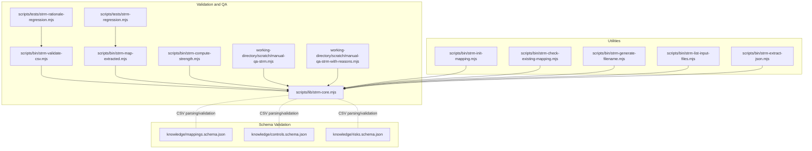
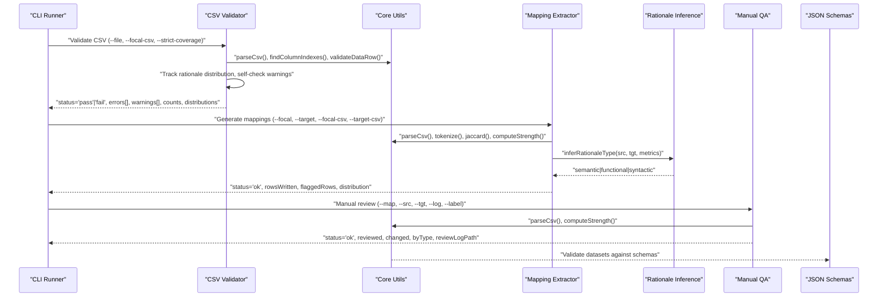
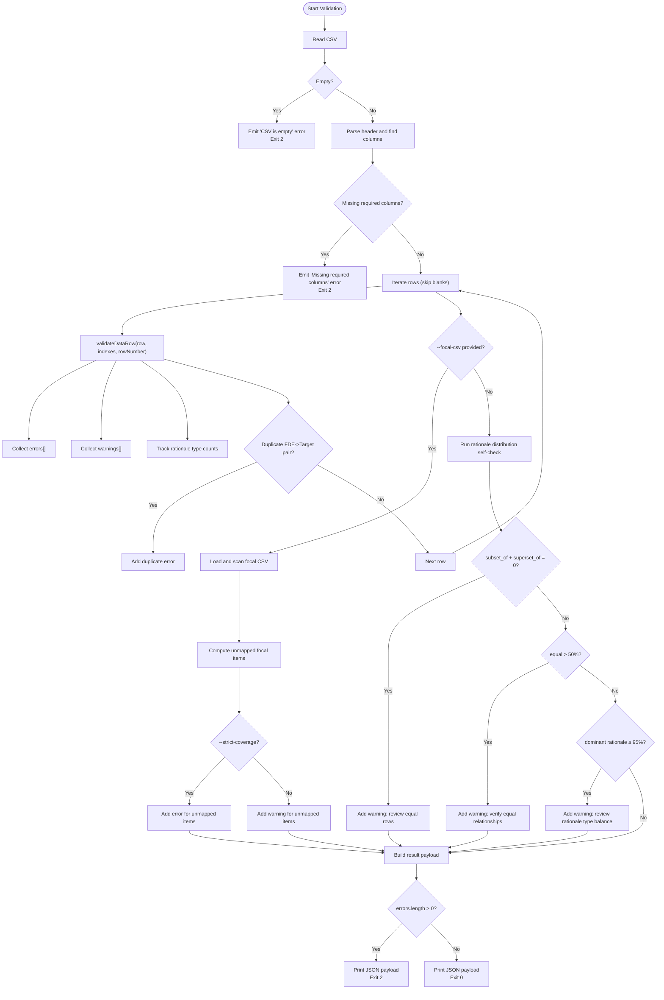
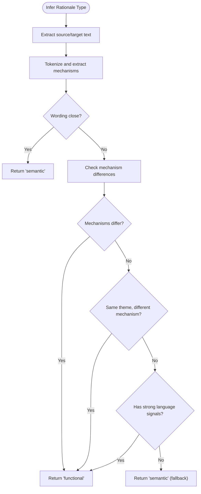
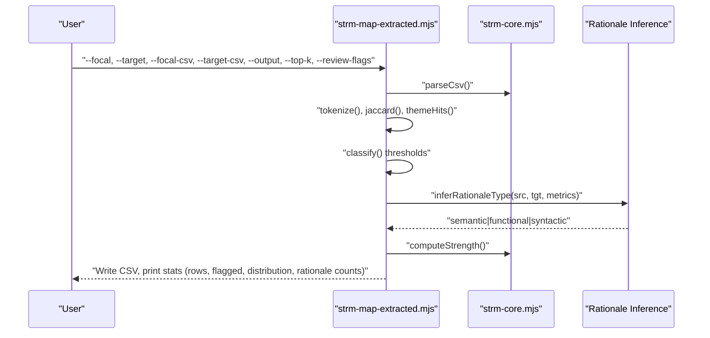
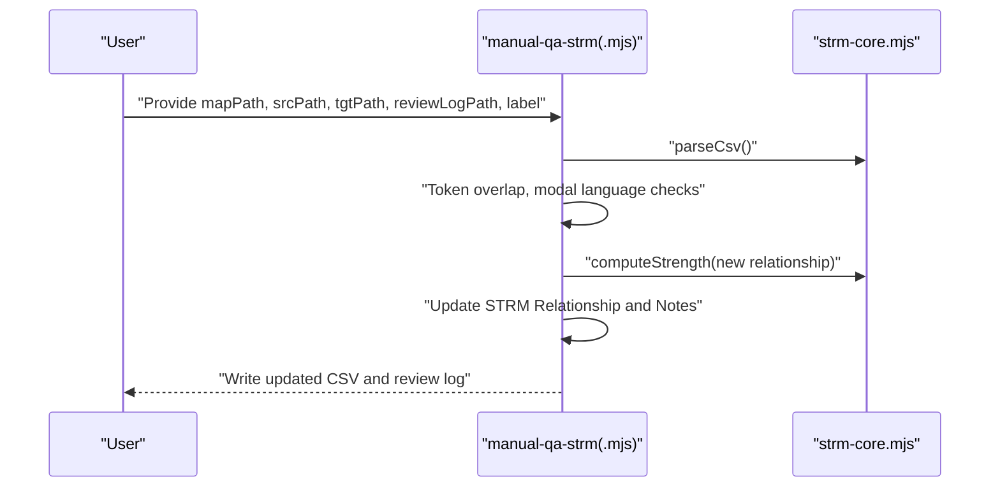
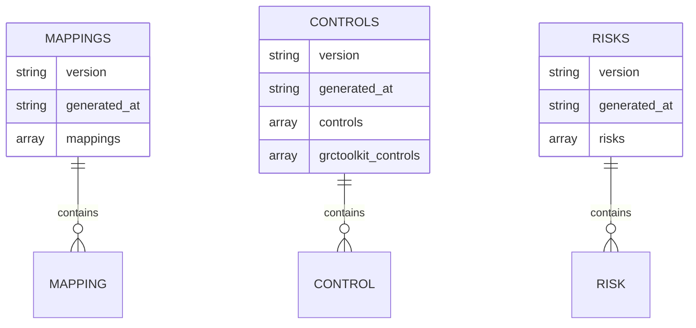
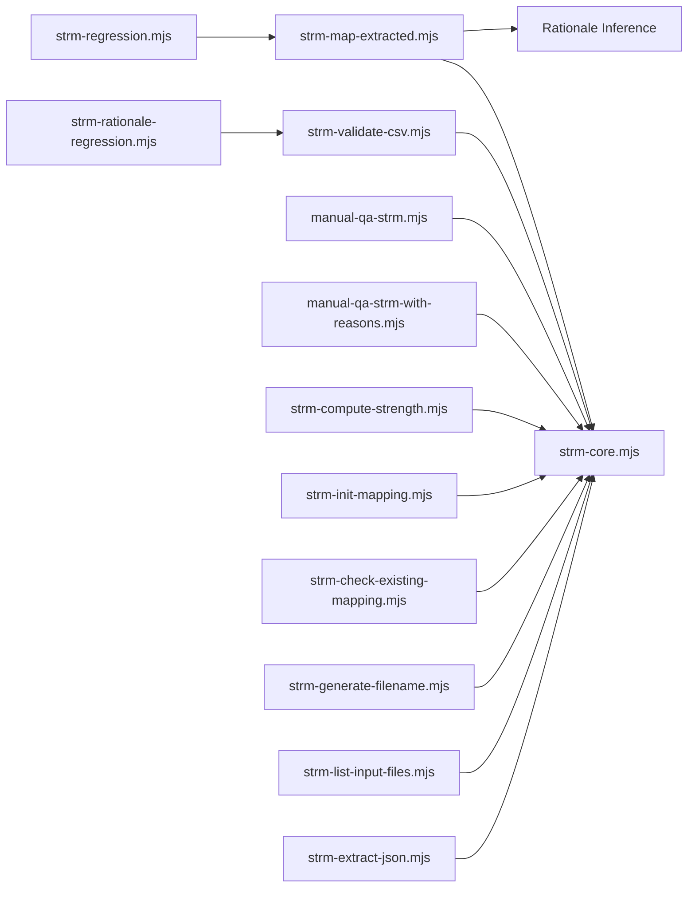

# Quality Assurance and Error Handling

<cite>
**Referenced Files in This Document**
- [strm-validate-csv.mjs](file://scripts/bin/strm-validate-csv.mjs)
- [strm-core.mjs](file://scripts/lib/strm-core.mjs)
- [strm-map-extracted.mjs](file://scripts/bin/strm-map-extracted.mjs)
- [strm-compute-strength.mjs](file://scripts/bin/strm-compute-strength.mjs)
- [strm-init-mapping.mjs](file://scripts/bin/strm-init-mapping.mjs)
- [strm-check-existing-mapping.mjs](file://scripts/bin/strm-check-existing-mapping.mjs)
- [strm-generate-filename.mjs](file://scripts/bin/strm-generate-filename.mjs)
- [strm-list-input-files.mjs](file://scripts/bin/strm-list-input-files.mjs)
- [strm-extract-json.mjs](file://scripts/bin/strm-extract-json.mjs)
- [manual-qa-strm.mjs](file://working-directory/scratch/manual-qa-strm.mjs)
- [manual-qa-strm-with-reasons.mjs](file://working-directory/scratch/manual-qa-strm-with-reasons.mjs)
- [strm-rationale-regression.mjs](file://scripts/tests/strm-rationale-regression.mjs)
- [strm-regression.mjs](file://scripts/tests/strm-regression.mjs)
- [mappings.schema.json](file://knowledge/mappings.schema.json)
- [controls.schema.json](file://knowledge/controls.schema.json)
- [risks.schema.json](file://knowledge/risks.schema.json)
- [CONVENTIONS.md](file://CONVENTIONS.md)
- [AGENTS.md](file://AGENTS.md)
- [GEMINI.md](file://GEMINI.md)
- [README.md](file://README.md)
</cite>

## Update Summary
**Changes Made**
- Added comprehensive documentation for the new automatic rationale type inference system
- Enhanced CSV validation documentation with rationale distribution tracking and self-check warnings
- Updated mapping extraction documentation to include the new rationale classification algorithm
- Added new sections covering the automatic rationale inference workflow
- Updated troubleshooting guide with rationale-related validation failures

## Table of Contents
1. [Introduction](#introduction)
2. [Project Structure](#project-structure)
3. [Core Components](#core-components)
4. [Architecture Overview](#architecture-overview)
5. [Detailed Component Analysis](#detailed-component-analysis)
6. [Dependency Analysis](#dependency-analysis)
7. [Performance Considerations](#performance-considerations)
8. [Troubleshooting Guide](#troubleshooting-guide)
9. [Conclusion](#conclusion)
10. [Appendices](#appendices)

## Introduction
This document focuses on Quality Assurance (QA) and Error Handling within the STRM Mapping project. It explains the multi-layered validation approach (structural, semantic, and mathematical consistency), the error categorization system (critical vs warnings), enforcement of validation rules, and automated quality gates. The system now includes an advanced automatic rationale type inference system that determines semantic, functional, or syntactic relationships based on control descriptions and titles, plus comprehensive rationale distribution tracking and self-check warnings in the CSV validator. It also documents manual review integration points, QA checkpoints, remediation workflows, logging/reporting formats, debugging support, performance monitoring, throughput optimization, batch error recovery, and guidance for extending validation rules and adding custom quality checks.

## Project Structure
The QA and error handling system spans:
- Validation entry points and runners (CSV validator, mapping extractor, strength calculator)
- Core validation and parsing utilities with enhanced rationale validation
- Manual QA scripts for human-in-the-loop review and remediation
- JSON schema definitions for dataset validation
- Conventions and agent/gemini guidance for consistent QA behavior
- Regression tests for rationale inference validation

```mermaid
graph TB
subgraph "Validation and QA"
VCSV["scripts/bin/strm-validate-csv.mjs"]
CORE["scripts/lib/strm-core.mjs"]
MAPX["scripts/bin/strm-map-extracted.mjs"]
STRENGTH["scripts/bin/strm-compute-strength.mjs"]
MANUALEX["working-directory/scratch/manual-qa-strm.mjs"]
MANUALR["working-directory/scratch/manual-qa-strm-with-reasons.mjs"]
REGTEST["scripts/tests/strm-rationale-regression.mjs"]
REGTEST2["scripts/tests/strm-regression.mjs"]
end
subgraph "Schema Validation"
MMAP["knowledge/mappings.schema.json"]
CTRL["knowledge/controls.schema.json"]
RISK["knowledge/risks.schema.json"]
end
subgraph "Utilities"
INIT["scripts/bin/strm-init-mapping.mjs"]
CHECK["scripts/bin/strm-check-existing-mapping.mjs"]
GEN["scripts/bin/strm-generate-filename.mjs"]
LIST["scripts/bin/strm-list-input-files.mjs"]
EXJSON["scripts/bin/strm-extract-json.mjs"]
end
VCSV --> CORE
MAPX --> CORE
STRENGTH --> CORE
MANUALEX --> CORE
MANUALR --> CORE
REGTEST --> VCSV
REGTEST2 --> MAPX
INIT --> CORE
CHECK --> CORE
GEN --> CORE
LIST --> CORE
EXJSON --> CORE
CORE -. "CSV parsing/validation" .- MMAP
CORE -. "CSV parsing/validation" .- CTRL
CORE -. "CSV parsing/validation" .- RISK
```

**Diagram sources**
- [strm-validate-csv.mjs:1-194](file://scripts/bin/strm-validate-csv.mjs#L1-L194)
- [strm-core.mjs:1-367](file://scripts/lib/strm-core.mjs#L1-L367)
- [strm-map-extracted.mjs:160-351](file://scripts/bin/strm-map-extracted.mjs#L160-L351)
- [strm-compute-strength.mjs:1-19](file://scripts/bin/strm-compute-strength.mjs#L1-L19)
- [manual-qa-strm.mjs:1-145](file://working-directory/scratch/manual-qa-strm.mjs#L1-L145)
- [manual-qa-strm-with-reasons.mjs:1-120](file://working-directory/scratch/manual-qa-strm-with-reasons.mjs#L1-L120)
- [strm-rationale-regression.mjs:1-83](file://scripts/tests/strm-rationale-regression.mjs#L1-L83)
- [strm-regression.mjs:190-251](file://scripts/tests/strm-regression.mjs#L190-L251)
- [mappings.schema.json:1-117](file://knowledge/mappings.schema.json#L1-L117)
- [controls.schema.json:1-141](file://knowledge/controls.schema.json#L1-L141)
- [risks.schema.json:1-92](file://knowledge/risks.schema.json#L1-L92)
- [strm-init-mapping.mjs:1-58](file://scripts/bin/strm-init-mapping.mjs#L1-L58)
- [strm-check-existing-mapping.mjs:1-20](file://scripts/bin/strm-check-existing-mapping.mjs#L1-L20)
- [strm-generate-filename.mjs:1-19](file://scripts/bin/strm-generate-filename.mjs#L1-L19)
- [strm-list-input-files.mjs:1-12](file://scripts/bin/strm-list-input-files.mjs#L1-L12)
- [strm-extract-json.mjs:1-354](file://scripts/bin/strm-extract-json.mjs#L1-L354)

**Section sources**
- [README.md:1-85](file://README.md#L1-L85)
- [CONVENTIONS.md:1-207](file://CONVENTIONS.md#L1-L207)
- [AGENTS.md:1-141](file://AGENTS.md#L1-L141)
- [GEMINI.md:1-232](file://GEMINI.md#L1-L232)

## Core Components
- CSV Validator: Validates CSV structure, required columns, row-level constraints, duplication detection, optional coverage checks against a focal dataset, rationale distribution tracking, and emits pass/fail with counts and categorized messages including new self-check warnings.
- Core Utilities: CSV parser/tokenizer, header normalization, column index resolution, strength computation with rationale type validation, filename generation, artifact directory resolution, and file discovery helpers.
- Mapping Extractor: Automated mapping generator with semantic similarity scoring, confidence assignment, rationale generation, automatic rationale type inference, and optional review flags.
- Manual QA Scripts: Human-in-the-loop scripts that adjust STRM relationships based on textual overlap and modal language, updating strengths and notes.
- Schema Definitions: JSON Schemas for mappings, controls, and risks to enforce structural and semantic correctness of datasets.
- Utilities: Initialization of mapping CSVs, checking for existing mappings, filename generation, input file listing, and JSON extraction to CSV.
- Regression Tests: Comprehensive test suites validating rationale inference behavior and edge cases.

**Section sources**
- [strm-validate-csv.mjs:1-194](file://scripts/bin/strm-validate-csv.mjs#L1-L194)
- [strm-core.mjs:1-367](file://scripts/lib/strm-core.mjs#L1-L367)
- [strm-map-extracted.mjs:160-351](file://scripts/bin/strm-map-extracted.mjs#L160-L351)
- [manual-qa-strm.mjs:1-145](file://working-directory/scratch/manual-qa-strm.mjs#L1-L145)
- [manual-qa-strm-with-reasons.mjs:1-120](file://working-directory/scratch/manual-qa-strm-with-reasons.mjs#L1-L120)
- [strm-rationale-regression.mjs:1-83](file://scripts/tests/strm-rationale-regression.mjs#L1-L83)
- [strm-regression.mjs:190-251](file://scripts/tests/strm-regression.mjs#L190-L251)
- [mappings.schema.json:1-117](file://knowledge/mappings.schema.json#L1-L117)
- [controls.schema.json:1-141](file://knowledge/controls.schema.json#L1-L141)
- [risks.schema.json:1-92](file://knowledge/risks.schema.json#L1-L92)

## Architecture Overview
The QA architecture integrates automated validation, rationale inference, and manual review:

```mermaid
sequenceDiagram
participant CLI as "CLI Runner"
participant VAL as "CSV Validator"
participant CORE as "Core Utils"
participant MAPX as "Mapping Extractor"
participant INF as "Rationale Inference"
participant MAN as "Manual QA"
participant SCH as "JSON Schemas"
CLI->>VAL : "Validate CSV (--file, --focal-csv, --strict-coverage)"
VAL->>CORE : "parseCsv(), findColumnIndexes(), validateDataRow()"
VAL->>VAL : "Track rationale distribution, self-check warnings"
VAL-->>CLI : "status='pass'|'fail', errors[], warnings[], counts, distributions"
CLI->>MAPX : "Generate mappings (--focal, --target, --focal-csv, --target-csv)"
MAPX->>CORE : "parseCsv(), tokenize(), jaccard(), computeStrength()"
MAPX->>INF : "inferRationaleType(src, tgt, metrics)"
INF-->>MAPX : "semantic|functional|syntactic"
MAPX-->>CLI : "status='ok', rowsWritten, flaggedRows, distribution"
CLI->>MAN : "Manual review (--map, --src, --tgt, --log, --label)"
MAN->>CORE : "parseCsv(), computeStrength()"
MAN-->>CLI : "status='ok', reviewed, changed, byType, reviewLogPath"
CORE-->>SCH : "Validate datasets against schemas"
```

**Diagram sources**
- [strm-validate-csv.mjs:1-194](file://scripts/bin/strm-validate-csv.mjs#L1-L194)
- [strm-core.mjs:1-367](file://scripts/lib/strm-core.mjs#L1-L367)
- [strm-map-extracted.mjs:160-351](file://scripts/bin/strm-map-extracted.mjs#L160-L351)
- [manual-qa-strm.mjs:1-145](file://working-directory/scratch/manual-qa-strm.mjs#L1-L145)
- [mappings.schema.json:1-117](file://knowledge/mappings.schema.json#L1-L117)

## Detailed Component Analysis

### Enhanced CSV Validation Pipeline
Multi-layered validation with rationale distribution tracking:
- Structural validation: Empty CSV, required columns, header placeholders unresolved.
- Semantic validation: Row-level constraints (empty cells, required fields, controlled vocabularies).
- Mathematical consistency checks: Strength score recomputation and mismatch detection.
- Coverage checks: Optional unmapped focal items detection against a focal CSV.
- **New**: Rationale distribution tracking and self-check warnings for balanced rationale types.
- Error categorization: Critical errors halt processing; warnings suggest improvements.

```mermaid
flowchart TD
Start(["Start Validation"]) --> Read["Read CSV"]
Read --> EmptyCheck{"Empty?"}
EmptyCheck --> |Yes| FailEmpty["Emit 'CSV is empty' error<br/>Exit 2"]
EmptyCheck --> |No| Header["Parse header and find columns"]
Header --> MissingCols{"Missing required columns?"}
MissingCols --> |Yes| FailCols["Emit 'Missing required columns' error<br/>Exit 2"]
MissingCols --> |No| Iterate["Iterate rows (skip blanks)"]
Iterate --> ValidateRow["validateDataRow(row, indexes, rowNumber)"]
ValidateRow --> CollectErr["Collect errors[]"]
ValidateRow --> CollectWarn["Collect warnings[]"]
ValidateRow --> TrackRationale["Track rationale type counts"]
ValidateRow --> DupCheck{"Duplicate FDE->Target pair?"}
DupCheck --> |Yes| AddDup["Add duplicate error"]
DupCheck --> |No| NextRow["Next row"]
NextRow --> Iterate
Iterate --> FocalCheck{"--focal-csv provided?"}
FocalCheck --> |Yes| LoadFocal["Load and scan focal CSV"]
LoadFocal --> Coverage["Compute unmapped focal items"]
Coverage --> Strict{"--strict-coverage?"}
Strict --> |Yes| AddErrStrict["Add error for unmapped items"]
Strict --> |No| AddWarnStrict["Add warning for unmapped items"]
FocalCheck --> |No| SelfCheck["Run rationale distribution self-check"]
SelfCheck --> SubsetSuperset{"subset_of + superset_of = 0?"}
SubsetSuperset --> |Yes| AddSubsetWarn["Add warning: review equal rows"]
SubsetSuperset --> |No| EqualPct{"equal > 50%?"}
EqualPct --> |Yes| AddEqualWarn["Add warning: verify equal relationships"]
EqualPct --> |No| DominantRationale{"dominant rationale ≥ 95%?"}
DominantRationale --> |Yes| AddDomWarn["Add warning: review rationale type balance"]
DominantRationale --> |No| BuildPayload["Build result payload"]
AddErrStrict --> BuildPayload
AddWarnStrict --> BuildPayload
AddSubsetWarn --> BuildPayload
AddEqualWarn --> BuildPayload
AddDomWarn --> BuildPayload
BuildPayload --> Status{"errors.length > 0?"}
Status --> |Yes| ExitFail["Print JSON payload<br/>Exit 2"]
Status --> |No| ExitPass["Print JSON payload<br/>Exit 0"]
```

**Diagram sources**
- [strm-validate-csv.mjs:1-194](file://scripts/bin/strm-validate-csv.mjs#L1-L194)
- [strm-core.mjs:206-289](file://scripts/lib/strm-core.mjs#L206-L289)

**Section sources**
- [strm-validate-csv.mjs:1-194](file://scripts/bin/strm-validate-csv.mjs#L1-L194)
- [strm-core.mjs:206-289](file://scripts/lib/strm-core.mjs#L206-L289)

### Automatic Rationale Type Inference System
**New**: The mapping extractor now includes an intelligent rationale type inference system that automatically classifies relationships as semantic, functional, or syntactic based on control characteristics:

- **Semantic Rationale**: Close wording and intent matches (title lexical ≥ 0.45 OR lexical ≥ 0.38 OR (score ≥ 0.34 AND overlap ≥ 1))
- **Functional Rationale**: Same outcome through different mechanisms (mechanism signals differ OR same theme different mechanism OR strong language signals)
- **Syntactic Rationale**: Minimal word-level similarity (default fallback)

```mermaid
flowchart TD
Start(["Infer Rationale Type"]) --> ExtractText["Extract source/target text"]
ExtractText --> Tokenize["Tokenize and extract mechanisms"]
Tokenize --> WordingClose{"Wording close?"}
WordingClose --> |Yes| ReturnSemantic["Return 'semantic'"]
WordingClose --> |No| CheckMechanisms["Check mechanism differences"]
CheckMechanisms --> MechanismDiffer{"Mechanisms differ?"}
MechanismDiffer --> |Yes| ReturnFunctional["Return 'functional'"]
MechanismDiffer --> |No| CheckThemes{"Same theme, different mechanism?"}
CheckThemes --> |Yes| ReturnFunctional
CheckThemes --> |No| CheckStrong{"Has strong language signals?"}
CheckStrong --> |Yes| ReturnFunctional
CheckStrong --> |No| ReturnSemanticFallback["Return 'semantic' (fallback)"]
```

**Diagram sources**
- [strm-map-extracted.mjs:167-210](file://scripts/bin/strm-map-extracted.mjs#L167-L210)

**Section sources**
- [strm-map-extracted.mjs:167-210](file://scripts/bin/strm-map-extracted.mjs#L167-L210)

### Mapping Extraction and Automated QA
Automated mapping pipeline with built-in quality signals and rationale inference:
- Text preprocessing and tokenization
- Lexical and thematic overlap scoring
- Relationship classification with thresholds
- **Enhanced**: Automatic rationale type inference with semantic, functional, syntactic classification
- Confidence assignment and rationale generation
- Optional review flags for borderline cases

```mermaid
sequenceDiagram
participant User as "User"
participant MAPX as "strm-map-extracted.mjs"
participant CORE as "strm-core.mjs"
participant INF as "Rationale Inference"
User->>MAPX : "--focal, --target, --focal-csv, --target-csv, --output, --top-k, --review-flags"
MAPX->>CORE : "parseCsv()"
MAPX->>MAPX : "tokenize(), jaccard(), themeHits()"
MAPX->>MAPX : "classify() thresholds"
MAPX->>INF : "inferRationaleType(src, tgt, metrics)"
INF-->>MAPX : "semantic|functional|syntactic"
MAPX->>CORE : "computeStrength()"
MAPX-->>User : "Write CSV, print stats (rows, flagged, distribution, rationale counts)"
```

**Diagram sources**
- [strm-map-extracted.mjs:160-351](file://scripts/bin/strm-map-extracted.mjs#L160-L351)
- [strm-core.mjs:35-57](file://scripts/lib/strm-core.mjs#L35-L57)

**Section sources**
- [strm-map-extracted.mjs:160-351](file://scripts/bin/strm-map-extracted.mjs#L160-L351)
- [strm-core.mjs:35-57](file://scripts/lib/strm-core.mjs#L35-L57)

### Manual Review Integration and Remediation
Manual QA scripts adjust STRM relationships based on textual overlap and modal language, then update strengths and notes, and produce a review log.

```mermaid
sequenceDiagram
participant User as "User"
participant MAN as "manual-qa-strm(.mjs)"
participant CORE as "strm-core.mjs"
User->>MAN : "Provide mapPath, srcPath, tgtPath, reviewLogPath, label"
MAN->>CORE : "parseCsv()"
MAN->>MAN : "Token overlap, modal language checks"
MAN->>CORE : "computeStrength(new relationship)"
MAN->>MAN : "Update STRM Relationship and Notes"
MAN-->>User : "Write updated CSV and review log"
```

**Diagram sources**
- [manual-qa-strm.mjs:1-145](file://working-directory/scratch/manual-qa-strm.mjs#L1-L145)
- [manual-qa-strm-with-reasons.mjs:1-120](file://working-directory/scratch/manual-qa-strm-with-reasons.mjs#L1-L120)
- [strm-core.mjs:35-57](file://scripts/lib/strm-core.mjs#L35-L57)

**Section sources**
- [manual-qa-strm.mjs:1-145](file://working-directory/scratch/manual-qa-strm.mjs#L1-L145)
- [manual-qa-strm-with-reasons.mjs:1-120](file://working-directory/scratch/manual-qa-strm-with-reasons.mjs#L1-L120)

### JSON Schema-Based Structural Validation
JSON Schemas define structural and semantic constraints for mappings, controls, and risks, enabling dataset-level validation and consistency checks.

```mermaid
erDiagram
MAPPINGS {
string version
string generated_at
array mappings
}
CONTROLS {
string version
string generated_at
array controls
array grctoolkit_controls
}
RISKS {
string version
string generated_at
array risks
}
MAPPINGS ||--o{ MAPPING : "contains"
CONTROLS ||--o{ CONTROL : "contains"
RISKS ||--o{ RISK : "contains"
```

**Diagram sources**
- [mappings.schema.json:1-117](file://knowledge/mappings.schema.json#L1-L117)
- [controls.schema.json:1-141](file://knowledge/controls.schema.json#L1-L141)
- [risks.schema.json:1-92](file://knowledge/risks.schema.json#L1-L92)

**Section sources**
- [mappings.schema.json:1-117](file://knowledge/mappings.schema.json#L1-L117)
- [controls.schema.json:1-141](file://knowledge/controls.schema.json#L1-L141)
- [risks.schema.json:1-92](file://knowledge/risks.schema.json#L1-L92)

### Logging, Reporting, and Debugging Support
- CSV Validator: Emits JSON payloads with status, counts, categorized messages, rationale distribution statistics, and self-check warnings; exits with non-zero codes on failure.
- Mapping Extractor: Emits JSON with statistics, distribution, rationale counts, and optionally flags rows needing review.
- Manual QA: Produces a Markdown review log summarizing changes and reasons.
- Utilities: Provide deterministic filenames, artifact directories, and input file listings for reproducibility.
- **New**: Comprehensive rationale distribution tracking and self-check warnings for balanced validation.

**Section sources**
- [strm-validate-csv.mjs:176-194](file://scripts/bin/strm-validate-csv.mjs#L176-L194)
- [strm-map-extracted.mjs:328-351](file://scripts/bin/strm-map-extracted.mjs#L328-L351)
- [manual-qa-strm.mjs:126-145](file://working-directory/scratch/manual-qa-strm.mjs#L126-L145)
- [strm-init-mapping.mjs:36-58](file://scripts/bin/strm-init-mapping.mjs#L36-L58)
- [strm-generate-filename.mjs:9-19](file://scripts/bin/strm-generate-filename.mjs#L9-L19)
- [strm-list-input-files.mjs:9-12](file://scripts/bin/strm-list-input-files.mjs#L9-L12)

## Dependency Analysis
Key dependencies and coupling:
- CSV Validator depends on Core Utilities for parsing, indexing, row validation, and rationale distribution tracking.
- Mapping Extractor depends on Core Utilities for parsing, tokenization, strength computation, and rationale inference.
- Manual QA scripts depend on Core Utilities for CSV parsing and strength recomputation.
- Utilities depend on Core Utilities for filename generation, artifact directories, and file discovery.
- **New**: Rationale inference system integrates with mapping extraction and validation components.

```mermaid
graph LR
VCSV["strm-validate-csv.mjs"] --> CORE["strm-core.mjs"]
MAPX["strm-map-extracted.mjs"] --> CORE
MAPX --> INF["Rationale Inference"]
MANUALEX["manual-qa-strm.mjs"] --> CORE
MANUALR["manual-qa-strm-with-reasons.mjs"] --> CORE
STRENGTH["strm-compute-strength.mjs"] --> CORE
INIT["strm-init-mapping.mjs"] --> CORE
CHECK["strm-check-existing-mapping.mjs"] --> CORE
GEN["strm-generate-filename.mjs"] --> CORE
LIST["strm-list-input-files.mjs"] --> CORE
EXJSON["strm-extract-json.mjs"] --> CORE
REGTEST["strm-rationale-regression.mjs"] --> VCSV
REGTEST2["strm-regression.mjs"] --> MAPX
```

**Diagram sources**
- [strm-validate-csv.mjs:1-194](file://scripts/bin/strm-validate-csv.mjs#L1-L194)
- [strm-core.mjs:1-367](file://scripts/lib/strm-core.mjs#L1-L367)
- [strm-map-extracted.mjs:160-351](file://scripts/bin/strm-map-extracted.mjs#L160-L351)
- [manual-qa-strm.mjs:1-145](file://working-directory/scratch/manual-qa-strm.mjs#L1-L145)
- [manual-qa-strm-with-reasons.mjs:1-120](file://working-directory/scratch/manual-qa-strm-with-reasons.mjs#L1-L120)
- [strm-compute-strength.mjs:1-19](file://scripts/bin/strm-compute-strength.mjs#L1-L19)
- [strm-init-mapping.mjs:1-58](file://scripts/bin/strm-init-mapping.mjs#L1-L58)
- [strm-check-existing-mapping.mjs:1-20](file://scripts/bin/strm-check-existing-mapping.mjs#L1-L20)
- [strm-generate-filename.mjs:1-19](file://scripts/bin/strm-generate-filename.mjs#L1-L19)
- [strm-list-input-files.mjs:1-12](file://scripts/bin/strm-list-input-files.mjs#L1-L12)
- [strm-extract-json.mjs:1-354](file://scripts/bin/strm-extract-json.mjs#L1-L354)
- [strm-rationale-regression.mjs:1-83](file://scripts/tests/strm-rationale-regression.mjs#L1-L83)
- [strm-regression.mjs:190-251](file://scripts/tests/strm-regression.mjs#L190-L251)

**Section sources**
- [strm-core.mjs:1-367](file://scripts/lib/strm-core.mjs#L1-L367)

## Performance Considerations
- Throughput optimization:
  - Minimize repeated file reads by batching operations and caching parsed datasets.
  - Use streaming-like row-wise processing to avoid loading entire CSVs into memory when possible.
  - Parallelize independent row validations or mapping computations where feasible.
  - **New**: Cache rationale inference results for repeated source/target combinations.
- Batch processing error recovery:
  - Separate critical errors (halt) from warnings (continue) to maximize successful batch completion.
  - Implement checkpointing for long-running mapping extractions to resume from last processed row.
  - **New**: Track rationale distribution progress during batch processing for better error recovery.
- Validation overhead:
  - Defer expensive computations (e.g., tokenization and overlap scoring) until necessary.
  - Cache intermediate results (e.g., token sets) to reduce recomputation.
  - **New**: Optimize rationale inference by precomputing mechanism patterns and theme intersections.
- I/O and disk:
  - Write outputs to dedicated artifact directories to avoid filesystem contention.
  - Use asynchronous I/O and avoid synchronous operations in hot loops.
  - **New**: Implement rationale distribution statistics collection for performance monitoring.

[No sources needed since this section provides general guidance]

## Troubleshooting Guide
Common validation failures and resolutions with rationale-specific issues:

### CSV Validation Issues
- CSV is empty:
  - Cause: Empty input file.
  - Resolution: Provide a valid CSV with at least a header row.
  - Evidence: [strm-validate-csv.mjs:30-33](file://scripts/bin/strm-validate-csv.mjs#L30-L33)
- Missing required columns:
  - Cause: Header lacks required keys.
  - Resolution: Ensure canonical header columns are present; see conventions.
  - Evidence: [strm-validate-csv.mjs:37-49](file://scripts/bin/strm-validate-csv.mjs#L37-L49), [CONVENTIONS.md:115-135](file://CONVENTIONS.md#L115-L135)
- Unresolved target header placeholders:
  - Cause: Column headers still contain unresolved <Target> placeholders.
  - Resolution: Replace <Target> with the actual target framework name.
  - Evidence: [strm-validate-csv.mjs:69-79](file://scripts/bin/strm-validate-csv.mjs#L69-L79)
- Duplicate mapping pairs:
  - Cause: Same FDE mapped to the same Target ID multiple times.
  - Resolution: Remove duplicates or consolidate rows.
  - Evidence: [strm-validate-csv.mjs:103-111](file://scripts/bin/strm-validate-csv.mjs#L103-L111)
- Strength mismatch:
  - Cause: Manually entered strength does not match computed score.
  - Resolution: Recompute strength using the provided calculator or reassign relationship/confidence/rationale.
  - Evidence: [strm-validate-csv.mjs:248-252](file://scripts/bin/strm-validate-csv.mjs#L248-L252), [strm-compute-strength.mjs:1-19](file://scripts/bin/strm-compute-strength.mjs#L1-L19)

### Rationale Distribution Issues
- **New**: Rationale distribution self-check warnings:
  - **Subset/Superset Warning**: "subset_of + superset_of = 0. Review equal rows; containment may be underused."
  - **Equal Percentage Warning**: "equal = X% (>50%). Reconfirm that scope and obligation are truly identical for equal rows."
  - **Dominant Rationale Warning**: "Rationale distribution self-check: semantic = Y% (Z/W). Review whether semantic vs functional distinctions are being applied row-by-row."
  - Resolution: Review rationale assignments and ensure balanced distribution across semantic, functional, and syntactic types.

### Rationale Classification Issues
- **New**: Rationale type validation warnings:
  - Syntactic rationale warnings: "syntactic rationale is uncommon; verify intent."
  - Mixed obligation language: "equal rationale contains mixed obligation language (SHALL/SHOULD). Reconfirm this is not subset_of/superset_of."
  - Containment wording: "subset_of rationale should explain containment direction using explicit scope language."
  - Resolution: Use semantic rationale for close wording matches, functional for same outcomes via different mechanisms, and syntactic only for minimal word-level similarity.

### Coverage and Quality Issues
- Low confidence warnings:
  - Cause: Low confidence used without justification.
  - Resolution: Prefer high confidence; use medium only for ambiguous cases; reserve low for significant inference.
  - Evidence: [strm-validate-csv.mjs:263-265](file://scripts/bin/strm-validate-csv.mjs#L263-L265), [CONVENTIONS.md:82-84](file://CONVENTIONS.md#L82-L84)
- Syntactic rationale warnings:
  - Cause: Overuse of syntactic rationale.
  - Resolution: Prefer semantic or functional rationales; use syntactic only for minimal word-level similarity.
  - Evidence: [strm-validate-csv.mjs:260-262](file://scripts/bin/strm-validate-csv.mjs#L260-L262), [CONVENTIONS.md:83](file://CONVENTIONS.md#L83)
- Coverage gaps:
  - Cause: Focal controls not covered by output mappings.
  - Resolution: Investigate and map uncovered controls; use strict coverage mode to enforce.
  - Evidence: [strm-validate-csv.mjs:141-174](file://scripts/bin/strm-validate-csv.mjs#L141-L174)
- Manual review adjustments:
  - Cause: Initial automated mapping misclassification.
  - Resolution: Run manual QA scripts to refine relationships and update strengths.
  - Evidence: [manual-qa-strm.mjs:88-115](file://working-directory/scratch/manual-qa-strm.mjs#L88-L115), [manual-qa-strm-with-reasons.mjs:68-96](file://working-directory/scratch/manual-qa-strm-with-reasons.mjs#L68-L96)

**Section sources**
- [strm-validate-csv.mjs:1-194](file://scripts/bin/strm-validate-csv.mjs#L1-L194)
- [strm-compute-strength.mjs:1-19](file://scripts/bin/strm-compute-strength.mjs#L1-L19)
- [manual-qa-strm.mjs:1-145](file://working-directory/scratch/manual-qa-strm.mjs#L1-L145)
- [manual-qa-strm-with-reasons.mjs:1-120](file://working-directory/scratch/manual-qa-strm-with-reasons.mjs#L1-L120)
- [CONVENTIONS.md:82-135](file://CONVENTIONS.md#L82-L135)
- [strm-rationale-regression.mjs:43-63](file://scripts/tests/strm-rationale-regression.mjs#L43-L63)
- [strm-regression.mjs:226-229](file://scripts/tests/strm-regression.mjs#L226-L229)

## Conclusion
The STRM Mapping project implements a robust, layered QA system combining structural, semantic, and mathematical validation with automated quality gates and human-in-the-loop remediation. The system now includes an advanced automatic rationale type inference system that intelligently classifies relationships as semantic, functional, or syntactic based on control characteristics, plus comprehensive rationale distribution tracking and self-check warnings. The system provides clear error categories, actionable logs, and deterministic utilities to ensure high-quality mappings aligned with NIST IR 8477 methodology. Extensibility is supported through modular components, schema-driven validation, and intelligent rationale inference capabilities.

[No sources needed since this section summarizes without analyzing specific files]

## Appendices

### Automated Quality Gates and Checkpoints
- CSV Validation Gate: Enforces structural and semantic rules; halts on critical errors; tracks rationale distribution and provides self-check warnings.
- Mapping Extraction Gate: Flags borderline cases for review; maintains distribution statistics; performs automatic rationale type inference.
- Manual QA Gate: Adjusts relationships and updates strengths; generates review logs.
- Schema Validation Gate: Ensures dataset-level structural and semantic integrity.
- **New**: Rationale Distribution Gate: Monitors and validates balanced distribution of rationale types across mappings.

**Section sources**
- [strm-validate-csv.mjs:1-194](file://scripts/bin/strm-validate-csv.mjs#L1-L194)
- [strm-map-extracted.mjs:160-351](file://scripts/bin/strm-map-extracted.mjs#L160-L351)
- [manual-qa-strm.mjs:126-145](file://working-directory/scratch/manual-qa-strm.mjs#L126-L145)
- [mappings.schema.json:1-117](file://knowledge/mappings.schema.json#L1-L117)

### Extending Validation Rules and Adding Custom Quality Checks
- Add new CSV validation rules in the row validation function and propagate messages to the validator.
- Introduce new schema constraints in the appropriate JSON schema file to enforce structural/semantic rules.
- Extend manual QA heuristics by adding new conditions in the manual review scripts and updating the review log format.
- Integrate new quality metrics in the mapping extractor and update the rationale/note generation logic.
- **New**: Enhance rationale inference system by adding new mechanism patterns and theme detection algorithms.
- **New**: Add custom rationale distribution thresholds and self-check validation rules.

**Section sources**
- [strm-core.mjs:206-289](file://scripts/lib/strm-core.mjs#L206-L289)
- [mappings.schema.json:1-117](file://knowledge/mappings.schema.json#L1-L117)
- [manual-qa-strm.mjs:88-115](file://working-directory/scratch/manual-qa-strm.mjs#L88-L115)
- [strm-map-extracted.mjs:160-351](file://scripts/bin/strm-map-extracted.mjs#L160-L351)
- [strm-rationale-regression.mjs:1-83](file://scripts/tests/strm-rationale-regression.mjs#L1-L83)

### Rationale Type Inference Algorithm Details
**New**: The automatic rationale inference system uses the following algorithm:

#### Semantic Rationale Detection
- Close wording matches: `titleLexical >= 0.45 OR lexical >= 0.38 OR (score >= 0.34 AND overlap >= 1)`
- Mechanism patterns: Backup, redundancy, review, authentication, encryption, monitoring, reporting

#### Functional Rationale Detection  
- Mechanism differences: `srcMechanisms.size > 0 AND tgtMechanisms.size > 0 AND [...srcMechanisms].every(label => !tgtMechanisms.has(label))`
- Same theme, different mechanisms: `overlap > 0 OR (srcThemes.size > 0 AND tgtThemes.size > 0)`
- Strong language signals: `hasStrong(srcText) OR hasStrong(tgtText)`

#### Syntactic Rationale Detection
- Default fallback when no other criteria match
- Used only for minimal word-level similarity (<1%)

**Section sources**
- [strm-map-extracted.mjs:167-210](file://scripts/bin/strm-map-extracted.mjs#L167-L210)
- [strm-core.mjs:29-33](file://scripts/lib/strm-core.mjs#L29-L33)