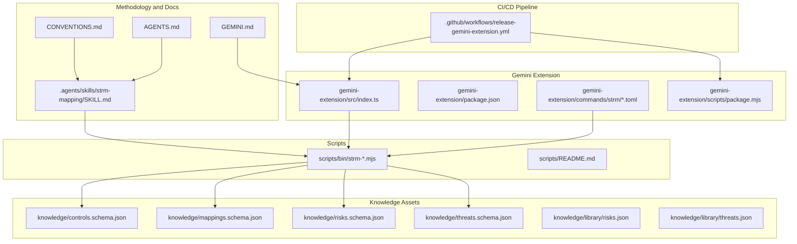
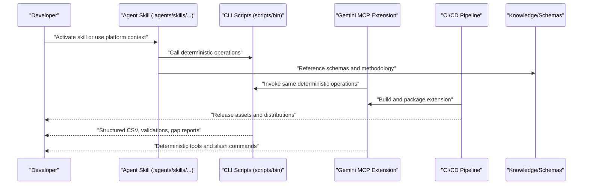
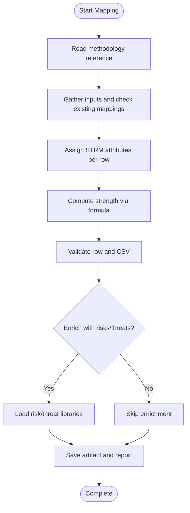
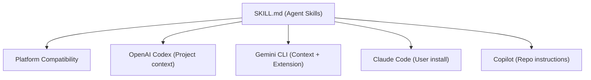
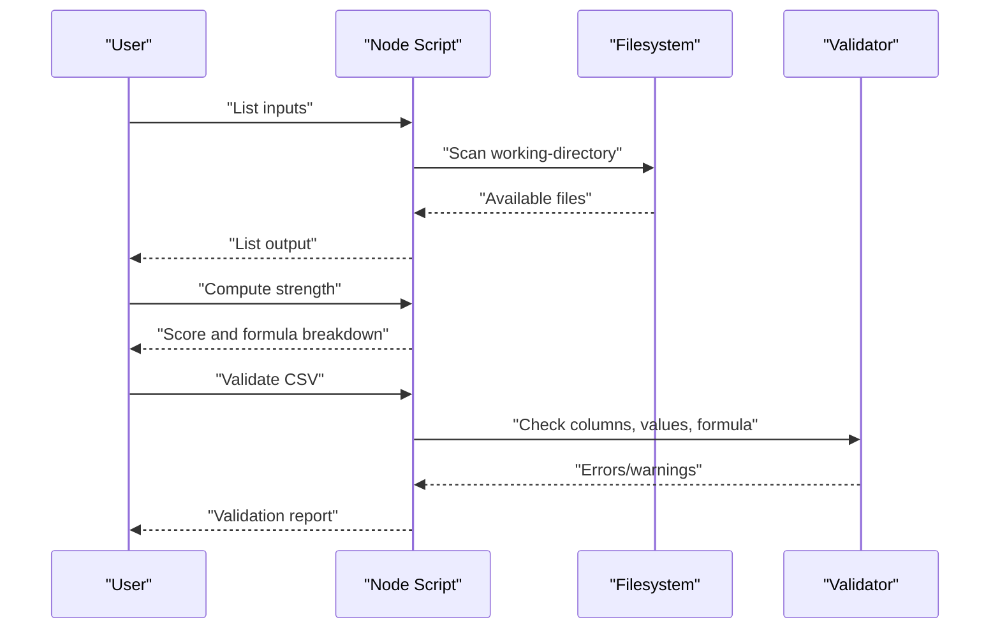
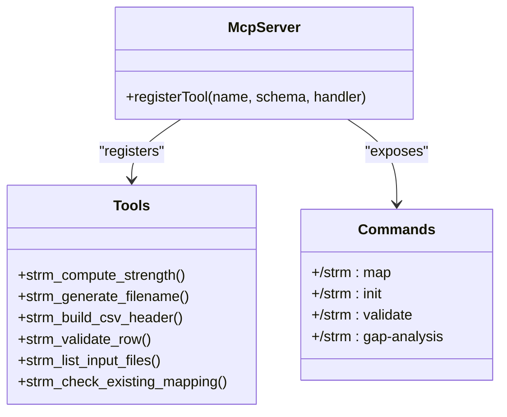
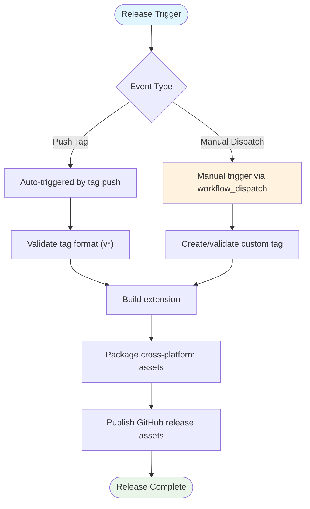
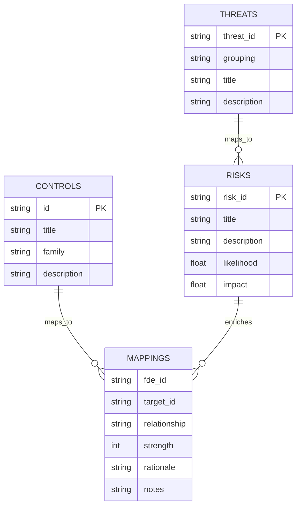
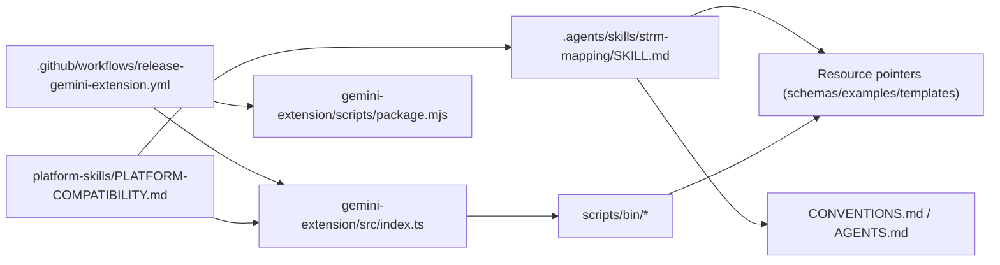

# Development and Contributing Guidelines

<cite>
**Referenced Files in This Document**
- [CONVENTIONS.md](file://CONVENTIONS.md)
- [AGENTS.md](file://AGENTS.md)
- [README.md](file://README.md)
- [scripts/README.md](file://scripts/README.md)
- [gemini-extension/GEMINI.md](file://gemini-extension/GEMINI.md)
- [gemini-extension/package.json](file://gemini-extension/package.json)
- [gemini-extension/src/index.ts](file://gemini-extension/src/index.ts)
- [gemini-extension/commands/strm/map.toml](file://gemini-extension/commands/strm/map.toml)
- [gemini-extension/commands/strm/init.toml](file://gemini-extension/commands/strm/init.toml)
- [gemini-extension/commands/strm/validate.toml](file://gemini-extension/commands/strm/validate.toml)
- [gemini-extension/commands/strm/gap-analysis.toml](file://gemini-extension/commands/strm/gap-analysis.toml)
- [gemini-extension/scripts/package.mjs](file://gemini-extension/scripts/package.mjs)
- [.github/workflows/release-gemini-extension.yml](file://.github/workflows/release-gemini-extension.yml)
- [platform-skills/PLATFORM-COMPATIBILITY.md](file://platform-skills/PLATFORM-COMPATIBILITY.md)
- [.agents/skills/strm-mapping/SKILL.md](file://.agents/skills/strm-mapping/SKILL.md)
- [.agents/skills/strm-mapping/agents/openai.yaml](file://.agents/skills/strm-mapping/agents/openai.yaml)
- [knowledge/controls.schema.json](file://knowledge/controls.schema.json)
- [knowledge/mappings.schema.json](file://knowledge/mappings.schema.json)
- [knowledge/risks.schema.json](file://knowledge/risks.schema.json)
- [knowledge/threats.schema.json](file://knowledge/threats.schema.json)
- [knowledge/library/risks.json](file://knowledge/library/risks.json)
- [knowledge/library/threats.json](file://knowledge/library/threats.json)
- [TEMPLATE_Set Theory Relationship Mapping (STRM).csv](file://TEMPLATE_Set Theory Relationship Mapping (STRM).csv)
</cite>

## Update Summary
**Changes Made**
- Added comprehensive CI/CD release process documentation with manual trigger capabilities
- Enhanced tag management procedures for development workflows
- Updated release management section to reflect automated release pipeline
- Added detailed workflow dispatch configuration and tag validation processes

## Table of Contents
1. [Introduction](#introduction)
2. [Project Structure](#project-structure)
3. [Core Components](#core-components)
4. [Architecture Overview](#architecture-overview)
5. [Detailed Component Analysis](#detailed-component-analysis)
6. [Dependency Analysis](#dependency-analysis)
7. [Performance Considerations](#performance-considerations)
8. [Troubleshooting Guide](#troubleshooting-guide)
9. [Contribution Guidelines](#contribution-guidelines)
10. [CI/CD Release Process](#cicd-release-process)
11. [Extension Points and Customization](#extension-points-and-customization)
12. [Release Management and Backward Compatibility](#release-management-and-backward-compatibility)
13. [Debugging and Optimization Strategies](#debugging-and-optimization-strategies)
14. [Templates and Documentation Standards](#templates-and-documentation-standards)
15. [Conclusion](#conclusion)

## Introduction
This document defines the development and contributing guidelines for the STRM toolkit. It consolidates the coding conventions, development workflow, testing and quality assurance procedures, contribution and pull request processes, extension points for new mapping types and AI assistants, CI/CD release automation, and operational practices for maintaining backward compatibility and releasing updates. The guidance is grounded in the repository's conventions and skills documentation.

## Project Structure
The STRM toolkit is organized around a shared methodology and cross-platform integration layer:
- Methodology and conventions are defined in project-level documents
- A deterministic Node.js script layer provides portable CLI operations
- An MCP-based Gemini extension augments deterministic tooling
- Agent Skills define how the STRM capability is surfaced across platforms
- Knowledge assets and schemas support validation and enrichment
- Automated CI/CD pipelines handle release management and distribution

**Diagram sources**
- [CONVENTIONS.md](file://CONVENTIONS.md)
- [AGENTS.md](file://AGENTS.md)
- [.agents/skills/strm-mapping/SKILL.md](file://.agents/skills/strm-mapping/SKILL.md)
- [gemini-extension/GEMINI.md](file://gemini-extension/GEMINI.md)
- [gemini-extension/src/index.ts](file://gemini-extension/src/index.ts)
- [gemini-extension/package.json](file://gemini-extension/package.json)
- [gemini-extension/commands/strm/map.toml](file://gemini-extension/commands/strm/map.toml)
- [gemini-extension/commands/strm/init.toml](file://gemini-extension/commands/strm/init.toml)
- [gemini-extension/commands/strm/validate.toml](file://gemini-extension/commands/strm/validate.toml)
- [gemini-extension/commands/strm/gap-analysis.toml](file://gemini-extension/commands/strm/gap-analysis.toml)
- [gemini-extension/scripts/package.mjs](file://gemini-extension/scripts/package.mjs)
- [.github/workflows/release-gemini-extension.yml](file://.github/workflows/release-gemini-extension.yml)
- [scripts/README.md](file://scripts/README.md)
- [knowledge/controls.schema.json](file://knowledge/controls.schema.json)
- [knowledge/mappings.schema.json](file://knowledge/mappings.schema.json)
- [knowledge/risks.schema.json](file://knowledge/risks.schema.json)
- [knowledge/threats.schema.json](file://knowledge/threats.schema.json)
- [knowledge/library/risks.json](file://knowledge/library/risks.json)
- [knowledge/library/threats.json](file://knowledge/library/threats.json)

**Section sources**
- [README.md](file://README.md)
- [platform-skills/PLATFORM-COMPATIBILITY.md](file://platform-skills/PLATFORM-COMPATIBILITY.md)

## Core Components
- STRM methodology and conventions: standardized relationship types, strength formula, rationale pattern, CSV structure, and quality rules
- Cross-platform agent skills: unified skill definition compatible with Claude Code, OpenAI Codex, Cursor, Gemini CLI, GitHub Copilot, Qoder, and others
- Deterministic CLI scripts: portable operations for listing inputs, checking existing mappings, computing strength, building headers, initializing artifacts, validating CSVs, and generating gap reports
- Gemini MCP extension: deterministic tools and slash commands for score computation, filename generation, header building, row validation, input discovery, and existing mapping checks
- CI/CD release pipeline: automated workflow for building, packaging, and distributing Gemini extension releases with manual trigger capabilities
- Knowledge assets and schemas: JSON schemas for controls, mappings, risks, and threats; optional risk/threat libraries for enrichment

**Section sources**
- [CONVENTIONS.md](file://CONVENTIONS.md)
- [.agents/skills/strm-mapping/SKILL.md](file://.agents/skills/strm-mapping/SKILL.md)
- [scripts/README.md](file://scripts/README.md)
- [gemini-extension/GEMINI.md](file://gemini-extension/GEMINI.md)
- [gemini-extension/src/index.ts](file://gemini-extension/src/index.ts)
- [.github/workflows/release-gemini-extension.yml](file://.github/workflows/release-gemini-extension.yml)
- [gemini-extension/scripts/package.mjs](file://gemini-extension/scripts/package.mjs)
- [knowledge/controls.schema.json](file://knowledge/controls.schema.json)
- [knowledge/mappings.schema.json](file://knowledge/mappings.schema.json)
- [knowledge/risks.schema.json](file://knowledge/risks.schema.json)
- [knowledge/threats.schema.json](file://knowledge/threats.schema.json)
- [knowledge/library/risks.json](file://knowledge/library/risks.json)
- [knowledge/library/threats.json](file://knowledge/library/threats.json)

## Architecture Overview
The STRM toolkit enforces a deterministic methodology across multiple AI assistants and development environments. The architecture ensures that:
- Methodology is centralized in the skill and conventions documents
- Deterministic operations are exposed via CLI scripts and the Gemini MCP extension
- Platform integrations adhere to the Agent Skills standard and inject appropriate context
- CI/CD pipelines automate release management with manual trigger capabilities

**Diagram sources**
- [.agents/skills/strm-mapping/SKILL.md](file://.agents/skills/strm-mapping/SKILL.md)
- [scripts/README.md](file://scripts/README.md)
- [gemini-extension/GEMINI.md](file://gemini-extension/GEMINI.md)
- [gemini-extension/src/index.ts](file://gemini-extension/src/index.ts)
- [.github/workflows/release-gemini-extension.yml](file://.github/workflows/release-gemini-extension.yml)
- [gemini-extension/scripts/package.mjs](file://gemini-extension/scripts/package.mjs)
- [knowledge/controls.schema.json](file://knowledge/controls.schema.json)
- [knowledge/mappings.schema.json](file://knowledge/mappings.schema.json)
- [knowledge/risks.schema.json](file://knowledge/risks.schema.json)
- [knowledge/threats.schema.json](file://knowledge/threats.schema.json)

## Detailed Component Analysis

### STRM Methodology and Conventions
- Relationship types, defaults, and strength formula are defined and enforced deterministically
- Rationale pattern and CSV structure are standardized to ensure reproducibility
- Quality checklist and rules govern completeness and correctness
- Risk/threat enrichment is opt-in and applied only when explicitly requested

**Diagram sources**
- [CONVENTIONS.md](file://CONVENTIONS.md)
- [.agents/skills/strm-mapping/SKILL.md](file://.agents/skills/strm-mapping/SKILL.md)
- [gemini-extension/GEMINI.md](file://gemini-extension/GEMINI.md)

**Section sources**
- [CONVENTIONS.md](file://CONVENTIONS.md)
- [.agents/skills/strm-mapping/SKILL.md](file://.agents/skills/strm-mapping/SKILL.md)

### Cross-Platform Agent Skills Integration
- The Agent Skills standard is the canonical integration surface for Claude Code, OpenAI Codex, Cursor, Gemini CLI, GitHub Copilot, Qoder, and others
- Platform-specific behaviors and loading mechanisms are documented to ensure consistent methodology delivery
- The skill references methodology, quality rules, and resource pointers

**Diagram sources**
- [.agents/skills/strm-mapping/SKILL.md](file://.agents/skills/strm-mapping/SKILL.md)
- [platform-skills/PLATFORM-COMPATIBILITY.md](file://platform-skills/PLATFORM-COMPATIBILITY.md)
- [AGENTS.md](file://AGENTS.md)
- [gemini-extension/GEMINI.md](file://gemini-extension/GEMINI.md)

**Section sources**
- [platform-skills/PLATFORM-COMPATIBILITY.md](file://platform-skills/PLATFORM-COMPATIBILITY.md)
- [.agents/skills/strm-mapping/SKILL.md](file://.agents/skills/strm-mapping/SKILL.md)
- [.agents/skills/strm-mapping/agents/openai.yaml](file://.agents/skills/strm-mapping/agents/openai.yaml)

### Deterministic CLI Scripts
- The script layer provides deterministic operations for all supported platforms
- Operations include listing inputs, checking existing mappings, computing strength, building headers, initializing artifacts, validating CSVs, and generating gap reports
- Scripts enforce methodology and prevent arbitrary assignments

**Diagram sources**
- [scripts/README.md](file://scripts/README.md)
- [gemini-extension/src/index.ts](file://gemini-extension/src/index.ts)

**Section sources**
- [scripts/README.md](file://scripts/README.md)
- [gemini-extension/src/index.ts](file://gemini-extension/src/index.ts)

### Gemini MCP Extension
- Provides deterministic tools for strength computation, filename generation, CSV header building, row validation, input listing, and existing mapping checks
- Includes slash commands for map, init, validate, and gap-analysis workflows
- Ensures consistent behavior across sessions and environments

**Diagram sources**
- [gemini-extension/src/index.ts](file://gemini-extension/src/index.ts)
- [gemini-extension/package.json](file://gemini-extension/package.json)
- [gemini-extension/commands/strm/map.toml](file://gemini-extension/commands/strm/map.toml)
- [gemini-extension/commands/strm/init.toml](file://gemini-extension/commands/strm/init.toml)
- [gemini-extension/commands/strm/validate.toml](file://gemini-extension/commands/strm/validate.toml)
- [gemini-extension/commands/strm/gap-analysis.toml](file://gemini-extension/commands/strm/gap-analysis.toml)

**Section sources**
- [gemini-extension/GEMINI.md](file://gemini-extension/GEMINI.md)
- [gemini-extension/src/index.ts](file://gemini-extension/src/index.ts)
- [gemini-extension/package.json](file://gemini-extension/package.json)
- [gemini-extension/commands/strm/map.toml](file://gemini-extension/commands/strm/map.toml)
- [gemini-extension/commands/strm/init.toml](file://gemini-extension/commands/strm/init.toml)
- [gemini-extension/commands/strm/validate.toml](file://gemini-extension/commands/strm/validate.toml)
- [gemini-extension/commands/strm/gap-analysis.toml](file://gemini-extension/commands/strm/gap-analysis.toml)

### CI/CD Release Pipeline
- Automated workflow triggered by Git tags or manual dispatch
- Supports both automatic releases from tagged commits and manual releases with custom tag specification
- Handles cross-platform packaging for macOS ARM64, Linux x64, and Windows x64
- Manages tag creation and validation for manual release triggers

**Diagram sources**
- [.github/workflows/release-gemini-extension.yml](file://.github/workflows/release-gemini-extension.yml)
- [gemini-extension/scripts/package.mjs](file://gemini-extension/scripts/package.mjs)

**Section sources**
- [.github/workflows/release-gemini-extension.yml](file://.github/workflows/release-gemini-extension.yml)
- [gemini-extension/scripts/package.mjs](file://gemini-extension/scripts/package.mjs)

### Knowledge Assets and Validation
- JSON schemas define the shape of controls, mappings, risks, and threats
- Optional risk/threat libraries enable enriched mappings when explicitly requested
- Scripts and extension tools leverage schemas and libraries to validate and enrich mappings

**Diagram sources**
- [knowledge/controls.schema.json](file://knowledge/controls.schema.json)
- [knowledge/mappings.schema.json](file://knowledge/mappings.schema.json)
- [knowledge/risks.schema.json](file://knowledge/risks.schema.json)
- [knowledge/threats.schema.json](file://knowledge/threats.schema.json)
- [knowledge/library/risks.json](file://knowledge/library/risks.json)
- [knowledge/library/threats.json](file://knowledge/library/threats.json)

**Section sources**
- [knowledge/controls.schema.json](file://knowledge/controls.schema.json)
- [knowledge/mappings.schema.json](file://knowledge/mappings.schema.json)
- [knowledge/risks.schema.json](file://knowledge/risks.schema.json)
- [knowledge/threats.schema.json](file://knowledge/threats.schema.json)
- [knowledge/library/risks.json](file://knowledge/library/risks.json)
- [knowledge/library/threats.json](file://knowledge/library/threats.json)

## Dependency Analysis
- The Agent Skills skill depends on methodology references and resource pointers
- CLI scripts depend on knowledge assets and schemas for validation and enrichment
- The Gemini MCP extension depends on the script layer for deterministic operations
- The CI/CD pipeline depends on the extension build and packaging scripts
- Platform compatibility documents ensure consistent behavior across tools

**Diagram sources**
- [.agents/skills/strm-mapping/SKILL.md](file://.agents/skills/strm-mapping/SKILL.md)
- [CONVENTIONS.md](file://CONVENTIONS.md)
- [AGENTS.md](file://AGENTS.md)
- [scripts/README.md](file://scripts/README.md)
- [gemini-extension/src/index.ts](file://gemini-extension/src/index.ts)
- [.github/workflows/release-gemini-extension.yml](file://.github/workflows/release-gemini-extension.yml)
- [gemini-extension/scripts/package.mjs](file://gemini-extension/scripts/package.mjs)
- [platform-skills/PLATFORM-COMPATIBILITY.md](file://platform-skills/PLATFORM-COMPATIBILITY.md)

**Section sources**
- [platform-skills/PLATFORM-COMPATIBILITY.md](file://platform-skills/PLATFORM-COMPATIBILITY.md)
- [.agents/skills/strm-mapping/SKILL.md](file://.agents/skills/strm-mapping/SKILL.md)
- [scripts/README.md](file://scripts/README.md)
- [gemini-extension/src/index.ts](file://gemini-extension/src/index.ts)
- [.github/workflows/release-gemini-extension.yml](file://.github/workflows/release-gemini-extension.yml)
- [gemini-extension/scripts/package.mjs](file://gemini-extension/scripts/package.mjs)

## Performance Considerations
- Prefer deterministic scripts and MCP tools to avoid repeated LLM calculations
- Use the "list inputs" operation to minimize scanning overhead
- Run validations and gap reports only after manual review to avoid redundant computations
- Keep working-directory organized to reduce filesystem traversal costs
- CI/CD pipeline optimizations: cached Node.js setup, dependency caching, and parallel asset packaging

## Troubleshooting Guide
Common issues and resolutions:
- Incorrect working directory: ensure operations run from the repository root so relative paths resolve correctly
- Missing or empty rationale: every row must include a rationale narrative following the prescribed pattern
- Invalid relationship/confidence/rationale type: use the strength calculator and validator to ensure values are within allowed sets
- Not related rows: rare; only when there is genuinely zero overlap; include notes explaining the basis
- Syntactic rationale misuse: syntactic is rare; confirm wording similarity is the primary justification
- Low confidence usage: reserved for significant inference; verify necessity
- Target ID validation: never invent IDs; every target ID must originate from the actual target document
- CI/CD release failures: verify tag format (v*), ensure proper permissions, and check workflow dispatch inputs

**Section sources**
- [CONVENTIONS.md](file://CONVENTIONS.md)
- [.agents/skills/strm-mapping/SKILL.md](file://.agents/skills/strm-mapping/SKILL.md)
- [gemini-extension/GEMINI.md](file://gemini-extension/GEMINI.md)
- [gemini-extension/src/index.ts](file://gemini-extension/src/index.ts)
- [.github/workflows/release-gemini-extension.yml](file://.github/workflows/release-gemini-extension.yml)

## Contribution Guidelines
- Read and internalize the methodology and conventions before contributing
- Follow the Agent Skills standard when proposing platform-specific adaptations
- Keep the skill methodology synchronized across all platform documents
- Use the scripts and extension tools to ensure deterministic behavior
- Maintain backward compatibility by preserving the CSV structure, naming conventions, and formula
- Submit pull requests with clear descriptions of changes and their impact on methodology
- For CI/CD changes: update workflow configurations and ensure proper tag management

**Section sources**
- [platform-skills/PLATFORM-COMPATIBILITY.md](file://platform-skills/PLATFORM-COMPATIBILITY.md)
- [CONVENTIONS.md](file://CONVENTIONS.md)
- [.agents/skills/strm-mapping/SKILL.md](file://.agents/skills/strm-mapping/SKILL.md)

## CI/CD Release Process

### Automated Release Triggers
The STRM toolkit implements a dual-trigger release mechanism:

**Automatic Trigger (Push-based)**
- Triggered when a Git tag matching the pattern `v*` is pushed to the repository
- Automatically validates tag format and proceeds with release pipeline
- Ideal for version-controlled releases and continuous deployment workflows

**Manual Trigger (Dispatch-based)**
- Enabled through GitHub Actions workflow dispatch interface
- Requires explicit tag specification in the format `vX.Y.Z`
- Allows controlled release timing and custom tag management
- Creates and pushes tags when they don't exist on remote origin

### Release Pipeline Workflow
The CI/CD pipeline executes the following stages:

1. **Checkout and Tag Management**
   - Checks out repository at the triggering commit
   - Validates tag existence for manual triggers
   - Creates and pushes tags when necessary

2. **Environment Setup**
   - Sets up Node.js 20.x environment
   - Configures npm dependency caching
   - Installs project dependencies

3. **Build and Packaging**
   - Compiles TypeScript source code
   - Packages extension assets for multiple platforms
   - Generates platform-specific release archives

4. **Asset Distribution**
   - Publishes release assets to GitHub Releases
   - Creates cross-platform distributions:
     - `darwin.arm64.strm-mapping.tar.gz` (macOS ARM64)
     - `linux.x64.strm-mapping.tar.gz` (Linux x64)
     - `win32.x64.strm-mapping.zip` (Windows x64)

### Tag Management Procedures
- **Automatic Tags**: Must follow semantic versioning format (vX.Y.Z)
- **Manual Tags**: Can be customized but must adhere to semantic versioning standards
- **Tag Validation**: Pipeline verifies tag existence and format before proceeding
- **Remote Synchronization**: Manual triggers automatically push created tags to origin

### Permissions and Security
- Requires `contents: write` permission for release asset publishing
- Uses GitHub Actions bot credentials for tag creation
- Implements proper error handling and rollback procedures

**Section sources**
- [.github/workflows/release-gemini-extension.yml](file://.github/workflows/release-gemini-extension.yml)
- [gemini-extension/scripts/package.mjs](file://gemini-extension/scripts/package.mjs)

## Extension Points and Customization
- Adding new mapping types:
  - Define relationship semantics and transitivity rules aligned with the methodology
  - Integrate with the script layer for deterministic operations
  - Update validation logic to enforce new rules
- Integrating additional AI assistants:
  - Implement Agent Skills compliance and ensure progressive disclosure
  - Provide platform-specific context injection where applicable
  - Keep methodology identical across all platform variants
- Developing custom processing modules:
  - Expose deterministic tools via the MCP server or CLI scripts
  - Maintain strict adherence to the CSV structure and naming conventions
  - Provide clear documentation and examples for new capabilities
- CI/CD pipeline extensions:
  - Add new platforms by extending the package script arguments
  - Customize release conditions and triggers
  - Integrate with external distribution channels

**Section sources**
- [platform-skills/PLATFORM-COMPATIBILITY.md](file://platform-skills/PLATFORM-COMPATIBILITY.md)
- [.agents/skills/strm-mapping/SKILL.md](file://.agents/skills/strm-mapping/SKILL.md)
- [gemini-extension/src/index.ts](file://gemini-extension/src/index.ts)
- [scripts/README.md](file://scripts/README.md)
- [.github/workflows/release-gemini-extension.yml](file://.github/workflows/release-gemini-extension.yml)

## Release Management and Backward Compatibility
- Canonical methodology: the Agent Skills skill is the authoritative source; all platform documents mirror it
- Synchronization: when methodology changes, update all platform-specific files consistently
- Versioning: track changes to the skill and related documents; maintain version metadata in frontmatter
- Compatibility: preserve CSV structure, naming conventions, and formula to ensure artifacts remain usable across releases
- CI/CD consistency: automated pipeline ensures reproducible builds across environments
- Tag management: semantic versioning enforced through workflow validation

**Section sources**
- [platform-skills/PLATFORM-COMPATIBILITY.md](file://platform-skills/PLATFORM-COMPATIBILITY.md)
- [.agents/skills/strm-mapping/SKILL.md](file://.agents/skills/strm-mapping/SKILL.md)
- [.github/workflows/release-gemini-extension.yml](file://.github/workflows/release-gemini-extension.yml)

## Debugging and Optimization Strategies
- Use the validator to catch errors early; address warnings before finalizing mappings
- Employ the strength calculator to verify computed scores
- Leverage the "list inputs" and "check existing mapping" tools to avoid duplication and streamline workflows
- For performance-sensitive tasks, batch operations and defer gap reporting until after manual review
- When extending functionality, encapsulate deterministic logic in tools or scripts to minimize variability
- CI/CD optimization: utilize caching, parallel builds, and efficient packaging strategies

**Section sources**
- [gemini-extension/src/index.ts](file://gemini-extension/src/index.ts)
- [scripts/README.md](file://scripts/README.md)
- [gemini-extension/GEMINI.md](file://gemini-extension/GEMINI.md)
- [.github/workflows/release-gemini-extension.yml](file://.github/workflows/release-gemini-extension.yml)

## Templates and Documentation Standards
- Use the template CSV as the starting point for all new mappings; never modify the template directly
- Follow the rationale pattern and CSV structure defined in the conventions and skill
- Document new mapping types with examples and schema references
- Maintain consistent terminology and headings across all platform documents
- Update CI/CD documentation when modifying release processes or workflow configurations

**Section sources**
- [CONVENTIONS.md](file://CONVENTIONS.md)
- [.agents/skills/strm-mapping/SKILL.md](file://.agents/skills/strm-mapping/SKILL.md)
- [TEMPLATE_Set Theory Relationship Mapping (STRM).csv](file://TEMPLATE_Set Theory Relationship Mapping (STRM).csv)

## Conclusion
The STRM toolkit's development and contribution framework emphasizes deterministic methodology, cross-platform consistency, rigorous quality assurance, and automated release management. Contributors should align changes with the Agent Skills skill, leverage the script and extension layers for deterministic operations, utilize the CI/CD pipeline for reliable releases, and maintain backward compatibility and clear documentation. The enhanced CI/CD release process now provides both automated and manual trigger capabilities with robust tag management for flexible development workflows.