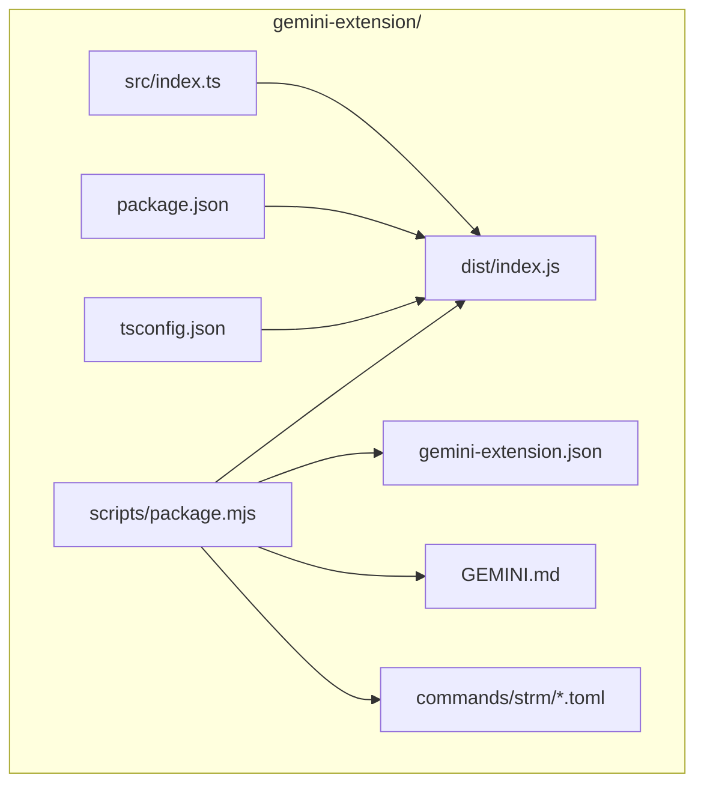
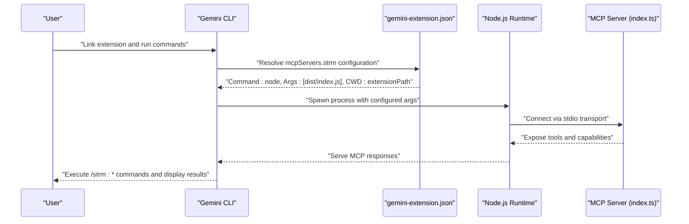
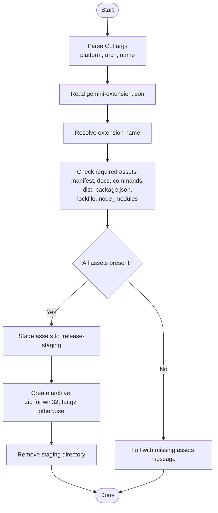
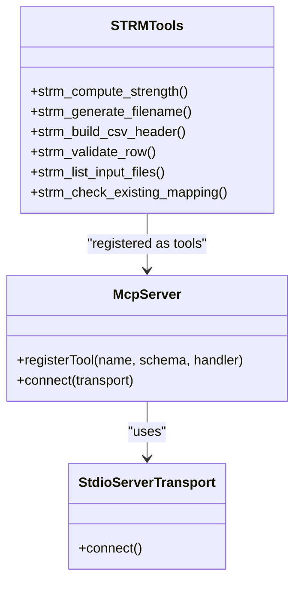
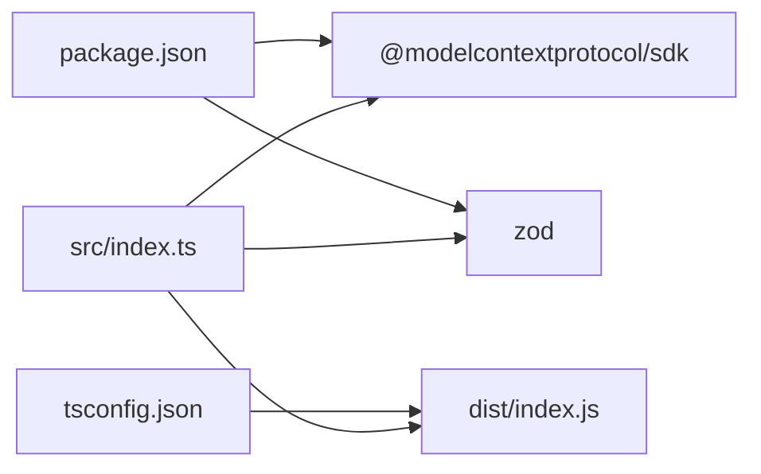

# Extension Installation and Setup

<cite>
**Referenced Files in This Document**
- [package.json](file://gemini-extension/package.json)
- [tsconfig.json](file://gemini-extension/tsconfig.json)
- [gemini-extension.json](file://gemini-extension/gemini-extension.json)
- [index.ts](file://gemini-extension/src/index.ts)
- [GEMINI.md](file://gemini-extension/GEMINI.md)
- [package.mjs](file://gemini-extension/scripts/package.mjs)
- [init.toml](file://gemini-extension/commands/strm/init.toml)
- [map.toml](file://gemini-extension/commands/strm/map.toml)
- [gap-analysis.toml](file://gemini-extension/commands/strm/gap-analysis.toml)
- [validate.toml](file://gemini-extension/commands/strm/validate.toml)
- [installation.md](file://docs/installation.md)
- [README.md](file://README.md)
</cite>

## Table of Contents
1. [Introduction](#introduction)
2. [Project Structure](#project-structure)
3. [Core Components](#core-components)
4. [Architecture Overview](#architecture-overview)
5. [Detailed Component Analysis](#detailed-component-analysis)
6. [Dependency Analysis](#dependency-analysis)
7. [Performance Considerations](#performance-considerations)
8. [Troubleshooting Guide](#troubleshooting-guide)
9. [Conclusion](#conclusion)
10. [Appendices](#appendices)

## Introduction
This document provides a complete guide to installing and setting up the STRM Mapping Gemini CLI Extension. It covers prerequisites, dependency installation, building the extension, linking it with Gemini CLI, verifying the installation, and validating the setup. It also documents the package configuration, TypeScript build process, distribution packaging script, and the extension manifest that defines server settings and MCP protocol integration.

## Project Structure
The Gemini extension is located under the gemini-extension directory. Key elements include:
- Source code in TypeScript under src/
- Compiled JavaScript under dist/
- Build configuration via tsconfig.json
- Package metadata and scripts in package.json
- Extension manifest in gemini-extension.json
- Command prompts for slash commands under commands/strm/
- Distribution packaging script under scripts/package.mjs
- Tooling documentation in GEMINI.md

**Diagram sources**
- [package.json](file://gemini-extension/package.json)
- [tsconfig.json](file://gemini-extension/tsconfig.json)
- [gemini-extension.json](file://gemini-extension/gemini-extension.json)
- [index.ts](file://gemini-extension/src/index.ts)
- [GEMINI.md](file://gemini-extension/GEMINI.md)
- [package.mjs](file://gemini-extension/scripts/package.mjs)
- [init.toml](file://gemini-extension/commands/strm/init.toml)
- [map.toml](file://gemini-extension/commands/strm/map.toml)
- [gap-analysis.toml](file://gemini-extension/commands/strm/gap-analysis.toml)
- [validate.toml](file://gemini-extension/commands/strm/validate.toml)

**Section sources**
- [package.json](file://gemini-extension/package.json)
- [tsconfig.json](file://gemini-extension/tsconfig.json)
- [gemini-extension.json](file://gemini-extension/gemini-extension.json)
- [index.ts](file://gemini-extension/src/index.ts)
- [GEMINI.md](file://gemini-extension/GEMINI.md)
- [package.mjs](file://gemini-extension/scripts/package.mjs)
- [init.toml](file://gemini-extension/commands/strm/init.toml)
- [map.toml](file://gemini-extension/commands/strm/map.toml)
- [gap-analysis.toml](file://gemini-extension/commands/strm/gap-analysis.toml)
- [validate.toml](file://gemini-extension/commands/strm/validate.toml)

## Core Components
- Package configuration: Defines module type, main entry, Node engine requirement, and build/dev scripts.
- TypeScript configuration: Sets ES target, module resolution, output directory, strictness, and sourcemap generation.
- Extension manifest: Declares the MCP server command and arguments, and associates a context file for documentation.
- Source code: Implements an MCP server with six deterministic tools for STRM mapping.
- Packaging script: Builds a distributable archive per platform/architecture.

Key responsibilities:
- package.json: Declares runtime and dev dependencies, Node engine, and scripts for build, watch, start, and packaging.
- tsconfig.json: Configures compiler options and includes/excludes for the build pipeline.
- gemini-extension.json: Registers the MCP server and sets the command to launch the compiled entrypoint.
- src/index.ts: Implements the MCP server and tools for STRM operations.
- scripts/package.mjs: Validates required assets, stages them, and creates platform-specific archives.

**Section sources**
- [package.json](file://gemini-extension/package.json)
- [tsconfig.json](file://gemini-extension/tsconfig.json)
- [gemini-extension.json](file://gemini-extension/gemini-extension.json)
- [index.ts](file://gemini-extension/src/index.ts)
- [package.mjs](file://gemini-extension/scripts/package.mjs)

## Architecture Overview
The extension integrates with Gemini CLI as an MCP-capable server. The MCP server is launched via a Node.js process and communicates over stdio. The extension manifest configures the server command and working directory. The packaging script ensures all required assets are included for distribution.

**Diagram sources**
- [gemini-extension.json](file://gemini-extension/gemini-extension.json)
- [index.ts](file://gemini-extension/src/index.ts)

## Detailed Component Analysis

### Installation Prerequisites
- Node.js: The package declares a minimum Node.js version and uses ES modules. Ensure your environment meets the engine requirement.
- Gemini CLI: The extension is linked and activated through Gemini CLI’s extension system.

Verification steps:
- Confirm Node.js version satisfies the engines field.
- Verify Gemini CLI is installed and accessible in your shell.

**Section sources**
- [package.json](file://gemini-extension/package.json)
- [installation.md](file://docs/installation.md)

### Dependency Installation
Install runtime and development dependencies using your preferred package manager. The extension uses ES modules and requires TypeScript for builds.

Recommended commands:
- Install dependencies: run the standard install command for your package manager.
- Build the extension: compile TypeScript to JavaScript.

Build targets:
- Development watch mode for iterative development.
- Production build for distribution.

**Section sources**
- [package.json](file://gemini-extension/package.json)
- [tsconfig.json](file://gemini-extension/tsconfig.json)

### Build Process (TypeScript Compilation)
The build compiles TypeScript sources to JavaScript using the project’s tsconfig. Compiler options enable strict checks, declaration files, source maps, and ES target appropriate for Node.js.

Key build outputs:
- dist/index.js and associated sourcemaps and declarations.

Validation:
- Ensure the build completes without errors and produces the expected dist artifacts.

**Section sources**
- [tsconfig.json](file://gemini-extension/tsconfig.json)
- [index.ts](file://gemini-extension/src/index.ts)

### Extension Registration with Gemini CLI
After building, link the extension to Gemini CLI. The documentation provides the exact commands to install and link the extension.

Post-link steps:
- Restart Gemini CLI to activate the extension.
- Use slash commands to interact with the MCP tools.

Commands:
- Link the extension from the gemini-extension directory.
- Restart Gemini CLI after linking.

**Section sources**
- [installation.md](file://docs/installation.md)
- [gemini-extension.json](file://gemini-extension/gemini-extension.json)

### Package Configuration (package.json)
Highlights:
- Module type set to ES modules.
- Main entry points to the compiled JavaScript.
- Scripts for build, watch, start, and packaging.
- Dependencies include the MCP SDK and Zod.
- Dev dependencies include TypeScript and Node typings.
- Engine requirement specifies minimum Node.js version.

Best practices:
- Keep dependencies aligned with the declared engine.
- Use the provided scripts consistently for reproducible builds.

**Section sources**
- [package.json](file://gemini-extension/package.json)

### TypeScript Configuration (tsconfig.json)
Highlights:
- Target and module resolution tailored for NodeNext.
- Output directory configured to dist.
- Strict compilation enabled.
- Sourcemaps and declaration files enabled for debugging and consumption.

Recommendations:
- Maintain strict mode for robust type checking.
- Preserve sourcemaps during development and distribution as needed.

**Section sources**
- [tsconfig.json](file://gemini-extension/tsconfig.json)

### Distribution Packaging Script (scripts/package.mjs)
Purpose:
- Validate required assets before packaging.
- Stage files into a temporary directory.
- Create platform-specific archives (zip for Windows, tar.gz otherwise).
- Clean up staging artifacts after packaging.

Inputs:
- Platform and architecture flags (defaults to current environment).
- Manifest name override support.

Outputs:
- Platform/architecture-specific archive in the release directory.

Operational flow:

**Diagram sources**
- [package.mjs](file://gemini-extension/scripts/package.mjs)
- [gemini-extension.json](file://gemini-extension/gemini-extension.json)

**Section sources**
- [package.mjs](file://gemini-extension/scripts/package.mjs)

### gemini-extension.json Configuration
Defines:
- Extension identity (name, version).
- Context file for documentation injection.
- MCP server configuration:
  - Command to launch the server (Node.js).
  - Arguments pointing to the compiled entrypoint.
  - Working directory set to the extension path.

Implications:
- The MCP server runs via stdio transport.
- The server exposes tools registered in the source code.

**Section sources**
- [gemini-extension.json](file://gemini-extension/gemini-extension.json)
- [index.ts](file://gemini-extension/src/index.ts)

### Slash Commands and Prompts
The extension contributes four slash commands via prompt files. These commands orchestrate common STRM workflows and delegate to external scripts for file discovery, initialization, validation, and gap analysis.

- /strm:init: Initializes a new mapping artifact and CSV.
- /strm:map: Starts a mapping session and coordinates tool usage.
- /strm:gap-analysis: Performs a full mapping and generates a gap summary.
- /strm:validate: Validates existing STRM CSV files.

These commands rely on the MCP tools exposed by the server and on local scripts for file operations.

**Section sources**
- [init.toml](file://gemini-extension/commands/strm/init.toml)
- [map.toml](file://gemini-extension/commands/strm/map.toml)
- [gap-analysis.toml](file://gemini-extension/commands/strm/gap-analysis.toml)
- [validate.toml](file://gemini-extension/commands/strm/validate.toml)

### MCP Server Implementation (src/index.ts)
The server registers six deterministic tools:
- Compute strength score
- Generate filename
- Build CSV header
- Validate a row
- List input files
- Check for existing mapping

Each tool defines an input schema validated by Zod and returns structured content. The server connects via stdio transport and is launched by the extension manifest.

**Diagram sources**
- [index.ts](file://gemini-extension/src/index.ts)

**Section sources**
- [index.ts](file://gemini-extension/src/index.ts)

### Step-by-Step Installation Walkthrough
1. Clone the repository and navigate to the project root.
2. Change to the gemini-extension directory.
3. Install dependencies using your package manager.
4. Build the extension (TypeScript compilation).
5. Link the extension with Gemini CLI from the gemini-extension directory.
6. Restart Gemini CLI to activate the extension.
7. Verify by running slash commands.

Reference:
- The documentation provides the exact commands and expected outcomes.

**Section sources**
- [installation.md](file://docs/installation.md)
- [README.md](file://README.md)

### Verification Procedures and Initial Setup Validation
- Confirm the extension is linked and visible to Gemini CLI.
- Run a slash command to ensure the MCP server responds.
- Validate that the tools are callable and return expected content.
- Check that the context documentation is injected as configured.

**Section sources**
- [installation.md](file://docs/installation.md)
- [GEMINI.md](file://gemini-extension/GEMINI.md)

### Platform-Specific Considerations
- Windows: Packaging script creates a zip archive; ensure zip is available or adjust workflow accordingly.
- macOS/Linux: Packaging script creates a tar.gz archive; ensure tar is available.
- Architecture defaults: Packaging respects current platform and architecture unless overridden.

**Section sources**
- [package.mjs](file://gemini-extension/scripts/package.mjs)

## Dependency Analysis
The extension depends on:
- MCP SDK for server implementation and stdio transport.
- Zod for input schema validation.
- Node.js built-ins for filesystem and path operations.

Build-time dependencies:
- TypeScript compiler and Node typings.

**Diagram sources**
- [package.json](file://gemini-extension/package.json)
- [tsconfig.json](file://gemini-extension/tsconfig.json)
- [index.ts](file://gemini-extension/src/index.ts)

**Section sources**
- [package.json](file://gemini-extension/package.json)
- [index.ts](file://gemini-extension/src/index.ts)

## Performance Considerations
- Prefer incremental builds during development using watch mode.
- Keep sourcemaps enabled for debugging but disable for production releases if not needed.
- Minimize filesystem scans by limiting directory traversal in tools where feasible.
- Use the packaged archives for distribution to reduce startup overhead.

## Troubleshooting Guide
Common issues and resolutions:
- Node.js version mismatch: Ensure your Node.js version satisfies the engines requirement declared in package.json.
- Missing dependencies: Re-run dependency installation before building.
- Build failures: Inspect TypeScript diagnostics and fix type errors.
- Packaging errors: Verify all required assets exist and the packaging script has proper permissions.
- Extension not activating: Confirm the extension is linked and Gemini CLI is restarted after linking.

**Section sources**
- [package.json](file://gemini-extension/package.json)
- [package.mjs](file://gemini-extension/scripts/package.mjs)
- [installation.md](file://docs/installation.md)

## Conclusion
The STRM Mapping Gemini CLI Extension integrates seamlessly with Gemini CLI via MCP. By following the installation steps, building the TypeScript sources, and linking the extension, you gain access to six deterministic tools and four slash commands that streamline STRM mapping workflows. Use the packaging script for distribution and adhere to platform-specific considerations for reliable operation across environments.

## Appendices
- Context documentation: The extension’s context file is configured in the manifest and provides usage guidance.
- Command prompts: The slash commands are defined in TOML files and orchestrate tool usage.

**Section sources**
- [gemini-extension.json](file://gemini-extension/gemini-extension.json)
- [GEMINI.md](file://gemini-extension/GEMINI.md)
- [init.toml](file://gemini-extension/commands/strm/init.toml)
- [map.toml](file://gemini-extension/commands/strm/map.toml)
- [gap-analysis.toml](file://gemini-extension/commands/strm/gap-analysis.toml)
- [validate.toml](file://gemini-extension/commands/strm/validate.toml)