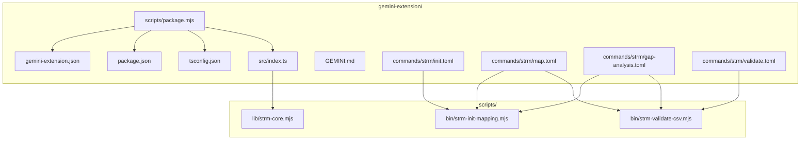
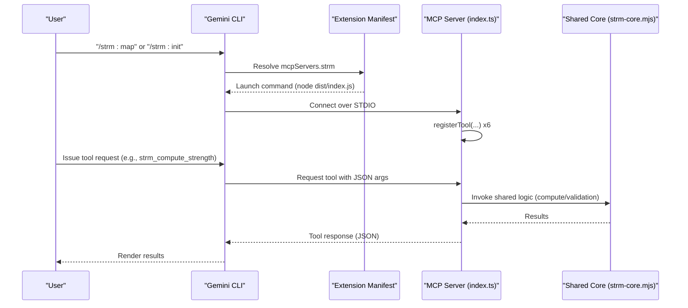
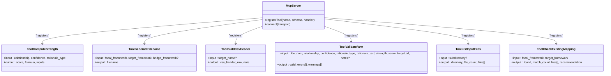
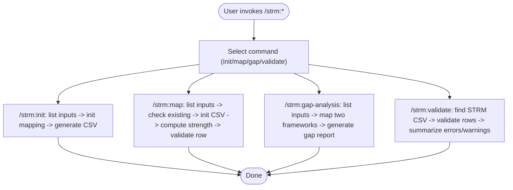
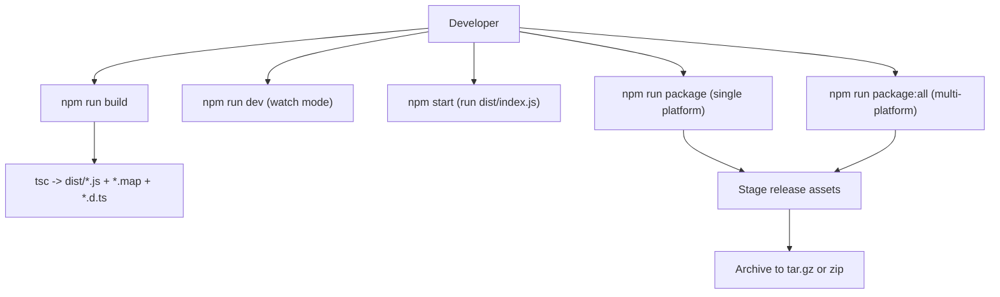
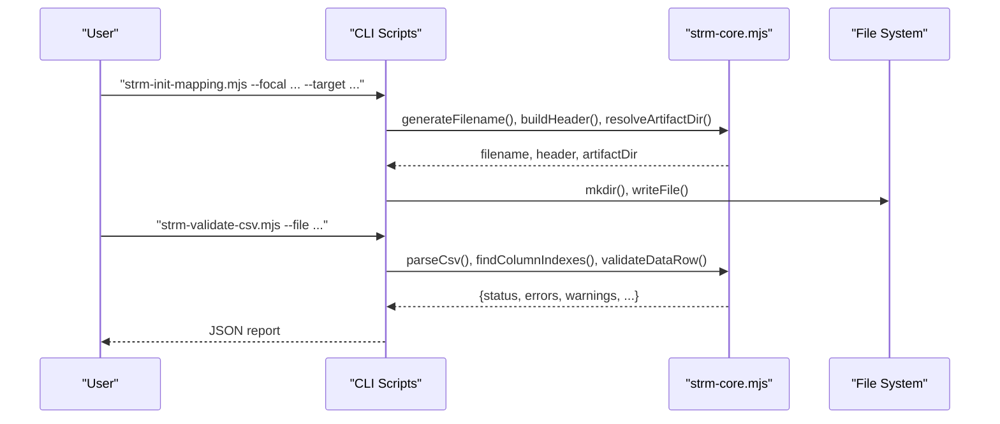
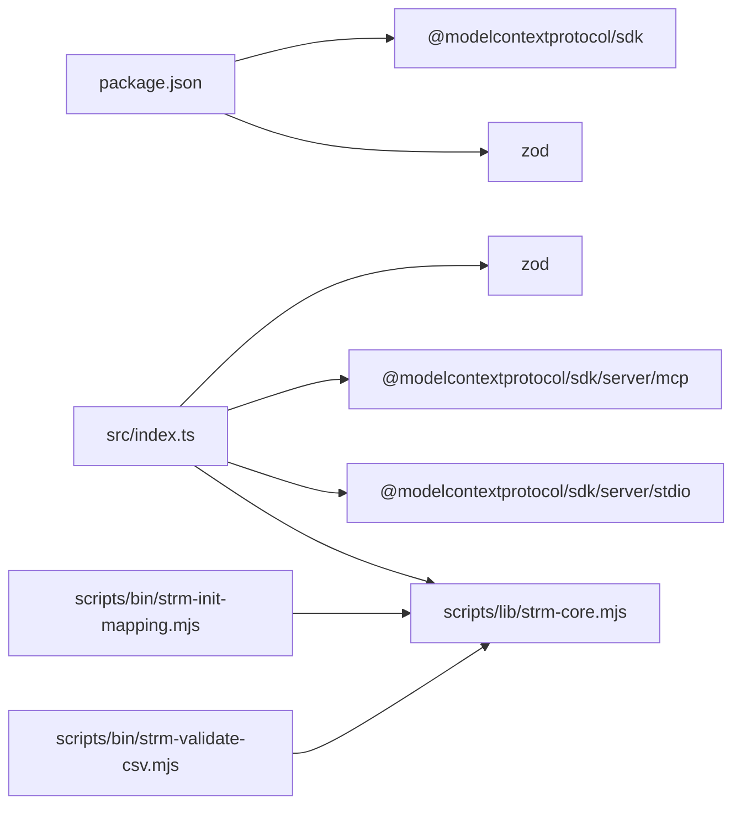

# Gemini CLI Extension and MCP Tools

<cite>
**Referenced Files in This Document**
- [package.json](file://gemini-extension/package.json)
- [tsconfig.json](file://gemini-extension/tsconfig.json)
- [src/index.ts](file://gemini-extension/src/index.ts)
- [gemini-extension.json](file://gemini-extension/gemini-extension.json)
- [GEMINI.md](file://gemini-extension/GEMINI.md)
- [GEMINI.md](file://GEMINI.md)
- [commands/strm/init.toml](file://gemini-extension/commands/strm/init.toml)
- [commands/strm/map.toml](file://gemini-extension/commands/strm/map.toml)
- [commands/strm/gap-analysis.toml](file://gemini-extension/commands/strm/gap-analysis.toml)
- [commands/strm/validate.toml](file://gemini-extension/commands/strm/validate.toml)
- [scripts/package.mjs](file://gemini-extension/scripts/package.mjs)
- [scripts/bin/strm-init-mapping.mjs](file://scripts/bin/strm-init-mapping.mjs)
- [scripts/bin/strm-validate-csv.mjs](file://scripts/bin/strm-validate-csv.mjs)
- [scripts/lib/strm-core.mjs](file://scripts/lib/strm-core.mjs)
- [README.md](file://README.md)
</cite>

## Table of Contents
1. [Introduction](#introduction)
2. [Project Structure](#project-structure)
3. [Core Components](#core-components)
4. [Architecture Overview](#architecture-overview)
5. [Detailed Component Analysis](#detailed-component-analysis)
6. [Dependency Analysis](#dependency-analysis)
7. [Performance Considerations](#performance-considerations)
8. [Troubleshooting Guide](#troubleshooting-guide)
9. [Security and Production Deployment](#security-and-production-deployment)
10. [Conclusion](#conclusion)

## Introduction
This document describes the Gemini CLI Extension and Model Context Protocol (MCP) Tools that power deterministic STRM (Set-Theory Relationship Mapping) operations for cybersecurity frameworks. It explains how the MCP server exposes tools for computing strength scores, generating filenames, building CSV headers, validating rows, discovering inputs, and checking for existing mappings. It also documents the TypeScript-based processing engine, the slash command integration via prompt-driven TOML commands, and the build and distribution pipeline. Guidance is included for installation, configuration, server initialization, troubleshooting, and secure, production-ready deployment.

## Project Structure
The Gemini extension is organized around a TypeScript MCP server, a companion Markdown context file, TOML-based slash command prompts, and a shared TypeScript/JavaScript core library used by both the MCP server and standalone CLI scripts.

**Diagram sources**
- [src/index.ts:1-522](file://gemini-extension/src/index.ts#L1-L522)
- [gemini-extension.json:1-13](file://gemini-extension/gemini-extension.json#L1-L13)
- [GEMINI.md:1-91](file://gemini-extension/GEMINI.md#L1-L91)
- [commands/strm/map.toml:1-20](file://gemini-extension/commands/strm/map.toml#L1-L20)
- [commands/strm/init.toml:1-14](file://gemini-extension/commands/strm/init.toml#L1-L14)
- [commands/strm/gap-analysis.toml:1-19](file://gemini-extension/commands/strm/gap-analysis.toml#L1-L19)
- [commands/strm/validate.toml:1-18](file://gemini-extension/commands/strm/validate.toml#L1-L18)
- [scripts/package.mjs:1-106](file://gemini-extension/scripts/package.mjs#L1-L106)
- [scripts/bin/strm-init-mapping.mjs:1-58](file://scripts/bin/strm-init-mapping.mjs#L1-L58)
- [scripts/bin/strm-validate-csv.mjs:1-77](file://scripts/bin/strm-validate-csv.mjs#L1-L77)
- [scripts/lib/strm-core.mjs:1-343](file://scripts/lib/strm-core.mjs#L1-L343)

**Section sources**
- [package.json:1-26](file://gemini-extension/package.json#L1-L26)
- [tsconfig.json:1-18](file://gemini-extension/tsconfig.json#L1-L18)
- [src/index.ts:1-522](file://gemini-extension/src/index.ts#L1-L522)
- [gemini-extension.json:1-13](file://gemini-extension/gemini-extension.json#L1-L13)
- [GEMINI.md:1-91](file://gemini-extension/GEMINI.md#L1-L91)
- [GEMINI.md:1-224](file://GEMINI.md#L1-L224)

## Core Components
- MCP Server: Implements six deterministic tools for STRM operations and runs over STDIO using the Model Context Protocol SDK.
- TypeScript Processing Engine: Shared utilities for CSV parsing, validation, filename generation, and directory scanning used by both the MCP server and CLI scripts.
- Slash Command Prompts: TOML files that define Gemini CLI slash commands (/strm:init, /strm:map, /strm:gap-analysis, /strm:validate) with step-by-step workflows.
- Build and Distribution: TypeScript compilation, source maps, declarations, and packaging script for multi-platform releases.

Key responsibilities:
- Deterministic STRM scoring and validation
- File discovery and naming consistency
- CSV header construction and row validation
- Cross-platform packaging for the extension

**Section sources**
- [src/index.ts:263-522](file://gemini-extension/src/index.ts#L263-L522)
- [scripts/lib/strm-core.mjs:35-265](file://scripts/lib/strm-core.mjs#L35-L265)
- [commands/strm/map.toml:1-20](file://gemini-extension/commands/strm/map.toml#L1-L20)
- [commands/strm/init.toml:1-14](file://gemini-extension/commands/strm/init.toml#L1-L14)
- [commands/strm/gap-analysis.toml:1-19](file://gemini-extension/commands/strm/gap-analysis.toml#L1-L19)
- [commands/strm/validate.toml:1-18](file://gemini-extension/commands/strm/validate.toml#L1-L18)
- [scripts/package.mjs:47-100](file://gemini-extension/scripts/package.mjs#L47-L100)

## Architecture Overview
The MCP server initializes, registers tools, and listens over STDIO. The extension manifest defines how Gemini CLI launches the server. The shared core library ensures consistent behavior across the MCP server and CLI scripts.

**Diagram sources**
- [gemini-extension.json:5-11](file://gemini-extension/gemini-extension.json#L5-L11)
- [src/index.ts:263-522](file://gemini-extension/src/index.ts#L263-L522)
- [scripts/lib/strm-core.mjs:35-265](file://scripts/lib/strm-core.mjs#L35-L265)

## Detailed Component Analysis

### MCP Server Implementation
The server creates an MCP instance, registers six tools, and connects over STDIO. Each tool enforces schema validation and returns structured JSON responses.

**Diagram sources**
- [src/index.ts:263-522](file://gemini-extension/src/index.ts#L263-L522)

**Section sources**
- [src/index.ts:263-522](file://gemini-extension/src/index.ts#L263-L522)

### Slash Command Integration
Slash commands are defined as TOML prompts that orchestrate CLI scripts and the MCP server. They guide users through listing inputs, initializing mappings, performing gap analysis, and validating outputs.

- /strm:init: Initializes a new STRM artifact folder and CSV using the shared filename generator and header builder.
- /strm:map: Starts a mapping session by discovering inputs, checking for existing mappings, initializing the CSV, and validating rows.
- /strm:gap-analysis: Performs a full STRM mapping between two frameworks and generates a gap summary.
- /strm:validate: Validates existing STRM CSV files and reports errors/warnings.

**Diagram sources**
- [commands/strm/init.toml:1-14](file://gemini-extension/commands/strm/init.toml#L1-L14)
- [commands/strm/map.toml:1-20](file://gemini-extension/commands/strm/map.toml#L1-L20)
- [commands/strm/gap-analysis.toml:1-19](file://gemini-extension/commands/strm/gap-analysis.toml#L1-L19)
- [commands/strm/validate.toml:1-18](file://gemini-extension/commands/strm/validate.toml#L1-L18)

**Section sources**
- [commands/strm/init.toml:1-14](file://gemini-extension/commands/strm/init.toml#L1-L14)
- [commands/strm/map.toml:1-20](file://gemini-extension/commands/strm/map.toml#L1-L20)
- [commands/strm/gap-analysis.toml:1-19](file://gemini-extension/commands/strm/gap-analysis.toml#L1-L19)
- [commands/strm/validate.toml:1-18](file://gemini-extension/commands/strm/validate.toml#L1-L18)

### TypeScript Integration, Build, and Distribution
- TypeScript configuration targets ES2022 with NodeNext module resolution, emits declarations and source maps, and compiles from src to dist.
- Build scripts compile TS, watch for development, run the built server, and package releases.
- The packaging script validates required assets, stages them, and archives per platform/arch.

**Diagram sources**
- [tsconfig.json:2-14](file://gemini-extension/tsconfig.json#L2-L14)
- [package.json:7-12](file://gemini-extension/package.json#L7-L12)
- [scripts/package.mjs:47-100](file://gemini-extension/scripts/package.mjs#L47-L100)

**Section sources**
- [tsconfig.json:1-18](file://gemini-extension/tsconfig.json#L1-L18)
- [package.json:1-26](file://gemini-extension/package.json#L1-L26)
- [scripts/package.mjs:1-106](file://gemini-extension/scripts/package.mjs#L1-L106)

### MCP Tools: Initialization, Mapping, Validation, and Gap Analysis Operations
- Initialization: Generates a properly formatted CSV filename and writes the header row to a dated artifact directory.
- Mapping: Discovers inputs, checks for duplicates, computes strength scores deterministically, and validates rows.
- Validation: Parses CSV, verifies required columns, and applies quality rules to each data row.
- Gap Analysis: Produces a summary of relationships and coverage gaps between two frameworks.

**Diagram sources**
- [scripts/bin/strm-init-mapping.mjs:36-57](file://scripts/bin/strm-init-mapping.mjs#L36-L57)
- [scripts/lib/strm-core.mjs:67-97](file://scripts/lib/strm-core.mjs#L67-L97)
- [scripts/bin/strm-validate-csv.mjs:50-76](file://scripts/bin/strm-validate-csv.mjs#L50-L76)

**Section sources**
- [scripts/bin/strm-init-mapping.mjs:1-58](file://scripts/bin/strm-init-mapping.mjs#L1-L58)
- [scripts/lib/strm-core.mjs:35-265](file://scripts/lib/strm-core.mjs#L35-L265)
- [scripts/bin/strm-validate-csv.mjs:1-77](file://scripts/bin/strm-validate-csv.mjs#L1-L77)

## Dependency Analysis
External and internal dependencies:
- External: @modelcontextprotocol/sdk (MCP server runtime), zod (schema validation).
- Internal: Shared core library used by MCP server and CLI scripts.

**Diagram sources**
- [package.json:14-21](file://gemini-extension/package.json#L14-L21)
- [src/index.ts:9-13](file://gemini-extension/src/index.ts#L9-L13)
- [scripts/lib/strm-core.mjs:1-3](file://scripts/lib/strm-core.mjs#L1-L3)

**Section sources**
- [package.json:14-21](file://gemini-extension/package.json#L14-L21)
- [src/index.ts:9-13](file://gemini-extension/src/index.ts#L9-L13)
- [scripts/lib/strm-core.mjs:1-3](file://scripts/lib/strm-core.mjs#L1-L3)

## Performance Considerations
- Prefer streaming or batched processing for large CSVs; current validators load entire files into memory.
- Cache directory scans for repeated input discovery operations.
- Minimize filesystem writes by batching CSV updates and writing headers once during initialization.
- Use strict schema validation to fail fast and reduce downstream computation.

## Troubleshooting Guide
Common issues and resolutions:
- Gemini CLI connectivity
  - Ensure the MCP server is built and the manifest points to the correct executable path.
  - Verify the WORKSPACE_PATH environment variable if tools rely on it for scanning.
- Extension loading issues
  - Confirm the extension manifest includes the correct command and args.
  - Check that dist/index.js exists after building.
- Script execution failures
  - Validate required arguments for CLI scripts (e.g., --focal, --target).
  - Confirm CSV files include required columns and adhere to quality rules.
- Performance optimization
  - Avoid redundant file scans; reuse discovered inputs.
  - Use deterministic computations to prevent rework.

**Section sources**
- [gemini-extension.json:5-11](file://gemini-extension/gemini-extension.json#L5-L11)
- [src/index.ts:451-471](file://gemini-extension/src/index.ts#L451-L471)
- [scripts/bin/strm-validate-csv.mjs:15-20](file://scripts/bin/strm-validate-csv.mjs#L15-L20)

## Security and Production Deployment
- Authentication and secrets
  - The MCP server and scripts operate locally on the filesystem; no network credentials are required.
  - Restrict access to the working directory and avoid embedding secrets in CSVs.
- Hardening
  - Run builds and packaging in CI with locked dependencies.
  - Sign and distribute packages via a trusted channel.
- Production patterns
  - Use the packaging script to generate platform-specific archives.
  - Pin Node.js versions and install dependencies with lockfiles.
  - Store artifacts in the designated working directory and dated folders.

**Section sources**
- [scripts/package.mjs:47-100](file://gemini-extension/scripts/package.mjs#L47-L100)
- [README.md:24-29](file://README.md#L24-L29)

## Conclusion
The Gemini CLI Extension and MCP Tools provide a robust, deterministic foundation for STRM mapping across cybersecurity frameworks. The MCP server encapsulates validated, repeatable operations, while the shared TypeScript core ensures consistency with CLI scripts. The slash command prompts streamline end-to-end workflows from initialization to gap analysis and validation. With proper build and packaging processes, the extension is ready for secure, production-grade distribution and operation.