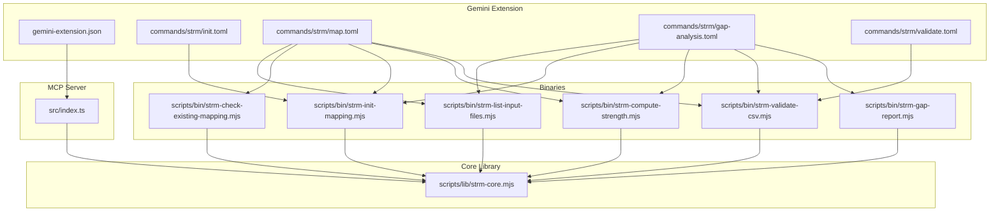
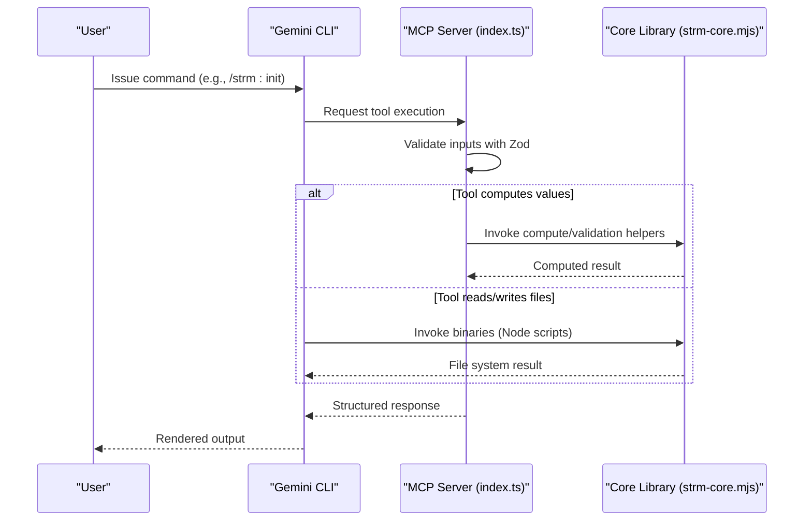
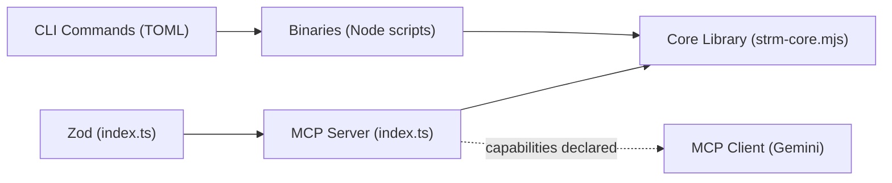

# MCP Tools Reference

<cite>
**Referenced Files in This Document**
- [index.ts](file://gemini-extension/src/index.ts)
- [gemini-extension.json](file://gemini-extension/gemini-extension.json)
- [init.toml](file://gemini-extension/commands/strm/init.toml)
- [map.toml](file://gemini-extension/commands/strm/map.toml)
- [gap-analysis.toml](file://gemini-extension/commands/strm/gap-analysis.toml)
- [validate.toml](file://gemini-extension/commands/strm/validate.toml)
- [strm-core.mjs](file://scripts/lib/strm-core.mjs)
- [strm-init-mapping.mjs](file://scripts/bin/strm-init-mapping.mjs)
- [strm-validate-csv.mjs](file://scripts/bin/strm-validate-csv.mjs)
- [strm-gap-report.mjs](file://scripts/bin/strm-gap-report.mjs)
- [strm-list-input-files.mjs](file://scripts/bin/strm-list-input-files.mjs)
- [strm-check-existing-mapping.mjs](file://scripts/bin/strm-check-existing-mapping.mjs)
- [strm-compute-strength.mjs](file://scripts/bin/strm-compute-strength.mjs)
- [package.json](file://gemini-extension/package.json)
- [GEMINI.md](file://GEMINI.md)
</cite>

## Table of Contents
1. [Introduction](#introduction)
2. [Project Structure](#project-structure)
3. [Core Components](#core-components)
4. [Architecture Overview](#architecture-overview)
5. [Detailed Component Analysis](#detailed-component-analysis)
6. [Dependency Analysis](#dependency-analysis)
7. [Performance Considerations](#performance-considerations)
8. [Troubleshooting Guide](#troubleshooting-guide)
9. [Conclusion](#conclusion)
10. [Appendices](#appendices)

## Introduction
This document is the Model Context Protocol (MCP) Tools Reference for the Gemini CLI extension’s STRM (Set-Theory Relationship Mapping) implementation. It describes the MCP server capabilities, the six MCP tools registered by the server, and how the Gemini CLI commands orchestrate these tools alongside the shared STRM core library. It explains input parameters, expected data formats, processing logic, output specifications, Zod-based validation, error handling, and integration with the core STRM processing engine. Practical invocation examples, configuration notes, performance characteristics, and troubleshooting guidance are included.

## Project Structure
The MCP server is implemented as a TypeScript module that registers deterministic tools backed by a shared JavaScript core library. The Gemini CLI extension defines TOML command definitions that invoke Node.js binaries implementing the STRM workflow. The core library encapsulates CSV parsing, validation, filename generation, and scoring logic.

**Diagram sources**
- [gemini-extension.json:1-13](file://gemini-extension/gemini-extension.json#L1-L13)
- [index.ts:263-522](file://gemini-extension/src/index.ts#L263-L522)
- [strm-core.mjs:1-343](file://scripts/lib/strm-core.mjs#L1-L343)
- [strm-init-mapping.mjs:1-58](file://scripts/bin/strm-init-mapping.mjs#L1-L58)
- [strm-validate-csv.mjs:1-77](file://scripts/bin/strm-validate-csv.mjs#L1-L77)
- [strm-gap-report.mjs:1-150](file://scripts/bin/strm-gap-report.mjs#L1-L150)
- [strm-list-input-files.mjs:1-12](file://scripts/bin/strm-list-input-files.mjs#L1-L12)
- [strm-check-existing-mapping.mjs:1-20](file://scripts/bin/strm-check-existing-mapping.mjs#L1-L20)
- [strm-compute-strength.mjs:1-20](file://scripts/bin/strm-compute-strength.mjs#L1-L20)

**Section sources**
- [gemini-extension.json:1-13](file://gemini-extension/gemini-extension.json#L1-L13)
- [index.ts:263-522](file://gemini-extension/src/index.ts#L263-L522)
- [strm-core.mjs:1-343](file://scripts/lib/strm-core.mjs#L1-L343)

## Core Components
- MCP Server: Instantiates an MCP server and registers six deterministic tools. Each tool has a Zod input schema and returns structured text content.
- Core Library: Provides shared utilities for CSV parsing, validation, scoring, filename generation, directory traversal, and artifact path resolution.
- Command Orchestration: TOML command definitions in the Gemini CLI extension invoke Node.js binaries that wrap core library functions and file system operations.

Key capabilities:
- Deterministic scoring, filename generation, CSV header building, row validation, input discovery, and existing mapping checks.
- Integration with the STRM methodology for computing strength scores and generating artifacts.

**Section sources**
- [index.ts:263-522](file://gemini-extension/src/index.ts#L263-L522)
- [strm-core.mjs:1-343](file://scripts/lib/strm-core.mjs#L1-L343)

## Architecture Overview
The MCP server exposes tools that mirror the CLI commands’ workflows. The server validates inputs via Zod, computes results deterministically, and returns structured text. The CLI commands orchestrate these tools and shell-out to binaries for file system tasks.

**Diagram sources**
- [index.ts:263-522](file://gemini-extension/src/index.ts#L263-L522)
- [strm-core.mjs:1-343](file://scripts/lib/strm-core.mjs#L1-L343)

## Detailed Component Analysis

### Tool: strm_compute_strength
- Purpose: Computes the NIST IR 8477 Strength of Relationship score (1–10) from relationship, confidence, and rationale_type.
- Registration: Registered as a deterministic tool with Zod input schema.
- Inputs:
  - relationship: enum ['equal','subset_of','superset_of','intersects_with','not_related']
  - confidence: enum ['high','medium','low'] (default high)
  - rationale_type: enum ['semantic','functional','syntactic'] (default semantic)
- Processing logic:
  - Validates inputs via Zod.
  - Computes base score, confidence adjustment, rationale adjustment, and clamps to [1,10].
  - Returns computed score and a formula explanation.
- Outputs:
  - content: array of text parts containing JSON with score, formula breakdown, and inputs.
- Error handling:
  - Invalid inputs cause immediate rejection by Zod validation.
- Performance:
  - O(1) computation; negligible overhead.
- Usage example:
  - Call with relationship='subset_of', confidence='medium', rationale_type='semantic'.

**Section sources**
- [index.ts:268-306](file://gemini-extension/src/index.ts#L268-L306)
- [strm-core.mjs:35-57](file://scripts/lib/strm-core.mjs#L35-L57)

### Tool: strm_generate_filename
- Purpose: Generates the canonical STRM CSV filename for a mapping.
- Inputs:
  - focal_framework: string
  - target_framework: string
  - bridge_framework: optional string
- Processing logic:
  - Sanitizes framework names and constructs filename with focal→bridge→target segments.
- Outputs:
  - content: array of text parts containing JSON with filename.
- Error handling:
  - Zod enforces presence of required strings.
- Usage example:
  - focal_framework="NIST CSF 2.0", target_framework="ISO 27001".

**Section sources**
- [index.ts:308-339](file://gemini-extension/src/index.ts#L308-L339)
- [strm-core.mjs:67-79](file://scripts/lib/strm-core.mjs#L67-L79)

### Tool: strm_build_csv_header
- Purpose: Returns the single STRM CSV header row with columns labeled using target_name.
- Inputs:
  - target_name: optional string (defaults to 'Target' placeholder)
- Processing logic:
  - Builds canonical header row with columns for FDE metadata and target requirement fields.
- Outputs:
  - content: array of text parts containing JSON with header row and explanatory note.
- Usage example:
  - target_name="ISO 27001" to label columns I and K accordingly.

**Section sources**
- [index.ts:341-373](file://gemini-extension/src/index.ts#L341-L373)
- [strm-core.mjs:81-97](file://scripts/lib/strm-core.mjs#L81-L97)

### Tool: strm_validate_row
- Purpose: Validates a single STRM mapping row against quality rules.
- Inputs:
  - fde_num: string
  - relationship: string
  - confidence: string
  - rationale_type: string
  - rationale_text: string
  - strength_score: number
  - target_id: string
  - notes: optional string
- Processing logic:
  - Checks required fields, enumerations, numeric range, and formula consistency.
  - Emits errors and warnings for remediation.
- Outputs:
  - content: array of text parts containing JSON with valid flag, errors[], warnings[].
- Usage example:
  - Provide all fields; fix reported errors before saving.

**Section sources**
- [index.ts:375-432](file://gemini-extension/src/index.ts#L375-L432)
- [strm-core.mjs:206-265](file://scripts/lib/strm-core.mjs#L206-L265)

### Tool: strm_list_input_files
- Purpose: Lists available framework/control files under a directory (recursively).
- Inputs:
  - subdirectory: optional string (defaults to 'working-directory'; can target 'knowledge')
- Processing logic:
  - Walks directory tree, filters by supported extensions, and returns sorted list.
- Outputs:
  - content: array of text parts containing JSON with directory, file_count, files[].
- Usage example:
  - subdirectory="working-directory" to discover inputs.

**Section sources**
- [index.ts:434-472](file://gemini-extension/src/index.ts#L434-L472)
- [strm-core.mjs:281-309](file://scripts/lib/strm-core.mjs#L281-L309)

### Tool: strm_check_existing_mapping
- Purpose: Scans working-directory for existing STRM CSVs matching a focal→target pair.
- Inputs:
  - focal_framework: string
  - target_framework: string
- Processing logic:
  - Recursively scans for CSVs containing 'STRM' and matching normalized framework names.
- Outputs:
  - content: array of text parts containing JSON with found flag, match_count, files[], recommendation.
- Usage example:
  - Prevents duplication by checking before starting a new mapping.

**Section sources**
- [index.ts:474-514](file://gemini-extension/src/index.ts#L474-L514)
- [strm-core.mjs:315-342](file://scripts/lib/strm-core.mjs#L315-L342)

### CLI Commands Orchestration
While the MCP server registers the six tools above, the Gemini CLI commands define higher-level workflows that invoke Node.js binaries wrapping the core library:

- /strm:init
  - Prompts for focal, target, optional bridge.
  - Invokes strm-init-mapping.mjs to create artifact directory and initial CSV.
- /strm:map
  - Lists inputs, checks for existing mappings, initializes output, and iteratively computes strengths and validates CSV.
- /strm:gap-analysis
  - Performs a full mapping, then generates a gap summary report via strm-gap-report.mjs.
- /strm:validate
  - Discovers STRM CSVs and validates each with strm-validate-csv.mjs.

These commands rely on the core library for consistent behavior across tools and binaries.

**Section sources**
- [init.toml:1-14](file://gemini-extension/commands/strm/init.toml#L1-L14)
- [map.toml:1-20](file://gemini-extension/commands/strm/map.toml#L1-L20)
- [gap-analysis.toml:1-19](file://gemini-extension/commands/strm/gap-analysis.toml#L1-L19)
- [validate.toml:1-18](file://gemini-extension/commands/strm/validate.toml#L1-L18)
- [strm-init-mapping.mjs:1-58](file://scripts/bin/strm-init-mapping.mjs#L1-L58)
- [strm-validate-csv.mjs:1-77](file://scripts/bin/strm-validate-csv.mjs#L1-L77)
- [strm-gap-report.mjs:1-150](file://scripts/bin/strm-gap-report.mjs#L1-L150)
- [strm-list-input-files.mjs:1-12](file://scripts/bin/strm-list-input-files.mjs#L1-L12)
- [strm-check-existing-mapping.mjs:1-20](file://scripts/bin/strm-check-existing-mapping.mjs#L1-L20)
- [strm-compute-strength.mjs:1-20](file://scripts/bin/strm-compute-strength.mjs#L1-L20)

## Dependency Analysis
- MCP Server depends on Zod for input validation and on the core library for computation and file helpers.
- CLI commands depend on Node.js binaries that delegate to the core library.
- The core library encapsulates CSV parsing, validation, scoring, and filesystem utilities.

**Diagram sources**
- [index.ts:11-11](file://gemini-extension/src/index.ts#L11-L11)
- [index.ts:263-522](file://gemini-extension/src/index.ts#L263-L522)
- [strm-core.mjs:1-343](file://scripts/lib/strm-core.mjs#L1-L343)

**Section sources**
- [index.ts:11-11](file://gemini-extension/src/index.ts#L11-L11)
- [package.json:14-25](file://gemini-extension/package.json#L14-L25)

## Performance Considerations
- Tool computations are constant-time and I/O-bound primarily by filesystem operations.
- CSV parsing and validation are linear in the number of rows processed.
- Recommendations:
  - Prefer streaming or chunked processing for very large CSVs.
  - Cache repeated lookups (e.g., existing mappings) when invoking tools frequently.
  - Use the MCP server’s deterministic nature to enable client-side caching of results.

[No sources needed since this section provides general guidance]

## Troubleshooting Guide
Common issues and resolutions:
- Invalid relationship/confidence/rationale values:
  - Symptom: Zod validation errors when invoking tools.
  - Resolution: Ensure values match allowed enums.
- Strength score mismatch:
  - Symptom: Validation reports mismatch between provided and computed score.
  - Resolution: Recompute using the scoring tool and update the row.
- Empty or malformed CSV:
  - Symptom: Validation reports missing columns or empty file.
  - Resolution: Use the header tool to generate a proper header and ensure data rows follow.
- Missing target control IDs:
  - Symptom: Validation warns about invented IDs.
  - Resolution: Use only IDs present in the target document.
- not_related usage:
  - Symptom: Validation suggests adding notes for zero overlap.
  - Resolution: Include explanatory notes when marking not_related.

**Section sources**
- [index.ts:118-193](file://gemini-extension/src/index.ts#L118-L193)
- [strm-core.mjs:206-265](file://scripts/lib/strm-core.mjs#L206-L265)

## Conclusion
The MCP server provides six deterministic tools that implement core STRM operations with strict input validation and deterministic outputs. Together with the CLI command orchestrations and the shared core library, they form a cohesive pipeline for initializing mappings, generating filenames and headers, validating rows, discovering inputs, and detecting duplicates. The system emphasizes correctness, reproducibility, and ease of integration with the Gemini CLI.

[No sources needed since this section summarizes without analyzing specific files]

## Appendices

### Appendix A: Tool Invocation Examples
- Compute strength:
  - Inputs: relationship='subset_of', confidence='medium', rationale_type='semantic'
  - Output: score and formula breakdown
- Generate filename:
  - Inputs: focal_framework='NIST CSF 2.0', target_framework='ISO 27001'
  - Output: canonical CSV filename
- Build CSV header:
  - Inputs: target_name='ISO 27001'
  - Output: header row with target-labeled columns
- Validate a row:
  - Inputs: fde_num, relationship, confidence, rationale_type, rationale_text, strength_score, target_id, notes
  - Output: errors and warnings
- List input files:
  - Inputs: subdirectory='working-directory'
  - Output: discovered files
- Check existing mapping:
  - Inputs: focal_framework, target_framework
  - Output: matches and recommendation

**Section sources**
- [index.ts:268-514](file://gemini-extension/src/index.ts#L268-L514)
- [strm-core.mjs:35-57](file://scripts/lib/strm-core.mjs#L35-L57)
- [strm-core.mjs:67-97](file://scripts/lib/strm-core.mjs#L67-L97)
- [strm-core.mjs:206-265](file://scripts/lib/strm-core.mjs#L206-L265)
- [strm-core.mjs:281-309](file://scripts/lib/strm-core.mjs#L281-L309)
- [strm-core.mjs:315-342](file://scripts/lib/strm-core.mjs#L315-L342)

### Appendix B: Zod Schema Definitions
- strm_compute_strength:
  - relationship: enum ['equal','subset_of','superset_of','intersects_with','not_related']
  - confidence: enum ['high','medium','low']
  - rationale_type: enum ['semantic','functional','syntactic']
- strm_generate_filename:
  - focal_framework: string
  - target_framework: string
  - bridge_framework: optional string
- strm_build_csv_header:
  - target_name: optional string
- strm_validate_row:
  - fde_num: string
  - relationship: string
  - confidence: string
  - rationale_type: string
  - rationale_text: string
  - strength_score: number
  - target_id: string
  - notes: optional string
- strm_list_input_files:
  - subdirectory: optional string
- strm_check_existing_mapping:
  - focal_framework: string
  - target_framework: string

**Section sources**
- [index.ts:275-285](file://gemini-extension/src/index.ts#L275-L285)
- [index.ts:315-326](file://gemini-extension/src/index.ts#L315-L326)
- [index.ts:351-356](file://gemini-extension/src/index.ts#L351-L356)
- [index.ts:383-410](file://gemini-extension/src/index.ts#L383-L410)
- [index.ts:441-449](file://gemini-extension/src/index.ts#L441-L449)
- [index.ts:481-488](file://gemini-extension/src/index.ts#L481-L488)

### Appendix C: Integration Notes
- Server configuration:
  - MCP server name/version set in the server constructor.
  - Transport configured via stdio.
- Client configuration:
  - gemini-extension.json defines the MCP server command and arguments.
- Workspace path:
  - Tools that access the filesystem use WORKSPACE_PATH or cwd as needed.

**Section sources**
- [index.ts:263-266](file://gemini-extension/src/index.ts#L263-L266)
- [index.ts:520-522](file://gemini-extension/src/index.ts#L520-L522)
- [gemini-extension.json:5-11](file://gemini-extension/gemini-extension.json#L5-L11)

### Appendix D: STRM Methodology Context
- Scoring rules, calibration defaults, and quality rules are documented in the repository context file.
- These rules inform tool behavior and validation logic.

**Section sources**
- [GEMINI.md:86-184](file://GEMINI.md#L86-L184)