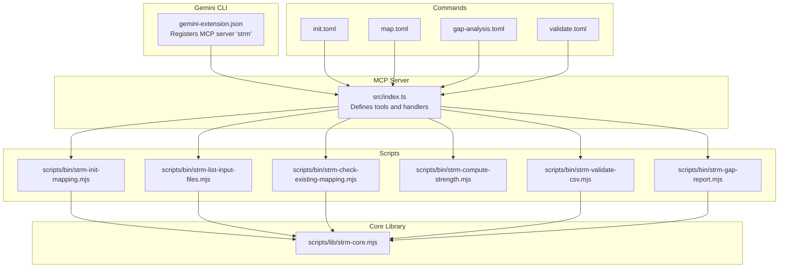
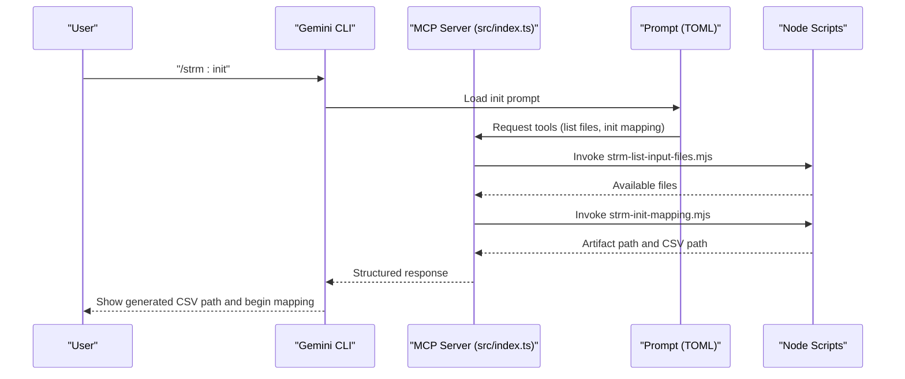
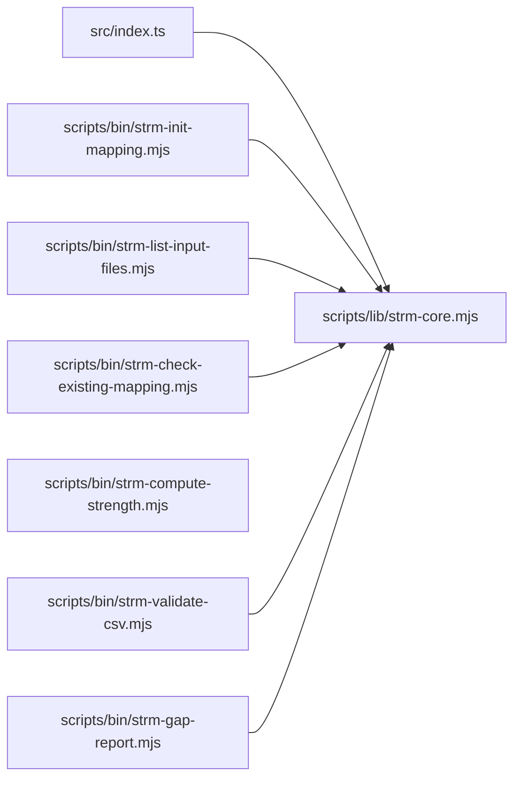

# Slash Commands and Usage

<cite>
**Referenced Files in This Document**
- [GEMINI.md](file://GEMINI.md)
- [gemini-extension/commands/strm/init.toml](file://gemini-extension/commands/strm/init.toml)
- [gemini-extension/commands/strm/map.toml](file://gemini-extension/commands/strm/map.toml)
- [gemini-extension/commands/strm/gap-analysis.toml](file://gemini-extension/commands/strm/gap-analysis.toml)
- [gemini-extension/commands/strm/validate.toml](file://gemini-extension/commands/strm/validate.toml)
- [gemini-extension/src/index.ts](file://gemini-extension/src/index.ts)
- [gemini-extension/gemini-extension.json](file://gemini-extension/gemini-extension.json)
- [scripts/bin/strm-init-mapping.mjs](file://scripts/bin/strm-init-mapping.mjs)
- [scripts/bin/strm-list-input-files.mjs](file://scripts/bin/strm-list-input-files.mjs)
- [scripts/bin/strm-check-existing-mapping.mjs](file://scripts/bin/strm-check-existing-mapping.mjs)
- [scripts/bin/strm-compute-strength.mjs](file://scripts/bin/strm-compute-strength.mjs)
- [scripts/bin/strm-validate-csv.mjs](file://scripts/bin/strm-validate-csv.mjs)
- [scripts/bin/strm-gap-report.mjs](file://scripts/bin/strm-gap-report.mjs)
- [scripts/lib/strm-core.mjs](file://scripts/lib/strm-core.mjs)
- [gemini-extension/package.json](file://gemini-extension/package.json)
</cite>

## Table of Contents
1. [Introduction](#introduction)
2. [Project Structure](#project-structure)
3. [Core Components](#core-components)
4. [Architecture Overview](#architecture-overview)
5. [Detailed Component Analysis](#detailed-component-analysis)
6. [Dependency Analysis](#dependency-analysis)
7. [Performance Considerations](#performance-considerations)
8. [Troubleshooting Guide](#troubleshooting-guide)
9. [Conclusion](#conclusion)
10. [Appendices](#appendices)

## Introduction
This document explains the Gemini CLI slash commands for NIST IR 8477 Set-Theory Relationship Mapping (STRM). It covers the four slash commands (/strm:init, /strm:map, /strm:gap-analysis, /strm:validate), their parameters, execution flow, validation rules, and interactive usage patterns. It also describes how the MCP server exposes deterministic tools for mapping, how interactive sessions manage context and state, and how to recover from errors.

## Project Structure
The STRM extension consists of:
- A Gemini extension configuration that registers an MCP server named “strm”.
- A TypeScript MCP server that defines deterministic tools for STRM operations.
- Command TOML files that describe the intent and step-by-step prompts for each slash command.
- Node.js scripts that implement the backend operations for initialization, mapping, gap analysis, and validation.
- A shared core library that implements parsing, validation, scoring, and file utilities.

**Diagram sources**
- [gemini-extension/gemini-extension.json:1-13](file://gemini-extension/gemini-extension.json#L1-L13)
- [gemini-extension/src/index.ts:263-522](file://gemini-extension/src/index.ts#L263-L522)
- [gemini-extension/commands/strm/init.toml:1-14](file://gemini-extension/commands/strm/init.toml#L1-L14)
- [gemini-extension/commands/strm/map.toml:1-20](file://gemini-extension/commands/strm/map.toml#L1-L20)
- [gemini-extension/commands/strm/gap-analysis.toml:1-19](file://gemini-extension/commands/strm/gap-analysis.toml#L1-L19)
- [gemini-extension/commands/strm/validate.toml:1-18](file://gemini-extension/commands/strm/validate.toml#L1-L18)
- [scripts/bin/strm-init-mapping.mjs:1-58](file://scripts/bin/strm-init-mapping.mjs#L1-L58)
- [scripts/bin/strm-list-input-files.mjs:1-12](file://scripts/bin/strm-list-input-files.mjs#L1-L12)
- [scripts/bin/strm-check-existing-mapping.mjs:1-20](file://scripts/bin/strm-check-existing-mapping.mjs#L1-L20)
- [scripts/bin/strm-compute-strength.mjs:1-20](file://scripts/bin/strm-compute-strength.mjs#L1-L20)
- [scripts/bin/strm-validate-csv.mjs:1-146](file://scripts/bin/strm-validate-csv.mjs#L1-L146)
- [scripts/bin/strm-gap-report.mjs:1-150](file://scripts/bin/strm-gap-report.mjs#L1-L150)
- [scripts/lib/strm-core.mjs:1-343](file://scripts/lib/strm-core.mjs#L1-L343)

**Section sources**
- [gemini-extension/gemini-extension.json:1-13](file://gemini-extension/gemini-extension.json#L1-L13)
- [gemini-extension/src/index.ts:263-522](file://gemini-extension/src/index.ts#L263-L522)

## Core Components
- MCP Server: Exposes deterministic tools for STRM operations (compute strength, generate filename, build CSV header, validate row, list input files, check existing mapping).
- Command Prompts: Each slash command’s TOML file defines the prompt and the ordered steps to execute.
- Scripts: Standalone Node.js scripts implement the backend operations and are invoked by the MCP tools.
- Core Library: Shared utilities for CSV parsing/validation, scoring, file discovery, and artifact directory resolution.

Key capabilities:
- Deterministic scoring and validation aligned with NIST IR 8477.
- Consistent CSV header construction and filename generation.
- Interactive discovery of inputs and detection of prior mappings.
- Gap analysis summarization and reporting.

**Section sources**
- [gemini-extension/src/index.ts:268-514](file://gemini-extension/src/index.ts#L268-L514)
- [scripts/lib/strm-core.mjs:35-265](file://scripts/lib/strm-core.mjs#L35-L265)

## Architecture Overview
The slash commands orchestrate a sequence of tool invocations backed by Node.js scripts. The MCP server validates inputs and returns structured results, while the scripts handle filesystem operations and computations.

**Diagram sources**
- [gemini-extension/commands/strm/init.toml:1-14](file://gemini-extension/commands/strm/init.toml#L1-L14)
- [gemini-extension/src/index.ts:434-472](file://gemini-extension/src/index.ts#L434-L472)
- [scripts/bin/strm-list-input-files.mjs:1-12](file://scripts/bin/strm-list-input-files.mjs#L1-L12)
- [scripts/bin/strm-init-mapping.mjs:1-58](file://scripts/bin/strm-init-mapping.mjs#L1-L58)

## Detailed Component Analysis

### Slash Command: /strm:init
Purpose:
- Initialize a new STRM mapping artifact folder and CSV by prompting for focal, target, and optional bridge frameworks.

Parameters:
- --focal: Required. Short name of the source framework.
- --target: Required. Short name of the target framework.
- --bridge: Optional. Bridge framework; if omitted, focal is reused.
- --working-dir: Optional. Defaults to working-directory.
- --date: Optional. Defaults to current date in ISO format.

Execution flow:
1. Prompt user for focal, target, and optional bridge.
2. Invoke strm-list-input-files.mjs to enumerate inputs.
3. Invoke strm-check-existing-mapping.mjs to detect prior mappings.
4. Invoke strm-init-mapping.mjs to create the artifact directory and CSV with the canonical header row.
5. Present the CSV path and begin row generation.

Expected outcomes:
- New dated artifact directory under working-directory/mapping-artifacts.
- CSV file with canonical header row and placeholder target column labels.
- Ready-to-fill mapping rows.

Interactive session management:
- The prompt orchestrates steps and preserves context (framework names) across tool invocations.
- The MCP server returns structured JSON for each tool, enabling reliable downstream actions.

Command-specific options:
- Optional flags: --bridge, --working-dir, --date.

Advanced usage patterns:
- Use --bridge to create a mediated mapping path when a direct mapping is not feasible.
- Use --date to stamp artifacts with a specific date.

Errors and recovery:
- Missing required arguments cause usage messages and exit with non-zero status.
- On success, the server prints a JSON payload containing artifactDir, csvPath, filename, and date.

**Section sources**
- [gemini-extension/commands/strm/init.toml:1-14](file://gemini-extension/commands/strm/init.toml#L1-L14)
- [scripts/bin/strm-init-mapping.mjs:12-58](file://scripts/bin/strm-init-mapping.mjs#L12-L58)
- [scripts/bin/strm-list-input-files.mjs:1-12](file://scripts/bin/strm-list-input-files.mjs#L1-L12)
- [scripts/bin/strm-check-existing-mapping.mjs:1-20](file://scripts/bin/strm-check-existing-mapping.mjs#L1-L20)
- [scripts/lib/strm-core.mjs:267-277](file://scripts/lib/strm-core.mjs#L267-L277)

### Slash Command: /strm:map
Purpose:
- Start a new STRM mapping session, discover inputs, initialize output, and iterate through rows.

Parameters:
- None required by the command; the prompt collects focal and target interactively.
- The workflow internally uses the same flags as /strm:init for initialization.

Execution flow:
1. Invoke strm-list-input-files.mjs to show available files in working-directory.
2. Invoke strm-check-existing-mapping.mjs to check for prior mappings.
3. Prompt user for focal, target, and whether inputs are ready.
4. Initialize output with strm-init-mapping.mjs.
5. For each row:
   - Compute strength with strm-compute-strength.mjs.
   - Validate the row with strm-validate-csv.mjs (per-row validation).
6. Finalize the CSV after all rows.

Expected outcomes:
- Initialized CSV with canonical header.
- Per-row strength scores computed deterministically.
- Validation feedback for each row before moving on.

Interactive session management:
- The prompt guides the user through discovery, confirmation, and iteration.
- The MCP server ensures consistent tool invocation order and argument passing.

Command-specific options:
- No explicit flags; relies on internal scripts’ supported flags.

Advanced usage patterns:
- Combine with prior mapping checks to avoid duplication.
- Use bridge framework when needed.

Errors and recovery:
- Script-level errors print structured JSON and exit with non-zero status.
- Fix reported issues and re-run validation for the same row.

**Section sources**
- [gemini-extension/commands/strm/map.toml:1-20](file://gemini-extension/commands/strm/map.toml#L1-L20)
- [scripts/bin/strm-list-input-files.mjs:1-12](file://scripts/bin/strm-list-input-files.mjs#L1-L12)
- [scripts/bin/strm-check-existing-mapping.mjs:1-20](file://scripts/bin/strm-check-existing-mapping.mjs#L1-L20)
- [scripts/bin/strm-init-mapping.mjs:1-58](file://scripts/bin/strm-init-mapping.mjs#L1-L58)
- [scripts/bin/strm-compute-strength.mjs:1-20](file://scripts/bin/strm-compute-strength.mjs#L1-L20)
- [scripts/bin/strm-validate-csv.mjs:1-146](file://scripts/bin/strm-validate-csv.mjs#L1-L146)

### Slash Command: /strm:gap-analysis
Purpose:
- Perform a gap analysis between two frameworks by running a full STRM mapping and producing a summary report.

Parameters:
- None required by the command; the prompt collects the two frameworks interactively.
- Internally uses the same flags as /strm:init for initialization.

Execution flow:
1. Invoke strm-list-input-files.mjs to list available inputs.
2. Prompt user for the two frameworks to compare.
3. Run a full STRM mapping between the two frameworks.
4. After all rows, compute a gap summary:
   - Controls with no equal/subset_of matches (gaps).
   - Controls with only intersects_with matches (partial gaps).
   - Controls with equal matches (full coverage).
   - Distribution of relationship types as percentages.
5. Save the gap summary using strm-gap-report.mjs.

Expected outcomes:
- Completed STRM CSV.
- Markdown gap analysis report in the dated artifact folder.
- Summary counts and percentages for coverage and relationships.

Interactive session management:
- The prompt sequences discovery, mapping, and reporting.
- The MCP server coordinates tool invocations and passes results to the gap reporter.

Command-specific options:
- No explicit flags; uses internal scripts’ supported flags.

Advanced usage patterns:
- Use after a full mapping to derive coverage insights.
- Compare multiple pairs to track progress over time.

Errors and recovery:
- Script-level errors print structured JSON and exit with non-zero status.
- Fix mapping issues and re-run gap analysis.

**Section sources**
- [gemini-extension/commands/strm/gap-analysis.toml:1-19](file://gemini-extension/commands/strm/gap-analysis.toml#L1-L19)
- [scripts/bin/strm-list-input-files.mjs:1-12](file://scripts/bin/strm-list-input-files.mjs#L1-L12)
- [scripts/bin/strm-gap-report.mjs:1-150](file://scripts/bin/strm-gap-report.mjs#L1-L150)

### Slash Command: /strm:validate
Purpose:
- Validate existing STRM CSV files in working-directory and produce a validation report.

Parameters:
- None required by the command; the prompt enumerates STRM CSV files and validates each.

Execution flow:
1. Invoke strm-list-input-files.mjs to discover STRM CSV files in working-directory.
2. For each STRM CSV:
   - Invoke strm-validate-csv.mjs to check rows and collect errors/warnings.
3. Produce a validation report:
   - Total rows checked.
   - Rows with errors and warnings.
   - Overall pass/fail status.

Expected outcomes:
- A consolidated validation report listing issues and status.

Interactive session management:
- The prompt lists current STRM files and iterates through validations.
- The MCP server returns structured results for each CSV.

Command-specific options:
- No explicit flags; uses internal scripts’ supported flags.

Advanced usage patterns:
- Use before finalizing a mapping to ensure quality.
- Combine with optional flags (e.g., --strict-coverage) for stricter checks.

Errors and recovery:
- Script-level errors print structured JSON and exit with non-zero status.
- Fix reported errors and re-run validation.

**Section sources**
- [gemini-extension/commands/strm/validate.toml:1-18](file://gemini-extension/commands/strm/validate.toml#L1-L18)
- [scripts/bin/strm-validate-csv.mjs:1-146](file://scripts/bin/strm-validate-csv.mjs#L1-L146)

### Interactive Session Management, Context Preservation, and State Handling
- Context preservation:
  - The prompt-driven commands rely on the MCP server’s deterministic tools and structured JSON responses to preserve state across steps.
  - The server returns artifact paths, filenames, and counts, enabling the next step to proceed reliably.
- Multi-step operations:
  - Initialization, discovery, mapping, validation, and gap analysis are orchestrated as ordered tool invocations.
  - Each tool returns a payload that the prompt uses to guide the next action.
- State handling:
  - The server maintains internal state via tool inputs and outputs; the prompt acts as a state machine that transitions based on tool results.

**Section sources**
- [gemini-extension/src/index.ts:263-522](file://gemini-extension/src/index.ts#L263-L522)
- [gemini-extension/commands/strm/map.toml:1-20](file://gemini-extension/commands/strm/map.toml#L1-L20)
- [gemini-extension/commands/strm/gap-analysis.toml:1-19](file://gemini-extension/commands/strm/gap-analysis.toml#L1-L19)

### Practical Usage Scenarios
Scenario 1: Initialize and map a new framework pair
- Start: /strm:init
- Steps:
  - Discover inputs and existing mappings.
  - Initialize the artifact and CSV.
  - Iterate rows, computing strength and validating each row.
- Outcome: A completed CSV ready for review and archiving.

Scenario 2: Gap analysis between two frameworks
- Start: /strm:gap-analysis
- Steps:
  - Discover inputs.
  - Run full mapping.
  - Generate gap summary report.
- Outcome: Coverage metrics and distribution percentages for strategic planning.

Scenario 3: Validate an existing mapping
- Start: /strm:validate
- Steps:
  - Enumerate STRM CSV files.
  - Validate each file and compile a report.
- Outcome: Pass/fail status and actionable error/warning lists.

**Section sources**
- [gemini-extension/commands/strm/init.toml:1-14](file://gemini-extension/commands/strm/init.toml#L1-L14)
- [gemini-extension/commands/strm/map.toml:1-20](file://gemini-extension/commands/strm/map.toml#L1-L20)
- [gemini-extension/commands/strm/gap-analysis.toml:1-19](file://gemini-extension/commands/strm/gap-analysis.toml#L1-L19)
- [gemini-extension/commands/strm/validate.toml:1-18](file://gemini-extension/commands/strm/validate.toml#L1-L18)

## Dependency Analysis
The MCP server depends on the core library for parsing, validation, scoring, and file utilities. The scripts depend on the core library and are invoked by the server.

**Diagram sources**
- [gemini-extension/src/index.ts:1-13](file://gemini-extension/src/index.ts#L1-L13)
- [scripts/lib/strm-core.mjs:1-343](file://scripts/lib/strm-core.mjs#L1-L343)
- [scripts/bin/strm-init-mapping.mjs:1-58](file://scripts/bin/strm-init-mapping.mjs#L1-L58)
- [scripts/bin/strm-list-input-files.mjs:1-12](file://scripts/bin/strm-list-input-files.mjs#L1-L12)
- [scripts/bin/strm-check-existing-mapping.mjs:1-20](file://scripts/bin/strm-check-existing-mapping.mjs#L1-L20)
- [scripts/bin/strm-compute-strength.mjs:1-20](file://scripts/bin/strm-compute-strength.mjs#L1-L20)
- [scripts/bin/strm-validate-csv.mjs:1-146](file://scripts/bin/strm-validate-csv.mjs#L1-L146)
- [scripts/bin/strm-gap-report.mjs:1-150](file://scripts/bin/strm-gap-report.mjs#L1-L150)

**Section sources**
- [gemini-extension/src/index.ts:263-522](file://gemini-extension/src/index.ts#L263-L522)
- [scripts/lib/strm-core.mjs:1-343](file://scripts/lib/strm-core.mjs#L1-L343)

## Performance Considerations
- CSV parsing and validation operate in-memory; very large CSVs may increase memory usage.
- File discovery walks directories recursively; ensure working-directory is organized to minimize traversal overhead.
- Gap analysis aggregates per-FDE relationships; performance scales linearly with the number of mapped rows.
- Use the provided scripts and tools rather than ad-hoc alternatives to maintain consistent performance characteristics.

[No sources needed since this section provides general guidance]

## Troubleshooting Guide
Common command failures and resolutions:
- Missing required arguments:
  - Symptom: Usage message and non-zero exit.
  - Resolution: Provide --focal and --target for initialization; ensure --file for validation.
- Empty CSV:
  - Symptom: Validation reports empty file.
  - Resolution: Initialize with the canonical header and add data rows.
- Missing required columns:
  - Symptom: Validation reports missing columns.
  - Resolution: Ensure canonical header is present and unmodified.
- Unresolved target placeholders:
  - Symptom: Header contains unresolved <Target> placeholders.
  - Resolution: Replace placeholders with the actual target framework name in columns I and K.
- Duplicate mapping pairs:
  - Symptom: Validation reports duplicate FDE→Target ID mappings.
  - Resolution: Remove duplicates or consolidate into a single row with appropriate rationale.
- Strength mismatch:
  - Symptom: Validation reports strength mismatch.
  - Resolution: Recompute strength using the provided tool and update the field accordingly.
- Not related mappings without notes:
  - Symptom: Warning suggests adding notes for not_related.
  - Resolution: Add explanatory notes when asserting zero overlap.
- Low confidence usage:
  - Symptom: Warning suggests confirming low confidence usage.
  - Resolution: Justify low confidence with significant inference and update rationale.

Timeout handling and recovery:
- Long-running validations or gap analyses can be interrupted; rerun the failing step with corrected inputs.
- For gap analysis, ensure the CSV is complete and validated before generating the report.

**Section sources**
- [scripts/bin/strm-validate-csv.mjs:30-146](file://scripts/bin/strm-validate-csv.mjs#L30-L146)
- [scripts/lib/strm-core.mjs:206-265](file://scripts/lib/strm-core.mjs#L206-L265)
- [gemini-extension/src/index.ts:375-432](file://gemini-extension/src/index.ts#L375-L432)

## Conclusion
The Gemini CLI slash commands for STRM provide a structured, deterministic workflow for initializing mappings, iterating through rows, validating quality, and generating gap analysis reports. The MCP server and scripts enforce NIST IR 8477 compliance, preserve context across steps, and surface actionable feedback to ensure high-quality outputs.

[No sources needed since this section summarizes without analyzing specific files]

## Appendices

### Appendix A: Tool Definitions and Inputs
- strm_compute_strength
  - Inputs: relationship, confidence, rationale_type
  - Outputs: score, formula breakdown, inputs
- strm_generate_filename
  - Inputs: focal_framework, target_framework, bridge_framework (optional)
  - Outputs: filename
- strm_build_csv_header
  - Inputs: target_name (optional)
  - Outputs: csv_header_row, note
- strm_validate_row
  - Inputs: fde_num, relationship, confidence, rationale_type, rationale_text, strength_score, target_id, notes (optional)
  - Outputs: valid, errors[], warnings[]
- strm_list_input_files
  - Inputs: subdirectory (optional)
  - Outputs: directory, file_count, files[]
- strm_check_existing_mapping
  - Inputs: focal_framework, target_framework
  - Outputs: found, match_count, files[], recommendation

**Section sources**
- [gemini-extension/src/index.ts:268-514](file://gemini-extension/src/index.ts#L268-L514)

### Appendix B: CSV Header and Quality Rules
- Canonical header columns:
  - FDE#, FDE Name, Focal Document Element (FDE), Confidence Levels, NIST IR-8477 Rational, STRM Rationale, STRM Relationship, Strength of Relationship, <Target> Requirement Title, Target ID #, <Target> Requirement Description, Notes
- Quality rules:
  - STRM Rationale must not be empty.
  - Strength score must match the formula.
  - Target ID # must be taken from the actual target document.
  - Confidence defaults to high; lower only when justified.
  - Adapt column header labels to the actual target name.

**Section sources**
- [GEMINI.md:121-185](file://GEMINI.md#L121-L185)
- [scripts/lib/strm-core.mjs:81-97](file://scripts/lib/strm-core.mjs#L81-L97)