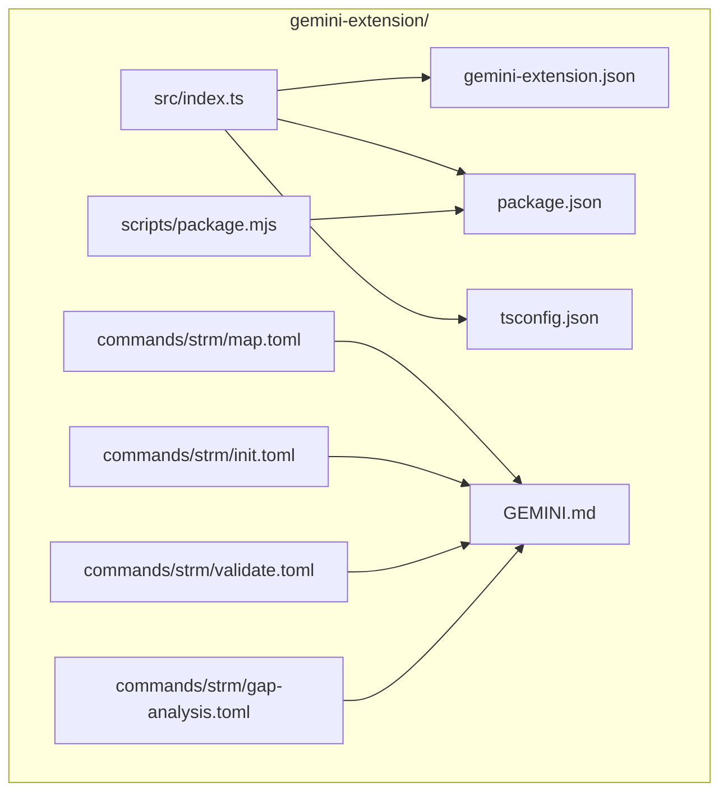
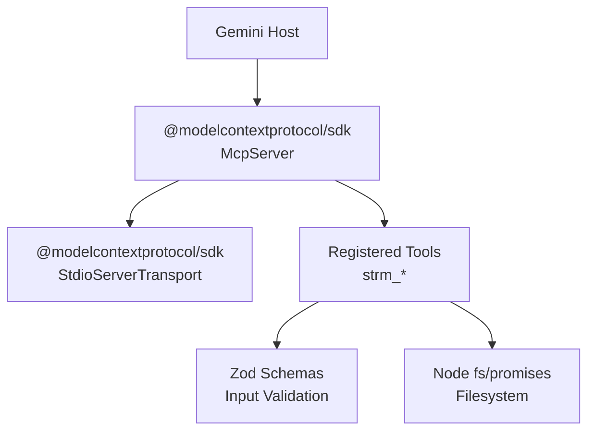
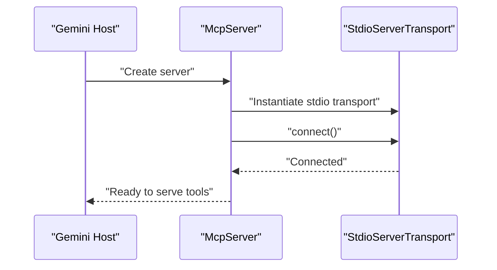
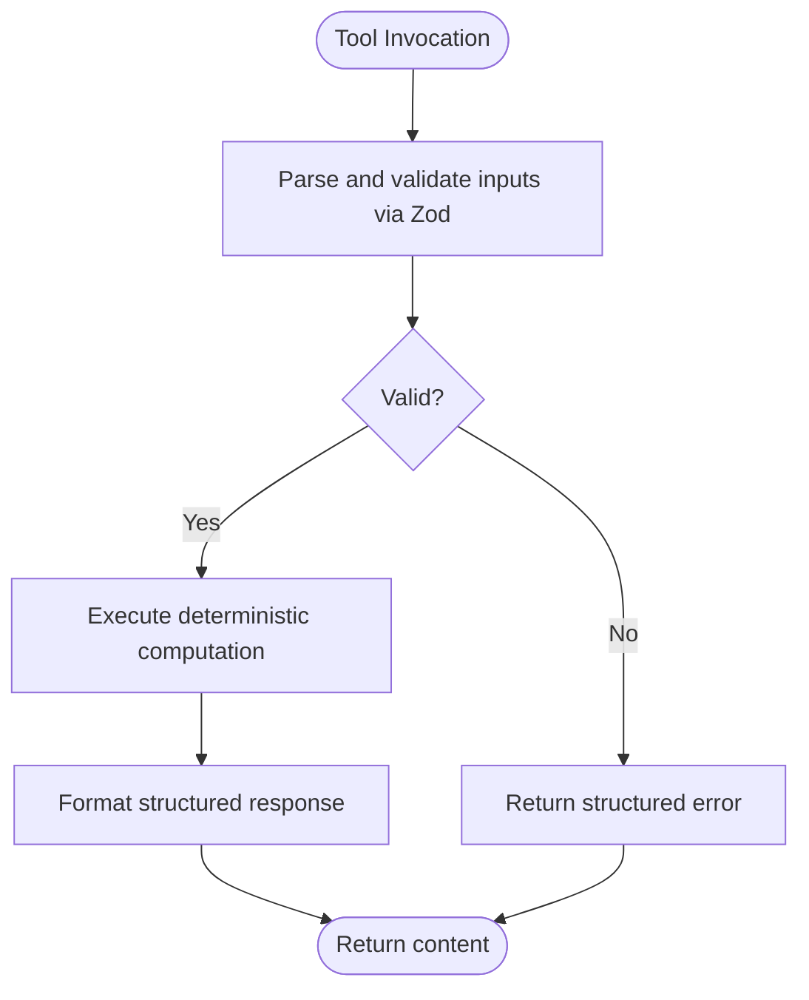
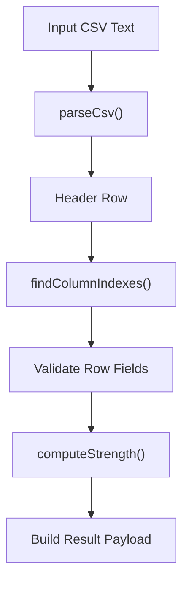
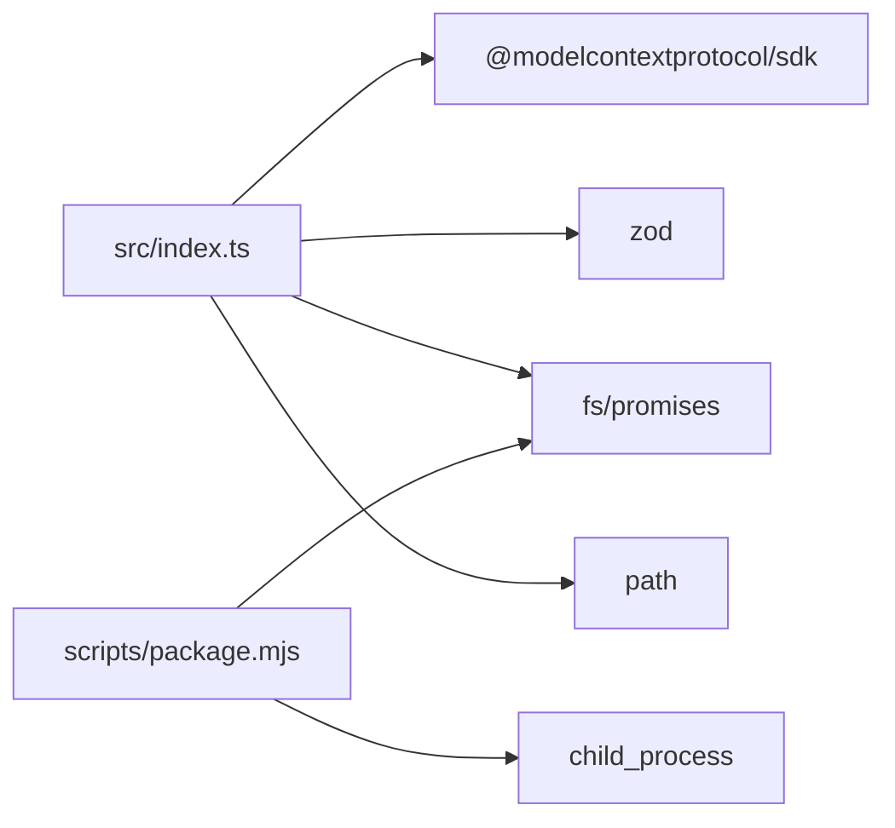

# TypeScript Implementation and Architecture

<cite>
**Referenced Files in This Document**
- [package.json](file://gemini-extension/package.json)
- [tsconfig.json](file://gemini-extension/tsconfig.json)
- [gemini-extension.json](file://gemini-extension/gemini-extension.json)
- [src/index.ts](file://gemini-extension/src/index.ts)
- [scripts/package.mjs](file://gemini-extension/scripts/package.mjs)
- [GEMINI.md](file://gemini-extension/GEMINI.md)
- [commands/strm/map.toml](file://gemini-extension/commands/strm/map.toml)
- [commands/strm/init.toml](file://gemini-extension/commands/strm/init.toml)
- [commands/strm/validate.toml](file://gemini-extension/commands/strm/validate.toml)
- [commands/strm/gap-analysis.toml](file://gemini-extension/commands/strm/gap-analysis.toml)
</cite>

## Table of Contents
1. [Introduction](#introduction)
2. [Project Structure](#project-structure)
3. [Core Components](#core-components)
4. [Architecture Overview](#architecture-overview)
5. [Detailed Component Analysis](#detailed-component-analysis)
6. [Dependency Analysis](#dependency-analysis)
7. [Performance Considerations](#performance-considerations)
8. [Troubleshooting Guide](#troubleshooting-guide)
9. [Conclusion](#conclusion)
10. [Appendices](#appendices)

## Introduction
This document describes the TypeScript implementation and architecture of the Gemini CLI extension for NIST IR 8477 Set-Theory Relationship Mapping (STRM). It explains the main entry point, MCP server initialization, tool registration, TypeScript architecture patterns, module organization, Zod-based validation, build and packaging processes, MCP SDK integration, protocol handling, asynchronous operations, and development workflows. It also covers packaging automation across platforms, distribution mechanisms, version management, and testing strategies.

## Project Structure
The extension is organized around a single TypeScript entry point that initializes an MCP server and registers deterministic tools. Supporting assets include a manifest for Gemini, TOML command prompts, and a packaging script for multi-platform releases.

**Diagram sources**
- [src/index.ts:1-783](file://gemini-extension/src/index.ts#L1-L783)
- [gemini-extension.json:1-13](file://gemini-extension/gemini-extension.json#L1-L13)
- [package.json:1-26](file://gemini-extension/package.json#L1-L26)
- [tsconfig.json:1-18](file://gemini-extension/tsconfig.json#L1-L18)
- [GEMINI.md:1-95](file://gemini-extension/GEMINI.md#L1-L95)
- [commands/strm/map.toml:1-20](file://gemini-extension/commands/strm/map.toml#L1-L20)
- [commands/strm/init.toml:1-14](file://gemini-extension/commands/strm/init.toml#L1-L14)
- [commands/strm/validate.toml:1-18](file://gemini-extension/commands/strm/validate.toml#L1-L18)
- [commands/strm/gap-analysis.toml:1-19](file://gemini-extension/commands/strm/gap-analysis.toml#L1-L19)
- [scripts/package.mjs:1-106](file://gemini-extension/scripts/package.mjs#L1-L106)

**Section sources**
- [package.json:1-26](file://gemini-extension/package.json#L1-L26)
- [tsconfig.json:1-18](file://gemini-extension/tsconfig.json#L1-L18)
- [gemini-extension.json:1-13](file://gemini-extension/gemini-extension.json#L1-L13)
- [src/index.ts:1-783](file://gemini-extension/src/index.ts#L1-L783)
- [GEMINI.md:1-95](file://gemini-extension/GEMINI.md#L1-L95)
- [commands/strm/map.toml:1-20](file://gemini-extension/commands/strm/map.toml#L1-L20)
- [commands/strm/init.toml:1-14](file://gemini-extension/commands/strm/init.toml#L1-L14)
- [commands/strm/validate.toml:1-18](file://gemini-extension/commands/strm/validate.toml#L1-L18)
- [commands/strm/gap-analysis.toml:1-19](file://gemini-extension/commands/strm/gap-analysis.toml#L1-L19)
- [scripts/package.mjs:1-106](file://gemini-extension/scripts/package.mjs#L1-L106)

## Core Components
- MCP Server and Transport: Initializes an MCP server and connects it to the host via stdio.
- Deterministic Tools: Seven tools registered with Zod schemas for input validation and structured output.
- Utilities: CSV parsing, header building, filename generation, row validation, and filesystem helpers.
- Packaging Script: Automates multi-platform release archives.

Key responsibilities:
- Server lifecycle and tool registration are centralized in the entry point.
- Validation is enforced via Zod schemas attached to each tool.
- Asynchronous operations handle filesystem reads and directory scans.
- Packaging script ensures consistent release artifacts across platforms.

**Section sources**
- [src/index.ts:367-783](file://gemini-extension/src/index.ts#L367-L783)
- [src/index.ts:47-195](file://gemini-extension/src/index.ts#L47-L195)
- [src/index.ts:197-294](file://gemini-extension/src/index.ts#L197-L294)
- [src/index.ts:300-365](file://gemini-extension/src/index.ts#L300-L365)
- [scripts/package.mjs:47-100](file://gemini-extension/scripts/package.mjs#L47-L100)

## Architecture Overview
The extension runs as an MCP server over stdio. The main entry point creates the server, registers tools with Zod schemas, and connects to the host. Tools encapsulate STRM-specific logic and return structured text content. The packaging script builds platform-specific archives for distribution.

**Diagram sources**
- [src/index.ts:371-374](file://gemini-extension/src/index.ts#L371-L374)
- [src/index.ts:781-782](file://gemini-extension/src/index.ts#L781-L782)
- [src/index.ts:377-414](file://gemini-extension/src/index.ts#L377-L414)
- [src/index.ts:417-447](file://gemini-extension/src/index.ts#L417-L447)
- [src/index.ts:450-481](file://gemini-extension/src/index.ts#L450-L481)
- [src/index.ts:484-540](file://gemini-extension/src/index.ts#L484-L540)
- [src/index.ts:543-580](file://gemini-extension/src/index.ts#L543-L580)
- [src/index.ts:583-622](file://gemini-extension/src/index.ts#L583-L622)
- [src/index.ts:625-775](file://gemini-extension/src/index.ts#L625-L775)

## Detailed Component Analysis

### Main Entry Point and Server Initialization
- Creates an MCP server with name and version metadata.
- Establishes stdio transport and connects immediately.
- Exposes synchronous startup via async connect.

**Diagram sources**
- [src/index.ts:371-374](file://gemini-extension/src/index.ts#L371-L374)
- [src/index.ts:781-782](file://gemini-extension/src/index.ts#L781-L782)

**Section sources**
- [src/index.ts:367-375](file://gemini-extension/src/index.ts#L367-L375)
- [src/index.ts:781-783](file://gemini-extension/src/index.ts#L781-L783)

### Tool Registration Mechanisms
Seven tools are registered with Zod schemas and async handlers. Each tool defines:
- Tool name
- Description
- Input schema validated by Zod
- Handler that performs deterministic computation and returns structured text content

Tools:
- strm_compute_strength: Computes STRM strength score from relationship, confidence, and rationale type.
- strm_generate_filename: Generates canonical CSV filename for a mapping.
- strm_build_csv_header: Builds the single header row with target-aware column labels.
- strm_validate_row: Validates a single row against quality rules.
- strm_list_input_files: Lists supported input files under a directory.
- strm_check_existing_mapping: Detects prior STRM outputs for a focal→target pair.
- strm_validate_csv: Validates a full CSV for row-level and cross-row quality.

**Diagram sources**
- [src/index.ts:377-414](file://gemini-extension/src/index.ts#L377-L414)
- [src/index.ts:417-447](file://gemini-extension/src/index.ts#L417-L447)
- [src/index.ts:450-481](file://gemini-extension/src/index.ts#L450-L481)
- [src/index.ts:484-540](file://gemini-extension/src/index.ts#L484-L540)
- [src/index.ts:543-580](file://gemini-extension/src/index.ts#L543-L580)
- [src/index.ts:583-622](file://gemini-extension/src/index.ts#L583-L622)
- [src/index.ts:625-775](file://gemini-extension/src/index.ts#L625-L775)

**Section sources**
- [src/index.ts:377-414](file://gemini-extension/src/index.ts#L377-L414)
- [src/index.ts:417-447](file://gemini-extension/src/index.ts#L417-L447)
- [src/index.ts:450-481](file://gemini-extension/src/index.ts#L450-L481)
- [src/index.ts:484-540](file://gemini-extension/src/index.ts#L484-L540)
- [src/index.ts:543-580](file://gemini-extension/src/index.ts#L543-L580)
- [src/index.ts:583-622](file://gemini-extension/src/index.ts#L583-L622)
- [src/index.ts:625-775](file://gemini-extension/src/index.ts#L625-L775)

### Zod-Based Validation Patterns
- Each tool’s inputSchema is a Zod object describing required fields, enumerations, and defaults.
- Validation occurs automatically when the MCP SDK invokes the tool handler.
- Handlers receive strongly-typed parameters inferred from the schema.

Example patterns:
- Enum constraints for relationship, confidence, and rationale type.
- Optional fields with defaults.
- Numeric and string field constraints.

**Section sources**
- [src/index.ts:383-393](file://gemini-extension/src/index.ts#L383-L393)
- [src/index.ts:423-434](file://gemini-extension/src/index.ts#L423-L434)
- [src/index.ts:459-464](file://gemini-extension/src/index.ts#L459-L464)
- [src/index.ts:491-518](file://gemini-extension/src/index.ts#L491-L518)
- [src/index.ts:549-557](file://gemini-extension/src/index.ts#L549-L557)
- [src/index.ts:589-596](file://gemini-extension/src/index.ts#L589-L596)
- [src/index.ts:632-645](file://gemini-extension/src/index.ts#L632-L645)

### Utility Functions and Data Structures
- Relationship, Confidence, and RationaleType enums define STRM scoring semantics.
- computeStrength: Applies NIST IR 8477 scoring formula with clamping to 1–10.
- Filename and header builders: Generate canonical outputs for artifacts.
- CSV parser: Robust comma-separated value parsing with quoted cell support.
- Column index finder: Normalizes headers and maps keys to indices.
- Filesystem helpers: Scans directories for supported extensions and finds existing STRM outputs.

**Diagram sources**
- [src/index.ts:47-58](file://gemini-extension/src/index.ts#L47-L58)
- [src/index.ts:197-260](file://gemini-extension/src/index.ts#L197-L260)
- [src/index.ts:266-284](file://gemini-extension/src/index.ts#L266-L284)
- [src/index.ts:625-775](file://gemini-extension/src/index.ts#L625-L775)

**Section sources**
- [src/index.ts:19-58](file://gemini-extension/src/index.ts#L19-L58)
- [src/index.ts:64-88](file://gemini-extension/src/index.ts#L64-L88)
- [src/index.ts:99-106](file://gemini-extension/src/index.ts#L99-L106)
- [src/index.ts:197-294](file://gemini-extension/src/index.ts#L197-L294)
- [src/index.ts:300-365](file://gemini-extension/src/index.ts#L300-L365)
- [src/index.ts:625-775](file://gemini-extension/src/index.ts#L625-L775)

### Command Prompts and Workflow Orchestration
The extension ships with TOML command prompts that guide users through mapping workflows:
- map.toml: End-to-end mapping session steps.
- init.toml: Artifact initialization with optional bridge framework.
- validate.toml: Batch validation of existing STRM CSV files.
- gap-analysis.toml: Gap analysis after mapping completion.

These prompts coordinate with external scripts to list inputs, check existing mappings, compute strengths, and validate outputs.

**Section sources**
- [commands/strm/map.toml:1-20](file://gemini-extension/commands/strm/map.toml#L1-L20)
- [commands/strm/init.toml:1-14](file://gemini-extension/commands/strm/init.toml#L1-L14)
- [commands/strm/validate.toml:1-18](file://gemini-extension/commands/strm/validate.toml#L1-L18)
- [commands/strm/gap-analysis.toml:1-19](file://gemini-extension/commands/strm/gap-analysis.toml#L1-L19)
- [GEMINI.md:41-51](file://gemini-extension/GEMINI.md#L41-L51)

## Dependency Analysis
External dependencies:
- @modelcontextprotocol/sdk: Provides McpServer and StdioServerTransport.
- zod: Enforces input validation via schemas.
- Node built-ins: fs/promises and path for filesystem operations.

Internal dependencies:
- Tools depend on shared utilities (parsers, validators, helpers).
- Packaging script depends on Node child_process and filesystem APIs.

**Diagram sources**
- [src/index.ts:9-13](file://gemini-extension/src/index.ts#L9-L13)
- [scripts/package.mjs:3-6](file://gemini-extension/scripts/package.mjs#L3-L6)

**Section sources**
- [src/index.ts:9-13](file://gemini-extension/src/index.ts#L9-L13)
- [package.json:14-21](file://gemini-extension/package.json#L14-L21)
- [scripts/package.mjs:3-6](file://gemini-extension/scripts/package.mjs#L3-L6)

## Performance Considerations
- Asynchronous filesystem operations: Directory scanning and file reads are awaited; ensure directories are not excessively large to avoid long blocking periods.
- CSV parsing: The parser is designed to handle quoted cells and mixed newlines; for very large files, consider streaming or chunked processing.
- Tool execution: Each tool is deterministic and lightweight; avoid unnecessary repeated validations by batching operations.
- Packaging: Archive creation uses platform-native tools; ensure sufficient disk space and permissions.

[No sources needed since this section provides general guidance]

## Troubleshooting Guide
Common issues and resolutions:
- Missing required release inputs during packaging: Ensure build artifacts and dependencies exist before packaging.
- Empty CSV validation: The validator reports empty files as errors; populate the CSV before validation.
- Unresolved target headers: Replace placeholder tokens with actual target names.
- Duplicate mapping pairs: The validator detects repeated FDE→Target combinations; deduplicate before finalization.
- Workspace path resolution: Tools rely on WORKSPACE_PATH or current working directory; set the environment variable if needed.

**Section sources**
- [scripts/package.mjs:77-81](file://gemini-extension/scripts/package.mjs#L77-L81)
- [src/index.ts:651-664](file://gemini-extension/src/index.ts#L651-L664)
- [src/index.ts:684-689](file://gemini-extension/src/index.ts#L684-L689)
- [src/index.ts:721-729](file://gemini-extension/src/index.ts#L721-L729)

## Conclusion
The extension implements a clean, modular architecture centered on an MCP server with seven deterministic tools. Zod schemas enforce strong input validation, while utility functions encapsulate STRM-specific logic. The build and packaging pipeline supports rapid iteration and multi-platform distribution. Together, these components enable reliable, repeatable STRM workflows within Gemini.

[No sources needed since this section summarizes without analyzing specific files]

## Appendices

### Build Process and Scripts
- TypeScript compilation: Uses tsconfig with ES2022 target and NodeNext module resolution.
- Watch mode: Development builds with source maps and declarations.
- Start: Executes the compiled entry point.
- Packaging: Generates platform-specific archives using zip or tar.gz.

**Section sources**
- [tsconfig.json:1-18](file://gemini-extension/tsconfig.json#L1-L18)
- [package.json:7-13](file://gemini-extension/package.json#L7-L13)
- [scripts/package.mjs:47-100](file://gemini-extension/scripts/package.mjs#L47-L100)

### MCP SDK Integration and Protocol Handling
- Server instantiation and connection via stdio transport.
- Tool registration with Zod schemas and async handlers.
- Structured text content returned for tool outputs.

**Section sources**
- [src/index.ts:371-374](file://gemini-extension/src/index.ts#L371-L374)
- [src/index.ts:781-782](file://gemini-extension/src/index.ts#L781-L782)
- [src/index.ts:377-414](file://gemini-extension/src/index.ts#L377-L414)

### Packaging Automation and Distribution
- Platform selection: Reads platform and arch from arguments or environment.
- Archive naming: Includes platform, arch, and extension name.
- Release inputs: Requires manifest, context file, commands, dist, package files, and node_modules.
- Archive creation: Uses zip for Windows and tar.gz for Unix-like systems.

**Section sources**
- [scripts/package.mjs:47-100](file://gemini-extension/scripts/package.mjs#L47-L100)
- [gemini-extension.json:5-11](file://gemini-extension/gemini-extension.json#L5-L11)

### Version Management
- Extension version is defined in both package.json and gemini-extension.json.
- MCP server version mirrors the extension version.

**Section sources**
- [package.json:2-4](file://gemini-extension/package.json#L2-L4)
- [gemini-extension.json:2-4](file://gemini-extension/gemini-extension.json#L2-L4)
- [src/index.ts:371-374](file://gemini-extension/src/index.ts#L371-L374)

### Development Workflows and Testing Strategies
- Development: Use watch mode for iterative TypeScript compilation.
- Testing: Validate individual tools by invoking them with representative inputs; use the validate tools to catch errors early.
- Integration: Test end-to-end workflows using the command prompts and external scripts.
- Debugging: Enable source maps and logs; inspect structured tool outputs for diagnostics.

**Section sources**
- [package.json:8-12](file://gemini-extension/package.json#L8-L12)
- [src/index.ts:484-540](file://gemini-extension/src/index.ts#L484-L540)
- [src/index.ts:625-775](file://gemini-extension/src/index.ts#L625-L775)
- [GEMINI.md:41-51](file://gemini-extension/GEMINI.md#L41-L51)