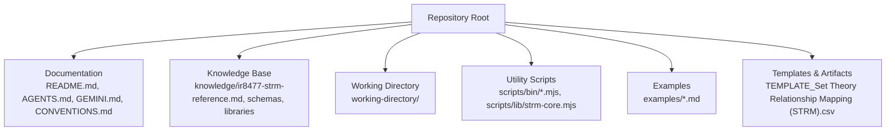
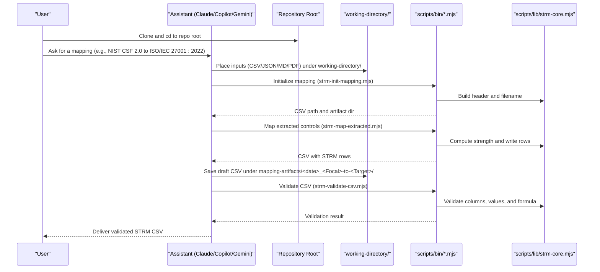
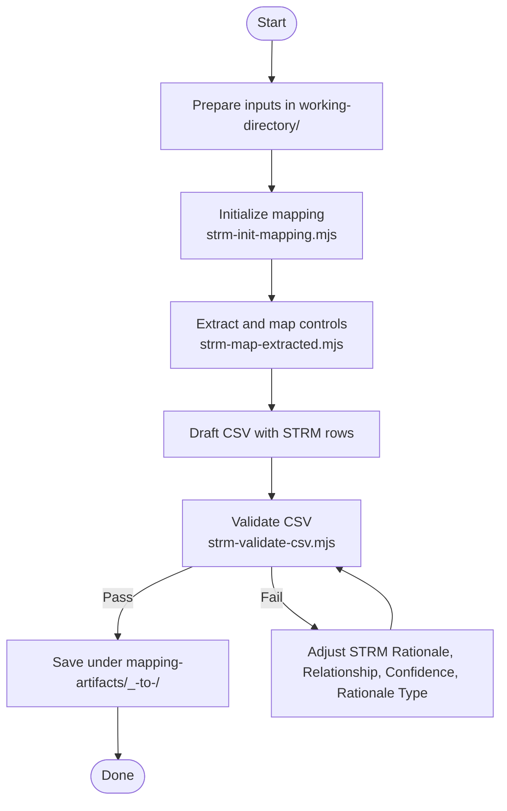
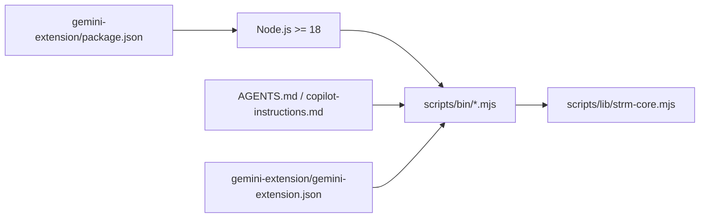

# Getting Started

<cite>
**Referenced Files in This Document**
- [README.md](file://README.md)
- [CONVENTIONS.md](file://CONVENTIONS.md)
- [AGENTS.md](file://AGENTS.md)
- [GEMINI.md](file://GEMINI.md)
- [scripts/README.md](file://scripts/README.md)
- [scripts/bin/strm-init-mapping.mjs](file://scripts/bin/strm-init-mapping.mjs)
- [scripts/bin/strm-map-extracted.mjs](file://scripts/bin/strm-map-extracted.mjs)
- [scripts/lib/strm-core.mjs](file://scripts/lib/strm-core.mjs)
- [gemini-extension/package.json](file://gemini-extension/package.json)
- [gemini-extension/gemini-extension.json](file://gemini-extension/gemini-extension.json)
- [.github/copilot-instructions.md](file://.github/copilot-instructions.md)
- [knowledge/ir8477-strm-reference.md](file://knowledge/ir8477-strm-reference.md)
- [TEMPLATE_Set Theory Relationship Mapping (STRM).csv](file://TEMPLATE_Set Theory Relationship Mapping (STRM).csv)
- [examples/example-framework-to-control.md](file://examples/example-framework-to-control.md)
- [examples/example-framework-to-regulation.md](file://examples/example-framework-to-regulation.md)
</cite>

## Table of Contents
1. [Introduction](#introduction)
2. [Project Structure](#project-structure)
3. [Core Components](#core-components)
4. [Architecture Overview](#architecture-overview)
5. [Detailed Component Analysis](#detailed-component-analysis)
6. [Dependency Analysis](#dependency-analysis)
7. [Performance Considerations](#performance-considerations)
8. [Troubleshooting Guide](#troubleshooting-guide)
9. [Conclusion](#conclusion)
10. [Appendices](#appendices)

## Introduction
This guide helps you onboard to the STRM-Mapping toolkit and start producing Set-Theory Relationship Mapping (STRM) outputs across cybersecurity frameworks, control catalogs, and regulations. The project is a cross-platform AI toolkit that follows NIST IR 8477 methodology to generate precise, quantified mappings and CSV artifacts.

Key goals:
- Understand the project’s purpose and methodology
- Follow repository usage rules and working directory conventions
- Install prerequisites and run from the repository root
- Use AI assistants (Claude, Gemini, GitHub Copilot) with quick-start workflows
- Perform a practical mapping example (NIST CSF 2.0 to ISO/IEC 27001:2022)
- Troubleshoot common setup issues

## Project Structure
At a high level, the repository organizes:
- Documentation and methodology references
- Working directory for inputs/outputs and artifacts
- Utility scripts for deterministic STRM operations
- Example mappings and templates

**Diagram sources**
- [README.md:1-30](file://README.md#L1-L30)
- [CONVENTIONS.md:17-32](file://CONVENTIONS.md#L17-L32)
- [GEMINI.md:27-47](file://GEMINI.md#L27-L47)
- [scripts/README.md:1-31](file://scripts/README.md#L1-L31)

**Section sources**
- [README.md:1-30](file://README.md#L1-L30)
- [CONVENTIONS.md:17-32](file://CONVENTIONS.md#L17-L32)
- [GEMINI.md:27-47](file://GEMINI.md#L27-L47)
- [scripts/README.md:1-31](file://scripts/README.md#L1-L31)

## Core Components
- Repository purpose and methodology: STRM follows NIST IR 8477 to define precise relationships (equal, subset_of, superset_of, intersects_with, not_related) and compute a 1–10 strength score.
- Working directory and artifact conventions: Inputs and outputs live under working-directory/, with completed artifacts placed under mapping-artifacts/<date>_<Focal>-to-<Target>/.
- Template and CSV structure: Use TEMPLATE_Set Theory Relationship Mapping (STRM).csv as the starting point and adhere to the 12-column format.
- Scripted operations: Deterministic Node.js scripts support listing inputs, initializing mappings, extracting and mapping JSON, computing strengths, validating CSVs, and generating filenames and headers.

**Section sources**
- [CONVENTIONS.md:17-115](file://CONVENTIONS.md#L17-L115)
- [GEMINI.md:105-137](file://GEMINI.md#L105-L137)
- [scripts/README.md:10-31](file://scripts/README.md#L10-L31)
- [TEMPLATE_Set Theory Relationship Mapping (STRM).csv:1-2](file://TEMPLATE_Set Theory Relationship Mapping (STRM).csv#L1-L2)

## Architecture Overview
The onboarding workflow integrates AI assistants with repository conventions and deterministic scripts.

**Diagram sources**
- [README.md:18-22](file://README.md#L18-L22)
- [scripts/bin/strm-init-mapping.mjs:12-58](file://scripts/bin/strm-init-mapping.mjs#L12-L58)
- [scripts/bin/strm-map-extracted.mjs:1-278](file://scripts/bin/strm-map-extracted.mjs#L1-L278)
- [scripts/lib/strm-core.mjs:35-57](file://scripts/lib/strm-core.mjs#L35-L57)
- [scripts/README.md:10-31](file://scripts/README.md#L10-L31)

## Detailed Component Analysis

### Installation and Prerequisites
- Node.js: The scripts are Node.js programs. The Gemini extension requires Node.js >= 18.0.0.
- AI assistants:
  - Claude: Use the repository root and follow the quick-start prompt.
  - GitHub Copilot: Uses AGENTS.md and copilot-instructions.md as context.
  - Gemini: Uses GEMINI.md and the extension configuration to run MCP servers.

What to install:
- Node.js 18+ (required for scripts and extension)
- Install dependencies for the Gemini extension if building locally (TypeScript, zod, @modelcontextprotocol/sdk)

Verification steps:
- Confirm Node.js version meets the requirement.
- Verify the extension’s engines setting and build scripts.

**Section sources**
- [gemini-extension/package.json:22-24](file://gemini-extension/package.json#L22-L24)
- [gemini-extension/gemini-extension.json:1-13](file://gemini-extension/gemini-extension.json#L1-L13)
- [README.md:18-22](file://README.md#L18-L22)
- [.github/copilot-instructions.md:1-106](file://.github/copilot-instructions.md#L1-L106)
- [GEMINI.md:1-224](file://GEMINI.md#L1-L224)

### Running From Repository Root
- Always run AI assistants and scripts from the repository root so relative paths resolve correctly.
- Place all inputs and outputs under working-directory/.
- Do not write generated artifacts to the repo root.
- Keep the template unchanged.

**Section sources**
- [README.md:24-30](file://README.md#L24-L30)
- [CONVENTIONS.md:26-32](file://CONVENTIONS.md#L26-L32)
- [GEMINI.md:27-47](file://GEMINI.md#L27-L47)
- [AGENTS.md:21-28](file://AGENTS.md#L21-L28)

### Quick Start Workflows by Assistant

#### Claude
- Start from the repository root.
- Ask Claude to map two frameworks or catalogs (e.g., “Map NIST CSF 2.0 to ISO/IEC 27001:2022”).
- Claude will use AGENTS.md and SKILL definitions to guide the mapping.

**Section sources**
- [README.md:18-22](file://README.md#L18-L22)
- [AGENTS.md:31-42](file://AGENTS.md#L31-L42)

#### GitHub Copilot
- Copilot reads AGENTS.md and copilot-instructions.md to understand the STRM methodology and output format.
- Use prompts that specify source and target documents; Copilot will adhere to the 12-column CSV structure and naming conventions.

**Section sources**
- [.github/copilot-instructions.md:1-106](file://.github/copilot-instructions.md#L1-L106)
- [AGENTS.md:31-42](file://AGENTS.md#L31-L42)

#### Gemini
- Gemini reads GEMINI.md and the extension configuration to understand the workflow.
- Use the extension to run MCP servers and follow the step-by-step workflow: gather inputs, identify FDE/RDE, assign attributes, write CSV, and save under mapping-artifacts.

**Section sources**
- [GEMINI.md:1-224](file://GEMINI.md#L1-L224)
- [gemini-extension/gemini-extension.json:1-13](file://gemini-extension/gemini-extension.json#L1-L13)

### Basic Usage Examples

#### Framework-to-Control Mapping Example
- See a worked example of mapping NIST SP 800-53 Rev 5 to CIS Controls v8.1, including headers, rationale patterns, and strength calculations.

**Section sources**
- [examples/example-framework-to-control.md:1-159](file://examples/example-framework-to-control.md#L1-L159)

#### Framework-to-Regulation Mapping Example
- See a worked example of mapping NIST SP 800-53 Rev 5 to GDPR, including headers, rationale patterns, and strength calculations.

**Section sources**
- [examples/example-framework-to-regulation.md:1-163](file://examples/example-framework-to-regulation.md#L1-L163)

### Practical Mapping Example: NIST CSF 2.0 to ISO/IEC 27001:2022
Steps:
1. Prepare inputs:
   - Place the source and target documents under working-directory/.
2. Initialize mapping:
   - Use the initialization script to create the CSV with the correct header and filename.
3. Extract and map:
   - Use the extraction and mapping script to generate draft STRM rows.
4. Validate and finalize:
   - Validate the CSV with the validator script.
   - Save the completed artifact under mapping-artifacts/<date>_<Focal>-to-<Target>/.

**Diagram sources**
- [scripts/bin/strm-init-mapping.mjs:12-58](file://scripts/bin/strm-init-mapping.mjs#L12-L58)
- [scripts/bin/strm-map-extracted.mjs:1-278](file://scripts/bin/strm-map-extracted.mjs#L1-L278)
- [scripts/README.md:10-31](file://scripts/README.md#L10-L31)

**Section sources**
- [README.md:18-22](file://README.md#L18-L22)
- [scripts/bin/strm-init-mapping.mjs:12-58](file://scripts/bin/strm-init-mapping.mjs#L12-L58)
- [scripts/bin/strm-map-extracted.mjs:1-278](file://scripts/bin/strm-map-extracted.mjs#L1-L278)
- [scripts/README.md:10-31](file://scripts/README.md#L10-L31)

## Dependency Analysis
- Node.js runtime: Required for scripts and the Gemini extension.
- Scripts depend on the shared core module for parsing CSV, computing strengths, and resolving paths.
- AI assistants rely on repository context files (AGENTS.md, GEMINI.md, copilot-instructions.md) to align behavior with STRM methodology.

**Diagram sources**
- [gemini-extension/package.json:22-24](file://gemini-extension/package.json#L22-L24)
- [gemini-extension/gemini-extension.json:1-13](file://gemini-extension/gemini-extension.json#L1-L13)
- [scripts/lib/strm-core.mjs:1-343](file://scripts/lib/strm-core.mjs#L1-L343)

**Section sources**
- [gemini-extension/package.json:22-24](file://gemini-extension/package.json#L22-L24)
- [gemini-extension/gemini-extension.json:1-13](file://gemini-extension/gemini-extension.json#L1-L13)
- [scripts/lib/strm-core.mjs:1-343](file://scripts/lib/strm-core.mjs#L1-L343)

## Performance Considerations
- Use the provided scripts to ensure deterministic behavior and avoid manual errors.
- Keep input files organized under working-directory/ to minimize path resolution overhead.
- Prefer direct mappings when possible; use bridge frameworks only when necessary to reduce complexity.

## Troubleshooting Guide
Common beginner issues and resolutions:
- Not running from repository root:
  - Symptom: Relative paths fail or scripts cannot locate inputs.
  - Resolution: Always run from the repository root and place inputs under working-directory/.

- Incorrect CSV structure or missing fields:
  - Symptom: Validation fails due to empty rationale, invalid relationship, or wrong strength.
  - Resolution: Ensure all required columns are present and compute strength using the formula.

- Missing or incorrect target control IDs:
  - Symptom: Validation warns about invented IDs.
  - Resolution: Use only IDs present in the target document.

- Using the wrong template:
  - Symptom: Headers do not match expectations.
  - Resolution: Copy TEMPLATE_Set Theory Relationship Mapping (STRM).csv and rename according to the naming convention.

- Ignoring risk/threat enrichment:
  - Symptom: Unexpected discrepancies when adding risk/threat context.
  - Resolution: Load knowledge/library/risks.json and knowledge/library/threats.json only when explicitly requested.

**Section sources**
- [README.md:24-30](file://README.md#L24-L30)
- [CONVENTIONS.md:26-32](file://CONVENTIONS.md#L26-L32)
- [scripts/README.md:23-31](file://scripts/README.md#L23-L31)
- [GEMINI.md:174-184](file://GEMINI.md#L174-L184)
- [scripts/lib/strm-core.mjs:206-265](file://scripts/lib/strm-core.mjs#L206-L265)

## Conclusion
You are now ready to onboard to the STRM-Mapping toolkit. Follow the repository rules, run from the repository root, and leverage the AI assistants with the provided workflows. Use the scripts to initialize, extract, map, and validate STRM outputs, and consult the examples and methodology references for guidance.

## Appendices

### Quick Reference: Repository Rules
- Run from repository root.
- Put inputs/outputs in working-directory/.
- Do not write generated artifacts to the repo root.
- Keep TEMPLATE_Set Theory Relationship Mapping (STRM).csv unchanged.

**Section sources**
- [README.md:24-30](file://README.md#L24-L30)

### Quick Reference: CSV Output Format (12 columns)
- Columns include FDE#, FDE Name, Focal Document Element (FDE), Confidence Levels, NIST IR-8477 Rational, STRM Rationale, STRM Relationship, Strength of Relationship, <Target> Requirement Title, Target ID #, <Target> Requirement Description, Notes.

**Section sources**
- [CONVENTIONS.md:95-115](file://CONVENTIONS.md#L95-L115)
- [GEMINI.md:131-137](file://GEMINI.md#L131-L137)

### Quick Reference: Relationship Types and Strength Formula
- Relationships: equal, subset_of, superset_of, intersects_with, not_related.
- Strength computation: base score plus confidence adjustment plus rationale adjustment, clamped to 1–10.

**Section sources**
- [CONVENTIONS.md:46-77](file://CONVENTIONS.md#L46-L77)
- [GEMINI.md:95-104](file://GEMINI.md#L95-L104)
- [knowledge/ir8477-strm-reference.md:16-57](file://knowledge/ir8477-strm-reference.md#L16-L57)