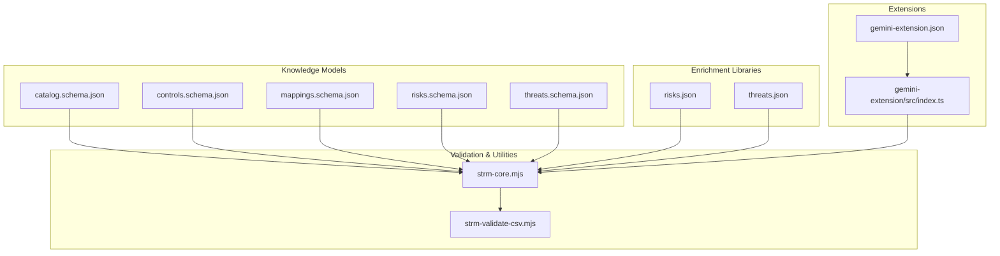
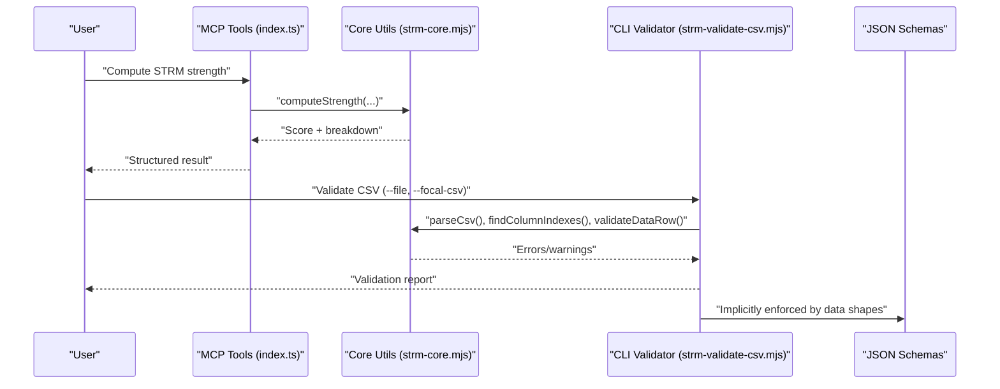
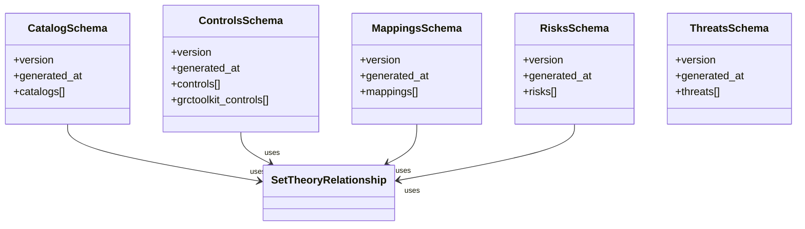
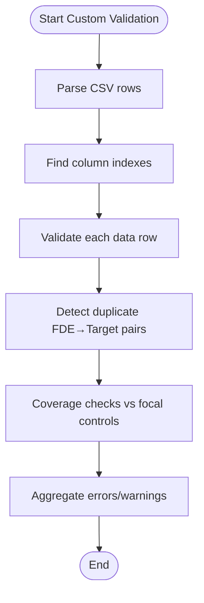
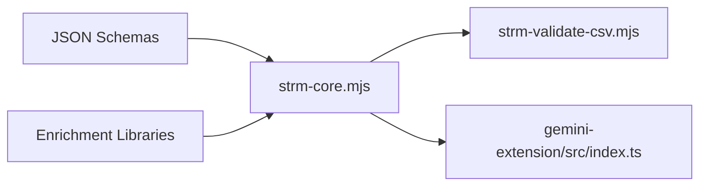

# Data Model Extensions and Customization

<cite>
**Referenced Files in This Document**
- [catalog.schema.json](file://knowledge/catalog.schema.json)
- [controls.schema.json](file://knowledge/controls.schema.json)
- [mappings.schema.json](file://knowledge/mappings.schema.json)
- [risks.schema.json](file://knowledge/risks.schema.json)
- [threats.schema.json](file://knowledge/threats.schema.json)
- [risks.json](file://knowledge/library/risks.json)
- [threats.json](file://knowledge/library/threats.json)
- [strm-core.mjs](file://scripts/lib/strm-core.mjs)
- [strm-validate-csv.mjs](file://scripts/bin/strm-validate-csv.mjs)
- [index.ts](file://gemini-extension/src/index.ts)
- [gemini-extension.json](file://gemini-extension/gemini-extension.json)
- [CONVENTIONS.md](file://CONVENTIONS.md)
- [example-control-to-control.md](file://examples/example-control-to-control.md)
- [example-framework-to-control.md](file://examples/example-framework-to-control.md)
</cite>

## Table of Contents
1. [Introduction](#introduction)
2. [Project Structure](#project-structure)
3. [Core Components](#core-components)
4. [Architecture Overview](#architecture-overview)
5. [Detailed Component Analysis](#detailed-component-analysis)
6. [Dependency Analysis](#dependency-analysis)
7. [Performance Considerations](#performance-considerations)
8. [Troubleshooting Guide](#troubleshooting-guide)
9. [Conclusion](#conclusion)
10. [Appendices](#appendices)

## Introduction
This document explains how to extend and customize the STRM toolkit’s data models for organization-specific use cases while preserving compatibility with existing workflows. It focuses on:
- Extensibility mechanisms embedded in the JSON schemas (optional fields, custom properties, and validation rule adjustments)
- Creating custom control catalogs, mapping types, and enrichment libraries
- Extending risk and threat libraries with organization categories and new relationship types
- Implementing custom validation rules and integrating with external data sources
- Migration strategies, backward compatibility, version management, and testing procedures
- Maintaining data integrity, validation consistency, and interoperability across implementations

## Project Structure
The STRM toolkit organizes data models, validation logic, and extension points across several directories:
- knowledge: JSON schemas and curated datasets (catalogs, controls, mappings, risks, threats)
- scripts: Core utilities and validators for STRM CSV processing
- gemini-extension: MCP-based extension for deterministic STRM tooling
- examples: Real-world mapping examples demonstrating STRM workflows
- working-directory: Placeholders for artifacts and mappings
- knowledge/library: Enrichment datasets for risks and threats

**Diagram sources**
- [catalog.schema.json:1-157](file://knowledge/catalog.schema.json#L1-L157)
- [controls.schema.json:1-141](file://knowledge/controls.schema.json#L1-L141)
- [mappings.schema.json:1-117](file://knowledge/mappings.schema.json#L1-L117)
- [risks.schema.json:1-92](file://knowledge/risks.schema.json#L1-L92)
- [threats.schema.json:1-55](file://knowledge/threats.schema.json#L1-L55)
- [risks.json:1-1190](file://knowledge/library/risks.json#L1-L1190)
- [threats.json:1-728](file://knowledge/library/threats.json#L1-L728)
- [strm-core.mjs:1-343](file://scripts/lib/strm-core.mjs#L1-L343)
- [strm-validate-csv.mjs:1-146](file://scripts/bin/strm-validate-csv.mjs#L1-L146)
- [index.ts:1-783](file://gemini-extension/src/index.ts#L1-L783)
- [gemini-extension.json:1-13](file://gemini-extension/gemini-extension.json#L1-L13)

**Section sources**
- [catalog.schema.json:1-157](file://knowledge/catalog.schema.json#L1-L157)
- [controls.schema.json:1-141](file://knowledge/controls.schema.json#L1-L141)
- [mappings.schema.json:1-117](file://knowledge/mappings.schema.json#L1-L117)
- [risks.schema.json:1-92](file://knowledge/risks.schema.json#L1-L92)
- [threats.schema.json:1-55](file://knowledge/threats.schema.json#L1-L55)
- [risks.json:1-1190](file://knowledge/library/risks.json#L1-L1190)
- [threats.json:1-728](file://knowledge/library/threats.json#L1-L728)
- [strm-core.mjs:1-343](file://scripts/lib/strm-core.mjs#L1-L343)
- [strm-validate-csv.mjs:1-146](file://scripts/bin/strm-validate-csv.mjs#L1-L146)
- [index.ts:1-783](file://gemini-extension/src/index.ts#L1-L783)
- [gemini-extension.json:1-13](file://gemini-extension/gemini-extension.json#L1-L13)

## Core Components
This section outlines the extensibility mechanisms and customization hooks embedded in the STRM schemas and runtime utilities.

- Optional fields and custom properties
  - Catalogs dataset: optional set-theory relationships per control and top-level catalogs array
  - Controls dataset: optional set-theory relationships per control and optional GRC Toolkit control block
  - Mappings dataset: optional parameter blocks and optional set-theory relationships alongside legacy relationship field
  - Risks dataset: optional source catalog metadata and optional threat linkage arrays
  - Threats dataset: optional mapped risk linkage arrays and strict additionalProperties constraints

- Validation rule modifications
  - Schema enums constrain relationship types and scopes; customizations should remain within these sets or introduce compatible enumerations
  - AdditionalProperties flags enforce strictness in risk source catalog and threat materiality blocks
  - Mapping parameter blocks permit arbitrary key-value pairs with additionalProperties disabled to preserve clarity

- Extension points
  - Catalogs and controls schemas define reusable $defs for set-theory relationships and control structures, enabling reuse and extension
  - Mappings schema preserves legacy relationship field while introducing set-theory relationships for forward compatibility
  - Enrichment libraries (risks.json, threats.json) provide opt-in linkage and categorization for downstream analysis

**Section sources**
- [catalog.schema.json:57-108](file://knowledge/catalog.schema.json#L57-L108)
- [controls.schema.json:16-138](file://knowledge/controls.schema.json#L16-L138)
- [mappings.schema.json:52-112](file://knowledge/mappings.schema.json#L52-L112)
- [risks.schema.json:51-87](file://knowledge/risks.schema.json#L51-L87)
- [threats.schema.json:9-49](file://knowledge/threats.schema.json#L9-L49)
- [risks.json:1-1190](file://knowledge/library/risks.json#L1-L1190)
- [threats.json:1-728](file://knowledge/library/threats.json#L1-L728)

## Architecture Overview
The STRM toolkit enforces validation through JSON schemas and provides deterministic processing via MCP tools and command-line validators.

**Diagram sources**
- [index.ts:376-540](file://gemini-extension/src/index.ts#L376-L540)
- [strm-core.mjs:35-265](file://scripts/lib/strm-core.mjs#L35-L265)
- [strm-validate-csv.mjs:1-146](file://scripts/bin/strm-validate-csv.mjs#L1-L146)
- [catalog.schema.json:1-157](file://knowledge/catalog.schema.json#L1-L157)
- [controls.schema.json:1-141](file://knowledge/controls.schema.json#L1-L141)
- [mappings.schema.json:1-117](file://knowledge/mappings.schema.json#L1-L117)
- [risks.schema.json:1-92](file://knowledge/risks.schema.json#L1-L92)
- [threats.schema.json:1-55](file://knowledge/threats.schema.json#L1-L55)

## Detailed Component Analysis

### JSON Schema Extensibility Patterns
- Reusable $defs for set-theory relationships enable consistent modeling across catalogs, controls, and risks
- Optional arrays for set-theory relationships allow gradual adoption without breaking existing consumers
- Strict additionalProperties in risk source catalog and threat materiality blocks prevent accidental schema drift
- Parameter blocks in mappings permit framework-specific customization while retaining validation discipline

**Diagram sources**
- [catalog.schema.json:4-144](file://knowledge/catalog.schema.json#L4-L144)
- [controls.schema.json:4-138](file://knowledge/controls.schema.json#L4-L138)
- [mappings.schema.json:4-112](file://knowledge/mappings.schema.json#L4-L112)
- [risks.schema.json:4-87](file://knowledge/risks.schema.json#L4-L87)
- [threats.schema.json:4-49](file://knowledge/threats.schema.json#L4-L49)

**Section sources**
- [catalog.schema.json:4-144](file://knowledge/catalog.schema.json#L4-L144)
- [controls.schema.json:4-138](file://knowledge/controls.schema.json#L4-L138)
- [mappings.schema.json:4-112](file://knowledge/mappings.schema.json#L4-L112)
- [risks.schema.json:4-87](file://knowledge/risks.schema.json#L4-L87)
- [threats.schema.json:4-49](file://knowledge/threats.schema.json#L4-L49)

### Custom Control Catalogs
- Extend catalogs by adding new catalog entries with optional set-theory relationships per control
- Maintain compatibility by keeping control identifiers and structure aligned with the schema’s required fields and optional arrays
- Preserve canonical identifiers and UUIDs where applicable to integrate with downstream mappings

**Section sources**
- [catalog.schema.json:57-142](file://knowledge/catalog.schema.json#L57-L142)

### Custom Mapping Types and Enrichment Libraries
- Extend mappings with parameter blocks to encode framework-specific attributes (e.g., cadence, retention)
- Introduce new relationship types by extending the enums in the schemas while ensuring downstream consumers can handle unknown values gracefully
- Enrich risks and threats with organization-specific categories and groupings; ensure additionalProperties constraints are respected

**Section sources**
- [mappings.schema.json:82-111](file://knowledge/mappings.schema.json#L82-L111)
- [risks.schema.json:66-86](file://knowledge/risks.schema.json#L66-L86)
- [threats.schema.json:27-47](file://knowledge/threats.schema.json#L27-L47)

### Risk and Threat Library Extensions
- Add organization-specific risk groupings and threat categories while preserving existing identifiers
- Link risks to threats and controls using the existing arrays; maintain identifier patterns to ensure referential integrity
- Use the enrichment libraries as optional inputs to inform mapping rationale and strength calculations

**Section sources**
- [risks.json:1-1190](file://knowledge/library/risks.json#L1-L1190)
- [threats.json:1-728](file://knowledge/library/threats.json#L1-L728)
- [risks.schema.json:66-86](file://knowledge/risks.schema.json#L66-L86)
- [threats.schema.json:27-47](file://knowledge/threats.schema.json#L27-L47)

### Custom Validation Rules and Integration
- Implement custom validation by composing the core utilities (parsing, column indexing, row validation) and applying additional checks
- Integrate external data sources by normalizing inputs to match the expected CSV structure and schema constraints
- Use MCP tools to provide deterministic computation for strength scores and file naming, ensuring reproducibility

**Diagram sources**
- [strm-validate-csv.mjs:69-128](file://scripts/bin/strm-validate-csv.mjs#L69-L128)
- [strm-core.mjs:206-265](file://scripts/lib/strm-core.mjs#L206-L265)

**Section sources**
- [strm-validate-csv.mjs:1-146](file://scripts/bin/strm-validate-csv.mjs#L1-L146)
- [strm-core.mjs:99-265](file://scripts/lib/strm-core.mjs#L99-L265)
- [index.ts:376-775](file://gemini-extension/src/index.ts#L376-L775)

### Example Workflows
- Control-to-control mapping demonstrates canonical STRM CSV structure and rationale patterns
- Framework-to-control mapping illustrates how catalogs exceed control sets, resulting in subset/superset relationships

**Section sources**
- [example-control-to-control.md:1-162](file://examples/example-control-to-control.md#L1-L162)
- [example-framework-to-control.md:1-159](file://examples/example-framework-to-control.md#L1-L159)

## Dependency Analysis
The toolkit’s validation pipeline depends on shared core utilities and adheres to schema-defined structures.

**Diagram sources**
- [strm-core.mjs:1-343](file://scripts/lib/strm-core.mjs#L1-L343)
- [strm-validate-csv.mjs:1-146](file://scripts/bin/strm-validate-csv.mjs#L1-L146)
- [index.ts:1-783](file://gemini-extension/src/index.ts#L1-L783)
- [risks.json:1-1190](file://knowledge/library/risks.json#L1-L1190)
- [threats.json:1-728](file://knowledge/library/threats.json#L1-L728)

**Section sources**
- [strm-core.mjs:1-343](file://scripts/lib/strm-core.mjs#L1-L343)
- [strm-validate-csv.mjs:1-146](file://scripts/bin/strm-validate-csv.mjs#L1-L146)
- [index.ts:1-783](file://gemini-extension/src/index.ts#L1-L783)
- [risks.json:1-1190](file://knowledge/library/risks.json#L1-L1190)
- [threats.json:1-728](file://knowledge/library/threats.json#L1-L728)

## Performance Considerations
- CSV parsing and validation scale linearly with row count; avoid repeated filesystem scans by caching file listings
- Use streaming or chunked processing for very large mappings to reduce memory footprint
- Leverage MCP tools for deterministic computations to minimize variability in derived metrics

## Troubleshooting Guide
Common issues and resolutions:
- Missing required columns in STRM CSV: Ensure canonical header is present and target placeholders are resolved
- Duplicate mapping pairs: Remove or reconcile overlapping rows
- Strength score mismatches: Recompute using the provided formula and verify rationale type and confidence
- Empty or malformed CSV: Validate with the CLI validator and inspect error counts

**Section sources**
- [strm-validate-csv.mjs:35-128](file://scripts/bin/strm-validate-csv.mjs#L35-L128)
- [strm-core.mjs:206-265](file://scripts/lib/strm-core.mjs#L206-L265)
- [CONVENTIONS.md:165-187](file://CONVENTIONS.md#L165-L187)

## Conclusion
By leveraging the optional fields, reusable $defs, and strict validation patterns embedded in the STRM schemas, organizations can extend catalogs, mappings, and enrichment libraries while maintaining compatibility with existing workflows. The combination of MCP tools, CLI validators, and core utilities ensures deterministic processing, robust validation, and interoperability across implementations.

## Appendices

### Backward Compatibility and Version Management
- Maintain schema version fields and generated timestamps to track provenance
- Preserve legacy relationship fields in mappings to support older consumers
- Use strict additionalProperties in enriched datasets to prevent accidental schema drift

**Section sources**
- [mappings.schema.json:48-112](file://knowledge/mappings.schema.json#L48-L112)
- [risks.schema.json:48-87](file://knowledge/risks.schema.json#L48-L87)
- [threats.schema.json:4-53](file://knowledge/threats.schema.json#L4-L53)

### Testing Procedures for Extended Models
- Validate CSVs with the CLI validator to catch structural and formula errors
- Run coverage checks against focal control sets to identify unmapped items
- Use MCP tools to compute strength scores and verify consistency

**Section sources**
- [strm-validate-csv.mjs:1-146](file://scripts/bin/strm-validate-csv.mjs#L1-L146)
- [index.ts:376-540](file://gemini-extension/src/index.ts#L376-L540)

### Integration Patterns with External Data Sources
- Normalize external control catalogs to match canonical identifiers and structure
- Apply parameter blocks to encode framework-specific attributes
- Load enrichment libraries on-demand to enrich mapping rationale and strength

**Section sources**
- [mappings.schema.json:82-111](file://knowledge/mappings.schema.json#L82-L111)
- [CONVENTIONS.md:176-187](file://CONVENTIONS.md#L176-L187)

### Best Practices for Sharing Extensions
- Document custom enumerations and their rationale
- Provide migration guides for schema updates
- Publish examples and validation scripts to aid adoption

**Section sources**
- [CONVENTIONS.md:165-187](file://CONVENTIONS.md#L165-L187)