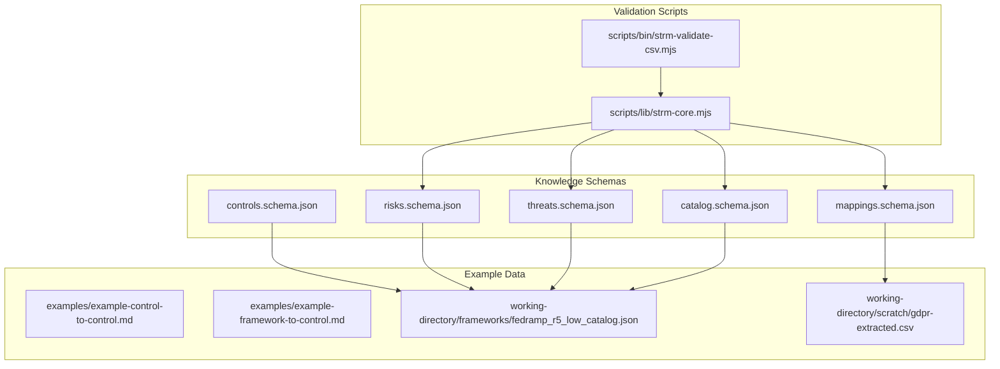
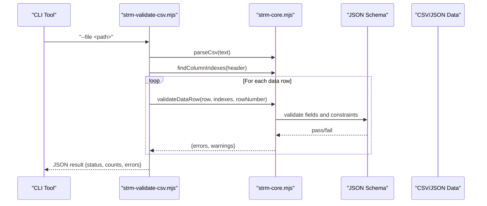
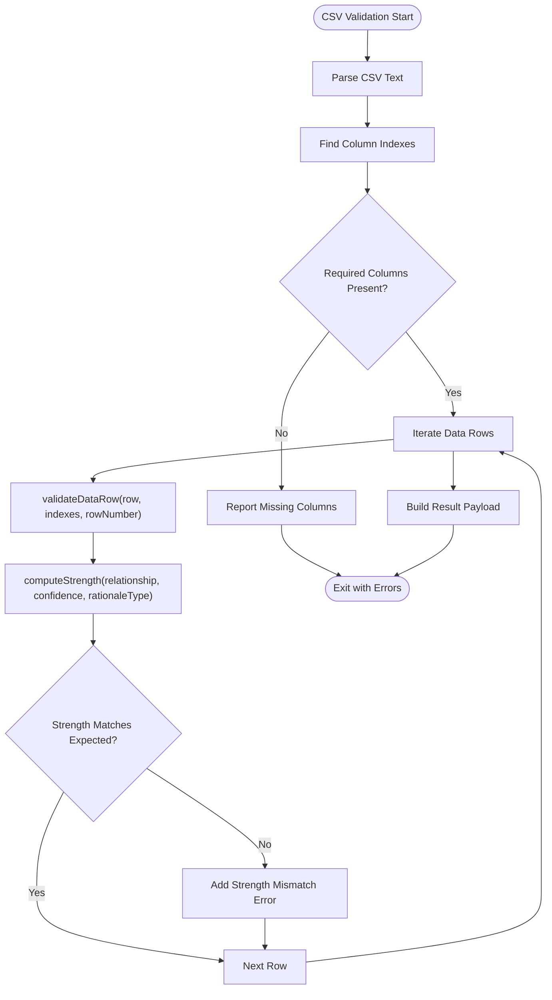
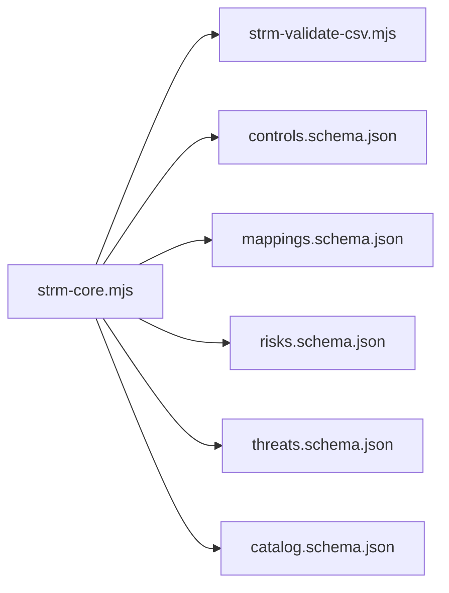

# JSON Schema Definitions

<cite>
**Referenced Files in This Document**
- [controls.schema.json](file://knowledge/controls.schema.json)
- [mappings.schema.json](file://knowledge/mappings.schema.json)
- [risks.schema.json](file://knowledge/risks.schema.json)
- [threats.schema.json](file://knowledge/threats.schema.json)
- [catalog.schema.json](file://knowledge/catalog.schema.json)
- [strm-validate-csv.mjs](file://scripts/bin/strm-validate-csv.mjs)
- [strm-core.mjs](file://scripts/lib/strm-core.mjs)
- [fedramp_r5_low_catalog.json](file://working-directory/frameworks/fedramp_r5_low_catalog.json)
- [gdpr-extracted.csv](file://working-directory/scratch/gdpr-extracted.csv)
- [example-control-to-control.md](file://examples/example-control-to-control.md)
- [example-framework-to-control.md](file://examples/example-framework-to-control.md)
</cite>

## Table of Contents
1. [Introduction](#introduction)
2. [Project Structure](#project-structure)
3. [Core Components](#core-components)
4. [Architecture Overview](#architecture-overview)
5. [Detailed Component Analysis](#detailed-component-analysis)
6. [Dependency Analysis](#dependency-analysis)
7. [Performance Considerations](#performance-considerations)
8. [Troubleshooting Guide](#troubleshooting-guide)
9. [Conclusion](#conclusion)
10. [Appendices](#appendices)

## Introduction
This document provides comprehensive JSON Schema Definitions for the STRM toolkit data validation schemas. It covers the controls, mappings, risks, threats, and catalogs datasets, detailing field specifications, data types, validation constraints, required/optional properties, and practical guidance for schema evolution and migration. The schemas are designed to validate structured datasets used in security control mapping, risk taxonomy, and framework catalogs, ensuring consistency across STRM artifacts.

## Project Structure
The STRM toolkit organizes its validation schemas under the knowledge directory and provides example datasets and validation scripts under working-directory and scripts respectively. The schemas define the canonical structure for:
- Controls dataset: normalized control definitions and relationships
- Mappings dataset: inter-framework control mappings with set-theoretic semantics
- Risks dataset: risk definitions with impact/likelihood and control mappings
- Threats dataset: threat actor definitions with materiality considerations
- Catalogs dataset: framework catalogs with control definitions and metadata

**Diagram sources**
- [controls.schema.json:1-141](file://knowledge/controls.schema.json#L1-L141)
- [mappings.schema.json:1-117](file://knowledge/mappings.schema.json#L1-L117)
- [risks.schema.json:1-92](file://knowledge/risks.schema.json#L1-L92)
- [threats.schema.json:1-55](file://knowledge/threats.schema.json#L1-L55)
- [catalog.schema.json:1-157](file://knowledge/catalog.schema.json#L1-L157)
- [strm-validate-csv.mjs:1-77](file://scripts/bin/strm-validate-csv.mjs#L1-L77)
- [strm-core.mjs:1-343](file://scripts/lib/strm-core.mjs#L1-L343)
- [fedramp_r5_low_catalog.json:1-800](file://working-directory/frameworks/fedramp_r5_low_catalog.json#L1-L800)
- [gdpr-extracted.csv:1-45](file://working-directory/scratch/gdpr-extracted.csv#L1-L45)

**Section sources**
- [controls.schema.json:1-141](file://knowledge/controls.schema.json#L1-L141)
- [mappings.schema.json:1-117](file://knowledge/mappings.schema.json#L1-L117)
- [risks.schema.json:1-92](file://knowledge/risks.schema.json#L1-L92)
- [threats.schema.json:1-55](file://knowledge/threats.schema.json#L1-L55)
- [catalog.schema.json:1-157](file://knowledge/catalog.schema.json#L1-L157)
- [strm-validate-csv.mjs:1-77](file://scripts/bin/strm-validate-csv.mjs#L1-L77)
- [strm-core.mjs:1-343](file://scripts/lib/strm-core.mjs#L1-L343)

## Core Components
This section summarizes the five primary schemas and their roles in STRM data validation.

- Controls Dataset Schema
  - Validates control definitions, metadata, framework references, and optional set-theoretic relationships.
  - Supports both normalized controls and GRC Toolkit control variants.

- Mappings Dataset Schema
  - Validates inter-framework control mappings with set-theoretic semantics and confidence/rationale metadata.
  - Provides compatibility with legacy relationship fields.

- Risks Dataset Schema
  - Validates risk definitions with impact/likelihood scales, control mappings, and optional source catalog metadata.
  - Supports optional set-theoretic relationships.

- Threats Dataset Schema
  - Validates threat actor definitions with materiality thresholds and optional risk mappings.

- Catalogs Dataset Schema
  - Validates framework catalogs with control definitions, objectives, parameters, and optional set-theoretic relationships.

**Section sources**
- [controls.schema.json:1-141](file://knowledge/controls.schema.json#L1-L141)
- [mappings.schema.json:1-117](file://knowledge/mappings.schema.json#L1-L117)
- [risks.schema.json:1-92](file://knowledge/risks.schema.json#L1-L92)
- [threats.schema.json:1-55](file://knowledge/threats.schema.json#L1-L55)
- [catalog.schema.json:1-157](file://knowledge/catalog.schema.json#L1-L157)

## Architecture Overview
The STRM validation architecture centers on JSON Schema definitions that constrain datasets, complemented by runtime validation utilities for CSV-based mappings and example datasets for guidance.

**Diagram sources**
- [strm-validate-csv.mjs:1-77](file://scripts/bin/strm-validate-csv.mjs#L1-L77)
- [strm-core.mjs:206-265](file://scripts/lib/strm-core.mjs#L206-L265)

## Detailed Component Analysis

### Controls Dataset Schema
The controls dataset schema defines:
- Top-level metadata: version, generated_at, controls array, optional grctoolkit_controls array
- Controls array items: control_id, title, description, domain, framework_refs, risk_ids, owners, optional set_theory_relationships
- Framework references: arrays of framework identifiers and associated control identifiers
- Optional GRC Toolkit control variant with detailed fields and solution categories
- Optional set-theoretic relationships aligned with NIST IR 8477

Field specifications and constraints:
- version: string
- generated_at: string (timestamp)
- controls[].control_id: string with pattern ^CTRL-[A-Z]{2,5}-[0-9]{3}$
- controls[].title: string
- controls[].description: string
- controls[].domain: string
- controls[].framework_refs: array of objects with framework and controls
- controls[].risk_ids: array of strings
- controls[].owners: array of strings
- controls[].set_theory_relationships: array of set-theory relationships
- grctoolkit_controls: array of GRC Toolkit control objects with required fields and solution categories

Validation rules:
- Required top-level fields: version, generated_at, controls
- Required control-level fields: control_id, title, description, domain, framework_refs, risk_ids
- Pattern constraints on identifiers
- Enumerations for cadence, applicability, and NIST CSF grouping
- Optional fields for extended metadata

Common validation errors:
- Missing required fields in top-level or control-level objects
- Invalid identifier patterns
- Enum violations for categorical fields
- Missing framework references or malformed arrays

**Section sources**
- [controls.schema.json:1-141](file://knowledge/controls.schema.json#L1-L141)

### Mappings Dataset Schema
The mappings dataset schema validates:
- Top-level metadata: version, generated_at, mappings array
- Mappings array items: mapping_id, source/target frameworks and controls, normalized_control_id, relationship, confidence, rationale
- Optional source/target control parts, parameter objects, and set-theoretic relationships
- Compatibility with legacy relationship field

Field specifications and constraints:
- version: string
- generated_at: string (timestamp)
- mappings[].mapping_id: string
- mappings[].source_framework: string
- mappings[].source_control: string
- mappings[].source_control_parts: array of strings
- mappings[].target_framework: string
- mappings[].target_control: string
- mappings[].target_control_parts: array of strings
- mappings[].parameter: object with source/target properties and additionalProperties
- mappings[].normalized_control_id: string with pattern ^CTRL-[A-Z]{2,5}-[0-9]{3}$
- mappings[].relationship: enum ["equivalent", "overlap", "partial"]
- mappings[].confidence: enum ["high", "medium", "low"]
- mappings[].rationale: string
- mappings[].set_theory_relationships: array of set-theoretic relationships

Validation rules:
- Required mapping-level fields: mapping_id, source_framework, source_control, target_framework, target_control, normalized_control_id, relationship, confidence
- Pattern constraints on normalized_control_id
- Enumerations for relationship and confidence
- Optional fields for parts and parameters

Common validation errors:
- Missing required mapping fields
- Invalid normalized_control_id pattern
- Enum violations for relationship/confidence
- Malformed parameter objects

**Section sources**
- [mappings.schema.json:1-117](file://knowledge/mappings.schema.json#L1-L117)

### Risks Dataset Schema
The risks dataset schema validates:
- Top-level metadata: version, generated_at, risks array
- Risks array items: risk_id, title, description, likelihood, impact, mapped_controls
- Optional threat_ids, source_catalog metadata, and set_theoretic relationships

Field specifications and constraints:
- version: string
- generated_at: string (timestamp)
- risks[].risk_id: string with pattern ^RISK-[A-Z]{2,8}-[0-9]{3}$
- risks[].title: string
- risks[].description: string
- risks[].likelihood: integer in range [1, 5]
- risks[].impact: integer in range [1, 5]
- risks[].mapped_controls: array of strings with pattern ^CTRL-[A-Z]{2,5}-[0-9]{3}$
- risks[].threat_ids: array of strings with pattern ^THREAT-[A-Z]{2,6}-[0-9]{3}$
- risks[].source_catalog: object with name, source_risk_code, risk_grouping, nist_csf_function
- risks[].set_theory_relationships: array of set-theoretic relationships

Validation rules:
- Required risk-level fields: risk_id, title, description, likelihood, impact, mapped_controls
- Integer bounds for likelihood and impact
- Pattern constraints on identifiers
- AdditionalProperties false for source_catalog

Common validation errors:
- Missing required risk fields
- Out-of-range likelihood/impact values
- Invalid identifier patterns
- Malformed source_catalog object

**Section sources**
- [risks.schema.json:1-92](file://knowledge/risks.schema.json#L1-L92)

### Threats Dataset Schema
The threats dataset schema validates:
- Top-level metadata: version, generated_at, threats array
- Threats array items: threat_id, threat_grouping, source_threat_code, title, description, mapped_risk_ids
- Materiality considerations with required thresholds

Field specifications and constraints:
- version: string
- generated_at: string (timestamp
- threats[].threat_id: string with pattern ^THREAT-[A-Z]{2,6}-[0-9]{3}$
- threats[].threat_grouping: string
- threats[].source_threat_code: string with pattern ^[A-Z]{2,6}-[0-9]{1,3}$
- threats[].title: string
- threats[].description: string
- threats[].mapped_risk_ids: array of strings with pattern ^RISK-[A-Z]{2,8}-[0-9]{3}$
- threats[].materiality_considerations: object with required fields for materiality thresholds

Validation rules:
- Required threat-level fields: threat_id, threat_grouping, source_threat_code, title, description, materiality_considerations
- Required materiality_considerations fields: pre_tax_income_5_percent, total_assets_0_5_percent, total_equity_1_percent, total_revenue_0_5_percent
- AdditionalProperties false for materiality_considerations

Common validation errors:
- Missing required threat fields
- Invalid identifier patterns
- Missing required materiality thresholds

**Section sources**
- [threats.schema.json:1-55](file://knowledge/threats.schema.json#L1-L55)

### Catalogs Dataset Schema
The catalogs dataset schema validates:
- Top-level metadata: version, generated_at, catalogs array
- Catalog entries: catalog_id, title, description, publisher, version, published_at, source_url, framework_type, keywords, controls
- Catalog controls: uuid, control_id, title, description, family, objectives, subControls, parameters, references, mapped_control_ids, set_theory_relationships

Field specifications and constraints:
- version: string
- generated_at: string (timestamp)
- catalogs[].catalog_id: string with pattern ^CATALOG-[A-Z0-9][A-Z0-9_-]{1,62}$
- catalogs[].title: string
- catalogs[].description: string
- catalogs[].publisher: string
- catalogs[].version: string
- catalogs[].published_at: string
- catalogs[].source_url: string
- catalogs[].framework_type: enum ["framework", "catalog", "regulation", "standard", "internal"]
- catalogs[].keywords: array of strings
- catalogs[].controls: array of catalogControl objects
- catalogControl[].uuid: string with UUID pattern
- catalogControl[].control_id: string
- catalogControl[].title: string
- catalogControl[].description: string
- catalogControl[].family: string
- catalogControl[].objectives: array of objects with name and description
- catalogControl[].subControls: array of strings
- catalogControl[].parameters: array of mixed types
- catalogControl[].references: array of strings
- catalogControl[].mapped_control_ids: array of strings with pattern ^CTRL-[A-Z]{2,5}-[0-9]{3}$
- catalogControl[].set_theory_relationships: array of set-theoretic relationships

Validation rules:
- Required catalog-level fields: catalog_id, title, description, publisher, version, controls
- Required catalogControl fields: control_id, title, description, family, objectives
- Pattern constraints on identifiers
- AdditionalProperties false for catalog entries

Common validation errors:
- Missing required catalog/catalogControl fields
- Invalid identifier patterns
- Missing required objectives fields

**Section sources**
- [catalog.schema.json:1-157](file://knowledge/catalog.schema.json#L1-L157)

### Validation Workflow and CSV Mapping
The STRM toolkit includes a CSV validation utility that enforces mapping-specific constraints and computes strength scores based on relationship, confidence, and rationale.

**Diagram sources**
- [strm-validate-csv.mjs:1-77](file://scripts/bin/strm-validate-csv.mjs#L1-L77)
- [strm-core.mjs:206-265](file://scripts/lib/strm-core.mjs#L206-L265)

Key validation behaviors:
- Enforces presence of required CSV columns for mapping relationships
- Validates enumerations for STRM Relationship, Confidence Levels, and NIST IR-8477 Rational
- Computes expected strength scores and flags mismatches
- Emits warnings for edge cases (e.g., syntactic rationale, low confidence, not_related without notes)

**Section sources**
- [strm-validate-csv.mjs:1-77](file://scripts/bin/strm-validate-csv.mjs#L1-L77)
- [strm-core.mjs:1-343](file://scripts/lib/strm-core.mjs#L1-L343)

## Dependency Analysis
The schemas are independent JSON Schema documents that define validation rules for distinct datasets. The CSV validation utility depends on the core validation functions to enforce mapping-specific constraints.

**Diagram sources**
- [strm-core.mjs:1-343](file://scripts/lib/strm-core.mjs#L1-L343)
- [strm-validate-csv.mjs:1-77](file://scripts/bin/strm-validate-csv.mjs#L1-L77)
- [controls.schema.json:1-141](file://knowledge/controls.schema.json#L1-L141)
- [mappings.schema.json:1-117](file://knowledge/mappings.schema.json#L1-L117)
- [risks.schema.json:1-92](file://knowledge/risks.schema.json#L1-L92)
- [threats.schema.json:1-55](file://knowledge/threats.schema.json#L1-L55)
- [catalog.schema.json:1-157](file://knowledge/catalog.schema.json#L1-L157)

## Performance Considerations
- Schema validation performance is primarily driven by the size of datasets and the complexity of nested structures (e.g., framework_refs, parameters, objectives).
- For large catalogs, consider streaming or chunked processing to reduce memory overhead.
- CSV parsing and validation are linear in the number of rows; ensure efficient row iteration and minimal redundant computations.

## Troubleshooting Guide
Common validation errors and resolutions:
- Missing required fields
  - Ensure top-level version, generated_at, and dataset arrays are present.
  - Ensure required control/mapping/risk/threat/catalog fields are populated.
- Identifier pattern violations
  - Verify control_id, risk_id, threat_id, normalized_control_id, mapped_control_ids match expected patterns.
- Enum violations
  - Confirm relationship, confidence, framework_type, cadence, applicability, and rationale values are from allowed sets.
- Bounds violations
  - Ensure likelihood and impact are integers within [1, 5].
- CSV mapping errors
  - Verify STRM Relationship, Confidence Levels, and NIST IR-8477 Rational match allowed values.
  - Confirm Strength of Relationship equals computed value from formula.
  - Include notes for not_related mappings.

Validation utilities:
- Use the CSV validator to catch mapping-level issues early.
- Cross-reference example mappings for expected structures and relationships.

**Section sources**
- [strm-validate-csv.mjs:1-77](file://scripts/bin/strm-validate-csv.mjs#L1-L77)
- [strm-core.mjs:206-265](file://scripts/lib/strm-core.mjs#L206-L265)
- [example-control-to-control.md:1-162](file://examples/example-control-to-control.md#L1-L162)
- [example-framework-to-control.md:1-159](file://examples/example-framework-to-control.md#L1-L159)

## Conclusion
The STRM toolkit’s JSON Schema Definitions provide robust validation for controls, mappings, risks, threats, and catalogs. Together with the CSV validation utilities, they ensure consistent, interoperable datasets across mapping workflows. Adhering to the field specifications, data types, and validation constraints outlined here will minimize errors and improve mapping quality.

## Appendices

### Field Specifications Reference
- Controls Dataset
  - Required: version, generated_at, controls[]
  - Controls[].Required: control_id, title, description, domain, framework_refs[], risk_ids[]
  - Controls[].Optional: owners[], set_theory_relationships[]
  - Patterns: control_id, normalized_control_id
  - Enums: cadence, applicability, NIST CSF grouping

- Mappings Dataset
  - Required: version, generated_at, mappings[]
  - Mappings[].Required: mapping_id, source_framework, source_control, target_framework, target_control, normalized_control_id, relationship, confidence
  - Mappings[].Optional: source/target_control_parts[], parameter{}, set_theory_relationships[]
  - Patterns: normalized_control_id

- Risks Dataset
  - Required: version, generated_at, risks[]
  - Risks[].Required: risk_id, title, description, likelihood, impact, mapped_controls[]
  - Risks[].Optional: threat_ids[], source_catalog{}, set_theory_relationships[]
  - Bounds: likelihood, impact in [1, 5]

- Threats Dataset
  - Required: version, generated_at, threats[]
  - Threats[].Required: threat_id, threat_grouping, source_threat_code, title, description, materiality_considerations{}
  - materiality_considerations Required: pre_tax_income_5_percent, total_assets_0_5_percent, total_equity_1_percent, total_revenue_0_5_percent

- Catalogs Dataset
  - Required: version, generated_at, catalogs[]
  - Catalogs[].Required: catalog_id, title, description, publisher, version, controls[]
  - CatalogControls[].Required: control_id, title, description, family, objectives[]
  - Patterns: catalog_id, mapped_control_ids[]
  - Enums: framework_type

### Example Datasets
- Catalog example: [fedramp_r5_low_catalog.json:1-800](file://working-directory/frameworks/fedramp_r5_low_catalog.json#L1-L800)
- Extracted GDPR data: [gdpr-extracted.csv:1-45](file://working-directory/scratch/gdpr-extracted.csv#L1-L45)
- Mapping examples: 
  - [example-control-to-control.md:1-162](file://examples/example-control-to-control.md#L1-L162)
  - [example-framework-to-control.md:1-159](file://examples/example-framework-to-control.md#L1-L159)