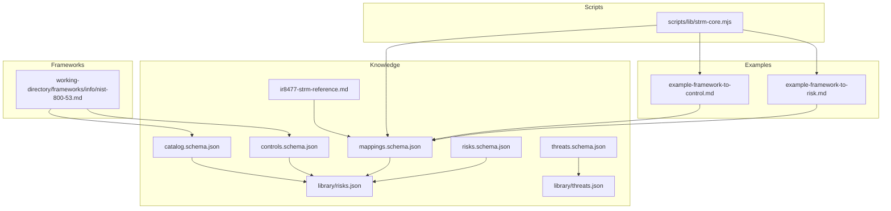
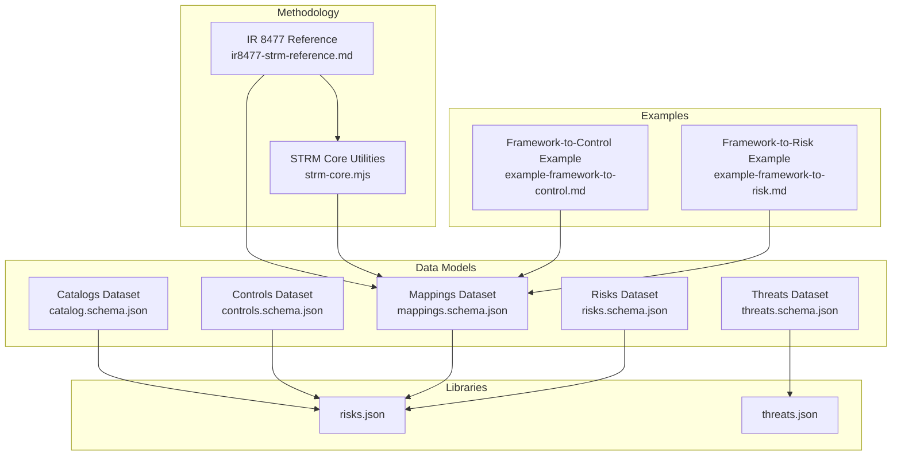
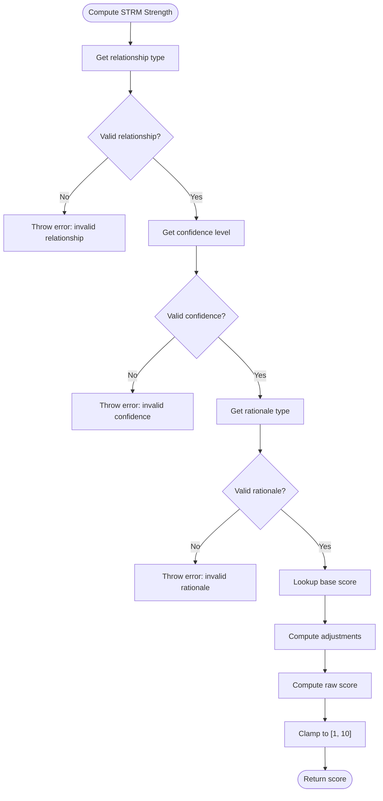
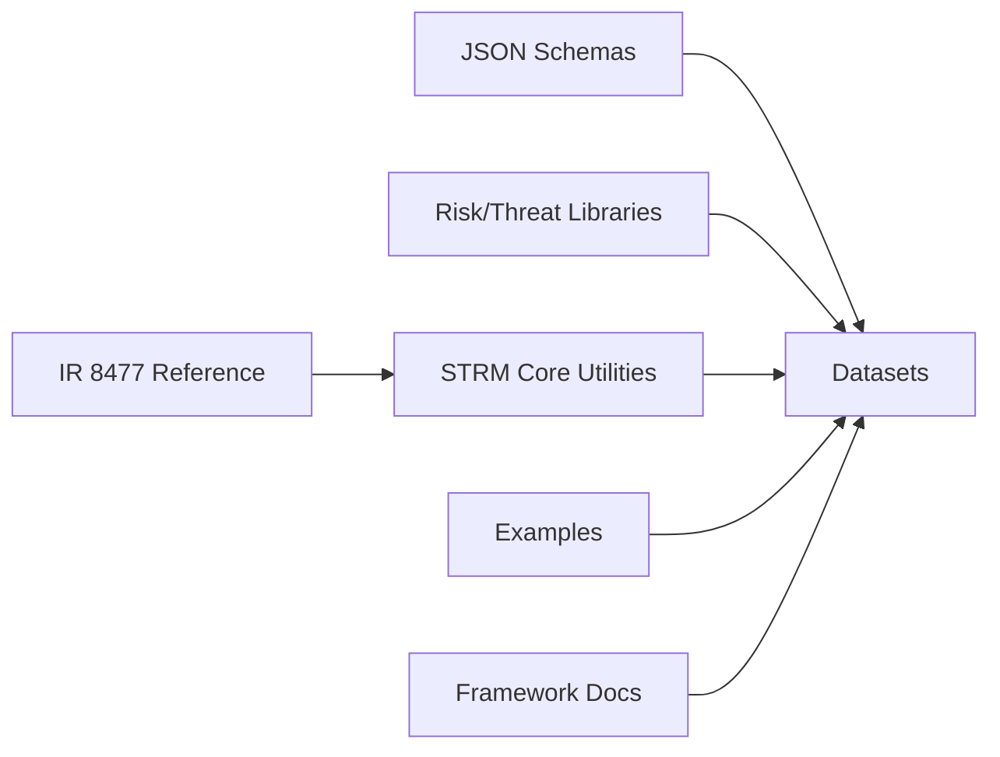

# Knowledge Base, Schemas, and Reference Materials

<cite>
**Referenced Files in This Document**
- [catalog.schema.json](file://knowledge/catalog.schema.json)
- [controls.schema.json](file://knowledge/controls.schema.json)
- [mappings.schema.json](file://knowledge/mappings.schema.json)
- [risks.schema.json](file://knowledge/risks.schema.json)
- [threats.schema.json](file://knowledge/threats.schema.json)
- [risks.json](file://knowledge/library/risks.json)
- [threats.json](file://knowledge/library/threats.json)
- [ir8477-strm-reference.md](file://knowledge/ir8477-strm-reference.md)
- [strm-core.mjs](file://scripts/lib/strm-core.mjs)
- [example-framework-to-control.md](file://examples/example-framework-to-control.md)
- [example-framework-to-risk.md](file://examples/example-framework-to-risk.md)
- [nist-800-53.md](file://working-directory/frameworks/info/nist-800-53.md)
- [README.md](file://README.md)
</cite>

## Table of Contents
1. [Introduction](#introduction)
2. [Project Structure](#project-structure)
3. [Core Components](#core-components)
4. [Architecture Overview](#architecture-overview)
5. [Detailed Component Analysis](#detailed-component-analysis)
6. [Dependency Analysis](#dependency-analysis)
7. [Performance Considerations](#performance-considerations)
8. [Troubleshooting Guide](#troubleshooting-guide)
9. [Conclusion](#conclusion)
10. [Appendices](#appendices)

## Introduction
This document consolidates the Knowledge Base, Schemas, and Reference Materials for the STRM toolkit. It explains the JSON Schema definitions for controls, mappings, risks, and threats, including field specifications, validation rules, and data types. It also documents the risk and threat libraries, enrichment capabilities, integration patterns, and the NIST IR 8477 methodology reference implementation. Guidance is provided on data model relationships, inheritance patterns, extensibility mechanisms, versioning, schema evolution, backward compatibility, and practical examples for extending schemas and maintaining data integrity at scale.

## Project Structure
The STRM toolkit organizes data models and reference materials under knowledge/, with example datasets and scripts supporting validation and generation. The core schemas define datasets for catalogs, controls, mappings, risks, and threats. The risk and threat libraries provide curated datasets enriched with metadata and relationships. Scripts implement STRM strength scoring, filename generation, CSV parsing/validation, and artifact directory resolution.

**Diagram sources**
- [catalog.schema.json](file://knowledge/catalog.schema.json)
- [controls.schema.json](file://knowledge/controls.schema.json)
- [mappings.schema.json](file://knowledge/mappings.schema.json)
- [risks.schema.json](file://knowledge/risks.schema.json)
- [threats.schema.json](file://knowledge/threats.schema.json)
- [risks.json](file://knowledge/library/risks.json)
- [threats.json](file://knowledge/library/threats.json)
- [ir8477-strm-reference.md](file://knowledge/ir8477-strm-reference.md)
- [strm-core.mjs](file://scripts/lib/strm-core.mjs)
- [example-framework-to-control.md](file://examples/example-framework-to-control.md)
- [example-framework-to-risk.md](file://examples/example-framework-to-risk.md)
- [nist-800-53.md](file://working-directory/frameworks/info/nist-800-53.md)

**Section sources**
- [README.md](file://README.md)
- [catalog.schema.json](file://knowledge/catalog.schema.json)
- [controls.schema.json](file://knowledge/controls.schema.json)
- [mappings.schema.json](file://knowledge/mappings.schema.json)
- [risks.schema.json](file://knowledge/risks.schema.json)
- [threats.schema.json](file://knowledge/threats.schema.json)
- [risks.json](file://knowledge/library/risks.json)
- [threats.json](file://knowledge/library/threats.json)
- [ir8477-strm-reference.md](file://knowledge/ir8477-strm-reference.md)
- [strm-core.mjs](file://scripts/lib/strm-core.mjs)
- [example-framework-to-control.md](file://examples/example-framework-to-control.md)
- [example-framework-to-risk.md](file://examples/example-framework-to-risk.md)
- [nist-800-53.md](file://working-directory/frameworks/info/nist-800-53.md)

## Core Components
This section outlines the primary datasets and their roles in STRM:

- Catalogs dataset: Defines control catalogs with metadata, control entries, and optional set-theory relationships at the catalog level.
- Controls dataset: Describes control entries with framework references, risk associations, owners, and optional set-theory relationships.
- Mappings dataset: Encodes STRM relationships between controls or risks across frameworks, including parameterization and rationale.
- Risks dataset: Captures risk scenarios with likelihood/impact, mapped controls, source catalog metadata, and set-theory relationships.
- Threats dataset: Documents threats with grouping, source codes, materiality considerations, and optional mapped risk links.

Validation rules and data types are enforced by the JSON Schemas. The STRM methodology reference and scripts provide strength scoring, filename generation, CSV parsing/validation, and artifact directory resolution.

**Section sources**
- [catalog.schema.json](file://knowledge/catalog.schema.json)
- [controls.schema.json](file://knowledge/controls.schema.json)
- [mappings.schema.json](file://knowledge/mappings.schema.json)
- [risks.schema.json](file://knowledge/risks.schema.json)
- [threats.schema.json](file://knowledge/threats.schema.json)
- [risks.json](file://knowledge/library/risks.json)
- [threats.json](file://knowledge/library/threats.json)
- [ir8477-strm-reference.md](file://knowledge/ir8477-strm-reference.md)
- [strm-core.mjs](file://scripts/lib/strm-core.mjs)

## Architecture Overview
The STRM architecture centers on JSON Schemas that define datasets and enforce data integrity. Scripts implement STRM methodology computations and file handling. Example datasets illustrate mapping workflows between frameworks and risk registers.

**Diagram sources**
- [catalog.schema.json](file://knowledge/catalog.schema.json)
- [controls.schema.json](file://knowledge/controls.schema.json)
- [mappings.schema.json](file://knowledge/mappings.schema.json)
- [risks.schema.json](file://knowledge/risks.schema.json)
- [threats.schema.json](file://knowledge/threats.schema.json)
- [risks.json](file://knowledge/library/risks.json)
- [threats.json](file://knowledge/library/threats.json)
- [ir8477-strm-reference.md](file://knowledge/ir8477-strm-reference.md)
- [strm-core.mjs](file://scripts/lib/strm-core.mjs)
- [example-framework-to-control.md](file://examples/example-framework-to-control.md)
- [example-framework-to-risk.md](file://examples/example-framework-to-risk.md)

## Detailed Component Analysis

### JSON Schema Definitions and Field Specifications

#### Catalogs Dataset
- Purpose: Defines control catalogs with metadata and control entries.
- Key fields:
  - version, generated_at: Dataset versioning and generation timestamp.
  - catalogs: Array of catalog entries.
  - Each catalog entry includes:
    - catalog_id, title, description, publisher, version, published_at, source_url, framework_type, keywords.
    - controls: Array of catalogControl entries.
  - Each catalogControl includes:
    - uuid, control_id, title, description, family, control_type, sortId, objectives (array of name/description), subControls, parameters, references, mapped_control_ids, set_theory_relationships.
- Validation rules:
  - Required fields enforced at top-level and control entry levels.
  - Enumerations for framework_type and scope categories.
  - Pattern constraints for identifiers.

**Section sources**
- [catalog.schema.json](file://knowledge/catalog.schema.json)

#### Controls Dataset
- Purpose: Describes control entries with framework references, risk associations, owners, and optional set-theory relationships.
- Key fields:
  - version, generated_at, controls: Array of control entries.
  - Optional grctoolkit_controls array for GRC Toolkit control entries.
  - Each control entry includes:
    - control_id, title, description, domain, framework_refs (array of framework/controls), risk_ids, owners, set_theory_relationships.
- Validation rules:
  - Required fields enforced.
  - Enumerations for cadence, applicability, and NIST CSF function grouping.
  - Pattern constraints for control_id.

**Section sources**
- [controls.schema.json](file://knowledge/controls.schema.json)

#### Mappings Dataset
- Purpose: Encodes STRM relationships between controls or risks across frameworks.
- Key fields:
  - version, generated_at, mappings: Array of mapping entries.
  - Each mapping entry includes:
    - mapping_id, source_framework, source_control, source_control_parts, target_framework, target_control, target_control_parts, parameter (with source/target contexts), normalized_control_id, relationship (equivalent/overlap/partial), confidence (high/medium/low), rationale, set_theory_relationships.
- Validation rules:
  - Required fields enforced.
  - Enumerations for relationship and confidence.
  - Pattern constraints for identifiers.

**Section sources**
- [mappings.schema.json](file://knowledge/mappings.schema.json)

#### Risks Dataset
- Purpose: Captures risk scenarios with likelihood/impact, mapped controls, source catalog metadata, and set-theory relationships.
- Key fields:
  - version, generated_at, risks: Array of risk entries.
  - Each risk entry includes:
    - risk_id, title, description, likelihood, impact, mapped_controls, set_theory_relationships, source_catalog (name, source_risk_code, risk_grouping, nist_csf_function), threat_ids.
- Validation rules:
  - Required fields enforced.
  - AdditionalProperties disallowed in materiality_considerations.

**Section sources**
- [risks.schema.json](file://knowledge/risks.schema.json)

#### Threats Dataset
- Purpose: Documents threats with grouping, source codes, materiality considerations, and optional mapped risk links.
- Key fields:
  - version, generated_at, threats: Array of threat entries.
  - Each threat entry includes:
    - threat_id, threat_grouping, source_threat_code, title, description, mapped_risk_ids, materiality_considerations (pre_tax_income_5_percent, total_assets_0_5_percent, total_equity_1_percent, total_revenue_0_5_percent).
- Validation rules:
  - Required fields enforced.
  - AdditionalProperties disallowed in materiality_considerations.

**Section sources**
- [threats.schema.json](file://knowledge/threats.schema.json)

### Risk and Threat Library Structures and Enrichment
- Risks library (risks.json):
  - Provides curated risk scenarios with standardized identifiers, likelihood/impact ratings, mapped controls, source catalog metadata, and set-theory relationships.
  - Supports enrichment by linking mapped_controls and threat_ids to other datasets.
- Threats library (threats.json):
  - Provides curated threats with grouping, source codes, materiality considerations, and optional mapped_risk_ids.
  - Supports enrichment by linking mapped_risk_ids to risk scenarios.

**Section sources**
- [risks.json](file://knowledge/library/risks.json)
- [threats.json](file://knowledge/library/threats.json)

### NIST IR 8477 Methodology Reference Implementation
- STRM methodology defines set-theory relationships (equal, subset_of, superset_of, intersects_with, not_related) and rationale types (syntactic, semantic, functional).
- Strength scoring computes a 1–10 score based on relationship type, confidence, and rationale, with clamping to [1, 10].
- Scripts implement:
  - computeStrength for score calculation.
  - sanitizeFrameworkName and generateFilename for artifact naming.
  - parseCsv and toCsv for CSV handling.
  - findColumnIndexes and validateDataRow for mapping validation.
  - resolveArtifactDir and listInputFiles for artifact and input discovery.

**Diagram sources**
- [strm-core.mjs](file://scripts/lib/strm-core.mjs)
- [ir8477-strm-reference.md](file://knowledge/ir8477-strm-reference.md)

**Section sources**
- [ir8477-strm-reference.md](file://knowledge/ir8477-strm-reference.md)
- [strm-core.mjs](file://scripts/lib/strm-core.mjs)

### Integration Patterns and Examples
- Framework-to-Control Mapping:
  - Demonstrates STRM relationships between NIST SP 800-53 Rev 5 and CIS Controls v8.1, including equal, subset_of, superset_of, intersects_with, and not_related.
  - Strength scores computed using STRM methodology.
- Framework-to-Risk Mapping:
  - Demonstrates STRM relationships between NIST CSF 2.0 and an organizational risk register, including equal, subset_of, superset_of, intersects_with, and not_related.
  - Emphasizes bow-tie analysis and residual risk identification.

**Section sources**
- [example-framework-to-control.md](file://examples/example-framework-to-control.md)
- [example-framework-to-risk.md](file://examples/example-framework-to-risk.md)

### Data Model Relationships, Inheritance, and Extensibility
- Relationships:
  - Catalogs dataset supports set_theory_relationships at the catalogControl level.
  - Controls dataset supports set_theory_relationships at the control level.
  - Mappings dataset supports set_theory_relationships and preserves legacy relationship field for compatibility.
- Inheritance patterns:
  - Controls dataset includes framework_refs to link controls to multiple frameworks.
  - Risks dataset includes mapped_controls and threat_ids to link risks to controls and threats.
- Extensibility mechanisms:
  - AdditionalProperties disallowed in materiality_considerations to maintain strict schemas.
  - Pattern constraints on identifiers ensure consistent cross-dataset linking.
  - Optional arrays (mapped_control_ids, mapped_risk_ids) enable flexible linking without mandatory fields.

**Section sources**
- [catalog.schema.json](file://knowledge/catalog.schema.json)
- [controls.schema.json](file://knowledge/controls.schema.json)
- [mappings.schema.json](file://knowledge/mappings.schema.json)
- [risks.schema.json](file://knowledge/risks.schema.json)
- [threats.schema.json](file://knowledge/threats.schema.json)

### Reference Implementations and Example Datasets
- Reference implementations:
  - STRM core utilities implement CSV parsing/validation, filename generation, and artifact directory resolution.
  - IR 8477 reference provides canonical relationship types, rationale types, confidence levels, and strength scoring rules.
- Example datasets:
  - Framework-to-control and framework-to-risk examples illustrate mapping workflows and STRM strength calculations.

**Section sources**
- [strm-core.mjs](file://scripts/lib/strm-core.mjs)
- [ir8477-strm-reference.md](file://knowledge/ir8477-strm-reference.md)
- [example-framework-to-control.md](file://examples/example-framework-to-control.md)
- [example-framework-to-risk.md](file://examples/example-framework-to-risk.md)

### Validation Examples
- CSV validation:
  - validateDataRow enforces required fields, enumerations, and strength score consistency.
  - Warnings are issued for edge cases (e.g., syntactic rationale, low confidence).
- JSON schema validation:
  - All datasets enforce required fields, enumerations, pattern constraints, and array/object structures.

**Section sources**
- [strm-core.mjs](file://scripts/lib/strm-core.mjs)
- [mappings.schema.json](file://knowledge/mappings.schema.json)
- [controls.schema.json](file://knowledge/controls.schema.json)
- [catalog.schema.json](file://knowledge/catalog.schema.json)
- [risks.schema.json](file://knowledge/risks.schema.json)
- [threats.schema.json](file://knowledge/threats.schema.json)

## Dependency Analysis
The STRM toolkit exhibits clear separation of concerns:
- Schemas define data contracts and validation rules.
- Libraries provide curated datasets for risks and threats.
- Scripts implement methodology computations and file handling.
- Examples demonstrate mapping workflows.

**Diagram sources**
- [catalog.schema.json](file://knowledge/catalog.schema.json)
- [controls.schema.json](file://knowledge/controls.schema.json)
- [mappings.schema.json](file://knowledge/mappings.schema.json)
- [risks.schema.json](file://knowledge/risks.schema.json)
- [threats.schema.json](file://knowledge/threats.schema.json)
- [risks.json](file://knowledge/library/risks.json)
- [threats.json](file://knowledge/library/threats.json)
- [ir8477-strm-reference.md](file://knowledge/ir8477-strm-reference.md)
- [strm-core.mjs](file://scripts/lib/strm-core.mjs)
- [example-framework-to-control.md](file://examples/example-framework-to-control.md)
- [example-framework-to-risk.md](file://examples/example-framework-to-risk.md)
- [nist-800-53.md](file://working-directory/frameworks/info/nist-800-53.md)

**Section sources**
- [catalog.schema.json](file://knowledge/catalog.schema.json)
- [controls.schema.json](file://knowledge/controls.schema.json)
- [mappings.schema.json](file://knowledge/mappings.schema.json)
- [risks.schema.json](file://knowledge/risks.schema.json)
- [threats.schema.json](file://knowledge/threats.schema.json)
- [risks.json](file://knowledge/library/risks.json)
- [threats.json](file://knowledge/library/threats.json)
- [ir8477-strm-reference.md](file://knowledge/ir8477-strm-reference.md)
- [strm-core.mjs](file://scripts/lib/strm-core.mjs)
- [example-framework-to-control.md](file://examples/example-framework-to-control.md)
- [example-framework-to-risk.md](file://examples/example-framework-to-risk.md)
- [nist-800-53.md](file://working-directory/frameworks/info/nist-800-53.md)

## Performance Considerations
- Schema validation:
  - Use streaming validators for large datasets to reduce memory overhead.
  - Precompile schemas when possible to avoid repeated parsing.
- CSV processing:
  - Parse CSV incrementally and validate rows as they are read.
  - Use efficient string normalization and lookup functions to minimize overhead.
- Artifact generation:
  - Generate filenames and directories using precomputed sanitized names to avoid repeated transformations.
- Large-scale deployments:
  - Partition datasets by framework or date to improve query performance.
  - Maintain indexed lookups for mapped_control_ids and mapped_risk_ids to accelerate joins.

[No sources needed since this section provides general guidance]

## Troubleshooting Guide
Common issues and resolutions:
- Invalid STRM Relationship, Confidence Levels, or NIST IR-8477 Rational:
  - Ensure values match enumerations defined in the mappings schema and STRM reference.
- Strength of Relationship mismatch:
  - Recompute using the STRM core utility to verify expected score.
- Empty required fields:
  - Verify that FDE# and Target ID # are populated in mapping rows.
- not_related without Notes:
  - Include contextual notes for not_related mappings to aid downstream analysis.
- Syntactic rationale warnings:
  - Confirm intent; syntactic rationale is uncommon and may indicate mapping ambiguity.
- Low confidence warnings:
  - Use only when significant inference is required; otherwise, seek stronger evidence.

**Section sources**
- [strm-core.mjs](file://scripts/lib/strm-core.mjs)
- [mappings.schema.json](file://knowledge/mappings.schema.json)
- [ir8477-strm-reference.md](file://knowledge/ir8477-strm-reference.md)

## Conclusion
The STRM toolkit’s Knowledge Base, Schemas, and Reference Materials provide a robust foundation for cross-framework control and risk mapping. JSON Schemas enforce data integrity, the IR 8477 methodology enables precise STRM relationships and strength scoring, and curated libraries enrich risk and threat datasets. Scripts streamline validation, artifact generation, and file handling. By following the guidelines for versioning, schema evolution, and extensibility, organizations can maintain data integrity and scale mapping efforts effectively.

[No sources needed since this section summarizes without analyzing specific files]

## Appendices

### A. STRM Strength Scoring Reference
- Relationship types and base scores:
  - equal: 10
  - subset_of/superset_of: 7
  - intersects_with: 4
  - not_related: 0
- Confidence adjustments:
  - high: +0
  - medium: -1
  - low: -2
- Rationale adjustments:
  - semantic/functional: +0
  - syntactic: -1
- Final score clamped to [1, 10].

**Section sources**
- [ir8477-strm-reference.md](file://knowledge/ir8477-strm-reference.md)
- [strm-core.mjs](file://scripts/lib/strm-core.mjs)

### B. Framework Reference: NIST SP 800-53 Rev 5
- Overview, control structure, families, baselines, and cross-framework mapping guidance.
- Tailoring and OSCAL representation details.

**Section sources**
- [nist-800-53.md](file://working-directory/frameworks/info/nist-800-53.md)