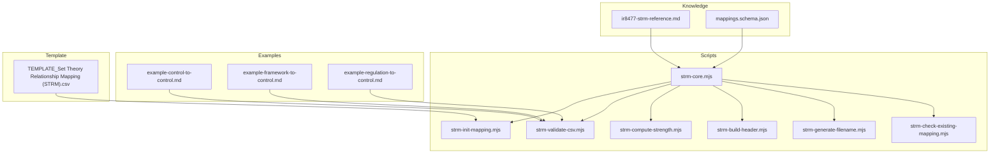
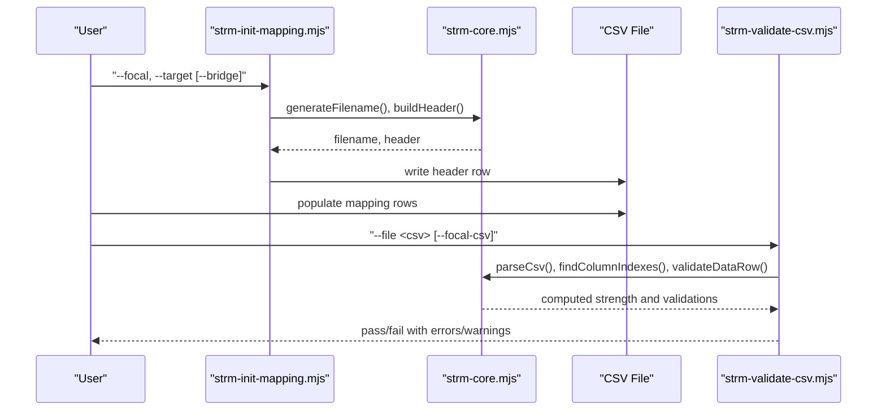
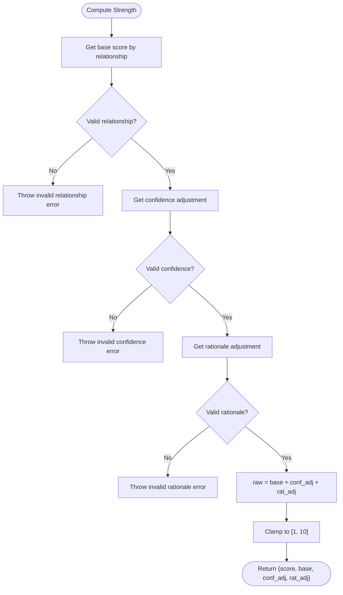
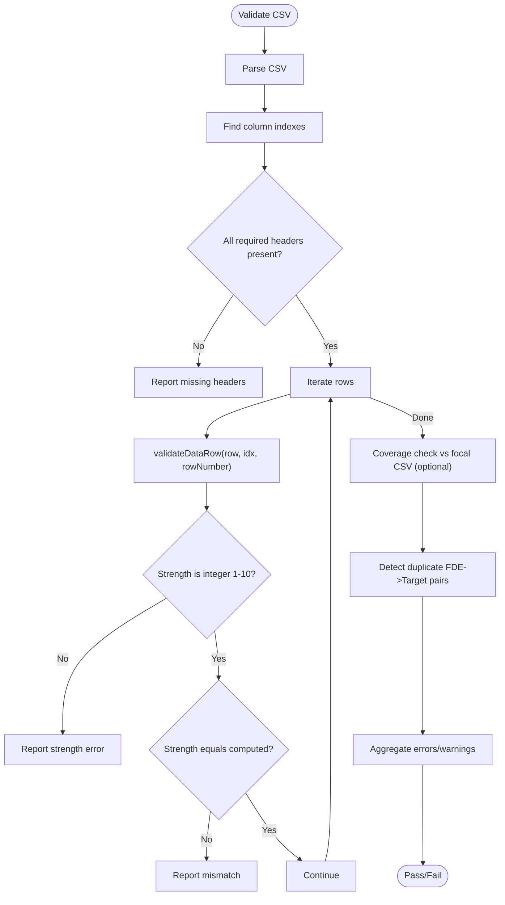
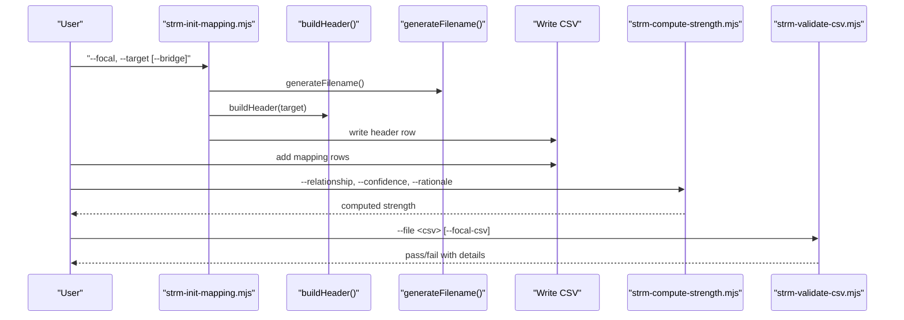
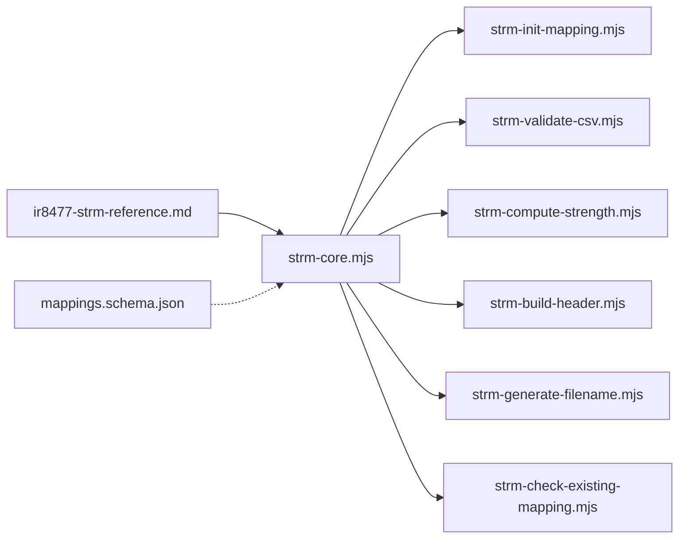

# NIST IR 8477 Methodology Reference

<cite>
**Referenced Files in This Document**
- [ir8477-strm-reference.md](file://knowledge/ir8477-strm-reference.md)
- [mappings.schema.json](file://knowledge/mappings.schema.json)
- [strm-core.mjs](file://scripts/lib/strm-core.mjs)
- [strm-compute-strength.mjs](file://scripts/bin/strm-compute-strength.mjs)
- [strm-validate-csv.mjs](file://scripts/bin/strm-validate-csv.mjs)
- [strm-init-mapping.mjs](file://scripts/bin/strm-init-mapping.mjs)
- [strm-build-header.mjs](file://scripts/bin/strm-build-header.mjs)
- [strm-generate-filename.mjs](file://scripts/bin/strm-generate-filename.mjs)
- [strm-check-existing-mapping.mjs](file://scripts/bin/strm-check-existing-mapping.mjs)
- [TEMPLATE_Set Theory Relationship Mapping (STRM).csv](file://TEMPLATE_Set Theory Relationship Mapping (STRM).csv)
- [example-control-to-control.md](file://examples/example-control-to-control.md)
- [example-framework-to-control.md](file://examples/example-framework-to-control.md)
- [example-regulation-to-control.md](file://examples/example-regulation-to-control.md)
</cite>

## Table of Contents
1. [Introduction](#introduction)
2. [Project Structure](#project-structure)
3. [Core Components](#core-components)
4. [Architecture Overview](#architecture-overview)
5. [Detailed Component Analysis](#detailed-component-analysis)
6. [Dependency Analysis](#dependency-analysis)
7. [Performance Considerations](#performance-considerations)
8. [Troubleshooting Guide](#troubleshooting-guide)
9. [Conclusion](#conclusion)
10. [Appendices](#appendices)

## Introduction
This document provides a comprehensive methodology reference for STRM (Set-Theoretic Relationship Mapping) aligned with NIST IR 8477. It explains the mathematical foundations of set-theory relationships, the strength scoring system, confidence levels, rationale classifications, and the algorithmic implementation used to calculate and validate mappings. It also documents how STRM is applied across framework-to-framework, control-to-control, and regulation-to-control scenarios, and offers step-by-step examples and guidance for interpreting results, validating mappings, and maintaining consistency.

## Project Structure
The STRM toolkit organizes methodology, schemas, and automation around a small set of core modules:
- Knowledge base: NIST IR 8477 reference and JSON schema for mappings
- Scripts: CLI utilities for initializing mappings, computing strength scores, validating CSV outputs, and generating filenames
- Examples: End-to-end scenario walkthroughs for control-to-control, framework-to-control, and regulation-to-control mappings
- Templates: CSV template for STRM outputs

**Diagram sources**
- [ir8477-strm-reference.md:1-119](file://knowledge/ir8477-strm-reference.md#L1-L119)
- [mappings.schema.json:1-117](file://knowledge/mappings.schema.json#L1-L117)
- [strm-core.mjs:1-343](file://scripts/lib/strm-core.mjs#L1-L343)
- [strm-init-mapping.mjs:1-58](file://scripts/bin/strm-init-mapping.mjs#L1-L58)
- [strm-validate-csv.mjs:1-146](file://scripts/bin/strm-validate-csv.mjs#L1-L146)
- [strm-compute-strength.mjs:1-20](file://scripts/bin/strm-compute-strength.mjs#L1-L20)
- [strm-build-header.mjs:1-12](file://scripts/bin/strm-build-header.mjs#L1-L12)
- [strm-generate-filename.mjs:1-19](file://scripts/bin/strm-generate-filename.mjs#L1-L19)
- [strm-check-existing-mapping.mjs:1-20](file://scripts/bin/strm-check-existing-mapping.mjs#L1-L20)
- [TEMPLATE_Set Theory Relationship Mapping (STRM).csv](file://TEMPLATE_Set Theory Relationship Mapping (STRM).csv#L1-L2)
- [example-control-to-control.md:1-162](file://examples/example-control-to-control.md#L1-L162)
- [example-framework-to-control.md:1-159](file://examples/example-framework-to-control.md#L1-L159)
- [example-regulation-to-control.md:1-172](file://examples/example-regulation-to-control.md#L1-L172)

**Section sources**
- [ir8477-strm-reference.md:1-119](file://knowledge/ir8477-strm-reference.md#L1-L119)
- [mappings.schema.json:1-117](file://knowledge/mappings.schema.json#L1-L117)
- [strm-core.mjs:1-343](file://scripts/lib/strm-core.mjs#L1-L343)
- [strm-init-mapping.mjs:1-58](file://scripts/bin/strm-init-mapping.mjs#L1-L58)
- [strm-validate-csv.mjs:1-146](file://scripts/bin/strm-validate-csv.mjs#L1-L146)
- [strm-compute-strength.mjs:1-20](file://scripts/bin/strm-compute-strength.mjs#L1-L20)
- [strm-build-header.mjs:1-12](file://scripts/bin/strm-build-header.mjs#L1-L12)
- [strm-generate-filename.mjs:1-19](file://scripts/bin/strm-generate-filename.mjs#L1-L19)
- [strm-check-existing-mapping.mjs:1-20](file://scripts/bin/strm-check-existing-mapping.mjs#L1-L20)
- [TEMPLATE_Set Theory Relationship Mapping (STRM).csv](file://TEMPLATE_Set Theory Relationship Mapping (STRM).csv#L1-L2)
- [example-control-to-control.md:1-162](file://examples/example-control-to-control.md#L1-L162)
- [example-framework-to-control.md:1-159](file://examples/example-framework-to-control.md#L1-L159)
- [example-regulation-to-control.md:1-172](file://examples/example-regulation-to-control.md#L1-L172)

## Core Components
This section documents the mathematical foundations, scoring, and validation components that underpin STRM.

- Set-theory relationship types
  - equal: FDE and RDE express identical requirements
  - subset_of: FDE requirements are entirely contained within RDE
  - superset_of: FDE requirements entirely contain RDE
  - intersects_with: FDE and RDE partially overlap but neither contains the other
  - not_related: No meaningful overlap between FDE and RDE

- Confidence levels
  - high: Strong evidence supports the relationship
  - medium: Reasonable evidence, some ambiguity
  - low: Weak evidence, significant interpretation required

- Rationale classifications
  - syntactic: Wording/textual similarity
  - semantic: Meaning/intent similarity
  - functional: Outcome/result similarity

- Strength scoring system (1–10)
  - Base scores by relationship type
  - Adjustments by confidence and rationale
  - Final score clamped to [1, 10]
  - Interpretation: 8–10 = strong mapping, 5–7 = moderate mapping, 1–4 = weak mapping

- Validation rules
  - Required columns and headers
  - Relationship, confidence, and rationale must be valid
  - Strength must be an integer in [1, 10]
  - Strength must match computed value from formula
  - Coverage checks against focal controls (optional strict mode)
  - Duplicate mapping pairs are detected

**Section sources**
- [ir8477-strm-reference.md:16-56](file://knowledge/ir8477-strm-reference.md#L16-L56)
- [strm-core.mjs:4-57](file://scripts/lib/strm-core.mjs#L4-L57)
- [strm-validate-csv.mjs:35-128](file://scripts/bin/strm-validate-csv.mjs#L35-L128)

## Architecture Overview
The STRM methodology is implemented as a pipeline:
- Initialize mapping artifacts (headers, filenames, directories)
- Author mappings in CSV format
- Compute strength scores and validate outputs
- Report coverage and quality metrics

**Diagram sources**
- [strm-init-mapping.mjs:1-58](file://scripts/bin/strm-init-mapping.mjs#L1-L58)
- [strm-core.mjs:67-97](file://scripts/lib/strm-core.mjs#L67-L97)
- [strm-validate-csv.mjs:1-146](file://scripts/bin/strm-validate-csv.mjs#L1-L146)

## Detailed Component Analysis

### Mathematical Foundations of Set-Theoretic Relationships
- Equal: Requirements are semantically and structurally identical
- Subset_of: All requirements of FDE are included in RDE
- Superset_of: All requirements of RDE are included in FDE
- Intersects_with: Partial overlap; neither is a container of the other
- Not_related: Disjoint sets; no meaningful overlap

These definitions support automated reasoning, transitivity derivations, and inverse relations.

**Section sources**
- [ir8477-strm-reference.md:16-85](file://knowledge/ir8477-strm-reference.md#L16-L85)

### Strength Scoring Algorithm
The strength score is computed from three components:
- Base score by relationship type
- Confidence adjustment
- Rationale adjustment

**Diagram sources**
- [strm-core.mjs:35-57](file://scripts/lib/strm-core.mjs#L35-L57)

**Section sources**
- [strm-core.mjs:15-57](file://scripts/lib/strm-core.mjs#L15-L57)
- [ir8477-strm-reference.md:44-56](file://knowledge/ir8477-strm-reference.md#L44-L56)

### Validation Procedures and Quality Assurance
Validation enforces:
- Column presence and correctness
- Data types and ranges
- Consistency between manually entered strength and computed strength
- Coverage checks against a focal controls dataset (with optional strict mode)
- Duplicate mapping pair detection

**Diagram sources**
- [strm-validate-csv.mjs:35-128](file://scripts/bin/strm-validate-csv.mjs#L35-L128)
- [strm-core.mjs:206-265](file://scripts/lib/strm-core.mjs#L206-L265)

**Section sources**
- [strm-validate-csv.mjs:1-146](file://scripts/bin/strm-validate-csv.mjs#L1-L146)
- [strm-core.mjs:206-265](file://scripts/lib/strm-core.mjs#L206-L265)

### Methodology Application Across Scenarios

#### Control-to-Control Mapping
- Scenario: Mapping individual controls between peer frameworks (e.g., ISO 27001 Annex A to SOC 2 TSC)
- Strength interpretation: Highest evidence reuse when mappings are equal or near-equal
- Guidance: Translate obligations into observable states; align Trust Service Categories; document multi-control reuse

**Section sources**
- [example-control-to-control.md:1-162](file://examples/example-control-to-control.md#L1-L162)

#### Framework-to-Control Mapping
- Scenario: Mapping from a comprehensive control catalog (e.g., NIST 800-53 Rev 5) to an implementation-focused control set (e.g., CIS Controls v8.1)
- Typical outcomes: Many subset_of relationships; enhancements often lack direct equivalents
- Guidance: Note Implementation Groups; flag enhancements without CIS equivalents

**Section sources**
- [example-framework-to-control.md:1-159](file://examples/example-framework-to-control.md#L1-L159)

#### Regulation-to-Control Mapping
- Scenario: Mapping regulatory obligations (e.g., HIPAA Security Rule) to control implementations (e.g., ISO 27001)
- Guidance: Distinguish Required vs. Addressable; track retention and audit protocol references; document gaps where ISO does not cover HIPAA obligations

**Section sources**
- [example-regulation-to-control.md:1-172](file://examples/example-regulation-to-control.md#L1-L172)

### Step-by-Step Mapping Example (Control-to-Control)
This example demonstrates the complete process from initialization to validation.

1. Initialize mapping
   - Use the initializer to create the CSV with the correct header and filename pattern
   - The initializer writes the header row and prepares the artifact directory

2. Populate mapping rows
   - Fill in FDE#, FDE Name, Focal Document Element, Confidence Levels, NIST IR-8477 Rational, STRM Rationale, STRM Relationship, Strength of Relationship, Target Requirement Title, Target ID #, Target Requirement Description, Notes

3. Compute and verify strength
   - Optionally compute strength via the CLI to confirm expected score
   - Ensure the manually entered strength matches the computed value

4. Validate output
   - Run the validator against the CSV
   - Optionally compare against a focal controls CSV to check coverage
   - Resolve errors and warnings (e.g., missing rationale, strength mismatch, duplicates)

5. Interpret results
   - Scores 8–10: Strong mapping; 5–7: Moderate; 1–4: Weak
   - Use rationale and notes to justify decisions and capture nuances

**Diagram sources**
- [strm-init-mapping.mjs:1-58](file://scripts/bin/strm-init-mapping.mjs#L1-L58)
- [strm-core.mjs:67-97](file://scripts/lib/strm-core.mjs#L67-L97)
- [strm-compute-strength.mjs:1-20](file://scripts/bin/strm-compute-strength.mjs#L1-L20)
- [strm-validate-csv.mjs:1-146](file://scripts/bin/strm-validate-csv.mjs#L1-L146)

**Section sources**
- [strm-init-mapping.mjs:1-58](file://scripts/bin/strm-init-mapping.mjs#L1-L58)
- [strm-build-header.mjs:1-12](file://scripts/bin/strm-build-header.mjs#L1-L12)
- [strm-generate-filename.mjs:1-19](file://scripts/bin/strm-generate-filename.mjs#L1-L19)
- [strm-compute-strength.mjs:1-20](file://scripts/bin/strm-compute-strength.mjs#L1-L20)
- [strm-validate-csv.mjs:1-146](file://scripts/bin/strm-validate-csv.mjs#L1-L146)
- [TEMPLATE_Set Theory Relationship Mapping (STRM).csv](file://TEMPLATE_Set Theory Relationship Mapping (STRM).csv#L1-L2)
- [example-control-to-control.md:1-162](file://examples/example-control-to-control.md#L1-L162)

## Dependency Analysis
The core module exposes constants and functions consumed by CLI utilities. The validator depends on the core for parsing, indexing, and validation logic. The examples demonstrate real-world usage patterns.

**Diagram sources**
- [strm-core.mjs:1-343](file://scripts/lib/strm-core.mjs#L1-L343)
- [strm-init-mapping.mjs:1-58](file://scripts/bin/strm-init-mapping.mjs#L1-L58)
- [strm-validate-csv.mjs:1-146](file://scripts/bin/strm-validate-csv.mjs#L1-L146)
- [strm-compute-strength.mjs:1-20](file://scripts/bin/strm-compute-strength.mjs#L1-L20)
- [strm-build-header.mjs:1-12](file://scripts/bin/strm-build-header.mjs#L1-L12)
- [strm-generate-filename.mjs:1-19](file://scripts/bin/strm-generate-filename.mjs#L1-L19)
- [strm-check-existing-mapping.mjs:1-20](file://scripts/bin/strm-check-existing-mapping.mjs#L1-L20)
- [ir8477-strm-reference.md:1-119](file://knowledge/ir8477-strm-reference.md#L1-L119)
- [mappings.schema.json:1-117](file://knowledge/mappings.schema.json#L1-L117)

**Section sources**
- [strm-core.mjs:1-343](file://scripts/lib/strm-core.mjs#L1-L343)
- [strm-validate-csv.mjs:1-146](file://scripts/bin/strm-validate-csv.mjs#L1-L146)
- [strm-init-mapping.mjs:1-58](file://scripts/bin/strm-init-mapping.mjs#L1-L58)
- [strm-compute-strength.mjs:1-20](file://scripts/bin/strm-compute-strength.mjs#L1-L20)
- [strm-build-header.mjs:1-12](file://scripts/bin/strm-build-header.mjs#L1-L12)
- [strm-generate-filename.mjs:1-19](file://scripts/bin/strm-generate-filename.mjs#L1-L19)
- [strm-check-existing-mapping.mjs:1-20](file://scripts/bin/strm-check-existing-mapping.mjs#L1-L20)
- [ir8477-strm-reference.md:1-119](file://knowledge/ir8477-strm-reference.md#L1-L119)
- [mappings.schema.json:1-117](file://knowledge/mappings.schema.json#L1-L117)

## Performance Considerations
- CSV parsing and validation scale linearly with the number of rows
- Deduplication and coverage checks use hash maps and sets for efficient lookups
- Filename sanitization and directory resolution are O(n) over path segments
- Recommendations:
  - Prefer streaming or chunked processing for very large CSVs
  - Cache repeated computations (e.g., precomputed strengths) when re-validating
  - Use strict coverage mode judiciously to avoid false positives on sparse mappings

[No sources needed since this section provides general guidance]

## Troubleshooting Guide
Common issues and resolutions:
- Missing required columns: Ensure the header matches the template and replace placeholder target columns
- Invalid relationship/confidence/rationale: Use allowed values only
- Strength mismatch: Recompute strength and update the field accordingly
- Low confidence warnings: Reserve for high-inference cases; otherwise revise rationale or seek additional evidence
- not_related mappings: Include contextual notes explaining why no overlap exists
- Duplicate mapping pairs: Remove or consolidate redundant rows
- Coverage gaps: Use strict coverage mode to enforce completeness against focal controls

**Section sources**
- [strm-validate-csv.mjs:35-128](file://scripts/bin/strm-validate-csv.mjs#L35-L128)
- [strm-core.mjs:206-265](file://scripts/lib/strm-core.mjs#L206-L265)
- [ir8477-strm-reference.md:26-56](file://knowledge/ir8477-strm-reference.md#L26-L56)

## Conclusion
The STRM methodology formalizes mapping relationships using set theory, quantifies mapping quality with a robust strength score, and enforces consistency through automated validation. By adhering to the defined relationship types, confidence levels, and rationale classifications, practitioners can produce reproducible, auditable mappings across diverse scenarios—control-to-control, framework-to-control, and regulation-to-control—while maintaining methodological rigor and traceability.

[No sources needed since this section summarizes without analyzing specific files]

## Appendices

### Appendix A: Supported Frameworks and Scope Categories
- Supported frameworks include NIST SP 800-53 Rev.5, ISO/IEC 27001:2022, SOC 2, PCI DSS v4.0.1, HIPAA Security Rule, CIS Controls v8.1, CMMC 2.0, NIST SP 800-171 Rev.2, COBIT 2019, CSA CCM v4, GDPR, FedRAMP, and others
- Scope categories define the level of comparison (e.g., framework control set, normalized control set, control requirement set, risk scenario set, implementation evidence set)

**Section sources**
- [ir8477-strm-reference.md:87-112](file://knowledge/ir8477-strm-reference.md#L87-L112)

### Appendix B: JSON Schema Highlights for Mappings Dataset
- Defines canonical set-theory relationships and legacy aliases
- Supports source/target scopes and optional confidence alignment
- Enforces required fields for mapping records and optional parameters

**Section sources**
- [mappings.schema.json:1-117](file://knowledge/mappings.schema.json#L1-L117)