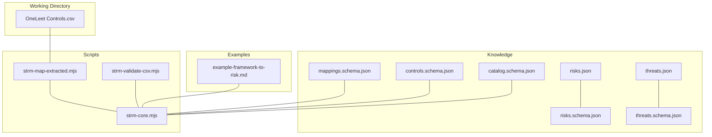
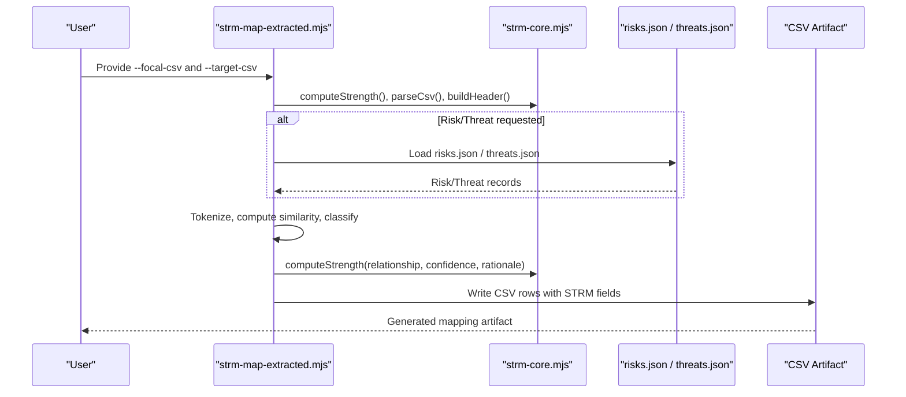
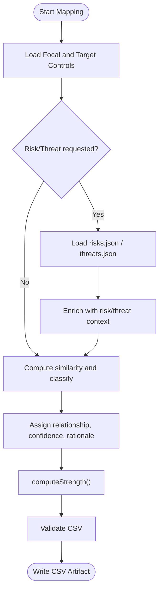
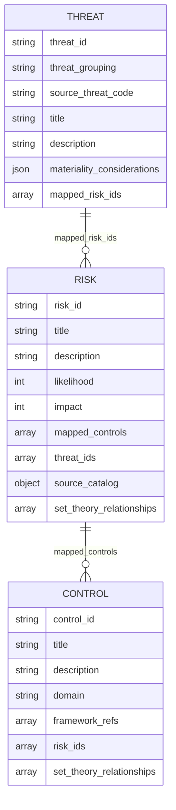
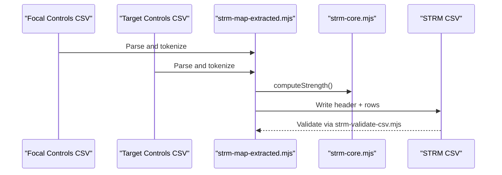
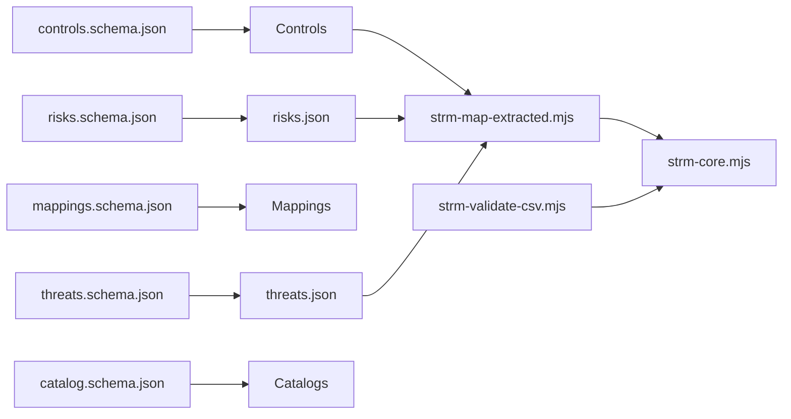

# Risk and Threat Libraries

<cite>
**Referenced Files in This Document**
- [risks.json](file://knowledge/library/risks.json)
- [threats.json](file://knowledge/library/threats.json)
- [risks.schema.json](file://knowledge/risks.schema.json)
- [threats.schema.json](file://knowledge/threats.schema.json)
- [mappings.schema.json](file://knowledge/mappings.schema.json)
- [controls.schema.json](file://knowledge/controls.schema.json)
- [catalog.schema.json](file://knowledge/catalog.schema.json)
- [OneLeet Controls.csv](file://working-directory/controls/OneLeet%20Controls.csv)
- [strm-core.mjs](file://scripts/lib/strm-core.mjs)
- [strm-map-extracted.mjs](file://scripts/bin/strm-map-extracted.mjs)
- [strm-validate-csv.mjs](file://scripts/bin/strm-validate-csv.mjs)
- [example-framework-to-risk.md](file://examples/example-framework-to-risk.md)
- [CONVENTIONS.md](file://CONVENTIONS.md)
- [.agents/skills/strm-mapping/SKILL.md](file://.agents/skills/strm-mapping/SKILL.md)
- [SKILL.md](file://skills/strm-mapping/SKILL.md)
</cite>

## Table of Contents
1. [Introduction](#introduction)
2. [Project Structure](#project-structure)
3. [Core Components](#core-components)
4. [Architecture Overview](#architecture-overview)
5. [Detailed Component Analysis](#detailed-component-analysis)
6. [Dependency Analysis](#dependency-analysis)
7. [Performance Considerations](#performance-considerations)
8. [Troubleshooting Guide](#troubleshooting-guide)
9. [Conclusion](#conclusion)
10. [Appendices](#appendices)

## Introduction
This document explains the Risk and Threat Libraries used by the STRM toolkit to enrich mappings between frameworks, controls, and risk catalogs. It covers:
- Library structure and semantics for risks.json and threats.json
- How STRM integrates these libraries into mappings
- Enrichment workflows (automatic and manual)
- Relationship to control catalogs and how contextual data improves mapping accuracy
- Examples, data transformation patterns, and maintenance/versioning guidance

## Project Structure
The Risk and Threat Libraries live under knowledge/library and are accompanied by JSON Schema definitions that validate their structure. STRM mapping artifacts and scripts live under scripts and examples directories. Control catalogs and framework content live under working-directory.

**Diagram sources**
- [risks.json](file://knowledge/library/risks.json)
- [threats.json](file://knowledge/library/threats.json)
- [risks.schema.json](file://knowledge/risks.schema.json)
- [threats.schema.json](file://knowledge/threats.schema.json)
- [mappings.schema.json](file://knowledge/mappings.schema.json)
- [controls.schema.json](file://knowledge/controls.schema.json)
- [catalog.schema.json](file://knowledge/catalog.schema.json)
- [strm-core.mjs](file://scripts/lib/strm-core.mjs)
- [strm-map-extracted.mjs](file://scripts/bin/strm-map-extracted.mjs)
- [strm-validate-csv.mjs](file://scripts/bin/strm-validate-csv.mjs)
- [OneLeet Controls.csv](file://working-directory/controls/OneLeet%20Controls.csv)
- [example-framework-to-risk.md](file://examples/example-framework-to-risk.md)

**Section sources**
- [risks.json](file://knowledge/library/risks.json)
- [threats.json](file://knowledge/library/threats.json)
- [risks.schema.json](file://knowledge/risks.schema.json)
- [threats.schema.json](file://knowledge/threats.schema.json)
- [mappings.schema.json](file://knowledge/mappings.schema.json)
- [controls.schema.json](file://knowledge/controls.schema.json)
- [catalog.schema.json](file://knowledge/catalog.schema.json)
- [strm-core.mjs](file://scripts/lib/strm-core.mjs)
- [strm-map-extracted.mjs](file://scripts/bin/strm-map-extracted.mjs)
- [strm-validate-csv.mjs](file://scripts/bin/strm-validate-csv.mjs)
- [OneLeet Controls.csv](file://working-directory/controls/OneLeet%20Controls.csv)
- [example-framework-to-risk.md](file://examples/example-framework-to-risk.md)

## Core Components
- risks.json: A curated risk catalog with risk identifiers, titles, descriptions, likelihood and impact scores, mapped controls, optional source catalog metadata, and optional set-theory relationships. It also links to threats via threat_ids.
- threats.json: A taxonomy of threats grouped by type (e.g., Natural or Man-Made), with identifiers, titles, descriptions, materiality considerations, and optional mapped_risk_ids.
- JSON Schemas: Strict validation for risks, threats, mappings, controls, and catalogs, including canonical set-theory relationship types and scopes.

Key enrichment fields:
- risks.json: risk_id, likelihood (1–5), impact (1–5), mapped_controls, threat_ids, source_catalog, set_theory_relationships
- threats.json: threat_id, threat_grouping, source_threat_code, materiality_considerations, mapped_risk_ids

**Section sources**
- [risks.json](file://knowledge/library/risks.json)
- [threats.json](file://knowledge/library/threats.json)
- [risks.schema.json](file://knowledge/risks.schema.json)
- [threats.schema.json](file://knowledge/threats.schema.json)

## Architecture Overview
The STRM toolkit orchestrates mappings between frameworks and controls, optionally enriched by risk and threat libraries. The enrichment workflow follows a deliberate opt-in pattern and leverages canonical set-theory semantics.

**Diagram sources**
- [strm-map-extracted.mjs](file://scripts/bin/strm-map-extracted.mjs)
- [strm-core.mjs](file://scripts/lib/strm-core.mjs)
- [risks.json](file://knowledge/library/risks.json)
- [threats.json](file://knowledge/library/threats.json)

## Detailed Component Analysis

### Risk Library (risks.json)
Structure highlights:
- Top-level fields: version, generated_at, risks[]
- Each risk item includes:
  - risk_id (patterned identifier)
  - title and description
  - likelihood and impact (integer scale 1–5)
  - mapped_controls (array of control identifiers)
  - threat_ids (optional array of threat identifiers)
  - source_catalog (optional metadata)
  - set_theory_relationships (optional canonical set-theory relations)

Validation and semantics:
- Risks schema enforces required fields, identifier patterns, and canonical set-theory relationship scopes and rationale types.

Practical enrichment:
- threat_ids link risks to threats, enabling downstream traversal from threat → risk → control.
- source_catalog enables provenance and grouping (e.g., risk_grouping, NIST CSF function).

**Section sources**
- [risks.json](file://knowledge/library/risks.json)
- [risks.schema.json](file://knowledge/risks.schema.json)

### Threat Library (threats.json)
Structure highlights:
- Top-level fields: version, generated_at, threats[]
- Each threat item includes:
  - threat_id (patterned identifier)
  - threat_grouping (e.g., Natural or Man-Made)
  - source_threat_code
  - title and description
  - materiality_considerations (pre-tax income, total assets/equity/revenue percentages)
  - mapped_risk_ids (optional array of risk identifiers)

Validation and semantics:
- Threats schema enforces required fields, identifier patterns, and materiality fields.

Practical enrichment:
- mapped_risk_ids flag unmapped threats for manual derivation.
- Materiality fields are informational and can be included in Notes for context.

**Section sources**
- [threats.json](file://knowledge/library/threats.json)
- [threats.schema.json](file://knowledge/threats.schema.json)

### Mapping Enrichment and Workflows
Automatic enrichment:
- The extraction mapper computes similarity between focal and target controls, classifies relationships, assigns confidence, and derives a strength score using canonical set-theory semantics.
- When risk/threat libraries are explicitly requested, the mapper can leverage risk_id and threat_id fields to enrich the mapping narrative and traceability.

Manual review processes:
- Quality rules emphasize computing strength via formula, never inventing target control IDs, and respecting embedded STRM data.
- Risk/Threat files are opt-in; unmapped threats should be flagged in Notes.

**Diagram sources**
- [strm-map-extracted.mjs](file://scripts/bin/strm-map-extracted.mjs)
- [strm-core.mjs](file://scripts/lib/strm-core.mjs)
- [CONVENTIONS.md](file://CONVENTIONS.md)
- [.agents/skills/strm-mapping/SKILL.md](file://.agents/skills/strm-mapping/SKILL.md)
- [SKILL.md](file://skills/strm-mapping/SKILL.md)

**Section sources**
- [strm-map-extracted.mjs](file://scripts/bin/strm-map-extracted.mjs)
- [strm-core.mjs](file://scripts/lib/strm-core.mjs)
- [CONVENTIONS.md](file://CONVENTIONS.md)
- [.agents/skills/strm-mapping/SKILL.md](file://.agents/skills/strm-mapping/SKILL.md)
- [SKILL.md](file://skills/strm-mapping/SKILL.md)

### Relationship Between Risk/Threat Libraries and Control Catalogs
- Controls catalogs define control identifiers, titles, descriptions, families, and optional risk_ids and set_theory_relationships.
- Risk library entries link to controls via mapped_controls and to threats via threat_ids.
- Threat library entries link to risks via mapped_risk_ids.
- This creates a three-way chain: Threat → Risk → Control, enabling enriched mappings and gap analysis.

**Diagram sources**
- [threats.json](file://knowledge/library/threats.json)
- [risks.json](file://knowledge/library/risks.json)
- [controls.schema.json](file://knowledge/controls.schema.json)

**Section sources**
- [threats.json](file://knowledge/library/threats.json)
- [risks.json](file://knowledge/library/risks.json)
- [controls.schema.json](file://knowledge/controls.schema.json)

### Examples of Enriched Mappings and Data Transformation Patterns
- Framework-to-risk mapping example demonstrates how STRM relationships (equal, subset_of, superset_of, intersects_with, not_related) quantify how a framework subcategory addresses a risk scenario, and how strength scores are computed.
- Extraction mapper transforms control CSVs into STRM-ready CSVs by tokenizing, computing lexical overlaps, classifying relationships, and writing standardized headers and rows.

**Diagram sources**
- [strm-map-extracted.mjs](file://scripts/bin/strm-map-extracted.mjs)
- [strm-core.mjs](file://scripts/lib/strm-core.mjs)
- [strm-validate-csv.mjs](file://scripts/bin/strm-validate-csv.mjs)
- [example-framework-to-risk.md](file://examples/example-framework-to-risk.md)

**Section sources**
- [example-framework-to-risk.md](file://examples/example-framework-to-risk.md)
- [strm-map-extracted.mjs](file://scripts/bin/strm-map-extracted.mjs)
- [strm-core.mjs](file://scripts/lib/strm-core.mjs)
- [strm-validate-csv.mjs](file://scripts/bin/strm-validate-csv.mjs)

## Dependency Analysis
- risks.json and threats.json depend on their respective schemas for validation.
- STRM mapping scripts depend on the core library for canonical set-theory scoring and CSV parsing/validation.
- Control catalogs and framework content feed the extraction mapper to produce mappings.
- The quality rules and skill instructions enforce opt-in enrichment and manual review discipline.

**Diagram sources**
- [risks.schema.json](file://knowledge/risks.schema.json)
- [threats.schema.json](file://knowledge/threats.schema.json)
- [mappings.schema.json](file://knowledge/mappings.schema.json)
- [controls.schema.json](file://knowledge/controls.schema.json)
- [catalog.schema.json](file://knowledge/catalog.schema.json)
- [strm-map-extracted.mjs](file://scripts/bin/strm-map-extracted.mjs)
- [strm-validate-csv.mjs](file://scripts/bin/strm-validate-csv.mjs)
- [OneLeet Controls.csv](file://working-directory/controls/OneLeet%20Controls.csv)
- [risks.json](file://knowledge/library/risks.json)
- [threats.json](file://knowledge/library/threats.json)

**Section sources**
- [risks.schema.json](file://knowledge/risks.schema.json)
- [threats.schema.json](file://knowledge/threats.schema.json)
- [mappings.schema.json](file://knowledge/mappings.schema.json)
- [controls.schema.json](file://knowledge/controls.schema.json)
- [catalog.schema.json](file://knowledge/catalog.schema.json)
- [strm-map-extracted.mjs](file://scripts/bin/strm-map-extracted.mjs)
- [strm-validate-csv.mjs](file://scripts/bin/strm-validate-csv.mjs)
- [OneLeet Controls.csv](file://working-directory/controls/OneLeet%20Controls.csv)
- [risks.json](file://knowledge/library/risks.json)
- [threats.json](file://knowledge/library/threats.json)

## Performance Considerations
- Tokenization and similarity computation scales with the number of focal and target controls; consider batching and caching for large catalogs.
- CSV parsing and validation are linear in row count; ensure headers are consistent to avoid rework.
- Enrichment with risk/threat libraries adds lookup overhead; pre-index by identifiers for frequent reuse.

## Troubleshooting Guide
Common issues and resolutions:
- Invalid STRM Relationship, Confidence Levels, or NIST IR-8477 Rational values cause validation failures.
- Strength mismatch occurs when the computed score does not match the formula; verify relationship, confidence, and rationale.
- Empty STRM Rationale or missing Target ID # are errors; ensure all required fields are populated.
- not_related rows should include Notes context; low confidence should be reserved for significant inference.

Validation pipeline:
- Use the CSV validator to check headers, required columns, and computed strength.
- Review warnings for syntactic rationale, low confidence usage, and missing notes.

**Section sources**
- [strm-validate-csv.mjs](file://scripts/bin/strm-validate-csv.mjs)
- [strm-core.mjs](file://scripts/lib/strm-core.mjs)
- [CONVENTIONS.md](file://CONVENTIONS.md)

## Conclusion
The Risk and Threat Libraries provide structured, validated context that enriches STRM mappings. By following opt-in enrichment, canonical set-theory semantics, and disciplined manual review, teams can improve mapping accuracy, traceability, and decision-making. Proper maintenance, validation, and versioning of libraries and schemas ensure consistency across large deployments.

## Appendices

### Appendix A: Canonical Set-Theoretic Semantics
- Relationships include equal, subset_of, superset_of, intersects_with, not_related, and legacy aliases.
- Scope enums cover framework_control_set, normalized_control_set, control_requirement_set, risk_scenario_set, implementation_evidence_set.
- Rationale types include syntactic, semantic, functional.

**Section sources**
- [risks.schema.json](file://knowledge/risks.schema.json)
- [threats.schema.json](file://knowledge/threats.schema.json)
- [mappings.schema.json](file://knowledge/mappings.schema.json)
- [controls.schema.json](file://knowledge/controls.schema.json)
- [catalog.schema.json](file://knowledge/catalog.schema.json)

### Appendix B: Enrichment Guidance
- Opt-in loading of risks.json and threats.json prevents unintended bias.
- Respect embedded STRM data in risk entries; flag unmapped threats for manual derivation.
- Use materiality fields for context in Notes; do not infer risk ratings from threats alone.

**Section sources**
- [CONVENTIONS.md](file://CONVENTIONS.md)
- [.agents/skills/strm-mapping/SKILL.md](file://.agents/skills/strm-mapping/SKILL.md)
- [SKILL.md](file://skills/strm-mapping/SKILL.md)