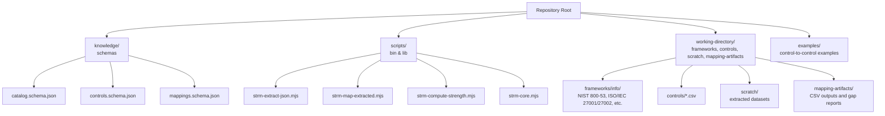
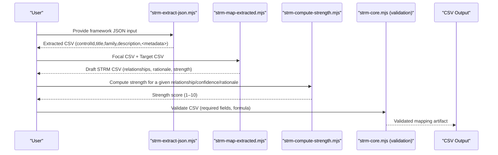
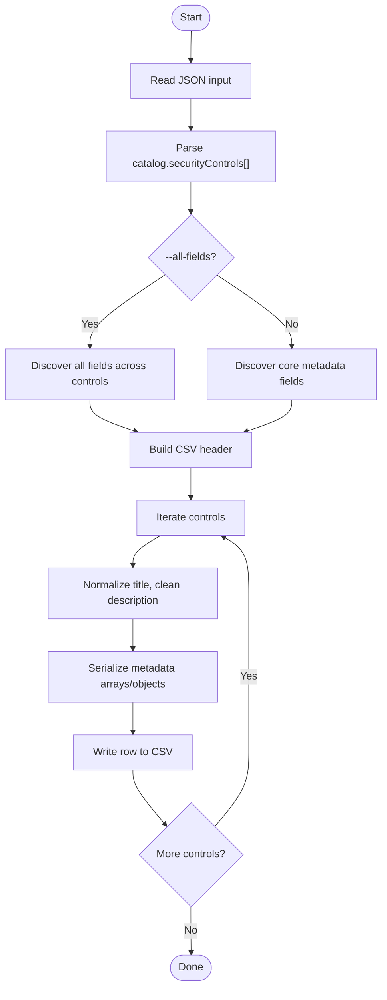
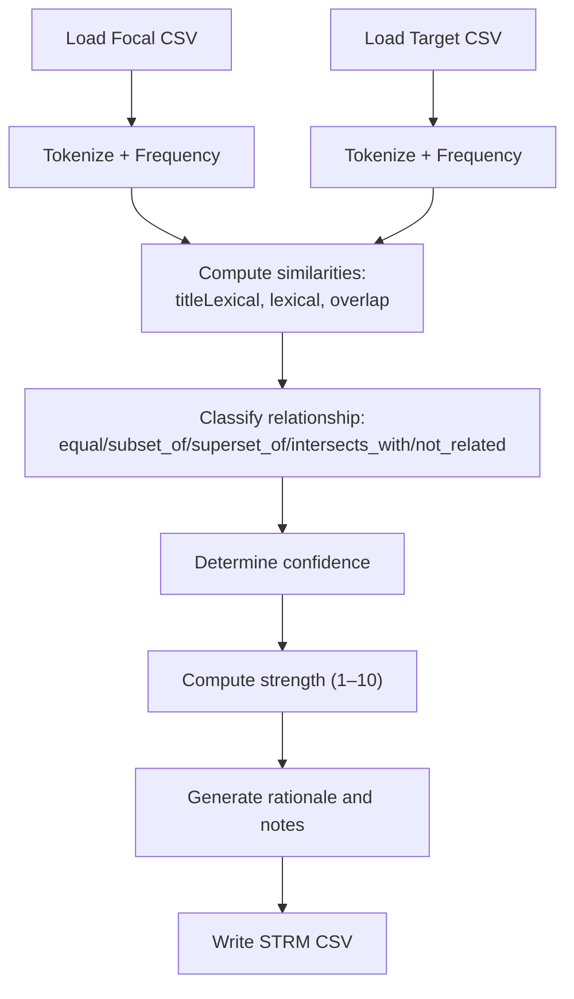
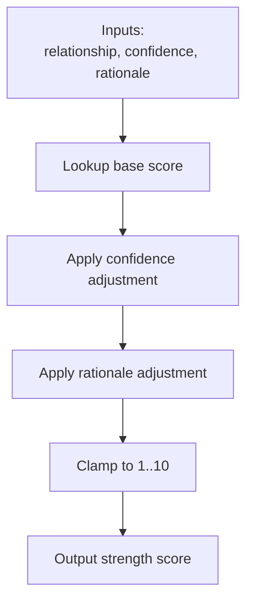
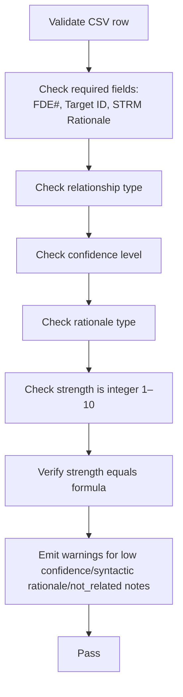
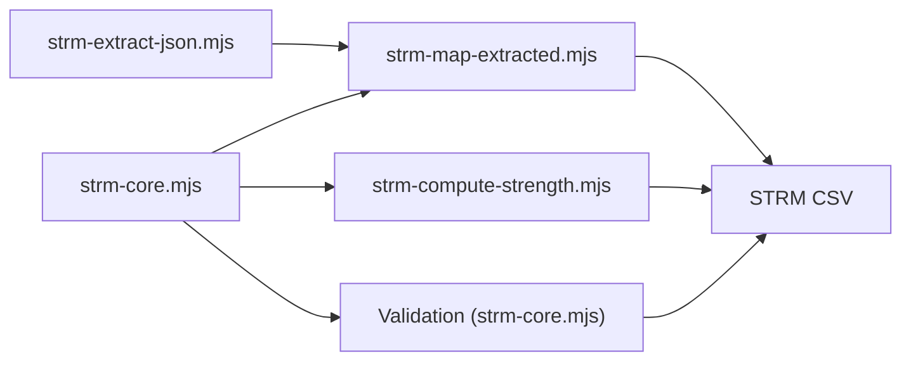
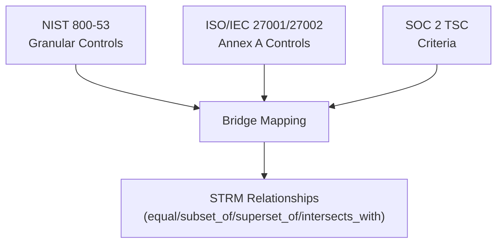
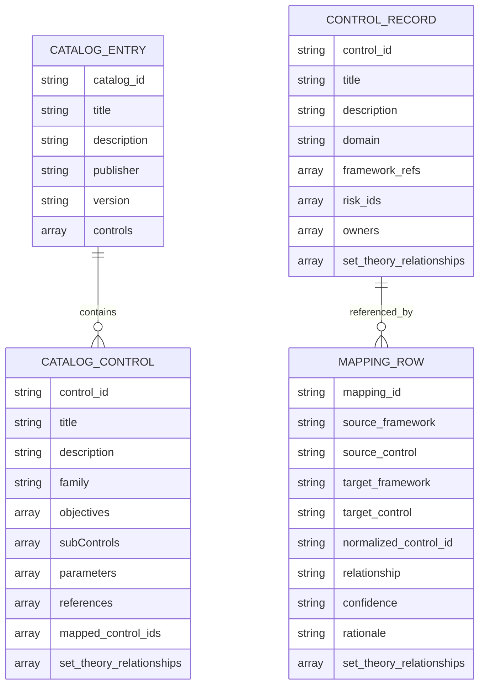

# Control-to-Control Alignments

<cite>
**Referenced Files in This Document**
- [README.md](file://README.md)
- [scripts/README.md](file://scripts/README.md)
- [knowledge/catalog.schema.json](file://knowledge/catalog.schema.json)
- [knowledge/controls.schema.json](file://knowledge/controls.schema.json)
- [knowledge/mappings.schema.json](file://knowledge/mappings.schema.json)
- [scripts/lib/strm-core.mjs](file://scripts/lib/strm-core.mjs)
- [scripts/bin/strm-extract-json.mjs](file://scripts/bin/strm-extract-json.mjs)
- [scripts/bin/strm-map-extracted.mjs](file://scripts/bin/strm-map-extracted.mjs)
- [scripts/bin/strm-compute-strength.mjs](file://scripts/bin/strm-compute-strength.mjs)
- [examples/example-control-to-control.md](file://examples/example-control-to-control.md)
- [working-directory/frameworks/info/nist-800-53.md](file://working-directory/frameworks/info/nist-800-53.md)
</cite>

## Table of Contents
1. [Introduction](#introduction)
2. [Project Structure](#project-structure)
3. [Core Components](#core-components)
4. [Architecture Overview](#architecture-overview)
5. [Detailed Component Analysis](#detailed-component-analysis)
6. [Dependency Analysis](#dependency-analysis)
7. [Performance Considerations](#performance-considerations)
8. [Troubleshooting Guide](#troubleshooting-guide)
9. [Conclusion](#conclusion)
10. [Appendices](#appendices)

## Introduction
This document explains how to perform Control-to-Control Alignments using the STRM Mapping toolkit. It focuses on direct control mapping and catalog harmonization to identify equivalent, overlapping, or complementary controls across frameworks. The methodology covers extracting control data, preparing catalogs, executing mappings, and validating results with quality assurance techniques such as confidence scoring and relationship strength calculations. Practical examples demonstrate mapping between major catalogs like NIST 800-53, ISO/IEC 27001/27002, and industry-specific frameworks.

## Project Structure
The repository provides:
- Knowledge schemas that define the canonical data models for catalogs, controls, and mappings
- Utility scripts for extraction, mapping, strength computation, and validation
- Example artifacts and framework documentation to guide alignment workflows
- Working directory layout for inputs, extracted datasets, and mapping artifacts

**Diagram sources**
- [README.md:1-30](file://README.md#L1-L30)
- [scripts/README.md:1-31](file://scripts/README.md#L1-L31)
- [knowledge/catalog.schema.json:1-157](file://knowledge/catalog.schema.json#L1-L157)
- [knowledge/controls.schema.json:1-141](file://knowledge/controls.schema.json#L1-L141)
- [knowledge/mappings.schema.json:1-117](file://knowledge/mappings.schema.json#L1-L117)
- [scripts/lib/strm-core.mjs:1-343](file://scripts/lib/strm-core.mjs#L1-L343)
- [scripts/bin/strm-extract-json.mjs:1-354](file://scripts/bin/strm-extract-json.mjs#L1-L354)
- [scripts/bin/strm-map-extracted.mjs:1-278](file://scripts/bin/strm-map-extracted.mjs#L1-L278)
- [scripts/bin/strm-compute-strength.mjs:1-20](file://scripts/bin/strm-compute-strength.mjs#L1-L20)

**Section sources**
- [README.md:1-30](file://README.md#L1-L30)
- [scripts/README.md:1-31](file://scripts/README.md#L1-L31)

## Core Components
- Catalog schema: Defines the structure for control catalogs, including control metadata, objectives, parameters, and optional set-theory relationships aligned with NIST IR 8477.
- Controls dataset schema: Defines normalized control records with domain, framework references, and optional set-theory relationships.
- Mappings dataset schema: Defines row-level mappings between controls in focal and target frameworks, including relationship, confidence, rationale, and optional IR 8477 set-theory relationships.
- Extraction script: Converts framework JSON catalogs into a standardized CSV with control identifiers, titles, families, descriptions, and core metadata.
- Mapping script: Computes similarity between controls and derives STRM relationships with confidence and rationale, then computes strength scores.
- Strength computation: Applies a deterministic formula to derive a 1–10 strength score from relationship, confidence, and rationale type.
- Core utilities: Provide CSV parsing/validation, filename generation, and artifact directory resolution.

**Section sources**
- [knowledge/catalog.schema.json:57-144](file://knowledge/catalog.schema.json#L57-L144)
- [knowledge/controls.schema.json:108-139](file://knowledge/controls.schema.json#L108-L139)
- [knowledge/mappings.schema.json:54-114](file://knowledge/mappings.schema.json#L54-L114)
- [scripts/bin/strm-extract-json.mjs:317-334](file://scripts/bin/strm-extract-json.mjs#L317-L334)
- [scripts/bin/strm-map-extracted.mjs:209-256](file://scripts/bin/strm-map-extracted.mjs#L209-L256)
- [scripts/bin/strm-compute-strength.mjs:18-19](file://scripts/bin/strm-compute-strength.mjs#L18-L19)
- [scripts/lib/strm-core.mjs:35-57](file://scripts/lib/strm-core.mjs#L35-L57)

## Architecture Overview
The alignment pipeline transforms framework inputs into harmonized mappings using extraction, similarity-based classification, and strength computation.

**Diagram sources**
- [scripts/bin/strm-extract-json.mjs:282-354](file://scripts/bin/strm-extract-json.mjs#L282-L354)
- [scripts/bin/strm-map-extracted.mjs:17-278](file://scripts/bin/strm-map-extracted.mjs#L17-L278)
- [scripts/bin/strm-compute-strength.mjs:9-19](file://scripts/bin/strm-compute-strength.mjs#L9-L19)
- [scripts/lib/strm-core.mjs:206-265](file://scripts/lib/strm-core.mjs#L206-L265)

## Detailed Component Analysis

### Extraction Pipeline
The extraction script reads a framework JSON catalog and writes a standardized CSV. It normalizes titles, cleans HTML and placeholder text, and optionally includes core metadata fields such as subControls, parameters, objectives, and enhancements.

**Diagram sources**
- [scripts/bin/strm-extract-json.mjs:282-354](file://scripts/bin/strm-extract-json.mjs#L282-L354)

**Section sources**
- [scripts/bin/strm-extract-json.mjs:39-94](file://scripts/bin/strm-extract-json.mjs#L39-L94)
- [scripts/bin/strm-extract-json.mjs:206-280](file://scripts/bin/strm-extract-json.mjs#L206-L280)
- [scripts/bin/strm-extract-json.mjs:317-334](file://scripts/bin/strm-extract-json.mjs#L317-L334)

### Mapping Pipeline
The mapping script compares controls from focal and target catalogs using tokenization, Jaccard similarity, thematic overlap, and lexical similarity. It classifies relationships and generates a draft CSV with confidence, rationale, and strength.

**Diagram sources**
- [scripts/bin/strm-map-extracted.mjs:180-256](file://scripts/bin/strm-map-extracted.mjs#L180-L256)
- [scripts/lib/strm-core.mjs:35-57](file://scripts/lib/strm-core.mjs#L35-L57)

**Section sources**
- [scripts/bin/strm-map-extracted.mjs:29-158](file://scripts/bin/strm-map-extracted.mjs#L29-L158)
- [scripts/bin/strm-map-extracted.mjs:209-256](file://scripts/bin/strm-map-extracted.mjs#L209-L256)
- [scripts/lib/strm-core.mjs:4-13](file://scripts/lib/strm-core.mjs#L4-L13)

### Strength Computation
Strength is computed deterministically from relationship, confidence, and rationale type, bounded to 1–10.

**Diagram sources**
- [scripts/lib/strm-core.mjs:35-57](file://scripts/lib/strm-core.mjs#L35-L57)
- [scripts/bin/strm-compute-strength.mjs:18-19](file://scripts/bin/strm-compute-strength.mjs#L18-L19)

**Section sources**
- [scripts/lib/strm-core.mjs:35-57](file://scripts/lib/strm-core.mjs#L35-L57)
- [scripts/bin/strm-compute-strength.mjs:9-19](file://scripts/bin/strm-compute-strength.mjs#L9-L19)

### Quality Assurance and Validation
Validation ensures required fields are present, relationship/confidence/rationale types are valid, and the strength score matches the formula. Warnings highlight low confidence, syntactic rationale, and missing notes for “not_related”.

**Diagram sources**
- [scripts/lib/strm-core.mjs:206-265](file://scripts/lib/strm-core.mjs#L206-L265)

**Section sources**
- [scripts/lib/strm-core.mjs:206-265](file://scripts/lib/strm-core.mjs#L206-L265)

## Dependency Analysis
The mapping pipeline depends on:
- Extraction script to produce CSVs from framework JSON inputs
- Mapping script to compare controls and derive relationships
- Strength computation to quantify relationship strength
- Validation utilities to enforce schema and formula correctness

**Diagram sources**
- [scripts/bin/strm-extract-json.mjs:1-354](file://scripts/bin/strm-extract-json.mjs#L1-L354)
- [scripts/bin/strm-map-extracted.mjs:1-278](file://scripts/bin/strm-map-extracted.mjs#L1-L278)
- [scripts/bin/strm-compute-strength.mjs:1-20](file://scripts/bin/strm-compute-strength.mjs#L1-L20)
- [scripts/lib/strm-core.mjs:1-343](file://scripts/lib/strm-core.mjs#L1-L343)

**Section sources**
- [scripts/bin/strm-extract-json.mjs:1-354](file://scripts/bin/strm-extract-json.mjs#L1-L354)
- [scripts/bin/strm-map-extracted.mjs:1-278](file://scripts/bin/strm-map-extracted.mjs#L1-L278)
- [scripts/bin/strm-compute-strength.mjs:1-20](file://scripts/bin/strm-compute-strength.mjs#L1-L20)
- [scripts/lib/strm-core.mjs:1-343](file://scripts/lib/strm-core.mjs#L1-L343)

## Performance Considerations
- Tokenization and Jaccard similarity scale quadratically with the number of controls. For large catalogs, consider pre-filtering by thematic clusters or using approximate nearest neighbor techniques.
- Metadata serialization can be expensive for deeply nested arrays/objects; prefer selective field inclusion via the extraction script’s default core metadata to reduce overhead.
- CSV I/O is the dominant cost; batch processing and streaming are recommended for very large datasets.

## Troubleshooting Guide
Common issues and resolutions:
- Missing required fields in the CSV: Ensure FDE#, Target ID, and STRM Rationale are populated; validation will flag empty values.
- Invalid relationship/confidence/rationale types: Correct to allowed enumerations; see schemas for canonical values.
- Strength mismatch: Recompute strength using the provided script to confirm the expected value.
- Low confidence mappings: Use higher-confidence anchors (e.g., stronger lexical overlap or thematic agreement) or refine control descriptions.
- Syntactic rationale: Prefer semantic or functional rationales; syntactic is uncommon and flagged as a warning.
- “Not_related” without notes: Add contextual notes explaining why no meaningful overlap was detected.

**Section sources**
- [scripts/lib/strm-core.mjs:206-265](file://scripts/lib/strm-core.mjs#L206-L265)
- [scripts/bin/strm-compute-strength.mjs:9-19](file://scripts/bin/strm-compute-strength.mjs#L9-L19)

## Conclusion
Control-to-Control Alignments leverage standardized schemas, extraction, similarity-based classification, and deterministic strength computation to produce robust, auditable mappings. By following the outlined methodology and quality assurance steps, teams can harmonize controls across catalogs, consolidate compliance efforts, and improve operational efficiency.

## Appendices

### Methodology: Direct Control Mapping and Catalog Harmonization
- Prepare inputs: Place framework JSON or Markdown/CSV inputs under the working directory.
- Extract controls: Use the extraction script to produce CSVs with standardized headers and core metadata.
- Map controls: Run the mapping script to generate a draft STRM CSV with relationships, confidence, rationale, and strength.
- Validate and finalize: Use validation utilities to ensure correctness and completeness; manually review and adjust mappings as needed.
- Document harmonization: Aggregate equivalent, overlapping, and complementary controls to support consolidated compliance programs.

**Section sources**
- [scripts/README.md:10-31](file://scripts/README.md#L10-L31)
- [scripts/bin/strm-extract-json.mjs:282-354](file://scripts/bin/strm-extract-json.mjs#L282-L354)
- [scripts/bin/strm-map-extracted.mjs:17-278](file://scripts/bin/strm-map-extracted.mjs#L17-L278)
- [scripts/lib/strm-core.mjs:206-265](file://scripts/lib/strm-core.mjs#L206-L265)

### Practical Examples: Mapping Between Major Catalogs
- NIST 800-53 to ISO/IEC 27001/27002: Use NIST 800-53 as the anchor framework to map to ISO Annex A controls. Align control families and objectives, then compute relationships and strengths.
- NIST 800-53 to SOC 2: Map granular 800-53 controls to SOC 2 Trust Service Criteria, focusing on functional equivalence and scope alignment.
- ISO/IEC 27001/27002 to SOC 2: Use the example mapping pattern to derive direct equivalencies and overlaps between ISO controls and SOC 2 criteria.

**Diagram sources**
- [working-directory/frameworks/info/nist-800-53.md:320-337](file://working-directory/frameworks/info/nist-800-53.md#L320-L337)
- [examples/example-control-to-control.md:1-162](file://examples/example-control-to-control.md#L1-L162)

**Section sources**
- [working-directory/frameworks/info/nist-800-53.md:320-337](file://working-directory/frameworks/info/nist-800-53.md#L320-L337)
- [examples/example-control-to-control.md:1-162](file://examples/example-control-to-control.md#L1-L162)

### Handling Control Variations, Missing Controls, and Updates
- Variations: Normalize control titles and descriptions; use thematic clustering to identify near-equivalents when wording differs.
- Missing controls: Flag missing controls and document compensating controls or scope exclusions; update mappings iteratively as catalogs evolve.
- Updates: Re-run extraction and mapping when source catalogs change; maintain dated artifacts and track revision dates.

**Section sources**
- [scripts/bin/strm-map-extracted.mjs:119-158](file://scripts/bin/strm-map-extracted.mjs#L119-L158)
- [scripts/lib/strm-core.mjs:267-277](file://scripts/lib/strm-core.mjs#L267-L277)

### Data Model Alignment
- Catalog schema: Defines control-level metadata and optional set-theory relationships for catalog semantics.
- Controls dataset schema: Normalizes control records with framework references and optional set-theory relationships for control-to-risk semantics.
- Mappings dataset schema: Encodes row-level mappings with relationship, confidence, rationale, and optional IR 8477 set-theory relationships.

**Diagram sources**
- [knowledge/catalog.schema.json:110-144](file://knowledge/catalog.schema.json#L110-L144)
- [knowledge/controls.schema.json:108-139](file://knowledge/controls.schema.json#L108-L139)
- [knowledge/mappings.schema.json:54-114](file://knowledge/mappings.schema.json#L54-L114)

**Section sources**
- [knowledge/catalog.schema.json:57-144](file://knowledge/catalog.schema.json#L57-L144)
- [knowledge/controls.schema.json:108-139](file://knowledge/controls.schema.json#L108-L139)
- [knowledge/mappings.schema.json:54-114](file://knowledge/mappings.schema.json#L54-L114)