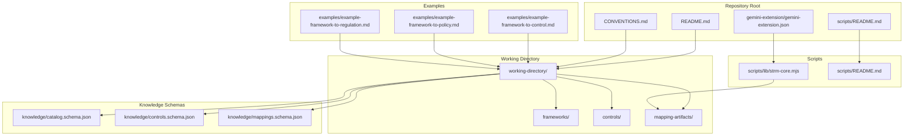
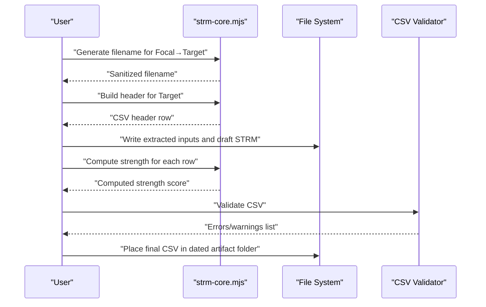
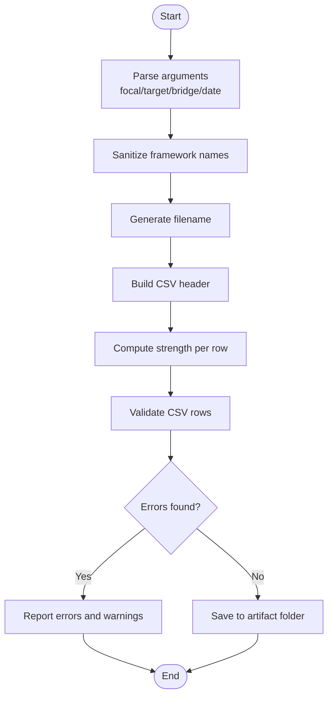
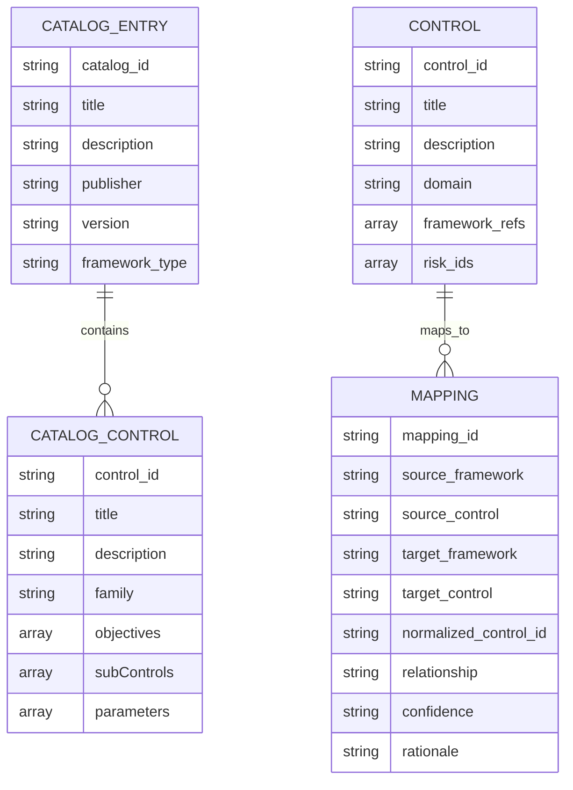
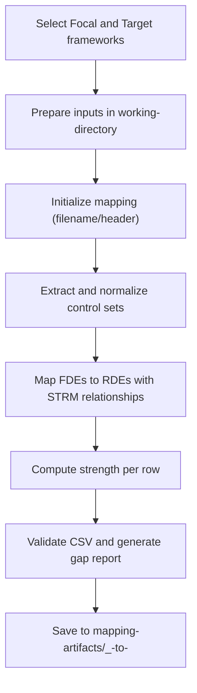
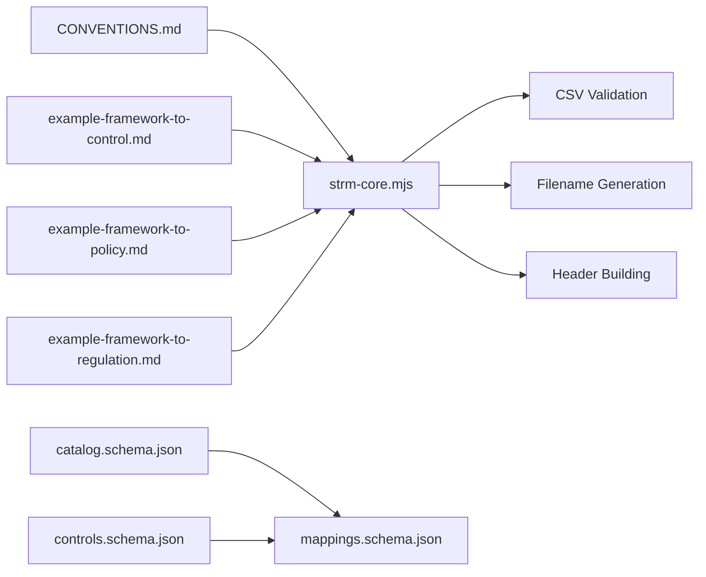

# Framework-to-Framework Mappings

<cite>
**Referenced Files in This Document**
- [README.md](file://README.md)
- [CONVENTIONS.md](file://CONVENTIONS.md)
- [scripts/README.md](file://scripts/README.md)
- [scripts/lib/strm-core.mjs](file://scripts/lib/strm-core.mjs)
- [examples/example-framework-to-control.md](file://examples/example-framework-to-control.md)
- [examples/example-framework-to-policy.md](file://examples/example-framework-to-policy.md)
- [examples/example-framework-to-regulation.md](file://examples/example-framework-to-regulation.md)
- [knowledge/mappings.schema.json](file://knowledge/mappings.schema.json)
- [knowledge/controls.schema.json](file://knowledge/controls.schema.json)
- [knowledge/catalog.schema.json](file://knowledge/catalog.schema.json)
- [gemini-extension/gemini-extension.json](file://gemini-extension/gemini-extension.json)
</cite>

## Table of Contents
1. [Introduction](#introduction)
2. [Project Structure](#project-structure)
3. [Core Components](#core-components)
4. [Architecture Overview](#architecture-overview)
5. [Detailed Component Analysis](#detailed-component-analysis)
6. [Dependency Analysis](#dependency-analysis)
7. [Performance Considerations](#performance-considerations)
8. [Troubleshooting Guide](#troubleshooting-guide)
9. [Conclusion](#conclusion)
10. [Appendices](#appendices)

## Introduction
This document explains how to perform cross-framework mappings using the STRM (Set-Theory Relationship Mapping) methodology aligned with NIST IR 8477. It focuses on mapping between cybersecurity frameworks such as NIST 800-53, ISO/IEC 27001/27002, CIS Controls, and FedRAMP, and provides a repeatable process for preparing inputs, executing mappings, and interpreting results. It also addresses common challenges (terminology differences, categorization variations, maturity level discrepancies), selection criteria for frameworks, handling updates, and maintaining mapping currency. Guidance is grounded in repository conventions, scripts, and example outputs.

## Project Structure
The repository organizes mapping assets and tooling to support reproducible STRM workflows:
- Working directory for inputs/outputs and artifacts
- Knowledge schemas for catalogs, controls, and mappings
- Example mapping narratives for framework-to-control, framework-to-policy, and framework-to-regulation
- Utility scripts for deterministic operations (validation, strength computation, filename generation, gap reporting)
- Extension configuration for integrating mapping commands into development environments

**Diagram sources**
- [README.md:1-30](file://README.md#L1-L30)
- [CONVENTIONS.md:17-33](file://CONVENTIONS.md#L17-L33)
- [scripts/README.md:1-31](file://scripts/README.md#L1-L31)
- [gemini-extension/gemini-extension.json:1-13](file://gemini-extension/gemini-extension.json#L1-L13)

**Section sources**
- [README.md:1-30](file://README.md#L1-L30)
- [CONVENTIONS.md:17-33](file://CONVENTIONS.md#L17-L33)
- [scripts/README.md:1-31](file://scripts/README.md#L1-L31)

## Core Components
- STRM methodology and conventions: defines terms (Focal Document Element, Reference Document Element, STRM Relationship), relationship types, defaults, strength scoring, rationale writing pattern, CSV format, file naming, artifact folders, and transitivity/inverse rules.
- Scripts library: provides deterministic helpers for computing strength scores, building headers, parsing CSV, validating rows, generating filenames, resolving artifact directories, and listing input files.
- Knowledge schemas: define datasets for catalogs, controls, and mappings with canonical scopes and optional set-theory relationships aligned to IR 8477.
- Examples: demonstrate three mapping types—framework-to-control, framework-to-policy, and framework-to-regulation—with detailed walkthroughs of inputs, execution parameters, and outputs.

**Section sources**
- [CONVENTIONS.md:36-186](file://CONVENTIONS.md#L36-L186)
- [scripts/lib/strm-core.mjs:1-343](file://scripts/lib/strm-core.mjs#L1-L343)
- [knowledge/catalog.schema.json:1-157](file://knowledge/catalog.schema.json#L1-L157)
- [knowledge/controls.schema.json:1-141](file://knowledge/controls.schema.json#L1-L141)
- [knowledge/mappings.schema.json:1-117](file://knowledge/mappings.schema.json#L1-L117)
- [examples/example-framework-to-control.md:1-159](file://examples/example-framework-to-control.md#L1-L159)
- [examples/example-framework-to-policy.md:1-173](file://examples/example-framework-to-policy.md#L1-L173)
- [examples/example-framework-to-regulation.md:1-163](file://examples/example-framework-to-regulation.md#L1-L163)

## Architecture Overview
The STRM workflow is a deterministic pipeline that transforms framework inputs into validated STRM outputs. It supports:
- Deterministic operations via scripts
- Consistent CSV formatting and validation
- Strength score computation aligned with NIST IR 8477
- Artifact organization under a dated folder structure
- Optional enrichment with risk/threat libraries when explicitly requested

**Diagram sources**
- [scripts/lib/strm-core.mjs:67-97](file://scripts/lib/strm-core.mjs#L67-L97)
- [scripts/lib/strm-core.mjs:206-265](file://scripts/lib/strm-core.mjs#L206-L265)
- [scripts/README.md:10-31](file://scripts/README.md#L10-L31)

## Detailed Component Analysis

### STRM Methodology and Conventions
- Terminology and relationships: FDE/RDE, STRM Relationship types, defaults for confidence and rationale, and the strength scoring formula.
- Output format: 12-column CSV with specific column definitions and naming conventions for target-adapted headers.
- File and folder conventions: naming template and artifact folder layout with date prefixes.
- Transitivity and inverse rules: derived relationships and inverses for mapping chains.
- Quality checklist: required validations and opt-in enrichment with risk/threat libraries.

**Section sources**
- [CONVENTIONS.md:36-186](file://CONVENTIONS.md#L36-L186)

### Scripts Library (Deterministic Operations)
- Relationship types and scoring: constants and compute function for strength.
- Utilities: filename sanitization, header building, CSV parsing and serialization, column indexing, data validation, artifact directory resolution, input file discovery, and existing mapping lookup.
- Validation: ensures required fields, valid relationship/confidence/rationale types, integer strength in range, and formula-consistency.

**Diagram sources**
- [scripts/lib/strm-core.mjs:35-57](file://scripts/lib/strm-core.mjs#L35-L57)
- [scripts/lib/strm-core.mjs:67-97](file://scripts/lib/strm-core.mjs#L67-L97)
- [scripts/lib/strm-core.mjs:206-265](file://scripts/lib/strm-core.mjs#L206-L265)

**Section sources**
- [scripts/lib/strm-core.mjs:1-343](file://scripts/lib/strm-core.mjs#L1-L343)

### Knowledge Schemas (Data Contracts)
- Catalog schema: describes framework catalogs with controls, objectives, parameters, and optional set-theory relationships.
- Controls schema: describes control datasets with framework references, risk IDs, owners, and optional set-theory relationships.
- Mappings schema: describes mapping datasets with normalized control IDs, relationships, confidence, rationale, and optional set-theory relationships.

**Diagram sources**
- [knowledge/catalog.schema.json:57-144](file://knowledge/catalog.schema.json#L57-L144)
- [knowledge/controls.schema.json:104-139](file://knowledge/controls.schema.json#L104-L139)
- [knowledge/mappings.schema.json:52-114](file://knowledge/mappings.schema.json#L52-L114)

**Section sources**
- [knowledge/catalog.schema.json:1-157](file://knowledge/catalog.schema.json#L1-L157)
- [knowledge/controls.schema.json:1-141](file://knowledge/controls.schema.json#L1-L141)
- [knowledge/mappings.schema.json:1-117](file://knowledge/mappings.schema.json#L1-L117)

### Example Walkthroughs

#### Framework-to-Control Mapping (NIST 800-53 Rev 5 → CIS Controls v8.1)
- Context: Organization implements CIS Controls v8.1 and seeks coverage mapping from NIST 800-53 Rev 5.
- Inputs: Focal document (NIST 800-53 Rev 5), Target document (CIS Controls v8.1), optional Bridge (direct mapping).
- Execution: Prepare CSV with header, populate rows with STRM relationships and rationales, compute strength per row.
- Outputs: STRM CSV and a dated artifact folder; strength calculations follow the IR 8477 formula.
- Observations: Expect many subset_of relationships; enhancements and maturity tiers require careful notation.

**Section sources**
- [examples/example-framework-to-control.md:1-159](file://examples/example-framework-to-control.md#L1-L159)
- [CONVENTIONS.md:67-76](file://CONVENTIONS.md#L67-L76)

#### Framework-to-Policy Mapping (CIS Controls v8.1 → Organizational Policy Suite)
- Context: Verify whether internal policies support each CIS Implementation Group 2 safeguard.
- Inputs: Focal (CIS Controls v8.1), Targets (organizational policies).
- Execution: Map controls to policy statements; expect superset_of and intersects_with relationships.
- Outputs: STRM CSV with policy titles and statements; note cadence mismatches and many-to-one mappings.
- Observations: Policies are often broader; use consistent policy IDs and track cross-mappings.

**Section sources**
- [examples/example-framework-to-policy.md:1-173](file://examples/example-framework-to-policy.md#L1-L173)
- [CONVENTIONS.md:164-172](file://CONVENTIONS.md#L164-L172)

#### Framework-to-Regulation Mapping (NIST 800-53 Rev 5 → GDPR)
- Context: Assess how NIST 800-53 implementation satisfies GDPR technical and organizational obligations.
- Inputs: Focal (NIST 800-53 Rev 5), Target (GDPR), optional Bridge (direct mapping).
- Execution: Map controls to GDPR articles; expect subset_of and superset_of relationships.
- Outputs: STRM CSV with GDPR article titles and descriptions; flag unmapped or conflicting obligations.
- Observations: Some obligations (e.g., right to erasure) may conflict with security controls; escalate for legal resolution.

**Section sources**
- [examples/example-framework-to-regulation.md:1-163](file://examples/example-framework-to-regulation.md#L1-L163)
- [CONVENTIONS.md:148-163](file://CONVENTIONS.md#L148-L163)

### Cross-Framework Mapping Methodology
Step-by-step process:
1. Confirm Focal and Target documents; select Bridge if needed.
2. Prepare inputs in working-directory/ (CSV, JSON, Markdown, PDF).
3. Initialize mapping with script to generate filename and header.
4. Extract and normalize control sets from inputs.
5. Map FDEs to RDEs using STRM relationships and write rationales.
6. Compute strength per row using the IR 8477 formula.
7. Validate CSV and generate gap report.
8. Place final CSV in the dated artifact folder.

**Diagram sources**
- [scripts/README.md:10-31](file://scripts/README.md#L10-L31)
- [CONVENTIONS.md:118-134](file://CONVENTIONS.md#L118-L134)

**Section sources**
- [scripts/README.md:10-31](file://scripts/README.md#L10-L31)
- [CONVENTIONS.md:118-134](file://CONVENTIONS.md#L118-L134)

## Dependency Analysis
- Scripts depend on deterministic constants and formulas for strength computation.
- CSV validation relies on relationship, confidence, and rationale types defined in conventions.
- Knowledge schemas define canonical structures for catalogs, controls, and mappings, enabling interoperability across frameworks.
- Examples demonstrate real-world mapping scenarios and expected outcomes.

**Diagram sources**
- [CONVENTIONS.md:36-186](file://CONVENTIONS.md#L36-L186)
- [scripts/lib/strm-core.mjs:1-343](file://scripts/lib/strm-core.mjs#L1-L343)
- [knowledge/catalog.schema.json:1-157](file://knowledge/catalog.schema.json#L1-L157)
- [knowledge/controls.schema.json:1-141](file://knowledge/controls.schema.json#L1-L141)
- [knowledge/mappings.schema.json:1-117](file://knowledge/mappings.schema.json#L1-L117)
- [examples/example-framework-to-control.md:1-159](file://examples/example-framework-to-control.md#L1-L159)
- [examples/example-framework-to-policy.md:1-173](file://examples/example-framework-to-policy.md#L1-L173)
- [examples/example-framework-to-regulation.md:1-163](file://examples/example-framework-to-regulation.md#L1-L163)

**Section sources**
- [scripts/lib/strm-core.mjs:1-343](file://scripts/lib/strm-core.mjs#L1-L343)
- [knowledge/catalog.schema.json:1-157](file://knowledge/catalog.schema.json#L1-L157)
- [knowledge/controls.schema.json:1-141](file://knowledge/controls.schema.json#L1-L141)
- [knowledge/mappings.schema.json:1-117](file://knowledge/mappings.schema.json#L1-L117)

## Performance Considerations
- Deterministic scripts minimize variability and improve repeatability across assistants and platforms.
- CSV parsing and validation are linear in row count; keep inputs reasonably sized for interactive editing.
- Use the provided validators early to catch errors and reduce rework cycles.

[No sources needed since this section provides general guidance]

## Troubleshooting Guide
Common issues and resolutions:
- Invalid STRM Relationship, Confidence Levels, or NIST IR-8477 Rational values: ensure values match allowed sets and are not empty.
- Strength mismatch: recalculated score must equal the value in the “Strength of Relationship” column; verify relationship, confidence, and rationale selections.
- Empty required fields: ensure FDE#, Target ID #, and STRM Rationale are populated.
- not_related rows: include Notes to explain why no meaningful overlap exists.
- Low confidence usage: reserved for significant inference; otherwise prefer medium/high.
- Syntactic rationale: uncommon; verify intent when selected.
- Existing mappings: check for prior STRM files before creating new ones to avoid duplication.

**Section sources**
- [scripts/lib/strm-core.mjs:206-265](file://scripts/lib/strm-core.mjs#L206-L265)
- [CONVENTIONS.md:164-172](file://CONVENTIONS.md#L164-L172)

## Conclusion
The STRM methodology and repository tooling provide a robust, repeatable approach to cross-framework alignment. By adhering to conventions, leveraging deterministic scripts, and following the example workflows, teams can produce accurate, validated STRM outputs that support governance, risk, and compliance decisions. Regular validation, gap reporting, and artifact organization ensure mappings remain useful and maintainable over time.

[No sources needed since this section summarizes without analyzing specific files]

## Appendices

### Practical Selection Guide for Frameworks
- Choose Focal as the comprehensive control catalog (e.g., NIST 800-53) when mapping to implementation-focused frameworks (e.g., CIS Controls).
- Use direct mappings when Target is a regulation or policy; otherwise introduce a Bridge framework for complex transformations.
- For regulatory mappings, prioritize technical and organizational obligations that align with control families.

[No sources needed since this section provides general guidance]

### Handling Updates and Maintaining Currency
- Periodically re-run mappings against updated framework versions; update dates in artifact folders accordingly.
- Track changes in control IDs, enhancements, and maturity tiers; annotate Notes to reflect scope adjustments.
- Maintain a changelog of mapping decisions and rationale for auditability.

[No sources needed since this section provides general guidance]

### Best Practices for Governance and Continuous Improvement
- Establish a quality checklist for every STRM file.
- Enforce consistent naming and folder conventions.
- Use opt-in risk/threat enrichment only when explicitly requested.
- Encourage stakeholder alignment through shared mapping artifacts and gap reports.
- Automate validation and gap reporting in CI/CD where possible.

[No sources needed since this section provides general guidance]