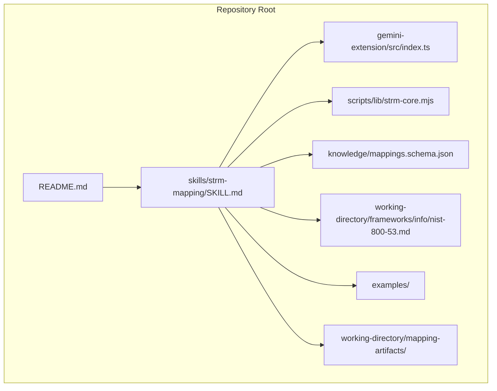
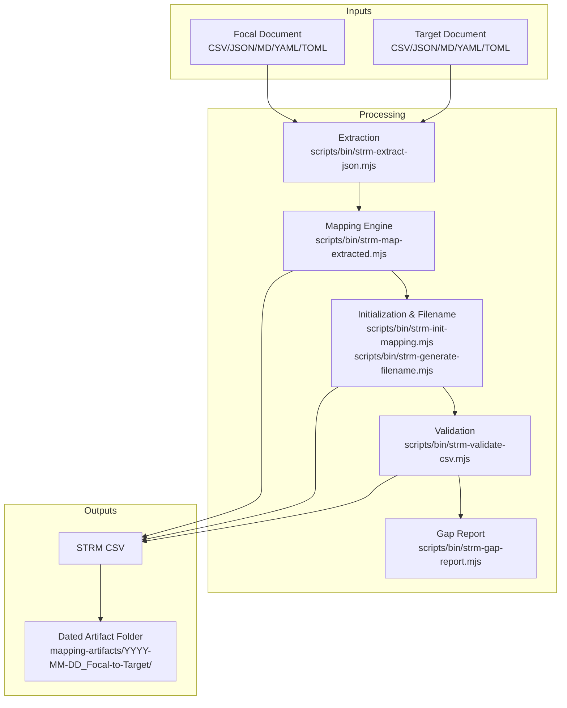
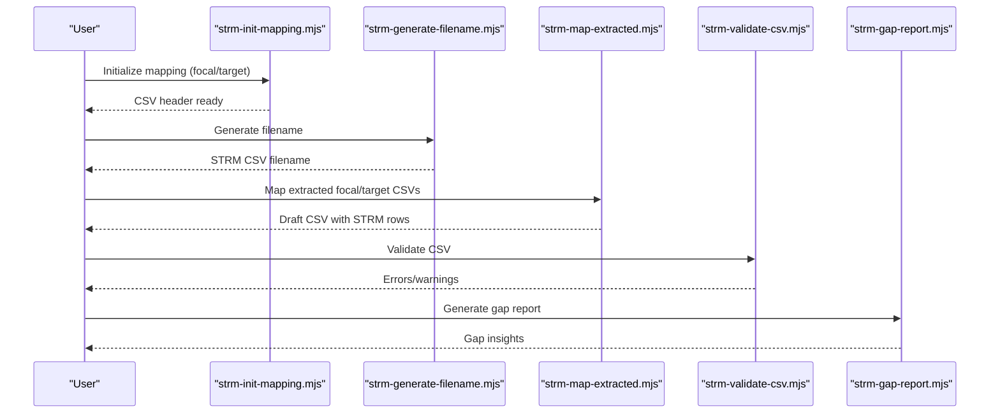
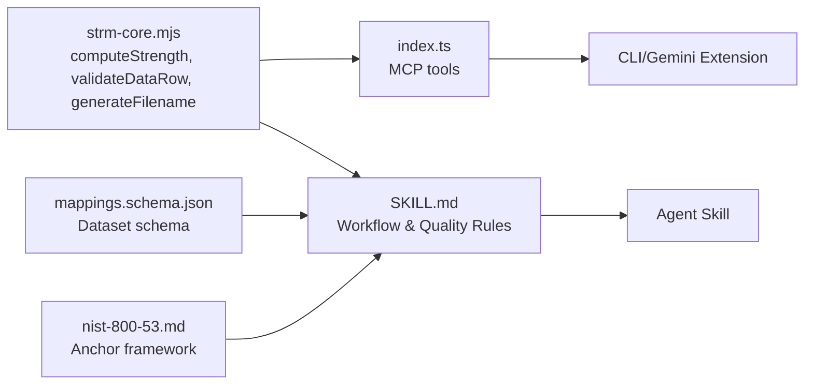

# Mapping Types and Practical Examples

<cite>
**Referenced Files in This Document**
- [README.md](file://README.md)
- [SKILL.md](file://skills/strm-mapping/SKILL.md)
- [strm-core.mjs](file://scripts/lib/strm-core.mjs)
- [index.ts](file://gemini-extension/src/index.ts)
- [mappings.schema.json](file://knowledge/mappings.schema.json)
- [nist-800-53.md](file://working-directory/frameworks/info/nist-800-53.md)
- [example-framework-to-control.md](file://examples/example-framework-to-control.md)
- [example-framework-to-policy.md](file://examples/example-framework-to-policy.md)
- [example-framework-to-regulation.md](file://examples/example-framework-to-regulation.md)
- [example-framework-to-risk.md](file://examples/example-framework-to-risk.md)
- [example-regulation-to-control.md](file://examples/example-regulation-to-control.md)
- [example-control-to-control.md](file://examples/example-control-to-control.md)
- [example-control-to-evidence.md](file://examples/example-control-to-evidence.md)
</cite>

## Table of Contents
1. [Introduction](#introduction)
2. [Project Structure](#project-structure)
3. [Core Components](#core-components)
4. [Architecture Overview](#architecture-overview)
5. [Detailed Component Analysis](#detailed-component-analysis)
6. [Dependency Analysis](#dependency-analysis)
7. [Performance Considerations](#performance-considerations)
8. [Troubleshooting Guide](#troubleshooting-guide)
9. [Conclusion](#conclusion)
10. [Appendices](#appendices)

## Introduction
This document presents comprehensive guidance for STRM (Set-Theory Relationship Mapping) toolkit use cases and implementation patterns across multiple mapping types. It consolidates supported mapping categories, step-by-step workflows, input preparation, execution, and output interpretation. Real-world examples from the repository’s examples directory illustrate practical applications across industries and compliance domains. Guidance is included for batch processing, automation, integration with GRC systems, selecting appropriate mapping strategies, and interpreting STRM results for decision-making.

## Project Structure
The STRM toolkit organizes mapping assets and examples to support reproducible, auditable, and shareable cross-framework mappings. Key locations:
- skills/strm-mapping/SKILL.md: Agent skill definition and end-to-end workflow
- scripts/lib/strm-core.mjs: Core STRM computation, validation, and file utilities
- gemini-extension/src/index.ts: Deterministic tools for strength calculation, filename generation, CSV header construction, row validation, and discovery
- knowledge/mappings.schema.json: JSON schema for mapping datasets
- working-directory/frameworks/info/nist-800-53.md: Anchor framework reference for cross-framework mapping
- examples/: Well-formed, real-world examples for each mapping type
- working-directory/mapping-artifacts/: Dated, structured output folders for completed mappings

**Diagram sources**
- [README.md:1-30](file://README.md#L1-L30)
- [SKILL.md:1-442](file://skills/strm-mapping/SKILL.md#L1-L442)
- [index.ts:1-522](file://gemini-extension/src/index.ts#L1-L522)
- [strm-core.mjs:1-343](file://scripts/lib/strm-core.mjs#L1-L343)
- [mappings.schema.json:1-117](file://knowledge/mappings.schema.json#L1-L117)
- [nist-800-53.md:1-354](file://working-directory/frameworks/info/nist-800-53.md#L1-L354)
- [example-framework-to-control.md:1-159](file://examples/example-framework-to-control.md#L1-L159)
- [example-framework-to-policy.md:1-173](file://examples/example-framework-to-policy.md#L1-L173)
- [example-framework-to-regulation.md:1-163](file://examples/example-framework-to-regulation.md#L1-L163)
- [example-framework-to-risk.md:1-179](file://examples/example-framework-to-risk.md#L1-L179)
- [example-regulation-to-control.md:1-172](file://examples/example-regulation-to-control.md#L1-L172)
- [example-control-to-control.md:1-162](file://examples/example-control-to-control.md#L1-L162)
- [example-control-to-evidence.md:1-199](file://examples/example-control-to-evidence.md#L1-L199)

**Section sources**
- [README.md:1-30](file://README.md#L1-L30)
- [SKILL.md:26-76](file://skills/strm-mapping/SKILL.md#L26-L76)

## Core Components
This section outlines the core STRM components and their roles in producing robust, repeatable mappings.

- STRM scoring engine
  - Computes the “Strength of Relationship” score from relationship type, confidence, and rationale type using a fixed formula with clamping to 1–10.
  - Supports five relationships: equal, subset_of, superset_of, intersects_with, not_related.
  - Confidence levels: high, medium, low.
  - Rationale types: semantic, functional, syntactic.

- CSV template and validation
  - Canonical header row with 12 columns, including FDE# and Target ID # placeholders to be filled with actual control identifiers.
  - Validation enforces required fields, acceptable values, and strength-score consistency.

- Filename generation
  - Produces standardized filenames encoding focal, bridge, and target frameworks for traceability and deduplication.

- Discovery and reuse
  - Lists available input files and checks for existing mappings to avoid duplication and maintain consistency.

- JSON schema for mappings
  - Defines dataset structure for mappings, including optional framework-specific parameters and set-theory relationships aligned with NIST IR 8477.

**Section sources**
- [strm-core.mjs:1-343](file://scripts/lib/strm-core.mjs#L1-L343)
- [index.ts:27-58](file://gemini-extension/src/index.ts#L27-L58)
- [index.ts:94-106](file://gemini-extension/src/index.ts#L94-L106)
- [index.ts:118-193](file://gemini-extension/src/index.ts#L118-L193)
- [index.ts:308-339](file://gemini-extension/src/index.ts#L308-L339)
- [index.ts:434-472](file://gemini-extension/src/index.ts#L434-L472)
- [index.ts:474-514](file://gemini-extension/src/index.ts#L474-L514)
- [mappings.schema.json:1-117](file://knowledge/mappings.schema.json#L1-L117)

## Architecture Overview
The STRM toolkit provides deterministic, repeatable workflows across mapping types. The architecture centers on:
- Inputs: Framework catalogs, policies, regulations, or risk registers (CSV, JSON, MD, YAML, TOML)
- Processing: Extraction, mapping row generation, strength computation, and validation
- Outputs: Standardized CSV with STRM relationships and strength scores, plus dated artifacts

**Diagram sources**
- [SKILL.md:94-107](file://skills/strm-mapping/SKILL.md#L94-L107)
- [SKILL.md:100-107](file://skills/strm-mapping/SKILL.md#L100-L107)
- [strm-core.mjs:67-79](file://scripts/lib/strm-core.mjs#L67-L79)
- [strm-core.mjs:206-265](file://scripts/lib/strm-core.mjs#L206-L265)

## Detailed Component Analysis

### Framework-to-Control Mapping
- Purpose: Map a comprehensive control catalog (focal) to an implementation-focused control set (target).
- Typical outcomes: Many subset_of relationships because catalogs exceed implementation scope.
- Example: NIST SP 800-53 Rev 5 to CIS Controls v8.1.
- Execution workflow:
  - Prepare focal catalog (e.g., NIST SP 800-53) and target control set (e.g., CIS Controls).
  - Extract control lists if needed.
  - Generate mapping rows with STRM Relationship and Strength of Relationship.
  - Validate and compute gap report.
- Interpretation tips:
  - Use Notes to flag control enhancements without target equivalents.
  - Note Implementation Group levels when applicable.

**Diagram sources**
- [SKILL.md:94-107](file://skills/strm-mapping/SKILL.md#L94-L107)
- [example-framework-to-control.md:1-159](file://examples/example-framework-to-control.md#L1-L159)

**Section sources**
- [example-framework-to-control.md:1-159](file://examples/example-framework-to-control.md#L1-L159)
- [nist-800-53.md:320-334](file://working-directory/frameworks/info/nist-800-53.md#L320-L334)

### Framework-to-Policy Mapping
- Purpose: Assess governance coverage by mapping framework safeguards to organizational policies.
- Typical outcomes: Many superset_of and intersects_with relationships; expect many not_related rows indicating policy gaps.
- Example: CIS Controls v8.1 to an organization’s policy suite.
- Execution workflow:
  - Identify policy documents and their sections.
  - Map each safeguard to relevant policy sections.
  - Use Notes to track cross-mappings and cadence mismatches.
- Interpretation tips:
  - Use Target ID # to reference policy document IDs for GRC linkage.
  - Track many-to-one mappings in Notes.

**Section sources**
- [example-framework-to-policy.md:1-173](file://examples/example-framework-to-policy.md#L1-L173)

### Framework-to-Regulation Mapping
- Purpose: Demonstrate how technical controls satisfy legal obligations.
- Typical outcomes: Often subset_of because regulations impose additional obligations (timelines, content, rights).
- Example: NIST SP 800-53 Rev 5 to GDPR.
- Execution workflow:
  - Align control families to regulation articles.
  - Flag conflicts explicitly (e.g., audit retention vs. right to erasure).
- Interpretation tips:
  - Document unmapped GDPR obligations requiring supplementary controls.
  - Use Notes to reference regulatory recitals and data subject rights.

**Section sources**
- [example-framework-to-regulation.md:1-163](file://examples/example-framework-to-regulation.md#L1-L163)

### Framework-to-Risk Mapping
- Purpose: Demonstrate how framework subcategories mitigate named, quantified risk scenarios.
- Typical outcomes: intersects_with dominates; not_related indicates residual risk gaps.
- Example: NIST CSF 2.0 to an ISO 31000-format risk register.
- Execution workflow:
  - Map CSF subcategories to risk scenarios.
  - Include likelihood/impact/residual risk ratings in Notes.
- Interpretation tips:
  - Use folder naming convention to align with GRC identifiers.
  - Treat not_related mappings as residual risks requiring treatment.

**Section sources**
- [example-framework-to-risk.md:1-179](file://examples/example-framework-to-risk.md#L1-L179)

### Regulation-to-Control Mapping
- Purpose: Show how regulatory requirements are satisfied by control implementations.
- Typical outcomes: Equal, subset_of, superset_of; distinguish Required vs. Addressable designations.
- Example: HIPAA Security Rule to ISO/IEC 27001:2022 Annex A.
- Execution workflow:
  - Distinguish Required vs. Addressable specifications.
  - Map implementation specifications to corresponding ISO controls.
- Interpretation tips:
  - Document six-year retention requirements on required rows.
  - Reference OCR audit protocols in Notes.

**Section sources**
- [example-regulation-to-control.md:1-172](file://examples/example-regulation-to-control.md#L1-L172)

### Control-to-Control Mapping
- Purpose: Crosswalk peer frameworks (both output auditable controls).
- Typical outcomes: High evidence reuse; equal and subset_of relationships are common.
- Example: ISO/IEC 27001:2022 Annex A to SOC 2 Trust Service Criteria.
- Execution workflow:
  - Map individual controls between frameworks.
  - Translate outcome-based obligations into observable states for TSC evaluation.
- Interpretation tips:
  - Identify Trust Service Categories in scope.
  - Document cross-control reuse to reduce audit burden.

**Section sources**
- [example-control-to-control.md:1-162](file://examples/example-control-to-control.md#L1-L162)

### Control-to-Evidence Mapping
- Purpose: Link controls to production evidence artifacts to identify gaps and reuse opportunities.
- Typical outcomes: equal, subset_of, superset_of, intersects_with, not_related.
- Example: ISO/IEC 27001:2022 Annex A to an organization’s evidence catalog.
- Execution workflow:
  - Build an evidence catalog schema with ID, Title, Type, Owner, Version/Date, Review Cycle, Format, Location, Controls Satisfied.
  - Map each control to one or more artifacts; annotate Notes with supplementary artifacts where needed.
- Interpretation tips:
  - Ensure versioning and coverage periods are explicit.
  - Treat not_related rows as incorrect automated mappings and retain for audit trail.

**Section sources**
- [example-control-to-evidence.md:1-199](file://examples/example-control-to-evidence.md#L1-L199)

## Dependency Analysis
The STRM toolkit relies on deterministic utilities and schemas to ensure consistency and verifiability across mapping types.

**Diagram sources**
- [strm-core.mjs:35-57](file://scripts/lib/strm-core.mjs#L35-L57)
- [strm-core.mjs:206-265](file://scripts/lib/strm-core.mjs#L206-L265)
- [strm-core.mjs:67-79](file://scripts/lib/strm-core.mjs#L67-L79)
- [index.ts:268-306](file://gemini-extension/src/index.ts#L268-L306)
- [index.ts:375-432](file://gemini-extension/src/index.ts#L375-L432)
- [index.ts:308-339](file://gemini-extension/src/index.ts#L308-L339)
- [SKILL.md:94-107](file://skills/strm-mapping/SKILL.md#L94-L107)
- [mappings.schema.json:1-117](file://knowledge/mappings.schema.json#L1-L117)
- [nist-800-53.md:320-334](file://working-directory/frameworks/info/nist-800-53.md#L320-L334)

**Section sources**
- [strm-core.mjs:1-343](file://scripts/lib/strm-core.mjs#L1-L343)
- [index.ts:1-522](file://gemini-extension/src/index.ts#L1-L522)
- [SKILL.md:1-442](file://skills/strm-mapping/SKILL.md#L1-L442)
- [mappings.schema.json:1-117](file://knowledge/mappings.schema.json#L1-L117)
- [nist-800-53.md:1-354](file://working-directory/frameworks/info/nist-800-53.md#L1-L354)

## Performance Considerations
- Batch processing workflows
  - Use scripts/bin/strm-list-input-files.mjs to enumerate inputs and streamline discovery.
  - Employ scripts/bin/strm-check-existing-mapping.mjs to avoid redundant work.
- Automation opportunities
  - Integrate MCP tools into CI/CD pipelines for automated strength computation, filename generation, and CSV validation.
  - Automate extraction of JSON catalogs using scripts/bin/strm-extract-json.mjs.
- Scalability
  - Normalize control identifiers and leverage Notes to capture scope differences, reducing manual reconciliation.
  - Maintain dated artifact folders to support incremental updates and historical traceability.

[No sources needed since this section provides general guidance]

## Troubleshooting Guide
Common issues and resolutions:
- Invalid STRM Relationship, Confidence Levels, or NIST IR-8477 Rational values
  - Ensure values conform to allowed sets; otherwise, validation will fail.
- Strength of Relationship mismatch
  - Recompute using the STRM scoring formula; ensure base + confidence_adj + rationale_adj equals the reported score.
- Empty required fields
  - FDE# and Target ID # must not be empty; STRM Rationale must be provided.
- not_related without context
  - Add Notes explaining why there is zero overlap.
- Syntactic rationale usage
  - Syntactic is rare; verify intent and wording similarity is the primary justification.
- Low confidence usage
  - Use only when significant inference is required; justify in Notes.

Quality rules and self-checks:
- Relationship distribution self-check: Review equal vs. subset_of/superset_of ratios; adjust where necessary.
- Manual QA is mandatory before validation and completion.
- Run validation and gap report after manual QA only.

**Section sources**
- [strm-core.mjs:206-265](file://scripts/lib/strm-core.mjs#L206-L265)
- [index.ts:118-193](file://gemini-extension/src/index.ts#L118-L193)
- [SKILL.md:304-320](file://skills/strm-mapping/SKILL.md#L304-L320)

## Conclusion
The STRM toolkit enables rigorous, repeatable cross-framework mappings across diverse domains. By adhering to the standardized workflows, quality rules, and output conventions outlined here—and leveraging the repository’s examples—you can confidently produce actionable mapping results for audits, risk reporting, and compliance decision-making. Select mapping types based on your goals: control-to-evidence for audit readiness, framework-to-risk for residual risk demonstration, and framework-to-framework for broad alignment and evidence reuse.

[No sources needed since this section summarizes without analyzing specific files]

## Appendices

### Mapping Types and Practical Examples Index
- Framework-to-Control: NIST SP 800-53 Rev 5 → CIS Controls v8.1
- Framework-to-Policy: CIS Controls v8.1 → Organizational Policy Suite
- Framework-to-Regulation: NIST SP 800-53 Rev 5 → GDPR
- Framework-to-Risk: NIST CSF 2.0 → Organizational Risk Register
- Regulation-to-Control: HIPAA Security Rule → ISO/IEC 27001:2022 Annex A
- Control-to-Control: ISO/IEC 27001:2022 → SOC 2 TSC
- Control-to-Evidence: ISO/IEC 27001:2022 → Audit Evidence Catalog

**Section sources**
- [example-framework-to-control.md:1-159](file://examples/example-framework-to-control.md#L1-L159)
- [example-framework-to-policy.md:1-173](file://examples/example-framework-to-policy.md#L1-L173)
- [example-framework-to-regulation.md:1-163](file://examples/example-framework-to-regulation.md#L1-L163)
- [example-framework-to-risk.md:1-179](file://examples/example-framework-to-risk.md#L1-L179)
- [example-regulation-to-control.md:1-172](file://examples/example-regulation-to-control.md#L1-L172)
- [example-control-to-control.md:1-162](file://examples/example-control-to-control.md#L1-L162)
- [example-control-to-evidence.md:1-199](file://examples/example-control-to-evidence.md#L1-L199)