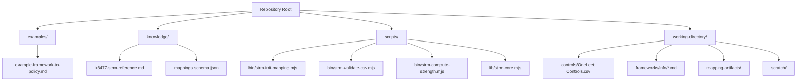
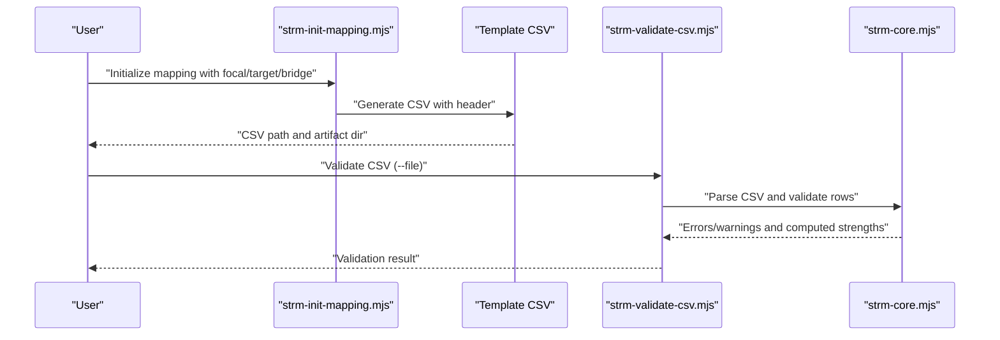
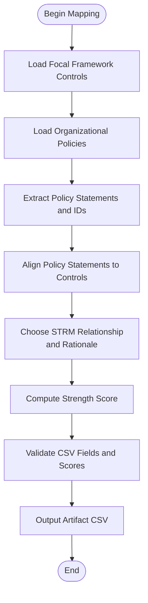
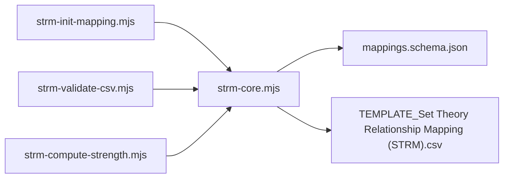

# Policy-to-Framework Mappings

<cite>
**Referenced Files in This Document**
- [README.md](file://README.md)
- [example-framework-to-policy.md](file://examples/example-framework-to-policy.md)
- [ir8477-strm-reference.md](file://knowledge/ir8477-strm-reference.md)
- [mappings.schema.json](file://knowledge/mappings.schema.json)
- [strm-core.mjs](file://scripts/lib/strm-core.mjs)
- [strm-init-mapping.mjs](file://scripts/bin/strm-init-mapping.mjs)
- [strm-validate-csv.mjs](file://scripts/bin/strm-validate-csv.mjs)
- [strm-compute-strength.mjs](file://scripts/bin/strm-compute-strength.mjs)
- [nist-800-53.md](file://working-directory/frameworks/info/nist-800-53.md)
- [iso-27001-27002.md](file://working-directory/frameworks/info/iso-27001-27002.md)
- [OneLeet Controls.csv](file://working-directory/controls/OneLeet Controls.csv)
- [TEMPLATE_Set Theory Relationship Mapping (STRM).csv](file://TEMPLATE_Set Theory Relationship Mapping (STRM).csv)
</cite>

## Table of Contents
1. [Introduction](#introduction)
2. [Project Structure](#project-structure)
3. [Core Components](#core-components)
4. [Architecture Overview](#architecture-overview)
5. [Detailed Component Analysis](#detailed-component-analysis)
6. [Dependency Analysis](#dependency-analysis)
7. [Performance Considerations](#performance-considerations)
8. [Troubleshooting Guide](#troubleshooting-guide)
9. [Conclusion](#conclusion)
10. [Appendices](#appendices)

## Introduction
This document explains how to align organizational policies, procedures, and guidelines to cybersecurity frameworks and standards using the STRM methodology. It focuses on mapping organizational policy suites to framework controls and control implementations, and provides a repeatable process for policy extraction, requirement identification, linkage establishment, and validation. It also covers policy interpretation, policy-to-policy relationships, implementation gaps, conflict resolution, evolution, enforcement, governance, communication, and effectiveness measurement. Practical examples illustrate mapping enterprise security policies, risk management policies, and operational procedures to specific framework controls.

## Project Structure
The repository provides:
- A toolkit for producing Set-Theory Relationship Mapping (STRM) outputs between frameworks, controls, and regulations
- Example crosswalks and templates for policy-to-framework mapping
- Scripts and utilities to initialize mappings, compute strength scores, and validate CSV outputs
- Human-readable framework references and control catalogs

**Diagram sources**
- [README.md:1-30](file://README.md#L1-L30)
- [example-framework-to-policy.md:1-173](file://examples/example-framework-to-policy.md#L1-L173)
- [ir8477-strm-reference.md:1-119](file://knowledge/ir8477-strm-reference.md#L1-L119)
- [mappings.schema.json:1-117](file://knowledge/mappings.schema.json#L1-L117)
- [strm-core.mjs:1-343](file://scripts/lib/strm-core.mjs#L1-L343)
- [strm-init-mapping.mjs:1-58](file://scripts/bin/strm-init-mapping.mjs#L1-L58)
- [strm-validate-csv.mjs:1-146](file://scripts/bin/strm-validate-csv.mjs#L1-L146)
- [strm-compute-strength.mjs:1-20](file://scripts/bin/strm-compute-strength.mjs#L1-L20)
- [nist-800-53.md:1-200](file://working-directory/frameworks/info/nist-800-53.md#L1-L200)
- [iso-27001-27002.md:1-200](file://working-directory/frameworks/info/iso-27001-27002.md#L1-L200)
- [OneLeet Controls.csv:1-121](file://working-directory/controls/OneLeet Controls.csv#L1-L121)

**Section sources**
- [README.md:1-30](file://README.md#L1-L30)

## Core Components
- STRM methodology: Formal set-theory relationships (equal, subset_of, superset_of, intersects_with, not_related) with rationale types (syntactic, semantic, functional) and confidence levels (high, medium, low). See [ir8477-strm-reference.md:16-56](file://knowledge/ir8477-strm-reference.md#L16-L56).
- Mapping schema: Defines canonical fields and validation rules for mapping datasets. See [mappings.schema.json:47-115](file://knowledge/mappings.schema.json#L47-L115).
- CSV template and header: The template defines the STRM CSV structure used for policy-to-framework mapping. See [TEMPLATE_Set Theory Relationship Mapping (STRM).csv](file://TEMPLATE_Set Theory Relationship Mapping (STRM).csv).
- Utilities:
  - Initialize mapping: Generates a CSV with the correct header and artifact directory. See [strm-init-mapping.mjs:36-43](file://scripts/bin/strm-init-mapping.mjs#L36-L43).
  - Compute strength: Scores mappings based on relationship, confidence, and rationale. See [strm-compute-strength.mjs:18](file://scripts/bin/strm-compute-strength.mjs#L18).
  - Validate CSV: Checks required columns, values, duplicates, and optional coverage against focal controls. See [strm-validate-csv.mjs:69-128](file://scripts/bin/strm-validate-csv.mjs#L69-L128).
  - Core helpers: Relationship constants, strength computation, CSV parsing/writing, and filename sanitization. See [strm-core.mjs:4-79](file://scripts/lib/strm-core.mjs#L4-L79).

**Section sources**
- [ir8477-strm-reference.md:16-56](file://knowledge/ir8477-strm-reference.md#L16-L56)
- [mappings.schema.json:47-115](file://knowledge/mappings.schema.json#L47-L115)
- [TEMPLATE_Set Theory Relationship Mapping (STRM).csv](file://TEMPLATE_Set Theory Relationship Mapping (STRM).csv)
- [strm-init-mapping.mjs:36-43](file://scripts/bin/strm-init-mapping.mjs#L36-L43)
- [strm-compute-strength.mjs:18](file://scripts/bin/strm-compute-strength.mjs#L18)
- [strm-validate-csv.mjs:69-128](file://scripts/bin/strm-validate-csv.mjs#L69-L128)
- [strm-core.mjs:4-79](file://scripts/lib/strm-core.mjs#L4-L79)

## Architecture Overview
The STRM pipeline for policy-to-framework mapping consists of:
- Input: Focal framework controls (e.g., NIST 800-53), target policy suite, and optional bridge framework
- Extraction: Extract policy statements and IDs from organizational sources
- Mapping: Align policy statements to framework controls using STRM relationships and rationale
- Validation: Enforce CSV structure, required fields, and strength scoring
- Output: Artifact directory with CSV and summary files

**Diagram sources**
- [strm-init-mapping.mjs:36-43](file://scripts/bin/strm-init-mapping.mjs#L36-L43)
- [strm-validate-csv.mjs:69-128](file://scripts/bin/strm-validate-csv.mjs#L69-L128)
- [strm-core.mjs:99-204](file://scripts/lib/strm-core.mjs#L99-L204)

## Detailed Component Analysis

### Methodology: Policy Extraction and Interpretation
- Policy extraction:
  - Identify discrete policy documents (e.g., Acceptable Use, Access Control, Incident Response, Vulnerability Management, Data Classification, Business Continuity)
  - Extract policy sections and statements that relate to security controls
  - Assign stable, consistent policy IDs (e.g., AUP-4.2, ACP-3.1, IRP-5.1, VMP-6.2, DCP-2.1)
- Policy interpretation:
  - Compare policy statements to framework control language
  - Determine rationale type:
    - Syntactic: Similar wording/phrasing
    - Semantic: Same intent/objective despite wording differences
    - Functional: Achieve the same outcome via different mechanisms
  - Assign confidence level (high/medium/low) based on evidence strength
- Example mapping demonstrates:
  - Equal: AUP-4.2 maps to a control requiring licensed software inventory
  - Subset_of: Access Control Policy section 3.1 is narrower than a control requiring dedicated administrator accounts
  - Superset_of: Incident Response Policy section 5.1 includes severity-level contact matrices and timeframes beyond a control requiring contact lists
  - Intersects_with: Vulnerability Management Policy’s CVSS-based remediation timelines partially align with a control requiring monthly patching
  - Not_related: Data Classification Policy’s asset classification does not overlap with network architecture requirements

**Section sources**
- [example-framework-to-policy.md:50-142](file://examples/example-framework-to-policy.md#L50-L142)
- [ir8477-strm-reference.md:26-43](file://knowledge/ir8477-strm-reference.md#L26-L43)

### Mapping Framework Requirements to Policies
- Use the focal framework reference to enumerate controls and enhancements (e.g., NIST 800-53 families and moderate baseline controls)
- For each control, identify:
  - Control ID and statement
  - Enhancements and organization-defined parameters
  - Related controls and cross-references
- Map policy statements to the closest control(s) using STRM relationships and rationale
- Document notes for gaps, conflicts, and cross-mappings

**Diagram sources**
- [nist-800-53.md:109-176](file://working-directory/frameworks/info/nist-800-53.md#L109-L176)
- [iso-27001-27002.md:101-200](file://working-directory/frameworks/info/iso-27001-27002.md#L101-L200)
- [strm-validate-csv.mjs:69-128](file://scripts/bin/strm-validate-csv.mjs#L69-L128)
- [strm-compute-strength.mjs:18](file://scripts/bin/strm-compute-strength.mjs#L18)

### Policy-to-Control Linkage Establishment
- Establish many-to-one relationships when a single policy section supports multiple controls
- Track cross-mappings in notes (e.g., MFA requirements in access control supporting multiple controls)
- Flag gaps when no mapping exists or when relationship is not_related

**Section sources**
- [example-framework-to-policy.md:157-173](file://examples/example-framework-to-policy.md#L157-L173)

### Policy Interpretation and Policy-to-Policy Relationships
- Interpret policy statements to identify overlaps and distinctions
- Manage policy-to-policy relationships:
  - Superset_of: A policy section covers more than a control
  - Subset_of: A policy section is narrower than a control
  - Intersects_with: Partial alignment with divergence in scope
  - Not_related: No meaningful overlap
- Use notes to document exceptions, cadence mismatches, and compensating controls

**Section sources**
- [example-framework-to-policy.md:50-142](file://examples/example-framework-to-policy.md#L50-L142)

### Handling Policy Conflicts, Evolution, and Enforcement
- Conflicts:
  - Document discrepancies (e.g., review cadence differences)
  - Escalate to policy owners; update policy exception registers
- Evolution:
  - Maintain versioned policies with dated histories
  - Re-map after policy changes; reconcile with framework updates
- Enforcement:
  - Tie policy IDs to GRC platform references for automated evidence linking
  - Use access control matrices, incident notification matrices, and remediation timetables as enforcement mechanisms

**Section sources**
- [example-framework-to-policy.md:167-173](file://examples/example-framework-to-policy.md#L167-L173)

### Best Practices for Policy Governance, Communication, and Effectiveness Measurement
- Governance:
  - Assign policy owners and reviewers
  - Maintain policy lifecycle (creation, review, revision, retirement)
- Communication:
  - Publish policies centrally and ensure accessibility
  - Provide role-specific training and acknowledgments
- Effectiveness measurement:
  - Track policy coverage via STRM mapping results
  - Measure cadence compliance and exception trends
  - Use mapping gaps to guide targeted improvements

[No sources needed since this section provides general guidance]

### Practical Examples: Policy Mapping Scenarios
- Enterprise security policies:
  - Acceptable Use Policy to software inventory control
  - Access Control Policy to administrator account control
  - Incident Response Policy to incident contact control
- Risk management policies:
  - Vulnerability Management Policy to remediation timelines
- Operational procedures:
  - Data Classification Policy to asset handling
  - Network architecture to segmentation (note: separate mapping domain)

**Section sources**
- [example-framework-to-policy.md:50-142](file://examples/example-framework-to-policy.md#L50-L142)

## Dependency Analysis
The STRM toolkit comprises:
- CLI utilities depend on core library functions
- CSV validation depends on core parsing and validation logic
- Mapping schema constrains dataset structure and relationships

**Diagram sources**
- [strm-init-mapping.mjs:36-43](file://scripts/bin/strm-init-mapping.mjs#L36-L43)
- [strm-validate-csv.mjs:69-128](file://scripts/bin/strm-validate-csv.mjs#L69-L128)
- [strm-compute-strength.mjs:18](file://scripts/bin/strm-compute-strength.mjs#L18)
- [strm-core.mjs:99-204](file://scripts/lib/strm-core.mjs#L99-L204)
- [mappings.schema.json:47-115](file://knowledge/mappings.schema.json#L47-L115)
- [TEMPLATE_Set Theory Relationship Mapping (STRM).csv](file://TEMPLATE_Set Theory Relationship Mapping (STRM).csv)

**Section sources**
- [strm-core.mjs:4-79](file://scripts/lib/strm-core.mjs#L4-L79)

## Performance Considerations
- CSV parsing and validation scale linearly with number of mapped rows
- Use the validator’s coverage mode to ensure complete focal control coverage
- Keep policy IDs consistent to improve cross-referencing and reduce ambiguity

[No sources needed since this section provides general guidance]

## Troubleshooting Guide
- Missing required columns:
  - Ensure header contains required fields (e.g., STRM Relationship, Confidence Levels, NIST IR-8477 Rational, STRM Rationale, Strength of Relationship, Target ID #)
- Strength mismatch:
  - Recompute strength using the strength calculator to verify expected score
- Duplicate mappings:
  - Resolve duplicate FDE-to-target pairs
- Coverage gaps:
  - Use strict coverage mode to flag unmapped focal controls
- Low confidence or syntactic rationale:
  - Reassess evidence and intent; prefer semantic or functional rationale when appropriate

**Section sources**
- [strm-validate-csv.mjs:69-128](file://scripts/bin/strm-validate-csv.mjs#L69-L128)
- [strm-compute-strength.mjs:18](file://scripts/bin/strm-compute-strength.mjs#L18)

## Conclusion
Policy-to-framework mapping using STRM provides a rigorous, repeatable approach to align organizational policies with cybersecurity frameworks. By extracting policy statements, interpreting requirements, establishing precise set-theory relationships, and validating outputs, organizations can identify gaps, manage conflicts, and continuously evolve policies to meet evolving threats and regulatory demands. The included scripts and templates streamline the process and ensure consistency across mapping efforts.

[No sources needed since this section summarizes without analyzing specific files]

## Appendices

### Appendix A: STRM Relationship Types and Strength Scoring
- Relationship types: equal, subset_of, superset_of, intersects_with, not_related
- Rationale types: syntactic, semantic, functional
- Confidence levels: high, medium, low
- Strength score calculation: base score adjusted by confidence and rationale, clamped to 1–10

**Section sources**
- [ir8477-strm-reference.md:16-56](file://knowledge/ir8477-strm-reference.md#L16-L56)
- [strm-core.mjs:35-57](file://scripts/lib/strm-core.mjs#L35-L57)

### Appendix B: Example Mapping Artifacts and Framework References
- Example policy-to-policy mapping: [example-framework-to-policy.md:1-173](file://examples/example-framework-to-policy.md#L1-L173)
- NIST 800-53 moderate baseline controls: [nist-800-53.md:109-176](file://working-directory/frameworks/info/nist-800-53.md#L109-L176)
- ISO 27001/27002 control themes: [iso-27001-27002.md:101-200](file://working-directory/frameworks/info/iso-27001-27002.md#L101-L200)
- OneLeet control catalog: [OneLeet Controls.csv:1-121](file://working-directory/controls/OneLeet Controls.csv#L1-L121)