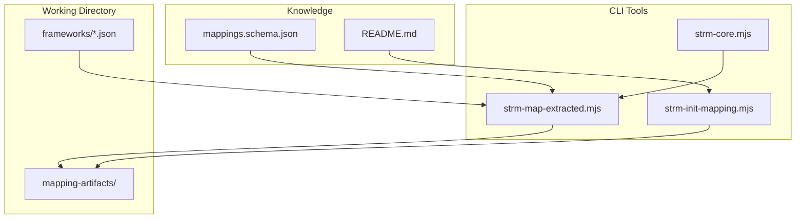
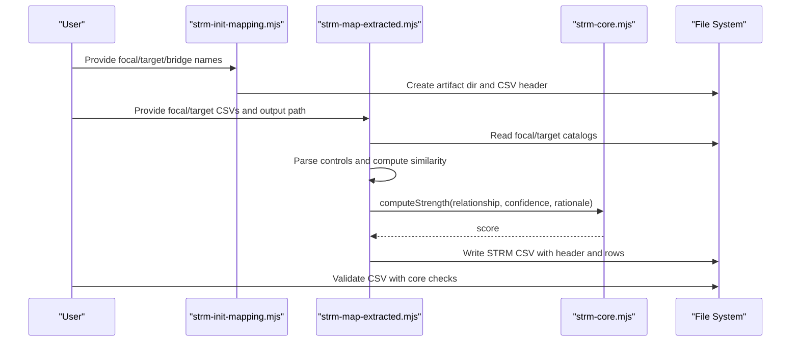
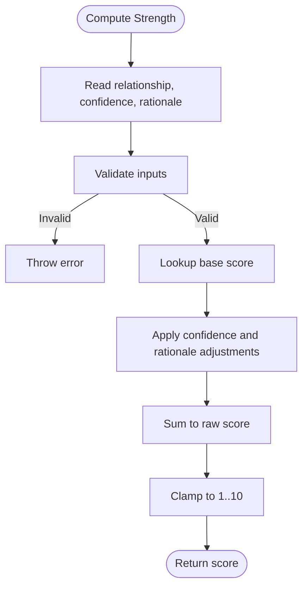
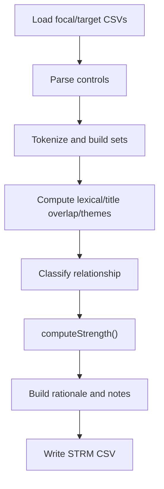
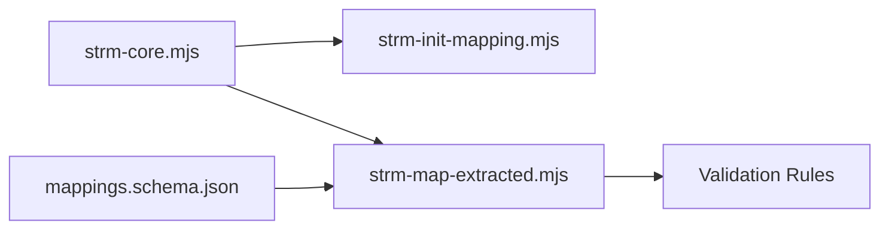

# Regulation-to-Control Mappings

<cite>
**Referenced Files in This Document**
- [README.md](file://README.md)
- [example-regulation-to-control.md](file://examples/example-regulation-to-control.md)
- [mappings.schema.json](file://knowledge/mappings.schema.json)
- [strm-core.mjs](file://scripts/lib/strm-core.mjs)
- [strm-init-mapping.mjs](file://scripts/bin/strm-init-mapping.mjs)
- [strm-map-extracted.mjs](file://scripts/bin/strm-map-extracted.mjs)
- [gdpr.json](file://working-directory/frameworks/gdpr.json)
- [hipaa.json](file://working-directory/frameworks/hipaa.json)
- [pci-dss-4.json](file://working-directory/frameworks/pci-dss-4.json)
- [sox.json](file://working-directory/frameworks/sox.json)
- [nydfs.json](file://working-directory/frameworks/nydfs.json)
</cite>

## Table of Contents
1. [Introduction](#introduction)
2. [Project Structure](#project-structure)
3. [Core Components](#core-components)
4. [Architecture Overview](#architecture-overview)
5. [Detailed Component Analysis](#detailed-component-analysis)
6. [Dependency Analysis](#dependency-analysis)
7. [Performance Considerations](#performance-considerations)
8. [Troubleshooting Guide](#troubleshooting-guide)
9. [Conclusion](#conclusion)
10. [Appendices](#appendices)

## Introduction
This document explains how to develop and validate Regulation-to-Control Mappings using the STRM Mapping toolkit. It focuses on regulatory compliance alignment and regulatory-driven control identification, detailing methodologies for mapping regulatory requirements to control catalogs, interpreting regulatory obligations, and linking them to corresponding controls. It also provides practical guidance for handling interpretation challenges, granularity, evidence requirements, conflicts, jurisdictional variations, updates, and change management.

## Project Structure
The repository provides:
- A CLI toolkit for initializing mappings, scoring relationships, and validating outputs
- Example artifacts and schemas for mapping datasets
- Extracted control catalogs for major regulations and frameworks
- Scripts to automate mapping workflows

**Diagram sources**
- [strm-init-mapping.mjs:1-58](file://scripts/bin/strm-init-mapping.mjs#L1-L58)
- [strm-map-extracted.mjs:1-306](file://scripts/bin/strm-map-extracted.mjs#L1-L306)
- [strm-core.mjs:1-367](file://scripts/lib/strm-core.mjs#L1-L367)
- [mappings.schema.json:1-117](file://knowledge/mappings.schema.json#L1-L117)
- [README.md:1-85](file://README.md#L1-L85)

**Section sources**
- [README.md:1-85](file://README.md#L1-L85)
- [strm-init-mapping.mjs:1-58](file://scripts/bin/strm-init-mapping.mjs#L1-L58)
- [strm-map-extracted.mjs:1-306](file://scripts/bin/strm-map-extracted.mjs#L1-L306)
- [strm-core.mjs:1-367](file://scripts/lib/strm-core.mjs#L1-L367)
- [mappings.schema.json:1-117](file://knowledge/mappings.schema.json#L1-L117)

## Core Components
- STRM scoring engine computes relationship strength from canonical relationships, confidence, and rationale type
- CLI initializer prepares a CSV template for mapping
- CLI mapper extracts controls from JSON catalogs, computes similarity, and writes STRM outputs
- Validation enforces header, relationship types, confidence levels, rationale types, and strength consistency

Key capabilities:
- Relationship types: equal, subset_of, superset_of, intersects_with, not_related
- Confidence levels: high, medium, low
- Rationale types: semantic, functional, syntactic
- Strength computation clamps to 1–10

**Section sources**
- [strm-core.mjs:14-57](file://scripts/lib/strm-core.mjs#L14-L57)
- [strm-init-mapping.mjs:36-43](file://scripts/bin/strm-init-mapping.mjs#L36-L43)
- [strm-map-extracted.mjs:142-160](file://scripts/bin/strm-map-extracted.mjs#L142-L160)
- [README.md:44-72](file://README.md#L44-L72)

## Architecture Overview
The mapping pipeline transforms extracted control catalogs into standardized STRM outputs with computed strengths and validation.

**Diagram sources**
- [strm-init-mapping.mjs:36-43](file://scripts/bin/strm-init-mapping.mjs#L36-L43)
- [strm-map-extracted.mjs:196-281](file://scripts/bin/strm-map-extracted.mjs#L196-L281)
- [strm-core.mjs:35-57](file://scripts/lib/strm-core.mjs#L35-L57)

## Detailed Component Analysis

### STRM Scoring Engine
- Computes base scores per canonical relationship
- Applies confidence and rationale adjustments
- Clamps final strength to 1–10

**Diagram sources**
- [strm-core.mjs:35-57](file://scripts/lib/strm-core.mjs#L35-L57)

**Section sources**
- [strm-core.mjs:14-57](file://scripts/lib/strm-core.mjs#L14-L57)

### CLI Initialization
- Generates a CSV filename and artifact directory
- Writes a standardized header row for STRM mapping

**Section sources**
- [strm-init-mapping.mjs:36-43](file://scripts/bin/strm-init-mapping.mjs#L36-L43)

### CLI Extraction and Mapping
- Parses control catalogs from CSV
- Tokenizes and computes Jaccard similarity, lexical overlap, and thematic overlap
- Classifies relationships using thresholds and modal conflict detection
- Builds rationale and notes, computes strength, and writes CSV

**Diagram sources**
- [strm-map-extracted.mjs:196-281](file://scripts/bin/strm-map-extracted.mjs#L196-L281)
- [strm-core.mjs:35-57](file://scripts/lib/strm-core.mjs#L35-L57)

**Section sources**
- [strm-map-extracted.mjs:126-160](file://scripts/bin/strm-map-extracted.mjs#L126-L160)
- [strm-map-extracted.mjs:162-194](file://scripts/bin/strm-map-extracted.mjs#L162-L194)
- [strm-map-extracted.mjs:225-279](file://scripts/bin/strm-map-extracted.mjs#L225-L279)

### Example: Regulation-to-Control Mapping (HIPAA → ISO 27001)
- Demonstrates required vs. addressable designations
- Shows equal, subset_of, superset_of, intersects_with, not_related
- Emphasizes documentation retention and audit readiness

**Section sources**
- [example-regulation-to-control.md:1-172](file://examples/example-regulation-to-control.md#L1-L172)

### Control Catalogs for Major Regulations
- GDPR: JSON catalog with article-level principles and rights
- HIPAA: JSON catalog with standards, implementation specifications, and administrative safeguards
- PCI DSS v4: JSON catalog with security control families and statements
- SOX: JSON catalog of sections and requirements
- NYDFS: JSON catalog of cybersecurity program requirements

These catalogs are parsed by the mapper to extract controls for mapping.

**Section sources**
- [gdpr.json:1-385](file://working-directory/frameworks/gdpr.json#L1-L385)
- [hipaa.json:1-800](file://working-directory/frameworks/hipaa.json#L1-L800)
- [pci-dss-4.json:1-772](file://working-directory/frameworks/pci-dss-4.json#L1-L772)
- [sox.json:1-800](file://working-directory/frameworks/sox.json#L1-L800)
- [nydfs.json:1-269](file://working-directory/frameworks/nydfs.json#L1-L269)

## Dependency Analysis
- CLI tools depend on the core scoring module
- Mapping script depends on CSV parsing and header normalization
- Validation depends on canonical relationship and schema definitions

**Diagram sources**
- [strm-core.mjs:1-367](file://scripts/lib/strm-core.mjs#L1-L367)
- [strm-init-mapping.mjs:1-58](file://scripts/bin/strm-init-mapping.mjs#L1-L58)
- [strm-map-extracted.mjs:1-306](file://scripts/bin/strm-map-extracted.mjs#L1-L306)
- [mappings.schema.json:1-117](file://knowledge/mappings.schema.json#L1-L117)

**Section sources**
- [strm-core.mjs:182-204](file://scripts/lib/strm-core.mjs#L182-L204)
- [strm-map-extracted.mjs:206-289](file://scripts/bin/strm-map-extracted.mjs#L206-L289)

## Performance Considerations
- Tokenization and Jaccard similarity scale with number of controls and tokens
- Top-K selection reduces downstream manual review effort
- Thematic overlap and lexical overlap thresholds can be tuned for precision/recall trade-offs

[No sources needed since this section provides general guidance]

## Troubleshooting Guide
Common validation issues and resolutions:
- Empty FDE# or Target ID: Ensure control identifiers are populated
- Invalid relationship/confidence/rationale: Use canonical values
- Strength mismatch: Recompute using the scoring engine
- not_related without context: Add notes explaining lack of overlap
- Mixed obligation language in equal mappings: Confirm scope equivalence

**Section sources**
- [strm-core.mjs:206-289](file://scripts/lib/strm-core.mjs#L206-L289)

## Conclusion
Regulation-to-Control Mappings align regulatory obligations with implementable controls using a standardized STRM approach. The toolkit supports reproducible workflows, automated scoring, and validation to ensure mapping quality. Applying the methodology consistently across jurisdictions and frameworks yields reliable compliance evidence and supports audits and risk assessments.

[No sources needed since this section summarizes without analyzing specific files]

## Appendices

### Mapping Methodology and Best Practices
- Identify regulatory obligations and granular requirements
- Extract requirement statements and control titles
- Map to framework controls using similarity and thematic overlap
- Distinguish required vs. addressable obligations
- Document retention and audit readiness
- Handle conflicts and jurisdictional differences
- Maintain mapping artifacts and update on regulatory changes

[No sources needed since this section provides general guidance]