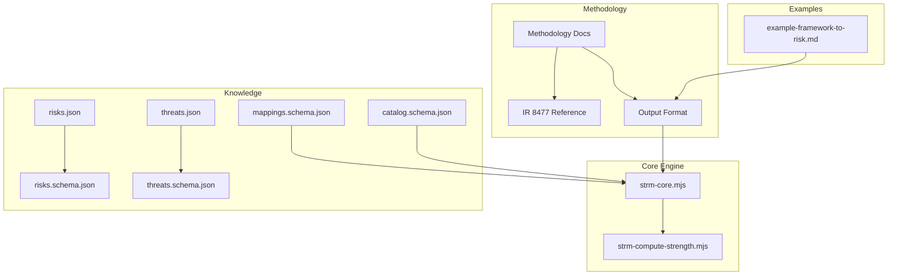
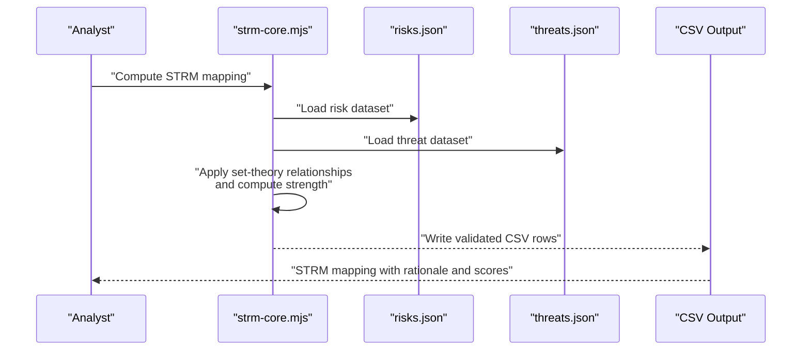
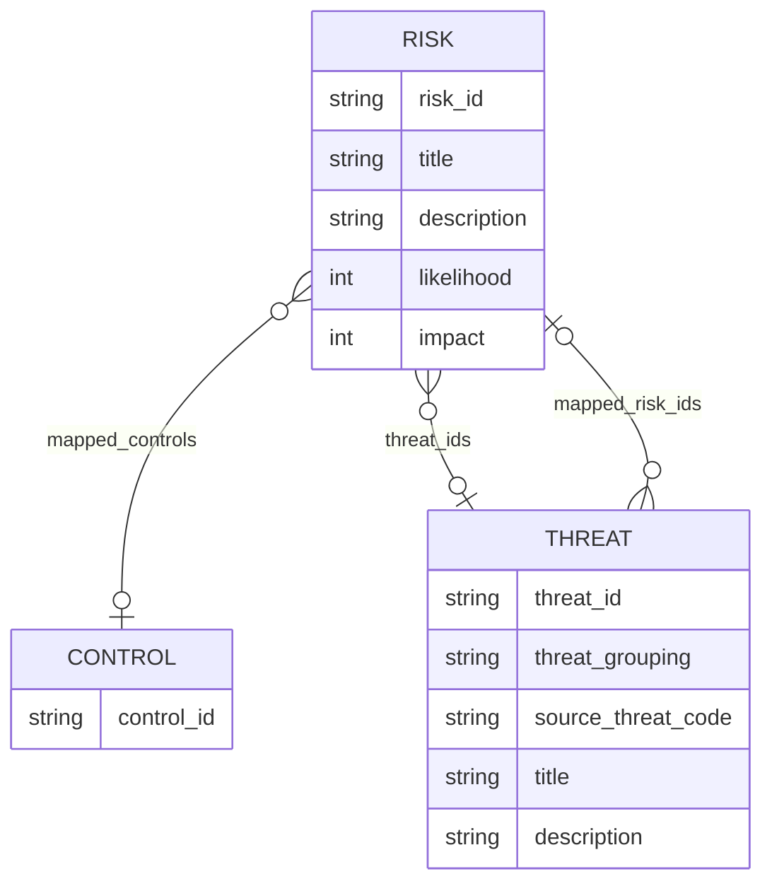
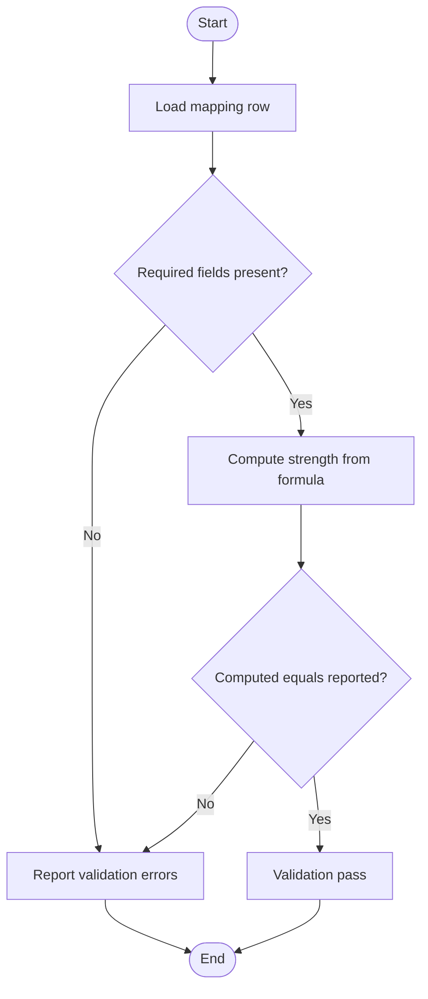
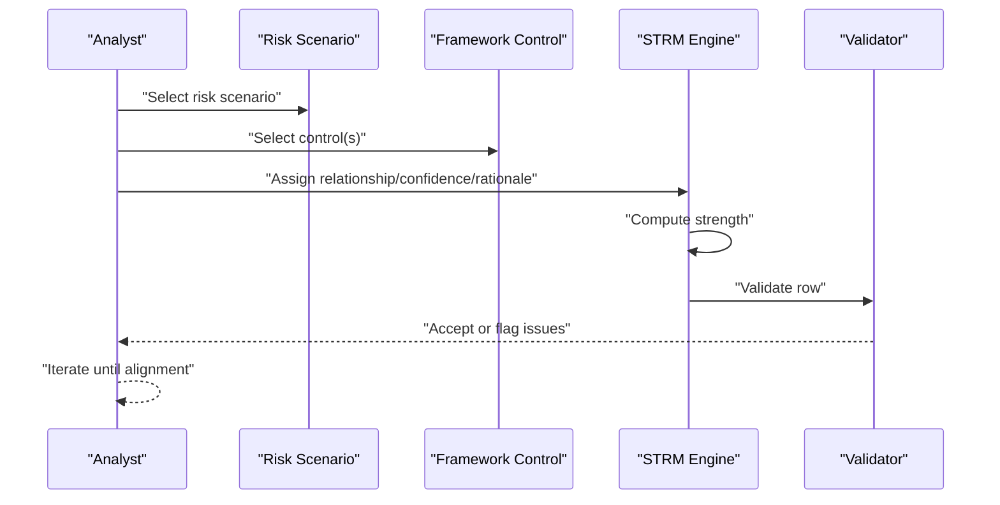
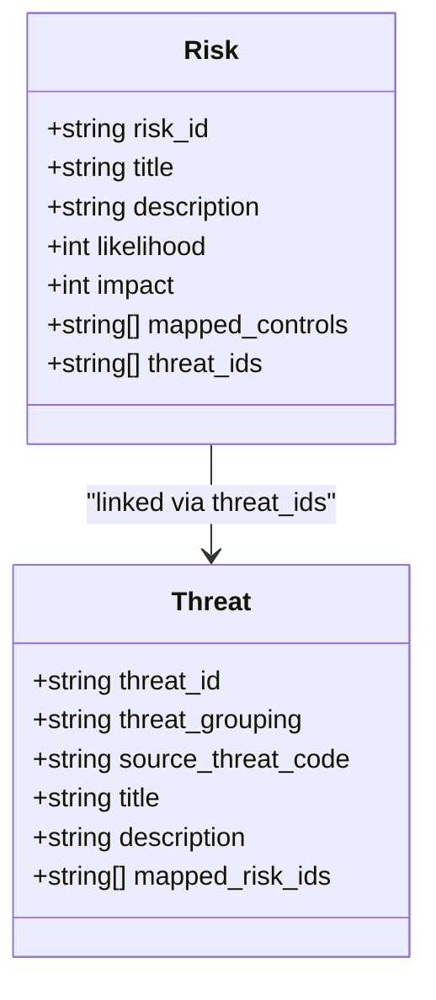
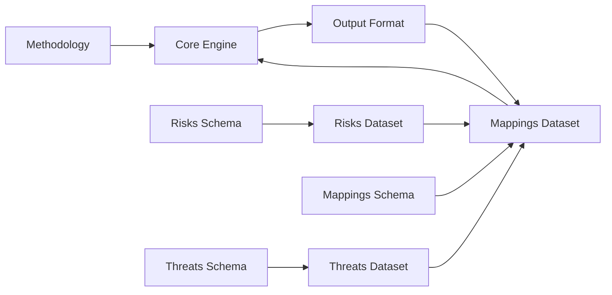

# Risk and Threat Integration

<cite>
**Referenced Files in This Document**
- [README.md](file://README.md)
- [docs/methodology.md](file://docs/methodology.md)
- [docs/output-format.md](file://docs/output-format.md)
- [knowledge/ir8477-strm-reference.md](file://knowledge/ir8477-strm-reference.md)
- [scripts/lib/strm-core.mjs](file://scripts/lib/strm-core.mjs)
- [scripts/bin/strm-compute-strength.mjs](file://scripts/bin/strm-compute-strength.mjs)
- [examples/example-framework-to-risk.md](file://examples/example-framework-to-risk.md)
- [knowledge/library/risks.json](file://knowledge/library/risks.json)
- [knowledge/library/threats.json](file://knowledge/library/threats.json)
- [knowledge/risks.schema.json](file://knowledge/risks.schema.json)
- [knowledge/threats.schema.json](file://knowledge/threats.schema.json)
- [knowledge/mappings.schema.json](file://knowledge/mappings.schema.json)
- [knowledge/catalog.schema.json](file://knowledge/catalog.schema.json)
</cite>

## Table of Contents
1. [Introduction](#introduction)
2. [Project Structure](#project-structure)
3. [Core Components](#core-components)
4. [Architecture Overview](#architecture-overview)
5. [Detailed Component Analysis](#detailed-component-analysis)
6. [Dependency Analysis](#dependency-analysis)
7. [Performance Considerations](#performance-considerations)
8. [Troubleshooting Guide](#troubleshooting-guide)
9. [Conclusion](#conclusion)
10. [Appendices](#appendices)

## Introduction
This document explains how to integrate risk and threat intelligence into STRM mappings using the NIST IR 8477 methodology. It focuses on enriching framework mappings with risk assessments, threat models, and vulnerability data. The guide covers risk identification, threat modeling, risk-to-control correlation, quantification, threat actor profiling, and mitigation strategy alignment. It also provides guidance on data quality, intelligence updates, risk tolerance, decision-making, prioritization, and communication.

## Project Structure
The repository provides:
- Methodology and output format specifications aligned with NIST IR 8477
- Core STRM computation utilities and validation logic
- Example STRM mapping types, including framework-to-risk
- Structured knowledge datasets for risks and threats with JSON schemas
- Scripts to compute strength scores deterministically

**Diagram sources**
- [docs/methodology.md:1-14](file://docs/methodology.md#L1-L14)
- [docs/output-format.md:1-62](file://docs/output-format.md#L1-L62)
- [knowledge/ir8477-strm-reference.md:1-119](file://knowledge/ir8477-strm-reference.md#L1-L119)
- [scripts/lib/strm-core.mjs:1-343](file://scripts/lib/strm-core.mjs#L1-L343)
- [scripts/bin/strm-compute-strength.mjs:1-20](file://scripts/bin/strm-compute-strength.mjs#L1-L20)
- [examples/example-framework-to-risk.md:1-179](file://examples/example-framework-to-risk.md#L1-L179)
- [knowledge/library/risks.json:1-1190](file://knowledge/library/risks.json#L1-L1190)
- [knowledge/library/threats.json:1-728](file://knowledge/library/threats.json#L1-L728)
- [knowledge/risks.schema.json:1-92](file://knowledge/risks.schema.json#L1-L92)
- [knowledge/threats.schema.json:1-55](file://knowledge/threats.schema.json#L1-L55)
- [knowledge/mappings.schema.json:1-117](file://knowledge/mappings.schema.json#L1-L117)
- [knowledge/catalog.schema.json:1-157](file://knowledge/catalog.schema.json#L1-L157)

**Section sources**
- [README.md:1-85](file://README.md#L1-L85)
- [docs/methodology.md:1-14](file://docs/methodology.md#L1-L14)
- [docs/output-format.md:1-62](file://docs/output-format.md#L1-L62)
- [knowledge/ir8477-strm-reference.md:1-119](file://knowledge/ir8477-strm-reference.md#L1-L119)

## Core Components
- STRM methodology and output format: Defines FDE/RDE, set-theory relationships, rationale types, confidence levels, and deterministic strength scoring.
- Core engine: Provides relationship constants, strength computation, CSV parsing/validation, filename generation, and artifact directory resolution.
- Knowledge datasets: Risks and threats catalogs with structured fields, optional set-theory relationships, and materiality considerations.
- Example mapping: Demonstrates framework-to-risk mapping with narrative rationale, relationship types, and strength calculations.

Key capabilities:
- Deterministic strength scoring from relationship, confidence, and rationale
- Validation of CSV rows and headers
- Support for multiple mapping types including framework-to-risk

**Section sources**
- [scripts/lib/strm-core.mjs:1-343](file://scripts/lib/strm-core.mjs#L1-L343)
- [docs/output-format.md:1-62](file://docs/output-format.md#L1-L62)
- [knowledge/ir8477-strm-reference.md:1-119](file://knowledge/ir8477-strm-reference.md#L1-L119)
- [examples/example-framework-to-risk.md:1-179](file://examples/example-framework-to-risk.md#L1-L179)

## Architecture Overview
The STRM pipeline integrates risk and threat data into framework mappings through structured datasets and deterministic scoring.

**Diagram sources**
- [scripts/lib/strm-core.mjs:1-343](file://scripts/lib/strm-core.mjs#L1-L343)
- [knowledge/library/risks.json:1-1190](file://knowledge/library/risks.json#L1-L1190)
- [knowledge/library/threats.json:1-728](file://knowledge/library/threats.json#L1-L728)
- [docs/output-format.md:1-62](file://docs/output-format.md#L1-L62)

## Detailed Component Analysis

### Risk and Threat Datasets
- Risks dataset: Contains risk entries with identifiers, titles, descriptions, likelihood/impact scales, mapped controls, optional set-theory relationships, source catalog metadata, and linked threat identifiers.
- Threats dataset: Contains threat entries with grouping, source codes, titles, descriptions, materiality considerations, and optional mapped risk identifiers.
- Schemas: JSON schemas define required fields, patterns, enums, and nested structures for validation.

**Diagram sources**
- [knowledge/library/risks.json:1-1190](file://knowledge/library/risks.json#L1-L1190)
- [knowledge/library/threats.json:1-728](file://knowledge/library/threats.json#L1-L728)
- [knowledge/risks.schema.json:1-92](file://knowledge/risks.schema.json#L1-L92)
- [knowledge/threats.schema.json:1-55](file://knowledge/threats.schema.json#L1-L55)

**Section sources**
- [knowledge/library/risks.json:1-1190](file://knowledge/library/risks.json#L1-L1190)
- [knowledge/library/threats.json:1-728](file://knowledge/library/threats.json#L1-L728)
- [knowledge/risks.schema.json:1-92](file://knowledge/risks.schema.json#L1-L92)
- [knowledge/threats.schema.json:1-55](file://knowledge/threats.schema.json#L1-L55)

### STRM Strength Scoring and Validation
- Strength formula: Base score per relationship plus confidence adjustment and rationale adjustment, clamped to 1–10.
- Validation: Checks required fields, relationship type, confidence, rationale type, numeric strength bounds, and computed strength consistency.
- Output format: 12-column CSV with FDE, confidence, rationale, STRM relationship, strength, target control fields, and notes.

**Diagram sources**
- [scripts/lib/strm-core.mjs:206-265](file://scripts/lib/strm-core.mjs#L206-L265)
- [docs/output-format.md:22-32](file://docs/output-format.md#L22-L32)

**Section sources**
- [scripts/lib/strm-core.mjs:15-57](file://scripts/lib/strm-core.mjs#L15-L57)
- [scripts/lib/strm-core.mjs:206-265](file://scripts/lib/strm-core.mjs#L206-L265)
- [docs/output-format.md:1-62](file://docs/output-format.md#L1-L62)

### Framework-to-Risk Mapping Workflow
- Purpose: Demonstrate how framework controls reduce specific risk scenarios; enable bow-tie analysis across preventive and detective/response categories.
- Process:
  - Identify risk scenarios with quantified likelihood/impact.
  - Map framework controls to risk scenarios using set-theory relationships (equal, subset_of, superset_of, intersects_with, not_related).
  - Assign confidence and rationale; compute strength deterministically.
  - Document STRM rationale and notes for residual risks and gaps.
- Outputs: CSV with narrative rationale, relationship type, and strength for each mapping.

**Diagram sources**
- [examples/example-framework-to-risk.md:1-179](file://examples/example-framework-to-risk.md#L1-L179)
- [scripts/lib/strm-core.mjs:15-57](file://scripts/lib/strm-core.mjs#L15-L57)
- [docs/output-format.md:1-62](file://docs/output-format.md#L1-L62)

**Section sources**
- [examples/example-framework-to-risk.md:1-179](file://examples/example-framework-to-risk.md#L1-L179)
- [docs/output-format.md:1-62](file://docs/output-format.md#L1-L62)

### Risk-to-Control and Threat-to-Risk Correlation
- Risk-to-control: Link risk scenarios to specific controls using set-theory relationships and mapped controls arrays.
- Threat-to-risk: Link threat identifiers to risk scenarios using mapped_risk_ids arrays.
- Use set_theory_relationships for IR 8477-aligned semantics and confidence_alignment for quality signals.

**Diagram sources**
- [knowledge/library/risks.json:1-1190](file://knowledge/library/risks.json#L1-L1190)
- [knowledge/library/threats.json:1-728](file://knowledge/library/threats.json#L1-L728)
- [knowledge/risks.schema.json:1-92](file://knowledge/risks.schema.json#L1-L92)
- [knowledge/threats.schema.json:1-55](file://knowledge/threats.schema.json#L1-L55)

**Section sources**
- [knowledge/library/risks.json:1-1190](file://knowledge/library/risks.json#L1-L1190)
- [knowledge/library/threats.json:1-728](file://knowledge/library/threats.json#L1-L728)
- [knowledge/risks.schema.json:1-92](file://knowledge/risks.schema.json#L1-L92)
- [knowledge/threats.schema.json:1-55](file://knowledge/threats.schema.json#L1-L55)

## Dependency Analysis
- Mapping types supported include framework-to-risk, risk-to-control, threat-to-risk, and threat-to-control.
- Core engine depends on relationship constants and strength formula.
- Knowledge datasets depend on schemas for validation and consistency.
- Output format depends on methodology and core engine.

**Diagram sources**
- [docs/methodology.md:1-14](file://docs/methodology.md#L1-L14)
- [docs/output-format.md:47-61](file://docs/output-format.md#L47-L61)
- [scripts/lib/strm-core.mjs:1-343](file://scripts/lib/strm-core.mjs#L1-L343)
- [knowledge/mappings.schema.json:1-117](file://knowledge/mappings.schema.json#L1-L117)
- [knowledge/risks.schema.json:1-92](file://knowledge/risks.schema.json#L1-L92)
- [knowledge/threats.schema.json:1-55](file://knowledge/threats.schema.json#L1-L55)

**Section sources**
- [docs/output-format.md:47-61](file://docs/output-format.md#L47-L61)
- [knowledge/mappings.schema.json:1-117](file://knowledge/mappings.schema.json#L1-L117)
- [knowledge/catalog.schema.json:1-157](file://knowledge/catalog.schema.json#L1-L157)

## Performance Considerations
- Deterministic scoring avoids subjective judgment and enables batch processing of mappings.
- CSV parsing and validation are linear in row count; optimize by streaming and chunking large inputs.
- JSON schema validation ensures data quality early, reducing downstream rework.

## Troubleshooting Guide
Common issues and resolutions:
- Invalid relationship/confidence/rationale types: Ensure values match allowed sets and are properly capitalized.
- Strength mismatch: Recompute using the provided script or core function to align reported score with formula.
- Empty required fields: Verify FDE#, Target ID #, and STRM Rationale are populated.
- not_related rows: Include notes explaining why mapping is not applicable.
- Syntactic rationale warnings: Prefer semantic or functional rationale when feasible.

**Section sources**
- [scripts/lib/strm-core.mjs:206-265](file://scripts/lib/strm-core.mjs#L206-L265)
- [scripts/bin/strm-compute-strength.mjs:1-20](file://scripts/bin/strm-compute-strength.mjs#L1-L20)

## Conclusion
By structuring risk and threat data according to NIST IR 8477 and applying deterministic STRM relationships, teams can systematically correlate risks, threats, and controls. This approach supports risk-informed decision-making, threat-based prioritization, and robust risk communication across frameworks and catalogs.

## Appendices

### Practical Workflows

- Risk assessment enrichment
  - Populate risk scenarios with likelihood/impact scales.
  - Link risks to controls and threats using identifiers.
  - Map framework controls to risk scenarios and compute strengths.
  - Use STRM rationale to justify relationships and document residual risks.

- Threat hunting alignment
  - Use threat groupings and mapped risk IDs to focus hunting efforts.
  - Align detections with framework controls and risk outcomes.
  - Update mappings as new threats emerge and controls evolve.

- Security program optimization
  - Prioritize controls based on strength scores and risk ratings.
  - Identify gaps where framework coverage does not intersect with risk scenarios.
  - Integrate mapping results into governance and resource allocation decisions.

[No sources needed since this section provides general guidance]