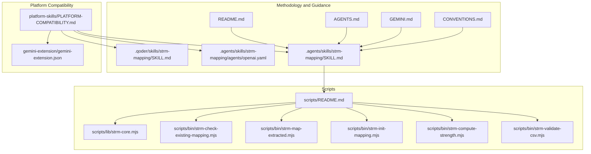
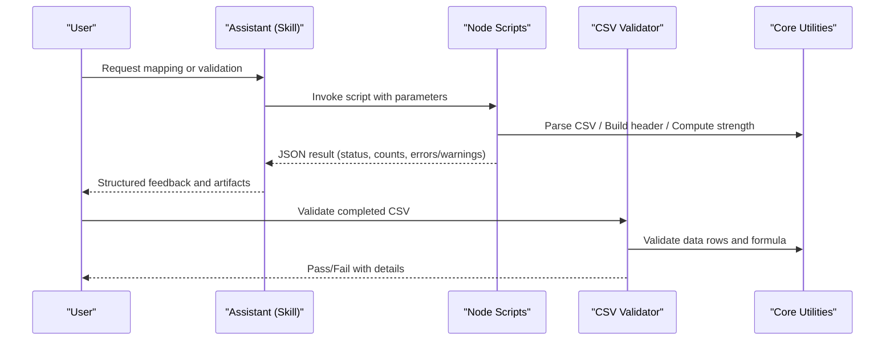
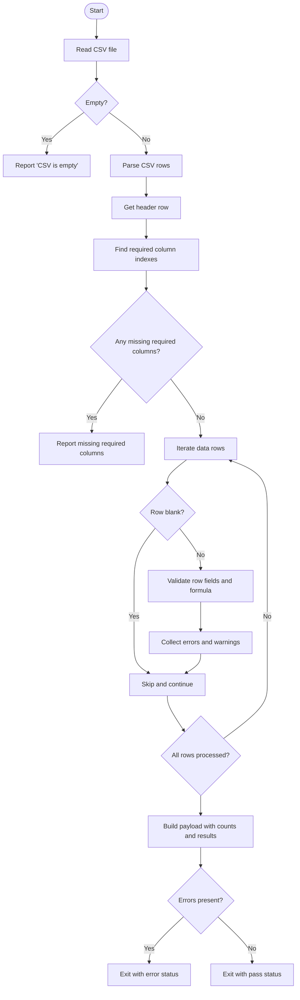
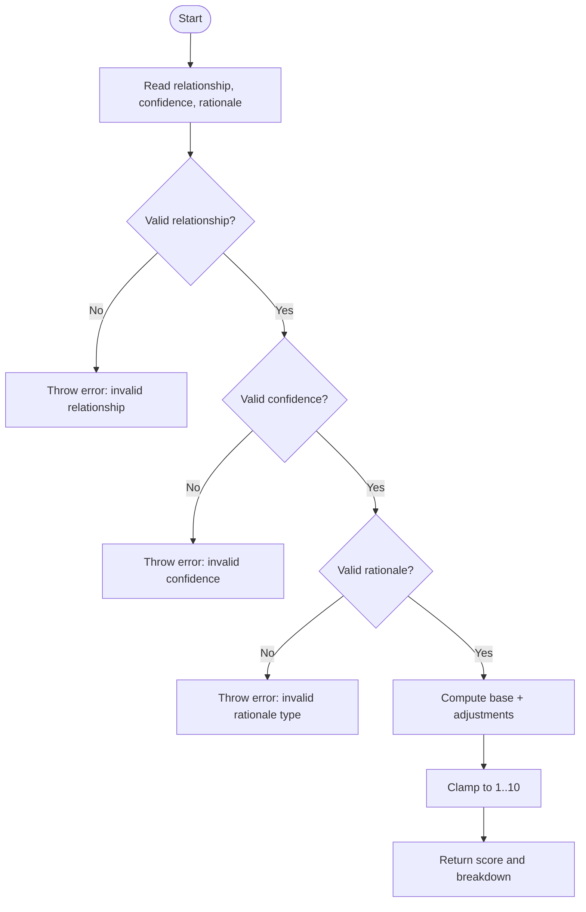
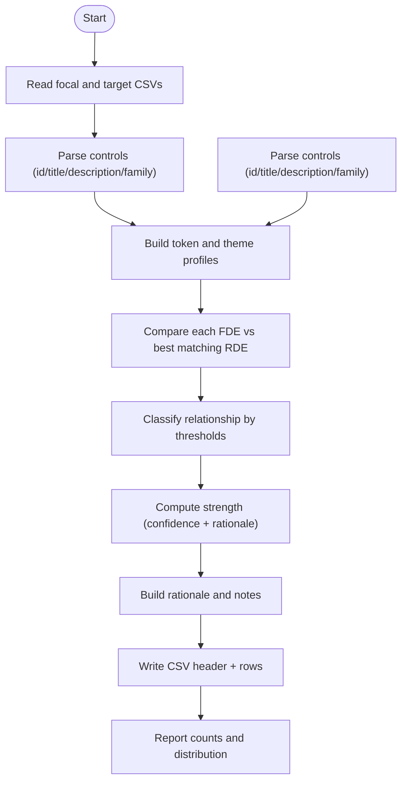
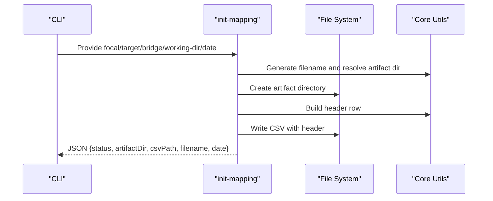
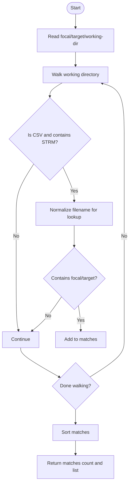
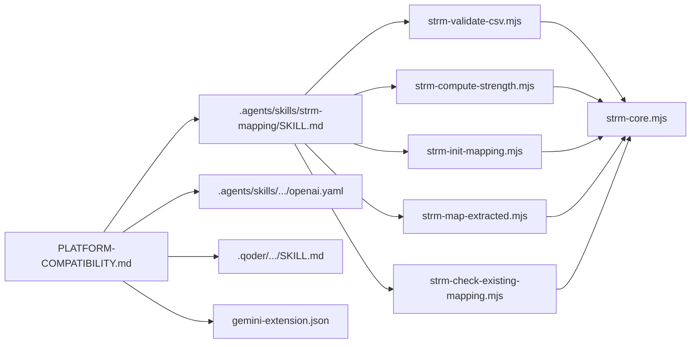

# Troubleshooting and Frequently Asked Questions

<cite>
**Referenced Files in This Document**
- [README.md](file://README.md)
- [CONVENTIONS.md](file://CONVENTIONS.md)
- [AGENTS.md](file://AGENTS.md)
- [GEMINI.md](file://GEMINI.md)
- [scripts/README.md](file://scripts/README.md)
- [scripts/bin/strm-validate-csv.mjs](file://scripts/bin/strm-validate-csv.mjs)
- [scripts/bin/strm-compute-strength.mjs](file://scripts/bin/strm-compute-strength.mjs)
- [scripts/bin/strm-init-mapping.mjs](file://scripts/bin/strm-init-mapping.mjs)
- [scripts/bin/strm-map-extracted.mjs](file://scripts/bin/strm-map-extracted.mjs)
- [scripts/bin/strm-check-existing-mapping.mjs](file://scripts/bin/strm-check-existing-mapping.mjs)
- [scripts/lib/strm-core.mjs](file://scripts/lib/strm-core.mjs)
- [platform-skills/PLATFORM-COMPATIBILITY.md](file://platform-skills/PLATFORM-COMPATIBILITY.md)
- [.agents/skills/strm-mapping/SKILL.md](file://.agents/skills/strm-mapping/SKILL.md)
- [.agents/skills/strm-mapping/agents/openai.yaml](file://.agents/skills/strm-mapping/agents/openai.yaml)
- [.qoder/skills/strm-mapping/SKILL.md](file://.qoder/skills/strm-mapping/SKILL.md)
- [gemini-extension/gemini-extension.json](file://gemini-extension/gemini-extension.json)
</cite>

## Table of Contents
1. [Introduction](#introduction)
2. [Project Structure](#project-structure)
3. [Core Components](#core-components)
4. [Architecture Overview](#architecture-overview)
5. [Detailed Component Analysis](#detailed-component-analysis)
6. [Dependency Analysis](#dependency-analysis)
7. [Performance Considerations](#performance-considerations)
8. [Troubleshooting Guide](#troubleshooting-guide)
9. [Conclusion](#conclusion)
10. [Appendices](#appendices)

## Introduction
This Troubleshooting and Frequently Asked Questions (FAQ) section focuses on diagnosing and resolving common issues encountered when using the STRM toolkit across AI assistants. It covers setup and environment issues, platform-specific integration challenges, validation and processing exceptions, performance and scalability concerns, and compatibility/version-related pitfalls. It also provides step-by-step resolution guides for typical scenarios such as skill loading failures, file processing errors, and output validation issues, along with preventive measures and best practices.

## Project Structure
The STRM toolkit organizes methodology and operational scripts to support multiple AI assistants. Key areas include:
- Methodology and guidance: README, AGENTS.md, GEMINI.md, CONVENTIONS.md, and the canonical Agent Skills definition
- Cross-platform scripts: deterministic Node.js utilities for validation, strength computation, initialization, mapping, and reporting
- Platform compatibility: documentation detailing how each assistant surfaces the STRM skill and integrates with the repository
- Assistant-specific skill definitions: OpenAI Codex, Qoder, and the shared Agent Skills format

**Diagram sources**
- [README.md:1-30](file://README.md#L1-L30)
- [AGENTS.md:1-141](file://AGENTS.md#L1-L141)
- [GEMINI.md:1-224](file://GEMINI.md#L1-L224)
- [CONVENTIONS.md:1-186](file://CONVENTIONS.md#L1-L186)
- [.agents/skills/strm-mapping/SKILL.md:1-442](file://.agents/skills/strm-mapping/SKILL.md#L1-L442)
- [.agents/skills/strm-mapping/agents/openai.yaml:1-8](file://.agents/skills/strm-mapping/agents/openai.yaml#L1-L8)
- [.qoder/skills/strm-mapping/SKILL.md:1-247](file://.qoder/skills/strm-mapping/SKILL.md#L1-L247)
- [scripts/README.md:1-31](file://scripts/README.md#L1-L31)
- [scripts/bin/strm-validate-csv.mjs:1-77](file://scripts/bin/strm-validate-csv.mjs#L1-L77)
- [scripts/bin/strm-compute-strength.mjs:1-20](file://scripts/bin/strm-compute-strength.mjs#L1-L20)
- [scripts/bin/strm-init-mapping.mjs:1-58](file://scripts/bin/strm-init-mapping.mjs#L1-L58)
- [scripts/bin/strm-map-extracted.mjs:1-278](file://scripts/bin/strm-map-extracted.mjs#L1-L278)
- [scripts/bin/strm-check-existing-mapping.mjs:1-20](file://scripts/bin/strm-check-existing-mapping.mjs#L1-L20)
- [scripts/lib/strm-core.mjs:1-343](file://scripts/lib/strm-core.mjs#L1-L343)
- [platform-skills/PLATFORM-COMPATIBILITY.md:1-401](file://platform-skills/PLATFORM-COMPATIBILITY.md#L1-L401)
- [gemini-extension/gemini-extension.json:1-13](file://gemini-extension/gemini-extension.json#L1-L13)

**Section sources**
- [README.md:1-30](file://README.md#L1-L30)
- [scripts/README.md:1-31](file://scripts/README.md#L1-L31)
- [platform-skills/PLATFORM-COMPATIBILITY.md:1-401](file://platform-skills/PLATFORM-COMPATIBILITY.md#L1-L401)

## Core Components
This section highlights the components most relevant to troubleshooting and error diagnosis.

- Validation pipeline: the CSV validator checks required columns, required row fields, and formula correctness, returning structured errors and warnings.
- Strength computation: the strength calculator enforces the NIST IR 8477 scoring formula and throws on invalid inputs.
- Mapping engine: the extracted mapper computes similarity metrics and relationship assignments, then writes a draft CSV with relationship-specific notes.
- Initialization and naming: the initializer creates the artifact directory and writes the CSV header, ensuring consistent naming and folder conventions.
- Existing mapping discovery: a utility scans the working directory for prior STRM outputs to prevent duplication.
- Core utilities: shared parsing, CSV serialization, header building, and normalization functions underpin all scripts.

Common symptoms and their likely causes:
- Empty or malformed CSV: missing required columns or rows, incorrect quoting, or missing headers
- Strength mismatch errors: manually edited strengths without recomputing, or invalid relationship/confidence/rationale values
- Missing target control IDs: invented IDs instead of sourcing from the target document
- Incorrect working directory or relative path resolution: running outside the repository root or placing inputs in wrong locations
- Platform-specific skill activation failures: missing skill files, incorrect installation paths, or misconfigured assistant settings

**Section sources**
- [scripts/bin/strm-validate-csv.mjs:1-77](file://scripts/bin/strm-validate-csv.mjs#L1-L77)
- [scripts/lib/strm-core.mjs:35-57](file://scripts/lib/strm-core.mjs#L35-L57)
- [scripts/bin/strm-map-extracted.mjs:1-278](file://scripts/bin/strm-map-extracted.mjs#L1-L278)
- [scripts/bin/strm-init-mapping.mjs:1-58](file://scripts/bin/strm-init-mapping.mjs#L1-L58)
- [scripts/bin/strm-check-existing-mapping.mjs:1-20](file://scripts/bin/strm-check-existing-mapping.mjs#L1-L20)
- [scripts/lib/strm-core.mjs:99-180](file://scripts/lib/strm-core.mjs#L99-L180)

## Architecture Overview
The toolkit’s operational flow combines methodology-driven guidance with deterministic scripts and platform integrations.

**Diagram sources**
- [.agents/skills/strm-mapping/SKILL.md:96-106](file://.agents/skills/strm-mapping/SKILL.md#L96-L106)
- [scripts/bin/strm-validate-csv.mjs:1-77](file://scripts/bin/strm-validate-csv.mjs#L1-L77)
- [scripts/lib/strm-core.mjs:206-265](file://scripts/lib/strm-core.mjs#L206-L265)

## Detailed Component Analysis

### CSV Validation Pipeline
The validator reads a CSV, parses rows, verifies required columns, and validates each data row against the STRM methodology. It reports counts and a consolidated payload with errors and warnings.

**Diagram sources**
- [scripts/bin/strm-validate-csv.mjs:15-77](file://scripts/bin/strm-validate-csv.mjs#L15-L77)
- [scripts/lib/strm-core.mjs:186-204](file://scripts/lib/strm-core.mjs#L186-L204)
- [scripts/lib/strm-core.mjs:206-265](file://scripts/lib/strm-core.mjs#L206-L265)

**Section sources**
- [scripts/bin/strm-validate-csv.mjs:1-77](file://scripts/bin/strm-validate-csv.mjs#L1-L77)
- [scripts/lib/strm-core.mjs:206-265](file://scripts/lib/strm-core.mjs#L206-L265)

### Strength Computation
The strength calculator enforces the NIST IR 8477 formula and throws on invalid inputs. It ensures that computed scores match the expected value.

**Diagram sources**
- [scripts/lib/strm-core.mjs:35-57](file://scripts/lib/strm-core.mjs#L35-L57)
- [scripts/bin/strm-compute-strength.mjs:9-19](file://scripts/bin/strm-compute-strength.mjs#L9-L19)

**Section sources**
- [scripts/lib/strm-core.mjs:35-57](file://scripts/lib/strm-core.mjs#L35-L57)
- [scripts/bin/strm-compute-strength.mjs:1-20](file://scripts/bin/strm-compute-strength.mjs#L1-L20)

### Extracted Mapping Engine
The extracted mapper builds frequency maps, theme hits, and similarity metrics to classify relationships and generate a draft CSV with notes.

**Diagram sources**
- [scripts/bin/strm-map-extracted.mjs:119-278](file://scripts/bin/strm-map-extracted.mjs#L119-L278)
- [scripts/lib/strm-core.mjs:81-97](file://scripts/lib/strm-core.mjs#L81-L97)

**Section sources**
- [scripts/bin/strm-map-extracted.mjs:1-278](file://scripts/bin/strm-map-extracted.mjs#L1-L278)
- [scripts/lib/strm-core.mjs:81-97](file://scripts/lib/strm-core.mjs#L81-L97)

### Initialization and Artifact Management
Initialization creates the artifact directory and writes the CSV header, enforcing naming and folder conventions.

**Diagram sources**
- [scripts/bin/strm-init-mapping.mjs:12-58](file://scripts/bin/strm-init-mapping.mjs#L12-L58)
- [scripts/lib/strm-core.mjs:67-79](file://scripts/lib/strm-core.mjs#L67-L79)
- [scripts/lib/strm-core.mjs:267-277](file://scripts/lib/strm-core.mjs#L267-L277)

**Section sources**
- [scripts/bin/strm-init-mapping.mjs:1-58](file://scripts/bin/strm-init-mapping.mjs#L1-L58)
- [scripts/lib/strm-core.mjs:67-79](file://scripts/lib/strm-core.mjs#L67-L79)
- [scripts/lib/strm-core.mjs:267-277](file://scripts/lib/strm-core.mjs#L267-L277)

### Existing Mapping Discovery
This utility searches the working directory for prior STRM outputs to avoid duplication.

**Diagram sources**
- [scripts/bin/strm-check-existing-mapping.mjs:9-19](file://scripts/bin/strm-check-existing-mapping.mjs#L9-L19)
- [scripts/lib/strm-core.mjs:315-342](file://scripts/lib/strm-core.mjs#L315-L342)

**Section sources**
- [scripts/bin/strm-check-existing-mapping.mjs:1-20](file://scripts/bin/strm-check-existing-mapping.mjs#L1-L20)
- [scripts/lib/strm-core.mjs:315-342](file://scripts/lib/strm-core.mjs#L315-L342)

## Dependency Analysis
The scripts depend on shared core utilities for CSV parsing, header building, and validation logic. Platform compatibility documents describe how each assistant integrates with the skill and context files.

**Diagram sources**
- [scripts/bin/strm-validate-csv.mjs:3](file://scripts/bin/strm-validate-csv.mjs#L3)
- [scripts/bin/strm-compute-strength.mjs:2](file://scripts/bin/strm-compute-strength.mjs#L2)
- [scripts/bin/strm-init-mapping.mjs:10](file://scripts/bin/strm-init-mapping.mjs#L10)
- [scripts/bin/strm-map-extracted.mjs:3](file://scripts/bin/strm-map-extracted.mjs#L3)
- [scripts/bin/strm-check-existing-mapping.mjs:2](file://scripts/bin/strm-check-existing-mapping.mjs#L2)
- [scripts/lib/strm-core.mjs:1-3](file://scripts/lib/strm-core.mjs#L1-L3)
- [.agents/skills/strm-mapping/SKILL.md:96-106](file://.agents/skills/strm-mapping/SKILL.md#L96-L106)
- [platform-skills/PLATFORM-COMPATIBILITY.md:1-401](file://platform-skills/PLATFORM-COMPATIBILITY.md#L1-L401)
- [.agents/skills/strm-mapping/agents/openai.yaml:1-8](file://.agents/skills/strm-mapping/agents/openai.yaml#L1-L8)
- [.qoder/skills/strm-mapping/SKILL.md:1-247](file://.qoder/skills/strm-mapping/SKILL.md#L1-L247)
- [gemini-extension/gemini-extension.json:1-13](file://gemini-extension/gemini-extension.json#L1-L13)

**Section sources**
- [scripts/lib/strm-core.mjs:1-343](file://scripts/lib/strm-core.mjs#L1-L343)
- [platform-skills/PLATFORM-COMPATIBILITY.md:1-401](file://platform-skills/PLATFORM-COMPATIBILITY.md#L1-L401)

## Performance Considerations
- Large input datasets: the extracted mapper compares every FDE against all RDEs, computing token sets and similarity metrics. For very large catalogs, expect proportional increases in processing time.
- Memory constraints: frequency maps and token sets are built per control; consider splitting very large mappings into smaller batches.
- I/O overhead: repeated file reads/writes during mapping and validation; ensure working-directory is on fast storage.
- Scalability: use the existing mapping pipeline to generate draft mappings, then perform manual adjudication to reduce downstream rework.

[No sources needed since this section provides general guidance]

## Troubleshooting Guide

### Setup and Environment Issues
Symptoms:
- Assistant cannot find or activate the STRM skill
- Scripts fail with “missing arguments” or “usage” messages
- Relative paths or working directory errors

Root causes and fixes:
- Ensure you run from the repository root so relative paths resolve correctly. Several documents emphasize this constraint.
- Verify the skill files exist in the expected locations (.agents/skills/strm-mapping/SKILL.md and platform-specific copies).
- Confirm assistant-specific configuration:
  - OpenAI Codex: skill is auto-discovered from .agents/skills/; ensure the description matches the request.
  - Gemini CLI: skill auto-discovery plus context file injection; extension MCP tools available after linking.
  - Qoder: skill discovered from .qoder/skills/ or user-level; activation via slash command or implicit trigger.
  - Aider: load CONVENTIONS.md explicitly since it does not auto-discover.
- For scripts, ensure Node.js is available and the scripts are executed from the repository root.

Preventive measures:
- Keep the canonical skill in .agents/skills/strm-mapping/SKILL.md and mirror updates to platform-specific copies.
- Document working directory expectations and file naming conventions in your team’s onboarding materials.

**Section sources**
- [README.md:24-29](file://README.md#L24-L29)
- [AGENTS.md:23-27](file://AGENTS.md#L23-L27)
- [GEMINI.md:27-35](file://GEMINI.md#L27-L35)
- [CONVENTIONS.md:27-32](file://CONVENTIONS.md#L27-L32)
- [platform-skills/PLATFORM-COMPATIBILITY.md:102-133](file://platform-skills/PLATFORM-COMPATIBILITY.md#L102-L133)
- [platform-skills/PLATFORM-COMPATIBILITY.md:136-177](file://platform-skills/PLATFORM-COMPATIBILITY.md#L136-L177)
- [platform-skills/PLATFORM-COMPATIBILITY.md:180-228](file://platform-skills/PLATFORM-COMPATIBILITY.md#L180-L228)
- [platform-skills/PLATFORM-COMPATIBILITY.md:300-331](file://platform-skills/PLATFORM-COMPATIBILITY.md#L300-L331)
- [platform-skills/PLATFORM-COMPATIBILITY.md:339-362](file://platform-skills/PLATFORM-COMPATIBILITY.md#L339-L362)

### Platform-Specific Integration Challenges
Symptoms:
- Skill activation fails or triggers incorrectly
- Context files not injected
- Extension tools unavailable

Root causes and fixes:
- OpenAI Codex: ensure the skill description matches the request; verify skill path and enablement in config.
- Gemini CLI: confirm skill auto-discovery and context file injection; link the extension and restart the CLI to expose MCP tools.
- Qoder: verify project-level skill presence and activation via slash command or implicit trigger.
- Aider: explicitly load CONVENTIONS.md since auto-discovery is not supported.

Diagnostic steps:
- Check platform compatibility documentation for exact file locations and activation mechanisms.
- Confirm that the repository root is the current working directory when invoking assistants.

**Section sources**
- [platform-skills/PLATFORM-COMPATIBILITY.md:40-54](file://platform-skills/PLATFORM-COMPATIBILITY.md#L40-L54)
- [platform-skills/PLATFORM-COMPATIBILITY.md:136-177](file://platform-skills/PLATFORM-COMPATIBILITY.md#L136-L177)
- [platform-skills/PLATFORM-COMPATIBILITY.md:180-228](file://platform-skills/PLATFORM-COMPATIBILITY.md#L180-L228)
- [platform-skills/PLATFORM-COMPATIBILITY.md:300-331](file://platform-skills/PLATFORM-COMPATIBILITY.md#L300-L331)
- [platform-skills/PLATFORM-COMPATIBILITY.md:339-362](file://platform-skills/PLATFORM-COMPATIBILITY.md#L339-L362)
- [gemini-extension/gemini-extension.json:1-13](file://gemini-extension/gemini-extension.json#L1-L13)

### Validation Failures and Output Issues
Symptoms:
- CSV validation reports “Missing required columns”
- “Strength mismatch” errors
- “Empty Rationale” or “empty Target ID #”
- “not_related should include Notes”

Root causes and fixes:
- Missing required columns: ensure the CSV header matches the 12-column specification and required keys.
- Strength mismatch: recompute using the strength calculator after editing relationship/confidence/rationale.
- Empty fields: fill FDE#, Target ID #, and STRM Rationale for every row.
- not_related rows: add contextual Notes explaining why the relationship is not related.
- Syntactic rationale and low confidence: verify intent; these are flagged as warnings.

Diagnostic procedure:
- Run the CSV validator to get a structured report with counts and details.
- Fix each reported error and re-run validation until status is “pass”.

**Section sources**
- [scripts/bin/strm-validate-csv.mjs:36-77](file://scripts/bin/strm-validate-csv.mjs#L36-L77)
- [scripts/lib/strm-core.mjs:206-265](file://scripts/lib/strm-core.mjs#L206-L265)
- [scripts/bin/strm-compute-strength.mjs:9-19](file://scripts/bin/strm-compute-strength.mjs#L9-L19)

### Processing Exceptions and Mapping Errors
Symptoms:
- “Invalid relationship”, “Invalid confidence”, or “Invalid rationale type”
- “Invalid STRM Relationship” or “Invalid Confidence Levels”
- “Invalid NIST IR-8477 Rational”

Root causes and fixes:
- Invalid values: ensure relationship, confidence, and rationale type are among allowed values.
- Formula enforcement: use the strength calculator to compute scores; do not assign arbitrary values.
- Relationship defaults: confirm defaults and overrides per methodology.

Diagnostic procedure:
- Validate inputs before invoking strength computation.
- Use the strength calculator to verify expected scores.

**Section sources**
- [scripts/lib/strm-core.mjs:4,12-13,35-57:4-57](file://scripts/lib/strm-core.mjs#L4-L57)
- [scripts/bin/strm-compute-strength.mjs:9-19](file://scripts/bin/strm-compute-strength.mjs#L9-L19)

### Skill Loading Failures
Symptoms:
- Assistant cannot locate the STRM skill
- Skill appears but does not trigger mapping

Root causes and fixes:
- Missing skill files: ensure .agents/skills/strm-mapping/SKILL.md exists and platform-specific copies are in place.
- Incorrect installation paths: follow platform-specific instructions for installing skills (e.g., copying to user-level directories).
- Activation policy: verify assistant configuration allows implicit invocation or use explicit commands.

Diagnostic steps:
- Confirm skill frontmatter fields (name, description) meet platform requirements.
- Test activation via explicit commands or by matching the skill description.

**Section sources**
- [platform-skills/PLATFORM-COMPATIBILITY.md:102-133](file://platform-skills/PLATFORM-COMPATIBILITY.md#L102-L133)
- [platform-skills/PLATFORM-COMPATIBILITY.md:136-177](file://platform-skills/PLATFORM-COMPATIBILITY.md#L136-L177)
- [platform-skills/PLATFORM-COMPATIBILITY.md:300-331](file://platform-skills/PLATFORM-COMPATIBILITY.md#L300-L331)
- [.agents/skills/strm-mapping/agents/openai.yaml:6-8](file://.agents/skills/strm-mapping/agents/openai.yaml#L6-L8)

### File Processing Errors
Symptoms:
- Empty or malformed CSV
- Incorrect quoting or encoding issues
- Missing header row

Root causes and fixes:
- CSV parsing: ensure proper quoting and newline handling; the core parser handles quoted fields and escaped quotes.
- Header normalization: the system normalizes header keys for matching; ensure your headers match expected keys.
- Encoding: save CSVs in UTF-8 to avoid parsing issues.

Diagnostic procedure:
- Use the CSV validator to detect missing columns and row-level issues.
- Inspect the header row and ensure it matches the 12-column specification.

**Section sources**
- [scripts/lib/strm-core.mjs:99-180](file://scripts/lib/strm-core.mjs#L99-L180)
- [scripts/lib/strm-core.mjs:182-204](file://scripts/lib/strm-core.mjs#L182-L204)
- [scripts/bin/strm-validate-csv.mjs:22-44](file://scripts/bin/strm-validate-csv.mjs#L22-L44)

### Output Validation Issues
Symptoms:
- “Strength mismatch” after manual edits
- “Empty STRM Rationale”
- “not_related should include Notes”

Root causes and fixes:
- After editing relationships, confidence, or rationale types, recompute the strength using the strength calculator.
- Ensure every row has a non-empty rationale and appropriate notes for special cases.

Diagnostic procedure:
- Run the validator to catch mismatches and missing fields.
- Re-run validation after recomputing strengths.

**Section sources**
- [scripts/bin/strm-validate-csv.mjs:61-77](file://scripts/bin/strm-validate-csv.mjs#L61-L77)
- [scripts/lib/strm-core.mjs:248-252](file://scripts/lib/strm-core.mjs#L248-L252)

### Performance and Scalability Limitations
Symptoms:
- Slow processing with large catalogs
- High memory usage during mapping
- Long validation times

Root causes and fixes:
- The extracted mapper performs pairwise comparisons; performance scales with input sizes.
- Split large mappings into smaller batches or use targeted subsets.
- Use the existing pipeline to generate drafts, then perform manual adjudication to minimize reprocessing.

Preventive measures:
- Monitor processing time and memory usage; consider batching and caching intermediate results where feasible.

**Section sources**
- [scripts/bin/strm-map-extracted.mjs:209-256](file://scripts/bin/strm-map-extracted.mjs#L209-L256)

### Compatibility Problems and Version Conflicts
Symptoms:
- Skill not recognized by an assistant
- Inconsistent behavior across platforms
- Extension tools not available

Root causes and fixes:
- Ensure platform compatibility documentation is followed for each assistant.
- Keep the canonical skill in .agents/skills/strm-mapping/SKILL.md and mirror updates to platform-specific copies.
- For Gemini CLI, link the extension and restart the CLI to expose MCP tools.

Diagnostic steps:
- Compare platform-specific instructions with your current setup.
- Verify that the correct skill file is being loaded by the assistant.

**Section sources**
- [platform-skills/PLATFORM-COMPATIBILITY.md:1-401](file://platform-skills/PLATFORM-COMPATIBILITY.md#L1-L401)
- [gemini-extension/gemini-extension.json:1-13](file://gemini-extension/gemini-extension.json#L1-L13)

### Environment-Specific Issues
Symptoms:
- Running from wrong directory
- Inputs not found or not readable
- Outputs written to unexpected locations

Root causes and fixes:
- Always run from the repository root and use working-directory/ for inputs and outputs.
- Place inputs in working-directory/, knowledge/, or examples/ as appropriate.
- Ensure artifact directories are created under working-directory/mapping-artifacts/.

Diagnostic procedure:
- Confirm working directory expectations in methodology documents.
- Verify that the working directory argument is passed correctly to scripts.

**Section sources**
- [README.md:24-29](file://README.md#L24-L29)
- [AGENTS.md:23-27](file://AGENTS.md#L23-L27)
- [GEMINI.md:27-46](file://GEMINI.md#L27-L46)
- [CONVENTIONS.md:27-32](file://CONVENTIONS.md#L27-L32)
- [scripts/lib/strm-core.mjs:267-277](file://scripts/lib/strm-core.mjs#L267-L277)

### Step-by-Step Resolution Guides

#### Scenario: CSV Validation Fails with Missing Columns
Steps:
1. Confirm the CSV header matches the 12-column specification.
2. Run the CSV validator to identify missing required columns.
3. Add missing columns and rerun validation.

**Section sources**
- [scripts/bin/strm-validate-csv.mjs:36-44](file://scripts/bin/strm-validate-csv.mjs#L36-L44)

#### Scenario: Strength Mismatch After Manual Edits
Steps:
1. Edit relationship, confidence, or rationale type.
2. Recompute strength using the strength calculator.
3. Update the Strength of Relationship column with the recomputed value.
4. Re-run validation.

**Section sources**
- [scripts/bin/strm-compute-strength.mjs:9-19](file://scripts/bin/strm-compute-strength.mjs#L9-L19)
- [scripts/bin/strm-validate-csv.mjs:61-77](file://scripts/bin/strm-validate-csv.mjs#L61-L77)

#### Scenario: Skill Not Found by Assistant
Steps:
1. Verify .agents/skills/strm-mapping/SKILL.md exists.
2. Follow platform-specific installation instructions.
3. Test activation via explicit command or by matching the skill description.

**Section sources**
- [platform-skills/PLATFORM-COMPATIBILITY.md:102-133](file://platform-skills/PLATFORM-COMPATIBILITY.md#L102-L133)
- [platform-skills/PLATFORM-COMPATIBILITY.md:136-177](file://platform-skills/PLATFORM-COMPATIBILITY.md#L136-L177)

#### Scenario: Duplicate Mapping Detected
Steps:
1. Run the existing mapping checker to find prior STRM outputs.
2. Review existing mappings and reuse or extend as appropriate.
3. Create a new mapping only if none match the source→target pair.

**Section sources**
- [scripts/bin/strm-check-existing-mapping.mjs:18-19](file://scripts/bin/strm-check-existing-mapping.mjs#L18-L19)
- [scripts/lib/strm-core.mjs:315-342](file://scripts/lib/strm-core.mjs#L315-L342)

#### Scenario: Extension Tools Unavailable (Gemini CLI)
Steps:
1. Install and build the extension.
2. Link the extension and restart Gemini CLI.
3. Use slash commands or MCP tools to perform deterministic operations.

**Section sources**
- [platform-skills/PLATFORM-COMPATIBILITY.md:208-228](file://platform-skills/PLATFORM-COMPATIBILITY.md#L208-L228)
- [gemini-extension/gemini-extension.json:1-13](file://gemini-extension/gemini-extension.json#L1-L13)

### Preventive Measures and Best Practices
- Always run from the repository root and use working-directory/ for inputs and outputs.
- Copy the template CSV and rename it according to the naming convention.
- Keep the canonical skill updated and mirrored across platform-specific copies.
- Perform manual adjudication after automated mapping; never declare completion from script output alone.
- Use the validator and gap report only after manual review is complete.
- Avoid inventing target control IDs; always source IDs from the actual target document.
- Respect optional risk/threat enrichment only when explicitly requested.

**Section sources**
- [README.md:24-30](file://README.md#L24-L30)
- [AGENTS.md:23-27](file://AGENTS.md#L23-L27)
- [GEMINI.md:27-46](file://GEMINI.md#L27-L46)
- [CONVENTIONS.md:27-32](file://CONVENTIONS.md#L27-L32)
- [.agents/skills/strm-mapping/SKILL.md:104-106](file://.agents/skills/strm-mapping/SKILL.md#L104-L106)
- [scripts/README.md:23-31](file://scripts/README.md#L23-L31)

## Conclusion
This Troubleshooting and FAQ section consolidates common issues and their resolutions across the STRM toolkit. By following the diagnostic procedures, platform-specific integration notes, and best practices, teams can reliably produce accurate STRM outputs, avoid frequent pitfalls, and maintain system health across diverse AI assistants.

[No sources needed since this section summarizes without analyzing specific files]

## Appendices

### Quick Reference: Common Error Messages and Fixes
- “Missing required columns”: Ensure the CSV header matches the 12-column specification and rerun the validator.
- “Strength mismatch”: Recompute using the strength calculator after editing relationship/confidence/rationale.
- “Empty Rationale” or “empty Target ID #”: Fill required fields for every row.
- “not_related should include Notes”: Add contextual Notes for not_related rows.
- “Invalid relationship/confidence/rationale type”: Use allowed values only.
- “Skill not found”: Verify skill file existence and platform-specific installation steps.
- “Extension tools unavailable”: Install/build/link the extension and restart the CLI.

**Section sources**
- [scripts/bin/strm-validate-csv.mjs:36-77](file://scripts/bin/strm-validate-csv.mjs#L36-L77)
- [scripts/bin/strm-compute-strength.mjs:9-19](file://scripts/bin/strm-compute-strength.mjs#L9-L19)
- [platform-skills/PLATFORM-COMPATIBILITY.md:102-133](file://platform-skills/PLATFORM-COMPATIBILITY.md#L102-L133)
- [platform-skills/PLATFORM-COMPATIBILITY.md:208-228](file://platform-skills/PLATFORM-COMPATIBILITY.md#L208-L228)