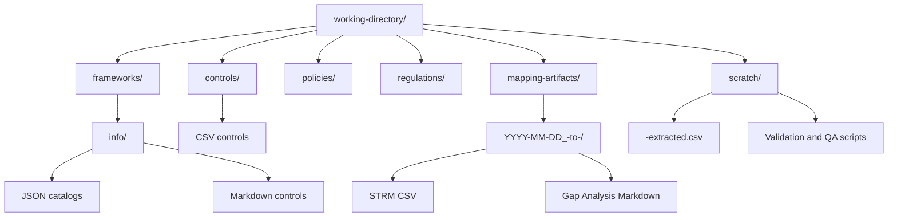
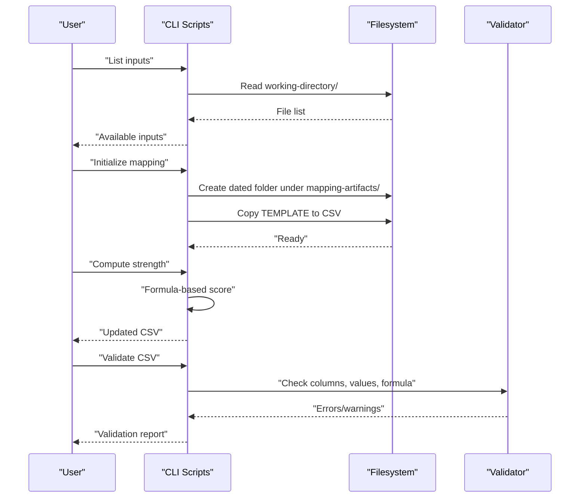
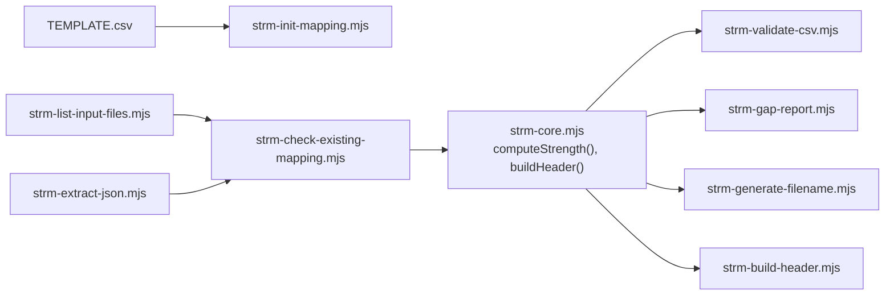

# Working Directory Structure and File Management

<cite>
**Referenced Files in This Document**
- [README.md](file://README.md)
- [CONVENTIONS.md](file://CONVENTIONS.md)
- [scripts/README.md](file://scripts/README.md)
- [scripts/lib/strm-core.mjs](file://scripts/lib/strm-core.mjs)
- [working-directory/frameworks/info/800-53/800-53/AC.md](file://working-directory/frameworks/info/800-53/800-53/AC.md)
- [working-directory/controls/OneLeet Controls.csv](file://working-directory/controls/OneLeet Controls.csv)
- [TEMPLATE_Set Theory Relationship Mapping (STRM).csv](file://TEMPLATE_Set Theory Relationship Mapping (STRM).csv)
- [examples/example-framework-to-control.md](file://examples/example-framework-to-control.md)
- [examples/example-framework-to-policy.md](file://examples/example-framework-to-policy.md)
- [gemini-extension/commands/strm/map.toml](file://gemini-extension/commands/strm/map.toml)
- [gemini-extension/commands/strm/init.toml](file://gemini-extension/commands/strm/init.toml)
</cite>

## Table of Contents
1. [Introduction](#introduction)
2. [Project Structure](#project-structure)
3. [Core Components](#core-components)
4. [Architecture Overview](#architecture-overview)
5. [Detailed Component Analysis](#detailed-component-analysis)
6. [Dependency Analysis](#dependency-analysis)
7. [Performance Considerations](#performance-considerations)
8. [Troubleshooting Guide](#troubleshooting-guide)
9. [Conclusion](#conclusion)
10. [Appendices](#appendices)

## Introduction
This document describes the working directory structure and file management practices for the STRM toolkit. It explains how to organize input sources, extract and prepare data, produce standardized mapping artifacts, and maintain audit trails. It also covers naming conventions, supported input formats, output organization, and best practices for large-scale mapping projects.

## Project Structure
The working directory organizes mapping inputs and outputs into distinct folders and follows a deterministic workflow. The primary folders are:
- frameworks/: Contains framework specifications and control catalogs in markdown and JSON formats.
- controls/: Holds control catalogs in CSV format for direct mapping to frameworks.
- policies/: Placeholder for organizational policy documents (markdown or CSV).
- regulations/: Placeholder for regulatory texts (markdown or CSV).
- mapping-artifacts/: Finalized mapping outputs grouped by date and framework pair.
- scratch/: Intermediate extraction and temporary files produced during processing.

**Diagram sources**
- [README.md:24-29](file://README.md#L24-L29)
- [CONVENTIONS.md:128-134](file://CONVENTIONS.md#L128-L134)
- [scripts/README.md:10-31](file://scripts/README.md#L10-L31)

**Section sources**
- [README.md:24-29](file://README.md#L24-L29)
- [CONVENTIONS.md:128-134](file://CONVENTIONS.md#L128-L134)
- [scripts/README.md:10-31](file://scripts/README.md#L10-L31)

## Core Components
- Input sources
  - Frameworks: Markdown files for control families and JSON catalogs for machine-readable control sets.
  - Controls: CSV files representing control catalogs ready for mapping.
  - Policies/Regulations: Markdown or CSV placeholders for organizational and regulatory content.
- Output artifacts
  - STRM CSV files with standardized headers and computed strength scores.
  - Gap analysis Markdown reports.
  - Organized under a dated folder named after the focal-to-target mapping pair.
- Intermediate processing
  - Extracted CSV files in scratch/ for each source dataset.
  - Validation and QA scripts to ensure correctness and completeness.

**Section sources**
- [CONVENTIONS.md:95-115](file://CONVENTIONS.md#L95-L115)
- [CONVENTIONS.md:118-125](file://CONVENTIONS.md#L118-L125)
- [CONVENTIONS.md:128-134](file://CONVENTIONS.md#L128-L134)
- [scripts/README.md:10-31](file://scripts/README.md#L10-L31)

## Architecture Overview
The mapping workflow transforms input sources into standardized STRM artifacts using deterministic scripts and conventions.

**Diagram sources**
- [scripts/README.md:12-21](file://scripts/README.md#L12-L21)
- [scripts/lib/strm-core.mjs:35-57](file://scripts/lib/strm-core.mjs#L35-L57)
- [scripts/lib/strm-core.mjs:206-265](file://scripts/lib/strm-core.mjs#L206-L265)

## Detailed Component Analysis

### Working Directory Organization
- frameworks/
  - info/: Hierarchical markdown files for control families and JSON catalogs.
  - Top-level JSON files for control catalogs.
- controls/
  - CSV files for control catalogs.
- policies/ and regulations/
  - Placeholders for organizational policies and regulatory texts.
- mapping-artifacts/
  - Dated folders: YYYY-MM-DD_<Focal>-to-<Target>/.
  - Inside each folder: STRM CSV and a gap analysis Markdown report.
- scratch/
  - Extracted CSV files for each source dataset.
  - QA and validation scripts.

**Section sources**
- [CONVENTIONS.md:128-134](file://CONVENTIONS.md#L128-L134)
- [working-directory/frameworks/info/800-53/800-53/AC.md:1-10](file://working-directory/frameworks/info/800-53/800-53/AC.md#L1-L10)
- [working-directory/controls/OneLeet Controls.csv:1-5](file://working-directory/controls/OneLeet Controls.csv#L1-L5)

### File Naming Conventions
- STRM CSV filename pattern:
  - Set Theory Relationship Mapping (STRM)_ [(<Focal>-to-<Bridge>)-to-<Target>] - <Focal> to <Target>.csv
  - For direct mappings, the bridge equals the focal.
- Dated artifact folder:
  - YYYY-MM-DD_<Focal>-to-<Target>/

**Section sources**
- [CONVENTIONS.md:118-125](file://CONVENTIONS.md#L118-L125)
- [CONVENTIONS.md:128-134](file://CONVENTIONS.md#L128-L134)

### Input File Formats and Preparation
- Supported extensions for inputs: .csv, .pdf, .md, .json, .yml, .toml.
- Extraction pipeline:
  - JSON catalogs are extracted to CSV with a base set of fields and optional metadata.
  - Extracted CSVs are placed in scratch/<source>-extracted.csv.
- Headers for extracted CSVs:
  - Base columns plus core metadata when present (e.g., subFamily, subControls, parameters, objectives, enhancements).

**Section sources**
- [scripts/lib/strm-core.mjs:279-309](file://scripts/lib/strm-core.mjs#L279-L309)
- [scripts/README.md:14](file://scripts/README.md#L14)
- [scripts/README.md:12-15](file://scripts/README.md#L12-L15)

### Output Artifact Organization
- Place finalized STRM CSV and gap analysis Markdown inside the dated folder under mapping-artifacts/.
- CSV header columns:
  - FDE#, FDE Name, Focal Document Element (FDE), Confidence Levels, NIST IR-8477 Rational, STRM Rationale, STRM Relationship, Strength of Relationship, <Target> Requirement Title, Target ID #, <Target> Requirement Description, Notes.
- Gap analysis Markdown:
  - Summarizes mapping coverage and highlights gaps.

**Section sources**
- [CONVENTIONS.md:95-115](file://CONVENTIONS.md#L95-L115)
- [CONVENTIONS.md:128-134](file://CONVENTIONS.md#L128-L134)
- [examples/example-framework-to-control.md:29-44](file://examples/example-framework-to-control.md#L29-L44)
- [examples/example-framework-to-policy.md:37-44](file://examples/example-framework-to-policy.md#L37-L44)

### Relationship Types and Strength Scoring
- Relationship types: equal, subset_of, superset_of, intersects_with, not_related.
- Strength computation:
  - Base scores per relationship.
  - Confidence adjustments: high (+0), medium (-1), low (-2).
  - Rationale adjustments: semantic (+0), functional (+0), syntactic (-1).
  - Clamp result to 1–10.

**Section sources**
- [CONVENTIONS.md:46-55](file://CONVENTIONS.md#L46-L55)
- [CONVENTIONS.md:67-76](file://CONVENTIONS.md#L67-L76)
- [scripts/lib/strm-core.mjs:35-57](file://scripts/lib/strm-core.mjs#L35-L57)

### Scratch Directory Usage
- Purpose: Store intermediate extraction outputs and temporary files.
- Typical contents:
  - <source>-extracted.csv for each input dataset.
  - Manual QA scripts for review iterations.
- Best practice:
  - Keep scratch clean after finalization; move validated artifacts to mapping-artifacts/.

**Section sources**
- [CONVENTIONS.md:29](file://CONVENTIONS.md#L29)
- [scripts/README.md:25-31](file://scripts/README.md#L25-L31)

### Mapping Workflows and Tooling
- CLI scripts provide deterministic operations:
  - List inputs, check existing mappings, extract JSON, map extracted datasets, compute strength, validate CSV, generate filenames, build headers, and produce gap reports.
- Gemini extension commands:
  - map.toml orchestrates listing inputs, checking existing mappings, initializing output, and validating CSV.
  - init.toml initializes a new mapping folder and CSV.

**Section sources**
- [scripts/README.md:12-21](file://scripts/README.md#L12-L21)
- [gemini-extension/commands/strm/map.toml:1-20](file://gemini-extension/commands/strm/map.toml#L1-L20)
- [gemini-extension/commands/strm/init.toml:1-14](file://gemini-extension/commands/strm/init.toml#L1-L14)

### Templates and Examples
- Template CSV:
  - Copy TEMPLATE_Set Theory Relationship Mapping (STRM).csv as the starting point for each mapping.
- Examples:
  - Framework-to-control and framework-to-policy examples illustrate expected headers, relationship types, and notes.

**Section sources**
- [CONVENTIONS.md:30](file://CONVENTIONS.md#L30)
- [TEMPLATE_Set Theory Relationship Mapping (STRM).csv:1-2](file://TEMPLATE_Set Theory Relationship Mapping (STRM).csv#L1-L2)
- [examples/example-framework-to-control.md:29-44](file://examples/example-framework-to-control.md#L29-L44)
- [examples/example-framework-to-policy.md:37-44](file://examples/example-framework-to-policy.md#L37-L44)

## Dependency Analysis
The mapping process depends on consistent naming, deterministic scripts, and standardized headers.

**Diagram sources**
- [scripts/README.md:12-21](file://scripts/README.md#L12-L21)
- [scripts/lib/strm-core.mjs:35-97](file://scripts/lib/strm-core.mjs#L35-L97)

**Section sources**
- [scripts/README.md:12-21](file://scripts/README.md#L12-L21)
- [scripts/lib/strm-core.mjs:35-97](file://scripts/lib/strm-core.mjs#L35-L97)

## Performance Considerations
- Prefer extracting JSON catalogs to CSV once and reusing extracted files in scratch/ to avoid repeated parsing.
- Use the existing mapping-artifacts/ organization to minimize filesystem traversal overhead.
- Validate early and often to reduce rework cycles.

[No sources needed since this section provides general guidance]

## Troubleshooting Guide
Common issues and resolutions:
- Missing or empty required fields in STRM CSV:
  - Ensure FDE#, Target ID #, and STRM Rationale are populated.
- Strength mismatch:
  - Recompute using the formula; the validator will report expected vs. actual.
- Invalid relationship/confidence/rationale values:
  - Use allowed sets and verify spelling/case.
- Existing mapping detected:
  - Use the existing mapping to avoid duplication; update if necessary.

**Section sources**
- [scripts/lib/strm-core.mjs:206-265](file://scripts/lib/strm-core.mjs#L206-L265)
- [scripts/README.md:25-31](file://scripts/README.md#L25-L31)

## Conclusion
By following the working directory conventions, naming patterns, and deterministic scripts, teams can scale STRM mapping projects with predictable outputs, robust validation, and clear audit trails. Organize inputs under frameworks/ and controls/, produce extracted CSVs in scratch/, finalize artifacts in mapping-artifacts/, and keep policies/ and regulations/ ready for future mapping sessions.

[No sources needed since this section summarizes without analyzing specific files]

## Appendices

### Appendix A: File Format Requirements and Encoding
- CSV encoding: UTF-8 recommended for cross-platform compatibility.
- CSV quoting: Fields containing commas, quotes, or line breaks are quoted; double quotes are escaped by doubling.
- Line endings: LF preferred; scripts tolerate CR/LF.

**Section sources**
- [scripts/lib/strm-core.mjs:164-180](file://scripts/lib/strm-core.mjs#L164-L180)
- [scripts/lib/strm-core.mjs:99-162](file://scripts/lib/strm-core.mjs#L99-L162)

### Appendix B: Cross-Platform Compatibility Notes
- Use Node.js scripts for deterministic behavior across platforms.
- Avoid platform-specific path separators; rely on path.join() and relative paths from repository root.
- Ensure date formatting is ISO 8601 (YYYY-MM-DD) for artifact folders.

**Section sources**
- [scripts/lib/strm-core.mjs:267-277](file://scripts/lib/strm-core.mjs#L267-L277)
- [scripts/README.md:6-8](file://scripts/README.md#L6-L8)

### Appendix C: Best Practices for Large Projects
- Normalize framework names for filenames and folder paths.
- Maintain a single source of truth for extracted CSVs in scratch/.
- Use dated folders to segment work streams and enable parallel processing.
- Enforce quality gates: compute strength, validate CSV, and generate gap reports before finalization.

**Section sources**
- [CONVENTIONS.md:118-125](file://CONVENTIONS.md#L118-L125)
- [CONVENTIONS.md:164-172](file://CONVENTIONS.md#L164-L172)
- [scripts/lib/strm-core.mjs:59-79](file://scripts/lib/strm-core.mjs#L59-L79)